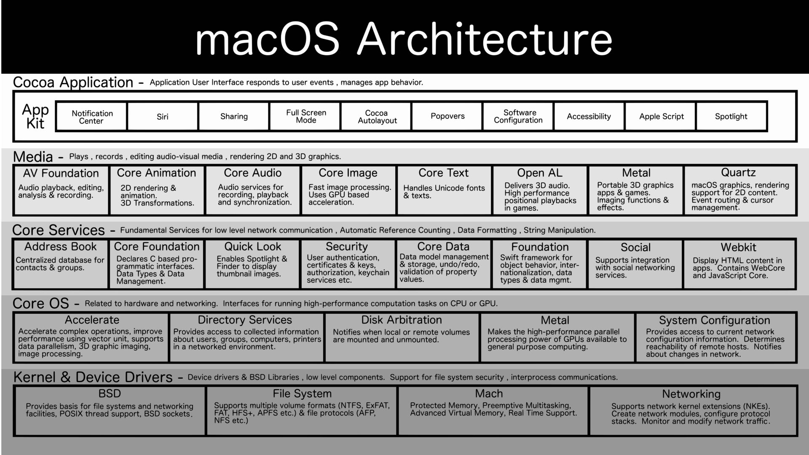
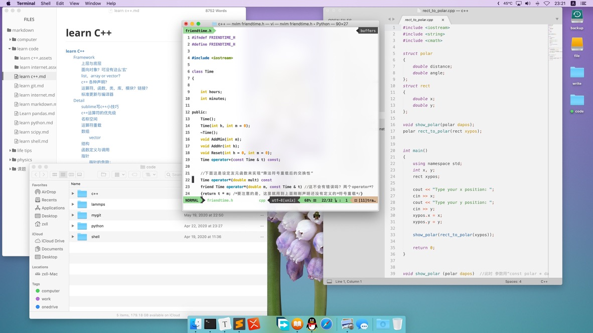
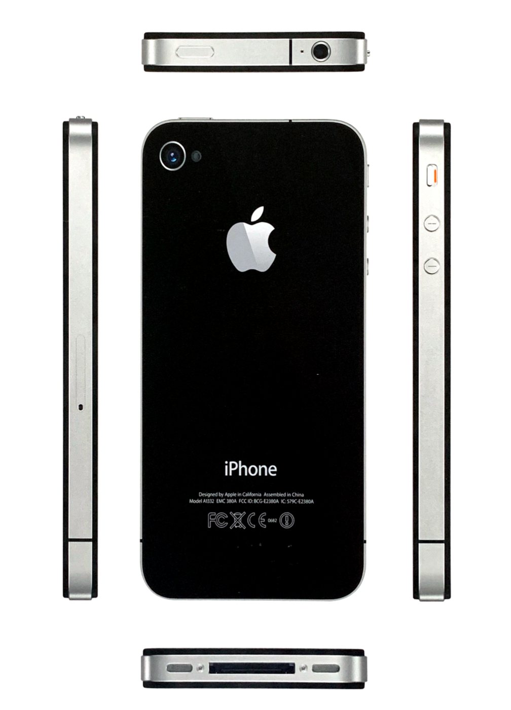
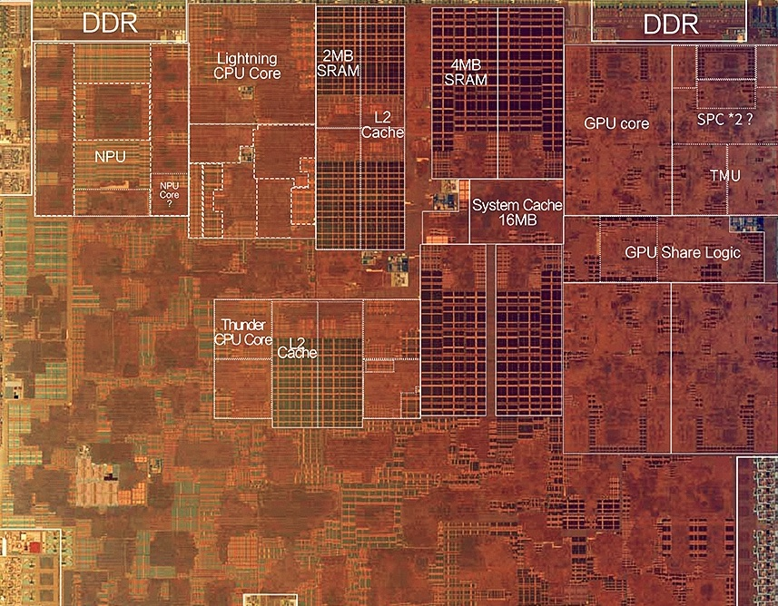

# learn swift

[toc]

swift是一门语言，语言本身和操作系统，硬件，API等都是没有关系的，但因为swift是有Apple创造的（虽然现在是开源的）用于且仅用于Apple产品的软件开发，目前由指IOS和MacOS的软件开发。（理论上也可以做其他操作系统的适配，但是没“人”做，将来也几乎没有“人”去做，微软有c#，c++，谷歌有java）所以呢，这就不仅仅是学习一门语言，所以这个名字也不太恰当——这应该是Apple 软硬件生态的软件开发学习。

## 框架

所以我们从一开始就不应该拿过语言来学习（比如怎么声明量，函数或者类，然后有哪些“新”特性），而是先了解Mac系统的框架：

### 设计模式

MVC设计模式是MacOS一直以来遵循的设计模式，原理顾名思义：M=Model, V=View, C=Controler：

Model就是为了实现功能的那部分代码的集合，比如某些无可视化界面的app只需要这部分就可以，然后在terminal中通过指令运行。而View更容易理解，就是可视化界面的设计，特殊的在Apple设备中，界面设计一致是行业典范，而它也提供了“易用”统一的接口（API）使得开发者编写的软件能有较为统一的设计语言，而不难理解，Model和View是相对独立的，改变UI的设计不影响Model的计算过程和输入输出，比如微信登陆界面换成半透明的漂亮界面，甚至加入动画，这不影响你只是输入你的账号和密码，交由Model来联网验证微信服务器，从而执行下一步操作。

### Cocoa框架

这就是MacOS操作系统根据MVC模式，适用于Objective-C和swift语言设计的一整套系统APIs的具体实现。

系统级API也就是操作系统为“我们”（软件开发者）做的“事”，这包括太多，比如内存管理（你的软件如何动态使用和管理内存），文件系统（你的软件怎么写入和读取“文件”），图形界面（你的软件窗口如何被随意的移动，伸缩），网络协议（你的软件如何遵守互联网协议访问某个服务器并收发数据）等等。

而根据这个MVC模式，我们可以把这些API也有关于图形界面的和———在cocoa框架中，被称为AppKit（IOS平台是UIkit）。其实三者均是swift和Objective-C语言可以调用的API的集合。

### API

* 一些底层的API，比如文件系统，SocketAPI，Ports，都是在[Foundation](https://developer.apple.com/documentation/foundation)库中。

* IO怎么访问？IOkit就是系统扩展输入输出的API，用于写驱动程序，现在苹果开发了[Drivekit](https://developer.apple.com/cn/system-extensions/)来替代IOkit。

* 更“高级简单”的网络接口呢？[webkit](https://developer.apple.com/documentation/webkit)是苹果买断研发并开源的浏览器内核。

  

##### AppKit，UIkit，SwiftUI，Metal，它们之间是怎么关系呢？

Metal是图形API，它构建在GPU硬件及显卡驱动之上，但是即将全线使用自研芯片的Apple，Metal就可以直接是在自研的GPU硬件架构上优化了。
GPU或者说图像处理的流程就要到计算机图形学中探讨了。

Metal的设计概念也就是计算机图形学的部分，对应于网络就像是实现网络协议的部分，像是SocketAPI，而AppKit是在其之上构建的专门针对于窗口动画等图形界面的进一步封装，对应于网络的WebKit。

UIkit是iOS端类似于MacOS的AppKit的图形界面API，而SwiftUI是在WWDC2019上首次提出，在UIKit和AppKit之上构建的Apple全平台图形界面API，而后会逐渐砍掉前两者。

### Apple产品自研之路

在对Mac软硬件系统的深入了解下，也能渐渐理解为何Apple凭借屈指可数的产品线就成为市值第一的公司。他们对自己产品的深入理解超过任何一家企业。我们来简单回顾Apple产品自研之路，此时我们不再只能看到表面的工业设计（这就是电子产品的脸）：

* GUI设计：被认为是Apple成立之初核心竞争力所在，但这时我们要注意，Mac系统是基于开源UNIX，也就是系统内核并不是Apple自研，包括文件系统，和一些基础的API，比如IOKit等也并非自研。当时主要是GUI设计。而对于GUI的实现细节，足以成篇大论，比如圆角设计，配色选择，系统过度动画，字体设计渲染，Apple几乎都做到行业顶端。这些才是Apple之处在软件方面的核心竞争力之一。

  

* 工业设计：这也是Apple的核心竞争力之一，这一点是普通消费者最看重的，也是很多“果粉”和“果黑”的争执重点之一。不得不说，一家电子产品公司像奢侈品公司一样注重工业设计，工艺，产品质量是极其可贵的，这也的确是Apple的魅力所在。iPhone4，iPhone7，iPad pro11，MacbookAir，MacPro，iMac，Apple Watch这些经典设计会载入史册。（额……iPhone 11pro的丑也会载入史册的，前刘海后浴霸，这倒车开的猝不及防）

  

* Clang&LLVM编译器：Apple注重自己产品的运行效率（谁不想呢？只是做到很难），而系统主要用类c语言写，而Mac软件开始是用Objective-C写（API对其适配），但GNU不给力，最终还是自己做吧：Chris Lattner，苹果开发LLVM编译器的主导者，人才是企业和国家发展的原材料啊！
* HFS/APFS文件系统：开始苹果使用开源的文件系统，但这远不及Mac发展的步伐，而文件系统也是实现高效率检索的底层基础，而经过几代发展，APFS文件系统已十分优异，Apple产品的Spotlight搜索也是竞争对手目前难以企及的。（当然从效率，安全性等角度，微软的NTFS文件系统也毫不逊色）
* iCloud/AppStore云服务：利用服务器打通产品之间，用户之间的界限，这不是苹果首创，但凭借其完整的生态，iCloud和AppStore的完成度几乎是无人出其右，而设备间互联互通也成为Apple的核心竞争力之一。
* A系列ARM芯片：iPhone4的A4处理器开启了Apple的辉煌造芯之路，但没有一个人能一口吃成胖子，A4基本就是三星的ARM架构，做的优化也不多。Jim Keller，真的可以说是芯片一哥了，A系列处理器和AMD的两次辉煌架构，其中就有最近来的zen架构，都是由其操刀。
但后来的优化主要是CPU，A系列的自研GPU直到A11才问世，但只优化了一年，A12的GPU就吊打竞争对手了。（A系列的芯片尤其是CPU也没有太多架构上的神奇创新，超大Cache狂碓料，单款芯片走量无敌强行降低成本，）称之为核心竞争力有点牵强，但芯片绝对是构建整个生态的基础。

> 芯片设计本身相对于软件没有太多“可玩性”，这有些类似城市规划路线的感觉，就是各部门都要协同工作，但总的有离得远的，目的就是统筹规划让总体效率最高。

* Metal API：API有大有小，图形API属于工作量比较大的，（小的肯定不能说，因为这就是软件公司分内工作，图形处理对现代计算机太重要，所以GUI也单独说了）所以还可以单独拿出来说一说：这也属于操作系统的一部分，是负责封装GPU处理图形的代码集，而在很久一段时间内，Apple使用OpenGL作为其图形API，而隔壁家微软早就研发了自己的DirectX，加上其对游戏的布局，Windows打游戏甩开Mac一万条街。而借助Metal+AppleAcade+ARM版Mac三板斧，轻松移植IOS创造的游戏，接下来几年，Mac可能在游戏上会有所进步。Apple把Metal内核开源（公开源代码）了。

* Swift 语言：这谈不上是像c一样多么划时代的语言，但是它也像众多现代编程语言一样，继承发展了众多语言的优点，比如自动内存管理，闭包，运算符重载……比起Objective-C还是显著提高Apple生态应用开发速度的。提一句，还是这哥们——Chris Lattner——发明的，且后来Apple把它开源（公开源代码）了。

* 较为出色的原生app：Apple地图被吐槽多次，Xcode也见仁见智，但Apple的确还是设计了很多出色的原生app：
天气（简约篇讲的界面，实时更新的动画背景和当前天气一致是真的amazing）
App Store（不用多说，世上只有一个App Store）
相册（ios13之后，不再只有漂亮的外观，修图等功能性也不错，再有live photo和iCloud相册加持，不逊于Google相册了吧，再者，你想在windows上看照片？）
图书/preview（iOS其实也没啥，替代品一堆，但是Mac端一对比pc，啥都能预览，是真的舒服）
股市（世上好像也只有一个能看的股票app）Safari（可能没有Chrome功能多，但MacOS big sur之后大更新了，简约，同步，隐私，还有自动填充密码，By the way, 浏览器内核WebKit 最初是Apple买来开发的，后来把它开源了，Chrome内核也是在此基础改进的）
地图（功能是挺垃圾的，但界面设计我觉得国产应用真的应该学习学习）
还有日历时钟信息等，也都有不少优点，总的来说，Apple原生的app，不仅是能用，不少挺好用。当然这部分有些重复，因为一部分是GUI的，一部分是iCloud的。

* 接口：硬件不只有芯片，内存，硬盘，屏幕，接口都是重要组成。而这就不得不提三星的牛逼了，内存硬盘屏幕一把抓，你买谁家都是我挣钱。
目前主流趋势接口标准雷电3（使用物理接口USBTypeC，具体接口可以看我讲接口一篇），intel是协议主要制定者（intel在接口上也不挤牙膏嘛），Apple也参与制定并力推。
lightning接口并iOS设备独占（被骂靠卖线发家）。平心而论在TypeC出世之前，lightning接口难道不是好太多了吗——对称随便插，体积小。
还有几年前MacBook的MagSafe（可惜不复返了），apple watch的无线充电器，都是amazing的设计。

* 软硬件技术的技术创新：多点触控（防误触算法），指纹解锁（指纹识别算法），HDR照片（ISP），3DTouch， Face ID（人脸识别算法，不同于普通机器学习人脸识别的算法）且刘海虽丑，有时人脸不如指纹方便，但技术本身没错，很完善，称得上科技史上的一大发明。

* Carplay 和Home Kit 两大API：这两个API的开发，其实有些非常重要的意义，是讲计算机产业的创造力辐射到传统行业，带动产业联动发展的一大步，传统产业智能化，万物互联其实发展在5G之前（包括大数据，云计算，说什么5G是其基础的都是忽悠人，间接制造行业泡沫的，5G只能说是加速并更好的实现上述4个领域罢了）

* 辅助功能：VioceOver 很好用，虽然我不是残疾人。谷歌做的也不错，这点不是情怀，社会上总有弱势群体，有点像是水滴筹，给有困难的人做点举手之劳，这世界可能就更好了，更好的世界自己也享受其中。

* 广告：这不是一个技术公司干的事儿，但是Apple几乎是最会做广告的技术公司（完全为了严谨，看它广告，基本上就认为它是个广告公司）这也不无道理，因为GUI到工业设计，Apple的审美一直是业界标杆，广告自然也是审美问题。（买Apple产品一定要看看它的广告，就算你不欣赏，想想你花的钱多少给它拍广告了？不看不亏吗）

说到这里我就想到：比如我不残疾，那么Apple开发辅助功能这部分钱，我就相当于捐的，因为我从不用这部分功能，但一想人家是残疾人，不容易，就捐给他们吧。
与此类推：Apple为其产品做了这么多，如果你不用iCloud，那Apple用来开发iCloud 的这部分，你就捐给了用这个功能的人。（因为由于你的购买，销量增加，产量增加，成本下降，相当于你瘫了这部分成本）
同理所有商品均是如此。（因为这就是劳动交换的过程，反正你劳动了，拿了工资，花了结果没有获得别人的劳动成果，反而替别人分摊了成本）一直类推：请问你拥有的所有商品，捐了百分之多少呢？而你的劳动，又有百分之多少转化成了劳动产物呢？