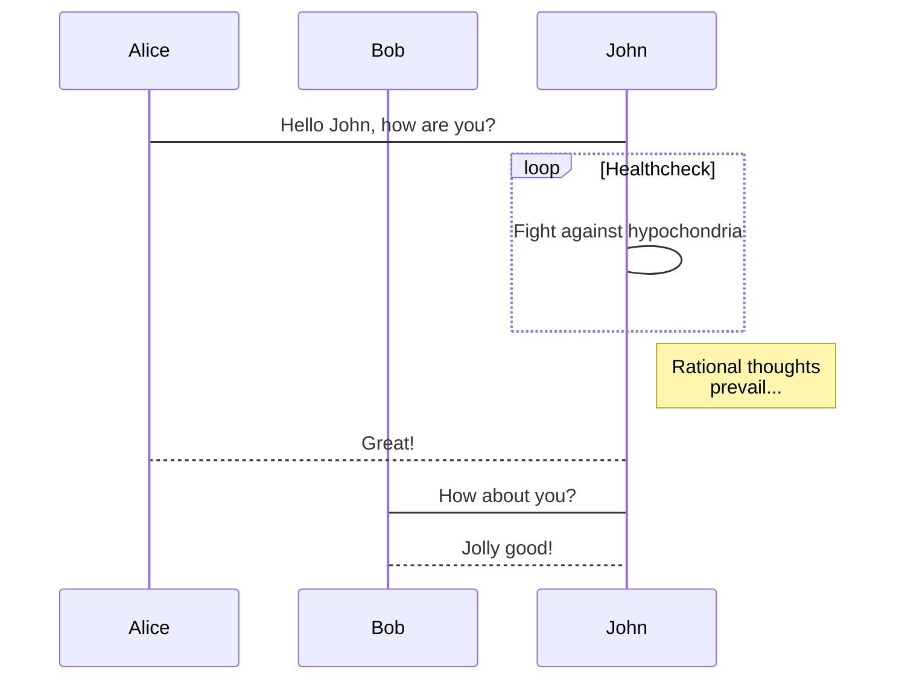
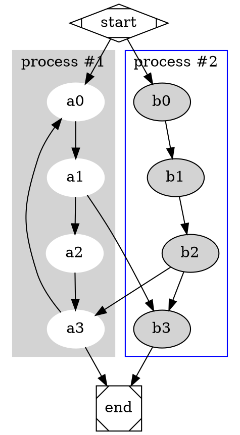

# Markdown syntax

## The first thing you should know

What every Markdwon user should know is the official version. How was it created? What is its design philosophy and grammar? If you haven't seen it, it is recommended to check out this: **[Markdown syntax guide full version](mweblib://14187318449184)**.

The syntax used by MWeb is Github Flavored Markdown (GFM) syntax. GFM is an extended version of the official version. In addition to supporting the official syntax, it also supports tables, TOC, LaTeX, code blocks, task lists, footnotes, and more.

In addition, MWeb also supports two more useful grammars based on GFM grammar compatibility: drawing support (mermaid, viz, echarts, plantuml, sequence, flow) and setting the image width, which will be explained in detail below.

## Philosophy

> Markdown is intended to be as easy-to-read and easy-to-write as is feasible.
> Readability, however, is emphasized above all else. A Markdown-formatted document should be publishable as-is, as plain text, without looking like it's been marked up with tags or formatting instructions.
> Markdown's syntax is intended for one purpose: to be used as a format for *writing* for the web. 

<!-- more -->

## Notice

If you see writing `Result:`, you can see the result only by using `CMD + 4` or `CMD + R` preview in MWeb. You can download this post and open it in MWeb to see the result. The download URL is: [Download this post Markdown text](media/15305971422667/markdown%20syntax.md)

## Headers

**Example:**

```
# This is an `<h1>` tag
## This is an `<h2>` tag
###### This is an `<h6>` tag
```

**Result:**

# This is an `<h1>` tag
## This is an `<h2>` tag
###### This is an `<h6>` tag

## Emphasis

**Example:**

```
*This text will be italic*
_This will also be italic_

**This text will be bold**
__This will also be bold__
```

**Shortcuts:**  `CMD + U`、`CMD + I`、`CMD + B`
**Result:**

*This text will be italic*
_This will also be italic_

**This text will be bold**
__This will also be bold__

## Newlines

End a line with two or more spaces + enter.
Just typing enter to newline,please set：`Preferences` - `Themes` - `Translate newlines to <br> tags`  enable ( default is enable )

## Lists

### Unordered

**Example:**

```
* Item 1 unordered list `* + SPACE`
* Item 2
	* Item 2a unordered list `TAB + * + SPACE`
	* Item 2b
```

**Shortcuts:**  `Option + U`
**Result:**

* Item 1 unordered list `* + SPACE`
* Item 2
	* Item 2a unordered list `TAB + * + SPACE`
	* Item 2b

### Ordered

**Example:**

```markdown
1. Item 1 ordered list `Number + . + SPACE`
2. Item 2 
3. Item 3
	1. Item 3a ordered list `TAB + Number + . + SPACE`
	2. Item 3b
```

**Result:**

1. Item 1 ordered list `Number + . + SPACE`
2. Item 2 
3. Item 3
	1. Item 3a ordered list `TAB + Number + . + SPACE`
	2. Item 3b

### Task lists

**Example:**

```
- [ ] task one not finish `- + SPACE + [ ]`
- [x] task two finished `- + SPACE + [x]`
```

**Result:**

- [ ] task one not finish `- + SPACE + [ ]`
- [x] task two finished `- + SPACE + [x]`

## Images

**Example:**

```

Format: 
```

**Shortcuts:**  `Control + Shift + I`
The Library's document support drag & drop or `CMD + V` paste or `CMD + Option + I` to insert  the pictrue.
**Result:**


In MWeb, you can use `-w + Number` to control image width, for example, set the image width 140px:

```

```


In MWeb, you can also set the alignment of the image. Take the above image as an example. The left alignment is `-l140`, the center is `-c140`, and the right is `-r140`.


## Links

**Example:**

```
email <example@example.com>
[GitHub](http://github.com)
autolink  <http://www.github.com/>
```

**Shortcuts:**  `Control + Shift + L`
The Library's document support drag & drop or `CMD + Option + I` to insert attachment.
**Result:**

An email <example@example.com> link.
[GitHub](http://github.com)
Automatic linking for URLs
Any URL (like <http://www.github.com/>) will be automatically converted into a clickable link.

## Blockquotes

**Example:**

```
As Kanye West said:
> We're living the future so
> the present is our past.
```

**Shortcuts:**  `CMD + Shift + B`
**Result:**

As Kanye West said:
> We're living the future so
> the present is our past.

## Inline code

**Example:**

```
I think you should use an
`<addr>` `code` element here instead.
```

**Shortcuts:**  `CMD + K`
**Result:**

I think you should use an
`<addr>` `code` element here instead.

## Multi-line code

**Example:**

	```js
	function fancyAlert(arg) {
	  if(arg) {
	    $.facebox({div:'#foo'})
	  }
	
	}
	```

**Shortcuts:**  `CMD + Shift + K`
**Result:**

```js
function fancyAlert(arg) {
  if(arg) {
    $.facebox({div:'#foo'})
  }

}
```

## MWeb Drawing

### mermaid

Mermaid is a popular js graphics library. It supports flowcharts, sequence diagrams and Gantt charts. Its official website is: <https://mermaidjs.github.io/>. The syntax for using mermaid in MWeb is to declare code blocks. The language is mermaid, and the mermaid drawing syntax can be written in the code block. You can copy the following syntax into MWeb to view the result.

    ```mermaid
    sequenceDiagram
        participant Alice
        participant Bob
        Alice->John: Hello John, how are you?
        loop Healthcheck
            John->John: Fight against hypochondria
        end
        Note right of John: Rational thoughts <br/>prevail...
        John-->Alice: Great!
        John->Bob: How about you?
        Bob-->John: Jolly good!
    ```

**Result：**



### Graphviz

Graphviz is an open source graph visualization software and its official website is <http://www.graphviz.org/>. MWeb uses the implementation of Graphviz's js version <http://viz-js.com/>, which can parse the Graphviz syntax to generate images. You can try the following syntax to copy it into MWeb. When you try, you can change the dot to circo, fdp, neato, osage, twopi to try the result.

    ```dot
    # http://www.graphviz.org/content/cluster
    digraph G {
    
    	subgraph cluster_0 {
    		style=filled;
    		color=lightgrey;
    		node [style=filled,color=white];
    		a0 -> a1 -> a2 -> a3;
    		label = "process #1";
    	}
    
    	subgraph cluster_1 {
    		node [style=filled];
    		b0 -> b1 -> b2 -> b3;
    		label = "process #2";
    		color=blue
    	}
    	start -> a0;
    	start -> b0;
    	a1 -> b3;
    	b2 -> a3;
    	a3 -> a0;
    	a3 -> end;
    	b3 -> end;
    
    	start [shape=Mdiamond];
    	end [shape=Msquare];
    }
    ```

**Result：**



### echarts

Echarts is a js graph library of Baidu. Its website is <http://echarts.baidu.com/index.html>. It is very powerful. MWeb supports some basic usages of echarts. You can try the following syntax to copy it into MWeb. You can also go to the <http://echarts.baidu.com/examples/index.html> URL to see some examples. Note that MWeb can only parse `option = {}` which is simple but should be enough used.

    ```echarts
    option = {
        xAxis: {
            type: 'category',
            data: ['Mon', 'Tue', 'Wed', 'Thu', 'Fri', 'Sat', 'Sun']
        },
        yAxis: {
            type: 'value'
        },
        series: [{
            data: [820, 932, 901, 934, 1290, 1330, 1320],
            type: 'line'
        }]
    };
    ```

**Result：**

```echarts
option = {
    xAxis: {
        type: 'category',
        data: ['Mon', 'Tue', 'Wed', 'Thu', 'Fri', 'Sat', 'Sun']
    },
    yAxis: {
        type: 'value'
    },
    series: [{
        data: [820, 932, 901, 934, 1290, 1330, 1320],
        type: 'line'
    }]
};
```

### plantuml

The website of plantuml is: <http://www.plantuml.com/>, you can learn more directly. The way MWeb supports plantuml is to reference the images generated by the plantuml server. You can copy the following syntax into MWeb to try.

    ```plantuml
    @startuml
    
    User -> (Start)
    User --> (Use the application) : A small label
    
    :Main Admin: ---> (Use the application) : This is\nyet another\nlabel
    
    @enduml
    ```

**Result:**

```plantuml
@startuml
    
User -> (Start)
User --> (Use the application) : A small label
    
:Main Admin: ---> (Use the application) : This is\nyet another\nlabel
    
@enduml
```

### Sequence diagram and flow chart

The sequence diagram and flow chart are using <http://bramp.github.io/js-sequence-diagrams/>, <http://adrai.github.io/flowchart.js/> It's Markdown syntax in MWeb.

	```sequence
	å¼ ä¸‰->李四: 嘿，小四儿, 写博客了没?
	Note right of 李四: 李四愣了一下，说：
	李四-->å¼ ä¸‰: 忙得吐血，哪有时间写。
	```
	
	```flow
	st=>start: 开始
	e=>end: 结束
	op=>operation: 我的操作
	cond=>condition: 确认？
	
	st->op->cond
	cond(yes)->e
	cond(no)->op
	```

**Result：**

```sequence
å¼ ä¸‰->李四: 嘿，小四儿, 写博客了没?
Note right of 李四: 李四愣了一下，说：
李四-->å¼ ä¸‰: 忙得吐血，哪有时间写。
```

```flow
st=>start: 开始
e=>end: 结束
op=>operation: 我的操作
cond=>condition: 确认？

st->op->cond
cond(yes)->e
cond(no)->op
```

## Tables

**Example:**

```
First Header | Second Header
------------ | -------------
Content from cell 1 | Content from cell 2
Content in the first column | Content in the second column
```

You can create tables by assembling a list of words and dividing them with hyphens - (for the first row), and then separating each column with a pipe |:

**Result:**

First Header | Second Header
------------ | -------------
Content from cell 1 | Content from cell 2
Content in the first column | Content in the second column


## Strikethrough

**Example:**

	 (like ~~this~~)

**Result:**

Any word wrapped with two tildes (like ~~this~~) will appear crossed out.

## Horizontal Rules

Following lines will produce a horizontal rule:

	***
	
	*****
	
	- - -

**Result:**

***

*****

- - -

## MathJax

Use double US dollors sign pair for Block level Math formula, and one US dollor sign pair for Inline Level.

```
For example this is a Block level $$x = {-b \pm \sqrt{b^2-4ac} \over 2a}$$ formula, and this is an inline Level $x = {-b \pm \sqrt{b^2-4ac} \over 2a}$ formula.

\\[ \frac{1}{\Bigl(\sqrt{\phi \sqrt{5}}-\phi\Bigr) e^{\frac25 \pi}} =
1+\frac{e^{-2\pi}} {1+\frac{e^{-4\pi}} {1+\frac{e^{-6\pi}}
{1+\frac{e^{-8\pi}} {1+\ldots} } } } \\]

```

**Result:**

For example this is a Block level $$x = {-b \pm \sqrt{b^2-4ac} \over 2a}$$ formula, and this is an inline Level $x = {-b \pm \sqrt{b^2-4ac} \over 2a}$ formula.

\\[ \frac{1}{\Bigl(\sqrt{\phi \sqrt{5}}-\phi\Bigr) e^{\frac25 \pi}} =
1+\frac{e^{-2\pi}} {1+\frac{e^{-4\pi}} {1+\frac{e^{-6\pi}}
{1+\frac{e^{-8\pi}} {1+\ldots} } } } \\]

## Footnote

**Example:**

```
This is a footnote:[^sample_footnote]
```

**Result:**

This is a footnote:[^sample_footnote]

[^sample_footnote]: footnote text detail...

## Comment And Read More..

<!-- comment -->
<!-- more -->
Actions->Insert Read More Comment *OR* `CMD + .`

## TOC

**Example:**

```
[TOC]
```

**Result:**

[TOC]