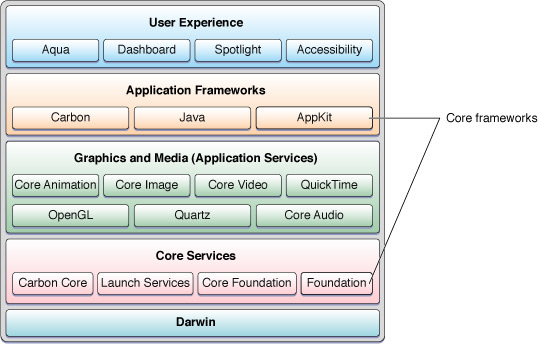

# learn swift

[toc]

swift是一门语言，语言本身和操作系统，硬件，API等都是没有关系的，但因为swift是有Apple创造的（虽然现在是开源的）用于且仅用于Apple产品的软件开发，目前由指IOS和MacOS的软件开发。（理论上也可以做其他操作系统的适配，但是没“人”做，将来也几乎没有“人”去做，微软有c#，c++，谷歌有java）所以呢，这就不仅仅是学习一门语言，所以这个名字也不太恰当——这应该是Apple 软硬件生态的软件开发学习。

## 框架

### 总体框架

所以我们从一开始就不应该拿过语言来学习（比如怎么声明量，函数或者类，然后有哪些“新”特性），而是先了解Mac系统的框架：

**由Apple的[Documentation Archive](https://developer.apple.com/library/archive/navigation/)网站的目录，我们也能看到清晰的架构图：**

- [Cocoa Layer](https://developer.apple.com/library/archive/navigation/#section=Frameworks&topic=Cocoa Layer)

- - AddressBookUI
  - AppKit
  - ContactsUI
  - Intents
  - MapKit
  - MessageUI
  - Messages
  - ReplayKit
  - ScreenSaver
  - SecurityInterface
  - TVMLKit
  - Twitter
  - UIKit
  - WatchKit
  - iAd

- [Web Services](https://developer.apple.com/library/archive/navigation/#section=Frameworks&topic=Web Services)

- - Safari Extensions
  - iAd JS

- [Media Layer](https://developer.apple.com/library/archive/navigation/#section=Frameworks&topic=Media Layer)

- - ARKit
  - AVFoundation
  - AVKit
  - AudioToolbox
  - AudioUnit
  - AudioVideoBridging
  - CoreAudio
  - CoreGraphics
  - CoreImage
  - CoreMIDI
  - CoreText
  - CoreVideo
  - DVDPlayback
  - DiscRecording
  - GLKit
  - GameController
  - IMServicePlugIn
  - ImageIO
  - InstantMessage
  - MediaLibrary
  - Metal
  - Metal Performance Shaders
  - ModelIO
  - OpenAL
  - OpenGL
  - OpenGLES
  - Photos
  - QTKit
  - Quartz
  - QuartzCore
  - QuickTime
  - SceneKit
  - SpriteKit

- [Core Services Layer](https://developer.apple.com/library/archive/navigation/#section=Frameworks&topic=Core Services Layer)

- - AddressBook
  - ApplePay JS
  - ApplicationServices
  - Automator
  - CFNetwork
  - CalendarStore
  - CallKit
  - Carbon
  - CloudKit
  - Collaboration
  - Contacts
  - CoreData
  - CoreFoundation
  - CoreLocation
  - CoreMedia
  - CoreMotion
  - CoreServices
  - CryptoTokenKit
  - EventKit
  - Foundation
  - GameCenter
  - GameplayKit
  - HealthKit
  - HomeKit
  - InputMethodKit
  - InterfaceBuilderKit
  - JavaScriptCore
  - LatentSemanticMapping
  - MultipeerConnectivity
  - OpenDirectory
  - PassKit
  - PublicationSubscription
  - PushKit
  - QuickLook
  - SafariServices
  - ScriptingBridge
  - Security
  - ServiceManagement
  - Speech
  - StoreKit
  - SyncServices
  - WatchConnectivity
  - WebKit
  - WebObjects

- [Core OS Layer](https://developer.apple.com/library/archive/navigation/#section=Frameworks&topic=Core OS Layer)

- - Accelerate
  - CoreBluetooth
  - DirectoryService
  - DiskArbitration
  - ExternalAccessory
  - LocalAuthentication
  - NetworkExtension
  - OpenCL
  - System
  - SystemConfiguration
  - XCTest
  - XgridFoundation

- [Kernel & Driver Layer](https://developer.apple.com/library/archive/navigation/#section=Frameworks&topic=Kernel %26amp%3B Driver Layer)

- - IOBluetooth
  - IOKit
  - ImageCaptureCore
  - Kernel

计算机大框架都是如出一辙，不会有本质的变化的，也就是层层抽象———从硬件到操作系统到API到软件的总体框架。而对于MacOS，我们做的当然是看看Apple对此的具体实现形式是什么，再来讨论它们的优缺点（这会是很后来的事儿了）。

>[Mac架构](https://guofanbang.com/macos结构知多少，一看就懂了.html)
>
>前身
>
>1985年，乔布斯在内部斗争失败，离开苹果创建了NeXT，在NeXT中，他的团队基于Mach和BSD创建了一款类Unix的面向对象的操作系统——NeXTSTEP，1996年乔布斯回归苹果之后，这款先进于Classic Mac OS的操作系统也随之来到了苹果，最终取代了比较原始的Classic Mac OS。
>
>Darwin Operarting System
>
>[Apple内核开发官方文档](https://developer.apple.com/library/archive/documentation/Darwin/Conceptual/KernelProgramming/Architecture/Architecture.html)
>Darwin是macOS的基础部分（或者称为Core OS），它也是一款开放源代码的类Unix操作系统。它大体由两部分组成：XNU内核和Unix工具。
>
>由于开放源代码的特性，所以一些组织正在利用苹果释出的Darwin源码进行二次开发，比如PureDarwin项目。
>
>XNU
>
>我们通常会说macOS的内核是“Darwin”，其实这是一个不严谨的说法，因为Darwin不只包含内核，还包括其他东西。严格来说macOS的内核是XNU。
>
>说到这里，插一句题外话，苹果有一个自相矛盾的地方，虽然macOS已经通过Unix认证，然而XNU的全称和GNU格式一样，是XNU’s not Unix，顾名思义，XNU不是Unix。
>
>XNU是macOS的核心部分，它是一款结合了微内核与宏内核特性的混合内核，它包括三个部分：Mach、BSD和I/O Kit。
>
>Mach
>
>Mach原来是一款微内核，XNU中的Mach来自于OSFMK 7.3（Open Software Foundation Mach Kernel)）它负责CPU调度、内存保护等功能。它是macOS内核中最重要的部分，XNU中大部分代码来自于它，而且macOS中的可执行文件也是mach-o格式。
>
>BSD
>
>XNU中包含一个经过修改的BSD，它负责进程管理、Unix文件权限、网络堆栈、虚拟文件系统、POSIX兼容。macOS之所以符合单一Unix规范，也正是因为如此。
>
>I/O Kit
>
>I/O Kit是XNU内核中的开源框架，可帮助开发人员为Apple的macOS和iOS操作系统编写设备驱动程序代码。I/O Kit框架由NeXTSTEP的DriverKit演变而来，与Mac OS 9的设备驱动程序框架或BSD的没有任何相似之处。
>
>命令行工具
>
>除了内核以外，Darwin还包括一些Unix工具，这些Unix工具一些是Apple开发，一些来自于第三方，比如FreeBSD Project、GNU Project、Apache。
>
>初始化程序launchd
>
>Launchd由苹果开发，它是一款统一服务管理框架，用于启动，停止和管理macOS中的守护进程，应用程序，进程和脚本。由于它支持多线程，所以它比传统的Unix初始化程序SysVinit要高，launchd同时正在被移植到FreeBSD平台，它的设计思想也被systemd所借鉴，后者成为目前Linux发行版中的主流系统初始化程序。
>
>Core Foundation
>
>Core Foundation（也称为CF）是macOS和iOS中的C应用程序编程接口（API），是低级例程和包装函数的混合。
>
>Core Graphics
>
>The Core Graphics framework is based on the Quartz advanced drawing engine. It provides low-level, lightweight 2D rendering with unmatched output fidelity. You use this framework to handle path-based drawing, transformations, color management, offscreen rendering, patterns, gradients and shadings, image data management, image creation, and image masking, as well as PDF document creation, display, and parsing.
>In macOS, Core Graphics also includes services for working with display hardware, low-level user input events, and the windowing system.
>
>Quartz
>
>macOS毕竟是类Unix操作系统，类Unix操作系统想要进行图形化操作，必须要有一个图形框架，在Linux上我们有X11，有Wayland，在macOS中，我们有Quartz。它是一款基于PDF技术的图形框架。
>
>作为一个类unix，不兼容X11是不可能的，如果你想在macOS中运行X11应用，也可以，有个开源项目叫XQuartz了解一下。
>
>Cocoa
>
>Cocoa是苹果公司为Mac OS X所创建的原生面向对象的API，是Mac OS X上五大API之一（其它四个是Carbon、POSIX、X11和Java）。
>
>苹果的面向对象开发框架，用来生成Mac OS X的应用程序。主要的开发语言为Objective-c,一个c的超集。Cocoa开始于1989年9月上市的NeXTSTEP 1.0，当时没有Foundation框架，只有动态运行库，称为kit,最重要的是AppKit. 1993年NeXTSTEP 3.1被移植到了Intel, Sparc, HP的平台上，Foundation首次被加入，同时Sun和NeXT合作开发OpenStep也可以运行在Windows系统上VCV。
>
>据说Cocoa API里面到现在还有不少NS开头的API，何为NS？NS者，NeXTSTEP也。
>
>Spotlight
>
>10.4（Tiger）中引入的快速搜索技术，从iOS3.0开始被移植到iOS。其背后的核心力量是一个索引服务器mds，mds在MetaData框架中，是一个没有GUI的后台服务。在命令行可以通过mdxxx访问。
>
>Aqua UI
>
>macOS的桌面环境，类似Linux中的GNOME。
>
>不过，不是所有Mac OS X都是Aqua UI，在Mac OS X早期测试版Rhapsoy中，用的还是经典的Classic Mac OS界面。
>
>系统的第一个用户进程launchd负责启动GUI，支持GUI工作的主进程是WindowServer。这个程序是CoreGraphics框架的一部分，而CoreGraphics框架深深藏在另一个框架ApplicationServices中。
>
>WindowServer的代码实际上不完成任何实际工作，而是由CoreGraphics中的CGXServer函数完成。CGXServer会检查自己是否以何种方式运行，然后在后台fork出子进程，当子进程准备好后，LoginWindow（由launchd启动）启动交互式登录过程。LoginWindow的配置文件/etc/ttys。
>
>[傻傻分不清：Quartz2D、QuartzCore、CoreAnimation、CoreImage、CoreGraphics](https://www.jianshu.com/p/397690fd4555)
>
>1. Quartz2D是CoreGraphics的一部分API的抽象，不是实际存在的.framework
>2. CoreGraphics定义了颜色、位置、字体、路径、图片等UIKit的常见属性。是构成UIKit的基石。
>3. QuartzCore和CoreAnimation是雌雄同体的同义词。
>4. CoreAnimation定义了动画类来对layer做动画，定义了layer来呈现内容。定义了仿射变换来做3D动画。
>5. CoreImage定义了滤镜，来对图片进行颜色过滤混合等操作。
>
>PS：UIKit里的UIView，封装了layer来呈现内容，内容通过CoreGraphics来绘制到layer上，其中位置、大小、颜色，也都在CoreGraphics里定义了。并且加上了用户事件，用来响应用户的输入、点击、拖拽等操作。

### 设计模式

MVC设计模式是MacOS一直以来遵循的设计模式，原理顾名思义：M=Model, V=View, C=Controler：

Model就是为了实现功能的那部分代码的集合，比如某些无可视化界面的app只需要这部分就可以，然后在terminal中通过指令运行。而View更容易理解，就是可视化界面的设计，特殊的在Apple设备中，界面设计一致是行业典范，而它也提供了“易用”统一的接口（API）使得开发者编写的软件能有较为统一的设计语言，而不难理解，Model和View是相对独立的，改变UI的设计不影响Model的计算过程和输入输出，比如微信登陆界面换成半透明的漂亮界面，甚至加入动画，这不影响你只是输入你的账号和密码，交由Model来联网验证微信服务器，从而执行下一步操作。

### Cocoa框架

这就是MacOS操作系统根据MVC模式，适用于Objective-C和swift语言设计的一整套系统APIs的具体实现。

系统级API也就是操作系统为“我们”（软件开发者）做的“事”，这包括太多，比如内存管理（你的软件如何动态使用和管理内存），文件系统（你的软件怎么写入和读取“文件”），图形界面（你的软件窗口如何被随意的移动，伸缩），网络协议（你的软件如何遵守互联网协议访问某个服务器并收发数据）等等。

而根据这个MVC模式，我们可以把这些API也有关于图形界面的和———在cocoa框架中，被称为AppKit（IOS平台是UIkit）。其实三者均是swift和Objective-C语言可以调用的API的集合。

### API

* 一些底层的API，比如文件系统，SocketAPI，Ports，都是在[Foundation](https://developer.apple.com/documentation/foundation)库中。

* IO怎么访问？IOkit就是系统扩展输入输出的API，用于写驱动程序，现在苹果开发了[Drivekit](https://developer.apple.com/cn/system-extensions/)来替代IOkit。

* 更“高级简单”的网络接口呢？[webkit](https://developer.apple.com/documentation/webkit)是苹果买断研发并开源的浏览器内核。

  

##### 关于图形的就复杂了一些：AppKit，UIkit，SwiftUI，Metal，它们之间是怎么关系呢？

Metal是图形API，它构建在GPU硬件及显卡驱动之上，但是即将全线使用自研芯片的Apple，Metal就可以直接是在自研的GPU硬件架构上优化了。
GPU或者说图像处理的流程就要到计算机图形学中探讨了。

Metal的设计概念也就是计算机图形学的部分，对应于网络就像是实现网络协议的部分，像是SocketAPI，而AppKit是在其之上构建的专门针对于窗口动画等图形界面的进一步封装，对应于网络的WebKit。

UIkit是iOS端类似于MacOS的AppKit的图形界面API，而SwiftUI是在WWDC2019上首次提出，在UIKit和AppKit之上构建的Apple全平台图形界面API，而后会逐渐砍掉前两者。

### 小结

在对Mac软硬件系统的深入了解下，也能渐渐理解为何Apple凭借屈指可数的产品线就成为市值第一的公司。他们对自己产品的深入理解超过任何一家企业。我们来简单回顾Apple产品自研之路，此时我们不再只能看到表面的工业设计（这就是电子产品的脸）：

* GUI设计：被认为是Apple成立之初核心竞争力所在，但这时我们要注意，Mac系统是基于开源UNIX，BSD的，也就是系统内核并不是Apple自研，包括文件系统，和一些基础的API，比如IOKit等也并非自研。当时主要是GUI设计。而对于GUI的实现细节，足以成篇大论，比如圆角设计，配色选择，系统过度动画，字体设计渲染，Apple几乎都做到行业顶端。这些才是Apple之处在软件方面的核心竞争力之一。

* 工业设计：这也是Apple的核心竞争力之一，这一点是普通消费者最看重的，也是很多“果粉”和“果黑”的争执重点之一。不得不说，一家电子产品公司像奢侈品公司一样注重工业设计，工艺，产品质量是极其可贵的，这也的确是Apple的魅力所在。iPhone4，iPhone7，iPad pro11，MacbookAir，MacPro，iMac，这些经典设计会载入史册。（额……iPhone 11pro的丑也会载入史册的，前刘海后浴霸，这倒车开的猝不及防）

* Clang&LLVM编译器：Apple注重自己产品的运行效率，而系统主要用类c语言写，而Mac软件开始是用Objective-C写（API对其适配），但GNU不给力，最终还是自己做吧：Chris Lattner，苹果开发LLVM编译器的主导者，人才是企业和国家发展的原材料啊！

* HFS/APFS文件系统：开始苹果使用开源的文件系统，但这远不及Mac发展的步伐，而文件系统也是实现高效率检索的底层基础，而经过几代发展，APFS文件系统已十分优异，Apple产品的Spotlight搜索也是竞争对手目前难以企及的。（当然从效率，安全性等角度，微软的NTFS文件系统也毫不逊色）

* iCloud/AppStore云服务：利用服务器打通产品之间，用户之间的界限，这不是苹果首创，但凭借其完整的生态，iCloud和AppStore的完成度几乎是无人出其右，而设备间互联互通也成为Apple的核心竞争力之一。

* A系列ARM芯片：iPhone4的A4处理器开启了Apple的辉煌造芯之路，但没有一个人能一口吃成胖子，A4基本就是三星的ARM架构，做的优化也不多。Jim Keller，真的可以说是芯片一哥了，A系列处理器和AMD的两次辉煌架构，其中就有最近来的zen架构，都是由其操刀。
但后来的优化主要是CPU，A系列的自研GPU直到A11才问世，但只优化了一年，A12的GPU就吊打竞争对手了。（A系列的芯片尤其是CPU也没有太多架构上的神奇创新，超大Cache狂碓料，单款芯片走量无敌强行降低成本，）称之为核心竞争力有点牵强，但芯片绝对是构建整个生态的基础。

> 芯片设计本身相对于软件没有太多“可玩性”，这有些类似城市规划路线的感觉，就是各部门都要协同工作，但总的有离得远的，目的就是统筹规划让总体效率最高。

* Metal API：API有大有小，图形API属于工作量比较大的，（小的肯定不能说，因为这就是软件公司分内工作，图形处理对现代计算机太重要，所以GUI也单独说了）所以还可以单独拿出来说一说：这也属于操作系统的一部分，是负责封装GPU处理图形的代码集，而在很久一段时间内，Apple使用OpenGL作为其图形API，而隔壁家微软早就研发了自己的DirectX，加上其对游戏的布局，Windows打游戏甩开Mac一万条街。而借助Metal+AppleAcade+ARM版Mac三板斧，轻松移植IOS创造的游戏，接下来几年，Mac可能在游戏上会有所进步。Apple把Metal内核开源（公开源代码）了。

* Swift 语言：这谈不上是像c一样多么划时代的语言，但是它也像众多现代编程语言一样，继承发展了众多语言的优点，比如自动内存管理，闭包，运算符重载……比起Objective-C还是显著提高Apple生态应用开发速度的。提一句，还是这哥们——Chris Lattner——发明的，且后来Apple把它开源（公开源代码）了。

* 较为出色的原生app：Apple地图被吐槽多次，Xcode也见仁见智，但Apple的确还是设计了很多出色的原生app：
天气（简约篇讲的界面，实时更新的动画背景和当前天气一致是真的amazing）
App Store（不用多说，世上只有一个App Store）
相册（ios13之后，不再只有漂亮的外观，修图等功能性也不错，再有live photo和iCloud相册加持，不逊于Google相册了吧，再者，你想在windows上看照片？）
图书/preview（iOS其实也没啥，替代品一堆，但是Mac端一对比pc，啥都能预览，是真的舒服）
股市（世上好像也只有一个能看的股票app）Safari（可能没有Chrome功能多，但MacOS big sur之后大更新了，简约，同步，隐私，还有自动填充密码，By the way, 浏览器内核WebKit 最初是Apple买来开发的，后来把它开源了，Chrome内核也是在此基础改进的）
地图（功能是挺垃圾的，但界面设计我觉得国产应用真的应该学习学习）
还有日历时钟信息等，也都有不少优点，总的来说，Apple原生的app，不仅是能用，不少挺好用。当然这部分有些重复，因为一部分是GUI的，一部分是iCloud的。

* 接口：硬件不只有芯片，内存，硬盘，屏幕，接口都是重要组成。而这就不得不提三星的牛逼了，内存硬盘屏幕一把抓，你买谁家都是我挣钱。
目前主流趋势接口标准雷电3（使用物理接口USBTypeC，具体接口可以看我讲接口一篇），intel是协议主要制定者（intel在接口上也不挤牙膏嘛），Apple也参与制定并力推。
lightning接口并iOS设备独占（被骂靠卖线发家）。平心而论在TypeC出世之前，lightning接口难道不是好太多了吗——对称随便插，体积小。
还有几年前MacBook的MagSafe（可惜不复返了），apple watch的无线充电器，都是amazing的设计。

* 软硬件技术的技术创新：多点触控（防误触算法），指纹解锁（指纹识别算法），HDR照片（ISP），3DTouch， Face ID（人脸识别算法，不同于普通机器学习人脸识别的算法）且刘海虽丑，有时人脸不如指纹方便，但技术本身没错，很完善，称得上科技史上的一大发明。

* Carplay 和Home Kit 两大API：这两个API的开发，其实有些非常重要的意义，是讲计算机产业的创造力辐射到传统行业，带动产业联动发展的一大步，传统产业智能化，万物互联其实发展在5G之前（包括大数据，云计算，说什么5G是其基础的都是忽悠人，间接制造行业泡沫的，5G只能说是加速并更好的实现上述4个领域罢了）

* 辅助功能：VioceOver 很好用，虽然我不是残疾人。谷歌做的也不错，这点不是情怀，社会上总有弱势群体，有点像是水滴筹，给有困难的人做点举手之劳，这世界可能就更好了，更好的世界自己也享受其中。

* 广告：这不是一个技术公司干的事儿，但是Apple几乎是最会做广告的技术公司（完全为了严谨，看它广告，基本上就认为它是个广告公司）这也不无道理，因为GUI到工业设计，Apple的审美一直是业界标杆，广告自然也是审美问题。（买Apple产品一定要看看它的广告，就算你不欣赏，想想你花的钱多少给它拍广告了？不看不亏吗）

说到这里我就想到：比如我不残疾，那么Apple开发辅助功能这部分钱，我就相当于捐的，因为我从不用这部分功能，但一想人家是残疾人，不容易，就捐给他们吧。
与此类推：Apple为其产品做了这么多，如果你不用iCloud，那Apple用来开发iCloud 的这部分，你就捐给了用这个功能的人。（因为由于你的购买，销量增加，产量增加，成本下降，相当于你瘫了这部分成本）
同理所有商品均是如此。（因为这就是劳动交换的过程，反正你劳动了，拿了工资，花了结果没有获得别人的劳动成果，反而替别人分摊了成本）一直类推：请问你拥有的所有商品，捐了百分之多少呢？而你的劳动，又有百分之多少转化成了劳动产物呢？