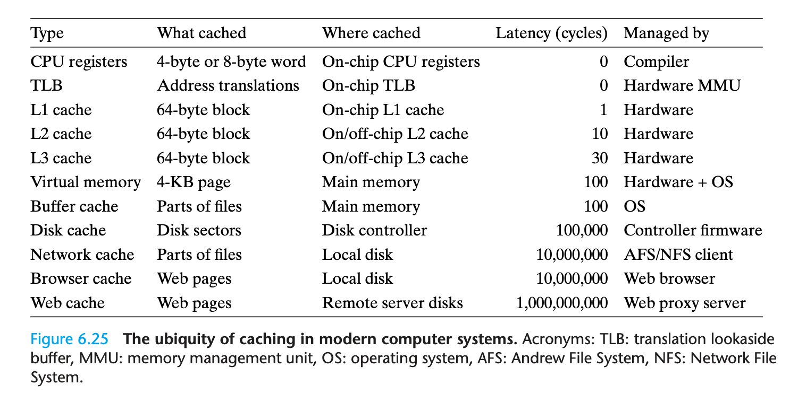

# Computer System

[toc]

---

废话不多说，先提几个正式系统性学习操作系统之前困扰我的问题：

1. 编译器是在操作系统之前被发明，那没有操作系统，现代编译器还能用吗？
2. 用户所谓的应用程序也都是用像编译操作系统一样的编译器编译而成的机械指令，为何执行会有区别（比如应用程序权限低等），换句话说：操作系统是什么实现的权限管理（在不调用系统API时）？
3. 虚拟内存也就是内存映射，能实现对操作系统的隔离保护，但是如何**让/不让**“用户/软件”访问硬件？（物理硬盘，物理内存，寄存器）
4. 

[一个大致能回答上述一些问题的答案](https://www.zhihu.com/question/306127044/answer/555327651)。

---

## 参考书籍

* [Linux内核设计与实现](https://book.douban.com/subject/6097773/)
* [现代操作系统](https://book.douban.com/subject/27096665/)
* [深入理解计算机系统](https://book.douban.com/subject/26912767/)

---


## 绪论

这里肯定是随便简单的说一说。

### 内核态和用户态

> 节选自Linux内核设计与实现：
>
> 用户界面是操作系统的外在表象，内核才是操作系统的内在核心系统其他部分必须依靠内核这部分软件提供的服务，像管理硬件设备、分配系统资源等。内核有时候被称作是管理者或者是操作系统核心。通常一个内核由负责响应中断的中断服务程序，负责管理多个进程从而分享处理器时间的调度程序，负责管理进程地址空间的内存管理程序和网络、进程间通信等系统服务程序共同组成。对于提供保护机制的现代系统来说，内核独立于普通应用程序，它一般处于系统态，拥有受保护的内存空间和访问硬件设备的所有权限。这种系统态和被保护起来的内存空间，统称为内核空间。相对的，应用程序在用户空间执行。它们只能看到允许它们使用的部分系统资源，并且只使用某些特定的系统功能，不能直接访问硬件，也不能访问内核划给别人的内存范围，还有其他一些使用限制。当内核运行的时候，系统以内核态进入内核空间执行。而执行一个普通用户程序时，系统将以用户态进入以用户空间执行。
> 在系统中运行的应用程序通过系统调用来与内核通信（见图1-1）。应用程序通常调用库函数（比如C库函数）再由库函数通过系统调用界面，让内核代其完成各种不同任务。一些库调用提供了系统调用不具备的许多功能，在那些较为复杂的函数中，调用内核的操作通常只是整个工作的一个步骤而已。举个例子，拿 printfO函数来说，它提供了数据的缓存和格式化等操作，而调用 write函数将数据写到控制台上只不过是其中的一个动作罢了。不过，也有一些库函数和系统调用就是一一对应的关系，比如， open库函数除了调用 open系统调用之外，几乎什么也不做。还有一些c库函数，像strcpy根本就不需要直接调用系统级的操作。当一个应用程序执行一条系统调用，我们说内核正在代其执行。如果进一步解释，在这种情况下，应用程序被称为通过系统调用在内核空间运行，而内核被称为运行于进程上下文中。这种交互关系——应用程序通过系统调用界面陷入内核——是应用程序完成其工作的基本行为方式。

**值得注意的是，这与我们平常所谓的用户模式和管理员模式是完全两码事！**


### MMU与虚拟内存管理

> 由于所有的 Unix 内核都同宗同源，并且提供相同的 API，现代的 Unix 内核存在许多设计上的相似之处（请看参考目录中我所推荐的关于传统 Unix 内核设计的相关书籍）。Unix 内核几乎毫无例外的都是一个不可分割的静态可执行库。也就是说，它们必须以巨大、单独的可执行块的形式在一个单独的地址空间中运行。Uni 内核通常要硬件系统提供页机制（MMU）以管理内存。这种页机制可以加强对内存空间的保护，并保证每个进程都可以运行于不同的虚地址空间上。初期的 Linux 系统也需要 MMU 支持，但有一些特殊版本不依赖于此。这无疑是一个简洁的设计，因为它可以使 Lin 系统运行在没有 MMU 的小型嵌入系统上。不过现实之中，即便很简单的嵌入系统都开始具备内存管理单元这种高级功能了。


### 启动过程


> 这部分参考[阮一峰博客](http://www.ruanyifeng.com/blog/2013/02/booting.html)：
>
> 1. BIOS（Basic Input/Output System）
>
> 进行硬件检查，但它没这么能耐也没这个兴趣接管计算机，就按照设定（启动顺序，可以自行修改）检查并将控制权交给首位“硬盘”（现代计算机大多数情况都是硬盘）的第一个分区——MBR。
>
> 2. MBR（Master boot record）
>
> 它其实还有其他代替方案：GPT/GUID。它们有个共同的任务，就是让计算机读取分区表，从而引导操作系统内核被读入内存。这个工作具体交由MBR中一段代码——“主引导加载程序”来执行。若主分区中有一个为“激活分区”，也就是有特殊标识，则将其加载到内存（若不是你的代码，就凉了），若有多个分区，然后由下个程序（Boot Loader）接管，让用户选择启动哪个。
>
> 3. Boot Loader——系统内核
>
> 它就是加载这个分区的引导扇区，然后就是一系列操作——操作系统内核加载——init进程（所有进程的父进程），其中还包括[CPU从实模式切换到保护模式](https://www.cnblogs.com/cyx-b/p/11809742.html)。


## 进程管理

### 任务队列（task list）

Task List 是一个双向循环链表（**Link List**），储存在内存某个位置，其中每一项都是个结构（**task_struct**），称为进程描述符。该结构定义在`<Linux/sched.h>`中，该结构描述了该进程打开的文件、所在的内存地址空间、挂起的信号、进程的状态等。

```c
struct task_struct {
 volatile long state; /* -1 unrunnable, 0 runnable, >0 stopped */
 void *stack;
 atomic_t usage;
 unsigned int flags; /* per process flags, defined below */
 unsigned int ptrace;
 int lock_depth; /* BKL lock depth */ 
 /* ...... */ 
};
```
Linux使用slab分配`task_struct`，其在该进程内核栈底端创建一个`thread_info`的struct，其存放着`task_struct`的地址偏移量。


> **节选自《Linux内核设计与实现》3.3.2**
>
> 上文 `task_struct` 中有一个 `stack` 成员，而 `stack` 正好用于保存内核栈地址。内核栈在进程创建时绑定在 `stack` 上。可以观察 `fork` 流程：Linux 通过 `clone()` 系统调用实现 `fork()`，然后由 `fork()` 去调用 `do_fork()`。定义在<kernel/fork.c>中的 `do_fork()` 负责完成进程创建的大部分工作，它通过调用 `copy_process()` 函数，然后让进程运行起来。`copy_process()` 完成了许多工作，这里重点看内核栈相关部分。`copy_process()` 调用 `dup_task_struct` 来创建内核栈、`thread_info` 和 `task_struct`：

```c
static struct task_struct *dup_task_struct(struct task_struct *orig) { 
 struct task_struct *tsk;
 struct thread_info *ti;
 unsigned long *stackend;
 int err; prepare_to_copy(orig);
 tsk = alloc_task_struct();
 if (!tsk) return NULL;
 ti = alloc_thread_info(tsk); 
 if (!ti) { 
  free_task_struct(tsk);
  return NULL; 
 } 
 err = arch_dup_task_struct(tsk, orig);
 if (err) goto out;
 tsk->stack = ti;
 err = prop_local_init_single(&tsk->dirties);
 if (err) goto out;
 setup_thread_stack(tsk, orig);
 stackend = end_of_stack(tsk);
 *stackend = STACK_END_MAGIC;
 /* for overflow detection */
 #ifdef CONFIG_CC_STACKPROTECTOR 
 tsk->stack_canary = get_random_int();
 #endif 
 /* One for us, one for whoever does the "release_task()" 
 (usually parent) */
 atomic_set(&tsk->usage,2);
 atomic_set(&tsk->fs_excl, 0);
 #ifdef CONFIG_BLK_DEV_IO_TRACE
 tsk->btrace_seq = 0;
 #endif 
 tsk->splice_pipe = NULL;
 account_kernel_stack(ti, 1);
 return tsk;
out:
 free_thread_info(ti);
 free_task_struct(tsk);
 return NULL; 
}
```


## 系统调用

由于内核“抢先”拥有了设备控制权（因为开机BIOS“首先”加载内核），所以除它本身，其余指令“都”被认为是用户程序，经由它筛选执行。而如果用户程序想要访问某些硬件（绝大部分都是必要的），只能通过系统调用（操作系统提供的函数）来实现。而这一组函数再被封装，就被称为API了。

* **API不是系统调用，它们一般是操作系统厂商写好的一组系统调用的集合，让用户使用更加方便。**


由于内核是C语言写的（开始汇编写了很多，后来大部分用C重写），所以系统调用一般就是指的C库的众多函数。

> **C库不完全是系统调用，部分是系统调用**（这一部分有些是汇编写的，因为没有对应的C函数可以用）；部分则是在系统调用和系统API之上的封装 **[ Unix一般就是直接在系统调用上封装，Win的C库是在Win32API（Win32API是对Windows系统调用的封装）之上封装 ]** ，这部分也就是C标准库。之所以Windows多了一环，就是没有遵循Unix设计理念和规范，所以需要封装一层适配来实现C标准库的跨平台。
>
> **所以C库有一部分属于操作系统内核，而标准库属于用户层，而我们自行安装的整个GCC/Clang都是在用户层（没有关于操作系统内核那一部分代码）工作。** 它们也就是对应的所谓内核态和用户态。

API的函数一般会利用一组系统调用来集成。比如Unix标准结构规范就将这标准化——POSIX。POSIX表示可移植操作系统接口（Portable Operating System Interface of UNIX，缩写为 POSIX ），POSIX标准定义了操作系统应该为应用程序提供的接口标准（也就是它定义了API长啥样），是IEEE为要在各种UNIX操作系统上运行的软件而定义的一系列API标准的总称，但Windows也对其做了适配。


**Q：既然内核操作硬件是用C写的函数，那么我（用户）写相似的代码，为什么不能访问或操作硬件？**

A：正如本节开头所讲，内核在开机时抢占了硬件控制权，你如果不用它提供的函数访问或操作硬件，那么它拒绝指令这个执行，比如某些直接访问物理内存的指令？

**Q：用户程序也是被编译成汇编、机器码，这时内核如何知道它（这些机器指令）是否使用了系统调用来访问硬件？**

A：因为CPU制作商同操作系统厂商一起设定的在CPU层级的权限认证机制。而且同样如上述，系统内核及众多系统服务是被加载到特殊的内存空间，而后CPU就会把这个内存空间的指令设为高权限。而用户写的程序，在编译后，某些机器指令如访问某些“敏感”寄存器等，就会被否决。而用户程序若通过系统调用访问硬件，则运行时该指令是跳转到内核内存段执行的，所以可以执行。主板上电的那一刻，就决定了BIOS指定的硬盘的某个特殊分区的特殊文件会被首次加载到内存，而它将完全控制硬件，它在大多数情况，便是我们熟知的操作系统。

> 有两个重要的概念需要说明：
>
> 1. CPU执行的都是机器指令，并不是用任何语言写的函数之类；另外，计算机是多米诺骨牌，不会说不：CPU只会执行下一条指令，它不会说不，所谓的禁止，只是它首先执行了一个判断的指令，比如判断你的内存地址，再执行判断后结果。 
> 2. 真实世界的界限并不明显：CPU制造商如Intel、AMD与操作系统厂商如Apple、MicroSoft是有深度的合作，从指令集到编译器再到内核众多C函数的实现，是由它们深度合作开发，并非“我做好了，你来适配”。


## 内存管理

现代内存系统非常复杂：**虚拟内存、硬盘映射、多级缓存预取**等等。CPU从内存取指令和数据在当今计算机系统中占比微乎其微。最大程度缓解CPU到内存延迟的当属cache：cache如何从内存预取、多级cache如何配合、CPU在cache不命中时如何取址？这全部由硬件负责。



### 页

现代计算机系统将内存等分为若干页，比如64位系统每个内存页为8KB。上节中所述的`task_struct->mm_struct`结构体成员用来保存该进程的页表。在进程切换的过程中，内核把新的页表的地址写入CR3控制寄存器。

正如上述的`task_struct`，内核用`struct page`来管理页，页的概念不仅是在内核中体现，现代计算机有专门的硬件来管理内存——MMU。

```c
struct page {

 /* ...... */ 
};
```

#### 多级页表


### MMU

MMU是CPU的一部分，每个处理器core都有一个MMU，包含：

- TLB：是页表的高速缓存（一般在L2缓存或L1缓存中的独立结构，不算其容量），存储着最近转化的一些目录项
- Table Walk Unit：负责从页表中读取虚拟地址对应的物理地址


### cache工作原理

讲完了MMU和页表，来说说CPU、寄存器、cache、内存的关系，首先说明，cache是有单独的取址单元，类似内存控制器。可以“独立于”CPU访问并拷贝内存数据。而且这个过程并不依赖于任何软件编程（完全由硬件控制）。


>  **Cache与DRAM存取的一致性**
>
> 在CPU与主存之间增加了Cache之后，便存在数据在CPU和Cache及主存之间如何存取的问题。读写各有2种方式。
>
> 贯穿读出式(Look Through)
>
> 该方式将Cache隔在CPU与主存之间，CPU对主存的所有数据请求都首先送到Cache，由Cache自行在自身查找。如果命中。 则切断CPU对主存的请求，并将数据送出；不命中。则将数据请求传给主存。
>
> 该方法的优点是降低了CPU对主存的请求次数，缺点是延迟了CPU对主存的访问时间。
>
> 旁路读出式(Look Aside)
>
> 在这种方式中，CPU发出数据请求时，并不是单通道地穿过Cache。而是向Cache和主存同时发出请求。由于Cache速度更快，如果命中，则Cache在将数据回送给CPU的同时，还来得及中断CPU对主存的请求；不命中。则Cache不做任何动作。由CPU直接访问主存。它的优点是没有时间延迟，缺点是每次CPU对主存的访问都存在，这样。就占用了一部分总线时间。
>
> 写穿式(Write Through)
>
> 任一从CPU发出的写信号送到Cache的同时，也写入主存，以保证主存的数据能同步地更新。它的优点是操作简单，但由于主存的慢速，降低了系统的写速度并占用了总线的时间。
>
> 回写式(Copy Back)
>
> 为了克服贯穿式中每次数据写入时都要访问主存。从而导致系统写速度降低并占用总线时间的弊病，尽量减少对主存的访问次数，又有了回写式。
>
> 它是这样工作的：数据一般只写到Cache，这样有可能出现Cache中的数据得到更新而主存中的数据不变(数据陈旧)的情况。但此时可在Cache 中设一标志地址及数据陈旧的信息。只有当Cache中的数据被再次更改时。才将原更新的数据写入主存相应的单元中，然后再接受再次更新的数据。这样保证了Cache和主存中的数据不致产生冲突。


### 内存延迟

[CPU—cache—Memory—Drive的过程](https://www.cnblogs.com/xkfz007/archive/2012/10/08/2715163.html)写的非常清楚。当然这篇有些老，比如架构还有北桥，而现代CPU都把北桥中的内存控制器等部件集成在CPU内部，但是对于理解缓存结构来说，足够了。


关于内存延迟，有一篇知乎文章写得不错，现节选下来。

> [内存延迟](https://zhuanlan.zhihu.com/p/57780996):
>
> #### **多级缓存**
>
> 而缓存的硬件本质，本质上是对内存空间的映射，通过访问缓存，减少到访问内存的时间。但是存储器有着天生的一个矛盾：体积、速度还有成本。越接近寄存器的存储，体积越小，但是速度越快，成本也更高，但是像网络的存储，是其所有计算机存储的总和，但是速度就以 ms 计，不过成本就可以相对更低（就像你看知乎的文章，不用自己买硬盘，只要为流量或者带宽付费）。
>
> 我们根据存储器的容量之比，可以得出很明显的结论，越近的存储器层级访问越快，体积越大的存储器访问越慢。所以低级缓存速度很快（延迟低带宽高）但是不易命中，而高级缓存命中率相对高但是访问慢（延迟大带宽低）。另外一方面，每级缓存都需要访问cache tag，这也是一个主要的延迟。
>
> 同时存在一个边际效益问题：如果提升低级缓存的空间，单位成本比高级缓存高，但是带来的性能提升是越来越少；如此一来不如引入更多级缓存，这样就能最大化存储系统的最重要的目标：平均内存访问时间（Average Memory Access Time, **AMAT**）。
>
> #### **MMU 和 TLB**
>
> 离开了缓存之后，就是内存了么？不是。现代 CPU 之所以独立区分于 MCU（微控制器），有个很重要的部件就是 MMU（内存管理单元）。现代处理器通常采用了虚拟地址（也就是严格意义上的虚拟内存）作为指令后的参数，通过 MMU 翻译到物理内存的地址。而这个翻译工作交给了 TLB （页表缓存）。TLB 缓存找到了访问地址的页号（即命中），即明确了虚拟内存到物理内存的映射，就可以完成翻译；而如果找不到页号，就有两种情况
>
> - CPU 必须自行遍历页表，找到对应的分页条目，从而完成物理内存的访问
> - 如果找不到分页条目，说明这个页不在物理内存上，就要中断正在执行的程序，将控制权交给内核，完成所谓的”缺页中断“，内核此时通过 IO （比如访问磁盘）将磁盘上的页面文件复制到内存中，或者是将被压缩的内存页解压，从而完成读取，返回到程序中。
>
> ##### **TLB 与 Spectre 漏洞**
>
> TLB 是缓存，所以就需要一套预测算法，尽可能让 TLB 完成命中；同样，更底层的缓存也要有套预测算法。然而这套算法存在一种缺陷，通过一套攻击方法操纵分支预测逻辑，可以可靠地对 **缓存命中 和 未命中 间的差异**进行计时, 这种信息可以暴露进程的内部工作信息，从而实现对另外一个本该被页表隔离的进程空间的访问。
>
> 为了防止用户态进程通过这种方法攻击其他进程和内核，内核会要求 CPU 在上下文切换（即切换用户态到内核态的切换，进程之间的切换至少经历两次）强制刷新 TLB 缓存。但是这种操作就导致上下文切换的额外开销，以及 TLB 的命中率下降。这种性能影响不会对重运算类的应用有特别影响，而对程序编译（计算+IO密集型）和文件网络访问这样的应用有着严重影响。
>
> **平台架构**
>
> **MMU**
>
> MMU 之后就是内存控制器。在早期，内存控制器并不是作为 CPU 的一部分存在的。
>
> 945GM 的架构图
>
> 可以看到，CPU 到北桥（945GM）中间经过了 FSB 总线；北桥集成了 PCIe 控制器，内存控制器，GPU和显示输出单元。
>
> - PCIe：连接高速外设
> - 内存控制器：连接内存，此处有两个内存通道
> - GPU和显示输出单元：2D/3D渲染和显示输出，外接 LVDS 屏幕，CRT 显示器或者电视
>
> 同时借助 DMI 总线（实际是 PCIe），连接南桥（Chipset，芯片组）
>
> 可以看到芯片组连接了无线网卡，千兆有线网卡，外接 ExpressCard 和扩展坞，并且提供了内置存储的 PATA（IDE）和SATA总线，继承了 AC97 标准的音频规范，PCI 提供对旧外设的兼容，同时还有一些 SPI 闪存用于充当 NVRAM Nor Flash（有地址线，和一般 Nand Flash 按块读写不同），TPM 安全平台，和嵌入式控制器 EC（控制风扇键盘以及一些通用 IO 接口，如盖子、电源开关等）。
>
> 所以这种架构下，CPU 访问内存必须经过北桥这一关，所以在当时主板的 FSB 频率是一个非常重要的指标，当 CPU 超频，对于内存的吞吐需求增大，那么 FSB 频率提升就能有效提升内存的吞吐和降低延迟，并且也可以间接提升到 PCIe 的性能。
>
> 后来 AMD 率先将北桥融合入CPU，后来就出现了 GPU 整合入 CPU，所以我们现在看到的架构是这样的：
>
> 
>
> 
>
> 并且 Intel 先后引进了环形总线和 eDRAM（嵌入式动态访问内存，和 DRAM 有类似之处，L1-L3 都是 SRAM）。所谓环形总线，就是围绕 L3 的一条数据通路，连接各个核心、GPU、System Agent（包含内存控制器、PCIe 控制器、eDRAM 控制器和显示输出单元）。环形总线上核心之间访问的延迟约等于访问 L3 的延迟，这样并发任务锁能够更快被处理。而 eDRAM 缓存和传统 SRAM 缓存不同，他更像是一块带宽更大的内存。最近有些玩家在通过 Intel GPU 配合没有显示输出的 P106 显卡进行输出画面。由于这种方式输出需要将显存的 framebuffer 复制到 CPU 的 hostmemory，eDRAM 能够显著改善这个过程所需的带宽，从而提升帧率降低延迟。
>
> 但是服务器核心就有所不同，由于拥有更多核心，环的半径就会显著增大，内存延迟和核心同步延迟都显著增大，于是 Intel 就引入了双环结构。多线程应用在一个环内就能减少延迟，而吞吐密集应用可以靠近内存控制器从而获得更强性能。虽然两个环并没有被认为是一种 NUMA 结构，但是这种结构并不完美，第一个问题是两个环之间的数据通路是一个严重的瓶颈，特别是一个环的内存控制器和另外一个环上所示的核心访问时就有更大的带宽和延迟瓶颈。而对于低端CPU来说部分被屏蔽的核心就会导致第二个环只有一半能够继续工作，这就进一步降低了吞吐量和提升了延迟。
>
> 
>
> 为了缓解这种情况，提升每个核心能分配到的带宽和降低平均延迟，Skylake-SP 架构引入了 mesh 总线，从而提供更大的内存有效吞吐（六通道）和平均延迟。但是为了提升命中率，每个核心独占的 L2 容量提升至 1M，这就导致部分核心之间延迟变得更大。外加 mesh 总线频率和 CPU 频率呈现相关性，这就让低端处理器性能进一步下降。甚至不少评测媒体得出 SNB-E 的 2670 在游戏性能上相比默认频率的四通道的 Skylake-SP 产品要好。
>
> 
>
> 而 AMD 在 Zen 时代也变得更加奇葩。AMD 在 Zen 上采用了集成了两个 CCX 单元、双通道控制器，32 Lane PCIe 的单个 Die，在Ryzen 5/7 平台上通过一个Die就做出了 4-8核心的规格，而在 Threadripper 一代上两组 Die 实际运作，另外两组 Die 提供 Frabic 总线，形成最高 16 核心的桌面产品；Zen 2xxx 系列在 Zen 1xxx 基础上作何很多稳定性和细节调整，并且开启了 TR 的两个 Die 从而形成了最高 32 核心的 2990WX。服务器在开启剩下两个核心的 DDR4 和 PCIe 控制器，从而达到了单 Package 128 Lane PCIe，8通道内存的恐怖规格。
>
> 
>
> > 来源：[https://www.suse.com/documentation/suse-best-practices/pdfdoc/optimizing-linux-for-amd-epyc-with-sle-12-sp3/optimizing-linux-for-amd-epyc-with-sle-12-sp3.pdf](https://link.zhihu.com/?target=https%3A//www.suse.com/documentation/suse-best-practices/pdfdoc/optimizing-linux-for-amd-epyc-with-sle-12-sp3/optimizing-linux-for-amd-epyc-with-sle-12-sp3.pdf)
> > EPYC 的 hwloc（一种 NUMA 实用工具，让应用尽可能避免受到 NUMA 跨核访问的影响）结构示意图，可以看到一共有八个主存节点，每个主存节点下有两个 L3 簇，而 SCSI/ATA 控制器和网卡等 IO 设备都分布在不同的 NUMA node，这就意味着跨 NUMA 访问非常难以避免，如果你的虚拟机被分配在远离网卡的机器，显然网络 IO 性能就会有影响，这就需要 QoS。
>
> 到了 Zen 2 越加不可收拾，八核心产品采用了奇怪的设计：GPU Die 和 IO Die。这其实一看就能理解，IO Die 相当于当年的北桥，提供了内存/PCIe 控制器，APU 型号额外增加 Vega 图形单元，可能还会集成 eDRAM，或者说不定换成 GDDR 内存控制器，做成和游戏机类似的架构。
>
> 有些玩家可能想象这个 Die 看上去能塞下另外一个 8 核心的 Die，但是从内存带宽的角度看，目前 Ryzen 大多数型号都可以从高频低延迟重获取明显的整体性能提升，所以如果真的做到16核心，内存带宽就会成为极大的瓶颈。以及目前的设计引入了 CPU-北桥-L4缓存（不确定是 SRAM 还是 eDRAM）-内存控制器-DDR4 显存，这就让本身对内存敏感的 Ryzen 的内存性能更加存疑。
>
> 左: IO Die 右: CPU Die 手: 苏妈
>
> 这种诡异的设计更像是为了 EPYC 让步, CPU Die 就可以以更高的良率生产， EPYC 同样借助 IO Die 就可以实现更灵活的组合，以相对低的成本塞进更多的核心。对于虚拟化平台来说这种方案能够有效降低单机成本。同样运算密集型的 HPC 平台也有更大的吞吐能力。但是如果是数据库这种对于缓存敏感、有着大量并发锁（还记得 Intel TSX 指令集么）的应用，这种引入8（16）个 NUMA 节点的单路平台是难以优化的。


### 内存映射（Memory mapping）IO


## IO接口与驱动

IO设备主要指外设，如硬盘、鼠标键盘显示器等。这里主要以硬盘为例，但是提到硬盘，往往和下一章节的文件系统联系起来，因为一般意义上，文件都放在硬盘里。但这是不严谨的。

**一切储存和运算最终都是以二进制的形式，而硬盘（固态、机械、光盘）、内存、cache等储存机理各不相同，但是他们都是可以存放文件的，所以一个文件系统完全可以在内存（Memory）中被实现，之所以它往往被与硬盘联系起来，只是硬盘断电还能保持其二进制状态信息罢了。**

同样地，如果硬盘在成本不变的情况下读写速度极快、延迟极低（和cache一样块），那我们就不需要内存（Memory）这种东西了。 但现实是，我们都需要。

以硬盘为例，其主要作用除了储存数据（断电也可以保存信息）之外，就是**把数据拷贝到内存里，再从**

**内存中把数据写到硬盘里。**这个过程本来是由CPU完成，但是CPU做这些太低效率了，所以有个专门的硬件做这个工作，其接受CPU的指令，向CPU汇报工作——它就是DMA。


### DMA（Direct Memory Access）


## 文件系统

这个文件系统是较为广义的文件系统（计算机对数据存放和读写的实现），而不仅是狭义的文件系统，如NTFS、APFS、ZFS等。


### 虚拟文件系统（VFS）


> VFS 其实采用的是面向对象的设计思路，使用一组数据结构来代表通用文件对象。这些数据结构类似于对象。因为内核纯粹使用 C 代码实现，没有直接利用面向对象的语言，所以内核中的数据结构都使用 C 语言的结构体实现，而这些结体包含数据的同时也包含操作这些数据的函数指针，其中的操作函数由具体文件系统实现。
>
> VFS 中有四个主要的对象类型，它们分别是：
>
> * 超级块对象，它代表一个具体的已安装文件系统。
>
> * 索引节点对象，它代表一个具体文件。
>
> * 目录项对象，它代表一个目录项，是路径的一个组成部分。
>
> * 文件对象，它代表由进程打开的文件。
>
> 注意，因为 VFS 将目录作为一个文件来处理，所以不存在目录对象。回忆本章前面所提到的目录项代表的是路径中的一个组成部分，它可能包括一个普通文件。换句话说，目录项不同于目录，但目录却是另一种形式的文件。每个主要对象中都包含一个操作对象，这些操作对象描述了内核针对主要对象可以使用的方法: 
>
> * super operations，对象，其中包括内核针对特定文件系统所能调用的方法，比如 write  inode 和 sync_fs0 等方法。
>
> * inode operations 对象，其中包括内核针对特定文件所能调用的方法，比如 create (0 和 ink 等方法。
>
> * dentry operations 对象，其中包括内核针对特定目录所能调用的方法，比如 d compare 和  d delete0 等方法。
>
> * file operations 对象，其中包括进程针对已打开文件所能调用的方法，比如 read 和 write 等方法。
>
> 操作对象作为一个结构体指针来实现，此结构体中包含指向操作其父对象的函数指针。对于其中许多方法来说，可以继承使用 VFS 提供的通用函数，如果通用函数提供的基本功能无法满足需要，那么就必须使用实际文件系统的独有方法填充这些函数指针，使其指向文件系统实例。
>
> 再次提醒，**我们这里所说的对象就是指结构体，而不是像 C+或 Java 那样的真正的对象数据类类型。但是这些结构体的确代表的是一个对象，它含有相关的数据和对这些数据的操作，所以可以说它们就是对象。**

**题外话：**上段话中也说清楚了所谓的面向对象，也就是类（class）的概念，就是一个内存块，包含一个结构和众多函数（这些函数也可以包含在结构中，如接下来要讲的超级块操作函数表：**sturct super_operations**），这个集合就是一个没有继承功能的类。


### Unix文件系统

Unix系统将文件信息和文件本身区分开来，文件信息被称为文件元数据，被存放在一个单独的数据结构中——索引节点（**inode**——index node）。

文件系统的控制信息也被存放在一个特殊的数据结构中——超级块（**super_block**），定义在<linux/fs.h>中。super_block不仅仅是抽象的概念，在物理硬盘中也存放在特殊的位置，以便访问。

```c
struct super_block {

 /* ...... */ 
};
```


