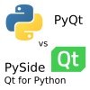
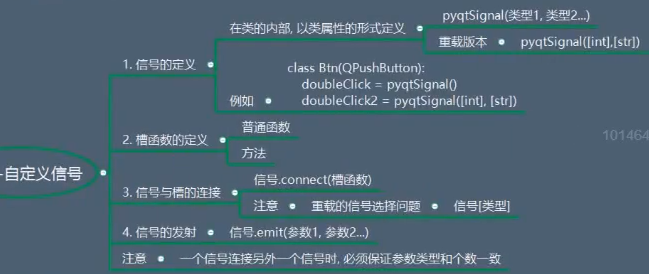

# Learn GUI---Qt


[toc]

[Deepin GUI方案](https://www.jianshu.com/p/e871723f9460)。

## 一个很基本的问题

GUI是G+UI，这个Graphics，包含着在最底层计算机室怎么处理“图像”的，也就是把各种各样的“形状”、“颜色”、“3D信息”转化成最终像素的过程。

这一过程的原理，往往会出现在《计算图形学》，3D建模等方向，而在UI设计方向，好像少有人懂。其实这恰恰是计算机行业成功的表现，就是封装，一层层的抽象，让开发者不知道具体实现的底层细节，来开发更宏大的项目。比如Linux中GUI的`G`就是[X Window](https://zh.wikipedia.org/wiki/X%E8%A6%96%E7%AA%97%E7%B3%BB%E7%B5%B1)，但这还需要显卡、显卡驱动及显卡API如[OpenGL](https://zh.wikipedia.org/wiki/OpenGL)；而在Mac上，`OpenGL`和`X Window`对应的就是`Metal`和`AppKit`，当然Apple在近几年逐渐使用`IOS`和`MacOS`统一的`SwiftUI`来代替`MacOS`的`Appkit`和`IOS`的`UIKit`。总之，我们平常所说的GUI：只是操作系统提供了G，并又在G的API上封装了UI这个API，我们利用UI的API写窗口和主逻辑代码的链接关系（一般由Signal表示）

一方面源于好奇心，另一方面，正如之前我再三强调，了解更底层的原理，会使得现在的工作更加清晰明了，游刃有余。我们就来看看GUI中的G：


## 一个跑题的问题

函数递归、类的自引用，是怎么样的逻辑？
这个问题见learn c++


一个网页可视化的项目](http://www.alloyteam.com/2019/07/h5-build-tool-pipeline/)、[如何区别一个 App 是 Native App， Web App 还是 Hybrid app](https://www.zhihu.com/question/23622875)


python可是可以做GUI的。

[python对接c++Qt的一个库——PyQt5](https://www.riverbankcomputing.com/static/Docs/PyQt5/)、

[关于可视化的方案和具体python实现](https://leovan.me/cn/2018/05/cross-platform-gui-application-based-on-pyqt/)、


## [PySide2](https://doc.qt.io/qtforpython/modules.html)

标题链接是官方文档，还有一个写的很不错的[中文博客](https://www.cnblogs.com/zach0812/category/1524140.html)、

### PyQt5和PySide2的区别

[PyQt5和PySide2的区别](https://www.zhihu.com/question/21237276)、

> [可以参考这篇文章](https://machinekoder.com/pyqt-vs-qt-for-python-pyside2-pyside/)、
>
>
> 
>
> 目前PyQt是由一家小公司[Riverbank Computing](https://link.zhihu.com/?target=https%3A//riverbankcomputing.com)维护的，PyQt历史更长一些，比较稳定，开发社区也比较大，有相关的deploy工具；而PySide（又名Qt for Python）现由Qt公司维护，比PyQt更年轻一些。截至2019年，最新版本是PyQt5和PySide2。
>
> 其实他俩API挺相似的，最大的区别是License，PyQt是GPL协议，Qt for Python是LGPL协议，前者不能商用。目前从各方面来看PyQt速度更快、工具更齐全，个人觉得是开发时间比较早的原因，根据开源协议，Qt for Python的实现要避开PyQt已经实现部分的实现方法。但Qt for Python由Qt公司官方支持，而且开源可商用，目测未来发展会超越PyQt。
>
> 如果不确定用哪款，还有一种方法是加个中间层。有人对它们API做了包装，参见：[QtPy - Github](https://link.zhihu.com/?target=https%3A//github.com/spyder-ide/qtpy)
>
> 文档在这里：
>
> [Qt for Python - Qt for Pythondoc.qt.io](https://link.zhihu.com/?target=https%3A//doc.qt.io/qtforpython/)[PyQt5 Reference Guidewww.riverbankcomputing.com](https://link.zhihu.com/?target=https%3A//www.riverbankcomputing.com/static/Docs/PyQt5/)
>
> （从文档看我还是倾向用Qt for Python的）

#### UI files

Both packages use slightly different approaches for loading `.ui` files exported from Qt Creator/Designer. PyQt5 provides the `uic` submodule which can be used to load UI files directly, to produce an object. This feels pretty Pythonic (if you ignore the camelCase).

```python
import sys
from PyQt5 import QtWidgets, uic

app = QtWidgets.QApplication(sys.argv)

window = uic.loadUi("mainwindow.ui")
window.show()
app.exec()
```

The equivalent with PySide2 is one line longer, since you need to create a `QUILoader`object first. Unfortunately the api of these two interfaces is different too (`.load` vs `.loadUI`) and take different parameters.

```python
import sys
from PySide2 import QtCore, QtGui, QtWidgets
from PySide2.QtUiTools import QUiLoader

loader = QUiLoader()

app = QtWidgets.QApplication(sys.argv)
window = loader.load("mainwindow.ui", None)
window.show()
app.exec_()
```

To load a UI onto an object in PyQt5, for example in your `QMainWindow.__init__`, you can call `uic.loadUI` passing in `self` (the target widget) as the second parameter. 

```python
import sys
from PyQt5 import QtCore, QtGui, QtWidgets
from PyQt5 import uic


class MainWindow(QtWidgets.QMainWindow):

    def __init__(self, *args, **kwargs):
        super().__init__(*args, **kwargs)
        uic.loadUi("mainwindow.ui", self)


app = QtWidgets.QApplication(sys.argv)
window = MainWindow()
window.show()
app.exec_()
```

The PySide2 loader does not support this — the second parameter to `.load` is the *parent* widget of the widget you're creating. This prevents you adding custom code to the `__init__` block of the widget, but you can work around this with a separate function.

```python
import sys
from PySide2 import QtWidgets
from PySide2.QtUiTools import QUiLoader

loader = QUiLoader()

def mainwindow_setup(w):
    w.setTitle("MainWindow Title")

app = QtWidgets.QApplication(sys.argv)

window = loader.load("mainwindow.ui", None)
mainwindow_setup(window)
window.show()
app.exec()
```

#### Converting UI files to Python

Both libraries provide identical scripts to generate Python importable modules from Qt Designer `.ui` files. For PyQt5 the script is named `pyuic5` —


```bash
pyuic5 mainwindow.ui -o MainWindow.py
```

You can then import the `UI_MainWindow` object, subclass using multiple inheritance from the base class you're using (e.g. `QMainWIndow`) and then call `self.setupUI(self)` to set the UI up.

```python
import sys
from PyQt5 import QtWidgets
from MainWindow import Ui_MainWindow

class MainWindow(QtWidgets.QMainWindow, Ui_MainWindow):

    def __init__(self, *args, **kwargs):
        super().__init__(*args, **kwargs)
        self.setupUi(self)


app = QtWidgets.QApplication(sys.argv)
window = MainWindow()
window.show()
app.exec()
```

For PySide2 it is named `pyside2-uic` —

```bash
pyside2-uic mainwindow.ui -o MainWindow.py
```

The subsequent setup is identical.

```python
import sys
from PySide2 import QtWidgets
from MainWindow import Ui_MainWindow

class MainWindow(QtWidgets.QMainWindow, Ui_MainWindow):

    def __init__(self, *args, **kwargs):
        super().__init__(*args, **kwargs)
        self.setupUi(self)


app = QtWidgets.QApplication(sys.argv)
window = MainWindow()
window.show()
app.exec_()
```


For more information on using Qt Designer with either PyQt5 or PySide2 see the [Qt Creator tutorial](https://www.learnpyqt.com/courses/qt-creator/).

#### exec() or exec_()

The `.exec()` method is used in Qt to start the event loop of your `QApplication` or dialog boxes. In Python 2.7 `exec` was a keyword, meaning it could not be used for variable, function or method names. The solution used in both PyQt4 and PySide was to rename uses of `.exec` to `.exec_()` to avoid this conflict.

Python 3 removed the `exec` keyword, freeing the name up to be used. As PyQt5 targets only Python 3 it could remove the workaround, and `.exec()` calls are named just as in Qt itself. However, the `.exec_()` names are maintained for backwards compatibility.

PySide2 is available on both Python 3 and Python 2.7 and so still uses `.exec_()`. It is however only available for 64bit Linux and Mac.

If you're targeting both PySide2 and PyQt5 use `.exec_()`

#### Slots and Signals

Defining custom slots and signals uses slightly different syntax between the two libraries. PySide2 provides this interface under the names `Signal` and `Slot` while PyQt5 provides these as `pyqtSignal` and `pyqtSlot` respectively. The behaviour of them both is identical for defining and slots and signals. 

The following PyQt5 and PySide2 examples are identical —

```python
my_custom_signal = pyqtSignal()  # PyQt5
my_custom_signal = Signal()  # PySide2

my_other_signal = pyqtSignal(int)  # PyQt5
my_other_signal = Signal(int)  # PySide2
```

Or for a slot —

```python
@pyqtslot
def my_custom_slot():
    pass

@Slot
def my_custom_slot():
    pass
```

If you want to ensure consistency across PyQt5 and PySide2 you can use the following import pattern for PyQt5 to use the `Signal` and `@Slot` style there too.

```python
from PyQt5.QtCore import pyqtSignal as Signal, pyqtSlot as Slot
```


You could of course do the reverse `from PySide2.QtCore import Signal as pyqtSignal, Slot as pyqtSlot` although that's a bit confusing.

#### Supporting both in libraries

You don't need to worry about this if you're writing a standalone app, just use whichever API you prefer.

If you're writing a library, widget or other tool you want to be compatible with both PyQt5 and PySide2 you can do so easily by adding both sets of imports.

```python
import sys

if 'PyQt5' in sys.modules:
    # PyQt5
    from PyQt5 import QtGui, QtWidgets, QtCore
    from PyQt5.QtCore import pyqtSignal as Signal, pyqtSlot as Slot

else:
    # PySide2
    from PySide2 import QtGui, QtWidgets, QtCore
    from PySide2.QtCore import Signal, Slot
```

This is the approach used in our custom widgets library, where we support for PyQt5 and PySide2 with a single library import. The only caveat is that you must ensure PyQt5 is imported before (as in on the line above or earlier) when importing this library, to ensure it is in `sys.modules`.


An alternative would be to use an environment variable to switch between them — see QtPy later.

If you're doing this in multiple files it can get a bit cumbersome. A nice solution to this is to move the import logic to its own file, e.g. named `qt.py` in your project root. This module imports the Qt modules (`QtCore`, `QtGui`, `QtWidgets`, etc.) from one of the two libraries, and then you import into your application from there. 

The contents of the `qt.py` are the same as we used earlier —

```python
import sys

if 'PyQt5' in sys.modules:
    # PyQt5
    from PyQt5 import QtGui, QtWidgets, QtCore
    from PyQt5.QtCore import pyqtSignal as Signal, pyqtSlot as Slot

else:
    # PySide2
    from PySide2 import QtGui, QtWidgets, QtCore
    from PySide2.QtCore import Signal, Slot
```


### 布局

 给QWidget或者QDialog设置布局的时候方式很简单。创建好一个布局：mainLayout，然后不停地把各个控件往mainLayout里面放，最后调用setLayout(mainLayout)就行了。  QMainWindow中使用这个方法的时候却不管用，因为QMainWindow是默认有layout的，所以再次设置layout会失效。

 会出现这种提示：

 QWidget::setLayout: Attempting to set QLayout "" on MainWindow "", which already has a layout 这句话的意思是说，你已经给MainWindow设置过一个布局了，再设置一个会出错。  该如何给QMainWindow正确地设置布局呢 要想QMainWidget创建布局，合理的步骤应该是这样的：  第一步创建一个QWidget实例，并将这个实例设置为centralWidget：  然后创建一个主布局mainLayout，并把所需要的所有控件都往里面放（工具栏、菜单栏、状态栏除外）：  ...

最一步就是将widget的布局设置为mainLayout。

```python
from PySide2.QtCore import *
from PySide2.QtGui import *
from PySide2.QtWidgets import *

class Mainwin(QMainWindow):

    def __init__(self):
        super().__init__()
        self.setupUI()
        self.createMenu()

    def setupUI(self):

        CenterWidget = self.setCentralWidget(Center())
        self.setDock()
        self.setWindowTitle("摩擦和热导率自动化")

    def createMenu(self):
        self.fileMenu = self.menuBar().addMenu("File")
        self.fileMenu.addAction("copy")
        self.fileMenu.addAction("paste")
        self.fileMenu.addAction("save")
        self.fileMenu.addAction("save as")
        self.fileMenu.addSeparator()
        self.fileMenu.addAction("Switch layout direction")


    def setDock(self):
        self.fileTree = QDockWidget()
        self.fileTree.setWindowTitle('Bookmarks')
        self.fieltree_widget = FileTreeWidget()
        self.fileTree.setWidget(self.fieltree_widget)
        self.addDockWidget(Qt.LeftDockWidgetArea, self.fileTree)

class Center(QWidget):

    NumGridRows = 3
    NumButtons = 4

    def __init__(self):
        super().__init__()
        
        self.createHorizontalGroupBox()
        self.createGridGroupBox()
        self.createFormGroupBox()

        bigEditor = QTextEdit()
        bigEditor.setPlainText("This widget takes up all the remaining space "
                "in the top-level layout.")

        mainLayout = QVBoxLayout()
        mainLayout.addWidget(self.horizontalGroupBox)
        mainLayout.addWidget(self.gridGroupBox)
        mainLayout.addWidget(self.formGroupBox)
        mainLayout.addWidget(bigEditor)
        self.setLayout(mainLayout)

        self.setWindowTitle("Basic Layouts")

    def createHorizontalGroupBox(self):
        self.horizontalGroupBox = QGroupBox("Horizontal layout")
        layout = QHBoxLayout()

        for i in range(self.NumButtons):
            button = QPushButton("Button %d" % (i + 1))
            layout.addWidget(button)

        self.horizontalGroupBox.setLayout(layout)

    def createGridGroupBox(self):
        self.gridGroupBox = QGroupBox("Grid layout")
        layout = QGridLayout()

        for i in range(self.NumGridRows):
            label = QLabel("Line %d:" % (i + 1))
            lineEdit = QLineEdit()
            layout.addWidget(label, i + 1, 0)
            layout.addWidget(lineEdit, i + 1, 1)

        self.smallEditor = QTextEdit()
        self.smallEditor.setPlainText("This widget takes up about two thirds "
                "of the grid layout.")

        layout.addWidget(self.smallEditor, 0, 2, 4, 1)

        layout.setColumnStretch(1, 10)
        layout.setColumnStretch(2, 20)
        self.gridGroupBox.setLayout(layout)

    def createFormGroupBox(self):
        self.formGroupBox = QGroupBox("Form layout")
        layout = QFormLayout()
        layout.addRow(QLabel("Line 1:"), QLineEdit())
        layout.addRow(QLabel("Line 2, long text:"), QComboBox())
        layout.addRow(QLabel("Line 3:"), QSpinBox())
        self.formGroupBox.setLayout(layout)
```


#### 盒布局


####[Grid布局](https://www.cnblogs.com/zach0812/p/11401724.html)


### 多界面跳转

**问题1: ** 多数信号都已经定义好了，比如pushbutton，但是对于button触发的界面跳转，为什么还要自定义信号`pyqtSignal`呢？


**问题2：**这个类本身继承于Ui_Form类，但又把它的对象传入了它的父类Ui_Form？？？？


**问题3:** ObjectName是干什么的？

```python
self.auto_login_checkBox = QtWidgets.QCheckBox(self.widget_3)

self.auto_login_checkBox.setObjectName("auto_login_checkBox")

self.gridLayout.addWidget(self.auto_login_checkBox, 2, 0, 1, 1)
```

ObjectName主要是用于外界来访问内部的控件成员的，如果外界不需要访问这个成员，则理论上无需设置它的ObjectName。


### 事件和信号

[信号与槽](https://www.cnblogs.com/lsgxeva/p/12636756.html)、[自定义信号](https://www.cnblogs.com/zach0812/p/11406892.html)、




### 文件管理（[QFileDialog](https://doc.qt.io/qtforpython/PySide2/QtWidgets/QFileDialog.html?highlight=qfiledialog#PySide2.QtWidgets.PySide2.QtWidgets.QFileDialog.setFileMode)）


[文件树](https://blog.csdn.net/qq_27061049/article/details/89641210)、

可以通过treeview和Dock实现：

```python
    def setDock():
        self.fileTree = QDockWidget()
        self.fileTree.setWindowTitle('Bookmarks')
        self._bookmark_widget = FileTreeWidget()
        self._bookmark_widget.open_bookmark.connect(self.load_url)
        self._bookmark_widget.open_bookmark_in_new_tab.connect(self.load_url_in_new_tab)
        self.fileTree.setWidget(self._bookmark_widget)
        self.addDockWidget(Qt.LeftDockWidgetArea, self.fileTree)
        
```


### Python 与 QML 通信

首先，对于每一个界面 (QML 文件)，我们都有一个与之对应 Python 文件 (除非该页面没有具体的业务逻辑，例如：`ui\SciHubEVAAbout.qml` 为关于页面，`ui\SciHubEVAMenuBar.qml` 为菜单栏)，以主页面 (`ui\SciHubEVA.qml` 和 `scihub_eva.py`) 为例，我们为每个界面创建一个类，同时该类集成自 Qt 的一个基类：

```python
class SciHubEVA(QObject):
    pass
```

Python 代码同界面交互的核心是通过 Qt 的 [**信号与槽**](http://doc.qt.io/qt-5/signalsandslots.html)，同样在 PyQt 中也是利用 [相同的机制](http://pyqt.sourceforge.net/Docs/PyQt5/signals_slots.html)。简单的理解 PyQt 与 QML 的信号与槽，可以认为**信号**就是**函数的定义**，**槽**就是**函数的实现**。同时，信号和槽往往会位于不同的地方，例如：信号定义在 Python 中，则对应的槽会在 QML 中，反之亦然，当然这并不是一定的。两者通过 `connect()` 函数连接起来，当触发一个信号时，槽就会接受到信号传递的参数，并执行槽里面相应的逻辑。


### [动画](https://het.as.utexas.edu/HET/Software/PyQt/qeasingcurve.html)

```python

    def show_hide_menu(self,checked):
        print("显示和隐藏",checked)
        animation_group = QSequentialAnimationGroup(self)
        for idx,target in enumerate(self.animation_targets):
            animation = QPropertyAnimation(target,b"pos")

            animation.setStartValue(self.main_menu_btn.pos())
            animation.setEndValue(self.animation_targets_pos[idx])

            animation.setDuration(200)
            animation.setEasingCurve(QEasingCurve.InOutBounce)
            animation_group.addAnimation(animation)

        if checked:
            animation_group.setDirection(QAbstractAnimation.Backward)
        else:
            animation_group.setDirection(QAbstractAnimation.Forward)

        animation_group.start(QAbstractAnimation.DeleteWhenStopped) #动画停止之后，给它删除

```


### 资源文件

在 GUI 编程中，我们不可避免的会使用到各种各样的资源，例如：图片，音频，字体等等。Qt 中提供了一种[资源管理方案](http://doc.qt.io/qt-5/resources.html)，可以在不同场景下使用 (Python 和 QML 中均可)。`SciHubEVA.qrc` 定义了所有使用到的资源：

```xml
<RCC>
    <qresource prefix="/">
        <file>ui/SciHubEVA.qml</file>
        <file>ui/SciHubEVAMenuBar.qml</file>
        <file>ui/SciHubEVAAbout.qml</file>
        <file>ui/SciHubEVAPreferences.qml</file>
        <file>ui/SciHubEVAAddSciHubURL.qml</file>
        <file>images/about.png</file>
    </qresource>
</RCC>
```

在 QML 中使用示例如下：

```qml
Image {
    id: imageAboutLogo
    source: "qrc:/images/about.png"
}
```

在 Python 中使用示例如下：

```python
self._engine = QQmlApplicationEngine()
self._engine.load('qrc:/ui/SciHubEVA.qml')
```

使用 `qrc` 文件管理资源文件的一个好处就是不需要担心各种相对路径和绝对路径带来的找不到文件的错误，但同时一个缺点是当资源文件更新后，需要运行 `pyrcc5 SciHubEVA.qrc -o scihub_resources.py` 更新资源，同时还需要在主程序代码中引入生成的 Python 资源代码。

### [界面线程分离](https://www.cnblogs.com/zach0812/p/11426719.html)

写 GUI 应用的一个重要问题就是界面线程的分离，需要把耗时的业务逻辑摘出来，单独作为一个线程运行，这样才不会造成界面的“假死”情况。`scihub_api.py` 中的 `SciHubAPI` 作为下载文章的主类，下载过程相对耗时。因为其既需要 Qt 中的 `tr()` 函数，也需要线程，通过 Python 的多继承，`SciHubAPI` 类构造如下：

```python
class SciHubAPI(QObject, threading.Thread):
    pass
```

```python
import threading

from PyQt5.Qt import * #刚开始学习可以这样一下导入
import sys,time

rate = 0
class MyProcessBar(QProgressBar):
    def __init__(self):
        super().__init__()
        self.setWindowTitle("test的学习")
        self.resize(300,30)
        self.set_ui()

    def set_ui(self):
        timer = QTimer(self)
        timer.start(100)
        timer.timeout.connect(self.timer_timeout_slot)

    def timer_timeout_slot(self):
        self.setValue(rate+1)

def create_ui_show():
    app =QApplication(sys.argv)
    processBar = MyProcessBar()
    processBar.show()
    sys.exit(app.exec_())

if __name__ == '__main__':
    thread1 = threading.Thread(target=create_ui_show)
    thread1.start()

    for i in range(100):
        time.sleep(0.05)
        rate = i
    if i == 99:
        print("下载完成")
```

```python
import multiprocessing

from PyQt5.Qt import * #刚开始学习可以这样一下导入
import sys,time

def create_ui_show(rate):
    app  = QApplication(sys.argv)
    progressBar = QProgressBar()

    timer = QTimer()
    def test():
        progressBar.setValue(rate.value+1)
        if rate.value == 99:
            sys.exit(0)
    timer.timeout.connect(test)
    timer.start(100)

    progressBar.show()
    sys.exit(app.exec_())

if __name__ == '__main__':
    rate = multiprocessing.Value("d",0)  #初始的rate.value = 0

    process1 = multiprocessing.Process(target=create_ui_show,args=(rate,))
    process1.start()

    for i in range(100):
        time.sleep(0.1)
        rate.value = i
```

