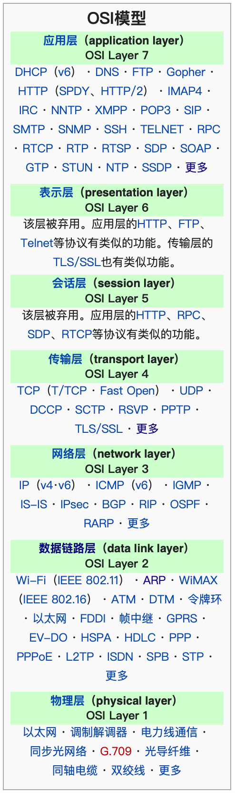
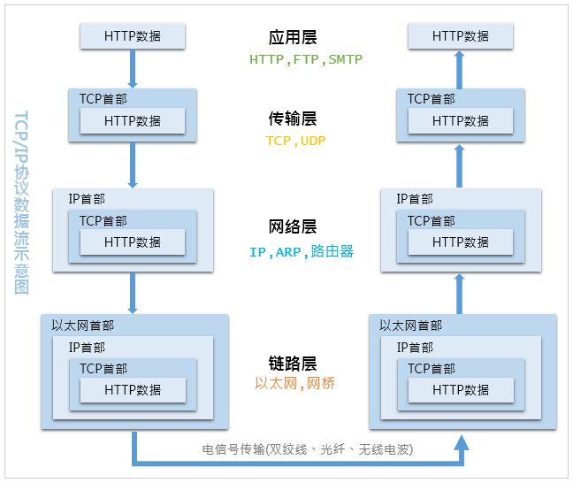
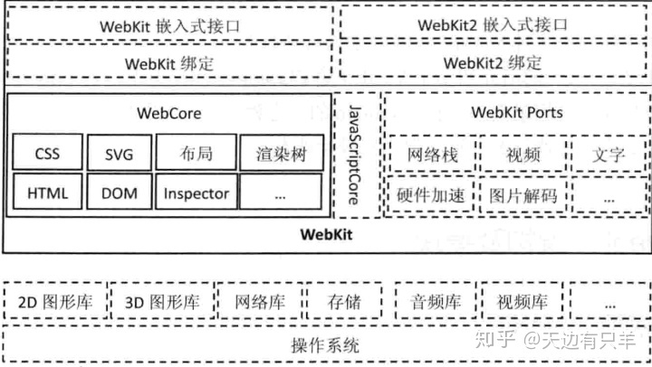

# Internet Protocol suite


[toc]

---

[wiki of internet protocol suite](https://en.wikipedia.org/wiki/Internet_protocol_suite)





---
## Link layer


### MAC

在链接层，计算机把自己本地的数据按照一定的格式封装实现以太网(Ethernet)之间的传输。也就是所谓的MAC封装(Media Access Control)，标准为：(**CSMA/CD**)。

MAC地址是唯一的设备号，但是只在局域网中生效，也就是link layer这一层。因为当你和internet交流时，需要一个“路由”，此时相当于它和外网服务器组成局域网，就是它的MAC地址，自己计算机的MAC就被“隐藏了”。

**exponential backoff**：

事实上Mac地址很像我们的身份证号，从出场就写入硬件了（网卡）。但是就像有人违规用假身份证号类似，Mac地址也可以“骗过”操作系统，“更改/伪造”Mac地址。

### ARP 协议/NDP协议

[ARP](https://zhuanlan.zhihu.com/p/28771785)

这是因为操作系统会有一个ARP缓存表，这就要说到这个ARP（IPv4）/DNP（IPv6中替代前者）协议。

> OSI模型把网络划分为七层，IP地址在OSI模型的第三层，MAC地址在第二层，彼此不直接交流。在通过以太网发送IP数据包时，需要先封装第三层（32位IP地址）、第二层（48位MAC地址）的报头，但由于发送时只知道目标IP地址，不知道其MAC地址，又不能跨第二、三层，所以需要使用地址解析协议ARP，根据网络层IP数据包包头中的IP地址信息解析出目标硬件地址（MAC地址）信息，以保证通信的顺利进行。


## Internet/Network layer


在网络层，也就是IP的定义和封装了。

### Why IP？

Q：为什么都有MAC地址了，还需要IP地址，有了MAC地址设备对设备不就可以实现数据传输了吗？

A：这就是为什么有身份证号还要家庭住址，家庭住址就类似IP，表征了计算机在网络上的相对位置，而这个是可能会变化的，比如我搬家了。这也就是为什么需要MAC。IP的好处就像家庭住址的好处，寄快递的时候不用上来看你身份证号，而是看地址，一层层的走。而且也具有动态分配的诸多好处。


### Class Of IP


IP为了方便管理，分为了五级：

```
Class A :   0.xx.xx.xx - 127.xx.xx.xx
Class B : 128.xx.xx.xx - 191.xx.xx.xx
Class C : 192.xx.xx.xx - 223.xx.xx.xx
Class D : 224.xx.xx.xx - 239.xx.xx.xx
Class E : 240.xx.xx.xx - 255.xx.xx.xx
```

其中每级拿出一部分来作为局域网IP来使用，这些IP是没有办法接入互联网的，仅作为局域网IP使用，这样主要是为了解决设备多余IP地址的问题：

而且送你家里的快递，你爸妈直接叫你名字你就过来拿了（事实上有很多和你重名的人，但你在家是相对唯一可以确定的），这就是ip可以分级的好处，也称为**子网掩码**（Netmask）：255.255.255.0。实时的表示了现在你所在的网络位置，有时绝对，有时相对，方便找到你，就像是地址。但是这种只用于内部网络的IP并不能随便使用(类似于不能随便起名)，就是Private IP（家里给你起的名，或者小镇上某一个地点的别名），反之其他的成为Public IP（可以唯一确定的地址）。

- Class A：10.0.0.0  - 10.255.255.255
- Class B：172.16.0.0 - 172.31.255.255
- Class C：192.168.0.0 - 192.168.255.255

由于这三段 Class 的 IP 是预留使用的，所以并不能直接作为 Internet 上面的连接之用，不然的话，到处就都有相同的 IP 啰！那怎么行！网络岂不混乱？所以啰，这三个 IP 网段就只做为内部私有网域的 IP 沟通之用。

**Q：**为什么私有IP要分级呢，有什么好处？

A：这是因为所谓局域网，家里的路由和计算机设备组成了局域网。那一个小区千百家的路由器其实也是在一个更大的局域网罢了，**（家外的一般属于互联网服务提供商ISP--Internet Service Provider）**并不是直接接入互联网的，原因也很简单，就像地址有国家，也有省，市，区一样，这个ClassA就像是省，仔细看ClassA给的可用IP地址也能知道，数量远远大于ClassB和C。这也就是为什么我们路由器的ip都是用如192.168.0.12来表示的，因为家里局域网不需要这么多设备，路由器也没有这么高的处理能力来给这么多IP解码分发数据。

ClassC其实可以再次切分。为了准确表示：192.168.0.0/24。IPv4一共32位二进制，每个‘.’就是8位，像这个表示意思就是说：我只给你这个局域网分配了32-24

正如同地址，美国白宫的地址在可预见的时间内是不会变的，你家就几乎不可能搬到那里，所以ip也有静态ip，是某些大型机构的专属“地址”，这也让网络访问变得容易。


**Q：**有了IP，MAC地址在网络传输中还有什么作用？怎么核对它们？

A：虽然MAC只能点对点，在局域网内，也就是每个设备只存自己局域网的`ARP table`，里边包含了局域网内设备的MAC和IP的对应关系，然后路由器和“外网”也有一个大路由组建的局域网，以此类推。

**IP这一层也限制了每个数据包的大小**，同时还定义了路由协议，让包在网络节点上传播时更高效，灵活。


**Q：**我们的IP是虚拟IP，那么访问服务器时，必然只能使用公网那个“大”路由的公网IP地址，这必然会造成阻塞，怎么解决？

A：这就需要下面讲到的UDP/TCP协议，制定了端口，然后[NAT协议](https://zh.wikipedia.org/zh-cn/网络地址转换)用来把私有IP转换为公网IP的一个端口，相当于把我们电脑的请求变成路由器的一个“软件/进程”。所以，现代路由器，绝不是仅工作在网络层使用路由协议负责包转发的，而是相当于一个“服务器”，需要端口号，甚至需要在应用层（[DHCP](https://baike.baidu.com/item/DHCP)）。


#### 路由协议

路由协议也是建立在IP层，有诸多协议包括[ICMP](https://baike.baidu.com/item/ICMP)、[RIP](https://baike.baidu.com/item/RIP)，[IGRP](https://baike.baidu.com/item/IGRP)（[Cisco](https://baike.baidu.com/item/Cisco)私有协议），[EIGRP](https://baike.baidu.com/item/EIGRP)（Cisco私有协议），[OSPF](https://baike.baidu.com/item/OSPF)，[IS-IS](https://baike.baidu.com/item/IS-IS)，[BGP](https://baike.baidu.com/item/BGP)。是用来“找路”的。使用traceroute就可以查看跳转的路由表(routing table)。

> 路由协议通过在[路由器](https://baike.baidu.com/item/路由器)之间共享路由信息来支持[可路由协议](https://baike.baidu.com/item/可路由协议)。路由信息在相邻[路由器](https://baike.baidu.com/item/路由器)之间传递，确保所有路由器知道到其它路由器的路径。总之，路由协议创建了[路由表](https://baike.baidu.com/item/路由表)，描述了[网络拓扑结构](https://baike.baidu.com/item/网络拓扑结构)；路由协议与[路由器](https://baike.baidu.com/item/路由器)[协同工作](https://baike.baidu.com/item/协同工作)，执行[路由选择](https://baike.baidu.com/item/路由选择)和数据包转发功能。

---
##### [ICMP](https://baike.baidu.com/item/ICMP)

路由协议中ICMP协议非常重要，我们经常使用的`ping`、`tractert`都是基于ICMP协议的。

ICMP 协议应用在许多网络管理命令中，下面以 ping 和 tracert 命令为例详细介绍 ICMP 协议的应用。

（1） ping 命令使用 ICMP 回送请求和应答报文

在网络可达性测试中使用的分组网间探测命令 ping 能产生 ICMP 回送请求和应答报文。目的主机收到 ICMP 回送请求报文后立刻回送应答报文，若源主机能收到 ICMP 回送应答报文，则说明到达该主机的网络正常。

（2）路由分析诊断程序 tracert 使用了 ICMP时间超过报文

tracert 命令主要用来显示数据包到达目的主机所经过的路径。通过执行一个 tracert 到对方主机的命令，返回数据包到达目的主机所经历的路径详细信息，并显示每个路径所消耗的时间。


## Transport layer

### UDP

主要是两个问题：一台计算机有很多应用“同时访问”不同的网站，但一个IP只标注了一台计算机，就需要另外的协议把计算机上每个应用进程的请求数据区分开，也就是UDP协议！

用的就是端口(Port)，这也是这层封装的重要概念，而UDP还有很多缺陷，比如没有确认链接稳定等机制，这在有些重要连贯信息的传输上就很麻烦，所以TCP就是解决了这些问题，但是也正是这些机制处理需要时间，TCP协议要比UDP慢，所以像视频通话这种丢失数据不是很影响整体效果且需要大量带宽的应用，还是使用UDP。

### TCP

[TCP-wiki](https://en.wikipedia.org/wiki/Transmission_Control_Protocol)、

> [一篇很不错的博客](https://baike.baidu.com/item/DHCP): 
> 
>
> 
>
> 


**Q：IP数据就已经分包了，TCP是在此基础上按应用请求分包？还是和IP是融合的？TCP给分包编号，那IP那一层编号吗？**

A：在实体数据层面（光纤或网线的光电信号），一个包是既有TCP表头也有IP表头的，但是他们编号是不同的，TCP是以端口（）

---
## Application layer

有了MAC和IP，我们就可以在整个互联网中不同的子网络跳转，相互访问；再有了Port，计算机也实现了多进程并发请求。这些就构成了当今计算机网络世界的骨干。但这还不够，就像是有了10和加法器，逻辑运算器，理论上就可以编写一切程序，但是后来还是有函数的定义，再到后来的面向对象，这些对实现功能可能没有太大帮助，但是这种人性化的设计会大大减少人学习和Debug的时间，而这也是不可忽视的，这些就属于应用层。

### SSH/Telnet

这与“常见”的HTTP不同，是应用层的另一个分支，用于远程终端。


### DNS

我们用域名()来一一对应的描述IP地址，这就像是IP相较于MAC地址，让层级关系更明确，我们更容易记忆和检索，但是计算机服务器还是需要IP，千万乃至上亿网络服务器的域名和IP的对应关系就存在DNS服务器上，当你键入www.google.com时候，浏览器首先会去DNS服务器问其对应的IP地址，返回来之后再进行我们之前说的那些网络传输流程。

而且，为了检索方便，DNS的域名是以树状数据分布的，比如www.google.com就是一个二级域名，而www.mail.google.com就是一个在www.google.com底下的三级域名。

### HTTP

以上均为连接到目标服务器，但是连接上服务器之后，具体请求某个特定页面，我们还没有标准，这就是[HTTP](https://developer.mozilla.org/en-US/docs/Web/HTTP/Overview)的作用了。

<div align = "center" >
    
</div>


当我们在浏览器键入www.google.com和www.mail.google.com时，DNS服务器会帮我们返回对应的IP，但是我们可能访问这个服务器的部分内容，比如常见的：www.apple.com/cn 在2019年更新成了www.apple.com.cn这个看似微小的改变实际上是苹果中国官网单独使用了一个服务器。而www.apple.com和www.apple.com/cn是同一个域名（也就是www.apple.com），同样得到同一个IP，也就是在同一个服务器上。这个/cn就是在向这个服务器请求cn页面/文件，所用的协议/标准就是HTTP，而这个‘www.apple.com/cn’被称作**[URL](https://developer.mozilla.org/en-US/docs/Learn/Common_questions/What_is_a_URL)**。


[**Q: http中get和post指令区别？**](https://foofish.net/understand-http.html)

A：HTTP 请求由3部分组成，分别是请求行、请求首部、请求体，首部和请求体是可选的，并不是每个请求都需要的。


**请求行**

请求行是每个请求必不可少的部分，它由3部分组成，分别是请求方法（method)、请求URL（URI）、HTTP协议版本，以空格隔开。

HTTP协议中最常用的请求方法有：GET、POST、PUT、DELETE。GET 方法用于从服务器获取资源，90%的爬虫都是基于GET请求抓取数据。

请求 URL 是指资源所在服务器的路径地址，比如上图的例子表示客户端想获取 index.html 这个资源，它的路径在服务器 foofish.net 的根目录（/）下面。

**请求首部**

因为请求行所携带的信息量非常有限，以至于客户端还有很多想向服务器要说的事情不得不放在请求首部（Header），请求首部用于给服务器提供一些额外的信息，比如 `User-Agent` 用来表明客户端的身份，让服务器知道你是来自浏览器的请求还是爬虫，是来自 Chrome 浏览器还是 FireFox。HTTP/1.1 规定了47种首部字段类型。HTTP首部字段的格式很像 Python 中的字典类型，由键值对组成，中间用冒号隔开。比如：

```
User-Agent: Mozilla/5.0
```

因为客户端发送请求时，发送的数据（报文）是由字符串构成的，为了区分请求首部的结尾和请求体的开始，用一个空行来表示，遇到空行时，就表示这是首部的结尾，请求体的开始。

### 请求体

请求体是客户端提交给服务器的真正内容，比如用户登录时的需要用的用户名和密码，比如文件上传的数据，比如注册用户信息时提交的表单信息。

现在我们用 Python 提供的最原始API *socket* 模块来模拟向服务器发起一个 HTTP 请求

```python
with socket.socket(socket.AF_INET, socket.SOCK_STREAM) as s:
    # 1. 与服务器建立连接
    s.connect(("www.seriot.ch", 80))
    # 2. 构建请求行，请求资源是 index.php
    request_line = b"GET /index.php HTTP/1.1"
    # 3. 构建请求首部，指定主机名
    headers = b"Host: seriot.ch"
    # 4. 用空行标记请求首部的结束位置
    blank_line = b"\r\n"

    # 请求行、首部、空行这3部分内容用换行符分隔，组成一个请求报文字符串
    # 发送给服务器
    message = b"\r\n".join([request_line, headers, blank_line])
    s.send(message)

    # 服务器返回的响应内容稍后进行分析
    response = s.recv(1024)
    print(response)
```

---

接下来是另一部分：

### https 三次握手(非对称加密)

1，客户端输入https网址，链接到server443端口；

2，服务器手中有一把钥匙和一个锁头，把锁头传递给客户端。数字证书既是公钥，又是锁头

3，客户端拿到锁头后，生成一个随机数，用锁头把随机数锁起来（加密），再传递给服务器。这个随机数成为私钥，现在只有客户端知道

4，服务器用钥匙打开锁头，得到随机数。该随机数变成了新的锁头，把内容锁起来（加密），再传递给客户端。这个随机数服务器也知道了，并且用它来加密数据

5，客户端用自己手中的钥匙（随机数），解密后得到内容。客户端用私钥解密数据

6，接下来的客户端和服务器的数据交换都通过这个随机数来加密。只有客户端和服务器知道私钥，所以数据传输是安全的，不是明文的


---
## System API（并不属于上述的每一层）


操作系统配合浏览器会帮你实现上述所有功能，甚至更多那。我不用浏览器怎么自己创建链接呢？自己看完所有协议按照协议写表头吗？太不现实了，操作系统帮我们打包好了协议，然后给了我们端口，IP等自由度（其实就是函数或者python所谓的方法），叫**Socket（这要和socks代理区分开）**。

* 而且有一个非常容易误解的地方：就是**关于Socket接口和TCP/IP协议的关系问题**：有些讲socket的会讲到TCP等协议，就会让人想到：那我在这个网络传输协议整个框架中怎么没有看到过呢？这就是操作系统的“视角”，和功能实现的“视角”。**现在操作系统把内存管理，文件系统，图形界面，网络传输的诸多协议与标准都分类打包好，做成了API，而Socket就是操作系统关于网络传输那一部分打包好的API，自然包含了这些协议。**

举个例子，我们也会想到图形界面是怎么实现的：问题太多，比如字体的每个像素点的相对分布，然后色彩管理，窗口的移动，缩放等等。但是我们编写一个软件，当然会有图形界面，但我们不需要去了解这方面的细节，只需懂一些原理就好，然后利用操作系统提供的图形API，做好内容，窗口之类的不用管太多。这跟网络这一方面是一样的。

* [socket-python博客](https://keelii.gitbooks.io/socket-programming-in-python-cn/content/)

### 代理

* pac文件规则：
```bash
=== 通配符支持 => *
*.example.com/ 代表 http://example.com http://233.example.com https://233.example.com https://666.example.com/233.mp4 全部走代理。
同时"*"可省略，.example.com/ 与 *.example.com/ 效果是一样的
 
=== 正则表达式支持
以 \ 开始和结束，\[\w]+:\/\/example.com\
 
=== 例外规则 => @@
@@*.example.com/ 表示"@@"后面的网址规则(*.example.com)不走代理
如：@@www.baidu.com 表示 www.baidu.com 不走代理
 
=== 匹配地址开始和结尾规则 => |
|http://example.com、example.com| 分别表示 以http://example.com开始 和 以example.com结束 的地址
如：|http://233.com ，代表 http://233.com 开头的网址才会走代理，即 https://233.com http://1.233.com 都不会走代理
如：233.com|，代表 233.com 结尾的网站才会走代理，即 http://233.com https://233.com http://1.233.com 都会走带了，而 http://233.com/index.html 不会走代理。
 
=== 全匹配规则 => ||
||example.com 则代表 http://example.com、https://example.com、ftp://example.com 等协议的地址全部走代理
如：||233.com ，即 http://233.com、https://233.com、ftp://233.com 等地址全都走代理
 
=== 注释规则 => !
!我是注释233
!我也是注释666
```


## Web 服务器(服务端)

> 引用自：https://wangzitian0.github.io/2017/06/27/WEB-server-explore/
>
> ### 几种不同名字的服务器有什么区别？
>
> WEB服务器、应用程序服务器、HTTP服务器
>
> 具体的内容可以看 [这篇文章](http://www.javaworld.com/article/2077354/learn-java/app-server-web-server-what-s-the-difference.html) 和它的 [翻译版](http://blog.csdn.net/flykobesummer/article/details/5024304)
>
> 我只说结论：
>
> - HTTP服务器本质上也是一种应用程序
> - Web服务器的基本功能就是提供Web信息浏览服务。它只需支持HTTP协议、HTML文档格式及URL。与客户端的网络浏览器配合。因为Web服务器主要支持的协议就是HTTP，所以通常情况下HTTP服务器和WEB服务器是相等的，说的是一回事。
> - 应用服务器可能包含PC机上运行的GUI进程，web服务器，甚至其他的app服务器。app服务器和客户端之间的通信并不局限于简单的显示标记，而是可以由程序逻辑，比如数据表单、方法调用，而非静态的HTML。这样，客户端程序就可以按需去用。
> - 举个例子，QQ 的后台是应用程序服务器，QQ 空间的后台是WEB服务器。
>
> ### tomcat 与 nginx，apache的区别是什么？
>
> 知乎有一个关于这个问题的答案 [tomcat 与 nginx，apache的区别是什么？](https://www.zhihu.com/question/32212996)
> 还有一个 Nginx 和 Apache 的对比 [三大Web服务器对比分析](http://www.sohu.com/a/128940634_468650)
>
> 总的来说：
>
> - 应用程序服务器
>   - Tomcat能够动态的生成资源并返回到客户端。
>     - Java Servlet技术以及衍生的Java Server Pages技术可以让Java程序也具有处理HTTP请求并且返回内容。
>     - 它有直接部署 java 程序的能力
>   - Tomcat运行在JVM之上，它和HTTP服务器一样，绑定IP地址并监听TCP端口
>     - 管理Servlet程序的生命周期
>     - 将URL映射到指定的Servlet进行处理
>     - 与Servlet程序合作处理HTTP请求
> - web 服务器
>   - Apache和Nginx都能够将某一个静态资源文件的内容通过HTTP协议返回到客户端。
>     - 无论何时、任何人访问它得到的内容都是完全相同的
>   - Apache和Nginx可以通过其他模块来支持动态资源
>     - 通过Shell、PHP、Python脚本程序来动态生成内容
>     - 其他语言可以通过 CGI、WSGI 等协议接入 web 服务器。
>   - Apache vs Nginx
>     - Apache 的 rewrite 更强大，社区模块非常多，bug极少
>     - nginx 轻量，用 epoll可以扛并发，可以反向代理
>
> ### 各种语言的简易web服务器
>
> 这个地方的 web 服务器应该理解为只能访问静态资源的 web 服务器。
>
> 换句话说，在硬盘某个地方放一些文件，搭起服务器后，可以在浏览器里通过网络协议来访问这些资源。
>
> [C++](https://github.com/eidheim/Simple-Web-Server)
>
> [Golang](https://github.com/itang/gohttp)
>
> [Python](http://coolshell.cn/articles/1480.html)
>
> [Nodejs](https://stackoverflow.com/questions/6084360/using-node-js-as-a-simple-web-server)
>
> - 推荐 light-server
>
> [PHP](https://github.com/youngj/httpserver)
>
> ### 正经网站的结构
>
> 这部分内容的结构来源于【[大型网站技术架构](https://book.douban.com/subject/25723064/)】，然后加上我自己的理解和常见的工具、现代化 MVP 处理方式。
>
> 正经网站基本上都需要需要存储结构化数据，有不同身份用户交互的，需要存储音乐图片视频等媒体文件的，然后是用网络协议调用外部服务。
>
> - 在书里说是 xxx 服务器，但更准确的说法是 xxx 服务，比如缓存，我们很多时候可以和应用程序使用同一个服务器硬件。
> - 更现代的方式应该是监控各种服务的资源占用情况，然后根据资源占用情况混合部署，充分利用 CPU、内存、硬盘 IO 性能等等
> - 这里可以把 xxx 服务器理解为抽象概念的服务器，哪怕调用 memcache 这样的插件也是走网络协议 socket 或者 http 协议
> - 各个部件用不同的协议和端口，所以抽象层逻辑上的单机和多机区别不大，集群带来的效果更多关注总的 CPU 算力、总内存、总硬盘 IO 量等等。


## 浏览器内核(客户端)

[chromium知乎](https://www.zhihu.com/question/290767285/answer/1200063036)

虽然从操作系统底层就有基本网络协议的API，但是现代网络数据解码收发的主要角色还是浏览器内核，我们可以从Webkit说起，当然不可避免要谈Chrome内核，上述的链接文章就总结的不错。

