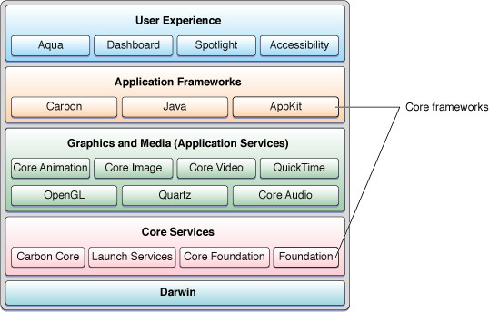
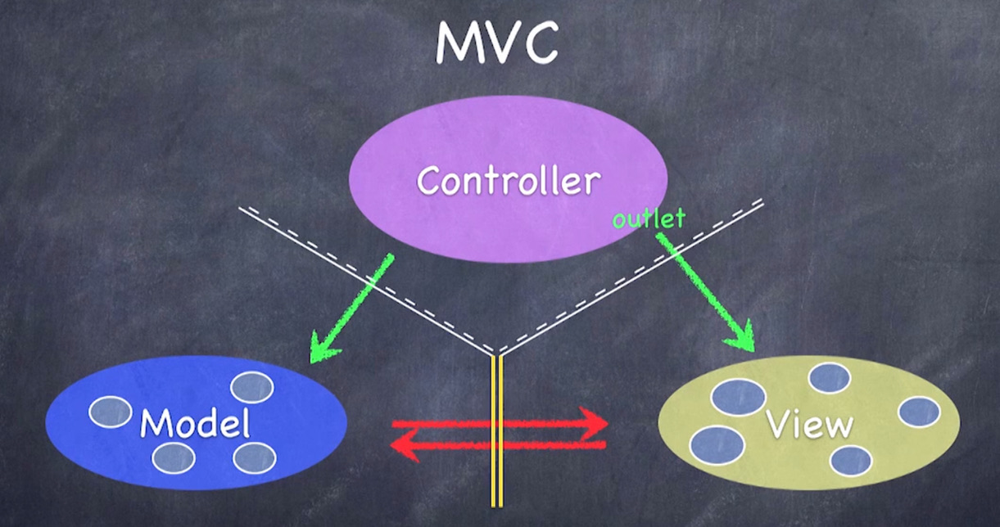
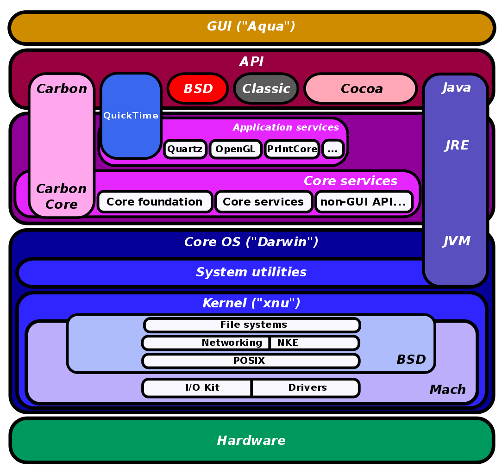
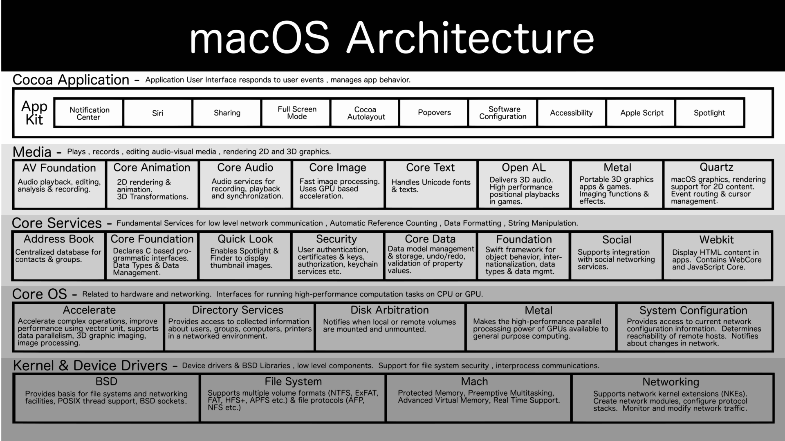
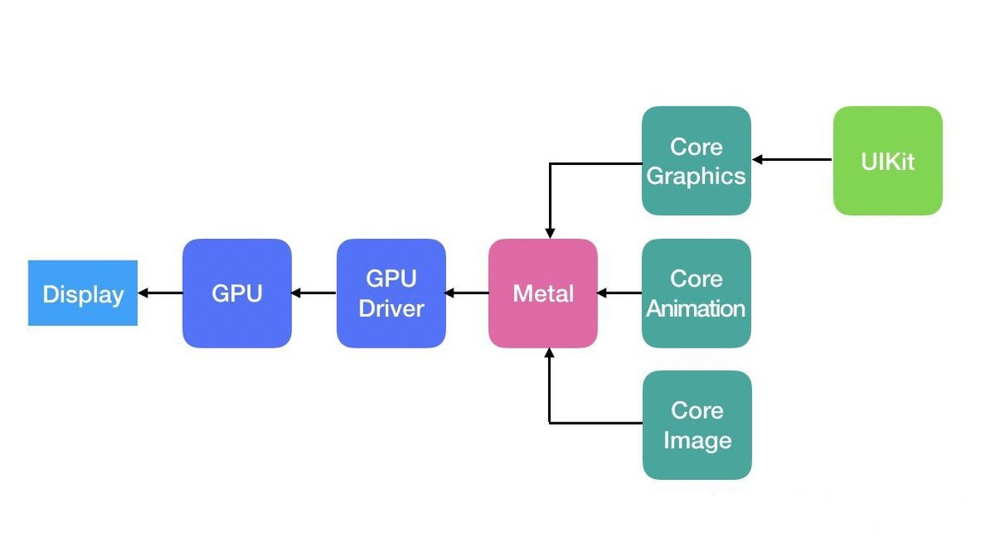
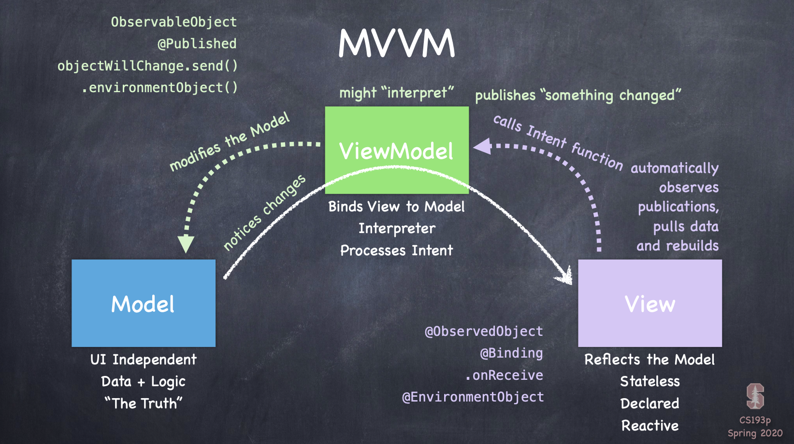

# learn swift

[toc]


swift是一门语言，语言本身和操作系统，硬件，API等都是没有关系的，但因为swift是有Apple创造的（虽然现在是开源的）用于且仅用于Apple产品的软件开发，目前由指IOS和MacOS的软件开发。（理论上也可以做其他操作系统的适配，但是没“人”做，将来也几乎没有“人”去做，微软有c#，c++，谷歌有java）所以呢，这就不仅仅是学习一门语言，所以这个名字也不太恰当——这应该是Apple 软硬件生态的软件开发学习。

## Apple API框架

### 总体框架

所以我们从一开始就不应该拿过语言来学习（比如怎么声明量，函数或者类，然后有哪些“新”特性），而是先了解Mac系统的框架：



**由Apple的[Documentation Archive](https://developer.apple.com/library/archive/navigation/)网站的目录，我们也能看到清晰的架构图：**

- [Cocoa Layer](https://developer.apple.com/library/archive/navigation/#section=Frameworks&topic=Cocoa Layer)

- - AddressBookUI
  - AppKit
  - ContactsUI
  - Intents
  - MapKit
  - MessageUI
  - Messages
  - ReplayKit
  - ScreenSaver
  - SecurityInterface
  - TVMLKit
  - Twitter
  - UIKit
  - WatchKit
  - iAd

- [Web Services](https://developer.apple.com/library/archive/navigation/#section=Frameworks&topic=Web Services)

- - Safari Extensions
  - iAd JS

- [Media Layer](https://developer.apple.com/library/archive/navigation/#section=Frameworks&topic=Media Layer)

- - ARKit
  - AVFoundation
  - AVKit
  - AudioToolbox
  - AudioUnit
  - AudioVideoBridging
  - CoreAudio
  - CoreGraphics
  - CoreImage
  - CoreMIDI
  - CoreText
  - CoreVideo
  - DVDPlayback
  - DiscRecording
  - GLKit
  - GameController
  - IMServicePlugIn
  - ImageIO
  - InstantMessage
  - MediaLibrary
  - Metal
  - Metal Performance Shaders
  - ModelIO
  - OpenAL
  - OpenGL
  - OpenGLES
  - Photos
  - QTKit
  - Quartz
  - QuartzCore
  - QuickTime
  - SceneKit
  - SpriteKit

- [Core Services Layer](https://developer.apple.com/library/archive/navigation/#section=Frameworks&topic=Core Services Layer)

- - AddressBook
  - ApplePay JS
  - ApplicationServices
  - Automator
  - CFNetwork
  - CalendarStore
  - CallKit
  - Carbon
  - CloudKit
  - Collaboration
  - Contacts
  - CoreData
  - CoreFoundation
  - CoreLocation
  - CoreMedia
  - CoreMotion
  - CoreServices
  - CryptoTokenKit
  - EventKit
  - Foundation
  - GameCenter
  - GameplayKit
  - HealthKit
  - HomeKit
  - InputMethodKit
  - InterfaceBuilderKit
  - JavaScriptCore
  - LatentSemanticMapping
  - MultipeerConnectivity
  - OpenDirectory
  - PassKit
  - PublicationSubscription
  - PushKit
  - QuickLook
  - SafariServices
  - ScriptingBridge
  - Security
  - ServiceManagement
  - Speech
  - StoreKit
  - SyncServices
  - WatchConnectivity
  - WebKit
  - WebObjects

- [Core OS Layer](https://developer.apple.com/library/archive/navigation/#section=Frameworks&topic=Core OS Layer)

- - Accelerate
  - CoreBluetooth
  - DirectoryService
  - DiskArbitration
  - ExternalAccessory
  - LocalAuthentication
  - NetworkExtension
  - OpenCL
  - System
  - SystemConfiguration
  - XCTest
  - XgridFoundation

- [Kernel & Driver Layer](https://developer.apple.com/library/archive/navigation/#section=Frameworks&topic=Kernel %26amp%3B Driver Layer)

- - IOBluetooth
  - IOKit
  - ImageCaptureCore
  - Kernel


计算机大框架都是如出一辙，不会有本质的变化的，也就是层层抽象———从硬件到操作系统到API到软件的总体框架。而对于MacOS，我们做的当然是看看Apple对此的具体实现形式是什么，再来讨论它们的优缺点（这会是很后来的事儿了）。

>[Mac架构](https://guofanbang.com/macos结构知多少，一看就懂了.html)
>
>前身
>
>1985年，乔布斯在内部斗争失败，离开苹果创建了NeXT，在NeXT中，他的团队基于Mach和BSD创建了一款类Unix的面向对象的操作系统——NeXTSTEP，1996年乔布斯回归苹果之后，这款先进于Classic Mac OS的操作系统也随之来到了苹果，最终取代了比较原始的Classic Mac OS。
>
>Darwin Operarting System
>
>[Apple内核开发官方文档](https://developer.apple.com/library/archive/documentation/Darwin/Conceptual/KernelProgramming/Architecture/Architecture.html)
>Darwin是macOS的基础部分（或者称为Core OS），它也是一款开放源代码的类Unix操作系统。它大体由两部分组成：XNU内核和Unix工具。
>
>由于开放源代码的特性，所以一些组织正在利用苹果释出的Darwin源码进行二次开发，比如PureDarwin项目。
>
>XNU
>
>我们通常会说macOS的内核是“Darwin”，其实这是一个不严谨的说法，因为Darwin不只包含内核，还包括其他东西。严格来说macOS的内核是XNU。
>
>说到这里，插一句题外话，苹果有一个自相矛盾的地方，虽然macOS已经通过Unix认证，然而XNU的全称和GNU格式一样，是XNU’s not Unix，顾名思义，XNU不是Unix。
>
>XNU是macOS的核心部分，它是一款结合了微内核与宏内核特性的混合内核，它包括三个部分：Mach、BSD和I/O Kit。
>
>Mach
>
>Mach原来是一款微内核，XNU中的Mach来自于OSFMK 7.3（Open Software Foundation Mach Kernel)）它负责CPU调度、内存保护等功能。它是macOS内核中最重要的部分，XNU中大部分代码来自于它，而且macOS中的可执行文件也是mach-o格式。
>
>BSD
>
>XNU中包含一个经过修改的BSD，它负责进程管理、Unix文件权限、网络堆栈、虚拟文件系统、POSIX兼容。macOS之所以符合单一Unix规范，也正是因为如此。
>
>I/O Kit
>
>I/O Kit是XNU内核中的开源框架，可帮助开发人员为Apple的macOS和iOS操作系统编写设备驱动程序代码。I/O Kit框架由NeXTSTEP的DriverKit演变而来，与Mac OS 9的设备驱动程序框架或BSD的没有任何相似之处。
>
>命令行工具
>
>除了内核以外，Darwin还包括一些Unix工具，这些Unix工具一些是Apple开发，一些来自于第三方，比如FreeBSD Project、GNU Project、Apache。
>
>初始化程序launchd
>
>Launchd由苹果开发，它是一款统一服务管理框架，用于启动，停止和管理macOS中的守护进程，应用程序，进程和脚本。由于它支持多线程，所以它比传统的Unix初始化程序SysVinit要高，launchd同时正在被移植到FreeBSD平台，它的设计思想也被systemd所借鉴，后者成为目前Linux发行版中的主流系统初始化程序。
>
>Core Foundation
>
>Core Foundation（也称为CF）是macOS和iOS中的C应用程序编程接口（API），是低级例程和包装函数的混合。
>
>Core Graphics
>
>The Core Graphics framework is based on the Quartz advanced drawing engine. It provides low-level, lightweight 2D rendering with unmatched output fidelity. You use this framework to handle path-based drawing, transformations, color management, offscreen rendering, patterns, gradients and shadings, image data management, image creation, and image masking, as well as PDF document creation, display, and parsing.
>In macOS, Core Graphics also includes services for working with display hardware, low-level user input events, and the windowing system.
>
>Quartz
>
>macOS毕竟是类Unix操作系统，类Unix操作系统想要进行图形化操作，必须要有一个图形框架，在Linux上我们有X11，有Wayland，在macOS中，我们有Quartz。它是一款基于PDF技术的图形框架。
>
>作为一个类unix，不兼容X11是不可能的，如果你想在macOS中运行X11应用，也可以，有个开源项目叫XQuartz了解一下。
>
>Cocoa
>
>Cocoa是苹果公司为Mac OS X所创建的原生面向对象的API，是Mac OS X上五大API之一（其它四个是Carbon、POSIX、X11和Java）。
>
>苹果的面向对象开发框架，用来生成Mac OS X的应用程序。主要的开发语言为Objective-c,一个c的超集。Cocoa开始于1989年9月上市的NeXTSTEP 1.0，当时没有Foundation框架，只有动态运行库，称为kit,最重要的是AppKit. 1993年NeXTSTEP 3.1被移植到了Intel, Sparc, HP的平台上，Foundation首次被加入，同时Sun和NeXT合作开发OpenStep也可以运行在Windows系统上VCV。
>
>据说Cocoa API里面到现在还有不少NS开头的API，何为NS？NS者，NeXTSTEP也。
>
>Spotlight
>
>10.4（Tiger）中引入的快速搜索技术，从iOS3.0开始被移植到iOS。其背后的核心力量是一个索引服务器mds，mds在MetaData框架中，是一个没有GUI的后台服务。在命令行可以通过mdxxx访问。
>
>Aqua UI
>
>macOS的桌面环境，类似Linux中的GNOME。
>
>不过，不是所有Mac OS X都是Aqua UI，在Mac OS X早期测试版Rhapsoy中，用的还是经典的Classic Mac OS界面。
>
>系统的第一个用户进程launchd负责启动GUI，支持GUI工作的主进程是WindowServer。这个程序是CoreGraphics框架的一部分，而CoreGraphics框架深深藏在另一个框架ApplicationServices中。
>
>WindowServer的代码实际上不完成任何实际工作，而是由CoreGraphics中的CGXServer函数完成。CGXServer会检查自己是否以何种方式运行，然后在后台fork出子进程，当子进程准备好后，LoginWindow（由launchd启动）启动交互式登录过程。LoginWindow的配置文件/etc/ttys。
>
>[傻傻分不清：Quartz2D、QuartzCore、CoreAnimation、CoreImage、CoreGraphics](https://www.jianshu.com/p/397690fd4555)
>
>1. Quartz2D是CoreGraphics的一部分API的抽象，不是实际存在的.framework
>2. CoreGraphics定义了颜色、位置、字体、路径、图片等UIKit的常见属性。是构成UIKit的基石。
>3. QuartzCore和CoreAnimation是雌雄同体的同义词。
>4. CoreAnimation定义了动画类来对layer做动画，定义了layer来呈现内容。定义了仿射变换来做3D动画。
>5. CoreImage定义了滤镜，来对图片进行颜色过滤混合等操作。
>
>PS：UIKit里的UIView，封装了layer来呈现内容，内容通过CoreGraphics来绘制到layer上，其中位置、大小、颜色，也都在CoreGraphics里定义了。并且加上了用户事件，用来响应用户的输入、点击、拖拽等操作。


### 设计模式

MVC设计模式是MacOS一直以来遵循的设计模式，原理顾名思义：M=Model, V=View, C=Controler：

Model就是为了实现功能的那部分代码的集合，比如某些无可视化界面的app只需要这部分就可以，然后在terminal中通过指令运行。而View更容易理解，就是可视化界面的设计，特殊的在Apple设备中，界面设计一致是行业典范，而它也提供了“易用”统一的接口（API）使得开发者编写的软件能有较为统一的设计语言，而不难理解，Model和View是相对独立的，改变UI的设计不影响Model的计算过程和输入输出，比如微信登陆界面换成半透明的漂亮界面，甚至加入动画，这不影响你只是输入你的账号和密码，交由Model来联网验证微信服务器，从而执行下一步操作。


### Cocoa框架

这就是MacOS操作系统根据MVC模式，适用于Objective-C和swift语言设计的一整套系统APIs的具体实现。

系统级API也就是操作系统为“我们”（软件开发者）做的“事”，这包括太多，比如内存管理（你的软件如何动态使用和管理内存），文件系统（你的软件怎么写入和读取“文件”），图形界面（你的软件窗口如何被随意的移动，伸缩），网络协议（你的软件如何遵守互联网协议访问某个服务器并收发数据）等等。

而根据这个MVC模式，我们可以把这些API也有关于图形界面的和———在cocoa框架中，被称为AppKit（IOS平台是UIkit）。其实三者均是swift和Objective-C语言可以调用的API的集合。


### API

* 一些底层的API，比如文件系统，SocketAPI，Ports，都是在[Foundation](https://developer.apple.com/documentation/foundation)库中。

* IO怎么访问？IOkit就是系统扩展输入输出的API，用于写驱动程序，现在苹果开发了[Drivekit](https://developer.apple.com/cn/system-extensions/)来替代IOkit。

* 更“高级简单”的网络接口呢？[webkit](https://developer.apple.com/documentation/webkit)是苹果买断研发并开源的浏览器内核。

  

#### AppKit，UIkit，SwiftUI，Metal，怎样的关系？

Metal是图形API，它构建在GPU硬件及显卡驱动之上，但是即将全线使用自研芯片的Apple，Metal就可以直接是在自研的GPU硬件架构上优化了。
GPU或者说图像处理的流程就要到计算机图形学中探讨了。

Metal的设计概念也就是计算机图形学的部分，对应于网络就像是实现网络协议的部分，像是SocketAPI，而AppKit是在其之上构建的专门针对于窗口动画等图形界面的进一步封装，对应于网络的WebKit。

UIkit是iOS端类似于MacOS的AppKit的图形界面API，而SwiftUI是在WWDC2019上首次提出，在UIKit和AppKit之上构建的Apple全平台图形界面API，而后会逐渐砍掉前两者。



### 小结

在对Mac软硬件系统的深入了解下，也能渐渐理解为何Apple凭借屈指可数的产品线就成为市值第一的公司。他们对自己产品的深入理解超过任何一家企业。我们来简单回顾Apple产品自研之路，此时我们不再只能看到表面的工业设计（这就是电子产品的脸）：

* GUI设计：被认为是Apple成立之初核心竞争力所在，但这时我们要注意，Mac系统是基于开源UNIX，BSD的，也就是系统内核并不是Apple自研，包括文件系统，和一些基础的API，比如IOKit等也并非自研。当时主要是GUI设计。而对于GUI的实现细节，足以成篇大论，比如圆角设计，配色选择，系统过度动画，字体设计渲染，Apple几乎都做到行业顶端。这些才是Apple之处在软件方面的核心竞争力之一。

* 工业设计：这也是Apple的核心竞争力之一，这一点是普通消费者最看重的，也是很多“果粉”和“果黑”的争执重点之一。不得不说，一家电子产品公司像奢侈品公司一样注重工业设计，工艺，产品质量是极其可贵的，这也的确是Apple的魅力所在。iPhone4，iPhone7，iPad pro11，MacbookAir，MacPro，iMac，这些经典设计会载入史册。（额……iPhone 11pro的丑也会载入史册的，前刘海后浴霸，这倒车开的猝不及防）

* Clang&LLVM编译器：Apple注重自己产品的运行效率，而系统主要用类c语言写，而Mac软件开始是用Objective-C写（API对其适配），但GNU不给力，最终还是自己做吧：Chris Lattner，苹果开发LLVM编译器的主导者，人才是企业和国家发展的原材料啊！

* HFS/APFS文件系统：开始苹果使用开源的文件系统，但这远不及Mac发展的步伐，而文件系统也是实现高效率检索的底层基础，而经过几代发展，APFS文件系统已十分优异，Apple产品的Spotlight搜索也是竞争对手目前难以企及的。（当然从效率，安全性等角度，微软的NTFS文件系统也毫不逊色）

* iCloud/AppStore云服务：利用服务器打通产品之间，用户之间的界限，这不是苹果首创，但凭借其完整的生态，iCloud和AppStore的完成度几乎是无人出其右，而设备间互联互通也成为Apple的核心竞争力之一。

* A系列ARM芯片：iPhone4的A4处理器开启了Apple的辉煌造芯之路，但没有一个人能一口吃成胖子，A4基本就是三星的ARM架构，做的优化也不多。Jim Keller，真的可以说是芯片一哥了，A系列处理器和AMD的两次辉煌架构，其中就有最近来的zen架构，都是由其操刀。
但后来的优化主要是CPU，A系列的自研GPU直到A11才问世，但只优化了一年，A12的GPU就吊打竞争对手了。（A系列的芯片尤其是CPU也没有太多架构上的神奇创新，超大Cache狂碓料，单款芯片走量无敌强行降低成本，）称之为核心竞争力有点牵强，但芯片绝对是构建整个生态的基础。

> 芯片设计本身相对于软件没有太多“可玩性”，这有些类似城市规划路线的感觉，就是各部门都要协同工作，但总的有离得远的，目的就是统筹规划让总体效率最高。

* Metal API：API有大有小，图形API属于工作量比较大的，（小的肯定不能说，因为这就是软件公司分内工作，图形处理对现代计算机太重要，所以GUI也单独说了）所以还可以单独拿出来说一说：这也属于操作系统的一部分，是负责封装GPU处理图形的代码集，而在很久一段时间内，Apple使用OpenGL作为其图形API，而隔壁家微软早就研发了自己的DirectX，加上其对游戏的布局，Windows打游戏甩开Mac一万条街。而借助Metal+AppleAcade+ARM版Mac三板斧，轻松移植IOS创造的游戏，接下来几年，Mac可能在游戏上会有所进步。Apple把Metal内核开源（公开源代码）了。

* Swift 语言：这谈不上是像c一样多么划时代的语言，但是它也像众多现代编程语言一样，继承发展了众多语言的优点，比如自动内存管理，闭包，运算符重载……比起Objective-C还是显著提高Apple生态应用开发速度的。提一句，还是这哥们——Chris Lattner——发明的，且后来Apple把它开源（公开源代码）了。

* 较为出色的原生app：Apple地图被吐槽多次，Xcode也见仁见智，但Apple的确还是设计了很多出色的原生app：
天气（简约篇讲的界面，实时更新的动画背景和当前天气一致是真的amazing）
App Store（不用多说，世上只有一个App Store）
相册（ios13之后，不再只有漂亮的外观，修图等功能性也不错，再有live photo和iCloud相册加持，不逊于Google相册了吧，再者，你想在windows上看照片？）
图书/preview（iOS其实也没啥，替代品一堆，但是Mac端一对比pc，啥都能预览，是真的舒服）
股市（世上好像也只有一个能看的股票app）Safari（可能没有Chrome功能多，但MacOS big sur之后大更新了，简约，同步，隐私，还有自动填充密码，By the way, 浏览器内核WebKit 最初是Apple买来开发的，后来把它开源了，Chrome内核也是在此基础改进的）
地图（功能是挺垃圾的，但界面设计我觉得国产应用真的应该学习学习）
还有日历时钟信息等，也都有不少优点，总的来说，Apple原生的app，不仅是能用，不少挺好用。当然这部分有些重复，因为一部分是GUI的，一部分是iCloud的。

* 接口：硬件不只有芯片，内存，硬盘，屏幕，接口都是重要组成。而这就不得不提三星的牛逼了，内存硬盘屏幕一把抓，你买谁家都是我挣钱。
目前主流趋势接口标准雷电3（使用物理接口USBTypeC，具体接口可以看我讲接口一篇），intel是协议主要制定者（intel在接口上也不挤牙膏嘛），Apple也参与制定并力推。
lightning接口并iOS设备独占（被骂靠卖线发家）。平心而论在TypeC出世之前，lightning接口难道不是好太多了吗——对称随便插，体积小。
还有几年前MacBook的MagSafe（可惜不复返了），apple watch的无线充电器，都是amazing的设计。

* 软硬件技术的技术创新：多点触控（防误触算法），指纹解锁（指纹识别算法），HDR照片（ISP），3DTouch， Face ID（人脸识别算法，不同于普通机器学习人脸识别的算法）且刘海虽丑，有时人脸不如指纹方便，但技术本身没错，很完善，称得上科技史上的一大发明。

* Carplay 和Home Kit 两大API：这两个API的开发，其实有些非常重要的意义，是讲计算机产业的创造力辐射到传统行业，带动产业联动发展的一大步，传统产业智能化，万物互联其实发展在5G之前（包括大数据，云计算，说什么5G是其基础的都是忽悠人，间接制造行业泡沫的，5G只能说是加速并更好的实现上述4个领域罢了）

* 辅助功能：VioceOver 很好用，虽然我不是残疾人。谷歌做的也不错，这点不是情怀，社会上总有弱势群体，有点像是水滴筹，给有困难的人做点举手之劳，这世界可能就更好了，更好的世界自己也享受其中。

* 广告：这不是一个技术公司干的事儿，但是Apple几乎是最会做广告的技术公司（完全为了严谨，看它广告，基本上就认为它是个广告公司）这也不无道理，因为GUI到工业设计，Apple的审美一直是业界标杆，广告自然也是审美问题。（买Apple产品一定要看看它的广告，就算你不欣赏，想想你花的钱多少给它拍广告了？不看不亏吗）

说到这里我就想到：比如我不残疾，那么Apple开发辅助功能这部分钱，我就相当于捐的，因为我从不用这部分功能，但一想人家是残疾人，不容易，就捐给他们吧。
与此类推：Apple为其产品做了这么多，如果你不用iCloud，那Apple用来开发iCloud 的这部分，你就捐给了用这个功能的人。（因为由于你的购买，销量增加，产量增加，成本下降，相当于你瘫了这部分成本）
同理所有商品均是如此。（因为这就是劳动交换的过程，反正你劳动了，拿了工资，花了结果没有获得别人的劳动成果，反而替别人分摊了成本）一直类推：请问你拥有的所有商品，捐了百分之多少呢？而你的劳动，又有百分之多少转化成了劳动产物呢？


## LLVM与Swift

[2015 LLVM Developers’ Meeting: Joseph Groff & Chris Lattner “Swift's High-Level IR: A Case Study..." - YouTube](https://www.youtube.com/watch?v=Ntj8ab-5cvE)：这是一个YouTube讲LLVM中Swift实现的视频。


## swift 

* [中文文档](https://www.runoob.com/manual/gitbook/swift5/source/_book/chapter2/04_Collection_Types.html)
* [官方文档](https://docs.swift.org/swift-book/LanguageGuide/CollectionTypes.html)


### 类型


> 强类型：如果一门语言倾向于不对变量的类型做隐式转换，那我们将其称之为强类型语言
>
> 弱类型：相反，如果一门语言倾向于对变量的类型做隐式转换，那我们则称之为弱类型语言

C++、Swift、Java、python都属于强类型（python虽然有时存在类型转换，但是倾向于不转换），而JavaScipt等属于弱类型。


> 动态类型：如果一门语言可以在运行时改变变量的类型，那我们称之为动态类型语言
>
> 静态类型：相反，如果一门语言不可以在运行时改变变量的类型，则称之为静态类型语言

python属于动态类型，而C++、Swift、Java属于静态类型。关于动态类型就印证了那句话：一切皆对象。

***？因为只有把许多基本类型定义为类，它才可以运行时确定？***


> 值类型：传递参数时是通过复制该值传递。
>
> 引用类型：通过引用来查找传递该参数，也就是指针。

值类型、引用类型与上述不同，上述说的更像是语言，而这里要说的，每个语言几乎都有值类型和引用类型，下面来具体讲述。 


#### 值类型与引用类型

几乎每种语言都存在这种问题。有个模糊的概念，就是值类型一般存在栈中（但不仅限于栈），而[引用类型只能放在堆中](https://blog.csdn.net/nicepainkiller/article/details/78213694)（**这里有问题，小数组不应该是在栈上吗，为啥是引用类型？**）。其中栈是个较复杂的历史问题。


> 比如C/C++的栈实现，是得到了CPU的基本支持的：一方面，CPU就有相应的栈指针寄存器，所以这是直接绑定到CPU指令上的，执行、取值都快速的多；另一方面，Stack的最顶端一般会留存在CPU registers和 cache中，遇到频繁但是层次不多的函数调用，可以利用高速 cache（栈一般是在一级缓存中做缓存的, 而堆则是在二级缓存中，**这个表述可能有问题**），而大块的内存会破坏这种优化。
>
> 比如swift语言中, 三个字及以内的struct结构, 可以在栈中内联, 从而达到更快的处理速度。

这也是为什么值类型一般存在栈上，且为占用内存小的数据。但是像python这种值类型，即使也是在栈上，它的栈并没有直接利用上CPU指令集，而是编译器靠算法实现了这种先入后出的数据结构罢了，python一开始就申请了一大块堆内存来运行时确定大部分工作，这也是python被称为动态语言的原因之一，更是效率低的重要原因之一。

对于Swift，数字、结构等是值类型（**但不一定被分配在栈上**），数组、类是引用类型。对于多数语言，**有争议的一般都在数组（Array/List）上**，因为数组算是基本类型，但可大可小，比如C++中，默认声明的数组是在栈上，使用new等申请的数组是在堆上，这时往往是数组比较大。


 **Q：结构是值类型，其可以包含函数和数组，但是数组、函数确是引用类型？**

A：结构中声明数组和函数，所以同样地，传递结构时，其”所有“数据（包括数组、函数的引用/指针，但不包括其本身）被拷贝，所以上述问题不冲突。而且，函数


#### 函数也是类型


```swift
//下面这个函数的类型是 (Int, Int) -> Int，可以解读为:“这个函数类型有两个 Int 型的参数并返回一个 Int 型的值”。
func addTwoInts(_ a: Int, _ b: Int) -> Int {
    return a + b
}

//”定义一个叫做 mathFunction 的变量，类型是‘一个有两个 Int 型的参数并返回一个 Int 型的值的函数’，并让这个新变量指向 addTwoInts 函数”。需要先定义这个函数
var mathFunction: (Int, Int) -> Int = addTwoInts
```


这同样有上文中值类型和引用类型的问题。

**Q：函数里的很多自动变量是存在栈里的，函数本身应该被作为一个整体吧，它是在堆中还是在栈中？**

A：这个问题说明有个基本问题不清楚——**[函数调用过程](https://www.jianshu.com/p/ea9fc7d2393d)**。

> **下面是我个人的猜想，并不完全对，还有待验证。**
>
> 函数名本身是引用没错，但是函数又是一个特殊的存在，因为函数是最小的代码的集合，也就意味着函数调用本身就是压入栈的过程，所以当把一个函数压入栈，就是将其所在的所有指令和数据压入栈，不过这其中有一部分是指针，也就是所谓的引用变量，包括大数组、对象和函数调用。因为函数比较特殊，所以在栈中执行函数调用时，就是一个寻址的过程，找到新的函数，把新的函数压入栈重复上述步骤，直到函数中没有函数调用，该函数执行完毕，栈空间清空（标记为可以写入）。
>
> 所谓栈，是为了让多数“老老实实”顺序执行的指令执行（函数本身就是顺序执行），但由于实际寄存器空间有限，有些指令/数据（如函数调用，声明对象等其实是一堆其他需要跳转到大块内存/缓存的指令）就需要中断来寻址等，所以才有了堆。


#### 可选类型（Optional）

> **节选自：[王垠博客](http://www.yinwang.org/blog-cn/2015/11/21/programming-philosophy)**
>
> 使用Optional类型。Java 8和Swift之类的语言，提供了一种叫Optional的类型。正确的使用这种类型，可以在很大程度上避免null的问题。null指针的问题之所以存在，是因为你可以在没有“检查”null的情况下，“访问”对象的成员。
>
> Optional类型的设计原理，就是把“检查”和“访问”这两个操作合二为一，成为一个“原子操作”。这样你没法只访问，而不进行检查。这种做法其实是ML，Haskell等语言里的模式匹配（pattern matching）的一个特例。模式匹配使得类型判断和访问成员这两种操作合二为一，所以你没法犯错。
>
> 比如，在Swift里面，你可以这样写：
>
> ```swift
> let found = find()
> if let content = found {
>   print("found: " + content)
> }
> ```
>
> 你从`find()`函数得到一个Optional类型的值`found`。假设它的类型是`String?`，那个问号表示它可能包含一个String，也可能是nil。然后你就可以用一种特殊的if语句，同时进行null检查和访问其中的内容。这个if语句跟普通的if语句不一样，它的条件不是一个Bool，而是一个变量绑定`let content = found`。
>
> 我不是很喜欢这语法，不过这整个语句的含义是：如果found是nil，那么整个if语句被略过。如果它不是nil，那么变量content被绑定到found里面的值（unwrap操作），然后执行`print("found: " + content)`。由于这种写法把检查和访问合并在了一起，你没法只进行访问而不检查。


#### 集合类型

Swift 语言提供 `Arrays`、`Sets` 和 `Dictionaries`三种基本的*集合类型*用来存储集合数据。数组（Arrays）是有序数据的集。集合（Sets）是无序无重复数据的集。字典（Dictionaries）是无序的键值对的集。


#### 类和结构

在Swift中类和结构share很多特性（这点同C++相似，但是区别也很大，C++的Struct更像class），比如：

- 定义属性用于存储值
- 定义方法用于提供功能
- 定义下标操作用于通过下标语法访问它们的值
- 定义构造器用于设置初始值
- 通过扩展以增加默认实现之外的功能
- 遵循协议以提供某种标准功能

但是有一个重要不同——**Struct是value type，class是reference type**，除此之外，class还有Struct没有的功能：

- 继承允许一个类继承另一个类的特征
- 类型转换允许在运行时检查和解释一个类实例的类型
- 析构器允许一个类实例释放任何其所被分配的资源
- 引用计数允许对一个类的多次引用

> 在很多时候，Struct被用于指代所有值类型的数据类型，比如int也是一个Struct，double也是一个Struct等。这也是可以理解的——正是由于Struct和class的区别。


### 泛型（Generics）

在C++、Java中都有泛型的概念，也就是函数模版。但是之前没想到的是——**数组（Array）便是泛型应用的最好例子**！

所谓的泛型/模版，我们可以理解为“**Don't care Type**”。定义时<What ever type>，使用时<int>或者<double>之类的，再赋值。

```swift
struct Array<Element> {
    //...
    func append(_element: Element) {
        //...
    }
}

var a = Array<int>()
a.append(5)
```


### 闭包（Closures）

简单的来讲，这就“是”个inline函数。**当函数很简单时，若将其return值作为参数传递，则将整个函数inline作为参数传递**。

但实现起来也没这么简单，因为传递函数传递的是函数地址，怎么获取其内部变量值呢？这理论上和要传递的参数类型不匹配啊！


### 方法（Methods）

方法指的是结构或类里面的函数（C语言结构中不能定义方法，但是C++/Swift可以）。主要分为实例方法（Instance Methods）和类型方法（Type Methods）。顾名思义，实例就是在创建实例后才能使用的方法，也是区别于每个实例的。而类型方法则是可以针对类本身的。

这就要说到**在定义类-->实例化的过程中，类在内存中的行为**：


#### Instance Methods


#### Type Methods


### [关键字](https://swift.gg/2019/08/22/Swift-Keywords/)


#### 声明式关键字

**associatedtype**：在协议中，定义一个类型的占位符名称。直到协议被实现，该占位符才会被指定具体的类型。

```
protocol Entertainment  
{  
    associatedtype MediaType  
}

class Foo : Entertainment  
{  
    typealias MediaType = String //可以指定任意类型
}
```

**class**：通用、灵活的结构体，是程序的基础组成部分。与 struct 类似，不同之处在于：

- 允许一个类继承另一个类的特性。
- 类型转换，允许在运行时检查和指定一个类的实际类型。
- 析构方法允许类的实例释放所有资源。
- 引用计数允许多个引用指向一个实例。

```
class Person  
{  
    var name:String  
    var age:Int  
    var gender:String  
}
```

**deinit**：当一个类的实例即将被销毁时，会调用这个方法。

```
class Person  
{  
    var name:String  
    var age:Int  
    var gender:String

    deinit  
    {  
        //从堆中释放，并释放的资源
    }  
}
```

**enum**：定义了包含一组有关联的值的类型，并可以以一种类型安全的方式使用这些值。在 Swift 中，枚举是一等类型，拥有在其它语言中只有 class 才会支持的特性。

```
enum Gender  
{  
    case male  
    case female  
}
```

**extension**：允许给已有的类、结构体、枚举、协议类型，添加新功能。

```
class Person  
{  
    var name:String = ""  
    var age:Int = 0  
    var gender:String = ""  
}

extension Person  
{  
    func printInfo()  
    {  
        print("My name is \(name), I'm \(age) years old and I'm a \(gender).")  
    }  
}
```

**fileprivate**：访问控制权限，只允许在定义源文件中访问。

```
class Person  
{  
    fileprivate var jobTitle:String = ""  
}

extension Person  
{
    //当 extension 和 class 在同一个文件中时，允许访问
    func printJobTitle()  
    {  
        print("My job is (jobTitle)")  
    }  
}
```

**func**：包含用于执行特定任务的代码块。

```
func addNumbers(num1:Int, num2:Int) -> Int  
{  
    return num1+num2  
}
```

**import**：引入一个以独立单元构建的框架或者应用。

```
import UIKit

//可以使用 UIKit 框架下的所有代码
class Foo {}
```

**init**：类、结构体、枚举的实例的初始化准备过程。

```
class Person
{  
    init()  
    {  
        //设置默认值，实例准备被使用
    }  
}
```

**inout**：将一个值传入函数，并可以被函数修改，然后将值传回到调用处，来替换初始值。适用于引用类型和值类型。

```
func dangerousOp(_ error:inout NSError?)  
{  
    error = NSError(domain: "", code: 0, userInfo: ["":""])  
}

var potentialError:NSError?
dangerousOp(&potentialError)

//代码运行到这里，potentialError 不再是 nil，而是已经被初始化
```

**internal**：访问控制权限，允许同一个模块下的所有源文件访问，如果在不同模块下则不允许访问。

```
class Person  
{  
    internal var jobTitle:String = ""  
}

let aPerson = Person()  
aPerson.jobTitle = "This can set anywhere in the application"
```

**let**：定义一个不可变的变量。

```
let constantString = "This cannot be mutated going forward"
```

**open**：访问控制权限，允许在定义的模块外也可以访问源文件里的所有类，并进行子类化。对于类成员，允许在定义的模块之外访问和重写。

```
open var foo:String? //这个属性允许在 app 内或 app 外重写和访问。在开发框架的时候，会应用到这个访问修饰符。
```

**operator**：特殊符号，用于检查、修改、组合值。

```
//一元运算符 "-"，改变值的符号
let foo = 5  
let anotherFoo = -foo //anotherFoo 等于 -5

//二元运算符 "+" 将两个值相加
let box = 5 + 3

//逻辑运算符 "&&" 将两个布尔值进行组合运算
if didPassCheckOne && didPassCheckTwo

//三元运算符需要使用三个值
let isLegalDrinkingAgeInUS:Bool = age >= 21 ? true : false
```

**private**：访问控制权限，只允许实体在定义的类以及相同源文件内的 extension 中访问。

```
class Person  
{  
    private var jobTitle:String = ""  
}

// 当 extension 和 class 不在同一个源文件时
extension Person  
{
    // 无法编译通过，只有在同一个源文件下才可以访问
    func printJobTitle()  
    {  
        print("My job is (jobTitle)")  
    }  
}
```

**protocol**：定义了一组方法、属性或其它要求，用于满足特定任务和一系列功能。

```
protocol Blog  
{  
    var wordCount:Int { get set }  
    func printReaderStats()  
}

class TTIDGPost : Blog  
{  
    var wordCount:Int

    init(wordCount:Int)  
    {  
        self.wordCount = wordCount  
    }

    func printReaderStats()  
    {  
        //打印 post 的数据  
    }  
}
```

**public**：访问控制权限，允许在定义的模块外也可以访问源文件里的所有类，但只有在同一个模块内可以进行子类化。对于类成员，允许在同个模块下访问和重写。

```
public var foo:String? //只允许在 app 内重写和访问。
```

**static**：用于定义类方法，在类型本身进行调用。此外还可以定义静态成员。

```
class Person  
{  
    var jobTitle:String?

    static func assignRandomName(_ aPerson:Person)  
    {  
        aPerson.jobTitle = "Some random job"  
    }  
}

let somePerson = Person()  
Person.assignRandomName(somePerson)  
//somePerson.jobTitle 的值是 "Some random job"
```

**struct**：通用、灵活的结构体，是程序的基础组成部分，并提供了默认初始化方法。与 class 不同，当 struct 在代码中被传递时，是被拷贝的，并不使用引用计数。除此之外，struct 没有下面的这些功能：

- 使用继承。
- 运行时的类型转换。
- 使用析构方法。

```
struct Person  
{  
    var name:String  
    var age:Int  
    var gender:String  
}
```

**subscript**：访问集合、列表、序列中成员元素的快捷方式。

```
var postMetrics = ["Likes":422, "ReadPercentage":0.58, "Views":3409]  
let postLikes = postMetrics["Likes"]
```

**typealias**：给代码中已经存在的类，取别名。

```
typealias JSONDictionary = [String: AnyObject]

func parseJSON(_ deserializedData:JSONDictionary){}
```

**var**：定义可变变量。

```
var mutableString = ""  
mutableString = "Mutated"
```

#### 语句中的关键词

**break**：终止程序中循环的执行，比如 if 语句、switch 语句。

```
for idx in 0...3  
{  
    if idx % 2 == 0  
    {  
        //当 idx 等于偶数时，退出 for 循环  
        break  
    }  
}
```

**case**：该语句在 switch 语句中列出，在每个分支可以进行模式匹配。

```
let box = 1

switch box  
{  
    case 0:  
    print("Box equals 0")  
    case 1:  
    print("Box equals 1")  
    default:  
    print("Box doesn't equal 0 or 1")  
}
```

**continue**：用于终止循环的当前迭代，并进入下一次迭代，而不会停止整个循环的执行。

```
for idx in 0...3  
{  
    if idx % 2 == 0  
    {  
        //直接开始循环的下一次迭代
        continue  
    }

    print("This code never fires on even numbers")  
}
```

**default**：用于涵盖在 switch 语句中，所有未明确列出的枚举成员。

```
let box = 1

switch box  
{  
    case 0:  
    print("Box equals 0")  
    case 1:  
    print("Box equals 1")  
    default:  
    print("Covers any scenario that doesn't get addressed above.")  
}
```

**defer**：用于在程序离开当前作用域之前，执行一段代码。

```
func cleanUpIO()  
{  
    defer  
    {  
        print("This is called right before exiting scope")  
    }


    //关闭文件流等。  
}
```

**do**：用于表示处理错误代码段的开始。

```
do  
{  
    try expression  
    //语句
}  
catch someError ex  
{  
    //处理错误
}
```

**else**：与 if 语句结合使用。当条件为 true，执行一段代码。当条件为 false，执行另一段代码。

```
if val > 1  
{  
    print("val is greater than 1")  
}  
else  
{  
    print("val is not greater than 1")  
}
```

**fallthrough**：显式地允许从当前 case 跳转到下一个相邻 case 继续执行代码。

```
let box = 1

switch box  
{  
    case 0:  
    print("Box equals 0")  
    fallthrough  
    case 1:  
    print("Box equals 0 or 1")  
    default:  
    print("Box doesn't equal 0 or 1")  
}
```

**for**：在序列上迭代，比如一组特定范围内的数字，数组中的元素，字符串中的字符。*与关键字 in 成对使用。

```
for _ in 0..<3 { print ("This prints 3 times") }
```

**guard**：当有一个以上的条件不满足要求时，将离开当前作用域。同时还提供解包可选类型的功能。

```
private func printRecordFromLastName(userLastName: String?)
{  
    guard let name = userLastName, name != "Null" else  
    {  
        //userLastName = "Null"，需要提前退出
        return  
    }

    //继续执行代码
    print(dataStore.findByLastName(name))  
}
```

**if**：当条件满足时，执行代码。

```
if 1 > 2  
{  
    print("This will never execute")  
}
```

**in**：在序列上迭代，比如一组特定范围内的数字，数组中的元素，字符串中的字符。*与关键字 key 搭配使用。

```
for _ in 0..<3 { print ("This prints 3 times") }
```

**repeat**：在使用循环的判断条件之前，先执行一次循环中的代码。

```
repeat  
{  
    print("Always executes at least once before the condition is considered")  
}  
while 1 > 2
```

**return**：立刻终止当前上下文，离开当前作用域，此外在返回时可以额外携带一个值。

```
func doNothing()  
{  
    return //直接离开当前上下文

    let anInt = 0  
    print("This never prints (anInt)")  
}
```

和

```
func returnName() -> String?  
{  
    return self.userName //离开，并返回 userName 的值
}
```

**switch**：将给定的值与分支进行比较。执行第一个模式匹配成功的分支代码。

```
let box = 1

switch box  
{  
    case 0:  
    print("Box equals 0")  
    fallthrough  
    case 1:  
    print("Box equals 0 or 1")  
    default:  
    print("Box doesn't equal 0 or 1")  
}
```

**where**：要求关联类型必须遵守特定协议，或者类型参数和关联类型必须保持一致。也可以用于在 case 中提供额外条件，用于满足控制表达式。

> where 从句可以应用于多种场景。以下例子指明了 where 的主要应用场景，泛型中的模式匹配。

```
protocol Nameable  
{  
    var name:String {get set}  
}

func createdFormattedName(_ namedEntity:T) -> String where T:Equatable  
{  
    //只有当实体同时遵守 Nameable 和 Equatable 协议的时候，才允许调用这个函数
    return "This things name is " + namedEntity.name  
}
```

和

```
for i in 0…3 where i % 2 == 0  
{  
    print(i) //打印 0 和 2  
}
```

**while**：循环执行特定的一段语句，直到条件不满足时，停止循环。

```
while foo != bar  
{  
    print("Keeps going until the foo == bar")  
}
```

#### 表达式和类型中的关键字

**Any**：用于表示任意类型的实例，包括函数类型。

```
var anything = [Any]()

anything.append("Any Swift type can be added")  
anything.append(0)  
anything.append({(foo: String) -> String in "Passed in (foo)"})
```

**as**：类型转换运算符，用于尝试将值转成其它类型。

```
var anything = [Any]()

anything.append("Any Swift type can be added")  
anything.append(0)  
anything.append({(foo: String) -> String in "Passed in (foo)" })

let intInstance = anything[1] as? Int
```

或者

```swift
var anything = [Any]()

anything.append("Any Swift type can be added")  
anything.append(0)  
anything.append({(foo: String) -> String in "Passed in (foo)" })

for thing in anything  
{  
    switch thing  
    {  
        case 0 as Int:  
        print("It's zero and an Int type")  
        case let someInt as Int:  
        print("It's an Int that's not zero but (someInt)")  
        default:  
        print("Who knows what it is")  
    }  
}
```

**catch**：如果在 do 中抛出一个错误，catch 会尝试进行匹配，并决定如何处理错误。[*我写的一篇 Swift 错误处理的博客节选](https://swiftjectivec.com/swift-error-handling)。

```swift
do  
{  
    try haveAWeekend(4)  
}  
catch WeekendError.Overtime(let hoursWorked)  
{  
    print("You worked (hoursWorked) more than you should have")  
}  
catch WeekendError.WorkAllWeekend  
{  
    print("You worked 48 hours :-0")  
}  
catch  
{  
    print("Gulping the weekend exception")  
}
```

**false**：Swift 用于表示布尔值的两个常量值之一，true 的相反值。

```swift
let alwaysFalse = false  
let alwaysTrue = true

if alwaysFalse { print("Won't print, alwaysFalse is false 😉")}
```

**is**：类型检查运算符，用于确定实例是否为某个子类类型。

```swift
class Person {}  
class Programmer : Person {}  
class Nurse : Person {}

let people = [Programmer(), Nurse()]

for aPerson in people  
{  
    if aPerson is Programmer  
    {  
        print("This person is a dev")  
    }  
    else if aPerson is Nurse  
    {  
        print("This person is a nurse")  
    }  
}
```

**nil**：在 Swift 中表示任意类型的无状态值。

> 与 Objective-C 中的 nil 不同，Objective-C 中的 nil 表示指向不存在对象的指针。

```swift
class Person{}  
struct Place{}

//任何 Swift 类型或实例可以为 nil
var statelessPerson:Person? = nil  
var statelessPlace:Place? = nil  
var statelessInt:Int? = nil  
var statelessString:String? = nil
```

**rethrows**：指明当前函数只有当参数抛出 error 时，才会抛出 error。

```swift
func networkCall(onComplete:() throws -> Void) rethrows  
{  
    do  
    {  
        try onComplete()  
    }  
    catch  
    {  
        throw SomeError.error  
    }  
}
```

**super**：在子类中，暴露父类的方法、属性、下标。

```
class Person  
{  
    func printName()  
    {  
        print("Printing a name. ")  
    }  
}

class Programmer : Person  
{  
    override func printName()  
    {  
        super.printName()  
        print("Hello World!")  
    }  
}

let aDev = Programmer()  
aDev.printName() //打印 Printing a name. Hello World!
```

**self**：任何类型的实例都拥有的隐式属性，等同于实例本身。此外还可以用于区分函数参数和成员属性名称相同的情况。

```
class Person  
{  
    func printSelf()  
    {  
        print("This is me: (self)")  
    }  
}

let aPerson = Person()  
aPerson.printSelf() //打印 "This is me: Person"
```

**Self**：在协议中，表示遵守当前协议的实体类型。

```
protocol Printable  
{  
    func printTypeTwice(otherMe:Self)  
}

struct Foo : Printable  
{  
    func printTypeTwice(otherMe: Foo)  
    {  
        print("I am me plus (otherMe)")  
    }  
}

let aFoo = Foo()  
let anotherFoo = Foo()

aFoo.printTypeTwice(otherMe: anotherFoo) //打印 I am me plus Foo()
```

**throw**：用于在当前上下文，显式抛出 error。

```
enum WeekendError: Error  
{  
    case Overtime  
    case WorkAllWeekend  
}

func workOvertime () throws  
{  
    throw WeekendError.Overtime  
}
```

**throws**：指明在一个函数、方法、初始化方法中可能会抛出 error。

```
enum WeekendError: Error  
{  
    case Overtime  
    case WorkAllWeekend  
}

func workOvertime () throws  
{  
    throw WeekendError.Overtime  
}

//"throws" 表明在调用方法时，需要使用 try，try?，try!
try workOvertime()
```

**true**：Swift 用于表示布尔值的两个常量值之一，表示为真。

```
let alwaysFalse = false  
let alwaysTrue = true

if alwaysTrue { print("Always prints")}
```

**try**：表明接着调用的函数可能会抛出 error。有三种不同的使用方式：try，try?， try!。

```
let aResult = try dangerousFunction() //处理 error，或者继续传递 error  
let aResult = try! dangerousFunction() //程序可能会闪退  
if let aResult = try? dangerousFunction() //解包可选类型。
```

#### 模式中的关键字

**_**：用于匹配或省略任意值的通配符。

```
for _ in 0..<3  
{  
    print("Just loop 3 times, index has no meaning")  
}
```

另外一种用法：

```
let _ = Singleton() //忽略不使用的变量
```

#### 以#开头的关键字

**#available**：基于平台参数，通过 **if**，**while**，**guard** 语句的条件，在运行时检查 API 的可用性。

```swift
if #available(iOS 10, *)  
{  
    print("iOS 10 APIs are available")  
}
```

**#colorLiteral**：在 playground 中使用的字面表达式，用于创建颜色选取器，选取后赋值给变量。

```
let aColor = #colorLiteral //创建颜色选取器
```

**#column**：一种特殊的字面量表达式，用于获取字面量表示式的起始列数。

```swift
class Person  
{  
    func printInfo()  
    {  
        print("Some person info - on column (#column)")
    }  
}

let aPerson = Person()  
aPerson.printInfo() //Some person info - on column 53
```

**#else**：条件编译控制语句，用于控制程序在不同条件下执行不同代码。与 **#if** 语句结合使用。当条件为 true，执行对应代码。当条件为 false，执行另一段代码。

```swift
#if os(iOS)  
print("Compiled for an iOS device")  
#else  
print("Not on an iOS device")  
#endif
```

**#elseif**：条件编译控制语句，用于控制程序在不同条件下执行代码。与 **#if** 语句结合使用。当条件为 true，执行对应代码。

```swift
#if os(iOS)  
print("Compiled for an iOS device")  
#elseif os(macOS)  
print("Compiled on a mac computer")  
#endif
```

**#endif**：条件编译控制语句，用于控制程序在不同条件下执行代码。用于表明条件编译代码的结尾。

```swift
#if os(iOS)  
print("Compiled for an iOS device")  
#endif
```

**#file**：特殊字面量表达式，返回当前代码所在源文件的名称。

```swift
class Person  
{  
    func printInfo()  
    {  
        print("Some person info - inside file (#file)")
    }  
}

let aPerson = Person()  
aPerson.printInfo() //Some person info - inside file /*代码所在 playground 文件路径*/
```

**#fileReference**：playground 字面量语法，用于创建文件选取器，选取并返回 NSURL 实例。

```swift
let fontFilePath = #fileReference //创建文件选取器
```

**#function**：特殊字面量表达式，返回函数名称。在方法中，返回方法名。在属性的 getter 或者 setter 中，返回属性名。在特殊的成员中，比如 init 或 subscript 中，返回关键字名称。在文件的最顶层时，返回当前所在模块名称。

```swift
class Person  
{  
    func printInfo()  
    {  
        print("Some person info - inside function (#function)")
    }  
}

let aPerson = Person()  
aPerson.printInfo() //Some person info - inside function printInfo()
```

**#if**：条件编译控制语句，用于控制程序在不同条件下编译代码。通过判断条件，决定是否执行代码。

```swift
#if os(iOS)  
print("Compiled for an iOS device")  
#endif
```

**#imageLiteral**：playground 字面量语法，创建图片选取器，选择并返回 UIImage 实例。

```swift
let anImage = #imageLiteral //在 playground 文件中选取图片
```

**#line**：特殊字面量表达式，用于获取当前代码的行数。

```swift
class Person  
{  
    func printInfo()  
    {  
        print("Some person info - on line number (#line)")
    }  
}

let aPerson = Person()  
aPerson.printInfo() //Some person info - on line number 5
```

**#selector**：用于创建 Objective-C selector 的表达式，可以静态检查方法是否存在，并暴露给 Objective-C。

```swift
//静态检查，确保 doAnObjCMethod 方法存在  
control.sendAction(#selector(doAnObjCMethod), to: target, forEvent: event)
```

**#sourceLocation**：行控制语句，可以指定与原先完全不同的行数和源文件名。通常在 Swift 诊断、debug 时使用。

```swift
#sourceLocation(file:"foo.swift", line:6)

//打印新值
print(#file)  
print(#line)

//重置行数和文件名
#sourceLocation()

print(#file)  
print(#line)
```

#### 特定上下文中的关键字

> 这些关键字，在处于对应上下文之外时，可以用作标识符。

**associativity**：指明同一优先级的运算符，在缺少大括号的情况，按什么顺序结合。使用 **left**、**right**、**none**。

```swift
infix operator ~ { associativity right precedence 140 }  
4 ~ 8
```

**convenience**：次等的便利构造器，最后会调用指定构造器初始化实例。

```swift
class Person  
{  
    var name:String

    init(_ name:String)  
    {  
        self.name = name  
    }

    convenience init()  
    {  
        self.init("No Name")  
    }  
}

let me = Person()  
print(me.name)//打印 "No Name"
```

**dynamic**：指明编译器不会对类成员或者函数的方法进行内联或虚拟化。这意味着对这个成员的访问是使用 Objective-C 运行时进行动态派发的（代替静态调用）。

```swift
class Person  
{  
    //隐式指明含有 "objc" 属性
    //这对依赖于 Objc-C 黑魔法的库或者框架非常有用
    //比如 KVO、KVC、Swizzling
    dynamic var name:String?  
}
```

**didSet**：属性观察者，当值存储到属性后马上调用。

```swift
var data = [1,2,3]  
{  
    didSet  
    {  
        tableView.reloadData()  
    }  
}
```

**final**：防止方法、属性、下标被重写。

```swift
final class Person {}  
class Programmer : Person {} //编译错误
```

**get**：返回成员的值。还可以用在计算型属性上，间接获取其它属性的值。

```swift
class Person  
{  
    var name:String  
    {  
        get { return self.name }  
        set { self.name = newValue}  
    }

    var indirectSetName:String  
    {  
        get  
        {  
            if let aFullTitle = self.fullTitle  
            {  
                return aFullTitle  
            }  
            return ""  
        }

        set (newTitle)  
        {  
            //如果没有定义 newTitle，可以使用 newValue
            self.fullTitle = "(self.name) :(newTitle)"  
        }
    }  
}
```

**infix**：指明一个用于两个值之间的运算符。如果一个全新的全局运算符被定义为 infix，还需要指定优先级。

```swift
let twoIntsAdded = 2 + 3
```

**indirect**：指明在枚举类型中，存在成员使用相同枚举类型的实例作为关联值的情况。

```swift
indirect enum Entertainment  
{  
    case eventType(String)  
    case oneEvent(Entertainment)  
    case twoEvents(Entertainment, Entertainment)  
}

let dinner = Entertainment.eventType("Dinner")  
let movie = Entertainment.eventType("Movie")

let dateNight = Entertainment.twoEvents(dinner, movie)
```

**lazy**：指明属性的初始值，直到第一次被使用时，才进行初始化。

```swift
class Person  
{  
    lazy var personalityTraits = {  
        //昂贵的数据库开销  
        return ["Nice", "Funny"]  
    }()  
}
let aPerson = Person()  
aPerson.personalityTraits //当 personalityTraits 首次被访问时，数据库才开始工作
```

**left**：指明运算符的结合性是从左到右。在没有使用大括号时，可以用于正确判断同一优先级运算符的执行顺序。

```swift
//"-" 运算符的结合性是从左到右
10-2-4 //根据结合性，可以看做 (10-2) - 4
```

**mutating**：允许在方法中修改结构体或者枚举实例的属性值。

```swift
struct Person  
{  
    var job = ""

    mutating func assignJob(newJob:String)  
    {  
        self = Person(job: newJob)  
    }  
}

var aPerson = Person()  
aPerson.job //""

aPerson.assignJob(newJob: "iOS Engineer at Buffer")  
aPerson.job //iOS Engineer at Buffer
```

**none**：是一个没有结合性的运算符。不允许这样的运算符相邻出现。

```swift
//"<" 是非结合性的运算符
1 < 2 < 3 //编译失败
```

**nonmutating**：指明成员的 setter 方法不会修改实例的值，但可能会有其它后果。

```swift
enum Paygrade  
{  
    case Junior, Middle, Senior, Master

    var experiencePay:String?  
    {  
        get  
        {  
            database.payForGrade(String(describing:self))  
        }

        nonmutating set  
        {  
            if let newPay = newValue  
            {  
                database.editPayForGrade(String(describing:self), newSalary:newPay)  
            }  
        }  
    }  
}

let currentPay = Paygrade.Middle

//将 Middle pay 更新为 45k, 但不会修改 experiencePay 值
currentPay.experiencePay = "$45,000"
```

**optional**：用于指明协议中的可选方法。遵守该协议的实体类可以不实现这个方法。

```swift
@objc protocol Foo  
{  
    func requiredFunction()  
    @objc optional func optionalFunction()  
}

class Person : Foo  
{  
    func requiredFunction()  
    {  
        print("Conformance is now valid")  
    }  
}
```

**override**：指明子类会提供自定义实现，覆盖父类的实例方法、类型方法、实例属性、类型属性、下标。如果没有实现，则会直接继承自父类。

```swift
class Person  
{  
    func printInfo()  
    {  
        print("I'm just a person!")  
    }  
}

class Programmer : Person  
{  
    override func printInfo()  
    {  
        print("I'm a person who is a dev!")  
    }  
}

let aPerson = Person()  
let aDev = Programmer()

aPerson.printInfo() //打印 I'm just a person!  
aDev.printInfo() //打印 I'm a person who is a dev!
```

**postfix**：位于值后面的运算符。

```swift
var optionalStr:String? = "Optional"  
print(optionalStr!)
```

**precedence**：指明某个运算符的优先级高于别的运算符，从而被优先使用。

```swift
infix operator ~ { associativity right precedence 140 }  
4 ~ 8
```

**prefix**：位于值前面的运算符。

```swift
var anInt = 2  
anInt = -anInt //anInt 等于 -2
```

**required**：确保编译器会检查该类的所有子类，全部实现了指定的构造器方法。

```swift
class Person  
{  
    var name:String?

    required init(_ name:String)  
    {  
        self.name = name  
    }  
}

class Programmer : Person  
{  
    //如果不实现这个方法，编译不会通过
    required init(_ name: String)  
    {  
        super.init(name)  
    }  
}
```

**right**：指明运算符的结合性是从右到左的。在没有使用大括号时，可以用于正确判断同一优先级运算符的顺序。

```swift
//"??" 运算符结合性是从右到左
var box:Int?  
var sol:Int? = 2

let foo:Int = box ?? sol ?? 0 //Foo 等于 2
```

**set**：通过获取的新值来设置成员的值。同样可以用于计算型属性来间接设置其它属性。如果计算型属性的 setter 没有定义新值的名称，可以使用默认的 newValue。

```swift
class Person  
{  
    var name:String  
    {  
        get { return self.name }  
        set { self.name = newValue}  
    }

    var indirectSetName:String  
    {  
        get  
        {  
            if let aFullTitle = self.fullTitle  
            {  
                return aFullTitle  
            }  
            return ""  
        }

        set (newTitle)  
        {  
            //如果没有定义 newTitle，可以使用 newValue
            self.fullTitle = "(self.name) :(newTitle)"  
        }  
    }  
}
```

**Type**：表示任意类型的类型，包括类类型、结构类型、枚举类型、协议类型。

```swift
class Person {}  
class Programmer : Person {}

let aDev:Programmer.Type = Programmer.self
```

**unowned**：让循环引用中的实例 A 不要强引用实例 B。前提条件是实例 B 的生命周期要长于 A 实例。

```swift
class Person  
{  
    var occupation:Job?  
}

//当 Person 实例不存在时，job 也不会存在。job 的生命周期取决于持有它的 Person。
class Job  
{  
    unowned let employee:Person

    init(with employee:Person)  
    {  
        self.employee = employee  
    }  
}
```

**weak**：允许循环引用中的实例 A 弱引用实例 B ，而不是强引用。实例 B 的生命周期更短，并会被先释放。

```swift
class Person  
{  
    var residence:House?  
}

class House  
{  
    weak var occupant:Person?  
}

var me:Person? = Person()  
var myHome:House? = House()

me!.residence = myHome  
myHome!.occupant = me

me = nil  
myHome!.occupant // myHome 等于 nil
```

**willSet**：属性观察者，在值存储到属性之前调用。

```swift
class Person  
{  
    var name:String?  
    {  
        willSet(newValue) {print("I've got a new name, it's (newValue)!")}  
    }  
}

let aPerson = Person()  
aPerson.name = "Jordan" //在赋值之前，打印 "I've got a new name, it's Jordan!"
```


## SwiftUI

这是Apple的UI框架，

* [公开课](https://www.bilibili.com/video/BV1EV411C77B?p=1)、

### MVVM设计模式




### View

```swift
import SwiftUI

var a = 1
var b: int = 1

let d = [1, 2, 3]

var c = [1, 2, 3]
c = [1,2,4]

struct ContentView: View {
    var body: some View {
        //这里some View并不是像JavaScipt那种弱类型、动态特性，而是告诉编译器，下面的Text或者别的，你要做出判断，确保它们是一个View。
        Text("Hello, world!")
            .padding()
    }
}
```


