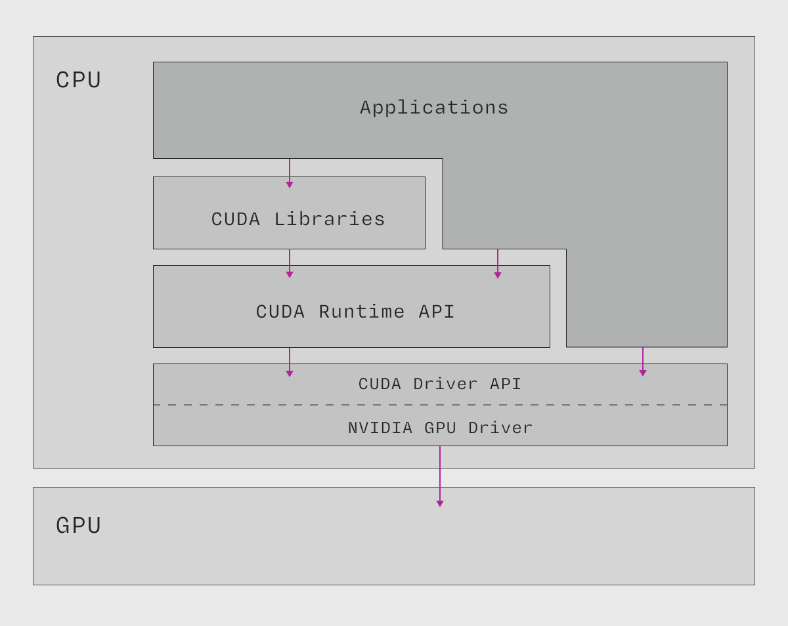
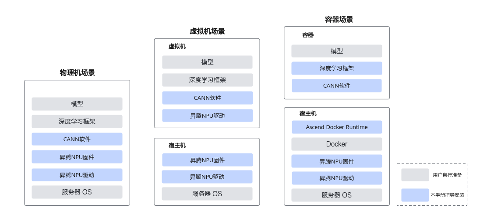
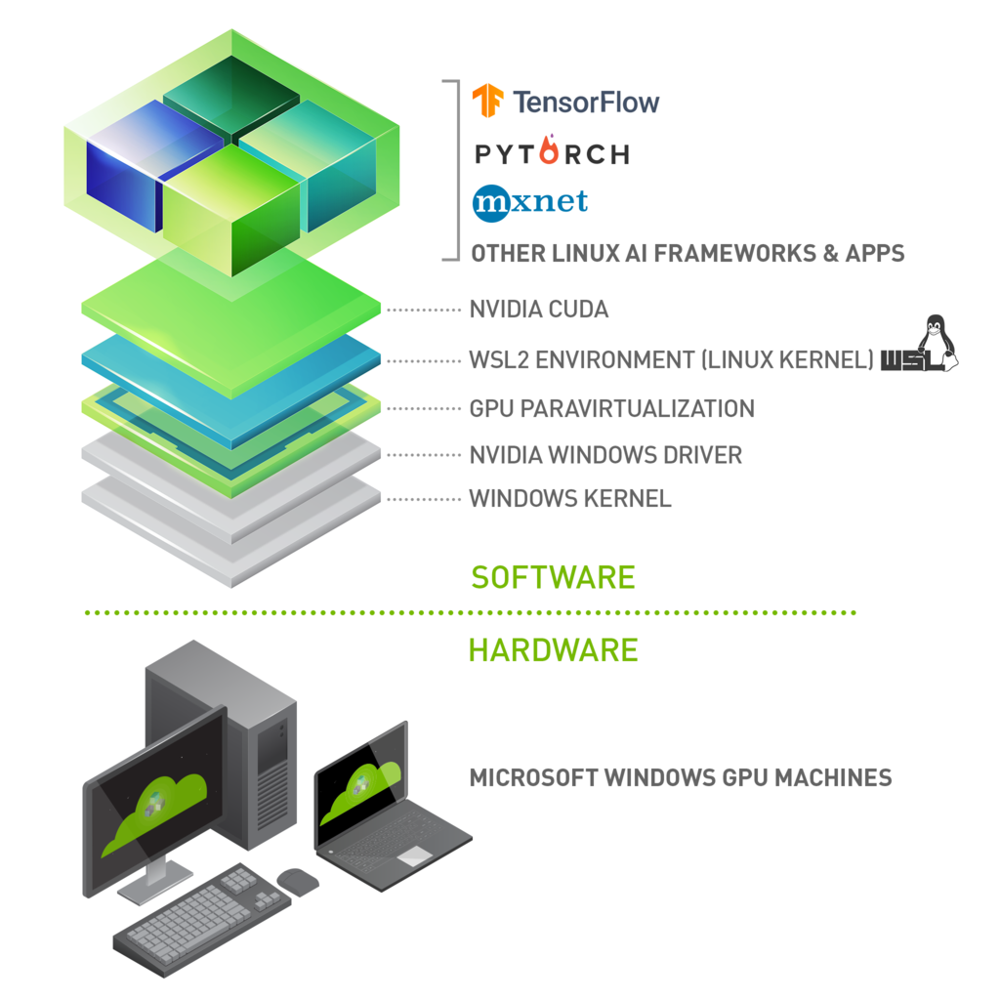

# Reference
- [zh.d2l.ai](https://zh.d2l.ai/)
- [zh-d2l-github](https://github.com/d2l-ai/d2l-zh)
- [transformer快速入门](https://github.com/jsksxs360/How-to-use-Transformers)


# 机器学习的发展历程


# 机器学习的技术框架


## 强化学习


## 语言大模型


## 文生图大模型
以下是目前主流的文生图（Text-to-Image）大模型及其核心区别的详细分析：

---

### **1. Stable Diffusion 系列**
- **开发者**：Stability AI（开源社区）
- **模型架构**：基于扩散模型（Diffusion Model），Latent Diffusion（在潜空间压缩处理，降低计算量）
- **版本特点**：
  - **SD 1.5**：基础版本，模型大小约 4GB，支持 512×512 分辨率，开源免费，社区插件生态丰富。
  - **SDXL 1.0**：参数量 6.6B，分辨率提升至 1024×1024，双模型结构（Base + Refiner），光影和细节更真实。
  - **SD3 (2024)**：最新版本，引入 Transformer 架构，支持多模态提示（文本+图像混合输入），生成逻辑更接近人类思维。
- **优势**：
  - 开源免费，可本地部署，支持高度自定义（LoRA、ControlNet 等插件）。
  - 社区生态强大，兼容多种工具（WebUI、ComfyUI 等）。
- **劣势**：
  - 默认模型对复杂提示理解较弱，需依赖插件优化。
  - SDXL 和 SD3 对硬件要求较高（显存 ≥8GB）。

---

### **2. DALL·E 系列**
- **开发者**：OpenAI
- **模型架构**：基于扩散模型（DALL·E 3 结合 CLIP 改进）
- **版本特点**：
  - **DALL·E 2**：支持 1024×1024 分辨率，生成风格偏写实，但细节精度有限。
  - **DALL·E 3**：深度融合 ChatGPT，支持长文本和复杂语义（如“一只戴着贝雷帽的柯基犬在画布前创作抽象画”），图像与文本对齐度显著提升。
- **优势**：
  - 文本理解能力最强，适合复杂场景生成。
  - 直接集成于 ChatGPT，交互体验流畅。
- **劣势**：
  - 仅通过 API 或 ChatGPT Plus 付费使用，无法本地部署。
  - 生成风格偏保守，艺术化调整空间小。

---

### **3. Midjourney**
- **开发者**：Midjourney Inc.
- **模型架构**：未公开（推测基于扩散模型+自研优化）
- **特点**：
  - 艺术风格化强烈，擅长光影、构图和抽象表达。
  - 提供丰富的风格参数（如 `--v 5`、`--niji` 动漫模式）。
  - 仅通过 Discord 使用，需订阅付费（$10-$120/月）。
- **优势**：
  - 艺术性最强，适合插画、概念设计。
  - 简单提示即可生成高质量图像，新手友好。
- **劣势**：
  - 闭源，无法自定义模型或本地部署。
  - 对精确控制（如人体结构）较弱，需反复调试。

---

### **4. Adobe Firefly**
- **开发者**：Adobe
- **模型架构**：基于扩散模型，训练数据为 Adobe Stock 版权内容。
- **特点**：
  - 生成内容默认商用无版权风险。
  - 与 Photoshop 等工具深度集成，支持“生成填充”等实用功能。
  - 免费使用（需注册 Adobe 账号），部分功能需订阅。
- **优势**：
  - 适合商业设计，安全性高。
  - 与专业设计工具无缝衔接。
- **劣势**：
  - 艺术风格较单一，创意自由度低。

---

### **5. Google Imagen**
- **开发者**：Google DeepMind
- **模型架构**：基于扩散模型+T5-XXL 文本编码器
- **特点**：
  - 文本理解精准，支持生成文本嵌入图像（如带文字的广告牌）。
  - 仅通过 AI Test Kitchen 有限开放，未全面公测。
- **优势**：
  - 多语言支持优秀，逻辑推理能力强。
- **劣势**：
  - 访问门槛高，无法实际应用。

---

### **6. 中国本土模型**
#### **ERNIE-ViLG（百度文心一格）**
- **架构**：扩散模型+知识增强多模态技术
- **特点**：
  - 中文提示词优化，理解成语、古诗词（如“孤舟蓑笠翁”）。
  - 免费使用，生成速度较快。
- **劣势**：
  - 写实风格精度不足，细节易出错。

#### **通义万相（阿里）**
- **架构**：组合式多模态模型（Composer）
- **特点**：
  - 支持“图像+文本”混合输入，可控性高。
  - 专注电商场景（商品图生成）。

---

### **核心区别对比表**
| 模型               | 文本理解 | 生成质量 | 艺术风格 | 可控性 | 开源/商用 | 硬件要求 |
|--------------------|----------|----------|----------|--------|-----------|----------|
| **Stable Diffusion** | 中       | 高（需调参） | 自由     | 极高   | 开源免费  | 中-高    |
| **DALL·E 3**        | 极高     | 极高      | 写实     | 中     | 闭源付费  | 云端     |
| **Midjourney**      | 高       | 极高      | 艺术化   | 低     | 闭源付费  | 云端     |
| **Adobe Firefly**   | 中       | 中        | 保守     | 中     | 闭源免费  | 云端     |
| **ERNIE-ViLG**      | 中（中文优化） | 中    | 混合     | 低     | 闭源免费  | 云端     |

---

### **选型建议**
1. **追求控制与自定义**：选 Stable Diffusion + ControlNet。
2. **商业安全设计**：Adobe Firefly 或通义万相。
3. **艺术创作**：Midjourney 或 SD 社区艺术模型（如 DreamShaper）。
4. **复杂提示词**：DALL·E 3 或 Google Imagen（若开放）。
5. **中文场景**：ERNIE-ViLG 或 通义万相。

---

### **未来趋势**
- **多模态融合**：文本+图像+3D 联合生成（如 OpenAI 的 Sora 已展示视频生成潜力）。
- **开源与闭源竞争**：Stable Diffusion 3 试图在质量上追赶 DALL·E 3，而闭源模型强化安全与易用性。
- **垂直领域优化**：电商、医疗、教育等场景定制化模型将爆发。
### Stable Diffusion

- SD1.5: 
- SDXL: 
- SD3.5: 


## 时序预测
- [Time-Series-Library](https://github.com/thuml/Time-Series-Library)
- [深度学习-时间序列分析工具TSLiB库使用指北](https://blog.csdn.net/LuohenYJ/article/details/141651215)


# 配置
## huggingface
- [huggingface](https://huggingface.co)
- [国内镜像](https://hf-mirror.com)
```bash
# 这是huggingface官方指定的下载上传工具
pip install -U huggingface_hub

# 这句放到zshrc
export HF_ENDPOINT=https://hf-mirror.com
```

## openvino和intel-opencl-icd
- [下载openvino](https://www.intel.cn/content/www/cn/zh/developer/tools/openvino-toolkit/download.html?PACKAGE=OPENVINO_BASE&VERSION=v_2025_0_0&OP_SYSTEM=MACOS&DISTRIBUTION=PIP)
- [intel-opencl-icd](https://github.com/intel/compute-runtime)
The following **OpenCL runtimes** expose your Intel integrated **GPU** as an OpenCL device to applications in your PC:

- [Intel compute runtime](https://github.com/intel/compute-runtime) (aka Neo) is the new open-source OpenCL implementation for Intel GPUs. It supports integrated GPUs from Broadwell and onward.
- [Beignet](https://01.org/beignet) is the old open-source OpenCL implementation for Intel integrated GPUs. It supports integrated GPUs since Ivy Bridge. You should use this if you have an older Intel processor.
- [Intel OpenCL](https://software.intel.com/en-us/articles/legacy-opencl-drivers#latest_linux_driver) was a proprietary alternative to Beignet for older processors since Ivy Bridge. In my experience Beignet is preferable if you have an older processor.

The [Intel OpenCL runtime](https://software.intel.com/en-us/articles/opencl-drivers#cpu-section) exposes your **CPU** as an OpenCL device to applications in your PC.

An **OpenCL ICD loader** is vendor-independent and allows you to select which OpenCL device to use at runtime. There are several available, but I suggest [ocl-icd](https://www.archlinux.org/packages/?name=ocl-icd), since it's open source and typically up-to-date.

For developing your own OpenCL programs you also need the **OpenCL headers**, which you can [download from here](https://github.com/KhronosGroup/OpenCL-Headers) or install from the [Arch repositories](https://www.archlinux.org/packages/?name=opencl-headers).

The so called **SDKs** are simply vendor bundles that generally contain: a) an **OpenCL runtime** to expose the vendor hardware as an OpenCL device; b) an **OpenCL ICD loader**, so that various processors can be exposed as OpenCL devices; c) the **OpenCL headers**; d) code samples on how to best use OpenCL on the vendor hardware; and, e) possibly other vendor related stuff.

Some examples of SDKs include:

- AMD APP SDK (discontinued).
- [Intel® SDK for OpenCL™ Applications](https://software.intel.com/en-us/opencl-sdk).

You don't actually need an SDK to develop OpenCL applications, as long as you have an **OpenCL runtime**, an **OpenCL ICD loader** and the **OpenCL headers**. If developed in C/C++, your applications should include the headers and link against an ICD loader (`libOpenCL.so`).

## cuda和cudnn
CUDA（Compute Unified Device Architecture）是 NVIDIA 的通用 GPU 编程模型和 API 框架。
- **核心功能**: 
    - 提供 C/C++/Fortran 等语言的 GPU 编程接口
    - 管理 GPU 内存、线程调度和硬件加速计算
    - 实现 CPU-GPU 异构计算

cuDNN（CUDA Deep Neural Network Library）：专门为深度神经网络优化的 GPU 加速库。
- **核心功能**：
    - 高效实现卷积、池化、归一化等神经网络层
    - 支持 FP16/FP32 精度自动混合计算
    - 提供 Winograd 等加速算法
- [cudnn-support-matrix](https://docs.nvidia.com/deeplearning/cudnn/frontend/v1.14.0/reference/support-matrix.html#support-matrix)（和cuda、nvidia driver的兼容性）
- [What is the CUDA Software Platform?](https://modal.com/gpu-glossary/host-software/cuda-software-platform)

- [# 显卡，显卡驱动,nvcc, cuda driver,cudatoolkit,cudnn到底是什么？](https://www.cnblogs.com/marsggbo/p/11838823.html)
pytorch 安装cuda版会自带安装cuda&cudnn的动态库，而如果只是使用whisper这种机遇pytorch的，就不用安装，但是如果编译whisper.cppCUDA版这种，就需要安装官方支持。
### 版本
```bash
# 该指令知识查看当前硬件&驱动可以安装的最高cuda版本，并不代表安装了cuda
nvidia-smi

# 该指令一般是安装了官方的cuda组件（即包含了nvcc编译器）之后可以查看
nvcc -V
```

### pytorch cuda&cudnn动态库
- [pytorch官方安装](https://pytorch.org/get-started/locally/)

### nvidia官方cuda工具包
- [cuda-downloads](https://developer.nvidia.com/cuda-downloads)
- [cudnn-archive](https://developer.nvidia.com/rdp/cudnn-archive)
上述链接是官方下载的，cudnn是个压缩包，对应的文件放到cuda的同名的安装目录中即可。
Linux系统不太一样，也是按照官网链接中的指引（ubuntu可以用 `sudo apt install nvidia-cuda-toolkit` 来安装，但是版本太老，会有问题）
```bash
# 以ubuntu24.04为例，一下指令参考上述nvidia官网链接

# 安装cuda-runfile方式
wget https://developer.download.nvidia.com/compute/cuda/12.6.3/local_installers/cuda_12.6.3_560.35.05_linux.run
sudo sh cuda_12.6.3_560.35.05_linux.run

# 安装cudnn-Deb方式
wget https://developer.download.nvidia.com/compute/cudnn/9.8.0/local_installers/cudnn-local-repo-ubuntu2404-9.8.0_1.0-1_amd64.deb
sudo dpkg -i cudnn-local-repo-ubuntu2404-9.8.0_1.0-1_amd64.deb
sudo cp /var/cudnn-local-repo-ubuntu2404-9.8.0/cudnn-*-keyring.gpg /usr/share/keyrings/
sudo apt-get update
sudo apt-get -y install cudnn-cuda-12
```
要强调一下：硬件型号-驱动版本−cuda版本−cudnn版本，是有依次的依赖关系的。哪个低了都要依着低的那个版本要求来。比如同样30系显卡要560驱动就可以安装cuda12.6，但是550驱动就最高安装cuda12.4。

### 无法调用？
pytorch显示没有GPU占用---nvidia-smi和windows10的任务管理器都有统计问题，CUDA是默认不在统计范围。在windows10的任务管理器-性能-GPU中可以把默认的copy换成Cuda就可以看到CUDA是可以被调用的。

### tensorflow和cuda的兼容性
- [tensorflow和cuda的兼容性](https://www.tensorflow.org/install/source#gpu)


# RAG

langchain + llama.cpp 或者简单版 llama_index + ollama

- [langchain](https://docs.langchain.com/oss/python/langchain/overview)
- [llama.cpp](https://github.com/ggml-org/llama.cpp)

## RAG 技术介绍


### **一、技术原理**

**RAG（Retrieval-Augmented Generation）** 把信息检索（Retrieval）和生成式模型（Generation）有机结合：检索模块在生成前从外部知识库取回与查询相关的证据片段，生成模块以这些证据为内核产生回答，从而显著提高答案的正确性、可追溯性和时效性。下面按流水线细化技术细节与实现要点。

#### **1. RAG 的工作流程**

1. **用户输入（Query）**
    
    - 接收自然语言查询，可能包含上下文会话历史、元信息（用户角色、偏好、地域）或结构化字段（时间范围、类别过滤等）。
        
    - 预处理：分词/标准化（Unicode 规范化）、去噪（去除控制字符）、意图识别与槽位解析（如果需要）。
        
    
2. **文档检索（Retrieval）**
    
    - **Embedding（向量化）**：
        
        - 使用双塔（bi-encoder）或单塔编码器把查询与文档切片映射到向量空间。常见 embedding 模型有基于 Transformer 的 sentence-transformers、DPR（Dense Passage Retrieval）家族、或定制的小型 BERT/miniLM。向量维度常见为 384、512、768、1024。
            
        - 文档预处理：把长文档切成若干 chunk（见下文 chunking 策略），对每个 chunk 生成 embedding 并入库。
    
    - **向量数据库（Vector DB / ANN）**：
        
        - 存储与检索 embeddings，常用引擎：FAISS（本地高性能）、Milvus、Qdrant、Weaviate、Pinecone（托管）。
            
        - 索引类型与调参：HNSW（M 与 ef 值）、IVF + PQ（nlist、nprobe、PQ bits）、OPQ、PCA 降维等。
            
        - 相似度度量：余弦（normalized dot）或内积（dot），要与 embedding 模型输出范数匹配。

    - **混合检索（Hybrid）**：
        
        - 关键词 / 稀疏检索（BM25、Lucene）做粗筛，再用 dense embedding 做精排（减少误检并提升召回）。
            
        - 也常把结构化过滤（时间、标签、权限）结合进检索管线，先做布尔/过滤，再检索。
    
3. **检索后处理（Reranking / Filtering）**
    
    - **Cross-encoder reranker**：对 top-N（如 top-100）候选用 cross-encoder（把 query 与 chunk 拼在一起）做精确评分，输出 top-k（如 5–20）用于生成，这能大幅提升精度但增加延迟与计算成本。
        
    - **其他策略**：规则过滤、去重（文本相似度阈值）、质量评分（source trust score）、来源白名单/黑名单。

4. **上下文增强（Augmentation）**
    
    - 将检索到的高相关性片段拼接到 prompt 中；常见做法有直接拼接、摘要后拼接或使用 Fusion-in-Decoder（FiD）式并行编码多个文档再由 decoder 融合。
        
    - 拼接策略要控制上下文长度（see 下文上下文管理），并按重要性排序/加权，必要时在 prompt 中为每个片段标注来源（文档 ID、段落编号、置信度）。
        
    
5. **生成答案（Generation）**
    
    - 基于增强后的 prompt，调用生成模型（decoder-only 或 encoder-decoder）。生成策略包括 greedy、beam、sampling（温度、top-p/top-k）等。
        
    - 为降低“幻觉”，常在 prompt 中明确“严格引用检索内容，否则回答‘未知’”；或用后处理验证生成内容与检索证据的一致性（fact-checking reranker）。
        
    
6. **证据回溯与可解释性**
    
    - 返回答案同时附带证据来源（doc id、片段索引、相似度分数）。
        
    - 提供高亮片段并能跳转到原文，支持审计与合规。

#### **2. 关键技术细节**

- **检索器类型**
    
    - 稀疏检索（Sparse）：BM25、Elasticsearch；优点：对关键字精确，易实现过滤；缺点：语义召回差。
        
    - 稠密检索（Dense）：DPR、sentence-transformers；优点：语义理解好，召回能力高；缺点：需要向量索引，量化/压缩相关工程。
        
    - 混合检索（Hybrid）：结合二者，可提升总体召回/精确比。
    
- **Embedding 模型选择与训练**
    
    - 预训练 off-the-shelf（如 all-mpnet-base-v2）适合通用场景；为垂直域（法律/医学）通常需要微调或用领域化数据做检索模型微调（DPR 训练、使用硬负样本/困难负样本）。
        
    - 训练指标：优化交叉熵召回、Triplet 或 InfoNCE。负采样对性能影响极大（随机负、BM25 负、模型生成负）。
    
- **Index 调参**（常用实践）
    
    - HNSW: M（连接度）常取 16–64；efConstruction（建索引时的精度）常取 200–1000；efSearch（查询时）取 100–400（延迟/精度权衡）。
        
    - IVF + PQ: nlist（簇数）与 nprobe（查询簇数）需要基于数据规模调优；PQ bits 常见 8–16。
        
    - 使用 OPQ/旋转来改善 PQ 近似精度。
        
    - 存储压缩：量化（PQ/OPQ）、二值化、或稀疏化。
    
- **Chunking（文档分块）策略**
    
    - chunk 尺寸：常 200–800 tokens（约 150–600 字），并建议重叠（overlap）20–50% 以保留跨段语义连续性。
        
    - 切分依据：段落、语义边界（文本分割模型）、句子级合并，或基于主题分割（TextTiling）。
        
    - 片段元数据：保留原文位置信息、来源 URL、时间戳、文档质量标签以便后续排序与溯源。
    
- **上下文管理（Context Window）**
    
    - 生成模型上下文窗口有限（例如 8k、32k、128k）。当检索到内容超出窗口时：使用摘要、优先截断（最相关保留）、或者使用多轮检索/流式注入（streaming chunk）。
        
    - FiD 方法把多个文档单独编码再由 decoder 融合，能更好利用多个片段信息但计算开销大。
    
- **生成控制与校准**
    
    - Prompt 设计：明确指令（use retrieved texts strictly）、格式化回答（列出来源）、限制输出范围（avoid speculation）。
        
    - 后处理事实检验：使用另一个模型做抽取式校验或用检索到的事实做验证（consistency check）。
        
    - 温度/采样调整：对事实性场景降低温度、使用 beam／greedy 以减少发散型回答。
        
    - 置信度输出：让模型输出置信分或概率，并结合检索相似度与 reranker 得分做联合置信估计。
    
- **性能与可扩展性**
    
    - 延迟预算：检索（ANN 查询）通常在 5–50ms（内存/SSD/分布式差异大），cross-encoder rerank 与生成为主要耗时项。
        
    - 批量化：对高吞吐场景，batch embedding 与 batch generation 能显著提高吞吐。
        
    - 缓存层：对常见 query 使用结果缓存（检索 + 生成结果）减少重复计算。
        
    - 分布式：索引分片、主从复制以应对大数据集与高 QPS；embedding 服务可水平扩展。
    
- **多阶段/多模型流水线**
    
    - 常见架构：BM25 → dense top-K → cross-encoder rerank → generator（FiD 或 decoder）→ verifier。
        
    - 另有变体：RAG-Sequence 与 RAG-Token（Facebook 原始 dichotomy），FiD（Fusion-in-Decoder）、ReAct（检索+工具调用）、Toolformer 风格把外部工具（计算器、数据库）看作“检索资源”。

### **二、RAG 的优势与挑战**

#### 1. 核心优势

- **准确性与可验证性**：模型输出可与检索到的证据对齐（evidence grounding），便于审核和法律/医学合规。
    
- **知识更新便捷**：更新索引（重新嵌入新增文档或替换 chunk）即可更新系统知识，不必重新训练大型 LLM。
    
- **节省微调成本**：针对大量领域知识，可通过检索而非频繁微调来覆盖新知识。
    
- **跨源整合能力**：能同时检索结构化（数据库）与非结构化（文档、PDF、日志）、多模态（图像 embedding + 文本 embedding）数据源。
    
#### 2. 主要挑战

- **检索召回/精度矛盾**：高召回常伴随大量低质量候选，需有效的 reranker 与过滤策略；低召回会直接导致生成缺乏证据。评估指标包括 Recall@k、MRR、NDCG。
    
- **上下文预算与证据选择**：有限上下文导致需要对检索结果进行压缩与优先级排序，错误的截断会丢失关键事实。
    
- **检索延迟与成本**：cross-encoder rerank 或大型生成模型会显著增加延迟，必须在体验与准确性间权衡（例如通过分层 rerank，仅对 top-N 使用 heavy reranker）。
    
- **知识库实时性与一致性**：对于高频更新场景（财经、新闻），需要高吞吐的重索引/增量索引方案并保障查询一致性。
    
- **多模态检索**：图像、PDF、表格需要专门的 embedding 与解析（例如图像用 CLIP、表格用结构化解析器），并融合多模态相似度。
    
- **安全与隐私**：知识库中可能含敏感数据，检索/生成环节需要访问控制、数据去标识化、加密存储与传输、审计日志。
    
- **“幻觉”与错误引用**：即便基于检索，模型仍可能错误地合并或误解证据，需要事实校验与人机协作流程。
    
- **评估难度**：自动评估生成答案正确性仍是研究难点，常结合人工标注与自动化一致性检验。

### **三、典型应用场景

#### **1. 智能问答系统**

- **企业知识库 Q&A**：将内部文档（Wiki、SOP、邮件、工单）做向量化与权限分层，实现员工能基于私人/部门权限检索并获得带来源的答案。
    
- **医疗咨询**：检索最新指南（WHO、NICE）、病例与药物说明，输出带引用的诊疗建议（但始终配合专业医生把关）。
    
- **法律助手**：检索法规条文与判例并输出引用段落，配合法律从业人员进行法律检索与草稿生成。
    
#### **2. 内容生成与编辑**

- **技术文档自动化**：输入产品规格，检索 API 手册与历史变更日志，输出版本化的用户手册段落并列出参考条目。
    
- **合规审稿**：自动生成合规声明并标注法律条款出处，便于审计。

#### **3. 数据分析与决策支持**

- **财务/投研支持**：检索公司公告、行业报告、历史财报快速生成事件摘要并标注证据区间；关键在于时间窗口过滤与证据时效性评分。
    
- **科研文献综述**：从大规模论文库检索并做主题聚类、时间序列趋势分析，生成可追溯的综述段落。

#### **4. 客户服务与自动化**

- **故障排查助手**：检索设备日志、维修手册与历史案例，输出带步骤的排查流程并列出参考记录。
    
- **客服自动应答**：检索 FAQ 与订单系统，结合实时订单数据返回个性化响应。


## RAG 开发实践

### 一、开源框架

1. **LangChain + Chroma / Milvus / FAISS**
    - LangChain 是在开源社区非常常用的 LLM 应用框架。
    - 用它搭配向量数据库（Chroma、Milvus、Weaviate、FAISS 等）构建知识检索 + 上下文拼接逻辑。
    - 有不少博客教 “本地知识库 + LangChain + 模型” 的做法。

2. **Casibase**
    - 一个开源的 AI 知识库 / RAG 平台，有 UI、权限、用户管理等功能，支持 Llama / HuggingFace 等后端。

3. **AnythingLLM**
    - 一个“一体化”的本地 ChatGPT + 模型 + 向量检索应用，支持本地部署和 RAG 场景。

4. **Khoj**
    - 在 Hacker News 有人提到，Khoj 可以让你“与文档聊天”，做本地 RAG。

5. **Reor**
    - 一个开源的 AI 个人知识管理应用，可以运行本地模型 + 知识库。

6. **部分社区项目 /代码库**
    - “LLM-Powered Knowledge Base (GitHub 项目)” 等。
    - 有些项目把文档抽 chunk、做向量索引、再调用本地模型整合为对话系统（见一些 blog, “本地 RAG 文档知识库”）

#### 模型选择方向

- **LLaMA 3 / LLaMA 系列**：Meta 最近开源的 LLaMA3 在社区里是热门选择，可用于量化 + RAG。
- **Falcon 系列**：性能/效率比在某些基准里表现不错。
- **Mixtral / Mistral /其他新模型**：社区里不断有新模型出现，可能在推理效率 +能力上有优势。
- **短期优化模型**：比如为速度特别设计的小模型或蒸馏模型（有 trade-off）。
  
在社区对比里，无一个模型在所有维度都压倒其它模型，但 LLaMA 系列因为社区支持和量化工具成熟度比较高，是比较稳妥的选择。

#### 量化 / 加速方向

- **AWQ / GPTQ / QLoRA / LoRA + 混合量化**：这些都是社区常用的量化 + 微调 / 适配技术。
- **GANQ**：这是最近的非均匀量化方案，对 GPU 有适配优化，据说在 4090 上有不错加速效果。
- **LMDeploy**：支持 4-bit weight-only 量化的 CUDA kernel，实现比 FP16 更快的推理速度。
- **ScaleLLM**：专门针对有限显存场景设计的推理库，有在 4090 上的优化。

### 二、架构优化

- **向量索引 + 检索**：把你的知识文档切块（chunk），做 embedding 存进向量数据库，查询时检索 top-k 块加到 prompt 上下文里给模型。
    
- **上下文拼接 + 截断策略**：如何把检索到的内容拼进 prompt 而不超出模型上下文窗口也要有策略（比如滑窗、优先级排序、摘要等）。
    
- **异步 / 缓存 /重用策略**：检索结果和 embeddings 要缓存以减低重复计算。
    
- **动态更新**：当知识库更新时，还要支持更新 embedding、重构索引等。
    
- **安全 / access 权限控制**：如果有多个用户或敏感文档，可能要做访问控制。
    
- **UI / 接口 /模型接入层**：用户前端（聊天界面）、后端服务（模型 + 检索），建议用如 Casibase 这样的完整平台或自己构建接口层。
    
- **MCP / Model Context Protocol**：这是最近一个模型-应用层的协议标准（由 Anthropic 提出），可以让模型与外部工具 /文档 /函数调用接口更标准化。

#### 示例流程

1. 收集你的文档 / 知识内容 → 切 chunk → 计算 embedding → 存入向量数据库
    
2. 用户问问题 → 首先用检索器（向量相似度 + 可能的关键词过滤）找出 top-k 相关块
    
3. 把这些块做一定的拼接 / 摘要处理 → 加入 prompt 上下文
    
4. 调用本地模型生成答案
    
5. （可选）可以把模型回答 + 检索块一起作为新知识回写、评价、优化


## RAG 内存占用

Gemma3:27b其他大模型在 4090 上显存从 19GB 涨到 31GB**，而你只问了一个小问题——是许多用户在使用 Ollama / llama.cpp / vLLM 时都会遇到的典型“显存膨胀”问题。


- Ollama 官网显示 gemma3:27b 模型“理论显存需求”为 19GB；
    
- 实际运行中，显存占用飙升到 31GB；
    
- 你只做了一个简单 RAG 问答（甚至没索引很多数据）；
    
- GPU 使用率 77%，CPU 23%，显存被“吃满”；
    
- 推理速度变慢，但没明显计算负载。

这个现象本质上是**推理时动态显存分配 + KV Cache + embedding/索引缓存 + Ollama 多进程模型封装**共同作用的结果。


###  1 模型本体加载（Static Model Weights）

- “19GB” 只是模型**权重文件加载后的理论占用**。
    
- Ollama / llama.cpp 通常使用 **4-bit 或 8-bit 量化权重**；
    
- 例如 gemma3:27b 的 GGUF 文件（量化） ≈ 19GB；
    
- 但加载后会进行解码、转储到 GPU TensorCore-friendly 格式；
    
- 实际需要额外的 buffer、参数对齐等；
    
- 所以实际 GPU 内存占用通常是 **文件大小 × 1.2 ~ 1.6 倍**。

> 这一步就可能从 19GB → 23~25GB。

---

###  2 KV Cache（推理缓存）

- 每次你向大模型提问时，模型会保存上下文（key-value 缓存）；
    
- 这是为了“流式生成”时不重复计算；
    
- KV Cache 是 per-token × per-layer 的矩阵；
    
- 对于 27B 模型，这个缓存非常大，尤其当：
    
    - prompt 较长（> 2k tokens）；
        
    - 或生成输出较多（> 512 tokens）；
        
    - 或 context_length 设置较大（例如 8k、16k）。

计算近似公式：
```
显存占用 ≈ 模型参数 + (层数 × 隐层维度 × 2 × token数 × 精度)
```

> 举例：

- > gemma3:27b：32 层 × 4096 hidden × 2（KV）× 2048 tokens × 2B ≈ 6~8GB
    
- > 所以显存直接飙升到 **25GB + 8GB ≈ 33GB**
---

### 3 Embedding + RAG 组件占用

如果你在做 RAG（即使只是简单问答）：

- llama-index 会加载 **embedding 模型**（通常 300MB~1GB）；
    
- 启动时会分配 GPU buffer；
    
- 向量数据库（如 Chroma/Faiss）也可能分配 GPU 空间（尤其使用 faiss-gpu）。

这些加起来又是 **1~2GB**。

---
### 4 Ollama 的多层封装与 GPU 复制

Ollama 的架构是：

> API Server → Model Runtime → llama.cpp backend → Metal/CUDA 调度器


在 CUDA 环境下，它会：

- 启动一个主 GPU buffer；
    
- 启动一个 CPU fallback buffer；
    
- 在多请求或流式请求时会**复制上下文到新 buffer**；
    
- 从而导致额外的 **~3GB 显存 buffer 临时开销**。

|**占用来源**|**说明**|**估算显存**|
|---|---|---|
|模型权重|量化后加载入 GPU tensor 格式|19–23 GB|
|KV Cache|历史上下文 + 输出缓存|6–8 GB|
|Embedding 模型|向量索引/检索时驻留|1–2 GB|
|Ollama Buffer|CUDA 临时缓冲|2–3 GB|
|**总计**||**≈30–32 GB** ✅|

---

### 5 优化与控制策略


> 不要显存溢出到内存，否则速度断崖式下降。

  llama.cpp / Ollama / vLLM 一旦显存不足，就会将部分 KV cache / Tensor 迁移到主机内存（PCIe传输瓶颈约为 12GB/s，相比GPU的800GB/s带宽慢了70倍）。
  
####  5.1 控制上下文长度


在 RAG 场景中：

- 设置合理的 context_window；
    
- 通常 2k ~ 4k 足够；
    
- llama.cpp 参数 --ctx-size 4096；
    
- 或 Ollama prompt 限制长度。

> 显存随上下文线性增长，4k token 比 8k 节省一半显存。

#### 5.2 降低 KV Cache 精度

在 llama.cpp 中使用：
```
--kv-type f16
```

或在 Ollama 模型构建时开启 KV quantization（自动识别支持）。

#### 5.3 启动时锁定显存上限

Ollama 不支持直接设上限，但 llama.cpp 支持：
```
--gpu-layers 80
```

（只让前 80 层在 GPU，其余在 CPU）。

#### 5.4 Embedding 独立到 CPU

RAG 场景中，embedding 计算不必占用 GPU：
```
from llama_index.embeddings.huggingface import HuggingFaceEmbedding
embed_model = HuggingFaceEmbedding(model_name="sentence-transformers/all-MiniLM-L6-v2", device="cpu")
```

#### 5.5 避免多线程或多会话共享 GPU 模型

Ollama 默认支持多会话复用；

如果同时多个请求上下文 buffer 叠加，显存翻倍。

---

### 6 总结

|**方面**|**说明**|**建议**|
|---|---|---|
|现象|gemma3:27b 19GB → 31GB|正常现象|
|主因|KV cache、embedding、buffer|可控|
|风险|显存溢出到 CPU 降速70倍|必须避免|
|解决|控 ctx_len、CPU embedding、KV半精度|✅|
|RAG推荐|如果经常有长上下文，建议换 Qwen2 14B / Yi 1.5 9B|更平衡|

---


## function call & [MCP](https://modelcontextprotocol.io/introduction)

MCP其实就是各家function call函数的统一接口标准，但截至25年还没兴起，最终也可能会兴起新的标准，但标准肯定是趋势，技术细节还是先从function call学起。


[MCP-pythonSDK](https://github.com/modelcontextprotocol/python-sdk)


# MCP

- [MCP-doc](https://modelcontextprotocol.io/docs/getting-started/intro)

## 一、MCP核心概念


**概念性说明**

Model Context Protocol（简称 MCP）是一个开源、跨厂商的协议规范，目标是把“外部数据源 / 工具”以标准化、可发现、可授权的方式暴露给大语言模型（LLM）或 LLM 驱动的应用。把它想象成“AI 的 USB-C”：应用（或模型）通过统一的客户端接口发现并调用外部能力（文件系统、数据库、向量检索、执行器、第三方 API 等），而不需要为每一种后端写一套专用集成。


**核心构件（术语）**

- **MCP Server（Context Provider）**：把某类数据或能力封装为“资源”（resource/tool），并暴露给 MCP 客户端。一个 server 可能封装文件系统、向量数据库、SQL 库、搜索引擎、或自定义工具。
    
- **MCP Client（Context Consumer）**：模型端或应用端的组件，按协议发现可用资源、提出请求并接收结构化响应（包括内容、元数据、证据定位等）。例如桌面版的 Claude 或支持 MCP 的代理框架。
    
- **Resources / Tools / Actions**：MCP 中对外描述的条目——每个 resource 有元数据（名称、描述、权限要求、输入/输出 schema、capabilities），client 可以调用其 action（检索、run、query、stream）。规范用 TypeScript/JSON-schema 描述这些接口。
    
- **Discovery / Registry**：客户端如何找到可用 MCP servers（本地、局域网或远端注册表），以及可选的权限/注册流程（类似插件市场或本地允许对话）。
    

**设计哲学要点**

- **可发现性**：任何支持 MCP 的应用只需按协议查询即可列出可用工具/数据源，而无需硬编码。
    
- **最小权限与可授权**：资源暴露时声明所需权限（读/写/execute），并通过用户交互或 OAuth 等方式授予。
    
- **结构化上下文**：MCP 返回的不只是无结构文本，而是结构化的 context（片段、来源 id、相似度 / 可信分），更利于模型融合与逐项引用。
    

---

## 二、MCP开源资源

  
**官方/社区资源**

- **Model Context Protocol — 官方 repo / 规范**：协议规范、schema、参考实现与示例（TypeScript/JSON schema）。是实现兼容性的权威来源。
    
- **Anthropic / Claude MCP 文档**：Anthropic 在产品（Claude、Claude Desktop）中率先集成 MCP，有具体的行为约定与安全建议。若要与 Claude 系列交互，这些文档是首选。
    
- **LangChain MCP 适配器**：LangChain 提供 langchain-mcp-adapters，可以把 MCP tools 作为 LangChain 的工具（tools）接入 agent，便于在现有工作流中使用 MCP。
    

**向量数据库 / RAG 相关集成**

- **Milvus / Qdrant / FAISS 等**：这些向量 DB 可以通过一个 MCP Server 封装（把 search/insert/delete 等 API 以 MCP resource 暴露），从而让支持 MCP 的客户端直接进行相似检索。文章/指南已有示例说明如何在 RAG 流程中利用 MCP 封装检索能力。
    

**社区文章与教程**

- 多家媒体/博客提供“用 MCP 改造 RAG” 的实践教程（TheNewStack、Medium 等），包含示例代码及架构建议。
    

---

## 三、MCP 扩展 RAG


  传统 RAG 流程是：应用负责检索（向量 DB、BM25），把 top-k 文本拼接成 prompt 再送模型。MCP 不是要取代 RAG，而是把“检索 + 工具”变成模型可以**直接发现并调用**的、结构化的外部能力。这带来两类关键改进：

1. **工具化检索**：把向量 DB、cross-encoder reranker、文档摘要器都当成 MCP resource。模型（或上层 agent）可以以统一接口请求 search(query, top_k, filters) 并获得带元数据的结果，减少应用端的 glue 代码。
    
2. **双向交互**：MCP 支持更复杂的交互（streaming、操作型 action、带权限的写操作），例如模型可以“检索→判定→触发写入”（如生成 PR、更新知识片段），实现闭环自动化。
    

**具体新能力（举例）**

- **动态工具发现**：当新数据源接入（例如新版本的文档库），MCP server 自动声明能力，模型端立即可用。
    
- **渐进检索与交互式 RAG**：模型可发起“先检索，再用 cross-encoder 重新排序，然后要求 server 做片段摘要”，server 内部可并行/序列化这些步骤并返回最终 evidence bundle。
    
- **安全的写回与行动**：在授权下模型可调用 server 的“写”或“action”，例如把高置信回答写回知识库或创建 ticket（需最小权限与审计）。
    

如果你想在本地把 RAG 升级为“更像平台”的系统，MCP 能带来这些现实功能提升：

1. **统一的检索接口**：把本地向量库（如 FAISS/Chroma/Milvus）包装为 MCP Server，提供 search(query, filters, top_k)，模型能直接调用并得到结构化片段（包括 doc_id、start/end、source_url、score）。
    
    - 结果利于模型直接引用并输出来源，减少应用端拼接错误。
        
    
2. **将摘要器 / chunker 也作为服务**：把长文分块、摘要、去噪的逻辑封装为 MCP actions（例如 summarize(doc_chunk)），模型可按需请求摘要而不是一次性拉回全文，节省上下文窗口。
    
3. **自动化写回与知识管理**：在用户允许下，模型可以调用 MCP action 把模型生成的“校对后条目”写回知识库（create/update），并通过审计日志留痕。要实现此功能须强制用户授权与操作审批流程。
    
4. **多模态 / 外部工具集成**：把 OCR（从 PDF）、表格解析器、图片 embedding（CLIP）等封装为 MCP resource，使模型在检索时能混合多模态证据。
    
5. **交互式 agent 流程**：例如“用户问 → 模型用检索查证 → 若证据不足，调用 web 搜索或内部 ticket 系统 → 汇总并生成答复”。MCP 把这些步骤中的每个后端动作都标准化为 resource/action。
    

---

## 四、部署流程

  

下面给出一个工程化、可复用的部署流水线（本地 / 私有云均适用）：


### **1）方案与界定（准备阶段）**

- 梳理你希望模型能访问的资源种类（本地文档、向量 DB、SQL、外部 API、执行器）。
    
- 定义权限模型：哪些资源允许读？写？是否需要按用户/组细粒度授权？（合规/审计点）。
    

  

### **2）选择 MCP Server 实现**

- **参考实现**：从官方/社区 repo 获取参考 server（TypeScript / Node）或已有第三方实现。快速路径：使用官方参考 server 或 Milvus/Chroma 的现成适配示例。
    

  

### **3）把本地 RAG 组件包装为 MCP resources**

- **向量检索 resource**：实现 search(query, top_k, filters)；返回带元数据的 evidence 数组（text, doc_id, score, start, end）。
    
- **embeddings provider**（可选）：如果想让客户端请求 embedding，你可以暴露 embed(text[])。
    
- **summarizer / chunker**：实现 summarize(id_or_text, params)、chunk(doc)。
    

  

### **4）实现授权与用户同意流程**

- 支持 OAuth / token / local consent flow；在桌面或 Web UI 上弹窗让用户授权某个 MCP server 访问特定资源（最小权限）。参考 Anthropic 与 Microsoft 在 UI 上的做法。
    

  

### **5）运行与联网方式**

- **本地单机**：server 仅监听 loopback 或局域网内地址，客户端配置本地 discovery。
    
- **局域网/企业网**：在内网部署 registry 或用 mDNS/Consul 发现服务。
    
- **云端/混合**：把 server 放在私有 VPC，做 TLS；对于敏感数据，优先使用本地 server 并提供 proxy。
    

  

### **6）接入模型 / 客户端**

- 若使用 Claude / 支持 MCP 的桌面客户端：在客户端界面添加 server 地址并授权后即可使用。
    
- 若使用 LangChain：用 langchain-mcp-adapters 把 MCP resource 封装为 LangChain tool/agent（可把 MCP tool 作为 retriever 或 tool 调用）。
    

  

### **7）测试、监控与回滚**

- 验证典型请求：检索延迟、top-k 召回、rerank 一致性、写入权限审计。
    
- 监控：请求日志、失败率、异常行为检测（如过量数据泄露）。
    
- 预置回滚策略：在发现恶意 server 或第三方组件异常时，能快速禁用该 MCP server。
    

---

## 五、实践示例


下面是一个极简化的结构化返回示例（伪 JSON，展示 concept）——实际字段以官方 schema 为准：

```
{
  "resource": "local_faiss_search",
  "action": "search",
  "request": {"query": "如何处理设备过热", "top_k": 3},
  "response": {
    "results": [
      {
        "text": "第3段：设备过热通常由风扇失效或散热器灰尘堵塞引起...",
        "doc_id": "manual_v2.pdf",
        "start_token": 320,
        "end_token": 410,
        "score": 0.93
      },
      ...
    ],
    "metadata": {"index_version": "2025-10-10", "retrieval_time_ms": 12}
  }
}
```

模型接到这个 response 后，可以基于 results 直接引用并在生成时附上 doc_id 与 score 做可追溯输出。

  

（实际接口与字段以官方 spec / server 返回为准，见 spec repo）。

---

## 六、工程规划与注意


1. **短期实验（1–2 周）**
    
    - 用已有向量 DB（FAISS/Chroma/Milvus）做一个“小型 MCP server”包装 search 与 embed 接口（官方 repo 有示例）。把 LangChain + langchain-mcp-adapters 当作客户端做快速验证。
        
    
2. **中期部署（1–2 个月）**
    
    - 完善授权流程（local consent UI / token），把 summarizer、chunker、写回接口做成独立 actions。加上审计日志与速率限制。
        
    
3. **长期注意事项**
    
    - 建立依赖审计与供货链检验流程；对引入的第三方 MCP server 包做严格版本控制与签名校验（已发生过恶意包事件，需要高度警惕）。
        
    
---

### MCP的安全风险

  
**权限滥用与供应链风险**

MCP 的强大之处在于能把资源暴露给任意支持 MCP 的客户端，但这也带来被滥用的风险：恶意或被劫持的 MCP server/组件可能在用户不察觉的情况下读取/外发敏感内容（现实中已有报告指出某些 MCP 服务器被滥用、向外泄数据的事件）。因此必须：强制最小权限、代码审计、依赖完整性校验与供应链监控。


**prompt injection 与授信问题**

当模型能够“写回”或执行外部 action 时，需要人机交互的批准流程（例如二次确认、审计条目、限制敏感 action）。此外对来自资源的文本要做清洗与输入验证以防 prompt injection。


**网络与托管策略**

对于企业或个人本地部署，优先选择“本地 MCP server + 本地 clients”模式，尽量不把敏感数据暴露给第三方托管服务。若使用云端 registry 或跨域访问，需要严格的 TLS、mTLS、以及细粒度的 IAM。


# 部署(推理)


##  部署框架
| 框架/平台            | 核心优势                                | 跨平台支持 (CPU/GPU)        | 部署灵活性 & 异构兼容性      | 代表性应用场景                        |
| ---------------- | ----------------------------------- | ---------------------- | ------------------ | ------------------------------ |
| **ONNX Runtime** | 推理优化、**标准模型格式支持**、硬件后端抽象            | **广泛** (x86, ARM, GPU) | **高** (EP机制灵活切换后端) | 边缘设备、云原生推理、多硬件环境统一部署           |
| **Triton**       | **高性能推理**、多框架支持、**动态批处理**           | **广泛** (x86, ARM, GPU) | **高** (支持多种硬件和平台)  | 高并发云服务、复杂模型管道、混合负载 (CPU/GPU协同) |
| **LMDeploy**     | **大模型（LLM）专用**、**推理性能优化**、量化        | 支持 (GPU为主)             | 中 (专注LLM高效推理)      | 大语言模型低延迟推理、消费级GPU部署、降低显存消耗79   |
| **FastDeploy**   | **端到端部署**、**多硬件适配** (国产芯片)、工具链完整    | **广泛** (x86, ARM, GPU) | **高** (国产芯片深度适配)   | 国产化环境、全场景（云边端）部署、快速原型验证        |
| **OpenVINO**     | **Intel硬件深度优化** (CPU, iGPU)、计算机视觉优势 | x86, Intel GPU         | 中 (Intel生态最佳)      | Intel平台高性能推理、边缘AI、计算机视觉应用      |

## onnxruntime
- [microsoft-onnxruntime](https://github.com/microsoft/onnxruntime)
- [onnxruntime-doc](https://onnxruntime.ai/docs/)

### onnxruntime-gpu和cuda的版本关系
- [onnx-CUDA-ExecutionProvider](https://onnxruntime.ai/docs/execution-providers/CUDA-ExecutionProvider.html)
#### CUDA 12.x 

|ONNX Runtime|CUDA|cuDNN|Notes|
|---|---|---|---|
|1.20.x|12.x|9.x|Avaiable in PyPI. Compatible with PyTorch >= 2.4.0 for CUDA 12.x.|
|1.19.x|12.x|9.x|Avaiable in PyPI. Compatible with PyTorch >= 2.4.0 for CUDA 12.x.|
|1.18.1|12.x|9.x|cuDNN 9 is required. No Java package.|
|1.18.0|12.x|8.x|Java package is added.|
|1.17.x|12.x|8.x|Only C++/C# Nuget and Python packages are released. No Java package.|

#### CUDA 11.x 

|ONNX Runtime|CUDA|cuDNN|Notes|
|---|---|---|---|
|1.20.x|11.8|8.x|Not available in PyPI. See [Install ORT](https://onnxruntime.ai/docs/install) for details. Compatible with PyTorch <= 2.3.1 for CUDA 11.8.|
|1.19.x|11.8|8.x|Not available in PyPI. See [Install ORT](https://onnxruntime.ai/docs/install) for details. Compatible with PyTorch <= 2.3.1 for CUDA 11.8.|
|1.18.x|11.8|8.x|Available in PyPI.|
|1.17  <br>1.16  <br>1.15|11.8|8.2.4 (Linux)  <br>8.5.0.96 (Windows)|Tested with CUDA versions from 11.6 up to 11.8, and cuDNN from 8.2 up to 8.9|
|1.14  <br>1.13|11.6|8.2.4 (Linux)  <br>8.5.0.96 (Windows)|libcudart 11.4.43  <br>libcufft 10.5.2.100  <br>libcurand 10.2.5.120  <br>libcublasLt 11.6.5.2  <br>libcublas 11.6.5.2  <br>libcudnn 8.2.4|
|1.12  <br>1.11|11.4|8.2.4 (Linux)  <br>8.2.2.26 (Windows)|libcudart 11.4.43  <br>libcufft 10.5.2.100  <br>libcurand 10.2.5.120  <br>libcublasLt 11.6.5.2  <br>libcublas 11.6.5.2  <br>libcudnn 8.2.4|
|1.10|11.4|8.2.4 (Linux)  <br>8.2.2.26 (Windows)|libcudart 11.4.43  <br>libcufft 10.5.2.100  <br>libcurand 10.2.5.120  <br>libcublasLt 11.6.1.51  <br>libcublas 11.6.1.51  <br>libcudnn 8.2.4|
|1.9|11.4|8.2.4 (Linux)  <br>8.2.2.26 (Windows)|libcudart 11.4.43  <br>libcufft 10.5.2.100  <br>libcurand 10.2.5.120  <br>libcublasLt 11.6.1.51  <br>libcublas 11.6.1.51  <br>libcudnn 8.2.4|
|1.8|11.0.3|8.0.4 (Linux)  <br>8.0.2.39 (Windows)|libcudart 11.0.221  <br>libcufft 10.2.1.245  <br>libcurand 10.2.1.245  <br>libcublasLt 11.2.0.252  <br>libcublas 11.2.0.252  <br>libcudnn 8.0.4|
|1.7|11.0.3|8.0.4 (Linux)  <br>8.0.2.39 (Windows)|libcudart 11.0.221  <br>libcufft 10.2.1.245  <br>libcurand 10.2.1.245  <br>libcublasLt 11.2.0.252  <br>libcublas 11.2.0.252  <br>libcudnn 8.0.4|


## 国产GPU

### 华为NPU-CANN框架
- [CANN](https://www.hiascend.com/document/detail/zh/CANNCommunityEdition/82RC1/index/index.html)
- [Atlas 推理卡 NPU驱动和固件安装指南](https://support.huawei.com/enterprise/zh/doc/EDOC1100493509/426cffd9)
- [华为软件包](https://support.huawei.com/enterprise/zh/ascend-computing/cann-pid-251168373/software/258923273?idAbsPath=fixnode01|23710424|251366513|22892968|251168373)
- [ascend gitee 仓库](https://gitee.com/ascend)
	- [torch-npu](https://gitee.com/ascend/pytorch)



CANN（Compute Architecture for Neural Networks）是华为为昇腾（Ascend）AI处理器打造的**全栈软件平台和异构计算架构**。它的核心使命是充分发挥昇腾AI处理器的强大算力，简化AI应用开发与部署，并充当上层深度学习框架（如TensorFlow, PyTorch, MindSpore）与底层昇腾硬件之间的“桥梁”。

官方文档详细介绍Host和Device的概念以及标准/开放形态，是因为这直接关系到开发者**如何利用CANN进行应用开发、资源调配和性能优化**，是实现其“连接AI框架与硬件的关键角色”这一目标的基础。

CANN官方文档介绍Host（主机）和Device（设备）的概念，以及标准形态（EP模式）与开放形态的区别，主要是因为这关系到**开发模式、资源利用和性能优化**：

*   **Host（主机）**：通常指与昇腾AI处理器相连的**X86或ARM服务器**。它负责整体的控制流、业务逻辑，以及不适合在AI处理器上运行的计算（如某些自定义预处理或后处理）。
*   **Device（设备）**：指安装了**昇腾AI处理器的硬件板卡**（如Atlas 300I推理卡），通过PCIe接口与Host服务器连接。它专注于提供强大的神经网络（NN）计算能力。

这种划分源于异构计算的常见模式，即**专用协处理器（Device）与通用主机（Host）协同工作**。

CANN支持两种主要的Device工作形态，以适应不同的场景需求：

1.  **标准形态（EP模式）**：
    *   􀋾 **Device作为被动协处理器**：在此形态下，昇腾AI处理器工作于**EP（Endpoint）模式**。它作为PCIe总线上的一个从设备，**其上的CPU资源通常仅能通过Host调用**。
    *   􀋾 **常见开发流程**：AI应用程序（如模型推理的所有步骤）主要**运行在Host侧**。Host通过CANN提供的接口（如AscendCL）调用Device的算力。
    *   􀋾 **适用场景**：**大多数推理场景**，开发相对简单，资源管理集中于Host。

2.  **开放形态**：
    *   􀋾 **释放Device侧CPU算力**：此形态下，开发者可以**利用Device板载的Control CPU的通用计算能力**。
    *   􀋾 **开发流程变化**：需要为Device侧的CPU**编译专用的应用程序**（通常使用华为的HCC编译器），并将其放入Device的文件系统镜像中。
    *   􀋾 **主要优势**：
        *   **降低Host负载**：将一些计算任务（如图像/视频预处理）卸载到Device端执行。
        *   **减少数据传输**：数据在Device内部处理，避免了在Host和Device之间的大量数据传输，从而**降低延迟、提升整体效率**。
    *   􀋾 **适用场景**：对**延迟敏感**或希望**最大化利用Device资源**的应用。


官方文档详细介绍Host、Device及两种形态，主要是因为：

*   **明确开发环境配置**：让开发者清楚知道**代码的不同部分将在何处运行**（Host的X86/ARM CPU 还是 Device的NPU或Control CPU），从而正确设置编译环境、链接库和部署路径。
*   **理解性能瓶颈与优化方向**：数据传输 between Host and Device 往往是性能瓶颈之一。了解开放形态的存在，就知道可以通过**将更多计算任务卸载到Device端**来减少数据交换，从而提升性能。
*   **实现资源高效利用**：引导开发者根据实际需求选择合适的形态，避免Device侧CPU资源的闲置，实现**异构计算资源的精细化利用和效率最大化**。
*   **避免概念混淆**：清晰区分Host和Device，有助于理解CANN的工具链（如哪些工具用在Host上分析Device状态）。

CANN 是华为昇腾AI生态的软件核心，它通过一系列工具和接口，让开发者能高效利用昇腾芯片的强大算力。

理解**Host（控制与通用计算）、Device（专用AI计算）** 的概念及**标准（集中控制）、开放（分布式利用）** 两种形态，对于在昇腾平台上进行**高效的应用开发、性能优化和资源管理至关重要**。这直接反映了CANN的设计哲学：**充分发挥异构计算优势，提供灵活且高性能的AI计算解决方案**。#### CANN安装

```bash
# conda 在线自动安装 CANN
conda config --add channels https://repo.huaweicloud.com/ascend/repos/conda/
conda install ascend::cann-toolkit
```

#### CANN组件

| CANN组件/功能类别   | 关键组成部分/技术举例                                 | 主要功能简介                                       |
| :------------ | :------------------------------------------ | :------------------------------------------- |
| **统一编程接口**    | AscendCL (Ascend Computing Language)        | 提供设备管理、内存管理、任务调度等API，是开发者直接调用的主要接口。          |
| **基础计算库与算子**  | ACL (Ascend Computing Library), AOL算子库      | 提供高效的基础数学运算（如BLAS）和深度优化过的AI算子（如卷积、矩阵运算）。     |
| **深度学习框架支持**  | torch_npu (PyTorch适配), MindSpore            | 实现与主流深度学习框架的无缝集成，允许框架调用昇腾硬件。                 |
| **模型转换与部署工具** | ATC (Ascend Tool Chain)                     | 将其他框架（如ONNX, Caffe）训练的模型转换为昇腾处理器可执行的格式（.om）。 |
| **编译与执行引擎**   | 图编译器, Runtime运行时                            | 将计算图转为硬件可执行指令，并进行深度优化（如算子融合、内存优化）。           |
| **性能调优工具**    | AOE (Ascend Optimization Engine), Profiling | 自动或辅助进行性能调优，例如优化算子调度策略。                      |
| **高级开发与调试支持** | Ascend C语言, msdebug调试工具                     | 支持开发者进行底层算子开发和调试。                            |
| **异构计算管理**    | 调度不同计算单元（NPU, CPU等）                         | 智能分配任务到合适的计算单元，以实现最佳计算性能。                    |
#### CANN依赖

| 类别                                                                                                          | 名称                  | 版本要求                                                                                                                                                                                                                                                                                                                                                                                                                                                                                     |
| :---------------------------------------------------------------------------------------------------------- | :------------------ | :--------------------------------------------------------------------------------------------------------------------------------------------------------------------------------------------------------------------------------------------------------------------------------------------------------------------------------------------------------------------------------------------------------------------------------------------------------------------------------------- |
| 安装时所需工具                                                                                                     | Python              | Python3.7._x_至3.11.4版本。<br><br>如果需安装NNAL软件包的Python库，请安装Python3.10._x_或3.11._x_版本。<br><br>如果需安装TensorFlow，请安装要求的Python版本：<br><br>- TensorFlow1.15配套的Python版本是：Python3.7._x_（3.7.5~3.7.11）。<br>- TensorFlow2.6.5配套的Python版本是：Python3.7._x_（3.7.5~3.7.11）、Python3.8._x_、Python3.9._x_。<br><br>安装失败、版本不满足或者未包含动态库libpython3._x_.so请参考[编译安装Python](https://www.hiascend.com/document/detail/zh/CANNCommunityEdition/82RC1/softwareinst/instg/instg_0061.html#ZH-CN_TOPIC_0000002366267590)操作。 |
| python3-pip                                                                                                 | 与已安装的Python版本配套使用。  |                                                                                                                                                                                                                                                                                                                                                                                                                                                                                          |
| 运行时所需工具                                                                                                     | gcc                 | >=7.3.0，以系统源提供的版本为准。                                                                                                                                                                                                                                                                                                                                                                                                                                                                     |
| g++                                                                                                         | 与已安装gcc版本配套使用。      |                                                                                                                                                                                                                                                                                                                                                                                                                                                                                          |
| 运行时所需Python第三方库                                                                                             | numpy               | 大于等于1.19.2，小于等于1.24。<br><br>Python3.7.x时推荐安装numpy 1.21.6版本。                                                                                                                                                                                                                                                                                                                                                                                                                              |
| decorator                                                                                                   | >=4.4.0             |                                                                                                                                                                                                                                                                                                                                                                                                                                                                                          |
| sympy                                                                                                       | >=1.5.1             |                                                                                                                                                                                                                                                                                                                                                                                                                                                                                          |
| cffi                                                                                                        | >=1.12.3            |                                                                                                                                                                                                                                                                                                                                                                                                                                                                                          |
| protobuf                                                                                                    | 3.20._x_            |                                                                                                                                                                                                                                                                                                                                                                                                                                                                                          |
| attrs<br><br>cython<br><br>pyyaml<br><br>pathlib2<br><br>scipy<br><br>requests<br><br>psutil<br><br>absl-py | 无版本要求，安装的版本以pip源为准。 |                                                                                                                                                                                                                                                                                                                                                                                                                                                                                          |
| 软件包运行时依赖                                                                                                    | glibc               | 运行NNAL加速库时，glibc版本需大于等于2.17，执行**ldd --version**可以查询glibc版本（主流Linux系统均满足glibc版本要求，若不满足要求，**建议通过重装新版本的系统解决**，不推荐直接升级glibc，直接升级glibc可能导致系统崩溃）。                                                                                                                                                                                                                                                                                                                                              |

#### [onnxruntime-cann](https://onnxruntime.ai/docs/execution-providers/community-maintained/CANN-ExecutionProvider.html)
```bash
pip install onnxruntime-cann
```

```python
import numpy as np
import onnxruntime as ort

providers = [
    (
        "CANNExecutionProvider",
        {
            "device_id": 0,
            "arena_extend_strategy": "kNextPowerOfTwo",
            "npu_mem_limit": 2 * 1024 * 1024 * 1024,
            "enable_cann_graph": True,
        },
    ),
    "CPUExecutionProvider",
]

model_path = '<path to model>'

options = ort.SessionOptions()
options.graph_optimization_level = ort.GraphOptimizationLevel.ORT_DISABLE_ALL
options.execution_mode = ort.ExecutionMode.ORT_PARALLEL

session = ort.InferenceSession(model_path, sess_options=options, providers=providers)

x = np.array([[1.0, 2.0], [3.0, 4.0], [5.0, 6.0]], dtype=np.int64)
x_ortvalue = ort.OrtValue.ortvalue_from_numpy(x, "cann", 0)

io_binding = sess.io_binding()
io_binding.bind_ortvalue_input(name="input", ortvalue=x_ortvalue)
io_binding.bind_output("output", "cann")

sess.run_with_iobinding(io_binding)

return io_binding.get_outputs()[0].numpy()
```


## docker 部署onnx-cuda

docker不依赖宿主机的cuda，但却依赖宿主机的显卡驱动。另外，docker 运行还需要安装[Nvidia Container Toolkit](https://docs.nvidia.com/datacenter/cloud-native/container-toolkit/latest/install-guide.html)(win需要wsl2安装后额外配置，下文介绍)；且docker run 指定gpu。


### docker cuda 支持

#### 1. [Nvidia Container Toolkit](https://docs.nvidia.com/datacenter/cloud-native/container-toolkit/latest/install-guide.html)
- 这是 **Linux 上的通用方案**。
- 如果你在 **裸机 Linux**（比如 Ubuntu server）上跑 Docker，要让容器访问 GPU，就必须装 nvidia-container-toolkit。
- 它负责把宿主机上的 GPU 驱动、CUDA 库 mount 到容器里。
- 没有它，Linux 上的 Docker 就看不到 GPU。
##### 1.1 安装


##### 1.2 配置


#### 2. [CUDA on WSL](https://developer.nvidia.com/cuda/wsl)

要注意的是：wsl2和里面的ubuntu发行版是不同的，wsl2是虚拟机(特殊的)，docker和ubuntu都可以运行在上面。

- 这是 **NVIDIA + Microsoft** 合作的方案，让 WSL2 (Linux 子系统) 可以调用 Windows 驱动里的 GPU。
- 本质上：**让 WSL2 里的 Linux 看见显卡**。

一般这个默认自动安装的（windows装了比较新版本的显卡驱动）；可以用指令来验证：
```bash
wsl -- nvidia-smi
```

#### 3. [GPU support in Docker Desktop for Windows](https://docs.docker.com/desktop/features/gpu/)

- 在 Windows 上的 Docker Desktop **自带对 GPU 的支持**，不需要在 Windows 上额外装 NVIDIA Container Toolkit。(using wsl2 backend)
- 它会自动对接 WSL2 里的 GPU (上面第 1 步)，然后让容器里可以看到 GPU。
- 所以在 Windows Docker Desktop 上跑 GPU 容器，流程是：
    1. Windows 装好 NVIDIA 驱动 (>= 470)。
    2. 直接在容器run的时候加上 `--gpus all` 就能用 GPU。

#### 4. [docker compose cuda](https://docs.docker.com/compose/how-tos/gpu-support/)
下面是官方推荐：
```dockerfile
# swarm 的 docker-compose.yml
services:
  myservice-add-name:
		巴拉巴拉
    deploy:
      resources:
        reservations:
          devices:
            - driver: nvidia
              count: all
              capabilities: [gpu]
```

```bash
# 正常运行
docker compose up -d
```


### docker pytorch cuda

显卡驱动可以向下兼容cuda版本，所以宿主机的显卡驱动要比较新，然后接下来基础镜像有四种方案：
- 拉一个python，然后容器内装cuda和pip的onnxruntime
- 拉一个[cuda](https://hub.docker.com/r/nvidia/cuda/tags)，然后容器内装python
- 拉一个[PyTorch-cuda-runtime](https://hub.docker.com/r/pytorch/pytorch/tags)，然后里面装onnxruntime
- 拉一个[python-cuda-onnx](https://hub.docker.com/r/microsoft/azureml-onnxruntimefamily)，只需要自己w装库[onnx-cuda-docker博客（已过时）](https://blog.csdn.net/weixin_42939529/article/details/122006947)

虽然看似最后一种方案最好，但是这个镜像是微软做的，只很少几个版本的组合，现在也不再支持，如果不符合自己的版本，可能自己的软件出现兼容性问题，它现在提供[onnx-github-Dockerfile.cuda](https://github.com/microsoft/onnxruntime/blob/main/dockerfiles)可以自行构建（网络问题……构建也很慢）。

坑最少的还是第三种方案，但是也需要注意两点：
1. onnxruntime的版本所需要的一定要和pytorch所带的cuda和cudnn版本一致。
2. 代码中的导入方式不太一样，具体见onnx官网doc

### [tensorflow-docker-gpu](https://hub.docker.com/r/tensorflow/tensorflow/tags)


## lobechat 服务器部署

- [lobechat-server-database](https://lobehub.com/zh/docs/self-hosting/server-database/docker-compose)


# 量化


## QAT()


### gemma3 - qat

- Gemma 3 系列有 270M / 1B / 4B / 12B / 27B 等规模（常见讨论以 1B/4B/12B/27B 为主）。
    
- Gemma 3 在训练/发布时采用的默认数值格式是 bfloat16（BF16）/16 位类浮点用于训练与大多数高精度推理路径。
    
- **把权重量化到 4 位（int4 / q4）**在磁盘和权重内存上可以带来 非常显著的缩减（例如 12B 的权重从 ~24GB（BF16）降到 ~6.6GB（int4）——官方数据示例），且如果用 Quantization-Aware Training (QAT) 或高质量 PTQ（如 AWQ / GPTQ）技巧，质量（下游任务/生成质量）往往能接近 16/32 位。但这并不意味着“4 位能无损表示任意数值”，而是工程上用分组缩放/偏置与运行时反量化把表示误差降到可接受水平。
    
#### 默认精度BF16（不是 FP32）

- 大规模 Transformer 在训练时更常用 bfloat16（BF16）：原因是 BF16 保留了 8 位指数（同 FP32），因此能维持训练数值稳定（避免梯度下溢/上溢问题），同时把显存和算力需求降到接近 FP16 的量级。这是 Gemma 3 选择 BF16 的主要原因。训练完成后通常权重以 BF16 存储/导出用于高精度推理路径。
    
---

#### 4 位能表示的数非常少——为什么工程上仍然可行

直觉上 4 位只能表示 16 个不同整数，似乎不可能表示复杂的浮点权重；实际可行的理由在于量化设计与运行时补偿：

1. 非均匀/分组量化 + 缩放（scale）与偏置（zero-point）
    
    - 现代 int4 量化不是把整个矩阵直接映射到 16 个值，而是把权重矩阵按行或按“组”（group）切分（例如 64、128、256 个权重为一组），为每一组存一个缩放因子（scale）和偏移（zero-point）——也就是每组都用自己的线性映射把 16 个量化代码映射回一段浮点区间。
        
    - 结果：每组能表达连续区间的 16 个离散采样点，每组加一个浮点 scale（通常 BF16/FP16 存储），这极大提升表示能力。具体参数：每 16/32/64 个权重额外需要 1 个或多个缩放值；缩放值的元数据占用相对权重体积很小，但使得“4 位”实际能表达数值范围变得细致许多。
    
2. 分布非均匀性与“outlier-aware”策略
    
    - 权重/激活通常不是均匀分布：多数权重集中在较小数值区间，而少量“outlier”权重很大。现代量化（GPTQ/AWQ/一些 QAT 实现）会把 outlier 单独存为高精度（或用特殊编码），其余大规模权重用低位宽量化。这样既保留了关键大权重，也把绝大多数权重压缩为低位表示。
        
    
3. 反量化（dequantize）与低精度计算
    
    - 许多推理实现会在执行矩阵乘法前把量化权重按块反量化回 FP16/BF16（即时生成），或直接用 INT8/INT4 跟算子做低精度矩阵运算（如果后端支持），并把结果 accumulation 做在更高精度（比如 FP16 accumulate）。因此尽管磁盘/存储是 4 位，实际乘加过程可以在更高精度中完成，从而降低数值误差。
    
4. Quantization-Aware Training (QAT)
    
    - QAT 的核心是：在训练（或微调）阶段就模拟量化误差（把权重/激活“虚拟量化”）并让反向传播看到量化噪声，从而网络权重学会对量化误差不敏感。这样得到的量化模型在 4 位下通常比简单的后训练量化（PTQ）质量更好。Google 为 Gemma 发布的 QAT 版本就是用这类思路来获得“接近 BF16 的质量”。
    
  
总结这部分：4 位本身确实只能表示 16 个代码点，但通过“分组 + per-group scale + outlier handling + QAT +运行时反量化/混合精度累加”，工程上可以把 4 位量化的误差降到小到可接受的水平 —— 因此并非“理论上不可能”，而是靠许多工程技巧和数学近似补偿。

---

#### 4 位量化会带来的误差从哪里来？

把权重 w 从浮点映射为量化代码 q \in \{0,\dots,15\} 的典型流程（每组）是：

q = \mathrm{round}\!\left(\frac{w - z}{s}\right),\qquad \hat w = s \cdot q + z

其中 s 是 scale（刻度），z 是 zero-point（偏移）。量化误差 \varepsilon = \hat w - w 来自两个来源：

1. 离散化误差（quantization noise）：w 被映射到离散的 16 个点上，误差上界与组内动态范围 R 和 量化步长 s 相关，典型误差量级 ~s/2。
    
2. 缩放估计误差：如果组的 scale 估计不佳（比如受 outlier 拉大），大量权重会被映射到少数值点，误差变大。因此需要合适的分组大小与 outlier 策略。
    

在矩阵乘加 y = W x 中，权重误差会通过线性叠加影响输出；但是在大型网络中，这些误差往往像“噪声”一样叠加，而模型经常对这种小幅随机噪声具有一定鲁棒性（尤其当 QAT 在训练时就见到类似噪声时）。此外，激活量化、归一化层（LayerNorm）与残差结构都会影响误差的传播与放大。

---
#### QAT vs PTQ vs GPTQ/AWQ：优缺点速览

- QAT（Quantization Aware Training）：在训练阶段就模拟量化，质量最好、对 4 位友好，但需要训练/微调资源。Gemma 官方发布了 QAT 版本以保证 int4 下质量。
    
- PTQ（Post-Training Quantization）：训练后直接量化，速度快但质量依赖于策略（校准集、分组大小）；简单 PTQ 在 int4 常有较大退化。
    
- GPTQ / AWQ / 其他高阶 PTQ：这些是更 advanced 的 PTQ 技术（通过逐层误差最小化、二阶信息或权重残差补偿等）把 PTQ 的质量拉近 QAT，社区常用来把大型模型量化到 4 位并保持质量。AWQ/GPTQ 在社区/工具链里很流行并能得出接近 QAT 的结果。
    
---

#### 为什么量化不总是“更省显存/更快”

- 权重占用 vs 运行时临时张量：量化显著降低权重静态大小，但很多实现会在运行时反量化（dequantize）出 FP16/BF16 副本进行计算，或在某些层/路径上保留双份（量化+反量化），这会产生临时内存峰值。与之并行的还有 activation/KV-cache（尤其在长上下文时）对显存的线性占用。社区报告表明在某些平台/版本下 QAT 模型在实际加载/推理时占用比非量化版本还多（实现/分配器与碎片化有关）。
    
- 算子支持：如果后端（如 cuBLAS / CUTLASS / Triton 算子）直接支持实用化的低精度 GEMM（int4→FP16 accumulation），则可以在不做大规模反量化的情况下直接得到速度/内存收益。否则需要额外内存与时间做格式转换。
    
- KV cache：对对话/长上下文任务，KV cache 往往比权重占用更重要。量化不会显著影响 KV cache（除非实现把 KV 也量化），因此在这类任务中收益有限。
    

---
#### qat-q4实际质量损失有多大？

- Gemma 官方/社区实测：Google 的 Gemma 3 QAT 版本和社区用 AWQ/GPTQ 量化的结果显示：在很多 NLP 基准（生成质量、指令跟随、常识推断）上QAT 的 4 位表现接近 BF16/FP16 基线——多数日常任务（对话、摘要、问答）差别很小。但在精细微妙的评分（例如极端长文本一致性、数学推理很深的题目、或需要极高数值精度的概率估计）上仍可能看到退化。
    
- 结论：4 位若用 QAT（或高级 PTQ），在工程上通常“够用”且物理上带来巨大的部署优势；但如果你做 very-high-precision scientific computing 或某些对权重敏感的少数任务，还是倾向保留更高精度（FP16/BF16）。
    

# 问题

## 框架

- 机器学习/深度学习整个架构是什么样的？
- 什么是正则防止过拟合？Dropout？为什么现在重点不在这了，更关注模型的设计？
- CNN 是架构吗？卷积层和全连接层是属于CNN的特有模式吗？属于机器学习架构中的哪部分？和其他替代的区别是什么？
- 激活函数是什么？属于机器学习架构中的哪部分？ReLU为什么效果会好一些？还有别的吗？
- 归一化 属于机器学习架构中的哪部分？
- softmax 是什么？  属于机器学习架构中的哪部分？
- 数据增强？模型融合？还在做吗？属于机器学习架构中的哪部分？
- SGD（随即梯度下降）和反向传播算法的关系是什么？替代关系还是互补？属于机器学习架构中的哪部分？ 什么叫学习率？
- 模型切开多GPU训练如何实现？如何通信？ 

## 细节
### 运算的维度？

**对于图像的深度学习处理，一般会将二维的像素占平成一个向量，但是很明显一个二维图像的像素间的排列关系对图像的理解是起决定性作用的，这是一个关键信息，如果把其展平相当于失去了该相对位置关系信息，但如果所有的图像都是统一的规格像素数和长宽都是一样的话，那么就可以默认这种相对位置信息都是一样的，所以它就没有信息量了。**

**但是这样做出来的模型如何处理？不是该分辨率的图像靠接下来的学习解决。**

**一个一维的向量要转换成一个数，也就是需要和另一个向量做内积，而如果输出的这个向量每一个数都是这个一维向量跟一个不同的向量做内积，那么这两个向量的转换关系就可以写成矩阵的乘法。**

**这时候，我们就可以做一些推广，如果输入的一个样本是一个矩阵，比如是一张图片，也就是说这个样本中的独立元素是一个二维的特征，那他如果要对应另一个二维特征，就需要一个四为张量来做运算。**

**因为输出矩阵中的每一个数，都需要和输入的所有数做线性运算，而这一个数运算的“系数”都是不一样的。**

**如果是一样的，那就是一组一维样本组成的矩阵，只需要乘系数矩阵（而不是四维张量）就得到了一组输出。**


**再降维类比一下：如果一个向量（一维），不需要做****“****独立****”****线性运算（系数是不一样的）得到另一个向量，它甚至只需要乘一个常数就可以，而非一个矩阵。这两者的区别理解了，就能理解矩阵****“****全连接****”****变换需要四维张量了。**

### 向后传播求梯度？

#### 分清何时谁是变量
h(x, y)，表示一个山坡的梯度。x，y是独立的。作为自变量，而这个函数假设是 h(x, y) = ax + by。那么这个山坡定死了，a和b就定死了，不同的位置(x, y)，就有不同的高度h。那么(x, y)就是输入。

当训练根据loss function调整参数时，输入就变成了定死了的“参数”，而参数就变成了变量（一定要注意和使用模型时做好区分）。

#### 独立与嵌套？
还是以函数h(x, y)为例，假设h(x,y) = (ax + b)^y，那么类比到训练中loss function，x就类似倒数第二层参数，y就类似最后一层参数（忽略激活函数）。所以嵌套和独立是没有关系的？
#### 独立参数独立，但是对应的偏导数会不独立
在h(x,y)中x和y是独立的，但是，x偏导和y偏导这两个“变量”是不独立的。

#### 偏导数与梯度向量？
定义来看，梯度向量就是独立参数的偏导数组成的向量。但是实际上我们求偏导数时的偏差不是无穷小，而是一个相对较小值，也就是说：
还是以函数h(x, y)为例，如果求了x偏导数，然后走到了x'(新的参数)，那么这h(x‘, y)的y偏导和h(x, y)是不一样的，如果参数特别多，层数还多就会造成问题。
当然，我们是可以同时求解的，但是如果不能并行，即最终还是串行分别求解的话，是不是就可以求h(x‘, y)的y偏导而不是h(x, y)的，以提高准确性？

#### 向后传播与并行？
还是以函数h(x, y)为例，我们是可以
向后传播目前看来就是先求偏导再求y偏导的（先求最后一层偏导，再求上一层）。原因也很简单，因为这个函数太复杂，不是有一个确定解析解，而都是求的数值解。类比h(x,y)特别复杂，那我们就不知道它的导函数解析式，而是根据导数定义和当前变量值求出当前的导数值来。这时候就很难并行了？
如果不能并行，是不是我们先求最后一层参数的偏导数，更新了之后再根据最后更新的loss function求倒数第二层的参数值？当然如果能并行求每层参数导数的话，还是并行整体更优。

#### 问题
每层之间的参数和各层之间的参数有何本质不同？每层之间类似h(x, y) = ax + by？各层之间类似h(x,y) = (ax + b)^y？还是说本质没有区别？换句话说：为何向后传播算法需要逐层求解梯度，而不需要逐个求解梯度，如果不需要逐个求解（即每层的参数可以并行），各层之间的参数为何要逐层求解而不是可以并行？

#### 解答
不能并行是因为偏导不独立！之前的举例还是会不恰当，因为线性运算本身就是一种特殊的函数，而这种函数的偏导数也是相互独立的，类似h(x, y) = ax + by函数的x偏导和y偏导还是没有关系。但是两个（多个）嵌套的线性运算就不再是线性运算了？何况中间还夹了非线性的激活函数，所以这个最终的复杂函数求偏导后就互相耦合了，则这些偏导数不是独立变量了。
但是即使对于比如x的偏导数有y、z等变量，但是对于每步来说，这些数存放在内存中是不变的，可以拿来用。而对于嵌套矩阵运算来说，偏导数的形式也是固定的，这样还是可以并行运算的？具体怎样实现还需要研究。

#### chatgpt解释

### 模型格式
- [大模型格式](https://zhuanlan.zhihu.com/p/686570419)

### tensorflow内存overflow问题
用tf2onnx，然后用onnx推理就没有内存overflow的问题了。
