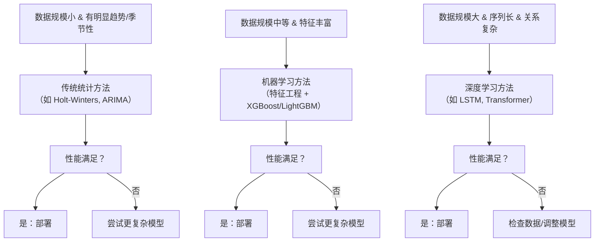

# 时间序列算法
**时间序列算法**是一类专门用于处理**按时间顺序排列的数据点**的算法，其核心目标是发现数据中的内在规律（如趋势性、季节性、周期性），并进行**预测（Forecasting）**、**分类（Classification）** 或**异常检测（Anomaly Detection）**。可以将算法分为三大类：**传统统计方法**、**机器学习方法**和**深度学习方法**。

### 如何选择时序算法？

### 总结

| 类别 | 代表算法 | 优点 | 缺点 | 适用场景 |
| :--- | :--- | :--- | :--- | :--- |
| **传统统计** | ARIMA, Holt-Winters | 可解释性强，理论完善，对小数据效果好 | 难以捕捉复杂非线性关系，需要人工预处理 | 规律性强、数据量不大的场景 |
| **机器学习** | XGBoost, LightGBM | 效果强大，能捕捉非线性，对特征工程友好 | 需要大量特征工程，可解释性较差 | 数据量中等，特征丰富的场景（主流） |
| **深度学习** | LSTM, Transformer | 能自动学习特征，处理超长序列，效果极致 | 需要大量数据，训练成本高，是“黑盒” | 大数据量、复杂模式（如音频、视频序列） |
