# 算法与数据结构

[toc]

### 数据结构可视化不错的网站：

* https://www.cs.usfca.edu/~galles/visualization/Algorithms.html
* https://visualgo.net/en

有两个问题至关重要：


* **算法和数据结构有什么关系？**
* **这两个东西与编译器、操作系统、计算机网络又是什么关系？**


很明显它们并不是并列关系，其中的复杂关系让我娓娓道来。


> 算法为什么要和数据结构一起讲？

算法，简单可以理解为“计算方法”，但这个计算可不是狭义的数学运算，而是包括了将现实问题抽象成数学模型的思想，但是归根结底是将问题转化为数学计算。这不是计算机的专属，但在计算机领域，特殊的是需要将数学计算进一步简化为二进制的加减乘除。

那？这与数据结构有什么关系？计算方法，当然要针对计算的数据，而方法和数据其实是不可分的，甚至可以说，方法的诞生伴随着数据结构的诞生------比如人类的十进制加减法，对应的就是0-9这十个数字。没有人可以将十进制加减法和0-9这十个数字脱离开（有严谨的同学可能会说，我用一到十这十个汉子，这本质还是这十个符号，用什么都可以，只有这十个符号作为数据，才可以进行加减法）。

而同样的，怎样组织定义数据，往往和怎么处理计算这些数据是密不可分的，甚至这两个过程历史上本就是一个过程。

> 要是这么说，所有都有关系，没有编译器能有操作系统吗，没有算法和数据结构能有编译器吗？


## 线性表


### 顺序表


### 单链表


#### 尾插法建立单链表


```c++
//定义一个单链表
typedef struct LNode{
    ElemType data;
    struct LNode *next;
}LNode, *LinkList;


// 尾插法
LinkList list_TailInsert(LinkList &L){
    int x;
    LinkList L = new LinkList;
	LNode *s, *r = L;
    scanf("%d", &x);
    while(x!=9999){
        LNode *s = new LNode;
        s->data = x;
        r->next = s;
        r = s;
        scanf("%d", &x);
    }
    r->next = NULL;
    return L;
}
```


#### 递归删除无头节点单链表某值

```c++ 
//删除单链表某值
void 删除单链表某值(LinkList * & L, ElemType x) {
    LNode *p = (LNode *)malloc(sizeof(LNode));
    if (L == NULL) {
        return;
    }
    if (L->data == x) {
        p = L;
        L = L->next;  //精髓所在
        free(p);
        删除单链表某值(L, x);
    }
    else {
        删除单链表某值(L->next, x);
    }
}
```

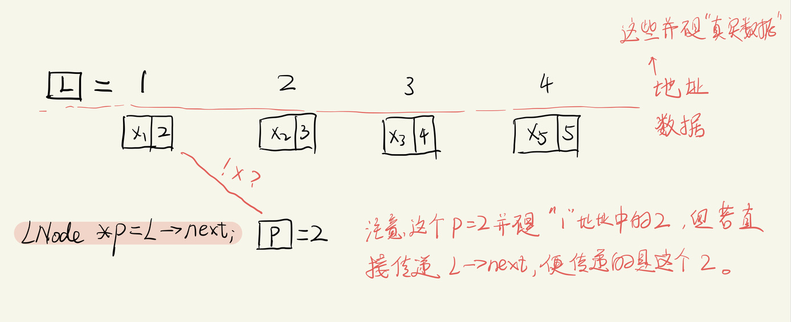

上图中没说出事情的全部，我们应该注意到上述代码中，接受的参数是`LinkList *&L`，这点非常关键！

因为我们传入的这个地址，如果类型为`LinkList * L`，那么传入的则是`L->next`的拷贝，则该链表就会断掉。

`LinkList *` 表示这个参数是一个**地址**，而`&`表示，L是这个**地址**的引用，而传递这个**地址**时，不能直接拷贝这个地址，而是去存放这个**地址**的地址寻址！（**加粗**的“地址”是指的上面x1旁边的2，而本句话最后为加粗的地址是指的上图中的1）。


### 栈


#### 出栈合法性


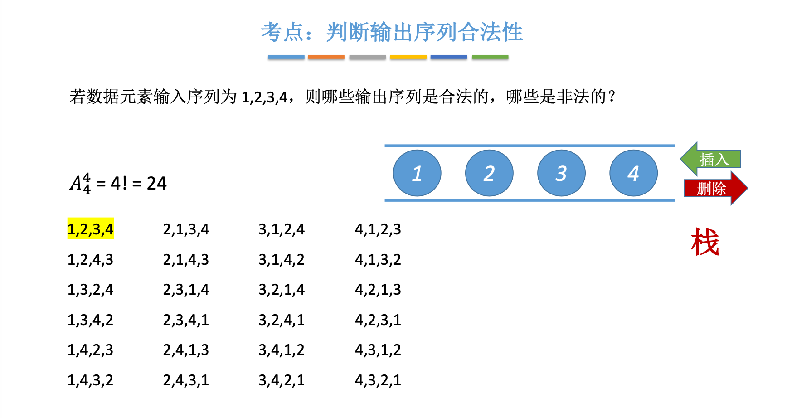


## 串


### 定义


### 朴素匹配算法


### KMP匹配算法


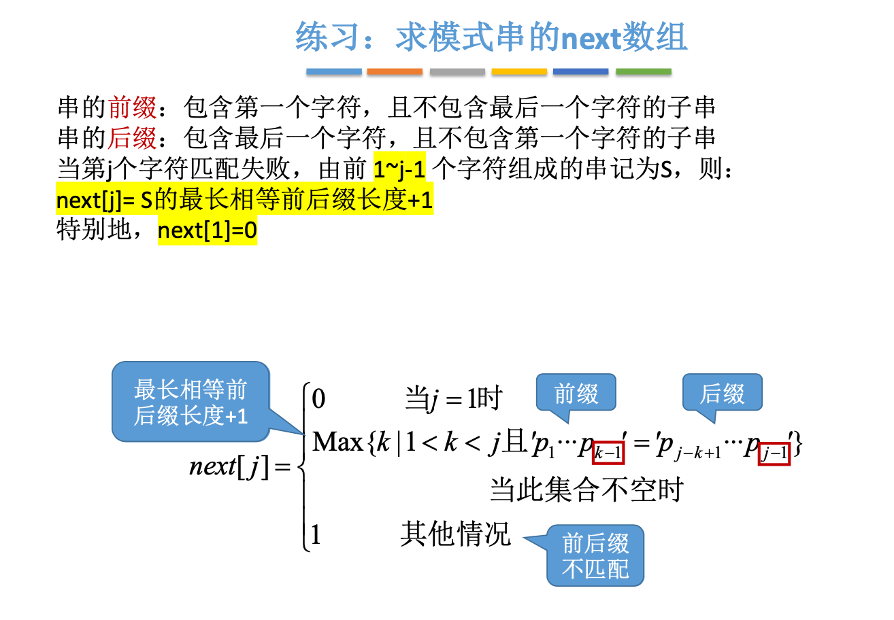

### KMP算法优化


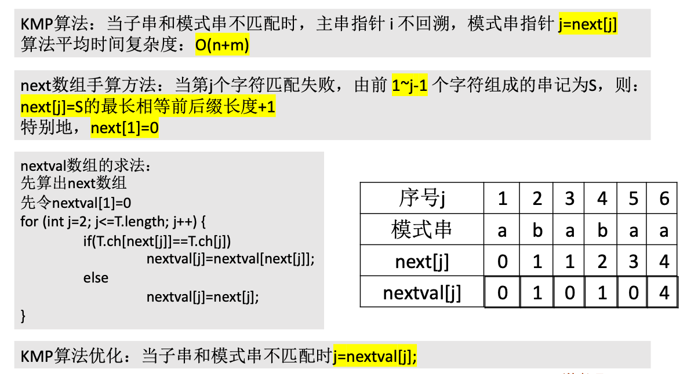


## 树


### 二叉树


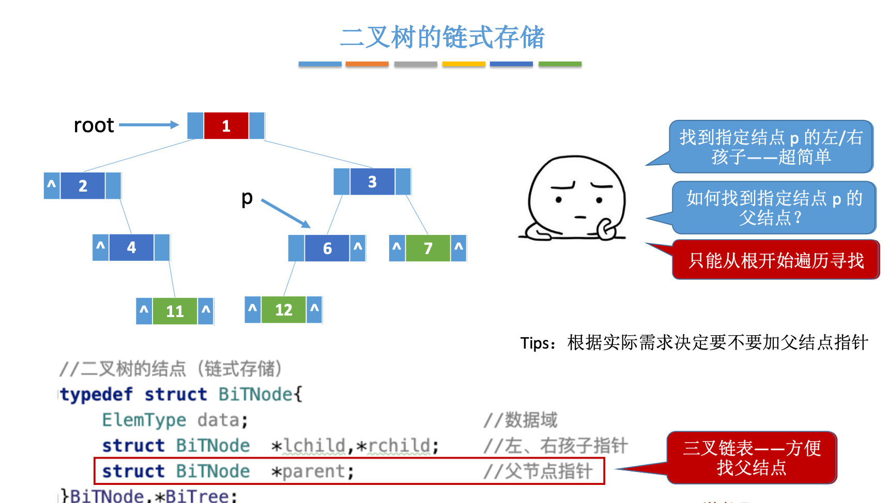


#### 二叉树的遍历

* 先序遍历

**递归**调用来实现，二叉树的遍历：

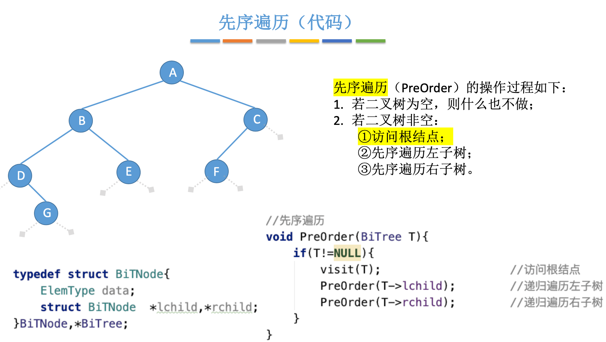


* 层序遍历


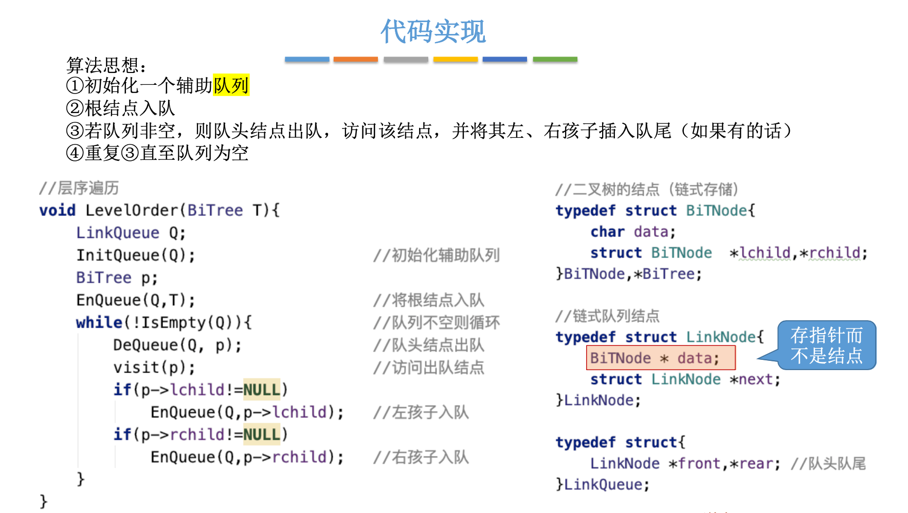


#### 二叉树的应用

##### 算数表达式：


```c
先序遍历：-+a*b-cd/ef	//前缀表达式
中序遍历：a+b*c-d-e/f	//中缀表达式（需要加界限符）
后序遍历：abcd-*+ef/-	//后缀表达式
```

计算机的输入只会是中缀表达式（因为是人输入的计算式）。所以问题1是怎么将中缀表达式转换为表达式树，问题2是有了表达式树怎么进行计算。

* [调度场算法](https://zh.wikipedia.org/wiki/调度场算法)

* [逆波兰表示法](https://zh.wikipedia.org/wiki/逆波兰表示法#C++程序实现)

调度场算法是将中缀表达式转换为后缀表达式，而后者又称逆波兰表示法，是计算机进行数学计算的高效方式。然而在实际中，往往会讲中缀表达式转化为表达式树，然后其便利序列就是后缀、前缀、中缀表达式。


##### 求树的深度：

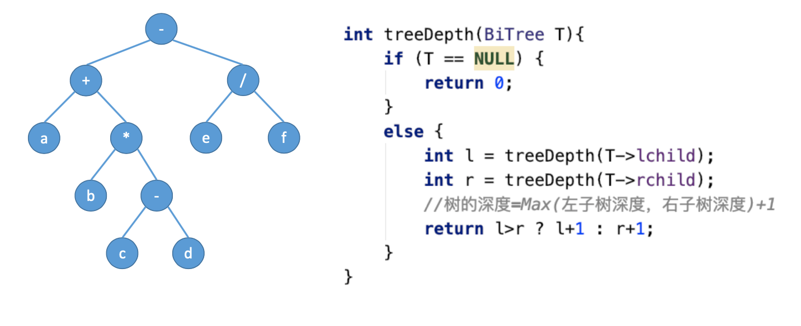

#### 线索二叉树


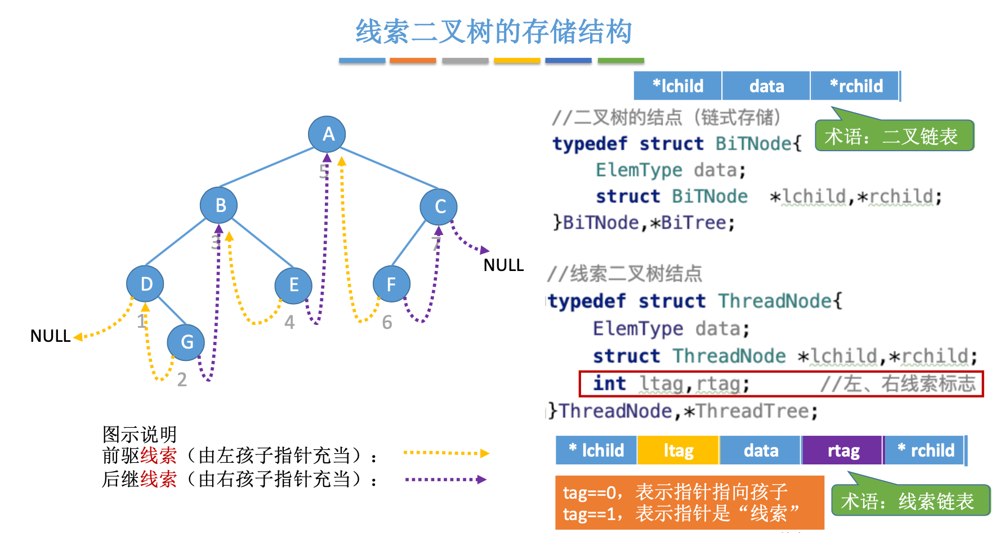


**中序线索化代码过程：**

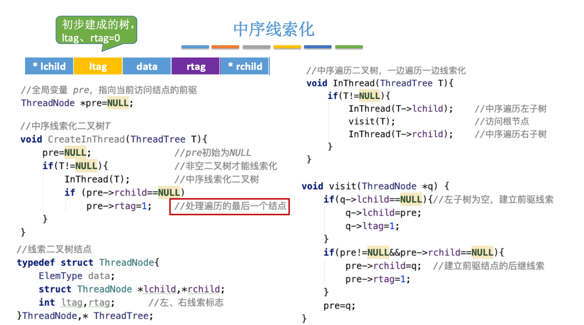


上述代码会建立一个pre的全局变量：


**先序线索化代码过程：**

我们需要注意到这样一个问题：如果访问到没有左子树的节点，将该节点的左子树节点置为其前驱节点。然后若此时再访问这个节点的左子树就会有问题。

**Question：为何中、后序线索化就没有这种问题？**

首先右子树总不会存在该问题，因为其若为NULL，则被替换为后继节点，也就是访问下个节点时才会更改；其次在中后序线索化中，先访问左子树，所以总会先“解决”那个左子树为NULL的节点，所以不会出现这种问题。

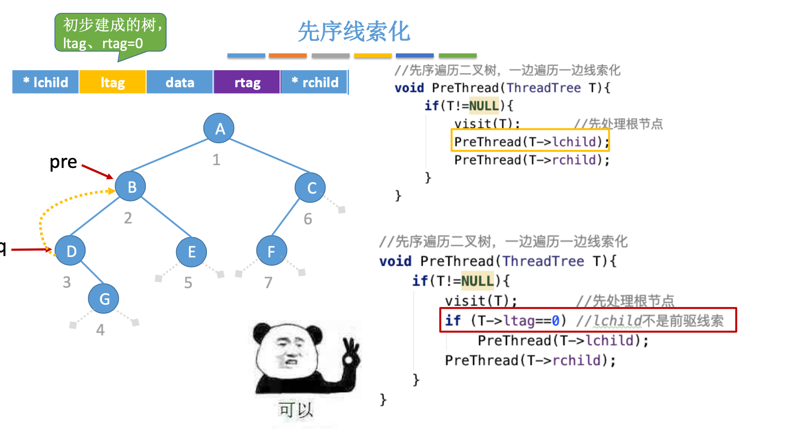


**中序线索二叉树找节点的前驱、后继：**

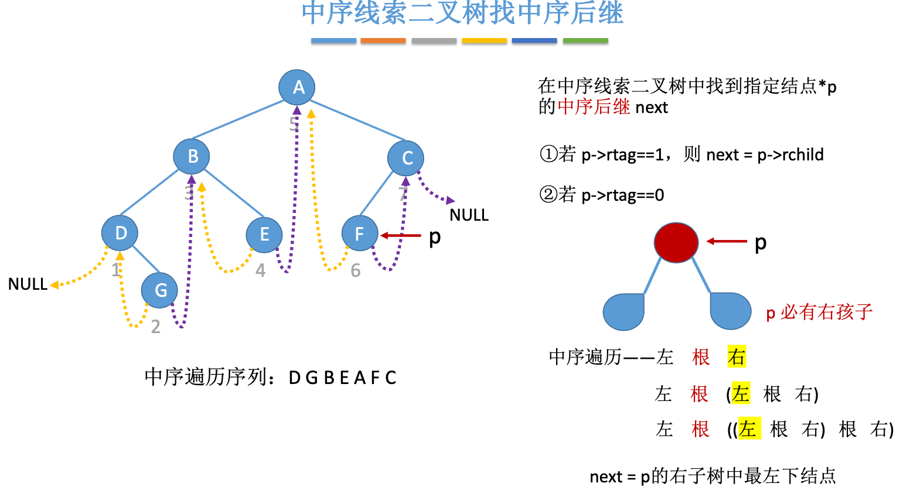

```c
//------------------中序线索二叉树找中序后继------------------
//找到以P为根的子树中，第一个被中序遍历的结点
ThreadNode *FirstNode(ThreadNode *p){
    //循环找到最左下结点（不一定是叶结点）
    while(0==p->ltag){
        p=p->lchild;
    }
    return p;
}

//在中序线索二叉树中找到结点p的后继结点
ThreadNode *NextNode(ThreadNode *p){
    //在右子树中最左下结点
    if(0==p->rtag)return FirstNode(p->rchild);
    else return p->rchild;
}

//对中序线索二叉树进行中序遍历（利用线索实现的非递归算法），空间复杂度为O(1)；
void InOrder(ThreadNode *T){
    for (ThreadNode *p = FirstNode(T);  p!=NULL ; p=NextNode(p)) {
        visit(p);
    }
}
```

##### 总结


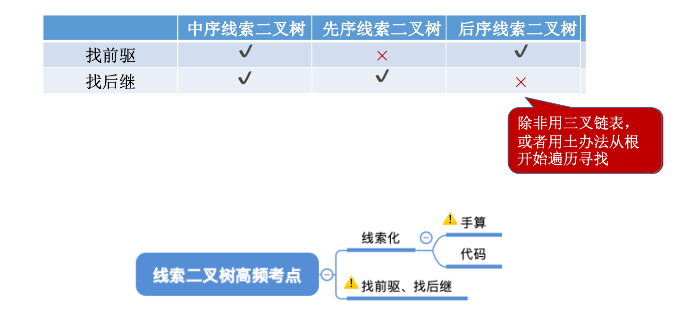

### 树的存储结构

**Question：为啥会有树的存储结构？明明二叉树都讲过了呀？**

因为二叉树最多可以有两个子树节点，所以sturct是确定的，而一般意义的树是可以有任意多的子树节点的，所以这就让节点struct表述很困难。

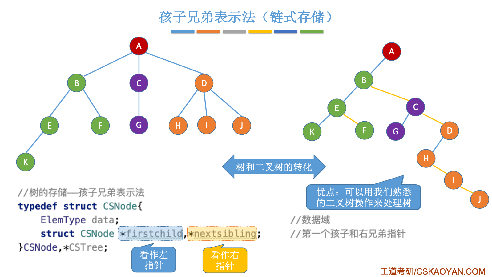


#### 树、森林的遍历


### 二叉排序（搜索）树BST

知道了中序遍历等方法， 再结合之前提到的二叉排序树就可以发现它的好处———高效查找、排序。

* BST的中序遍历结果是一个递增序列


#### BST查找


#### BST插入


#### BST删除


## 图 


## 查找


### B树/B+树


### Hash 算法

Hash也称散列、哈希，对应的英文都是Hash。基本原理就是把任意长度的输入，通过Hash算法变成固定长度的输出。这个映射的规则就是对应的Hash算法，而原始数据映射后的二进制串就是哈希值。


#### Hash 冲突及解决方案


#### 常见的Hash算法实现

几十年前（21世纪初前后），SHA-1、MD5算法都是不错的Hash算法，所谓不错，就是较为符合上述Hash算法的优点。而在2010年以来，Hash算法逐渐被替换为SHA-2算法，这算是当今最安全稳定的的Hash算法，而还是需要强调，这不算是严格意义上的加密算法，只是其有一定的破解难度。


另外，若用做存储查找的Hash表，则算法需要相对简单的实现方式（当然也意味着冲突率高等问题），否则就失去了Hash存储最大的优点------o(1)的查找时间复杂度。


具体关于**不同情形下对Hash算法**的要求，这个知乎回答不错：

> 作者：之幽
> 链接：https://www.zhihu.com/question/26762707/answer/40119521
> 来源：知乎
> 著作权归作者所有。商业转载请联系作者获得授权，非商业转载请注明出处。
>
> 
>
> 由于用途的不同，hash在数据结构中的含义和密码学中的含义并不相同，所以在这两种不同的领域里，算法的设计侧重点也不同。
>
> 预备小知识：
>
> **抗碰撞能力**：对于任意两个不同的数据块，其hash值相同的可能性极小；对于一个给定的数据块，找到和它hash值相同的数据块极为困难。
>
> **抗篡改能力**：对于一个数据块，哪怕只改动其一个比特位，其hash值的改动也会非常大。
>
> 在用到hash进行管理的数据结构中，比如hashmap，hash值（key）存在的目的是**加速键值对的查找，**key的作用是为了将元素适当地放在各个桶里，对于抗碰撞的要求没有那么高。换句话说，**hash出来的key，只要保证value大致均匀的放在不同的桶里就可以了**。但整个算法的set性能，直接与hash值产生的速度有关，所以这时候的hash值的产生速度就尤为重要，以JDK中的String.hashCode()方法为例：
>
> ```java
>     public int hashCode() {
>         int h = hash;
>  //hash default value : 0 
>         if (h == 0 && value.length > 0) {
>  //value : char storage
>             char val[] = value;
> 
>             for (int i = 0; i < value.length; i++) {
>                 h = 31 * h + val[i];
>             }
>             hash = h;
>         }
>         return h;
>     }
> ```
>
> 很简洁的一个乘加迭代运算，在不少的hash算法中，使用的是异或+加法进行迭代，速度和前者差不多。
>
> 在密码学中，hash算法的作用主要是用于消息摘要和签名，换句话说，它主要用于对整个消息的完整性进行校验。举个例子，我们登陆知乎的时候都需要输入密码，那么知乎如果明文保存这个密码，那么黑客就很容易窃取大家的密码来登陆，特别不安全。那么知乎就想到了一个方法，使用hash算法生成一个密码的签名，知乎后台只保存这个签名值。由于hash算法是不可逆的，那么黑客即便得到这个签名，也丝毫没有用处；而如果你在网站登陆界面上输入你的密码，那么知乎后台就会重新计算一下这个hash值，与网站中储存的原hash值进行比对，如果相同，证明你拥有这个账户的密码，那么就会允许你登陆。银行也是如此，银行是万万不敢保存用户密码的原文的，只会保存密码的hash值而而已。
>
> 在这些应用场景里，对于抗碰撞和抗篡改能力要求极高，对速度的要求在其次。一个设计良好的hash算法，其抗碰撞能力是很高的。以MD5为例，其输出长度为128位，设计预期碰撞概率为![[公式]](https://www.zhihu.com/equation?tex=1%2F2%5E%7B64%7D+)，这是一个极小极小的数字——而即便是在MD5被王小云教授破解之后，其碰撞概率上限也高达![[公式]](https://www.zhihu.com/equation?tex=1%2F2%5E%7B41%7D+)，也就是说，至少需要找![[公式]](https://www.zhihu.com/equation?tex=2%5E%7B40%7D+)次才能有1/2的概率来找到一个与目标文件相同的hash值。而对于两个相似的字符串，MD5加密结果如下：
>
> ```text
> MD5("version1") = "966634ebf2fc135707d6753692bf4b1e";
> MD5("version2") = "2e0e95285f08a07dea17e7ee111b21c8";
> ```
>
> 可以看到仅仅两个比特位(char("1")和char("2"))的改变，二者的MD5值就天差地别了。
>
> 到这里，读者估计会问，有没有可能找到这么一个算法，如果输出长度为128位，那么把这128位“充分利用到”，让它可以有![[公式]](https://www.zhihu.com/equation?tex=2%5E%7B128%7D+)种不同的hash值，而且分布均匀，抗篡改能力也特别高，一点点改动就会让hash值面目全非，一点都不浪费（这里的表述非常不严格）？稍微严格一点表述，就是：**有没有这样一个算法，使得对于任何一个给定的输入，此算法都会输出一个固定的均匀随机的输出？**
> 答案是密码学家们也至今没有构造出着这样一个算法，但是倾向于这个算法存在，而且有不少的密码学算法构造和这个假设有关。这个假设的名字叫做随机预言机（Random Oracle）。
>
> 在密码学中，hash算法有不少有意思的改进思路，以应付不同的使用场景。例如师兄 
>
> [@刘巍然-学酥](http://www.zhihu.com/people/d543743c88797978a0a8c453f8768974)
>
> 前一段时间让我写着玩的变色龙Hash（ChameleonHash），它有一个有趣的特性。在普通情况下，ChameleonHash可以当做普通hash算法使用，从明文（用m表示）得到的hash值（用h表示）抗碰撞能力依然特别强；但是如果使用者在计算这个hash值的时候预先计算一个值（用s表示）并保存，那么通过这个值很容易计算出另一个hash值也为h的明文m' ！也就是说，如果你保留这个值的话，hash算法的抗碰撞能力完全被解除了。
> 这意味着，如果某个网站想要作恶的话，那么它可以很容易的替换他们自己的hash算法为ChameleonHash，方便地伪造出一个密钥来窃取用户的所有数据，而这个公司完全可以在对外宣传的时候，依然声称对用户信息**严格**保密——《教网站如何优雅地耍流氓》。


#### hash算法在日常活动中的应用

> 作者：腾讯技术工程
> 链接：https://www.zhihu.com/question/26762707/answer/890181997
> 来源：知乎
> 著作权归作者所有。商业转载请联系作者获得授权，非商业转载请注明出处。
>
> 在日常运营活动中，我们活动开发经常遇到的应用场景是信息加密、数据校验、负载均衡。下面分别对这三种应用场景进行讲解。
>
> ##### 信息加密
>
> 首先我们看一下信息加密的应用。2011年CSDN脱库事件，导致超过600W的用户的密码泄露，让人失望的是，CSDN是明文存储用户的注册邮箱和密码的。作为用户的非常隐私的信息，最简单的保护措施就是对密码进行hash加密。在客户端对用户输入的密码进行hash运算，然后在服务端的数据库中保存用户密码的hash值。由于服务器端也没有存储密码的明文，所以目前很多网站也就不再有找回密码的功能了。
>
> - 这里也友情提示一下大家：如果在使用中发现某网站还有提供找回密码的功能，就要好好担心下这个网站的安全性了。
>
> 看到这里有些同学会觉得那么我们是不是对用户输入的密码进行一次MD5加密就可以了呢，这样就算恶意用户知道了hash值，也没有办法拿到用户的真实密码。假设用户的密码是`123456789`，经过一次md5以后得到的值是:
>
> ```
>25f9e794323b453885f5181f1b624d0b
> ```
>
> 那么是不是使用了这个加密后的字符串来存密码就万无一失了呢，理想总是很丰满，而现实总是很骨感的。
> 
> 大家可以看一下这个网站：
>
> [https://www.cmd5.com/](https://link.zhihu.com/?target=https%3A//www.cmd5.com/)
>
> 这里是该网站的相关介绍：
>
> > 本站针对md5、sha1等全球通用公开的加密算法进行反向查询，通过穷举字符组合的方式，创建了明文密文对应查询数据库，创建的记录约90万亿条，占用硬盘超过500TB，查询成功率95%以上，很多复杂密文只有本站才可查询。已稳定运行十余年，国内外享有盛誉
>
> 
>
> 那么一般针对这种问题，我们的解决之道就是引入salt(加盐)，即利用特殊字符（盐）和用户的输入合在一起组成新的字符串进行加密。通过这样的方式，增加了反向查询的复杂度。但是这样的方式也不是万无一失，如果发生了盐被泄露的问题，就需要所有用到的地方来重置密码。
>
> 针对salt泄露的问题，其实还有一种解决办法，即使用HMAC进行加密（Hash-based Message Authentication Code）。这种算法的核心思路是加密使用的key是从服务器端获取的，每一个用户的是不一样的。如果发生了泄露，那么也就是这一个用户的会被泄露，不会影响到全局。
>
> 这里也留给大家一个思考点，如果恶意用户直接抓取了你的活动参与链接，也就是拿到了你计算后的hash值，那从技术的角度上说，我们还有没有其他可以提升恶意用户的违法成本呢？
>
> 
>
> ##### 数据校验
>
> \- **git commit id**
>使用过git的同学都应该清楚，每次git提交后都有一个commit id，比如`:`
> 
>```
> 19d02d2cc358e59b3d04f82677dbf3808ae4fc40
> ```
>
> 就是一次git commit的结果，那么这个id是如何生成出来的呢？查阅了相关资料，使用如下代码可以进行查看：
> 
> ```text
>printf "commit %s\0" $(git cat-file commit HEAD | wc -c); git cat-file commit HEAD
> ```
>
> git的commit id主要包括了以下几部分内容：Tree 哈希，parent哈希、作者信息和本次提交的备注。
> 
> 
>
> 针对这些信息进行SHA-1 算法后得到值就是本次提交的commit id。简单来讲，就是对于单次提交的头信息的一个校验和。
>
> > Linux kernel开创者和Git的开发者——Linus说，Git使用了sha1并非是为了安全性，而是为了数据的完整性；它可以保证，在很多年后，你重新checkout某个commit时，一定是它多年前的当时的状态，完全一摸一样，完全值得信任。
>
> 但最新研究表明，理论上对其进行哈希碰撞（hash collision，不同的两块数据有相同的hash值）的攻击可以在2^51（2的51次方）左右的次数内实现。不过由于commit id 是针对单个仓库里的，所以实际应用中我们可以认为如果两个文件的SHA-1值是相同的，那么它们确是完全相同的内容。
>
> *注：对于git里tree、parent等结构感兴趣的同学，可以参考下这篇文章[《Git 内部原理 - Git 对象》](https://link.zhihu.com/?target=https%3A//git-scm.com/book/zh/v2/Git-%E5%86%85%E9%83%A8%E5%8E%9F%E7%90%86-Git-%E5%AF%B9%E8%B1%A1)，这里由于篇幅原因就不进行深入分析了。*
>
> - **版权校验**
>  在数据校验方面的另一个应用场景就是版权的保护或者违禁信息的打击，比如某个小视频，第一个用户上传的时候，我们认为是版权所有者，计算一个hash值存下来。当第二个用户上传的时候，同样计算hash值，如果hash值一样的话，就算同一个文件。这种方案其实也给用户传播违禁文件提高了一些门槛，不是简单的换一个名字或者改一下后缀名就可以躲避掉打击了。（当然这种方式也是可以绕过的，图片的你随便改一下颜色，视频去掉一帧就又是完全不同的hash值了。注意：我没有教你变坏，我只是和你在讨论这个技术。。。）另外我们在社区里，也会遇到玩家重复上传同一张图片或者视频的情况，使用这种校验的方式，可以有效减少cos服务的存储空间。
> - **大文件分块校验**
>  使用过bt的同学都有经验，在p2p网络中会把一个大文件拆分成很多小的数据各自传输。这样的好处是如果某个小的数据块在传输过程中损坏了，只要重新下载这个块就好。为了确保每一个小的数据块都是发布者自己传输的，我们可以对每一个小的数据块都进行一个hash的计算，维护一个hash List，在收到所有数据以后，我们对于这个hash List里的每一块进行遍历比对。这里有一个优化点是如果文件分块特别多的时候，如果遍历对比就会效率比较低。可以把所有分块的hash值组合成一个大的字符串，对于这个字符串再做一次Hash运算，得到最终的hash（Root hash）。在实际的校验中，我们只需要拿到了正确的Root hash，即可校验Hash List，也就可以校验每一个数据块了。
> 
> 
> 
> ##### 负载均衡
>
> 活动开发同学在应对高星级业务大用户量参与时，都会使用分库分表，针对用户的openid进行hashtime33取模，就可以得到对应的用户分库分表的节点了。
>
> 
>
> 如上图所示，这里其实是分了10张表，openid计算后的hash值取模10，得到对应的分表，在进行后续处理就好。对于一般的活动或者系统，我们一般设置10张表或者100张表就好。
>
> 下面我们来看一点复杂的问题，假设我们活动初始分表了10张，运营一段时间以后发现需要10张不够，需要改到100张。这个时候我们如果直接扩容的话，那么所有的数据都需要重新计算Hash值，大量的数据都需要进行迁移。如果更新的是缓存的逻辑，则会导致大量缓存失效，发生`雪崩效应`，导致数据库异常。造成这种问题的原因是hash算法本身的缘故，只要是取模算法进行处理，则无法避免这种情况。针对这种问题，我们就需要利用`一致性hash`进行相应的处理了。
>
> `一致性hash`的基本原理是将输入的值hash后，对结果的hash值进行2^32取模，这里和普通的hash取模算法不一样的点是在一致性hash算法里将取模的结果映射到一个环上。将缓存服务器与被缓存对象都映射到hash环上以后，从被缓存对象的位置出发，沿顺时针方向遇到的第一个服务器，就是当前对象将要缓存于的服务器，由于被缓存对象与服务器hash后的值是固定的，所以，在服务器不变的情况下，一个openid必定会被缓存到固定的服务器上，那么，当下次想要访问这个用户的数据时，只要再次使用相同的算法进行计算，即可算出这个用户的数据被缓存在哪个服务器上，直接去对应的服务器查找对应的数据即可。这里的逻辑其实和直接取模的是一样的。如下图所示：
>
> 
>
> 初始情况如下：用户1的数据在服务器A里，用户2、3的数据存在服务器C里，用户4的数据存储在服务器B里
>
> 下面我们来看一下当服务器数量发生变化的时候，相应影响的数据情况：
>
> - **服务器缩容**
>
> 
>
> 服务器B发生了故障，进行剔除后，只有用户4的数据发生了异常。这个时候我们需要继续按照顺时针的方案，把缓存的数据放在用户A上面。
>
> - **服务器扩容**
>  同样的，我们进行了服务器扩容以后，新增了一台服务器D，位置落在用户2和3之间。按照顺时针原则，用户2依然访问的是服务器C的数据，而用户3顺时针查询后，发现最近的服务器是D，后续数据就会存储到d上面。
> 
>
> 
> - **虚拟节点**
>  当然这只是一种理想情况，实际使用中，由于服务器节点数量有限，有可能出现分布不均匀的情况。这个时候会出现大量数据都被映射到某一台服务器的情况，如下图左侧所示。为了解决这个问题，我们采用了`虚拟节点`的方案。`虚拟节点`是`实际节点`（实际的物理服务器）在hash环上的`复制品`，一个实际节点可以对应多个虚拟节点。虚拟节点越多，hash环上的节点就越多，数据被均匀分布的概率就越大。
> 
>
> 
> 如右图所示，B、C、D 是原始节点复制出来的虚拟节点，原本都要访问机器D的用户1、4，分别被映射到了B,D。通过这样的方式，起到了一个服务器均匀分布的作用。


#### Hash 表

Hash 也可以存储数据，这样就可以在理论上实现o(1)的查找速度。（为何理论上？因为要运行Hash算法还需要时间）

> 作者：invalid s
> 链接：https://www.zhihu.com/question/330112288/answer/744362539
> 来源：知乎
> 著作权归作者所有。商业转载请联系作者获得授权，非商业转载请注明出处。
>
> 
>
> 很多人谈起“哈希表”，就会直接聚焦到hash函数、“散列”/“杂凑”之类不明所以的大词上，搞的初学者一头雾水，完全不明白这东西是干嘛用的，更不知道什么时候该用它、怎么用它、出现问题如何解决。
>
> 
>
> 那么，这里我就从问题开始，一步步把哈希表的来龙去脉剖析清楚。
>
> ------
>
> 想象一下：有一天，你开车到某商场去买东西。买完东西，你想不起自己的车在哪了。
>
> 
>
> 这家商场非常非常大，楼下停车场少说停了上万台车；而你的健忘症又比较厉害……
>
> 
>
> 那么，问题来了：你怎样才能找到自己的车？
>
> 
>
> 
>
> 一个理想的情形是，你从头到尾一行一行一辆一辆按顺序走一遍就找到了；运气最差时，你搜遍楼下N辆车，发现你的车在末尾——拿术语说，这个复杂度是O(N)。
>
> 
>
> 能不能更快一些呢？
>
> 
>
> 很简单，假如所有车按车牌号顺序排列，你直接往停车场中间走就行了；如果你的车牌号大于中间那辆车，那么你就往停车场后半部分的中间走，否则就往前半场走……依此类推。
>
> 如此一来，你最多只需要走ln（N）次“中间”，就能找到你的车了。黑话叫复杂度O(ln N)。
>
> 
>
> 还能不能更给力一些？
>
> 
>
> 可以。
>
> 假设这个停车场非常非常大，大到可以给每个车牌号分配一个固定的停车位；那么只要你把自己的车牌号报给看门老头，他拎着你的衣领子往后一丢，你就“吧唧”一下掉自己车顶上了——嗯，你看，一车一位，就是这么任性。
>
> 这就叫“查找复杂度O(1)”。
>
> ------
>
> 如果用程序实现的话，就是这么一个数组：
>
> car park[MAX_CAR_NUM]
>
> 
>
> 第一个场景，你要直接以一个循环遍历park中的每个元素。
>
> 第二个场景，你只需先访问MAX_CAR_NUM除以2的那个位置，再根据车牌号大小访问数组前半拉或者后半拉中间的元素即可。
>
> 第三个场景，你的车牌号就是数组下标，所以你只需直接访问park[CAR_NUMBER]即可。
>
> 
>
> 
>
> 那么，第三个设计是不是完全解决问题了呢？
>
> 
>
> 并不是。
>
> 很容易看出，第三个方案需要一个超级大的存储空间。
>
> 这个空间得有多大呢？
>
> 它必须大到足以和过去未来的一切有效车牌号一一对应，你才可能做到“直接按号访问”。
>
> 
>
> 假设车牌号共8位，每位可以使用26个英文字母或10个阿拉伯数字，那么不同的车牌号共有36^8=2821109907456种。
>
> 
>
> 哪怕每辆车只需一个字节的存储空间，这也是接近3T的空间！
>
> 
>
> 而事实上，哪怕最大的超市，修一个够停一万辆车的停车场也都太夸张了。
>
> 你看，这完全行不通啊。
>
> ------
>
> 那么，有没有办法在得到O(1)的查找效率的同时、又不付出太大的空间代价呢？
>
> 
>
> 没错，的确是有的。这就是哈希表。
>
> 
>
> 哈希表是怎么玩的呢？
>
> 
>
> 很简单，我们把你的车牌号看作一个8位36进制的数字；为了方便，我们可以把它转换成十进制。
>
> 那么，你的车牌号就是一个不大于2821109907456的数字。
>
> 
>
> 现在，我们把你的车牌号除以一万，只取余数——你看，你的车牌号是不是就和0~10000之间的数字对应起来了？
>
> 
>
> 很好，你的车就停在这个数字对应的停车位上，过去开就是了——O(1)的查找效率！
>
> 
>
> 这个“把你的车牌号映射进0~10000之间”的操作，就是所谓的“散列”“杂凑”“哈希”或者hash（当然，实践上，为了尽量减少冲突，哈希表的空间大小会尽量取质数）。
>
> 相对于“以key为下标直接访问的数组”，哈希表是“时间换空间”；相对于二分法查找，哈希表又是“以空间换时间”。这种“中庸”的定位使得它在许多场合极为好用。
>
> ------
>
> 等等，你发觉不对：我的车尾号3456，我朋友的车也是这个尾号。我们总不能停在同一个位置吧？
>
> 
>
> 你这个方案有瑕疵啊！
>
> 
>
> 没错，hash可能会把不同的数据映射到同一个点上，术语称其为“碰撞”。
>
> 由于hash自身的基本原理，碰撞是不可避免的。
>
> 
>
> 怎么解决这个“碰撞”问题呢？
>
> 
>
> 几种解决思路：
>
> 1、临时加个“立体车库”，哪里碰撞往哪放。于是车子就可以在同一位置“撂起来”存了。这叫“开链表法”。
>
> 2、车库面积肯定是够的。3456号被人占了，你存3457不就好了！
>
> 换句话说，过去的散列函数是 （车牌号 模除 10000），发现碰撞了就换散列函数 （车牌号加1 模除 10000）试一试——这叫“再散列法”。
>
> 3、再修个小车库，碰撞了的停小车库去（小车库可以随便停，也可以搞一套别的机制）
>
> 
>
> 总之，如此一来，我们就同时得到了“O（1）的查找效率”和“可接受的空间消耗”。
>
> 
>
> 任何时候，当你有“数量有限”但“不同索引数量极大”的一些数据，必需极高的访问效率同时又不想无端消耗太多的存储空间时，你就可以考虑使用哈希表了。
>
> 
>
> 当然，请注意，因为冲突的存在，哈希表虽然有着优异的平均访问时间（常数访问效率！）；但它的“最大访问时间”却是没有保证的——你可能一个微秒甚至几个纳秒就拿到了数据，也可能几十个毫秒了还在链表上狂奔。因此实时性要求严格的场合，用它前需要谨慎考虑。
>
> ------
>
> 知道了哈希表的设计思路，我们就可以进入稍微困难一些的部分了。
>
> 
>
> 我们已经知道，所谓“哈希表”，实际上是我们把对象（value）的“键值（key)”转换成了“数组下标”；然后就可以借助这个下标一步到位的找到对应对象（value）了。
>
> 
>
> 但这中间有“瑕疵”存在：和身份证号和公民一一对应不同，键值和下标并不是一对一的关系。就好像你的车牌尾号是23456而你朋友是53456，结果把你们安排到同一个停车位一样。
>
> 
>
> 很容易想到，很多数据的键值（key）分布存在一定的规律。
>
> 比如，身份证其中4位是你的出生年份，这四位其实只能当两位用；再如，手机号码前3位只可能是135、132、153等少数数字……
>
> 那么，如果我们的“键值转换数组下标的函数（也就是哈希函数）”选择不当（比如给手机前几位、身份证的出生年份字段这些相对缺乏变化的数据过高权值），就很容易使得“碰撞”频繁出现。
>
> 这就对哈希函数的选择提出了要求。
>
> 
>
> 但是哈希函数本身也不应该过于复杂，不然每次计算耗时太久——O(1)虽然是常数时间；但如果时间常数太长，它可能就不如O（lnN）查找算法快。
>
> 要知道，在一百万数据里面做二分法搜索，最差时也不过需要20次搜索而已；如果你的哈希函数本身需要的计算时间已经超过了这个限度，那么改用二分法显然是个更为理智的选择：不仅更快，还更省空间。
>
> 工程问题，向来是需要根据实际情况灵活选择、做出合理折衷的。
>
> 
>
> 扯远了。
>
> 
>
> 继续说哈希函数。
>
> 很显然，用于哈希表的哈希函数可不能是MD5或者sha1系列函数，太慢；但也不能直接模除一个整数，太容易出现冲突。
>
> 
>
> 简单说就是：哈希表用到的哈希函数，一方面要能尽量把key均匀散布在表空间中（从而尽量减少冲突），另一方面又要有尽量快的计算速度。
>
> 
>
> 这类函数有很多种，稍微搜一搜就能找到很多。
>
> ------
>
> 无论如何，原理所限，哈希表中碰撞无法绝对避免。
>
> 当碰撞发生时，就不得不使用开链表法或再散列法存储冲突数据；而这必将影响哈希表的性能。
>
> 
>
> 很容易想到，如果哈希表很大、里面却没存几条数据，那么它出现冲突（碰撞）的几率就会很小；反之，如果哈希表已经接近满了，那么每条新加入的数据都会产生碰撞。
>
> 换句话说，在哈希函数选择合理的前提下，想要减少碰撞，就只能扩大哈希表占用的空间。
>
> 
>
> 哈希表实际所存数据量和哈希表最大容量之间的比值，叫做哈希表的“加载因子”。
>
> 加载因子越小，冲突的概率就越低，但浪费大量空间；加载因子越高，冲突概率越大，但空间浪费就越少。这是一个需要根据工程实践灵活选择的折衷值。很多语言提供的hash表允许你主动调节这个值。
>
> 一般来说，一个较为平衡的加载因子大约是0.7~0.8左右。这样既不会浪费太多空间，也不至于出现太多冲突。
>
> 
>
> 另一方面，因为哈希表使用的哈希函数较为简单，因此对恶意的攻击者来说，他可以精心构造一大堆数据提交给你——所有这些数据散列后全都存在一个格子里。
>
> 我们前面提到过，当遇到这种冲突/碰撞时，为了避免彼此覆盖，这些数据就要存在链表中（或者再散列后存在同一个哈希表中）。
>
> 当这些数据被存进链表时，对它们的访问效率将降到O(N)——因为链表搜索效率只有O(N)。
>
> 之前就发生过这种攻击，包括Java在内的许多种语言全部落马。
>
> 
>
> 解决方案也很简单：
>
> 1、提高哈希函数复杂度，想办法加入随机性（相当于每次使用一个不同的哈希函数），避免被人轻易捕捉到弱点
>
> 2、不要用开链表法存储冲突数据，采用“再散列法”，并且使用不同的哈希函数再散列、还可以把冲突数据存入另一个表——要构造同时让两个以上不同的哈希函数冲突的攻击数据，难度就大得多了。
>
> ------
>
> 总之，哈希表是用途广泛的一种数据结构，也是很多编程语言提供的基础服务之一（比如python的dict）。
>
> 
>
> 你完全可以傻瓜式的使用它，无须搞懂它的一切；但想要把它用精、用好，你还是需要真正理解它的来龙去脉——千万不要 像某种最好的语言的作者那样，拿函数名长度当哈希值（哎呀一不小心又黑人了，顶锅逃……


## 排序


## 代码示例

定义的一些链表、顺序表等数据结构，及其常用的操作函数，最后的一些函数是稍微复杂点的操作。


```c++
#include <iostream>

//===============================结构定义===============================
struct LNode
{
    int data;
    struct LNode *next;
};

struct DNode
{
    int data;
    struct DNode *prior, *next;
};

//===============================函数声明===============================
bool InitLinkList(LNode * & L);
bool InsertList(LNode * & L, int i, int el);
LNode * GetElem(LNode * & L, int i);

//===============================常用函数定义===============================
//初始化单链表
bool InitLinkList(LNode * & L){
    LNode * L = new LNode;

    if (L == NULL){
        return false;
    }

    L->next = NULL;
    return true;
}

//单链表查找
LNode * GetElem(LNode * & L, int i){
    LNode *p;
    int j = 0;
    p = L;
    while(p!=NULL && j < i){
        p = p->next;
        j++;
    }
    return p;
}

//单链表节点插入
bool InsertList(LNode * & L, int i, int el){
    LNode *p;
    int j = 0;
    p = L;
    while (p!=NULL && j < i-1){
        p=p->next;
        j++;
    }
    LNode *s = new LNode;
    s->data = el;
    s->next = p->next;
    p->next = s;

    return true;
}

//===============================main函数===============================
int main()
{   


    return 0;
}


//===============================自定义函数===============================
//之所以函数名写中文是因为一眼看得出解决哪类问题

LNode * 合并两单链表(LNode * LA,LNode * LB){
    LNode * LS;
    InitLinkList(LS);

    LNode *p = LA;
    LNode *q = LB;

    int i,j = 0;
    while (*p != NULL && *q!= NULL){

        p=p->next;
        q=q->next
    }
    return LS;
}

//删除单链表某值
void 删除单链表某值(LinkList *&L, ElemType x) {
    LNode *p = (LNode *)malloc(sizeof(LNode));
    if (L == NULL) {
        return;
    }
    if (L->data == x) {
        p = L;
        L = L->next;  //精髓所在
        free(p);
        删除单链表某值(L, x);
    }
    else {
        删除单链表某值(L->next, x);
    }
}

//两个整数的除法在c++中舍去余数，结果依然是整数
void 测试除法(){
    int length = 7;
    std::cout << length / 2; 
}

//要求时间复杂度为n，空间复杂度为1
void 删除顺序表某值(Sqlist & L, int x){

    int k = 0; //记录不等于x的元素个数
    for (int i = 0; i < L.length; ++i)
    {
        if (L->data[i])
        {
            /* code */
        }
    }
}
```

