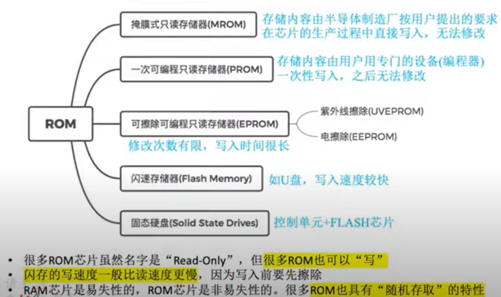
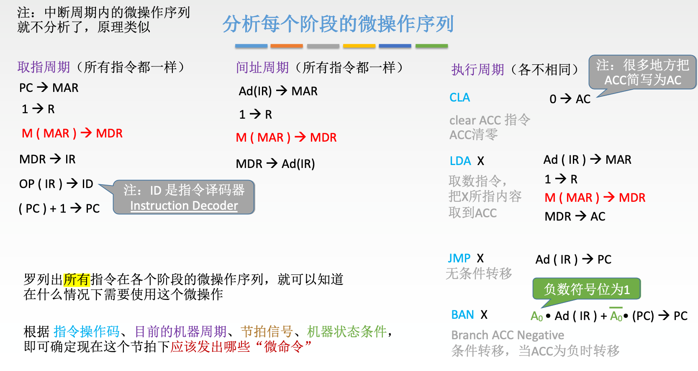

# learn Computer Organization

---

[toc]

---

## 写在前面

学习计算机的时候，我们常听到这样一句话：计算机分为硬件和软件，比如操作系统、c语言、python是软件，**我们看得见摸得着的这些实体是硬件。**

这其实有些像人类，思想（软件）给人的感觉是看不见摸不着的，而身体（硬件）是看得见摸得着呢东西。两者都很重要，这也就催生出了唯物和唯心两种世界观。我应该是个不折不扣的唯物主义者，也就是认为“思想”也需要“寄托”在身体的具体组成部分，进一步讲，千变万化的思想本质上就是身体某些部分的不同状态的组合，而近代医学已经将其锁定在脑这一部位，虽然其机制还需进一步研究。

但我想说的是，计算机很像人类，我们也常说，硬件就是看得见摸得着的部分，而软件好像看不见，然而这是完全错误的。比如一部手机开机运行的过程中，教材常讲到：软件（系统）被CPU从硬盘加载到内存，再被一步步的执行。那这个软件它属于物质吗？能看得见摸得着吗？

当然能！其实硬件和软件就像是很多被人类分类的概念一样，它们本没有这个所谓的区分。一部手机的开机过程，就是我们的手指驱动了开机按钮，从而导致电路闭合，触发了一系列人为事先设定好的连锁反应。所谓软件加载这个看似看不见的事情，其实在微观上是完全可以被观测的，而所谓操作系统这个软件，就是人类按照其特有的方式改变了硬盘这个硬件的许多微观状态。而这就是能正好触发上述连锁反应最终让我们看到手机开机的原因。

当然我们可以精确的定义软件———这种设计模式而不是具体实施的物理过程称为软件。比如我规定某个字的发音，称为软件，但并不是指我或者任何一个人喉咙声带振动的物理现象。不过也不难发现，没有后者的物理过程和现象，人类是无法“想出”这些设计模式的，当然也无法实施这些设计模式。

所谓软件、思想这种概念，只是人类便于自己交流，用特殊的物理现象（写字、说话等都是物理过程）“描述”（其实是一系列的连锁反应）另一些物理现象（比如手机开机）。反过来则不成立（比如我思故我在，那我取下来某个人的脑子，他就无法做出这些思考，思考是特殊的物理现象，物理现象并不是特殊的思考），所以世界是唯物的。

若计算机芯片内这些微观的物理状态出现了人类目前无法预测和干预的相互作用，计算机的“软件”和人类的“思想”的相似度可能就进一步缩小了，直到它们可以和人类“平起平坐”，当然这只是个想象，虽然想象也是我脑部神经电信号又引起的一系列物理化学反应罢了。

## 数据运算

## 存储器（RAM）

关于CPU取址有两个关键寄存器：

* MAR（Memory Address Register）

MAR的位数就反映了RAM的实际大小

* MDR（Memory Data Register）

MDR的位数就反映了存储字长（这是word，不同于字节Byte、位bit等）

**注意：这两个寄存器是在CPU中的，只是逻辑上服务于RAM，所以有时会在示意图的RAM中。**

### 存储单元硬件

可以按照下图简单理解，但实际的电路远比这复杂，具体可以参照[《编码的奥秘》](https://www.zhihu.com/question/59889145)

而8个上图中的存储元并联就形成了一个存储单元，通常来说是一字节（8bit），如下图所示：

进一步的，我们就可以把RAM抽象下图这样一个存储芯片：实际上，一个RAM的引脚要比这多很多，比如供电引脚、接地引脚等。

### SRAM和DRAM的区别

#### DRAM的刷新

### ROM（Read-Only Memory）

### 译码片选法

当我们假设我们有8个8KB（存储字长是一字节/8位）的存储芯片，这样我们就有了8*8K = 2^16个地址，所以地址线宽度应该是16位，那这16位地址如何准确寻址到这8个存储芯片中的一个中的一个字节呢？

这就需要地址线低13位作为片内寻址、高3位作为片选信号，也就是8个存储芯片选一个可以用这高三位地址唯一表示，但如何实现呢？这就是译码器的作用了，具体看下图：

关于实际的译码器比上述概念图复杂得多，比如它使用一个控制信号来保证信号的稳定性，如下图：

### 双口RAM & 多模块存储器

#### 交叉编址

本质上也就是上节讲的译码器的问题，但现在结合存储芯片需要一定的恢复时间才能再次读写这个问题，我们会发现，将低位地址作为片选信号时，连续读写临近地址时，效率更高。具体见下图：

上图很容易计算出：若模块数位m时，m = T/r，效率最高。因为连续读m个r之后，T就到了也就是第一个存储体恢复好了；若m > T/r，第一个存储体恢复好了还要闲置r时间；若m < T/r，连续读m个r之后，第一个还没恢复好。

**而这种“低位交叉”的技术就是传说中的双通道，所以并不是并行访问两片内存，其实还是串行，不过流水线的方式避开了存储芯片刷新恢复的时间。**

## cache

### 关于cache line 大小

**上图中有一点有错误：cache“行”（cache line）和内存页面（Memory page）大小不一样**。

> 一般来说（对于2020年前后的64位主流CPU来讲），cache line大小在64bytes，也就是64B，而Memory page size 是4KB，差距还是蛮大的，而不是上图中所说的一样大。
>
> 上述[数据参考](https://www.aristeia.com/TalkNotes/ACCU2011_CPUCaches.pdf)见下图，更详细的讨论见[stackoverflow](https://stackoverflow.com/questions/14707803/line-size-of-l1-and-l2-caches)、[sciencedirect相关论文](https://www.sciencedirect.com/topics/computer-science/cache-line-size)。结果不一，但都和64bytes在一个数量级，并不是内存页大小的量级（一般在4KB）。
> 

#### [ ARM A77 core Instructure](https://en.wikichip.org/wiki/arm_holdings/microarchitectures/cortex-a77)

这是ARM A77架构图，我们也可以看到，L1cache 只有64KB。

### 再聊局部性原理

下图中二维数组的存放与循环访问的问题是非常经典的，按行或列循环是截然不同的。

### cache和RAM的映射关系

#### 直接映射

#### 全相联映射

### cache 替换算法

#### LRU（Least Recently Used）

它是效率最高的，也只需要log2N（N为cache line 总数）位的额外硬件。

### cache 写策略

## 指令系统

### 指令结构

### 寻址

* **找下一条指令的地址———指令寻址**

* **找指令中操作数的地址——数据寻址**

#### 指令寻址

最简单的情况必定是“**PC（程序计数器）+1**”（这个1指的是一个指令长度，大多时候不是字节，而是一个字）。

* 在前面内容中我们也知道，我们的指令总长一般是固定长度的，但是被分为不同长度的操作码和操作数，所以这种情况一般是**PC+1**。

* 还有就是**JMP**指令，它会更新PC的值，从而使指令跳转。

#### 数据寻址

#### 变址寻址

变址寻址为了在汇编层面更好的实现循环，如下图： 

#### 复合寻址

实际上，一个程序首先会使用基址寻址（其实还有虚拟地址的问题，也就是还要经过页表的转换，但如果“没有操作系统”，编译器一般还是会将程序按照基址寻址的方式编译？）。

在此基础上，为了更好的实现循环，使用变址寻址；为了更好的函数跳转，使用间接寻址。而且在现代操作系统中，真是地址还要经过页表转换，是个非常复杂的过程。

**具体应用哪种方式、使用哪个寄存器来实现高级语言的语句，这不是操作系统做的事情，其实是编译器要做的事情。**

而硬件**（CPU有多少个寄存器、是否添加某个专用寄存器，这也要和编译器团队（往往就是C/C++编译器）协同的，而具体怎么权衡，《计算机体系结构-量化研究方法》一书中有提到）**也是随着历史的演变更迭的。

### CISC & RISC

下表中很多内容并不严谨，也不现实，但大体还是说明了不同指令集之间的区别。

> 比如指令数目肯定有实效性。比如现代x86处理器吸收了很多ARM的优势，比如
>
> **能效比的问题**：其实这两种指令集并不意味着能效比有很大差距，主要还是x86架构在高频这条道路上愈走愈远，相对不舍得投入硬件成本（设计成本比如大小核、制造成本比如单核晶体管数量），有人可能会说ARM大小核等很多设计是因为它为了控制功耗，这样必然牺牲了性能。
>
> 但是我想说的是，功耗比提升了，一定程度上必然是提升了性能（规模大了性能就提升了）。另外Apple Silicon 就是个很好的例子（当然，这肯定也与Apple在编译器、操作系统方面极高的造诣有关）。

## 中央处理器

### 指令执行过程

中断

### 数据通路的结构

#### 以内部单总线为例（大题考点）

注意的是，MDRin指的是MDR在CPU内部总线的输入信号，并不是内存到MDR的输入信号，所以下图中3部分的一句是错的。

#### 专用数据通路方式

### 控制器设计

#### 硬布线控制器

微指令才是机器执行的最小指令单位

分析每个阶段的微操作序列：

#### 微程序控制器

## 参考资料

* [CMU公开课](https://www.youtube.com/playlist?list=PL5PHm2jkkXmhayPxddp9z5MixV8Q5Ty8u)

* [华科MOOC](https://www.icourse163.org/course/HUST-1205809816)
* [华科MOOC资料](https://gitee.com/totalcontrol/hustzc)
* [logisim官网](http://www.cburch.com/logisim/download.html)
* [芯片架构wiki](https://en.wikichip.org/wiki/WikiChip)

