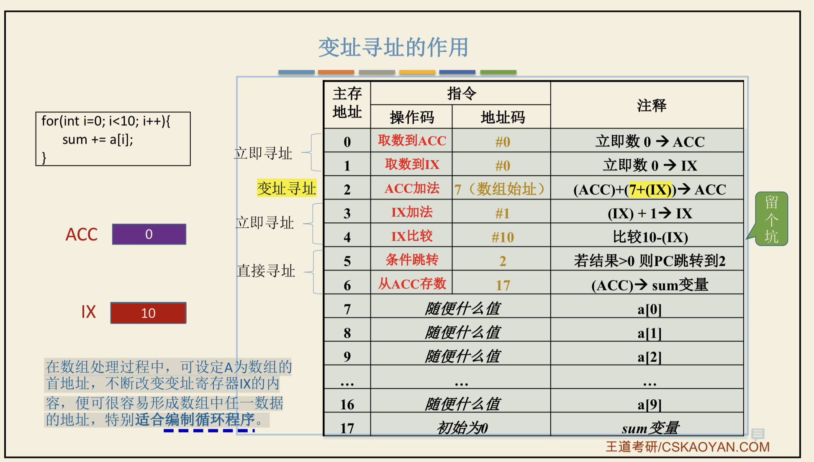

# learn Computer Organization

---

[toc]


---

这部分最好的书我个人认为就是：《[Code](https://book.douban.com/subject/1494026/)》（中文译文《[编码的奥秘](https://book.douban.com/subject/1024570/)》）。但是了解现代CPU的一些机制和设计，就需要《[现代处理器设计](https://book.douban.com/subject/2185652/)》了。

## 写在前面

学习计算机的时候，我们常听到这样一句话：计算机分为硬件和软件，比如操作系统、c语言、python是软件，**我们看得见摸得着的这些实体是硬件。**

这其实有些像人类，思想（软件）给人的感觉是看不见摸不着的，而身体（硬件）是看得见摸得着呢东西。两者都很重要，这也就催生出了唯物和唯心两种世界观。我应该是个不折不扣的唯物主义者，也就是认为“思想”也需要“寄托”在身体的具体组成部分，进一步讲，千变万化的思想本质上就是身体某些部分的不同状态的组合，而近代医学已经将其锁定在脑这一部位，虽然其机制还需进一步研究。


但我想说的是，计算机很像人类，我们也常说，硬件就是看得见摸得着的部分，而软件好像看不见，然而这是完全错误的。比如一部手机开机运行的过程中，教材常讲到：软件（系统）被CPU从硬盘加载到内存，再被一步步的执行。那这个软件它属于物质吗？能看得见摸得着吗？

当然能！其实硬件和软件就像是很多被人类分类的概念一样，它们本没有这个所谓的区分。一部手机的开机过程，就是我们的手指驱动了开机按钮，从而导致电路闭合，触发了一系列人为事先设定好的连锁反应。所谓软件加载这个看似看不见的事情，其实在微观上是完全可以被观测的，而所谓操作系统这个软件，就是人类按照其特有的方式改变了硬盘这个硬件的许多微观状态。而这就是能正好触发上述连锁反应最终让我们看到手机开机的原因。

当然我们可以精确的定义软件———这种设计模式而不是具体实施的物理过程称为软件。比如我规定某个字的发音，称为软件，但并不是指我或者任何一个人喉咙声带振动的物理现象。不过也不难发现，没有后者的物理过程和现象，人类是无法“想出”这些设计模式的，当然也无法实施这些设计模式。


所谓软件、思想这种概念，只是人类便于自己交流，用特殊的物理现象（写字、说话等都是物理过程）“描述”（其实是一系列的连锁反应）另一些物理现象（比如手机开机）。反过来则不成立（比如我思故我在，那我取下来某个人的脑子，他就无法做出这些思考，思考是特殊的物理现象，物理现象并不是特殊的思考），所以世界是唯物的。

若计算机芯片内这些微观的物理状态出现了人类目前无法预测和干预的相互作用，计算机的“软件”和人类的“思想”的相似度可能就进一步缩小了，直到它们可以和人类“平起平坐”，当然这只是个想象，虽然想象也是我脑部神经电信号又引起的一系列物理化学反应罢了。


## 数据表示运算

组成原理不同与操作系统的是，这主要是以硬件为主，可以理解为，操作系统是Apple、MicroSoft干的事儿；组成原理是Intel、AMD干的事儿。

计算机硬件就是从最简单的加减法（与或非）开始的，所以要理解硬件，肯定要先理解计算机是怎么做加减法的，有了加减法，就有了一切。

### 大小端 

内存中大多以一个字节（8bit，也就是8个二进制信息）为一个存储基本单位，而数据，哪怕很“基本”的数据类型都是多个字节，比如整数int一般使用32位，也就是4个字节，那从小到大存，还是从大到小存也是一个问题。

* 小端存储：先存低位字节，在我们看来就是古代的右往左念。
* 大端存储：当然就是与小端反着。

#### 为何有大、小端？

或者说：为什么不是大端（符合人类习惯）？

首先，计算机从一开始就不是符合人类习惯的，而是人类要“符合”计算机的“习惯”定义一些规则，让它能按照人类的意愿完成工作。所以，问题应该是：大小端对计算机计算有哪些好处/坏处？

> 引文节选自知乎回答：https://www.zhihu.com/question/25311159/answer/33589698
>
> 大小端问题主要涉及的是非单字节非字符串外的其余数据的表示和传递，如short型、int型等。大端和小端有其各自的优势。
>
> 计算机正常的内存增长方式是从低到高(当然栈不是)，取数据方式是从基址根据偏移找到他们的位置，从他们的存储方式可以看出：
>
> 大端存储因为第一个字节就是高位，从而很容易知道它是正数还是负数，对于一些数值判断会很迅速。
>
> 而小端存储，第一个字节是它的低位，符号位在最后一个字节，这样在做数值四则运算时从低位每次取出相应字节运算，最后直到高位，并且最终把符号位刷新，这样的运算方式会更高效。


## 存储器（RAM）


关于CPU取址有两个关键寄存器：

* MAR（Memory Address Register）

MAR的位数就反映了RAM的实际大小

* MDR（Memory Data Register）

MDR的位数就反映了存储字长（这是word，不同于字节Byte、位bit等）


**注意：这两个寄存器是在CPU中的，只是逻辑上服务于RAM，所以有时会在示意图的RAM中。**


### 存储单元硬件

可以按照下图简单理解，但实际的电路远比这复杂，具体可以参照[《编码的奥秘》](https://www.zhihu.com/question/59889145)


而8个上图中的存储元并联就形成了一个存储单元，通常来说是一字节（8bit），如下图所示：


进一步的，我们就可以把RAM抽象下图这样一个存储芯片：实际上，一个RAM的引脚要比这多很多，比如供电引脚、接地引脚等。


### SRAM和DRAM的区别


#### DRAM的刷新


### ROM（Read-Only Memory）


### 译码片选法

当我们假设我们有8个8KB（存储字长是一字节/8位）的存储芯片，这样我们就有了8*8K = 2^16个地址，所以地址线宽度应该是16位，那这16位地址如何准确寻址到这8个存储芯片中的一个中的一个字节呢？

这就需要地址线低13位作为片内寻址、高3位作为片选信号，也就是8个存储芯片选一个可以用这高三位地址唯一表示，但如何实现呢？这就是译码器的作用了，具体看下图：


关于实际的译码器比上述概念图复杂得多，比如它使用一个控制信号来保证信号的稳定性，如下图：


### 双口RAM & 多模块存储器


#### 交叉编址

本质上也就是上节讲的译码器的问题，但现在结合存储芯片需要一定的恢复时间才能再次读写这个问题，我们会发现，将低位地址作为片选信号时，连续读写临近地址时，效率更高。具体见下图：


上图很容易计算出：若模块数位m时，m = T/r，效率最高。因为连续读m个r之后，T就到了也就是第一个存储体恢复好了；若m > T/r，第一个存储体恢复好了还要闲置r时间；若m < T/r，连续读m个r之后，第一个还没恢复好。

**而这种“低位交叉”的技术就是传说中的双通道，所以并不是并行访问两片内存，其实还是串行，不过流水线的方式避开了存储芯片刷新恢复的时间。**


## cache


### 关于cache line 大小


**上图中有一点有错误：cache“行”（cache line）和内存页面（Memory page）大小不一样**。

> 一般来说（对于2020年前后的64位主流CPU来讲），cache line大小在64bytes，也就是64B，而Memory page size 是4KB，差距还是蛮大的，而不是上图中所说的一样大。
>
> 上述[数据参考](https://www.aristeia.com/TalkNotes/ACCU2011_CPUCaches.pdf)见下图，更详细的讨论见[stackoverflow](https://stackoverflow.com/questions/14707803/line-size-of-l1-and-l2-caches)、[sciencedirect相关论文](https://www.sciencedirect.com/topics/computer-science/cache-line-size)。结果不一，但都和64bytes在一个数量级，并不是内存页大小的量级（一般在4KB）。
> 


#### [ ARM A77 core Instructure](https://en.wikichip.org/wiki/arm_holdings/microarchitectures/cortex-a77)

这是ARM A77架构图，我们也可以看到，L1cache 只有64KB。


号外号外！2022王道强化班课程，终于改了这个问题，而且把这个过程梳理得很清楚了（显然参考了2018年408真题等资料）。页表与cache的拆分完全是独立的过程。而一般cache line大小是64B！看咸鱼做的这个ppt：


当然上图是一个全相联的cache，简单一些，但是也能看到内存一页4KB（12bit地址）、cache line一块64B（6bit地址），而且这个没有必然联系。


#### 408真题看cache结构与访存过程


1. 上图左上部分：CPU拿到一个虚拟地址去访存，首先访问TLB看看页表是否缓存在TLB，问题来了：只有TLB未命中时，才会访问页表基址寄存器PDBR，去内存找页表，PDBR的地址会在进程切换后修改为当前进程的页表存放的内存地址。这意味着，TLB只有当前进程页表的缓存？所以不需要这个PDBR？
2. 上图左下部分：若TLB未命中，则访问PDBR寄存器，与虚拟页号相加，得到内存中页表项的物理地址，访存得到物理页号，再与页内地址想加得到物理地址。
3. 上图右上部分：拿到物理地址后，检查cache是否命中，这时候需要将物理地址中间p位（图中是3），定位cache分组，将物理地址前x位（p、x的值下文“cache总容量”会解释），匹配cache组各个cache line的Tag位，匹配成功则命中，失败则访存。
4. 上图右上部分的数据为何与地址最后5位直接相连，什么意思？见下图：


#### Cache 总容量：

> 
>
> **一**：1位**有效位**：是为了防止开始cache并没有数据，误认为这个“内存的cache line号”（内存块号）是0号。也就是说明cache中是否有数据。
>
> 
>
> **二**：**Tag位。** **物理地址位数- (cache line数据大小的“字节”数 + cache组位数)** ：作为标记在cache中的数据在内存的位置。
>
> 减cache line数据大小对应的字节（若按字节编址）个数，因为这些数据都在同一个cache line中；
>
> 减组位数，即**log2(组相联的组数)、log2(直接相联的cache line个数)**。就是因为它们是对应好的确定的位置，所以不需要显式保存。
>
> 
>
> **三**：**LRU位。**若为组相联LRU替换算法，则需要“log2^路数”位，来标记未被访问次数。**（直接相联不需要这部分）**
>
> 
>
> **四：脏位。**若采用写回法 ，则还需1位“**脏位**”来标记cache是否被修改。
>
> 
>
> **五：数据。**也就是一个cache line数据大小（这个所谓的大小，一般指的就是cache line数据打下，只是我们这里计算的是真实物理的cache包含信息位的大小）对应的位数。（注意与二中cache line数据大小对应的“字节”个数，其实这还需要内存按字节编址，二中是说地址的问题，而现在在说数据大小的问题）
>
> 比如按字节编址，cache line64B（这个大小指的是cache line能存放多少数据），则二中要减去的这一部分位为6位；而数据是64*8位。
>
> 
>
> **六：**前五步算的cache line容量乘以cache line数。其中，**cache line数 = cache组数*路数。**


#### TLB“单元”、cache line、页表项的区别与联系

同样参考上图：

1. TLB可以看作只读的cache，所以**没有③脏位**；TLB同样有①Tag、②有效位、④替换信息；⑤TLB数据部分即物理页框号。
2. 页表项顺序存放，所以**没有①Tag位。只读所以没有③脏位**，也不会有组号。多级页表项会有②有效位④替换信息⑤页表项数据部分同TLB，为物理页框号。

 


> #### 硬盘块大小------一般与页面一致为4KB
>
> 


### 再聊局部性原理

下图中二维数组的存放与循环访问的问题是非常经典的，按行或列循环是截然不同的。


### cache和RAM的映射关系


#### 直接映射


#### 全相联映射


### cache 替换算法


#### LRU（Least Recently Used）

它是效率最高的，也只需要log2N（N为cache line 总数）位的额外硬件。


### cache 写策略


**写命中时**：

* **直写（Write-through）**：修改当前cache的同时，也修改下一级存储器中的内容。

* **写回（Write-back）**：仅修改当前命中cache（或RAM）的内容，下一级的修改在被换出当前级cache（或RAM）后


低级的存储器（如3级cache、内存RAM、硬盘等）采用写回没毛病：首先他们有些大量的空间，需要被替换出的概率低一些；另外，若都用直写，那cache就没有存在的意义了，因为改一个数据，还要一路改到硬盘。


《深入理解计算机系统》表示（见下引文）：CPU cache之间是直写多一些（有专门的写缓冲），而比如3级cache与RAM、RAM与硬盘是写回多一些。但是据我了解，现代CPU的cache之前也是写回多一些，这样能大量降低低一级的存储器访问压力。


> 6.4.7 Performance Impact of Cache Parameters
>
> Write-through caches are simpler to implement and can use a write buffer that works independently of the cache to update memory. Furthermore, read misses are less expensive because they do not trigger a memory write. On the other hand, write-back caches result in fewer transfers, which allows more bandwidth to memory for I/O devices that perform DMA. Further, reducing the number of transfers becomes increasingly important as we move down the hierarchy and the transfer times increase. In general, **caches further down the hierarchy are more likely to use write-back than write-through.**


## 指令系统


#### 指令和数据如何区分？

1. 比如1级cache分为指令和数据，那这个指令，是指令系统中讲的（一个指令包含操作码和操作数/地址码），还是指令就指的狭义的操作码？
2. 比如讲内存分段时，代码区、数据区，这个所谓的数据区，指的是什么？和上述1级cache的数据cache是一回事吗？

“狭义”的指令是不对的，**一个指令就是包含操作码、操作数。而数据就是数据**，见下图：



一般来说，计算机寄存器宽度是一定的，所以指令一般存放不下数据，是由一些立即数指令，但这也是指令，而数据单独存放的数据。

那问题又来了：**计算机如何区分指令和数据？是编译器编译的时候虚拟地址空间就划分好了吗？我猜是这样的。（注意这个编译器的划分与内存分段是不一样的，这个只需要进程自己“知道”即可，而分段需要操作系统与硬件支持。）**


### 指令结构


### 寻址


* **找下一条指令的地址———指令寻址**

* **找指令中操作数的地址——数据寻址**


#### 指令寻址

最简单的情况必定是“**PC（程序计数器）+1**”（这个1指的是一个指令长度，大多时候不是字节，而是一个字）。

* 在前面内容中我们也知道，我们的指令总长一般是固定长度的，但是被分为不同长度的操作码和操作数，所以这种情况一般是**PC+1**。

* 还有就是**JMP**指令，它会更新PC的值，从而使指令跳转。（这与相对寻址有何区别，是有无条件的区别吗？本质都是跳转指令吧。）


#### 数据寻址


##### 变址寻址

变址寻址为了在汇编层面更好的实现循环，如下图： 


#### 复合寻址

实际上，一个程序首先会使用基址寻址（其实还有虚拟地址的问题，也就是还要经过页表的转换，但如果“没有操作系统”，编译器一般还是会将程序按照基址寻址的方式编译？）。

在此基础上，为了更好的实现循环，使用变址寻址；为了更好的函数跳转，使用间接寻址(还是相对寻址？)而且在现代操作系统中，真是地址还要经过页表转换，是个非常复杂的过程。


**具体应用哪种方式、使用哪个寄存器来实现高级语言的语句，这不是操作系统做的事情，其实是编译器要做的事情。**

而硬件**（CPU有多少个寄存器、是否添加某个专用寄存器，这也要和编译器团队（往往就是C/C++编译器）协同的，而具体怎么权衡，《计算机体系结构-量化研究方法》一书中有提到）**也是随着历史的演变更迭的。


### 基址寻址和分页（虚拟内存）？

> 作者：invalid s
> 链接：https://www.zhihu.com/question/436174981/answer/1648526266
> 来源：知乎
> 著作权归作者所有。商业转载请联系作者获得授权，非商业转载请注明出处。
>
> 
>
> 第二大类是虚地址模式下跑的各种应用，也就是第三种情况。
>
> 这个模式下，OS一般会事先做一个约定，比如内存前1G（或更大空间）属于OS，其它空间属于应用。真正运行时，通过虚拟地址映射机制，OS内容就被映射到了约定好的空间、而用户应用则从约定好的起始点开始顺序加载（实践中也可能故意在每次加载时都偏移一个随机值，这样万一有缓冲区溢出之类漏洞，黑客们想完成攻击就没那么容易了。毕竟重定位是个早已被解决的问题，不用白不用）。
>
> 借助虚拟地址机制，每个应用都会“觉得”自己独占了全部内存空间，并不能意识到其它应用的存在。
>
> 所谓虚拟地址机制，说白了和实模式下的“基址相对寻址”是一个原理；只是现在负责内存映射的寄存器对应用来说不再可见了而已——实模式下，应用知道自己被加载到了201K开始处，因此当它要访问内存地址1235时，实际访问的是201K+1235处，所有一切它都知道的清清楚楚；而虚模式下，应用以为自己就是从0开始加载的，访问1235就是1235，并不知道实际上OS“偷偷”替它加了个偏移值、使它访问到了正确的地方（这个偏移值被OS自动维护在“页表”里，每个进程都有独属于自己的一套单独的页表；当这仍然是个简化的、原理性的说法，实际上还有页式管理、段页式管理等不同分类，而且不同的CPU支持的管理方案也有所不同）。


#### 函数跳转是怎么回事？


> 原文链接：https://blog.csdn.net/weixin_41028621/article/details/87830267
>
> 分析函数跳转地址如何计算以及函数返回地址如何保存？
>
> ### 一.函数跳转地址
>
> 1.参考代码如下：
>
> ```c
> #include <stdio.h>
> 
> int add(int x,int y){
>     int sum;
>     sum = x + y;
>     return sum;
> }
> 
> int main(int argc, char *argv[]){
>     int i;
>     
> 	i = add(2,3);
>     printf("i=%d\n",i);
>     return 0;
> }  
> ```
>
> 编译并且反汇编：
>
> ```bash
> gcc -m32 -g -o add add.c
> objdump -d -M intel add > add.txt
> ```
>
>
> 2.查看add.txt main函数反汇编代码：
>
> 161 08048433 <main>:
> 162  8048433:   55                      push   ebp
> 163  8048434:   89 e5                   mov    ebp,esp
> 164  8048436:   83 e4 f0                and    esp,0xfffffff0
> 165  8048439:   83 ec 20                sub    esp,0x20
> 166  804843c:   c7 44 24 04 02 00 00    mov    DWORD PTR [esp+0x4],0x3
> 167  8048443:   00
> 168  8048444:   c7 04 24 01 00 00 00    mov    DWORD PTR [esp],0x2
> 169  804844b:   e8 cd ff ff ff          call   804841d <add>
> 170  8048450:   89 44 24 1c             mov    DWORD PTR [esp+0x1c],eax
>
> 
>
> 如上所示，第169行 call 804841d ，执行call命令，跳转到add函数。即如下所示：
>
> 149  0804841d <add>:
> 150  804841d:   55                      push   ebp                                                                              
> 151  804841e:   89 e5                   mov    ebp,esp
> 152  8048420:   83 ec 10                sub    esp,0x10
> 153  8048423:   8b 45 0c                mov    eax,DWORD PTR [ebp+0xc]
> 154  8048426:   8b 55 08                mov    edx,DWORD PTR [ebp+0x8]
> 155  8048429:   01 d0                   add    eax,edx
> 156  804842b:   89 45 fc                mov    DWORD PTR [ebp-0x4],eax
> 157  804842e:   8b 45 fc                mov    eax,DWORD PTR [ebp-0x4]
> 158  8048431:   c9                      leave
> 159  8048432:   c3                      ret
>
> 
>
> 问题：跳转地址804841d是如何来的？
>   首先从机器码804844b: e8 cd ff ff ff 入手，其中e8代表call指令，那cd ff ff ff 是否代表跳转地址呢？ 要跳转的地址是0x804841d，而机器码后四字节是 cd ff ff ff。由于Intel 架构是采用小端寻址，所以内存中cd ff ff ff代表的值是0xffffffcd，该值似乎和跳转地址没有关系？
>   结合生活，如果要寻找一个地方，一是通过经纬度定位出绝对地址，一是“从这里左拐，然后右拐，再左拐…”，通过以指路人位置作为坐标进行相对偏移。同理，计算机寻址也有两种方式，绝对寻址和相对寻址。那猜测call指令后的地址是不是偏移量呢？
>   首先解释一下偏移量，由于跳转可以向前和向后，所以偏移量是区分正负的。偏移量0xffffffcd是负整数，由于计算机负整数是通过补码来表示，所以求其正整数就是求反加一，转化后为：0x33。
>
> 804844b: e8 cd ff ff ff call 804841d 
> call指令的地址0x804844b - 0x33 = 0x8048418
>   通过对比 0x804841d 和0x8048418，两个数已经很接近，差值为5。而call指令有5个字节，是不是很巧合！
>
> call 指令的偏移量地址：
>
> x86系列cpu的call指令的寻址方式：
>   用与call指令相关的偏移量定位跳转到的地址。
> 偏移量计算：
>   偏移量=跳转到的地址 - call指令后一条指令长度的起始地址。
> 如上所示，进行验证：0x804841d - 0x8048450 = - 0x33，与上面计算吻合。
>
> 
>
> ### 二.函数返回地址
>
> 函数调用之后会返回，那返回地址如何得到？
>
> 以add函数为例接着进行分析：
> 在add函数设置断点，执行F11后，查看变化的寄存器有两个：
>
> EIP：保存call跳转到的指令的地址0x804841d；
> ESP: 该值或者是返回地址，或者是存放返回地址内存的地址。
>
>   gdb查看该地址，如下所示：0x08048450正好是call指令的返回地址。通过以上分析可知，call指令将返回地址保存在内存中，而且esp寄存器指向了该内存。（ESP保存栈顶内存地址）
> 170 8048450: 89 44 24 1c mov DWORD PTR [esp+0x1c],eax
>
> 
>
> 小结：
> **call指令等同于：**
> **push 返回地址**
> **jmp 函数入口地址**
> 其中返回地址保存在栈上，函数返回时用到。
>
> 
>
> ### 三.函数传递参数
>
>   函数需要传递参数，哪参数是如何进行传递的呢？
>   i = add(2,3);反汇编代码如下：
>
> 161 08048433 <main>:
> 166  804843c:   c7 44 24 04 02 00 00    mov    DWORD PTR [esp+0x4],0x3                                                    
> 167  8048443:   00 
> 168  8048444:   c7 04 24 01 00 00 00    mov    DWORD PTR [esp],0x2
> 169  804844b:   e8 cd ff ff ff          call   804841d <add>
>
>   如上所示，参数1和2是通过栈来进行传递的。首先将参数2入栈，然后是参数1入栈，即c语言参数传递是从右往左压栈传递参数。
>   执行入栈指令之前，查看esp寄存器的内容如上所示，然后执行si命令，将参数3入栈，同理参数2。
>
> 
>
> ### 四.函数获取参数
>
>   参数入栈进行保存，当调用函数时，参数是如何传递函数的？
>   如下图所示，参数3和2是连续存放的，只要获取一个基点，就能通过偏移量计算出3和2存储的地址。而获取基点的地址可以通过寄存器来实现，而esp随着栈的变化而变化，所以利用另一个寄存器来实现即ebp。
>
>   如下所示，在函数调用过程中，首先执行
>
> push ebp;
> mov ebp,esp;
> 即保存ebp的值，然后esp的值赋值给ebp。
> 最后执行leave，进行反向操作，进行还原。
>
>   第153-155行进行加法计算，通过ebp+0xc和ebp+0x8进行寻址参数3和2；执行完加法之后，eax将5保存到地址ebp-0x4，如下所示：
>
> 149 0804841d <add>:
> 150  804841d:   55                      push   ebp                                                                              
> 151  804841e:   89 e5                   mov    ebp,esp
> 152  8048420:   83 ec 10                sub    esp,0x10
> 153  8048423:   8b 45 0c                mov    eax,DWORD PTR [ebp+0xc]
> 154  8048426:   8b 55 08                mov    edx,DWORD PTR [ebp+0x8]
> 155  8048429:   01 d0                   add    eax,edx
> 156  804842b:   89 45 fc                mov    DWORD PTR [ebp-0x4],eax
> 157  804842e:   8b 45 fc                mov    eax,DWORD PTR [ebp-0x4]
> 158  8048431:   c9                      leave  
> 159  8048432:   c3                      ret   
>
> 
>
> 执行gdb调试，进行查看：
>
> (gdb) x/10x $ebp+0xc
> 0xffffcf74:     0x00000003      0xffffd03c      0xf7e3c4ad      0xf7fb63c4
> 0xffffcf84:     0xf7ffd000      0x0804847b      0xf7fb6000      0x08048470
> 0xffffcf94:     0x00000000      0x00000000
>
> (gdb) x/10x $ebp+0x8
> 0xffffcf70:     0x00000002      0x00000003      0xffffd03c      0xf7e3c4ad
> 0xffffcf80:     0xf7fb63c4      0xf7ffd000      0x0804847b      0xf7fb6000
> 0xffffcf90:     0x08048470      0x00000000
>
> (gdb) x/10x $ebp-0x4
> 0xffffcf64:     0x00000005      0xffffcf98      0x08048450      0x00000002
> 0xffffcf74:     0x00000003      0xffffd03c      0xf7e3c4ad      0xf7fb63c4
> 0xffffcf84:     0xf7ffd000      0x0804847b
>
> 
>
> 小结：
>   在使用ebp寻址的函数中，ebp+偏移量就是参数地址；ebp-偏移量就是局部变量的地址。
>
> 五.函数返回值
>   函数返回值是通过寄存器进行返回的。编译器使用eax作为存储返回值的寄存器，被调用方在ret前设置eax，返回后，调用方从eax获取到该值。
>
> 被调用方反汇编代码如下：
> 3: int add(int x, int y) {
> 00DB17F0 55                   push        ebp  
> 00DB17F1 8B EC                mov         ebp,esp  
> 00DB17F3 81 EC CC 00 00 00    sub         esp,0CCh 
> ...
> 6: 	return sum;
> 00DB1821 8B 45 F8             mov         eax,dword ptr [sum]
> ...
> 00DB1837 C3                   ret 
>
> 
>
> 调用方反汇编代码如下：
> //汇编代码来自visual studio:
> 13: 	i = add(2, 3);
> 000518D8 6A 02                push        3
> 000518DA 6A 01                push        2  
> 000518DC E8 A3 FA FF FF       call        _add (051384h)  
> 000518E1 83 C4 08             add         esp,8  
> 000518E4 89 45 F8             mov         dword ptr [i],eax  
>
> 
>
> 如上所示，最后将eax的值赋值给变量i，经过验证等同于mov dword ptr [ebp-8],eax。
>
> 小结：
> 1.函数传参：通过栈或者寄存器传递；其中寄存器传递不需要寻址内存空间，直接操作寄存器速度更快，但寄存器数目有限，难以应对大量参数的传递。
> 2.参数传递方式：c语言是从右向左压栈。
> 3.清栈方式：
>
> 调用方清栈：c语言选择此方式，该方式的好处是可以执行变参功能，如printf函数；坏处是执行call返回后，需要执行add esp x命令，增加了空间。
> 被调方清栈：执行ret x 命令，不增加空间，但没有变参功能。
> 4.函数指针不能进行强制类型转换，否则会出现错误。


### [CISC & RISC](https://www.zhihu.com/question/325968121)

下表中很多内容并不严谨，也不现实，但大体还是说明了不同指令集之间的区别。

> 比如指令数目肯定有实效性。比如现代x86处理器吸收了很多ARM的优势，比如
>
> **能效比的问题**：其实这两种指令集并不意味着能效比有很大差距，主要还是x86架构在高频这条道路上愈走愈远，相对不舍得投入硬件成本（设计成本比如大小核、制造成本比如单核晶体管数量），有人可能会说ARM大小核等很多设计是因为它为了控制功耗，这样必然牺牲了性能。
>
> 但是我想说的是，功耗比提升了，一定程度上必然是提升了性能（规模大了性能就提升了）。另外Apple Silicon 就是个很好的例子（当然，这肯定也与Apple在编译器、操作系统方面极高的造诣有关）。


## 中央处理器


### 周期？周期？还TMD是周期！

目前各种教材对周期的划分各种**前后矛盾**。（这部分是[我的一个知乎回答](https://www.zhihu.com/question/53670481/answer/2116459568)的初稿。）


下图表示，一个**指令（指令周期）**，划分为几个**机器周期/CPU周期（如取指周期、执行周期等）**，同时一个机器周期有多个 **节拍/CPU时钟周期**。而**一个微指令就是指一个 节拍/CPU时钟周期 干的事情**（由于一个微操作/微命令 的执行时间也是一个时钟周期，但由于使用硬件不冲突，可以同时不同地的执行）。


下图同样表示，一个指令周期，可以分为几个机器周期，代指一个指令执行过程中“不同的阶段”。**（注意这分为定长和不定长，这很关键，下文会讲）**


下图是流水线的示意图：这表示，流水线是以上文的“机器周期”为单位的，而上文还表示，一个机器周期包含多个时钟周期的。也就意味着，流水线划分的这个“阶段”，就是“机器周期”。


截止现在，说的都还算符合逻辑，我们来捋一捋这个思路：

执行一个指令，总要分为**最最最小的操作，这叫微操作**，这个时间是时钟周期（其实可能有的微操作快于时钟周期，但是快的就等着）；不同的微操作可能**用到完全不同的硬件，若其逻辑上也不冲突**，就可以并行（注意虽同时，但“不同地”），那么**一个时钟周期所完成的工作，总需要个名字，叫微指令**。

> 其实这个依然有些问题，因为RISC（如ARM）处理器的设计初衷才是微指令才是在一个周期内完成的，而CISC（如X86）要复杂的多，那就默认是RICS）。

当多个指令顺序执行时，之前那些划分的微指令，由于不同指令之间不存在逻辑冲突（其实有时存在，相互依赖等问题，这时候流水线就白算了，但这是后话，先假设不同指令是相互独立的），所以可以采用工业上流水线的方式。而问题就来了，流水线的划分，是用微指令划分（也就是流水线的时间单位也是时钟周期）呢？ 还是用什么划分？

有人将**流水线的各“步骤”定义为「机器周期」**。对，这就是机器周期的由来！否则，如果仅仅将指令执行分为不同的阶段，当然是不等长的，而为何还要强调机器周期分为「定长」和「变长」一说？正是最初的流水线为了避免太过复杂，就把流水线的各步骤长度定为一致。才有了所谓定长机器周期的概念，也就是对应定长流水线。


至于为啥不用刚刚「微指令」来定义流水线的“步骤”长度？还正好是一个时钟周期？嗯。好问题！因为微指令来并行，会有很多问题，最大的问题就是我们按照一个指令划分的微指令，这也意味着，对于一条指令，在不同的微指令执行阶段，它可能会访问同一个硬件（寄存器或者cache/MAR等）如下图所示：


但是。问题来了，下图是Wikipedia的流水线示意图：注意看图中最上面一行，这是时钟周期。

左侧的Pipeline还写着取址（Fetch）、执行（Execute），省的人不知道他又同时在说，这是机器周期。。。

就算取址可以在一个时钟周期内完成，难道执行一条指令（注意不是微指令，因为微指令不存在write-back等这些概念），就能在一个时钟周期内完成？？？这简直就是胡扯！


再看下图中这两道408真题：与上图Wikipedia一致，还不如Wiki说的清楚：什么叫「功能段」？最终居然还问：**「时钟周期」「至少」**是多少？离谱的是间隔多年后（18年）又出了一遍。且在18年将离谱的ns量级的时间，改为了ps，哎，问题是在这里吗？


来看个更「靠谱」点的书：《[现代处理器设计](https://book.douban.com/subject/2185652/)》，就摘出来两个图，来简单分析下，主要是找到流水线与机器周期、微指令（时钟周期）的关系。

* 一个是将经典的（目前大量国内《计组》教材划分的机器周期，如取址、执行、写会等4-5步）4阶段流水线，“变”为11阶段流水线的过程。见Fig2.8。
* 另一个就是进一步具体化为12阶段流水线（这次每个阶段都有非常具体的工作，见Fig2.9）。


> For example, assume that the total latency for the five generic subcomputations is 280 ns
> and **that the resultant machine cycle times for the 4-stage design of Figure 2.8(a) and the 11 stage design of Figure 2.8(b) are 80 and 30 ns**, respectively. Consequently, the total latency for the 4-stage pipeline is 320 ns (80 ns × 4) and the total latency for the 11-stage pipeline is 330 ns (30 ns × 11). The difference between the new total latency and the original total latency of 280 ns represents the internal fragmentation. Hence, the internal fragmentation for the 4-stage design is 40 ns (320 ns - 280 ns), and the internal fragmentation for the 11-stage design is 50 ns (330 ns - 280 ns). It can be concluded that the 4-stage design is more efficient than the 11-stage design in terms of incurring less overhead due to internal fragmentation. Of course, the 11-stage design yields a throughput that is 9.3 (280 ns/ 30 ns) times that of a non-pipelined design, while the 4-stage design's throughput is only 3.5 (280 ns / 80 ns) times that of a nonpipelined design. As can be seen in both designs, the internal fragmentation has hindered the attainment of the idealized throughput increase by factors of 11 and 4 for the 11-stage and the 4-stage pipelines, respectively.
>
> 翻译一下：
>
> 例如，假设5个基本运算分量总的延迟为280 ns。 **图2.8（a）中的4级流水线设计和图2.8（b）中的11级流水线设计的「机器周期」分別是 80 ns和30 ns。**相应地，4级流水线总延迟为320 ns（80 nsx 4）、11级流水线总的延迟为330 ns （30 ns x 11），而最初的总延迟为 280 ns。
>
> 这之间的差距就是因为存在内部碎片，因此，4级流水线的内部碎片是40 ns ( 320 ns~280 ns). 11级流水线的内部碎片是50ns（330ns~280 ns)：可以认为4级流水线的效率要比11级流水线的效率更高。因为前者的内部碎片带来的开销小一些。当然，11级流水线的吞吐率是非流水设计9.3（280ns/30ns）倍，而4级流水线的吞吐率是非流水设计的 3.5倍（280 ns/80 ns)。
>
> 从这两个设汁中都可以看出，由于内部碎片的存在，使得11级流水线和4级流水线在性能的提高上都达不到理想情况下的11倍和4倍。

上段引文中


> To accommodate slow instruction memory, the IF generic subcomputation is subdivided and mapped to two pipeline stages, namely, the IF1 and IF2 stages. Instruction fetch is initiated in IF1 and completes in IF2. **Even though instruction fetch takes two machine cycles**, it is pipelined; that is, while the first instruction is completing the fetching in IF2, the second instruction can begin fetching in IF1. This means that the instruction memory **must be able to support two concurrent accesses, by IF1 and IF2 pipeline stages, in every machine cycle**. 
>
> 翻译一下：
>
> 为了适应慢速的指令存储器、IF“部分”被进一步分割并细化成两个流水段——IFI 和IF2段。IFI 进行取指的初始化，IF2 完成取指。**虽然取指要使用两个「时钟周期」**，但由于实现了流水化，当第一条指令进入IF2中进行取指时，第二指令在IF1中初始化，这表明指令存储器**每个「时钟周期」必须能够同时支持两个请求**。分別IF1 和IF2。


在具体看下，12阶段的流水线，下图作的太棒了！信息量巨大。虽然此作者还是混淆了机器周期和时钟周期。


> MIPS processors normally employ separate instruction and data caches. In every machine cycle the R2000/R3000 pipeline must support the concurrent accesses of one I-cache read by the IF stage and one D-cache read (for a load instruction) or write (for a store instruction) by the MEM stage. Note that **with the split cache configuration, both the I-cache and the D-cache need not be multiported**. On the other hand, if both instructions and data are stored in the same cache, the unified cache will need to be dual-ported to support this pipeline. The register file must provide adequate ports to support two register reads by the RD stage and one register write by the WB stage in every machine cycle.
>
> 翻译一下：
>
> MIPS 处理器通常來用分离的指令和数据cache，每个时钟周期内，R2000/R3000流水线必须同咐支持一次l-cache读请求，一次D-cache 读请求（load 指令）或者写请求（store指令）。对l-cache 的访
> 问IF阶段完成，对D-cache的访问在 MEM 阶段完成。注意**由于采用了分离的cache 配置，I-cache 和 D-cache 都不需要多端口**，另一方面，如果指令和数据都存放在一个cache 里，就需要双端口来提供支持。寄存器文件每个时钟周期有两次读请求（RD段）和一次写请求（WB段），因此至少要有两个端口。

#### 现代CPU的流水线

上文还是聚焦于很初级的流水线，只是进行了一定程度上的细分，理清了机器指令、流水线、时钟周期等概念。并讲述了如何在硬件上提高并行度（如划分指令和数据cache，或者多端口访问硬件）。实际上一个现代处理器的流水线极为复杂。下面简单提一提：

1. 文中没有讲到的「数据/逻辑冲突」，也就是后面指令的计算 需要 前面指令的结果，这时候流水线进行就会出错，因为前面指令还没有写回，后面就要访问。当然这个也可以通过编译器优化（尽量把这种指令分开执行）；或者开「数据旁路」，就是不写回直接将结果送给流水线上的下一条指令。想想就复杂得很！
2. 「跳转预测」：因为判断语句大概率会进行指令跳转，导致接下来的流水线指令执行结果都作废，怎么提前预测？也是个大问题。
3. 「多发射」：也就是真正的同时并行，这要求每个微操作都是用多个相同的硬件（类似多核，但不是一个概念），比如一个CPU有8个加法器、8个解码器、8个累加器，啥都是8个，那么这个CPU在同一时刻、同一“地点”可以8条指令在运行（注意这还不考虑流水线）。见下图（2发射4级流水线）：


4. 「乱序执行」：ROB(ReOrder Buffer)追踪着流水线中正在执行的指令。 ROB使得在流水线中实际上乱序执行的指令在程序员看来是顺序的，即将乱序的指令结果“重排序”。 指令经过译码和重命名之后，就会被派遣到ROB中，并进入发射队列，并被标记为“正在执行中”。 指令执行完毕后，ROB会被通知并将该指令的状态标记为“执行完毕”。 当ROB的头部指令执行完毕时，该指令会被提交(Commit)，这条指令的结果在外部将可以被“观测”到。 如果位于ROB头部的指令发生了异常，流水线将会清空，位于异常指令后面的指令都将不会被提交，同时ROB会将PC定向到异常处理函数。


下图是几种芯片的架构示意图，他们的共同点大于差异，都是多发射、超标量、分支预测的处理器。


具体一些，AppleM1的 “预测架构图”如下：


>  8宽度解码＋超大重排缓冲区＋超多LD/ST单元(AMDzen3的ipc提升一大部分也是靠这个)＋超多执
> 行单元。基本上规格上是秒杀目前intel/amd的存在(ld/st可能不及zen3但是zen3有smt)。
> 然后实际性能提升归功于加大的tlb和ld/st， 这个是以前arm最大的弱项。从实測表现来看基本上
> 现在在内存延迟敏感的spec2006子项下，表现甚至已经超过了intel/amd.


### 指令执行过程


中断


### 数据通路的结构


#### 以内部单总线为例（大题考点）


注意的是，MDRin指的是MDR在CPU内部总线的输入信号，并不是内存到MDR的输入信号，所以下图中3部分的一句是错的。


#### 专用数据通路方式


### 控制器设计


#### 硬布线控制器

微指令才是机器执行的最小指令单位


分析每个阶段的微操作序列：


#### 微程序控制器


### 指令流水线


>https://blog.eastonman.com/blog/2021/05/modern-processor/
>
>
>
>超到一半人类感谢你（5GHz）的Intel i9-9900K居然被M1吊打？
>
>是的，你没有看错，这就说明显然除了主频以外还有一些什么东西，那就是——
>
>## 流水线和指令级并行
>
>指令在处理器中是一个接一个的执行的，对吗？不完全对。这样的说法可能是直观的，但是并不是事实，实际上，从80年代开始，CPU就不再是完全顺序执行每个指令了。现代处理器可以同时执行不同指令的不同阶段，甚至有的处理器也可以完全同时地执行多个指令。
>
>让我们来看一看一个简单的四级流水线是怎么构成的。指令被分成四个部分：**取指、译码、执行和写回**。
>
>如果CPU完全顺序执行，那么每条指令需要花费4个周期才能执行完毕，IPC=0.25（Instruction per cycle）。当然，古老一点的时期更喜欢使用CPI，因为当时的处理器普遍不能做到每周期执行一条指令。但是现在时代变了，你能接触到的任何一个桌面级处理器都可以在一个周期内执行一条、两条甚至是三条指令。
>
>顺序执行的处理器
>
>正如你所看到的，实际上CPU内负责运算的组件（ALU）十分的悠闲，甚至只有25%的时间在干活。什么？怎么压榨ALU？我看你很有资本家的天赋嘛…
>
>好吧，现代处理器确实有手段压榨这些ALU（对，现代处理器也不止一个ALU）。一个很符合直觉的想法就是既然大部分的阶段CPU都不是完全占用的，那么将这些阶段重叠起来就好了。确实，现代处理器就是这么干的。
>
>流水线执行的处理器
>
>现在我们的处理器大多数时候一个周期可以执行一条指令了，看起来不错！这已经是在没有增加主频的情况下达到四倍的加速了。
>
>从硬件的角度来看，每级流水线都是由该级的逻辑模块构成的，CPU时钟就像一个水泵，每次把信号（或者也可以说是数据）从一级泵到下一级，就像这样：
>
>流水线微架构
>
>事实上，现代处理器除了以上这样简单的结构，首先还有很多额外的ALU，比如整数乘法、加法、位运算、浮点数的各种运算等等，几乎每种常用的运算都有至少一个ALU。其次，如果前一条指令的结果就是下一条指令的操作数，那么为什么还要把数据写回寄存器呢？因此就出现了Bypass（前递）通路，用于在这种情况下直接将数据重新送到运算器的输入端口。综合起来，详细一点的流水线微架构应该长这样：
>
>详细的流水线微架构
>
>## 更深的流水线——超级流水线！
>
>自从CPU主频由于某种原因很多年没有大的进步以来（对的，超频榜第一还是AMD的推土机架构CPU），流水线的设计几乎成为了CPU厂商的竞赛主场。加深的流水线首先可以继续增大实际的IPC（理论上限仍是1），其次可以避免流水线对时序的影响。这与晶体管的特性有关，感兴趣的读者可以上网搜一搜多级流水线结构为什么会影响时序和最终综合出的主频。
>
>在2000-2010年间，这种竞赛达到了最高峰，那时候的处理器甚至可以有高达31级的流水线。但是超深的流水线带来的是结构上的复杂和显著增大的动态调度模块设计难度，因此，从那以后就没有再出现过使用这么多级流水线的CPU了。作为对比，目前（2021年）的处理器多半视应用场景的不同采用10-20级不等的流水线。
>
>x86和其它CISC处理器通常有着更深的流水线，因为他们在取指和译码阶段有数倍的任务要做，所以通常使用更深的流水线来避免这一阶段带来的性能损耗。
>
>## 多发射——超标量处理器
>
>既然整数的运算器和浮点数的运算器以及其它的的一些ALU互相之间都是没有依赖的，自己做自己的事情，那为什么不进一步压榨它们，让他们尽可能地一起忙起来呢？这就出现了多发射和超标量处理器。多发射的意思是处理器每个周期可以“发射”多于一条的指令，比如浮点运算和整数运算的指令就可以同时执行且互不干扰。为了完成这一点，取指和译码阶段的逻辑必须加强，这就出现了一个叫做**调度器**或者**分发器**的结构，就像这样：
>
>超标量处理器微架构
>
>或者我们来看一张实际的Intel Skylake架构的调度器，图中红圈的就是负责每周期“发射”指令的调度器。
>
>Skylake 调度器
>
>当然，现在不同的运算有了不同的“数据通路”，经过的运算器也不同。因为不同的运算器内部可能也分不同的执行阶段，于是不同的指令也就有了不同的流水线深度：简单的指令执行得快一些，复杂的指令执行得慢一些，这样可以降低简单指令的**延迟**（我们很快就会涉及到）。某些指令（比如除法）可能相当耗时，可能需要数十个周期才能返回，因此在编译器设计中，这些因素就变得格外重要了。有兴趣的读者可以思考**梅森素数**在这里的妙用。
>
>超标量处理器中指令流可能是这个样子的：
>
>- 
>- 
>
>现代处理器一般都有相当多的发射端口，比如上面提到的Intel Skylake是八发射的结构，苹果的M1也是八发射的，ARM最新发布的N1则是16发射的处理器。
>
>## 显式并行——超长指令集
>
>当兼容性不成问题的时候（很不幸，很少有这种时候），我们可以设计一种指令集，显式地指出某些指令是可以被并行执行的，这样就可以避免在译码时进行繁复的依赖检验。这样理论上可以使处理器的硬件设计变得更加简单、小巧，也更容易取得更高的主频。
>
>这种类型的指令集中，“指令”实际上是“一组子指令”，这使得它们拥有非常多的指令，进而每个指令都很长，例如128bits，这就是**超长指令集（VLIW）**这个名字的来源。
>
>超长指令集处理器的指令流和超标量处理器的指令流十分的类似，只是省去了繁杂的取指和译码阶段，像这样：
>
>VLIW指令流
>
>除了硬件结构，超长指令集处理器和超标量处理器十分的相似，尤其是从编译器的角度来看（我们很快也会谈到）。
>
>但是，超长指令集处理器通常被设计成**不检查依赖**的，这就使得它们必须依赖编译器的魔法才能保证结果的正确，而且，如果发生了缓存缺失，那它们不得不整个处理器都停下来，而不是仅仅停止遇到缓存缺失问题的那一条指令。编译器会在指令之间插入“nops”（no operations）——即空指令，以保证有数据依赖的指令能够正确地执行。这无疑增加了编译器的设计难度和编译所需的时间，但是这同时节省了宝贵的处理器片上资源，通常也能有略好的性能。
>
>现在仍在生产的现代处理器中**并没有**采用VLIW指令集的处理器。Intel曾经大力推行过的IA-64架构就是一个超长指令集（VLIW）架构，由此设计的“Itanium”系列处理器在当时也被认为是x86的继承者，但是由于市场对这个新架构并不感冒，所以最终这个系列没有发展下去。现代硬件加速最火热的方向是GPU，其实GPU也可以看作是一种VLIW架构的的处理器，只不过它将VLIW架构更进一步，使用“核函数”代替指令，大大增加了这种体系结构的可扩展性，有兴趣的读者也可以了解相关方面的内容。
>
>## 数据依赖和延迟
>
>我们在流水线和多发射这条路上能走多远？既然多发射和多级流水线这么好，那为什么不做出50级流水线、30发射的处理器？我们来讨论以下两条指令：
>
>a = b * c;
>
>d = a + 1;
>
>第二条指令**依赖于**第一条指令——处理器在完成前一条指令之前无法执行下一条指令。这是一个很严重的问题，这样一来，多发射就没有用武之地了，因为无论你制造出了多少发射的处理器，这两条指令还是只能顺序地执行（除去取指等部分）。有关依赖和消除的问题我们会在后面讨论。
>
>如果第一条指令是一个简单的加法指令，那么加法器在执行完毕后可以通过Bypass通路（前递）将数据传回ALU的输入端口并继续计算，这样流水线才可以正常工作。但是很不幸，第一条指令是一个需要多周期才能完成的乘法（目前的大多数CPU没有使用单周期乘法，因为复杂的逻辑通常会损害主频），这样的话，处理器为了等待第一条指令完成就不得不往流水线中加入若干“气泡”也就是类似于“nops”的指令来保证运算的正确性。
>
>一条指令到达运算器的输入端口和执行结果可用之间需要耗费的CPU周期称为**指令的延迟**。流水线越深，指令的延迟就越高，所以更深的流水线如果无法有效地填满，那么结果只能是很高的指令延迟而无益于处理器的性能。
>
>从编译器的角度（考虑了Bypass，硬件工程师口中的延迟通常不包括Bypass），现代处理器的指令延迟通常是：整数乘加和位操作1周期，浮点数乘加2-6周期不等，sincos这种复杂指令10+周期，最后是可能长达30-50周期的除法。
>
>访存操作的延迟也是一个很麻烦的问题，因为它们通常是每条指令最开始执行的步骤，这使得它们造成的延迟很难用别的方式补偿。除此以外，他们的延迟也很难预测，因为延迟很大程度上取决于缓存是否命中，而缓存是动态调度的（我们很快也会讲到）。
>
>## 分支和分支预测
>
>另外一个流水线的重要问题就是分支，我们来看一看接下来的一段程序：
>
>if **(**a **>** 7**)** **{**
>
>​    b = c;
>
>**}** else **{**
>
>​    b = d;
>
>**}**
>
>编译成的汇编程序将会是这样：
>
>​    cmp a, 7    ; a > 7 ?
>
>​    ble L1
>
>​    mov c, b    ; b = c
>
>​    br L2
>
>L1: mov d, b    ; b = d
>
>L2: ...
>
>现在想象一个流水线处理器来执行这一段程序。当处理器执行到第二行，也就是第二行的跳转命令到达处理器的执行器的时候，它肯定已经把后面的所有指令都提前从内存中取出存并完成了译码工作了。但是，究竟跳转的是哪一条指令？是3，4行还是第5行？在跳转命令到达执行器之前我们并不知道应该跳转到哪里。在一个深流水线的处理器中，似乎不得不停下来等待这个跳转命令，再重新往流水线中填入新的指令。这当然是不可接受的，程序中，尤其是循环时，分支跳转的命令占比很大，如果每次都等待这条命令的完成，那么我们的流水线就不得不经常地暂停，而我们通过流水线取得的性能提升也将不复存在。
>
>**于是现代处理器会做出猜测**。什么？处理器竟然靠猜，我还以为发达的处理器设计行业能给出更好的解决方案呢！先不要着急，实际上程序中分支的跳转是有规律的，现代处理器分支预测的准确度通常能达到99%以上（虽然分支预测也是Intel的spectre和meltdown漏洞的来源）。
>
>**处理器会沿着预测的分支执行下去**，这样一来，我们的处理器就可以保持流水线和运算器的占用，并高速地执行下去。当然，执行的结果还不能作为最终的结果，只有在分支跳转命令的结果出来以后，预测正确的结果才会被写回（commit或retire）。那猜错了怎么办？那处理器也没有好的办法，只能重新从另一个分支开始进入流水线，在高度流水化的现代处理器里，分支预测错误的代价（**分支预测的错误惩罚**）是相当高昂的，通常会达到数十个CPU周期。
>
>这里的关键在于，**处理器如何做出预测**。通常而言，分支预测分为静态和动态两种。
>
>**静态分支预测即处理器做出的猜测与运行时的状态无关**，而对跳转的优化由编译器完成。静态预测通常有一律跳或者往后跳预测不跳，往前跳转则预测跳。后者通常效果更好，原因是循环中一般会有大量向前的跳转指令。
>
>**动态分支预测则是根据跳转指令的历史决定是否跳转**。一个最简单的动态分支预测器就是**2位饱和计数器**，它是一个四个状态的状态机，特点是只有连续两次预测错误才会更改预测方向。它已经能在大部分场合下取得90%以上的预测正确率。
>
>2位饱和计数器 Author: Afog CC BY-SA 3.0
>
>这种预测器在交替出现跳和不跳的分支指令时表现不佳，于是人们又发明了n级自适应分支预测器，它的原理与2位饱和计数器类似，不过它能够记住过去n次的历史，在重复的跳转模式中表现优异。
>
>不幸的是，分支预测是各个CPU厂商的核心竞争力之一，大多数优秀的分支预测技术也是重要的商业机密，于是在这个方面并没有太多可以深入的。Cloudflare最近发布了一篇[博文](https://blog.cloudflare.com/branch-predictor/)深入测试了x86和ARM的M1上分支预测器的特征，有兴趣的读者可以看看。
>
>## 去除分支语句
>
>由于分支这实在是处理器不喜欢的东西，于是人们便想要尽量减少分支语句的使用。而以下这种情况很常见，在求取最大最小值或者是条件赋值的时候经常被使用（第1，2行）：
>
>cmp a, 7       ; a > 7 ?
>
>mov c, b       ; b = c
>
>cmovle d, b    ; if le, then b = d
>
>于是人们就设计出了第3行这种指令。这样的指令是在特定条件下将d的值赋给b，而并不引入分支，只需要在条件不满足的时候不进行写回（commit/retire）就可以了。这种指令被称为**条件转移指令**，编译器中经常使用这种trick来避免进行跳转。
>
>我们古老的x86架构一开始并不支持条件转移指令，MIPS、SPARC也不例外，而Alpha架构从设计之初就考虑了这类指令（RISC-V这样的新指令集当然也有）。ARM则是第一个采用全可预测指令的指令集，这一点很有趣，因为早期的ARM处理器通常采用很浅的流水线，分支预测的惩罚很小。
>
>## 指令调度、寄存器重命名和乱序执行
>
>如果分支和长延迟的指令会带来流水线气泡，那么能不能把这些气泡占据的处理器时间用来干有用的事情呢？为了达到这个目的，就需要引入**乱序执行**。乱序执行允许处理器将部分指令的顺序打乱，在执行长延迟指令的同时执行一些别的指令。
>
>历史上有两种方式来达到乱序执行的目的：软件的和硬件的。
>
>软件的途径很好理解，就是通过编译器与体系结构的强耦合，在编译阶段就生成好无相互依赖，易于处理器调度的指令。在编译阶段进行指令重排又被称为**静态指令调度**，优点是软件实现可以更灵活（众所周知，软件什么都能干），通常软件也可以有足够的存储空间来分析整个程序，因此可以获得更优的指令排布。当然缺点也是显而易见的，由于编译器需要深入地了解体系结构相关的信息，如指令延迟和分支预测惩罚等，对可移植性造成了很大的困难。因此现代处理器更加常用的是硬件方式。
>
>硬件方式主要是通过**寄存器重命名**来消除读—读和写—写假依赖。寄存器重命名就是对不同指令调用的相同寄存器使用不同的物理硬件存储，在写回阶段再对这些指令和寄存器进行排序，这样这些假依赖就不再是产生流水线气泡的原因了。注意，写—读依赖是真正的数据依赖，虽然像前递这样的技术可以降低延迟，但是并没有能够解决这种依赖的办法。现代处理器中也并非仅仅只有如16个通用寄存器和32个浮点寄存器等等，通常都有成百上千的物理寄存器在CPU的片上。寄存器重命名的算法最有名的便是Tomasulo算法，有兴趣的读者可以搜索一下。
>
>硬件方式的优点在于降低了编译器的体系结构耦合度，提高了软件编写的便捷性，通常硬件乱序执行的效果也不必软件的差。而缺点在于依赖分析和寄存器重命名都需要耗费宝贵的片上空间和电力，但对于性能的提升却没有相应的大。因此，在一些更加关注低功耗和成本的CPU中，会采用顺序执行，如ARM的低功耗产品线，Intel Atom等。
>
>## 多核和超线程
>
>我们之前讨论了各种指令集并行的方法，而很多时候它们的效果并不是很好，因为相当一部分的程序没有提供细粒度的并行。因此，制造更“宽”更“深”的处理器效果相当有限。
>
>但是CPU的设计者又想了，如果本程序中没有足够并行的没有相互依赖的指令，那么不同的程序之间肯定是没有数据依赖的（指令级数据依赖），那么在同一个物理核心上同时运行两个线程，互相填补流水线的空缺，岂不美哉？这就叫做**同步多线程（SMT）**，它提供了线程级的并行化。这种技术对于CPU以外的世界来说是透明的，就仿佛真的CPU数量多了一倍似的，因此现在人们也常说虚拟核心。
>
>从硬件角度来说，同步多线程的实现需要将所有与运行状态有关的结构数量都翻倍，比如寄存器，PC计数器，MMU和TLB等等。幸运的是，这些结构并不是CPU的主要部分，最复杂的译码和分发器，运算器和缓存都是在两个线程之间共享的。
>
>当然，真实的性能不可能翻倍，理论上限还是取决于运算器的数量，同步多线程只是能够将运算器更好地利用而已。因此在例如游戏画面生成这样地并行度本来就很高地任务中，SMT几乎没有任何地效果，反而因为偶尔地线程切换而带来一定地性能损失。
>
>SMT处理器的指令流看起来大概是这样的：
>
>SMT处理器的指令流
>
>太好了！现在我们有了填满哪些流水线气泡的方法了，而且绝无任何风险。所以，**30发射的处理器我们来啦**！对吗？不幸的是，不对。
>
>虽然IBM曾在它的产品中使用过8线程的核心，但是很快我们就会看到，现代处理器的瓶颈早已不单单是CPU本身了，访存延迟和带宽都成为了更加迫切需要解决的问题。而同时使用8个MMU，8个PC，8个TLB怎么看也不是一个缓存友好的做法。因此，现在已经很少听到有多于一个核心两个线程的处理器了。
>
>## 数据并行——SIMD指令集
>
>除了指令级并行和超线程，在现代处理器中还有一种并行化的设计——数据并行化。数据并行化的思想是将同一条指令不同数据进行并行化，而不是对不同的指令进行并行。所以使用数据并行化的指令集通常又称为**SIMD指令集**（单指令多数据），也有称为**向量指令集**的。
>
>在超级计算机和高性能计算领域，SIMD指令集被大量的使用，因为通常科学计算会处理极多的数据而对于每个数据的操作并不复杂，而且基本没有相互依赖性。在现代的个人计算机中，SIMD指令集也大量的存在，哪怕是最为廉价的手机中，SIMD指令集也有它的身影。
>
>SIMD指令集的工作原理就像下图所示的那样：
>
>SIMD指令原理
>
>从硬件的角度来说，实现这样的并行化并不难，这就像每次都执行同一个指令的超标量处理器，CPU设计厂商唯一需要做的就是增大寄存器的容量而已。Intel在过去20年正在不断地增大可以并行的向量长度，从SSE的128bits到AVX512的512bits。而ARM从ARMv8a开始便从NEON的128bits飞跃到了SVE的2048bits长度，甚至还支持可变长度。
>
>现代的x86-64处理器都支持SSE指令集，所以现在的编译器如果编译64位平台的目标文件，会自动的将SSE指令集加入用于优化。由于SIMD指令集发展迅速，不少指令的延迟甚至和传统的标量命令不相上下，而且SSE指令集也拥有操作单个操作数的指令，现代编译器在默认情况下对于单个浮点数的操作也会使用SSE指令集而不是使用传统的x87浮点指令。另外，几乎所有的体系结构都拥有自己的SIMD指令集。
>
>像渲染画面或者科学计算这种简单而重复的任务很适合SIMD指令集，事实上，GPU的工作原理也与SIMD类似。但不幸的是，在大多数普通（没有经过特别的思考而写出的）代码中，SIMD指令集并不能被很好的应用。现代编译器全部都有不同程度的循环自动向量化（使用SIMD指令集），但是当程序的编写者没有很好地考虑数据的依赖性和内存布局（马上就会谈到）时，编译器往往不能对代码进行什么优化。而幸运的是，通常通过简单的改动，就可以编译器明白某些循环是可以被优化的，进而大幅的提升程序的运行速度。
>
>## 内存和内存墙
>
>> 现代处理器实在是太快了，以至于它们大多数时候都在等待内存响应，而不是干正事。
>>
>> ——佚名（忘记出处了）
>
>自从计算机发明以来，处理器的发展速度远远超过存储的发展速度，以下是一个对比图：
>
>处理器和内存速度对比
>
>对于现代处理器来说，内存访问非常的昂贵。
>
>- 在1980年，CPU访问一次内存通常只需要一个周期。
>- 在2021年，CPU访问内存大约需要300-500个周期。
>
>当我们考虑到，我们在CPU上使用了那么多种手段来压榨运算器，使IPC能够突破1，这样来看，内存就更慢了。以下是一个表格，展示了如果处理器周期看作是1秒，访问其它的存储器需要的时间。
>
>| 事件         | 延迟     | 等效延迟   |
>| ------------ | -------- | ---------- |
>| CPU周期      | 0.2ns    | 1s         |
>| L1缓存访问   | 0.9ns    | 4s         |
>| L2缓存访问   | 3ns      | 15s        |
>| L3缓存访问   | 10ns     | 50s        |
>| 内存访问     | 100ns    | 8分钟      |
>| 固态硬盘访问 | 10-100us | 15-150小时 |
>| 机械硬盘访问 | 1-10ms   | 2-18月     |
>
>等效延迟表
>
>可以看到，现代CPU实在是太快了，程序编写者现在要比过去花费更多的精力来使他们的程序能够充分利用CPU的性能，而不是卡在内存操作上。
>
>为了解决这个严重的问题，处理器设计者们也想出了办法，也就是上面的表格中已经出现了的缓存。80年代的CPU由于没有内存墙的问题，所以基本都没有设计缓存。而现代CPU通常而言都有高达三级的缓存（某些低功耗和移动端的CPU只有两级），理解这些缓存是怎么样工作的有利于程序设计者写出更快的程序。
>
>## 缓存
>
>> Cache这个词读音和Cash（现金）一样，而不是kay-sh、ca-shay或者Cake！
>>
>> 我
>
>现代处理器为了解决内存墙，使用多级的缓存来避免内存延迟的影响。一个典型的缓存结构是这样的：
>
>| 等级     | 大小   | 延迟        | 物理位置                  |
>| :------- | :----- | :---------- | :------------------------ |
>| L1 cache | 32 KB  | 4 cycles    | 每个核心内部              |
>| L2 cache | 256 KB | 12 cycles   | 每个die或每个核心         |
>| L3 cache | 6 MB   | ~21 cycles  | 整个处理器共享或每die共享 |
>| RAM      | 4+ GB  | ~117 cycles | 主板上的内存条上          |
>
>缓存等级
>
>令人高兴的是，现代处理器的缓存机制出奇的有效，L1缓存的命中率在大多数时候高达90%，这说明在大多数情况下内存访问的代价仅仅是几个周期而已。
>
>缓存能够取得这么好的效果主要是因为程序具有很好的**局部性**。分为空间局部性和时间局部性。**时间局部性**说的是当程序访问一块内存时，很有可能接下来连续访问这一块内存。**空间局部性**是说程序访问一块内存，那么它很可能也许要访问附近的内存。为了利用好这样的局部性，内存中的数据是一块一块地从内存条上复制到缓存中的，这些快被称为**缓存行**。
>
>从硬件的角度来说，缓存的工作原理和键值对表很类似。Key就是内存的地址，而Value则是对应的数据。事实上Key并不一定是完整的地址，通常是地址的高位一部分，而低位被用来索引缓存本身。用物理地址和虚拟地址来作为Key都是可行的，也各有好坏（就像所有的事情一样）。使用虚拟地址的缺点是进程的上下文切换需要刷新缓存，这非常昂贵。使用物理地址的缺点则是每次查缓存都需要先查页表。因此现代处理器通常采用虚拟地址作为缓存索引，而使用物理地址作为缓存行的标记。这样的方法又被称作“**虚拟索引——物理标记**”缓存。
>
>## 缓存冲突和关联度
>
>理想状态下，缓存应当保存最近最常使用的数据，但是对于CPU上的硬件缓存来说，有效维护使用状态的算法不能满足严格的延迟要求（例如Linux内核页缓存使用的LRU，有兴趣可以看我前面的文章[Linux内核页面置换算法](https://blog.eastonman.com/blog/2021/04/linux-multi-lru/)），也难以用硬件实现，所以通常处理器使用简单的方法：**每一个缓存行直接对应内存的几个位置**。由于对应的几个位置不太可能同时访问，因此缓存是有效的。
>
>这样的做法非常快速（本来缓存的设计目的就是这样的），但是当程序的确不断地来回访问同一个缓存行对应的不同位置的时候，缓存控制单元不得不反复从内存中装载数据，非常耗时，这被称为**缓存冲突**。解决办法就是不限制每一个内存区域只对应一个缓存行，而是对应几个，这个几个就被称作是**缓存关联度**。
>
>当然，最快的方法是每个内存区域对应一个缓存行，这被叫做**直接映射缓存**，而使用4个关联度的缓存被称作**4通道关联缓存**。内存可以装载到任意一个缓存行的缓存叫做**全关联缓存**。使用关联的缓存带来的好处是大大减少了缓存冲突而保持查询延迟在一个合理的范围内。这也是现代处理器通常使用的方法。


### 程序的机器级表示

当我刚接触汇编时，最费解的问题是：int a = 1; 那么这个a存在哪里？很明显我们只需要把1放进一个通用寄存器里，若再次访问a，则就访问这个寄存器即可。当然若不是局部变量，比如数组或函数名，那只需要申请一个内存地址，而之后用这个地址代表这个名字。

* 所以机器码没有“变量名”、“函数名”，取而代之的是对应的寄存器名、地址。
* 这就是为什么说数组名、函数名本质上是个指针的原因。


#### 编译环境及指令

[objdump指令的用法](https://ivanzz1001.github.io/records/post/linux/2018/04/09/linux-objdump)。

```shell
gcc -Og -S -masm=intel mstore.c #预处理+编译，且汇编语言为intel格式标准，-Og表示不进行优化

g++ -E test.cpp (-o test.i)#预处理, -o是指定输出文件名
g++ -S test.i (-o bala.s) #编译（生成的就是汇编文件）
g++ -c test.s -o balabala.o #汇编，生成的为二进制文件
g++ test.o #链接，就是把相关的#include文件链接起来，生成a.out文件

objdump -d bala.o #反汇编

#单文件直接生成可执行文件
g++ test.cpp
#多文件直接生成可执行文件
g++ test1.cpp test2.cpp
```


Mac上安装反汇编

```shell
brew install binutils

# 然后根据提示将环境变量加入zsh、等操作如：
echo 'export PATH="/usr/local/opt/binutils/bin:$PATH"' >> ~/.zshrc
source ~/.zshrc
export LDFLAGS="-L/usr/local/opt/binutils/lib"
export CPPFLAGS="-I/usr/local/opt/binutils/include"

# 然后就可以运行啦
g++ -c test.c -o bala.o #汇编，生成的为二进制文件
objdump -d bala.o
```

#### 函数调用栈（虚拟地址空间）


看着这个图，才能理解一个程序的汇编代码是怎么执行的，比如如何函数跳转，push的什么？

（注意这是虚拟地址空间，而实际上，每次寻址都需要先找TLB，拿到物理地址，再找cache，拿到数据，而并不是这样连续存放的。但是假设虚拟地址就是物理地址，也是不影响理解这个问题的。）


#### 汇编代码的意义？

我找到了这个网站：https://godbolt.org

我们来看这个C代码，以及这个网站生成的汇编代码：


上图是C代码，不同颜色的代码行，对应着下图中汇编代码的相同颜色代码块：


这个汇编代码分析起来太简单了！比如61、62行，把esi、edi寄存器分别存入两个数（其实就是array[10]、r），这是因为这两个寄存器常用与传递变量，而看4、5行就可以看得出来，add函数的a、b变量，正是esi、edi这两个寄存器。所以也就达成了所谓函数调用传递变量的目的。


比如这个所谓的栈空间，也很清楚：16行将rsp指针（栈顶指针-8112），就是准备把main函数中的局部变量“压”入栈（这里不用push，而是直接移动rsp，预留出main函数中局部变量占用的空间，之后直接赋值）。array数组2000、26个int变量、几个局部变量，正好是2028*4B = 8112B，这就是8112的由来。


而我们也可以从2-12行中看到，当函数局部变量、形式参数等所需空间可以由寄存器表示时，不需要放在栈上（add函数的rsp指针没动），这点也是《深入理解计算机系统》3.7.1「运行时栈」中所讲到的。


####  408-2017真题（一段C代码的汇编）

```c
int f1(unsigned n){
    int sum = 1, power = 1;
    
    for (int i = 0; i <=n-1; ++i){
        power *= 2;
        sum += power;
    }
    return sum;
}

int main(){
    unsigned x = 100;
    f1(x);
    return 0;
}
```

我们再用[这个网站](https://godbolt.org)编译看看汇编代码：


比如真题中有一问问的是，上图汇编代码10行，也就是用左移一位操作来实现power变量*2操作。搞清楚了整个汇编，这个问题就变的很简单了。


##### 再看objdump反汇编

这时候再看反汇编指令，就懂啦！（下面是Mac下对上述408真题中的代码的反汇编代码，与Linux略有不同，若上文网站中把编译器改为clang，结果会跟下面代码一致）

```assembly
a.out:     file format mach-o-x86-64


Disassembly of section .text:

0000000100000f20 <_f1>:
   100000f20:  55                      push   %rbp
   100000f21:  48 89 e5                mov    %rsp,%rbp
   100000f24:  89 7d fc                mov    %edi,-0x4(%rbp) ##这就是将edi存入[rbp-4]这个地址，也就是将这个传入的参数n，放到栈中
   100000f27:  c7 45 f8 01 00 00 00    movl   $0x1,-0x8(%rbp)
   100000f2e:  c7 45 f4 01 00 00 00    movl   $0x1,-0xc(%rbp)
   100000f35:  c7 45 f0 00 00 00 00    movl   $0x0,-0x10(%rbp)
   100000f3c:  8b 45 f0                mov    -0x10(%rbp),%eax
   100000f3f:  8b 4d fc                mov    -0x4(%rbp),%ecx
   100000f42:  83 e9 01                sub    $0x1,%ecx
   100000f45:  39 c8                   cmp    %ecx,%eax
   100000f47:  0f 87 20 00 00 00       ja     100000f6d <_f1+0x4d>
   100000f4d:  8b 45 f4                mov    -0xc(%rbp),%eax
   100000f50:  c1 e0 01                shl    $0x1,%eax
   100000f53:  89 45 f4                mov    %eax,-0xc(%rbp)
   100000f56:  8b 45 f4                mov    -0xc(%rbp),%eax
   100000f59:  03 45 f8                add    -0x8(%rbp),%eax
   100000f5c:  89 45 f8                mov    %eax,-0x8(%rbp)
   100000f5f:  8b 45 f0                mov    -0x10(%rbp),%eax
   100000f62:  83 c0 01                add    $0x1,%eax
   100000f65:  89 45 f0                mov    %eax,-0x10(%rbp)
   100000f68:  e9 cf ff ff ff          jmpq   100000f3c <_f1+0x1c>
   100000f6d:  8b 45 f8                mov    -0x8(%rbp),%eax
   100000f70:  5d                      pop    %rbp
   100000f71:  c3                      retq   
   100000f72:  66 2e 0f 1f 84 00 00    nopw   %cs:0x0(%rax,%rax,1)
   100000f79:  00 00 00 
   100000f7c:  0f 1f 40 00             nopl   0x0(%rax)

0000000100000f80 <_main>:
   100000f80:  55                      push   %rbp
   100000f81:  48 89 e5                mov    %rsp,%rbp
   100000f84:  48 83 ec 10             sub    $0x10,%rsp
   100000f88:  c7 45 fc 00 00 00 00    movl   $0x0,-0x4(%rbp)
   100000f8f:  c7 45 f8 64 00 00 00    movl   $0x64,-0x8(%rbp)
   100000f96:  8b 7d f8                mov    -0x8(%rbp),%edi
   100000f99:  e8 82 ff ff ff          callq  100000f20 <_f1>
   100000f9e:  31 c9                   xor    %ecx,%ecx
   100000fa0:  89 45 f4                mov    %eax,-0xc(%rbp)
   100000fa3:  89 c8                   mov    %ecx,%eax
   100000fa5:  48 83 c4 10             add    $0x10,%rsp
   100000fa9:  5d                      pop    %rbp
   100000faa:  c3                      retq 
```


#### new 分配内存的汇编

```c++
#include <stdio.h>

struct StackNode{
    double data;
    StackNode *next;
};

bool InitStack(StackNode * S) {
    S = new StackNode;//分配一个头节点
    S->data = 1.2;
    S->next = NULL;
    return true;
}
```

几种不同数据大小下的汇编：

* int


* double


* double + int


##### 分析

Q：为何int 改成double，还是申请了16B的内存空间来存放这个struct呢？

我们（高级语言）所谓定义的struct，其实就是内存中连续存放的变量 (是虚拟地址空间连续，物理地址不一定连续，虽然物理地址分配也会尽可能的连续的)，正如上文中我讲过的int a =1，内存中是不会存放这个a的，而是在编译时，把所有对a的引用都替换成它的地址。同样地，struct->data，就会被替换成相应的地址，struct->next也会被替换成相应的地址。所以能看得出来，struct这个数据结构的实现，本身就是面向对象的思想。

回到问题本身，struct中存放的除了其他的struct，就是**地址**(指针、函数、数组等)、**基本数据类型**。所以struct无非就是最大8B的一个数据(也就是上图的QWORD)，比如地址(64位虚拟/逻辑地址)、double、long等类型的数据。而对于64位的机器，一个通用寄存器的宽度也就是63bit=8B，而不管是磁盘块、分页(4KB)还是cache line(64B)，都是64bit的整数倍，所以**我们以struct中最大的数据大小为单位**，分配给这个struct的空间为**N*max_size(struct->number)**，便于我们在移动、存储、传递这些数据时，是可以“一起拿走”的，也就是符合局部性原理。**这就是边界对齐的思想**。


一个不错的博客：

> 原文链接：https://blog.csdn.net/K346K346/article/details/49339767
>
> 下面以Visual C++编译器为例进行研究。
>
> ```c
> #include <stdio.h>
> 
> int mixAdd(int i,char c)
> {
> 	int tmpi=i;
> 	char tmpc=c;
> 	return tmpi+tmpc;
> }
> 
> int main()
> {
> 	int res=mixAdd(4,'A');
> 	printf("%c",res);
> }
> ```
>
> 在VS2017环境下，以C/C++默认的函数调用约定__cdecl来生成该程序的调试版本（Debug）的.
>
> (我们在Linux、Mac上再terminal中用gcc编译器一样，而且可以objdump反汇编生成类似有虚拟地址的汇编代码)
>
> ### 汇编代码
>
> mixAdd()函数对应的汇编代码是：
>
> ```assembly
> int mixAdd(int i,char c)
> {
> 00F713E0  push        ebp  
> 00F713E1  mov         ebp,esp  
> 00F713E3  sub         esp,0D8h  
> 00F713E9  push        ebx  
> 00F713EA  push        esi  
> 00F713EB  push        edi  
> 00F713EC  lea         edi,[ebp-0D8h]  
> 00F713F2  mov         ecx,36h  
> 00F713F7  mov         eax,0CCCCCCCCh  
> 00F713FC  rep stos    dword ptr es:[edi]  
> 	int tmpi=i;
> 00F713FE  mov         eax,dword ptr [i]  
> 00F71401  mov         dword ptr [tmpi],eax  
> 	char tmpc=c;
> 00F71404  mov         al,byte ptr [c]  
> 00F71407  mov         byte ptr [tmpc],al  
> 	return tmpi+tmpc;
> 00F7140A  movsx       eax,byte ptr [tmpc]  
> 00F7140E  add         eax,dword ptr [tmpi]  
> }
> 001E1411  pop         edi  
> 001E1412  pop         esi  
> 001E1413  pop         ebx  
> 001E1414  mov         esp,ebp  
> 001E1416  pop         ebp  
> 001E1417  ret  
> ```
>
>
> main()函数对应的汇编代码：
>
> ```assembly
> int main()
> {
> 001E1430  push        ebp  
> 001E1431  mov         ebp,esp  
> 001E1433  sub         esp,0CCh  
> 001E1439  push        ebx  
> 001E143A  push        esi  
> 001E143B  push        edi  
> 001E143C  lea         edi,[ebp-0CCh]  
> 001E1442  mov         ecx,33h  
> 001E1447  mov         eax,0CCCCCCCCh  
> 001E144C  rep stos    dword ptr es:[edi]  
> 	int res=mixAdd(4,'A');
> 001E144E  push        41h  
> 001E1450  push        4  
> 001E1452  call        mixAdd (01E1168h)
> 001E1457  add         esp,8
> 001E145A  mov         dword ptr [res],eax  
> 	printf("%c",res);
> 001E145D  mov         esi,esp  
> 001E145F  mov         eax,dword ptr [res]  
> 001E1462  push        eax  
> 001E1463  push        1E5858h  
> 001E1468  call        dword ptr ds:[1E92C0h]  
> 001E146E  add         esp,8  
> 001E1471  cmp         esi,esp  
> 001E1473  call        __RTC_CheckEsp (01E1136h)  
> }
> 001E1478  xor			eax,eax
> 001E147A  pop         	edi  
> 001E147B  pop         	esi  
> 001E147C  pop         	ebx  
> 001E147D  add        	esp,0CCh  
> 001E1483  cmp        	ebp,esp  
> 001E1485  call        	__RTC_CheckEsp (01E1136h)  
> 001E148A  mov         	esp,ebp  
> 001E148C  pop         	ebp  
> 001E148D  ret  
> ```
>
> 
>
>
> ### mixAdd()函数汇编代码详解
>
> 在进入mixAdd后，可以马上看到这样三条汇编指令：
>
> ```assembly
> push ebp      //保留主调函数的帧指针
> mov ebp,esp   //建立本函数的帧指针
> sub esp,xxx   //为函数局部变量分配空间
> ```
>
> 
>
> 这是所有C/C++函数的汇编代码所共同遵循的规范。其中ebp（Extended Base Pointer）为扩展基址指针寄存器，也被称为帧指针（Frame Pointer）寄存器，其存放一个指针，该指针指向系统栈最上面一个栈帧的底部。
>
> 一个栈帧起始位置由帧指针ebp指明，在函数运行期间，帧指针ebp的值保持不变。而栈帧的另一端由栈指针esp动态维护。esp（Extended Stack Pointer）为扩展栈指针寄存器，用于存放当前函数的栈顶指针。
>
> 在内存管理中，与栈对应是堆。对于堆来讲，生长方向是向上的，也就是向着内存地址增加的方向；对于栈来讲，它的生长方式是向下的，是向着内存地址减小的方向增长。在内存中，“堆”和“栈”共用全部的自由空间，只不过各自的起始地址和增长方向不同，它们之间并没有一个固定的界限，如果在运行时，“堆”和 “栈”增长到发生了相互覆盖时，称为“栈堆冲突”，程序将会崩溃。
>
> 在Debug模式下，一个C/C++函数即使没有定义一个局部变量，仍然会分配192B空间，供临时变量使用。如果定义了局部变量，则会为每个局部变量分配12字节的空间（大于任何基本数据类型）。mixAdd()函数中定义了两个局部变量，所以给局部变量和临时变量预留空间大小是192+12+12=216（D8h）。
>
> 接下来的汇编指令：
>
> ```assembly
> 00F713E9  push        ebx  //保存扩展基址寄存器，入栈
> 00F713EA  push        esi  //保存扩展源变址寄存器，入栈
> 00F713EB  push        edi  //保存扩展目的变址寄存器，入栈
> ```
>
>
> 以上汇编指令保存本函数可能改变的几个寄存器的值，这些寄存器在函数结束后恢复到进入本函数的时候的值。
>
> 接下来的汇编指令：
>
> ```assembly
> 00F713EC  lea         edi,[ebp-0D8h]      //获取栈顶地址
> 00F713F2  mov         ecx,36h             //赋36H至扩展计数寄存器
> 00F713F7  mov         eax,0CCCCCCCCh      //给扩展累加寄存器赋值
> 00F713FC  rep stos    dword ptr es:[edi]  //作用见下面解释
> ```
>
>
> stos指令：字符串存储指令，将eax中的值拷贝至es:[edi]指向的空间，如果设置了direction flag，那么edi会在该指令执行后减小，如果没有设置direction flag，那么edi的值会增加，这是为了下一次存储做准备。
>
> rep指令：重复指令，重复执行后面的指令，重复次数由扩展计数寄存器ecx决定。
>
> 因此，上面四条指令的作用是从栈的低地址到高地址将所有的预留空间填充CCCCCCCCh，未赋值的局部变量也就默认被设置为CCCCCCCCh。
>
> 接下来的汇编指令：
>
> ```assembly
> int tmpi=i;
> 
> 00F713FE  mov         eax,dword ptr [i]     //i赋值给eax
> 00F71401  mov         dword ptr [tmpi],eax  //eax赋值给tmpi
> 	char tmpc=c;
> 00F71404  mov         al,byte ptr [c]    	//c赋值给寄存器ax低8位al
> 00F71407  mov         byte ptr [tmpc],al 	//al赋值给tmpc
> 	return tmpi+tmpc;
> 00F7140A  movsx       eax,byte ptr [tmpc]  	//带符号扩展传送指令,将rmpc赋值给eax
> 00F7140E  add         eax,dword ptr [tmpi] 	//tmpi与eax相加
> ```
>
>
> 以下汇编指令，用于函数结束的清理工作：
>
> ```assembly
> 001E1411  pop         edi     //edi出栈，还原edi
> 001E1412  pop         esi     // esi出栈，还原esi
> 001E1413  pop         ebx     // ebx出栈，还原ebx
> 001E1414  mov         esp,ebp // 清空栈，释放局部变量
> 001E1416  pop         ebp     //源ebp出栈，恢复ebp
> 001E1417  ret                 //子程序的返回指令,结束函数
> ```
>
>
> 注意： 以上汇编代码对mixAdd()函数的调用采用的函数调用约定是__cdecl，这是C/C++程序的默认函数调用约定，其重要的一点就是在被调用函数 (Callee) 返回后，由调用方 (Caller)调整堆栈，因此在main()函数中调用mixAdd()的地方会出现add esp 8这条指令。esp加上8，是因为main()函数将两个参数压入栈，用于传给mixAdd()。感兴趣的读者可以将mixAdd()函数的定义改为如下形式：
>
> ```c
> int __stdcall mixAdd(int i,char c)
> {
> 	int tmpi=i;
> 	char tmpc=c;
> 	return tmpi+tmpc;
> }
> ```
>
>
> 即将mixAdd()函数的调用约定改为标准调用约定，那么mixAdd()函数结束时的汇编代码会变成ret 8，main()函数调用mixAdd()的地方会原本出现的add esp 8这条指令将会消失，这是因为__stdcall约定被调函数自身清理堆栈。有关函数调用约定的介绍见我的另一篇blog：关于函数参数入栈的思考。
>
> ### main()函数对应的汇编代码注意要点
>
> main()函数的汇编代码大致与mixAdd()相似，但也有不同之处，需要注意以下几点。
> （1）printf()函数参数的入栈和调用。
>
> ```assembly
> push        1E5858h  					//将”%c”入栈
> call        dword ptr ds:[1E92C0h]  	//调用printf()函数
> 
> 001E1471  cmp         esi,esp  
> 001E1473  call        __RTC_CheckEsp (01E1136h)  
> ```
>
> 


## 参考资料

* [CMU公开课](https://www.youtube.com/playlist?list=PL5PHm2jkkXmhayPxddp9z5MixV8Q5Ty8u)
* [华科MOOC](https://www.icourse163.org/course/HUST-1205809816)
* [华科MOOC资料](https://gitee.com/totalcontrol/hustzc)
* [logisim官网](http://www.cburch.com/logisim/download.html)
* [芯片架构wiki](https://en.wikichip.org/wiki/WikiChip)
* [编码的奥秘](https://book.douban.com/subject/1024570/)
* [现代处理器设计](https://book.douban.com/subject/2185652/)
* [深入理解计算机系统](https://book.douban.com/subject/26912767/)

