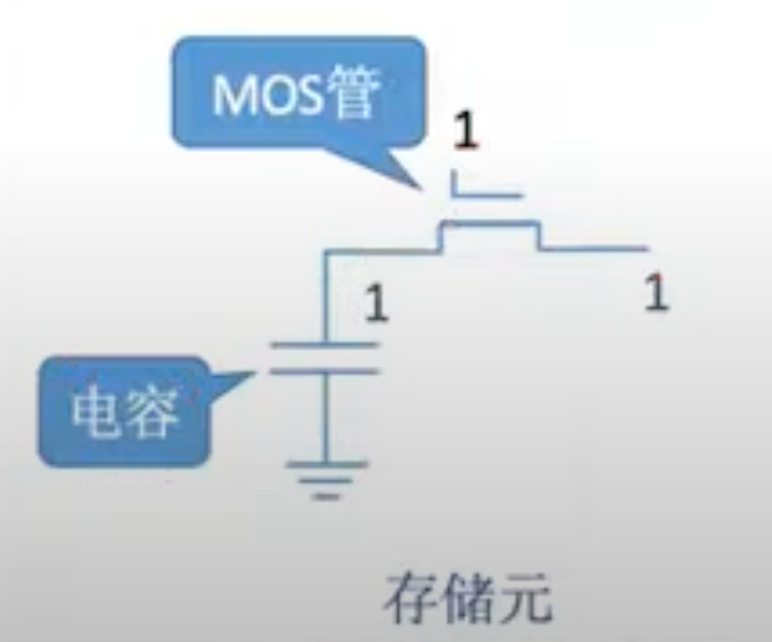
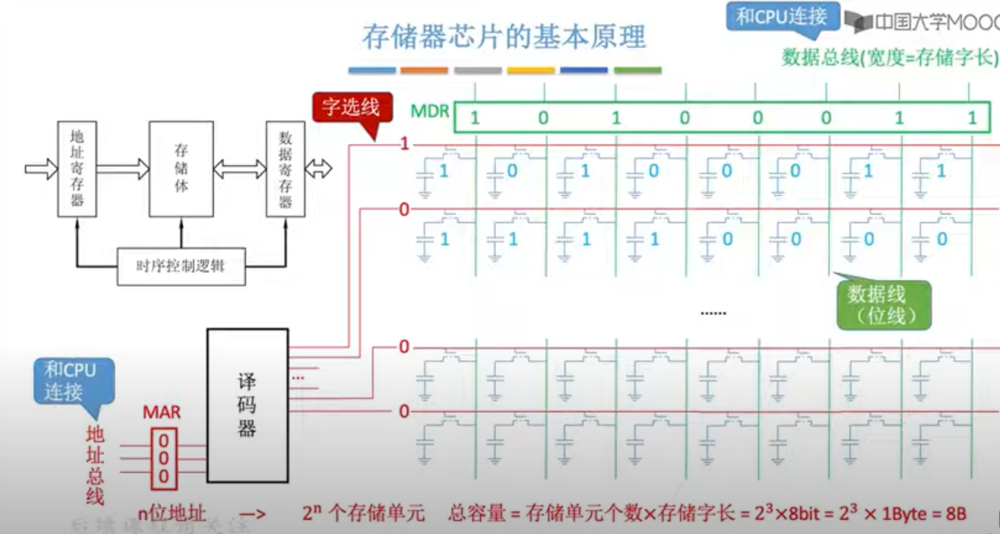
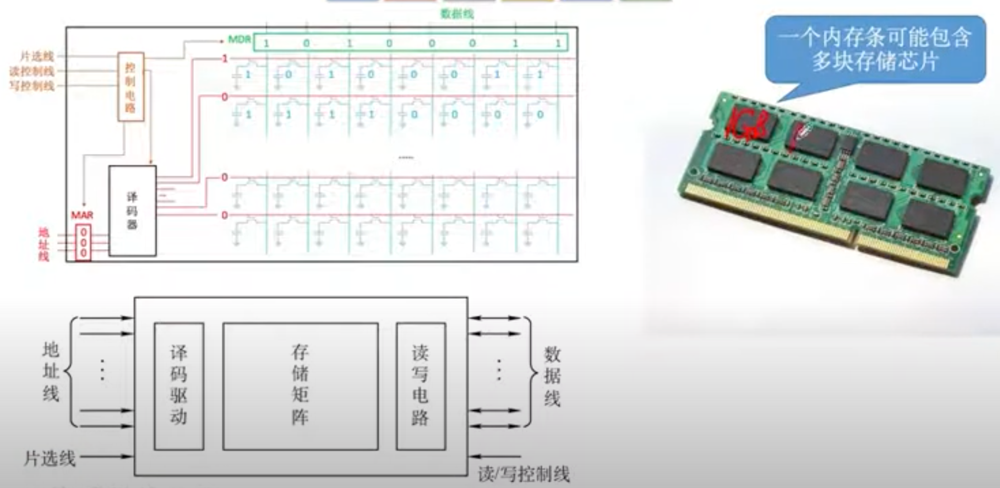
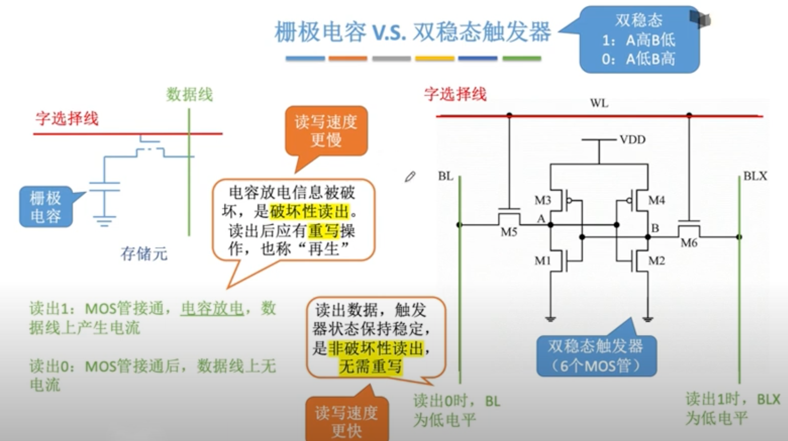
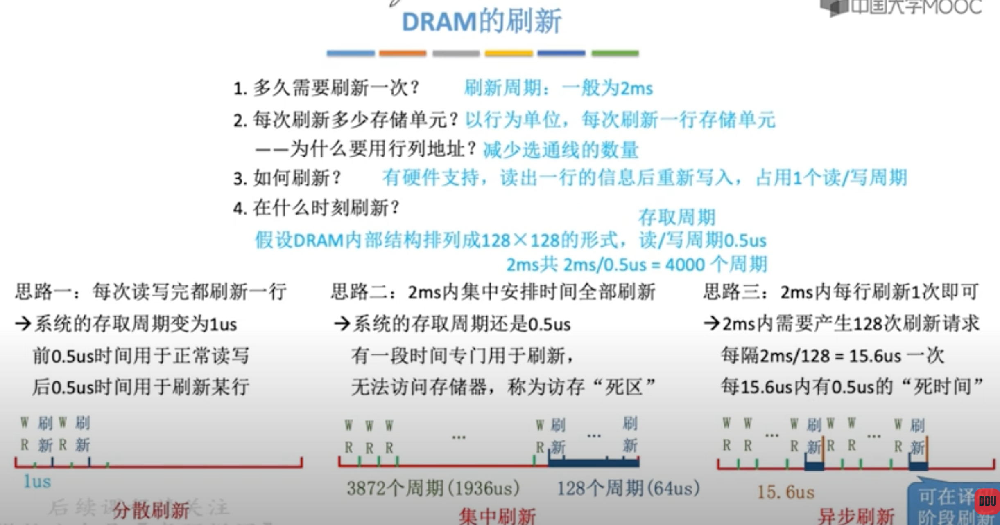
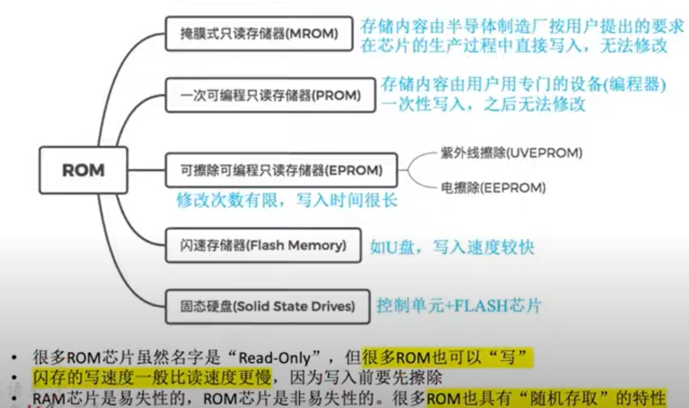
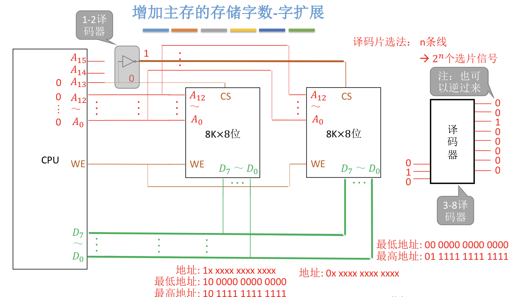
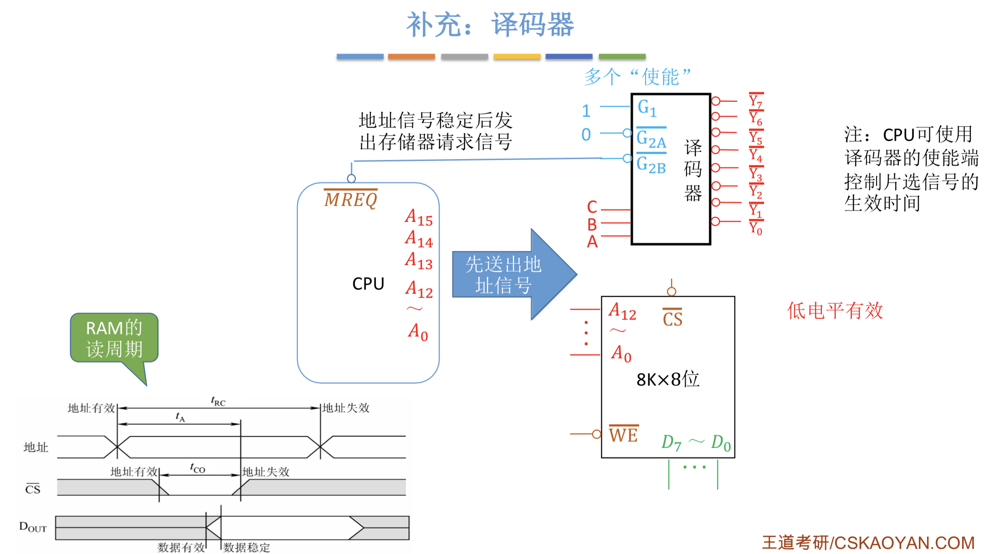
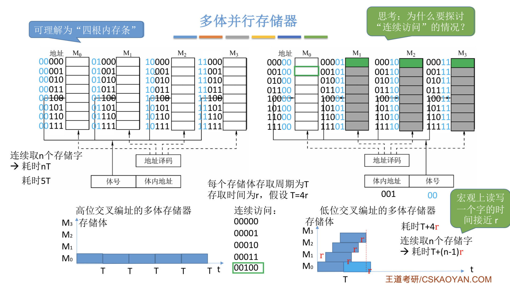

# 存储器（RAM）

在经典的教学模型中，CPU 与主存交互时涉及两个关键寄存器：

* MAR（Memory Address Register）

MAR 的位数决定了可表示的地址数量，反映的是最大可寻址空间，而不一定等于实际安装的 RAM 容量。

* MDR（Memory Data Register）

MDR 的位数反映一次能够与存储器交换的数据宽度。在简化模型中，它通常与存储字长一致。

**注意：这两个寄存器位于 CPU 或存储器接口中，只是逻辑上服务于主存访问，所以有时会被画在 RAM 一侧。现代处理器的实际实现不一定存在同名的独立寄存器。**

## 存储单元硬件

可以按照下图简单理解，但实际的电路远比这复杂，具体可以参照[《编码的奥秘》](https://book.douban.com/subject/1024570/)。

8 个上图中的一位存储元并联，可以形成一个 8 位存储字；在按字节编址的系统中，它对应一个字节，如下图所示：

进一步地，我们可以把 RAM 抽象为下图所示的存储芯片。实际上，RAM 的引脚要比图中多很多，比如供电引脚、接地引脚等。

## SRAM和DRAM的区别

### DRAM的刷新

## ROM（Read-Only Memory）

## 译码片选法

假设有 8 个 8 KB 的存储芯片，并且按字节编址，那么总容量为 8 × 8 KB = 64 KB，共有 2^16 个字节地址，所以地址线宽度应为 16 位。这 16 位地址如何准确寻址到某个芯片中的某个字节呢？

可以使用地址线的低 13 位进行片内寻址，高 3 位生成片选信号。高 3 位能够唯一选择 8 个存储芯片中的一个，具体由译码器实现，如下图所示：

实际的译码器比上述概念图复杂得多，例如可以使用使能信号控制译码器是否工作，如下图所示：

## 双口RAM & 多模块存储器

### 交叉编址

本质上仍然涉及译码，但还要考虑存储模块完成一次访问后需要经过一定周期才能再次访问。将低位地址作为模块选择信号时，连续访问相邻地址会轮流命中不同模块，从而提高吞吐率。具体见下图：

上图很容易计算出：若模块数为 m，模块访问周期为 T，连续启动两次访问的间隔为 r，并且 T/r 为整数，那么 m = T/r 时可以恰好隐藏模块恢复时间。若 m < T/r，再次轮到第一个模块时它尚未恢复；若 m > T/r，则模块数量超过隐藏该延迟所需的最小数量。

**低位交叉编址与双通道内存并不是同一概念。低位交叉通过多个存储模块交替工作提高连续访问吞吐率；双通道则由内存控制器使用两个独立通道，并且具备并行传输能力。两者都可能利用地址交错，但不能简单等同。**

