# Cache

## 关于cache line 大小

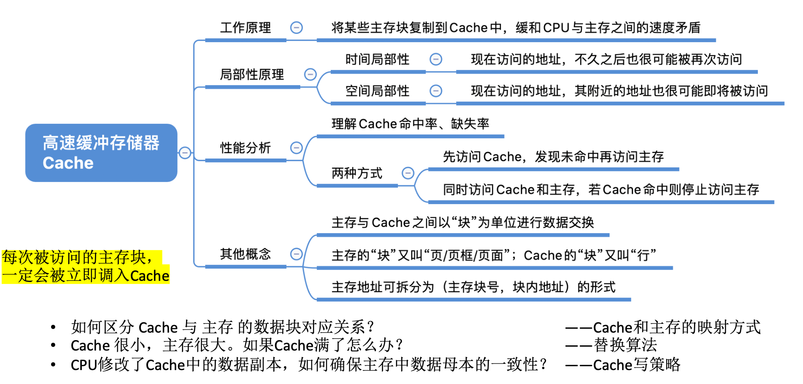

**上图中有一点错误：缓存行（cache line）和内存页（memory page）是不同层次的概念，大小通常也不相同。**

> 对于许多 2020 年前后的 64 位主流 CPU，cache line 大小为 64 B，而常见的基础页大小为 4 KB，二者相差很大，并不是上图中所说的一样大。具体数值由处理器和操作系统决定。
>
> 上述[数据参考](https://www.aristeia.com/TalkNotes/ACCU2011_CPUCaches.pdf)见下图，更详细的讨论见 [Stack Overflow](https://stackoverflow.com/questions/14707803/line-size-of-l1-and-l2-caches)、[ScienceDirect 相关论文](https://www.sciencedirect.com/topics/computer-science/cache-line-size)。不同处理器的结果可能不同，但缓存行通常远小于内存页。
> 

### [ARM Cortex-A77 Core Architecture](https://en.wikichip.org/wiki/arm_holdings/microarchitectures/cortex-a77)

这是 ARM Cortex-A77 架构图。图中 L1 指令缓存和 L1 数据缓存分别为 64 KB。

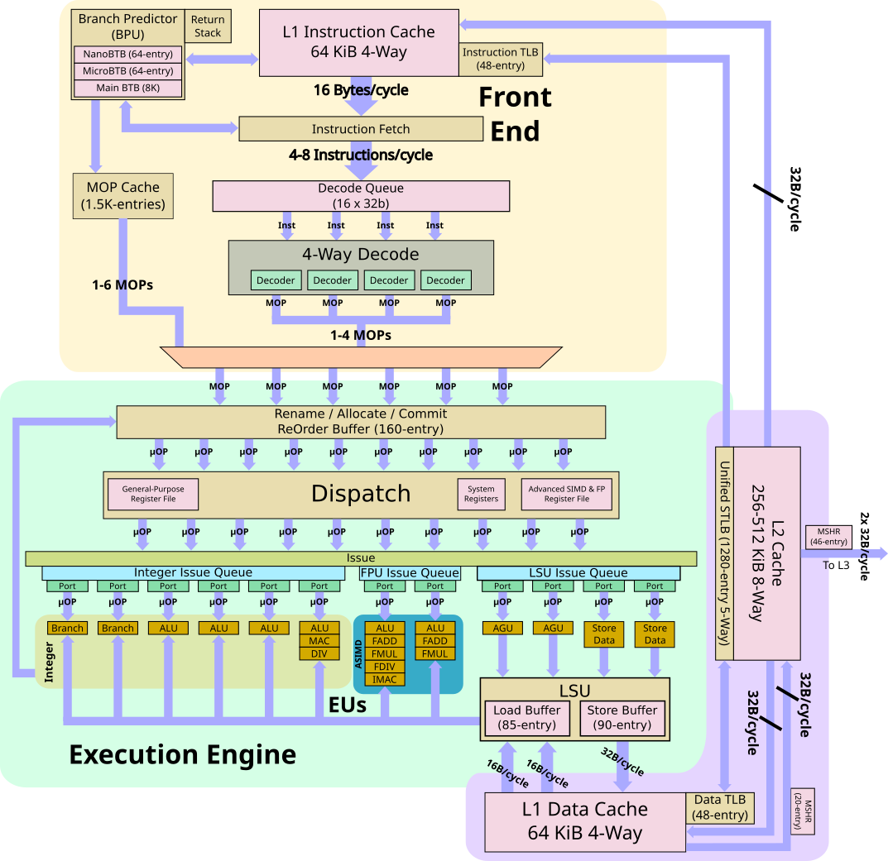

2022 王道强化班课程修改了这个问题，而且把这个过程梳理得很清楚了（参考了 2018 年 408 真题等资料）。页表负责地址转换，Cache 负责缓存数据，二者是不同的机制，但现代处理器可能让地址转换与 Cache 查询部分重叠。许多主流处理器的 cache line 大小为 64 B。下面是相关 PPT：

上图展示的是一个全相联 Cache，结构相对简单。从图中也能看到，4 KB 页面对应 12 位页内偏移，64 B cache line 对应 6 位块内偏移；二者没有必须相等的关系。

### 408真题看cache结构与访存过程

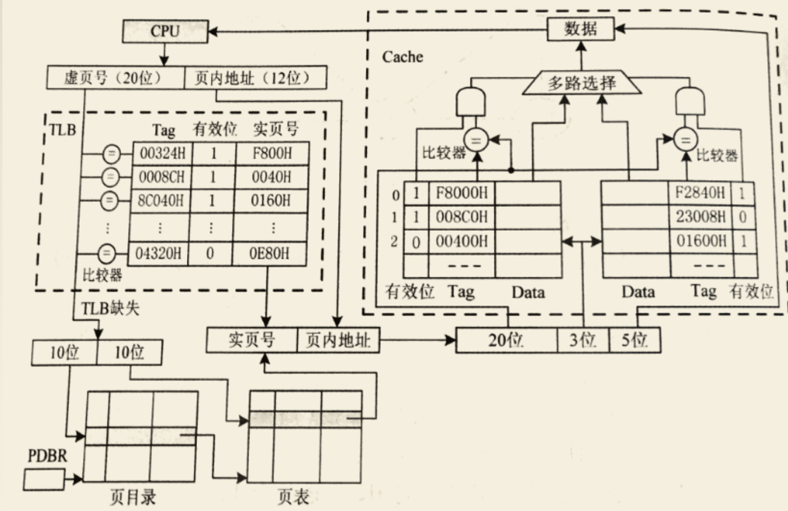

1. 上图左上部分：CPU 使用虚拟地址访存时，首先查询 TLB。TLB 缓存最近使用的地址转换关系；现代处理器通常使用 ASID 或 PCID 等标识区分不同地址空间，因此其中不一定只有当前进程的转换记录。页表基址寄存器仍然必需，在 TLB 未命中并由硬件遍历页表时用于定位页表；切换地址空间时，操作系统会按体系结构要求更新该寄存器或地址空间标识。
2. 上图左下部分：若 TLB 未命中，处理器需要查询页表。对于简化的单级页表，可以用页表基址加上由虚拟页号计算出的页表项偏移来定位页表项；多级页表则需要逐级索引。取得物理页框号后，再与页内偏移组合成物理地址。
3. 上图右上部分：拿到用于 Cache 标记比较的地址后，使用其中的组索引位定位 Cache 组，再将标记位与该组各 cache line 的 Tag 比较。匹配且有效位有效则命中，否则继续访问下一级存储层次。
4. 图中的 MAR 和 MDR 属于教学模型，用于说明地址和数据的传送。现代处理器内部通常由更复杂的访存流水线、队列和总线接口完成相应功能。若 Cache 未命中，就会继续访问下一级 Cache 或主存。

5. 上图右上部分的数据选择逻辑与地址最低 5 位直接相连，是因为这 5 位作为块内偏移，可以从一个 32 B 的 cache line 中选择具体字节。见下图：

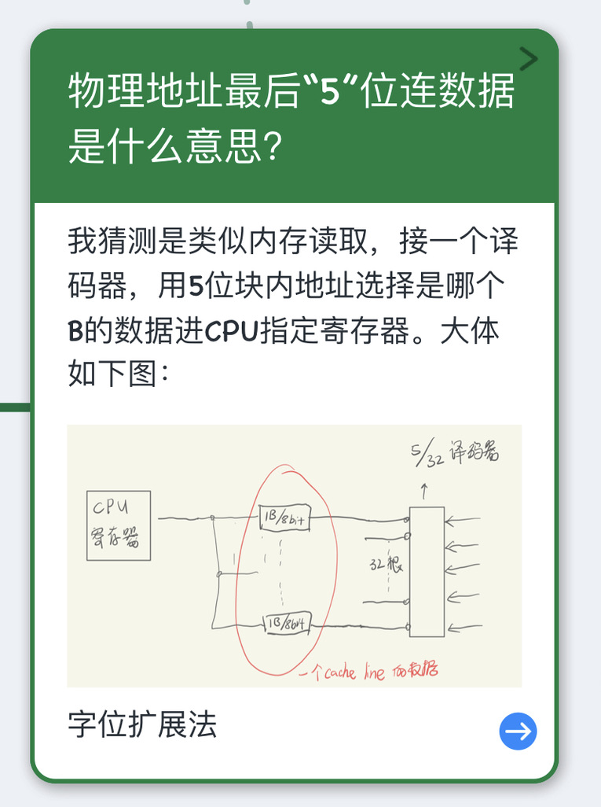

### Cache 总容量：

> 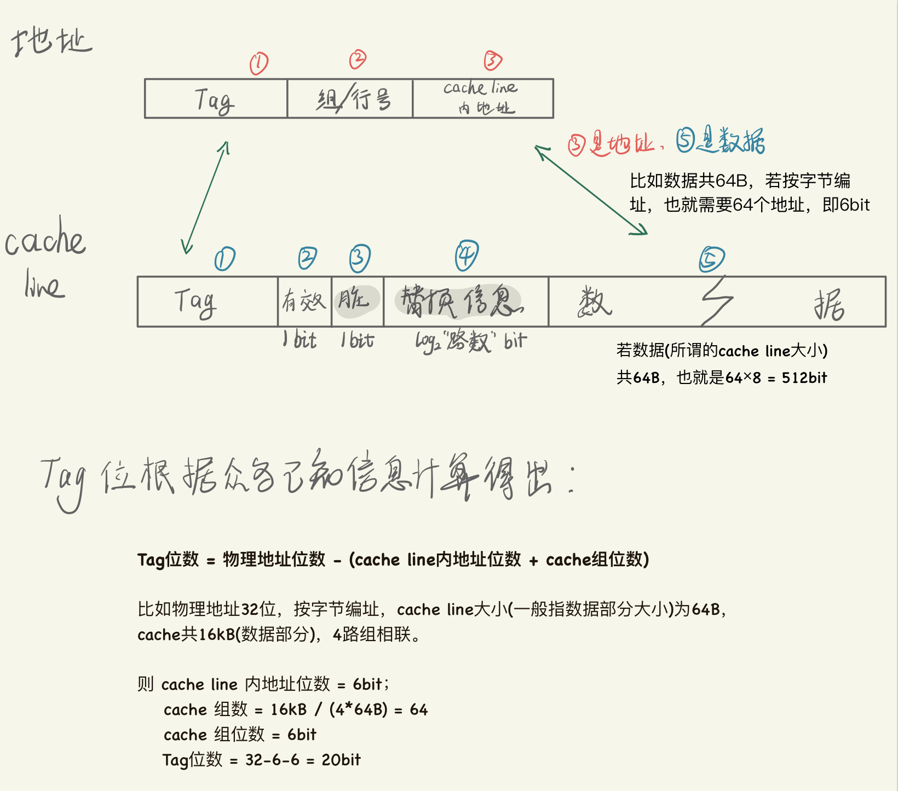
>
> **一**：1 位**有效位**：用于表示该 cache line 当前是否保存有效数据，避免把尚未填充的行误判为命中。
>
> 
>
> **二**：**Tag 位。** 对于按字节编址、使用物理地址标记的 Cache，`Tag 位数 = 物理地址位数 - log2(cache line 字节数) - log2(Cache 组数)`，用于标识该行对应的内存块。
>
> 减去块内偏移位数，即 `log2(cache line 字节数)`，因为同一 cache line 中的字节共享相同的 Tag；
>
> 再减去组索引位数，即 `log2(Cache 组数)`。直接映射 Cache 中，组数等于 cache line 数；组相联 Cache 中，组数等于 `cache line 数 / 路数`。
>
> 
>
> **三**：**替换状态位。**组相联 Cache 若实现精确 LRU，需要记录组内各路的相对新旧顺序，所需位数与路数及具体编码方式有关，并不是简单的 `log2(路数)`。实际硬件也常使用伪 LRU。直接映射 Cache 不需要替换状态位。
>
> 
>
> **四：脏位。**若采用写回法，则还需 1 位“**脏位**”来标记该 cache line 是否已被修改但尚未写回下一级。
>
> 
>
> **五：数据。**也就是一个 cache line 所能保存的数据位数。这里计算的是包含标记和状态信息在内的 Cache 物理容量，而通常所说的 Cache 容量只计算数据部分。
>
> 比如按字节编址，cache line 为 64 B，则块内偏移为 6 位，而数据部分为 64 × 8 = 512 位。
>
> 
>
> **六：**前五步算的cache line容量乘以cache line数。其中，**cache line数 = cache组数*路数。**

### TLB“单元”、cache line、页表项的区别与联系

同样参考上图：

1. TLB 可以看作地址转换信息的专用 Cache，通常包含虚拟页号的标记、物理页框号、有效位、权限位以及替换状态等信息；某些体系结构还会缓存访问位、脏位或与之等价的状态。因此，不能简单地把 TLB 称为“只读 Cache”。
2. 页表项按页表结构存放，索引位置已经隐含了对应的虚拟页，因此通常不需要像 Cache 那样为每项保存虚拟页 Tag。页表项一般包含有效位或存在位、物理页框号、权限位，以及体系结构定义的访问位、脏位等；TLB 的替换信息通常不属于页表项。

 

### 总结：整个访存过程(包括TLB、页表、cache)

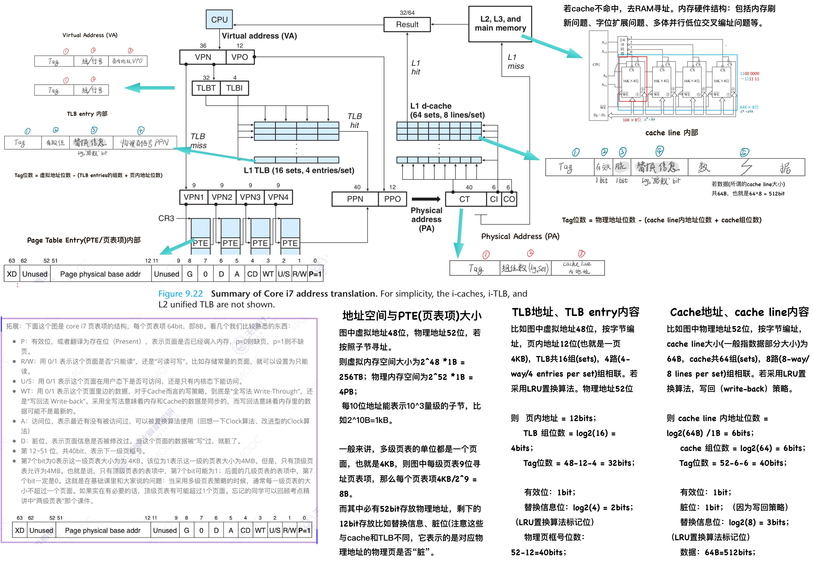

> #### 磁盘扇区、文件系统块与内存页大小
>
> 三者不是同一概念，也不要求大小相同。现代磁盘常见逻辑扇区大小为 512 B 或 4 KB，文件系统块常见为 4 KB，基础内存页也常见为 4 KB，但具体值取决于设备、文件系统、体系结构和操作系统配置。
>
> 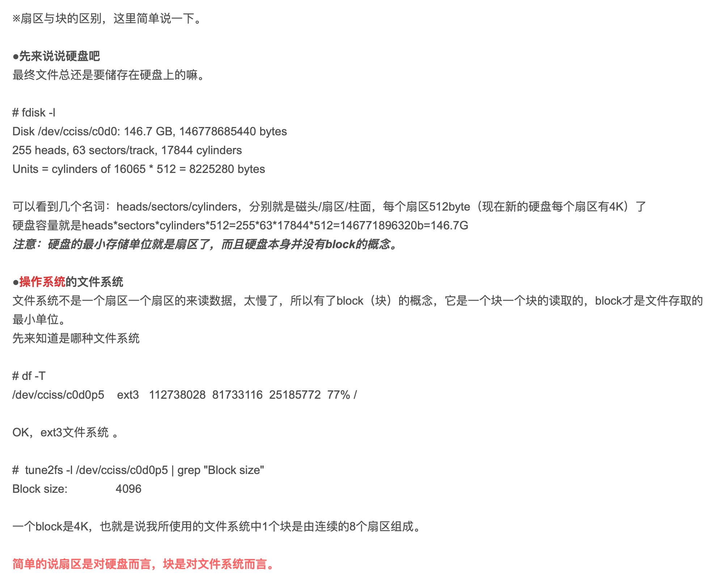

## 再聊局部性原理

下图中二维数组的存放与循环访问的问题是非常经典的，按行或列循环是截然不同的。

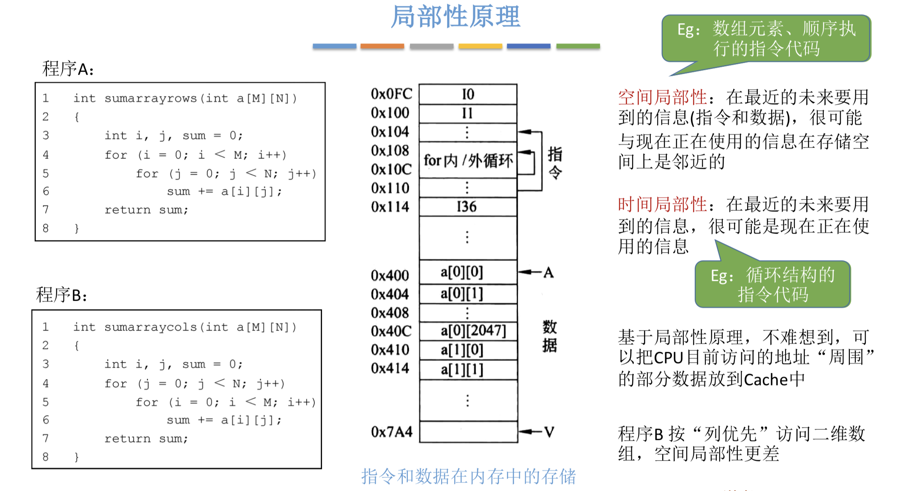

## cache和RAM的映射关系

### 直接映射

### 全相联映射

## cache 替换算法

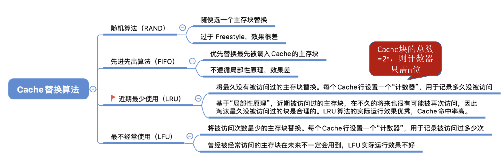

### LRU（Least Recently Used）

LRU 会优先替换最长时间未被访问的行，但不一定在所有工作负载中命中率最高。精确 LRU 的状态开销取决于每组路数和编码方式，并不是只需要 `log2N` 位；高相联 Cache 常采用伪 LRU 等近似算法降低硬件开销。

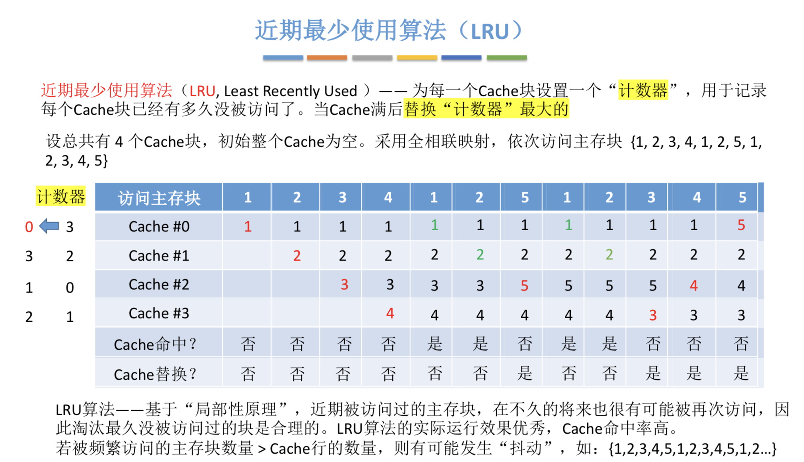

## cache 写策略

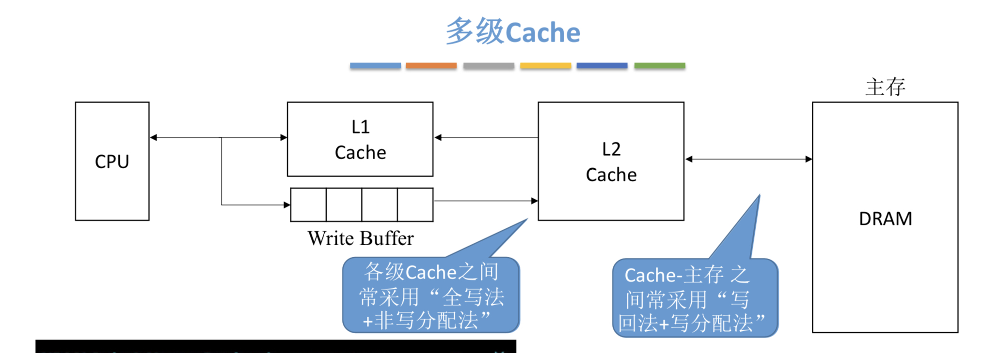

**写命中时**：

* **直写（Write-through）**：修改当前cache的同时，也修改下一级存储器中的内容。

* **写回（Write-back）**：仅修改当前命中的 cache line，并设置脏位；该行被替换、显式清理或因一致性协议需要时，才写回下一级存储层次。

在 Cache 层次中，越靠近主存的层级越倾向于采用写回策略，以减少向下一级传输的数据量。RAM 与磁盘之间的数据回写属于虚拟内存或文件系统管理，不应与 CPU Cache 的写策略直接混为一谈。

《深入理解计算机系统》中的下述引文并不是说 CPU 各级 Cache 之间以直写为主，而是比较两种策略，并指出越靠近存储层次下方，写回策略通常越常见。现代高性能 CPU 的数据 Cache 普遍采用写回策略，以降低下一级存储层次的带宽压力。

> 6.4.7 Performance Impact of Cache Parameters
>
> Write-through caches are simpler to implement and can use a write buffer that works independently of the cache to update memory. Furthermore, read misses are less expensive because they do not trigger a memory write. On the other hand, write-back caches result in fewer transfers, which allows more bandwidth to memory for I/O devices that perform DMA. Further, reducing the number of transfers becomes increasingly important as we move down the hierarchy and the transfer times increase. In general, **caches further down the hierarchy are more likely to use write-back than write-through.**

