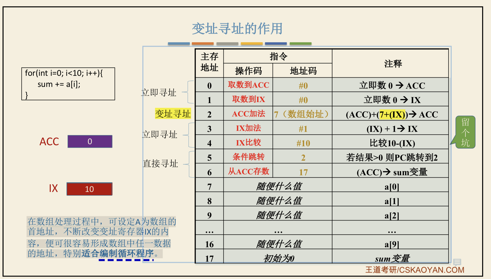
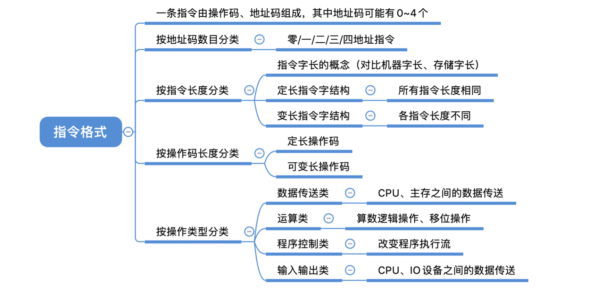
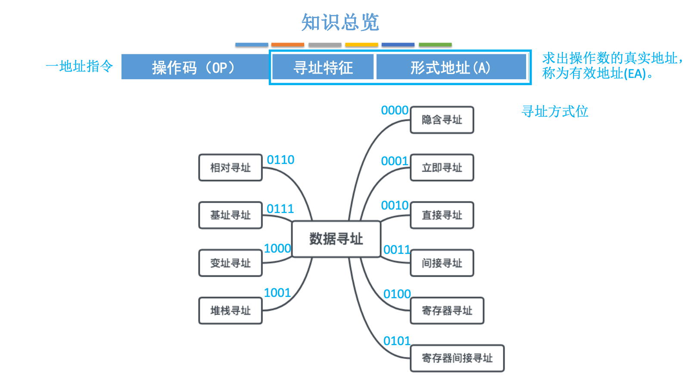
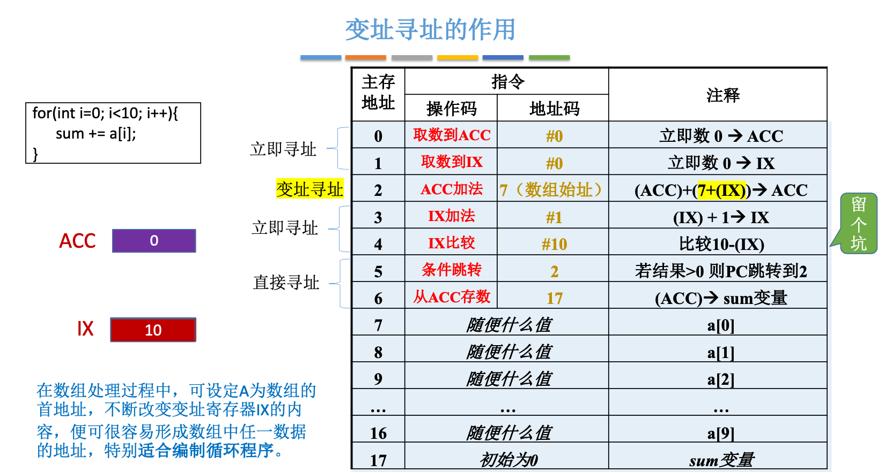
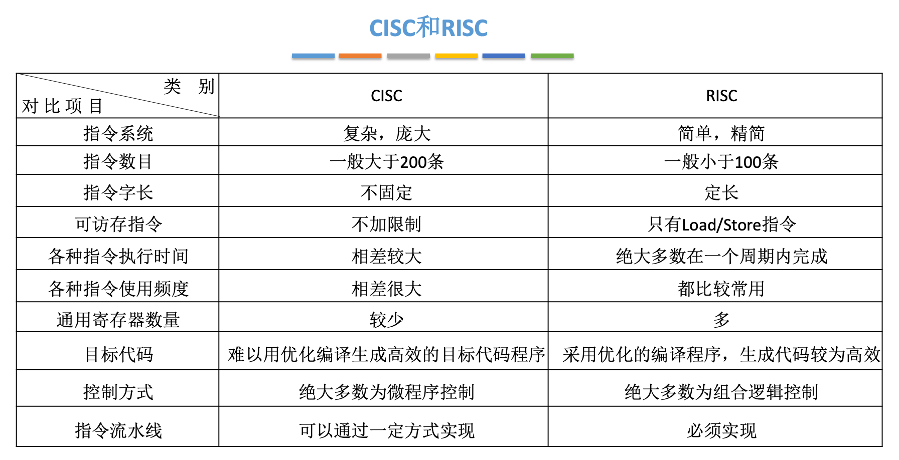

# 指令系统


## 指令和数据如何区分？

1. 比如1级cache分为指令和数据，那这个指令，是指令系统中讲的（一个指令包含操作码和操作数/地址码），还是指令就指的狭义的操作码？
2. 比如讲内存分段时，代码区、数据区，这个所谓的数据区，指的是什么？和上述1级cache的数据cache是一回事吗？

这里所说的指令不是狭义的操作码。**一条机器指令通常包含操作码以及用于描述操作数或其位置的字段；其中也可能包含立即数。数据则是被指令处理的对象。**见下图：



指令中可以直接编码立即数，也可以通过寄存器或内存地址引用操作数。立即数字段的宽度受指令编码限制，但这与寄存器宽度是否固定不是一回事；不同指令集既可能采用定长指令，也可能采用变长指令。

**处理器并不会根据某段二进制内容本身判断它是指令还是数据。**处理器通常把程序计数器指向的位置作为指令取出，而普通加载、存储指令访问的位置则被当作数据。编译器、汇编器和链接器会组织代码段与数据段，加载器和操作系统再建立相应的地址映射及执行、读写权限；最终仍由执行上下文和访问方式决定这些比特如何被解释。


## 指令结构





## 寻址


* **找下一条指令的地址——指令寻址**

* **找指令中操作数的地址——数据寻址**


### 指令寻址

最常见的顺序执行情况是：**PC（程序计数器）加上当前指令的长度**。在定长指令集里可以把它抽象为 `PC + 1 条指令`；在实际按字节编址的机器上，增加的是该指令占用的字节数。

* 定长指令集的每条指令长度相同，PC 可以按固定步长递增；x86 等变长指令集则需要根据当前指令的实际长度更新 PC。

* **JMP** 等控制转移指令会把 PC 更新为目标地址。`JMP` 描述的是跳转操作，而相对寻址描述的是目标地址的编码和计算方式；条件跳转与无条件跳转是另一个分类维度。


### 数据寻址





#### 变址寻址

变址寻址有助于在汇编层面高效实现数组遍历和循环，如下图：




### 复合寻址

基址、变址、间接和相对等寻址方式可以根据指令和数据结构组合使用，并不存在程序必定“首先使用基址寻址”的规则。指令计算出的通常是有效地址；在启用虚拟内存时，它还是虚拟地址，之后再由地址转换机制得到物理地址。没有操作系统时，程序使用何种地址模型取决于处理器工作模式、链接布局和运行环境。

变址寻址常用于数组和循环；函数调用既可以使用直接或相对的控制转移，也可以通过寄存器或内存中的函数指针进行间接调用。在采用虚拟内存的系统中，访存地址还要经过页表等结构转换为物理地址。


**具体应用哪种方式、使用哪个寄存器来实现高级语言的语句，这不是操作系统做的事情，其实是编译器要做的事情。**

而硬件**（CPU有多少个寄存器、是否添加某个专用寄存器，这也要和编译器团队（往往就是C/C++编译器）协同的，而具体怎么权衡，《计算机体系结构-量化研究方法》一书中有提到）**也是随着历史的演变更迭的。


## 基址寻址与分页（虚拟内存）

> 作者：invalid s
> 链接：https://www.zhihu.com/question/436174981/answer/1648526266
> 来源：知乎
> 著作权归作者所有。商业转载请联系作者获得授权，非商业转载请注明出处。
>
> 
>
> 第二大类是虚地址模式下跑的各种应用，也就是第三种情况。
>
> 这个模式下，OS一般会事先做一个约定，比如内存前1G（或更大空间）属于OS，其它空间属于应用。真正运行时，通过虚拟地址映射机制，OS内容就被映射到了约定好的空间、而用户应用则从约定好的起始点开始顺序加载（实践中也可能故意在每次加载时都偏移一个随机值，这样万一有缓冲区溢出之类漏洞，黑客们想完成攻击就没那么容易了。毕竟重定位是个早已被解决的问题，不用白不用）。
>
> 借助虚拟地址机制，每个应用都会“觉得”自己独占了全部内存空间，并不能意识到其它应用的存在。
>
> 所谓虚拟地址机制，说白了和实模式下的“基址相对寻址”是一个原理；只是现在负责内存映射的寄存器对应用来说不再可见了而已——实模式下，应用知道自己被加载到了201K开始处，因此当它要访问内存地址1235时，实际访问的是201K+1235处，所有一切它都知道的清清楚楚；而虚模式下，应用以为自己就是从0开始加载的，访问1235就是1235，并不知道实际上OS“偷偷”替它加了个偏移值、使它访问到了正确的地方（这个偏移值被OS自动维护在“页表”里，每个进程都有独属于自己的一套单独的页表；当这仍然是个简化的、原理性的说法，实际上还有页式管理、段页式管理等不同分类，而且不同的CPU支持的管理方案也有所不同）。

> [!NOTE]
> 上述引文把虚拟内存类比成“加一个偏移值”，只能帮助建立非常粗略的直觉。分页系统通常按虚拟页号查询页表得到物理页框号，再保留页内偏移；不同虚拟页可以映射到不连续的物理页框，因此不是给整个地址空间统一加上一个基址。


### 函数跳转是怎么回事？


> 原文链接：https://blog.csdn.net/weixin_41028621/article/details/87830267
>
> 分析函数跳转地址如何计算以及函数返回地址如何保存？
>
> ### 一.函数跳转地址
>
> 1.参考代码如下：
>
> ```c
> #include <stdio.h>
> 
> int add(int x,int y){
>     int sum;
>     sum = x + y;
>     return sum;
> }
> 
> int main(int argc, char *argv[]){
>     int i;
>     
> 	i = add(2,3);
>     printf("i=%d\n",i);
>     return 0;
> }  
> ```
>
> 编译并且反汇编：
>
> ```bash
> gcc -m32 -g -o add add.c
> objdump -d -M intel add > add.txt
> ```
>
>
> 2.查看add.txt main函数反汇编代码：
>
> 161 08048433 <main>:
> 162  8048433:   55                      push   ebp
> 163  8048434:   89 e5                   mov    ebp,esp
> 164  8048436:   83 e4 f0                and    esp,0xfffffff0
> 165  8048439:   83 ec 20                sub    esp,0x20
> 166  804843c:   c7 44 24 04 02 00 00    mov    DWORD PTR [esp+0x4],0x3
> 167  8048443:   00
> 168  8048444:   c7 04 24 01 00 00 00    mov    DWORD PTR [esp],0x2
> 169  804844b:   e8 cd ff ff ff          call   804841d <add>
> 170  8048450:   89 44 24 1c             mov    DWORD PTR [esp+0x1c],eax
>
> 
>
> 如上所示，第169行 call 804841d ，执行call命令，跳转到add函数。即如下所示：
>
> 149  0804841d <add>:
> 150  804841d:   55                      push   ebp                                                                              
> 151  804841e:   89 e5                   mov    ebp,esp
> 152  8048420:   83 ec 10                sub    esp,0x10
> 153  8048423:   8b 45 0c                mov    eax,DWORD PTR [ebp+0xc]
> 154  8048426:   8b 55 08                mov    edx,DWORD PTR [ebp+0x8]
> 155  8048429:   01 d0                   add    eax,edx
> 156  804842b:   89 45 fc                mov    DWORD PTR [ebp-0x4],eax
> 157  804842e:   8b 45 fc                mov    eax,DWORD PTR [ebp-0x4]
> 158  8048431:   c9                      leave
> 159  8048432:   c3                      ret
>
> 
>
> 问题：跳转地址804841d是如何来的？
>   首先从机器码804844b: e8 cd ff ff ff 入手，其中e8代表call指令，那cd ff ff ff 是否代表跳转地址呢？ 要跳转的地址是0x804841d，而机器码后四字节是 cd ff ff ff。由于Intel 架构是采用小端寻址，所以内存中cd ff ff ff代表的值是0xffffffcd，该值似乎和跳转地址没有关系？
>   结合生活，如果要寻找一个地方，一是通过经纬度定位出绝对地址，一是“从这里左拐，然后右拐，再左拐…”，通过以指路人位置作为坐标进行相对偏移。同理，计算机寻址也有两种方式，绝对寻址和相对寻址。那猜测call指令后的地址是不是偏移量呢？
>   首先解释一下偏移量，由于跳转可以向前和向后，所以偏移量是区分正负的。偏移量0xffffffcd是负整数，由于计算机负整数是通过补码来表示，所以求其正整数就是求反加一，转化后为：0x33。
>
> 804844b: e8 cd ff ff ff call 804841d 
> call指令的地址0x804844b - 0x33 = 0x8048418
>   通过对比 0x804841d 和0x8048418，两个数已经很接近，差值为5。而call指令有5个字节，是不是很巧合！
>
> call 指令的偏移量地址：
>
> x86系列cpu的call指令的寻址方式：
>   用与call指令相关的偏移量定位跳转到的地址。
> 偏移量计算：
>   偏移量=跳转到的地址 - call指令后一条指令长度的起始地址。
> 如上所示，进行验证：0x804841d - 0x8048450 = - 0x33，与上面计算吻合。
>
> 
>
> ### 二.函数返回地址
>
> 函数调用之后会返回，那返回地址如何得到？
>
> 以add函数为例接着进行分析：
> 在add函数设置断点，执行F11后，查看变化的寄存器有两个：
>
> EIP：保存call跳转到的指令的地址0x804841d；
> ESP: 该值或者是返回地址，或者是存放返回地址内存的地址。
>
>   gdb查看该地址，如下所示：0x08048450正好是call指令的返回地址。通过以上分析可知，call指令将返回地址保存在内存中，而且esp寄存器指向了该内存。（ESP保存栈顶内存地址）
> 170 8048450: 89 44 24 1c mov DWORD PTR [esp+0x1c],eax
>
> 
>
> 小结：
> **call指令等同于：**
> **push 返回地址**
> **jmp 函数入口地址**
> 其中返回地址保存在栈上，函数返回时用到。
>
> 
>
> ### 三.函数传递参数
>
>   函数需要传递参数，哪参数是如何进行传递的呢？
>   i = add(2,3);反汇编代码如下：
>
> 161 08048433 <main>:
> 166  804843c:   c7 44 24 04 02 00 00    mov    DWORD PTR [esp+0x4],0x3                                                    
> 167  8048443:   00 
> 168  8048444:   c7 04 24 01 00 00 00    mov    DWORD PTR [esp],0x2
> 169  804844b:   e8 cd ff ff ff          call   804841d <add>
>
>   如上所示，参数1和2是通过栈来进行传递的。首先将参数2入栈，然后是参数1入栈，即c语言参数传递是从右往左压栈传递参数。
>   执行入栈指令之前，查看esp寄存器的内容如上所示，然后执行si命令，将参数3入栈，同理参数2。
>
> 
>
> ### 四.函数获取参数
>
>   参数入栈进行保存，当调用函数时，参数是如何传递函数的？
>   如下图所示，参数3和2是连续存放的，只要获取一个基点，就能通过偏移量计算出3和2存储的地址。而获取基点的地址可以通过寄存器来实现，而esp随着栈的变化而变化，所以利用另一个寄存器来实现即ebp。
>
>   如下所示，在函数调用过程中，首先执行
>
> push ebp;
> mov ebp,esp;
> 即保存ebp的值，然后esp的值赋值给ebp。
> 最后执行leave，进行反向操作，进行还原。
>
>   第153-155行进行加法计算，通过ebp+0xc和ebp+0x8进行寻址参数3和2；执行完加法之后，eax将5保存到地址ebp-0x4，如下所示：
>
> 149 0804841d <add>:
> 150  804841d:   55                      push   ebp                                                                              
> 151  804841e:   89 e5                   mov    ebp,esp
> 152  8048420:   83 ec 10                sub    esp,0x10
> 153  8048423:   8b 45 0c                mov    eax,DWORD PTR [ebp+0xc]
> 154  8048426:   8b 55 08                mov    edx,DWORD PTR [ebp+0x8]
> 155  8048429:   01 d0                   add    eax,edx
> 156  804842b:   89 45 fc                mov    DWORD PTR [ebp-0x4],eax
> 157  804842e:   8b 45 fc                mov    eax,DWORD PTR [ebp-0x4]
> 158  8048431:   c9                      leave  
> 159  8048432:   c3                      ret   
>
> 
>
> 执行gdb调试，进行查看：
>
> (gdb) x/10x $ebp+0xc
> 0xffffcf74:     0x00000003      0xffffd03c      0xf7e3c4ad      0xf7fb63c4
> 0xffffcf84:     0xf7ffd000      0x0804847b      0xf7fb6000      0x08048470
> 0xffffcf94:     0x00000000      0x00000000
>
> (gdb) x/10x $ebp+0x8
> 0xffffcf70:     0x00000002      0x00000003      0xffffd03c      0xf7e3c4ad
> 0xffffcf80:     0xf7fb63c4      0xf7ffd000      0x0804847b      0xf7fb6000
> 0xffffcf90:     0x08048470      0x00000000
>
> (gdb) x/10x $ebp-0x4
> 0xffffcf64:     0x00000005      0xffffcf98      0x08048450      0x00000002
> 0xffffcf74:     0x00000003      0xffffd03c      0xf7e3c4ad      0xf7fb63c4
> 0xffffcf84:     0xf7ffd000      0x0804847b
>
> 
>
> 小结：
>   在使用ebp寻址的函数中，ebp+偏移量就是参数地址；ebp-偏移量就是局部变量的地址。
>
> 五.函数返回值
>   函数返回值是通过寄存器进行返回的。编译器使用eax作为存储返回值的寄存器，被调用方在ret前设置eax，返回后，调用方从eax获取到该值。
>
> 被调用方反汇编代码如下：
> 3: int add(int x, int y) {
> 00DB17F0 55                   push        ebp  
> 00DB17F1 8B EC                mov         ebp,esp  
> 00DB17F3 81 EC CC 00 00 00    sub         esp,0CCh 
> ...
> 6: 	return sum;
> 00DB1821 8B 45 F8             mov         eax,dword ptr [sum]
> ...
> 00DB1837 C3                   ret 
>
> 
>
> 调用方反汇编代码如下：
> //汇编代码来自visual studio:
> 13: 	i = add(2, 3);
> 000518D8 6A 02                push        3
> 000518DA 6A 01                push        2  
> 000518DC E8 A3 FA FF FF       call        _add (051384h)  
> 000518E1 83 C4 08             add         esp,8  
> 000518E4 89 45 F8             mov         dword ptr [i],eax  
>
> 
>
> 如上所示，最后将eax的值赋值给变量i，经过验证等同于mov dword ptr [ebp-8],eax。
>
> 小结：
> 1.函数传参：通过栈或者寄存器传递；其中寄存器传递不需要寻址内存空间，直接操作寄存器速度更快，但寄存器数目有限，难以应对大量参数的传递。
> 2.参数传递方式：c语言是从右向左压栈。
> 3.清栈方式：
>
> 调用方清栈：c语言选择此方式，该方式的好处是可以执行变参功能，如printf函数；坏处是执行call返回后，需要执行add esp x命令，增加了空间。
> 被调方清栈：执行ret x 命令，不增加空间，但没有变参功能。
> 4.函数指针不能进行强制类型转换，否则会出现错误。

> [!NOTE]
> 上述示例基于 32 位 x86 的特定调用约定，不能推广为 C 语言本身的统一规则。参数使用栈还是寄存器、入栈顺序以及由调用方还是被调用方清栈，都由 ABI 和调用约定决定。通过不兼容的函数指针类型调用函数会产生未定义行为；仅进行类型转换与实际通过该指针调用也需要区分。


## [CISC & RISC](https://www.zhihu.com/question/325968121)

下表中很多内容并不严谨，也不现实，但大体还是说明了不同指令集之间的区别。

> RISC 和 CISC 在指令编码、寻址方式和实现复杂度等方面存在历史差异，但现代处理器已经相互吸收了许多设计思想。现代 x86 处理器常把复杂指令译码为内部微操作，现代 ARM 处理器也可以采用宽发射、乱序执行和复杂的预测结构。
>
> **能效比问题**：RISC 或 CISC 标签本身不能决定处理器能效。频率、流水线、执行宽度、缓存、制造工艺和电源管理都会影响性能与功耗；大小核等异构设计也是在不同负载下平衡性能和能耗的手段。
>
> 但是，能效比提升并不必然意味着绝对性能提高，它也可能来自功耗降低。Apple Silicon 是高能效处理器的一个例子，但其表现同样受到微架构、制造工艺、编译器和操作系统等多方面因素影响。

> [!NOTE]
> RISC 与 CISC 主要描述指令集设计取向，不能仅凭这一标签判断性能或能效。具体结果取决于微架构、制造工艺、频率、电压、缓存层次、编译器和工作负载等因素；现代 x86 与 ARM 处理器也都吸收了多种设计思想。


