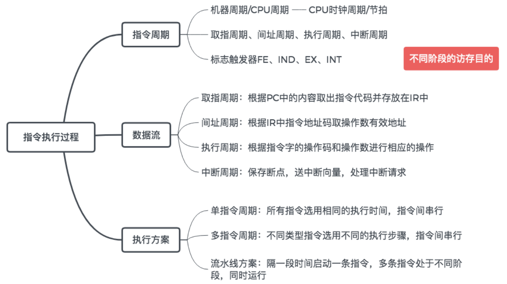
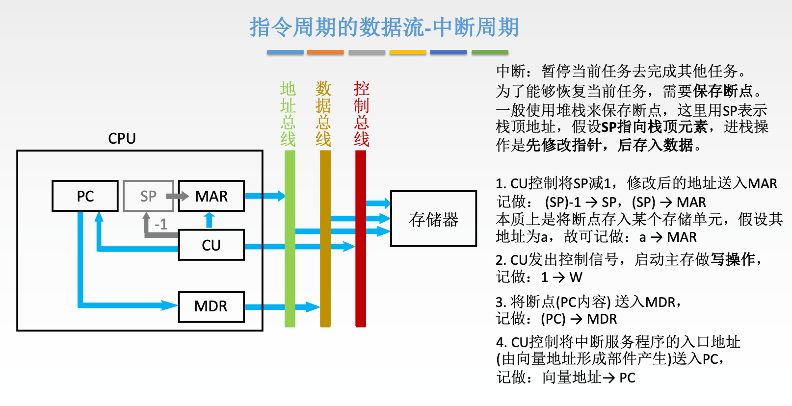
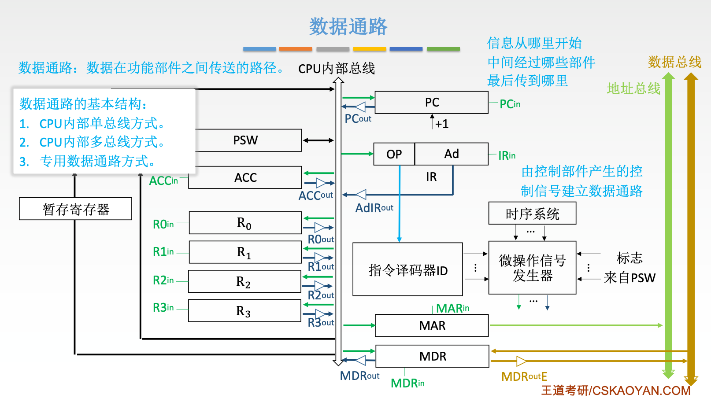
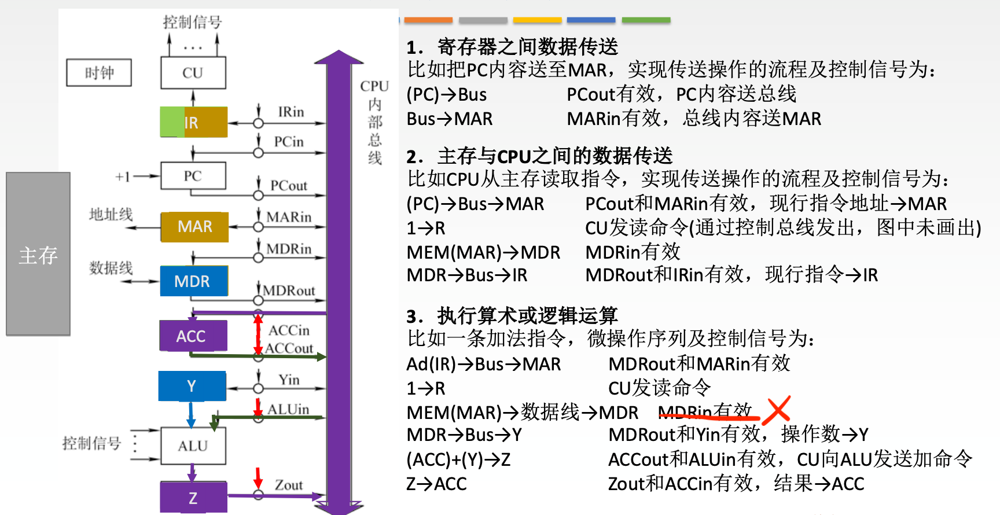
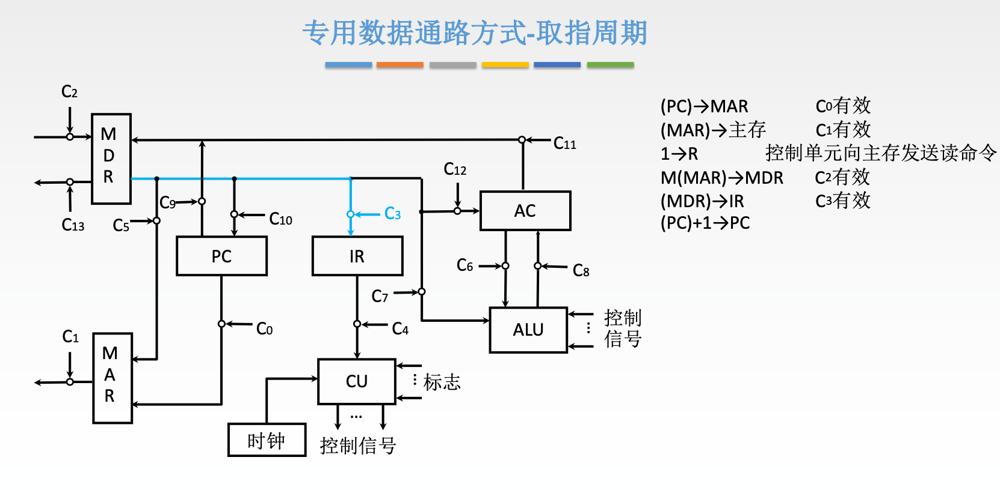
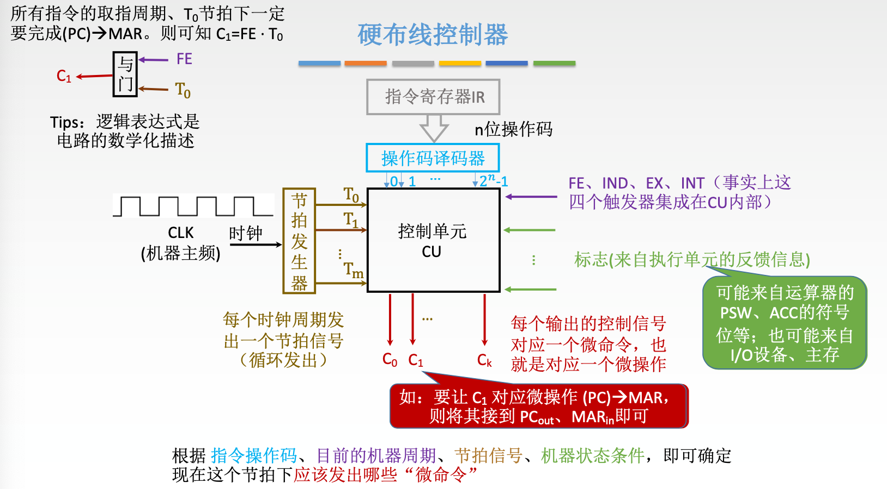
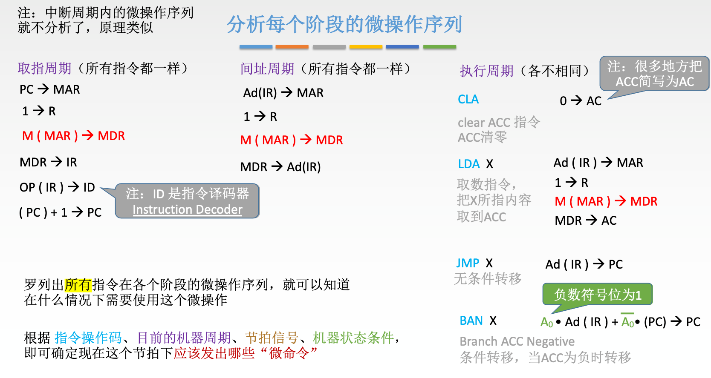

# 中央处理器

## 指令执行过程

### 中断

## 数据通路的结构

### 以内部单总线为例（大题考点）

需要注意，`MDRin` 指的是 MDR 从 CPU 内部总线接收数据的控制信号，并不是内存向 MDR 传送数据的控制信号，所以下图第 3 部分有一句是错误的。

### 专用数据通路方式

## 控制器设计

### 硬布线控制器

微操作是数据通路在控制信号作用下完成的基本操作。微指令只存在于微程序控制器中，用于编码一组微命令；硬布线控制器则直接由组合逻辑和时序逻辑产生控制信号，因此不能把微指令称为所有机器执行过程中的最小指令单位。

分析每个阶段的微操作序列：

### 微程序控制器

