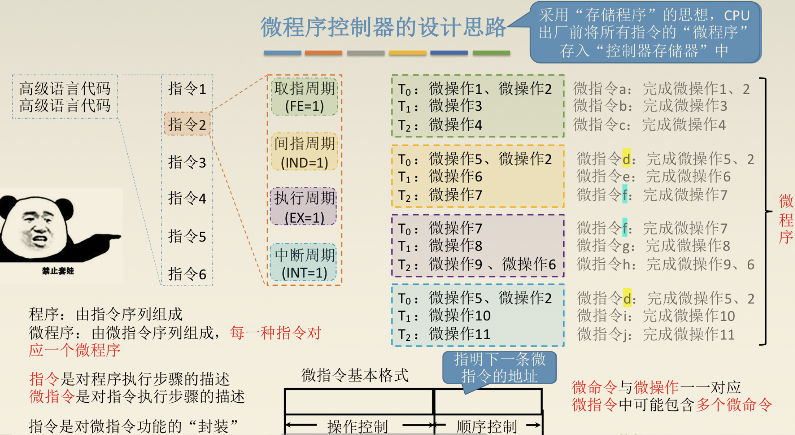
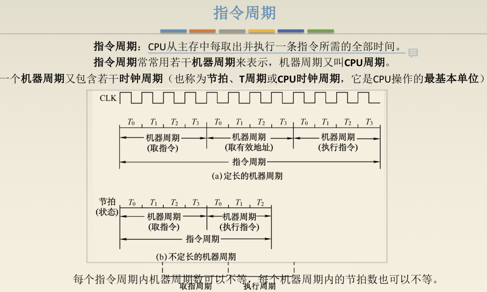
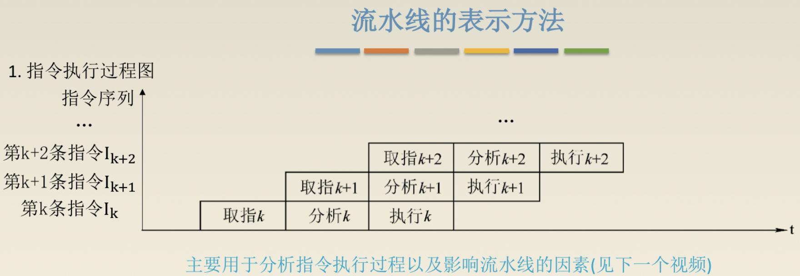
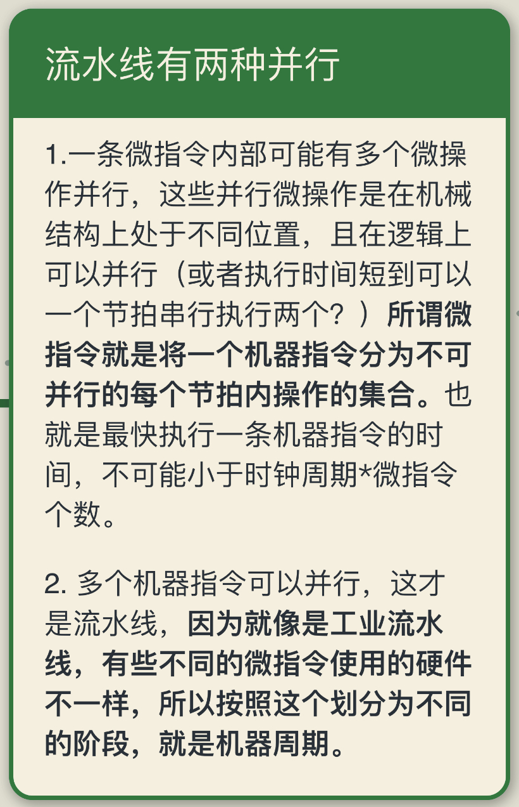
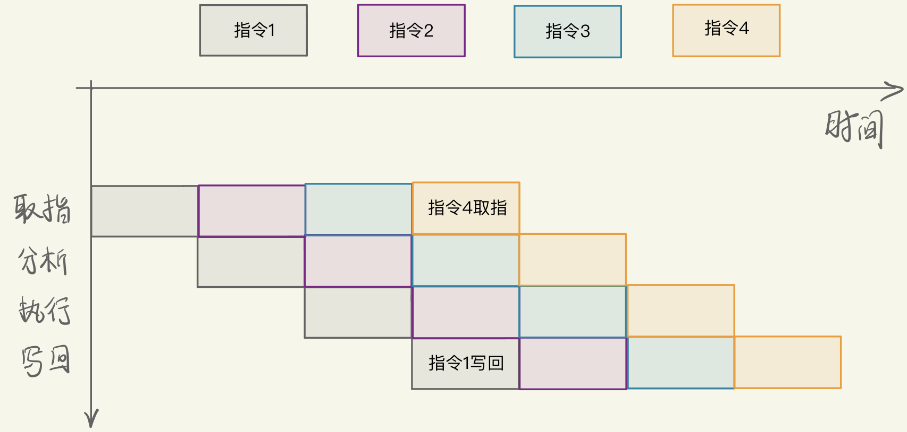
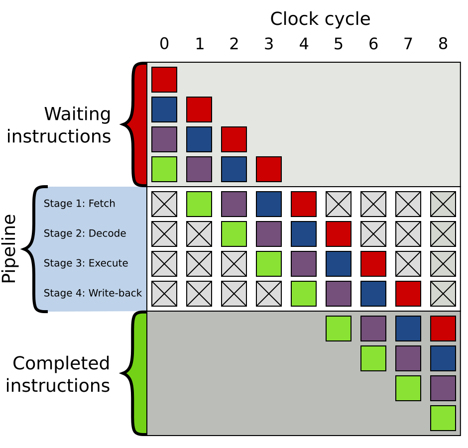
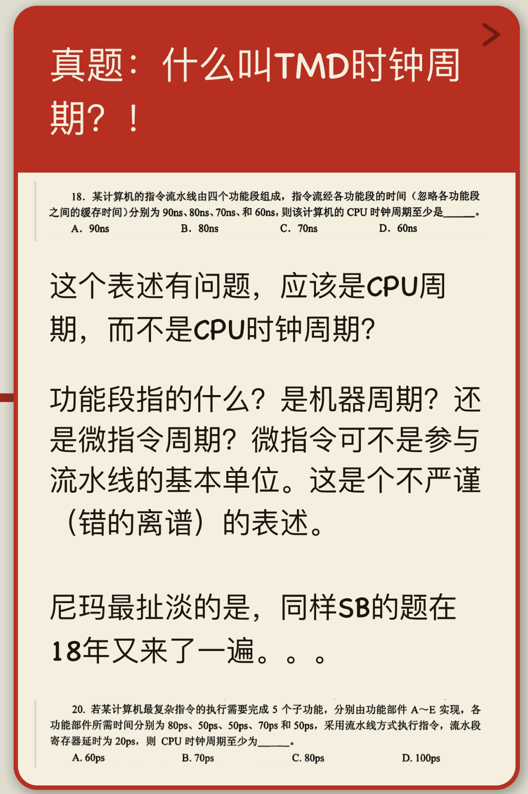
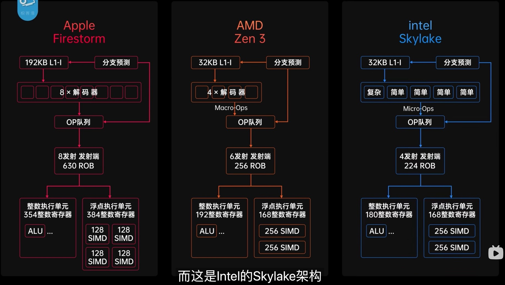
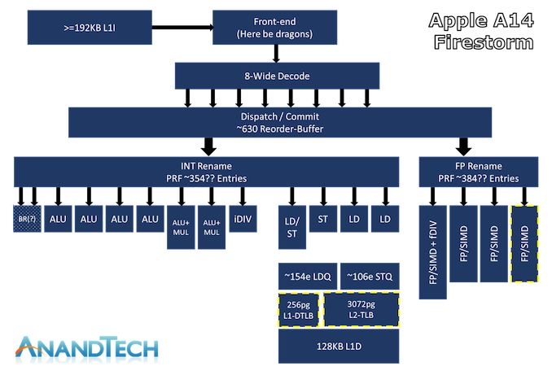

# 流水线与现代处理器

## 周期？周期？还TMD是周期！

目前各种教材对周期的划分各种**前后矛盾**。（这部分是[我的一个知乎回答](https://www.zhihu.com/question/53670481/answer/2116459568)的初稿。）

这里需要先限定术语的使用范围：**时钟周期**是时钟信号的一个周期；**指令周期**是完成一条指令所经历的全过程；一些教材又把取指、间址、执行和中断等阶段称为**机器周期**，并把一个机器周期继续划分为若干节拍。**微指令**则是微程序控制器中的控制字，用来发出一组微命令，并不能简单定义为“一个时钟周期内完成的事情”。

下图采用传统教材的口径，把一个指令周期分成若干机器周期，用来表示指令执行的不同阶段。不同教材可能采用定长或不定长机器周期，也可能直接用时钟周期描述微架构时序，因此阅读时必须先确认术语定义。

下图是流水线示意图。流水段之间通常由流水寄存器分隔，数据一般在每个流水线时钟周期推进一级。某些教材把一个流水段的时间称为“机器周期”，另一些资料直接称为“cycle”；不能据此断定流水段必然对应前述“包含多个时钟周期的机器周期”。

截至现在，可以梳理出以下思路：

一条指令可以分解成若干**微操作**，例如寄存器传送、算术运算或更新程序计数器。多个不存在资源冲突和数据依赖的微操作可以在同一时钟周期并行发生，但微操作不一定天然等于一个时钟周期。

在微程序控制器中，一条微指令通常描述一个微周期内要发出的控制信号；硬布线控制器则不使用微指令。RISC 与 CISC 描述的是指令集风格，不能用“RISC 的微指令单周期、CISC 的微指令多周期”来区分。

当多条指令连续执行时，可以让不同指令的不同阶段重叠，从而形成流水线。流水段如何划分，取决于组合逻辑延迟、流水寄存器开销、资源冲突和时序目标，而不是按微指令机械划分。流水线还必须处理结构冒险、数据冒险和控制冒险。

有些资料把**流水线的各阶段定义为机器周期**，实际上是把“机器周期”用作流水线节拍的名称。为了让流水线按统一时钟推进，各流水段的组合逻辑延迟需要满足同一个时钟周期，较快的阶段会产生空余时间；更深的流水线则把较长的逻辑进一步切分。传统教材中的“定长机器周期”并不等同于所有处理器都采用定长流水线。

流水段也不能简单按微指令划分。不同指令在不同阶段可能同时访问寄存器文件、Cache 或执行单元，从而产生结构冒险；设计者需要增加端口、复制资源或让流水线暂停。如下图所示：

下图是 Wikipedia 的流水线示意图，最上面一行表示时钟周期。

左侧 Pipeline 中的 Fetch、Decode、Execute 和 Write-back 是抽象的流水段名称。每个方格表示某条指令在一个时钟周期内占用某个流水段，并不是说整条指令只需一个时钟周期。

简化模型假设每个流水段的逻辑都能在一个时钟周期内完成；如果某个阶段过慢，就可以继续拆成多个流水段，或者让该操作占用多个周期。因此，这张图表达的是流水线抽象，而不是声称所有实际取指和执行操作都固定只需一个周期。

再看下图中的两道 408 真题：其中“功能段”指流水段，每段给出的时间是该段组合逻辑的延迟。统一时钟流水线的时钟周期至少要覆盖最慢流水段的延迟；如果题目计入流水寄存器延迟，还需要把这部分开销加上。ns 或 ps 只是时间单位，不影响计算方法。

再看《[现代处理器设计](https://book.douban.com/subject/2185652/)》中的两个图，用来分析流水段与处理器时钟周期的关系。这里的 `machine cycle` 应按该书上下文理解，不能直接套用其他教材对“机器周期”的定义。

* 一个是把经典的 4 阶段流水线进一步切分为 11 阶段的过程，见 Fig. 2.8。
* 另一个是进一步具体化的 12 阶段流水线，每个阶段都有明确工作，见 Fig. 2.9。

> For example, assume that the total latency for the five generic subcomputations is 280 ns
> and **that the resultant machine cycle times for the 4-stage design of Figure 2.8(a) and the 11 stage design of Figure 2.8(b) are 80 and 30 ns**, respectively. Consequently, the total latency for the 4-stage pipeline is 320 ns (80 ns × 4) and the total latency for the 11-stage pipeline is 330 ns (30 ns × 11). The difference between the new total latency and the original total latency of 280 ns represents the internal fragmentation. Hence, the internal fragmentation for the 4-stage design is 40 ns (320 ns - 280 ns), and the internal fragmentation for the 11-stage design is 50 ns (330 ns - 280 ns). It can be concluded that the 4-stage design is more efficient than the 11-stage design in terms of incurring less overhead due to internal fragmentation. Of course, the 11-stage design yields a throughput that is 9.3 (280 ns/ 30 ns) times that of a non-pipelined design, while the 4-stage design's throughput is only 3.5 (280 ns / 80 ns) times that of a nonpipelined design. As can be seen in both designs, the internal fragmentation has hindered the attainment of the idealized throughput increase by factors of 11 and 4 for the 11-stage and the 4-stage pipelines, respectively.
>
> 翻译一下：
>
> 例如，假设 5 个基本运算分量的总延迟为 280 ns。**图 2.8（a）中的 4 级流水线设计和图 2.8（b）中的 11 级流水线设计的时钟周期分别为 80 ns 和 30 ns。**相应地，4 级流水线总延迟为 320 ns（80 ns × 4），11 级流水线总延迟为 330 ns（30 ns × 11），而最初的总延迟为 280 ns。
>
> 这之间的差距来自内部碎片。因此，4 级流水线的内部碎片为 40 ns（320 ns - 280 ns），11 级流水线的内部碎片为 50 ns（330 ns - 280 ns）。就内部碎片开销而言，4 级流水线更高效；但 11 级流水线的理想吞吐率约为非流水设计的 9.3 倍（280 ns / 30 ns），4 级流水线则约为 3.5 倍（280 ns / 80 ns）。
>
> 从这两个设计中都可以看出，由于内部碎片的存在，11 级流水线和 4 级流水线的吞吐率提升都达不到理想情况下的 11 倍和 4 倍。

上段引文中的 `machine cycle time` 指该流水线设计的时钟周期，也就是相邻流水寄存器之间的节拍。

> To accommodate slow instruction memory, the IF generic subcomputation is subdivided and mapped to two pipeline stages, namely, the IF1 and IF2 stages. Instruction fetch is initiated in IF1 and completes in IF2. **Even though instruction fetch takes two machine cycles**, it is pipelined; that is, while the first instruction is completing the fetching in IF2, the second instruction can begin fetching in IF1. This means that the instruction memory **must be able to support two concurrent accesses, by IF1 and IF2 pipeline stages, in every machine cycle**. 
>
> 翻译一下：
>
> 为了适应较慢的指令存储器，IF 部分被进一步分割成两个流水段——IF1 和 IF2。IF1 启动取指，IF2 完成取指。**虽然一次取指跨越两个时钟周期**，但它已经流水化：当第一条指令在 IF2 中完成取指时，第二条指令可以在 IF1 中启动取指。这意味着指令存储器**每个时钟周期必须能够同时支持来自 IF1 和 IF2 的两个请求**。

再具体看一下 12 阶段流水线。下图的信息量很大；其中的 `machine cycle` 仍应按该书定义理解为流水线时钟周期。

> MIPS processors normally employ separate instruction and data caches. In every machine cycle the R2000/R3000 pipeline must support the concurrent accesses of one I-cache read by the IF stage and one D-cache read (for a load instruction) or write (for a store instruction) by the MEM stage. Note that **with the split cache configuration, both the I-cache and the D-cache need not be multiported**. On the other hand, if both instructions and data are stored in the same cache, the unified cache will need to be dual-ported to support this pipeline. The register file must provide adequate ports to support two register reads by the RD stage and one register write by the WB stage in every machine cycle.
>
> 翻译一下：
>
> MIPS 处理器通常采用分离的指令 Cache 和数据 Cache。每个时钟周期内，R2000/R3000 流水线必须同时支持 IF 阶段的一次 I-Cache 读请求，以及 MEM 阶段的一次 D-Cache 读请求（load 指令）或写请求（store 指令）。注意，**由于采用了分离的 Cache 配置，I-Cache 和 D-Cache 本身都不需要为了这两个请求而设计成多端口**；如果指令和数据存放在统一 Cache 中，则需要双端口或其他能够支持并发访问的结构。寄存器文件每个时钟周期需要支持 RD 阶段的两次读请求和 WB 阶段的一次写请求，因此至少需要两个读端口和一个写端口。

### 现代 CPU 的流水线

上文聚焦于基础流水线，并说明了流水段、时钟周期以及通过分离指令和数据 Cache、增加端口等方式缓解结构冒险。现代处理器的流水线要复杂得多，下面简单列举几个关键机制：

1. **数据冒险**：后续指令可能依赖前面指令的结果，而结果尚未写回。编译器可以进行指令调度，硬件也可以通过前递（旁路）直接把结果送到后续流水段；无法消除的等待则需要暂停流水线。
2. **控制冒险与分支预测**：遇到分支指令时，处理器在分支结果确定前无法肯定下一条指令地址。分支预测用于选择推测执行路径；预测错误时需要丢弃错误路径上的结果并重新取指。
3. **多发射**：处理器每个周期可以发射多条指令，但并不要求“每一种硬件都复制相同份数”。实际发射宽度受前端宽度、指令依赖、发射端口和不同类型执行单元数量共同限制。下图展示 2 发射、4 级流水线：

4. **乱序执行**：ROB（Reorder Buffer，重排序缓冲区）跟踪尚未提交的指令，使指令可以乱序执行但仍按程序顺序提交。指令经过译码和寄存器重命名后，会在 ROB 中分配条目并进入相应调度队列；执行完成后记录结果和状态。当 ROB 头部指令满足提交条件时，它才会按序提交，使结果成为体系结构上可见的状态。如果头部指令发生精确异常，处理器会取消其后的未提交指令，并转入异常处理流程。

下图是几种芯片的架构示意图，它们的共同点大于差异，都采用了多发射、超标量和分支预测等机制。

具体一些，Apple M1 的“预测架构图”如下：

>  8宽度解码＋超大重排缓冲区＋超多LD/ST单元(AMDzen3的ipc提升一大部分也是靠这个)＋超多执
> 行单元。基本上规格上是秒杀目前intel/amd的存在(ld/st可能不及zen3但是zen3有smt)。
> 然后实际性能提升归功于加大的tlb和ld/st， 这个是以前arm最大的弱项。从实測表现来看基本上
> 现在在内存延迟敏感的spec2006子项下，表现甚至已经超过了intel/amd.

> [!NOTE]
> 该图是非官方推测图，后面的规格和性能评价也具有时间性，只适合作为案例参考，不能当作 Apple 官方微架构说明。

## 指令流水线

> [!WARNING]
> 下文为 2021 年外部文章的完整转载，其中包含一些过度概括、已经过时或技术上不准确的表述。为保持引文完整，原文不直接改写，主要问题统一列在文末“引文勘误”中。

>https://blog.eastonman.com/blog/2021/05/modern-processor/
>
>
>
>超到一半人类感谢你（5GHz）的Intel i9-9900K居然被M1吊打？
>
>是的，你没有看错，这就说明显然除了主频以外还有一些什么东西，那就是——
>
>## 流水线和指令级并行
>
>指令在处理器中是一个接一个的执行的，对吗？不完全对。这样的说法可能是直观的，但是并不是事实，实际上，从80年代开始，CPU就不再是完全顺序执行每个指令了。现代处理器可以同时执行不同指令的不同阶段，甚至有的处理器也可以完全同时地执行多个指令。
>
>让我们来看一看一个简单的四级流水线是怎么构成的。指令被分成四个部分：**取指、译码、执行和写回**。
>
>如果CPU完全顺序执行，那么每条指令需要花费4个周期才能执行完毕，IPC=0.25（Instruction per cycle）。当然，古老一点的时期更喜欢使用CPI，因为当时的处理器普遍不能做到每周期执行一条指令。但是现在时代变了，你能接触到的任何一个桌面级处理器都可以在一个周期内执行一条、两条甚至是三条指令。
>
>顺序执行的处理器
>
>正如你所看到的，实际上CPU内负责运算的组件（ALU）十分的悠闲，甚至只有25%的时间在干活。什么？怎么压榨ALU？我看你很有资本家的天赋嘛…
>
>好吧，现代处理器确实有手段压榨这些ALU（对，现代处理器也不止一个ALU）。一个很符合直觉的想法就是既然大部分的阶段CPU都不是完全占用的，那么将这些阶段重叠起来就好了。确实，现代处理器就是这么干的。
>
>流水线执行的处理器
>
>现在我们的处理器大多数时候一个周期可以执行一条指令了，看起来不错！这已经是在没有增加主频的情况下达到四倍的加速了。
>
>从硬件的角度来看，每级流水线都是由该级的逻辑模块构成的，CPU时钟就像一个水泵，每次把信号（或者也可以说是数据）从一级泵到下一级，就像这样：
>
>流水线微架构
>
>事实上，现代处理器除了以上这样简单的结构，首先还有很多额外的ALU，比如整数乘法、加法、位运算、浮点数的各种运算等等，几乎每种常用的运算都有至少一个ALU。其次，如果前一条指令的结果就是下一条指令的操作数，那么为什么还要把数据写回寄存器呢？因此就出现了Bypass（前递）通路，用于在这种情况下直接将数据重新送到运算器的输入端口。综合起来，详细一点的流水线微架构应该长这样：
>
>详细的流水线微架构
>
>## 更深的流水线——超级流水线！
>
>自从CPU主频由于某种原因很多年没有大的进步以来（对的，超频榜第一还是AMD的推土机架构CPU），流水线的设计几乎成为了CPU厂商的竞赛主场。加深的流水线首先可以继续增大实际的IPC（理论上限仍是1），其次可以避免流水线对时序的影响。这与晶体管的特性有关，感兴趣的读者可以上网搜一搜多级流水线结构为什么会影响时序和最终综合出的主频。
>
>在2000-2010年间，这种竞赛达到了最高峰，那时候的处理器甚至可以有高达31级的流水线。但是超深的流水线带来的是结构上的复杂和显著增大的动态调度模块设计难度，因此，从那以后就没有再出现过使用这么多级流水线的CPU了。作为对比，目前（2021年）的处理器多半视应用场景的不同采用10-20级不等的流水线。
>
>x86和其它CISC处理器通常有着更深的流水线，因为他们在取指和译码阶段有数倍的任务要做，所以通常使用更深的流水线来避免这一阶段带来的性能损耗。
>
>## 多发射——超标量处理器
>
>既然整数的运算器和浮点数的运算器以及其它的的一些ALU互相之间都是没有依赖的，自己做自己的事情，那为什么不进一步压榨它们，让他们尽可能地一起忙起来呢？这就出现了多发射和超标量处理器。多发射的意思是处理器每个周期可以“发射”多于一条的指令，比如浮点运算和整数运算的指令就可以同时执行且互不干扰。为了完成这一点，取指和译码阶段的逻辑必须加强，这就出现了一个叫做**调度器**或者**分发器**的结构，就像这样：
>
>超标量处理器微架构
>
>或者我们来看一张实际的Intel Skylake架构的调度器，图中红圈的就是负责每周期“发射”指令的调度器。
>
>Skylake 调度器
>
>当然，现在不同的运算有了不同的“数据通路”，经过的运算器也不同。因为不同的运算器内部可能也分不同的执行阶段，于是不同的指令也就有了不同的流水线深度：简单的指令执行得快一些，复杂的指令执行得慢一些，这样可以降低简单指令的**延迟**（我们很快就会涉及到）。某些指令（比如除法）可能相当耗时，可能需要数十个周期才能返回，因此在编译器设计中，这些因素就变得格外重要了。有兴趣的读者可以思考**梅森素数**在这里的妙用。
>
>超标量处理器中指令流可能是这个样子的：
>
>- 
>- 
>
>现代处理器一般都有相当多的发射端口，比如上面提到的Intel Skylake是八发射的结构，苹果的M1也是八发射的，ARM最新发布的N1则是16发射的处理器。
>
>## 显式并行——超长指令集
>
>当兼容性不成问题的时候（很不幸，很少有这种时候），我们可以设计一种指令集，显式地指出某些指令是可以被并行执行的，这样就可以避免在译码时进行繁复的依赖检验。这样理论上可以使处理器的硬件设计变得更加简单、小巧，也更容易取得更高的主频。
>
>这种类型的指令集中，“指令”实际上是“一组子指令”，这使得它们拥有非常多的指令，进而每个指令都很长，例如128bits，这就是**超长指令集（VLIW）**这个名字的来源。
>
>超长指令集处理器的指令流和超标量处理器的指令流十分的类似，只是省去了繁杂的取指和译码阶段，像这样：
>
>VLIW指令流
>
>除了硬件结构，超长指令集处理器和超标量处理器十分的相似，尤其是从编译器的角度来看（我们很快也会谈到）。
>
>但是，超长指令集处理器通常被设计成**不检查依赖**的，这就使得它们必须依赖编译器的魔法才能保证结果的正确，而且，如果发生了缓存缺失，那它们不得不整个处理器都停下来，而不是仅仅停止遇到缓存缺失问题的那一条指令。编译器会在指令之间插入“nops”（no operations）——即空指令，以保证有数据依赖的指令能够正确地执行。这无疑增加了编译器的设计难度和编译所需的时间，但是这同时节省了宝贵的处理器片上资源，通常也能有略好的性能。
>
>现在仍在生产的现代处理器中**并没有**采用VLIW指令集的处理器。Intel曾经大力推行过的IA-64架构就是一个超长指令集（VLIW）架构，由此设计的“Itanium”系列处理器在当时也被认为是x86的继承者，但是由于市场对这个新架构并不感冒，所以最终这个系列没有发展下去。现代硬件加速最火热的方向是GPU，其实GPU也可以看作是一种VLIW架构的的处理器，只不过它将VLIW架构更进一步，使用“核函数”代替指令，大大增加了这种体系结构的可扩展性，有兴趣的读者也可以了解相关方面的内容。
>
>## 数据依赖和延迟
>
>我们在流水线和多发射这条路上能走多远？既然多发射和多级流水线这么好，那为什么不做出50级流水线、30发射的处理器？我们来讨论以下两条指令：
>
>a = b * c;
>
>d = a + 1;
>
>第二条指令**依赖于**第一条指令——处理器在完成前一条指令之前无法执行下一条指令。这是一个很严重的问题，这样一来，多发射就没有用武之地了，因为无论你制造出了多少发射的处理器，这两条指令还是只能顺序地执行（除去取指等部分）。有关依赖和消除的问题我们会在后面讨论。
>
>如果第一条指令是一个简单的加法指令，那么加法器在执行完毕后可以通过Bypass通路（前递）将数据传回ALU的输入端口并继续计算，这样流水线才可以正常工作。但是很不幸，第一条指令是一个需要多周期才能完成的乘法（目前的大多数CPU没有使用单周期乘法，因为复杂的逻辑通常会损害主频），这样的话，处理器为了等待第一条指令完成就不得不往流水线中加入若干“气泡”也就是类似于“nops”的指令来保证运算的正确性。
>
>一条指令到达运算器的输入端口和执行结果可用之间需要耗费的CPU周期称为**指令的延迟**。流水线越深，指令的延迟就越高，所以更深的流水线如果无法有效地填满，那么结果只能是很高的指令延迟而无益于处理器的性能。
>
>从编译器的角度（考虑了Bypass，硬件工程师口中的延迟通常不包括Bypass），现代处理器的指令延迟通常是：整数乘加和位操作1周期，浮点数乘加2-6周期不等，sincos这种复杂指令10+周期，最后是可能长达30-50周期的除法。
>
>访存操作的延迟也是一个很麻烦的问题，因为它们通常是每条指令最开始执行的步骤，这使得它们造成的延迟很难用别的方式补偿。除此以外，他们的延迟也很难预测，因为延迟很大程度上取决于缓存是否命中，而缓存是动态调度的（我们很快也会讲到）。
>
>## 分支和分支预测
>
>另外一个流水线的重要问题就是分支，我们来看一看接下来的一段程序：
>
>if **(**a **>** 7**)** **{**
>
>​    b = c;
>
>**}** else **{**
>
>​    b = d;
>
>**}**
>
>编译成的汇编程序将会是这样：
>
>​    cmp a, 7    ; a > 7 ?
>
>​    ble L1
>
>​    mov c, b    ; b = c
>
>​    br L2
>
>L1: mov d, b    ; b = d
>
>L2: ...
>
>现在想象一个流水线处理器来执行这一段程序。当处理器执行到第二行，也就是第二行的跳转命令到达处理器的执行器的时候，它肯定已经把后面的所有指令都提前从内存中取出存并完成了译码工作了。但是，究竟跳转的是哪一条指令？是3，4行还是第5行？在跳转命令到达执行器之前我们并不知道应该跳转到哪里。在一个深流水线的处理器中，似乎不得不停下来等待这个跳转命令，再重新往流水线中填入新的指令。这当然是不可接受的，程序中，尤其是循环时，分支跳转的命令占比很大，如果每次都等待这条命令的完成，那么我们的流水线就不得不经常地暂停，而我们通过流水线取得的性能提升也将不复存在。
>
>**于是现代处理器会做出猜测**。什么？处理器竟然靠猜，我还以为发达的处理器设计行业能给出更好的解决方案呢！先不要着急，实际上程序中分支的跳转是有规律的，现代处理器分支预测的准确度通常能达到99%以上（虽然分支预测也是Intel的spectre和meltdown漏洞的来源）。
>
>**处理器会沿着预测的分支执行下去**，这样一来，我们的处理器就可以保持流水线和运算器的占用，并高速地执行下去。当然，执行的结果还不能作为最终的结果，只有在分支跳转命令的结果出来以后，预测正确的结果才会被写回（commit或retire）。那猜错了怎么办？那处理器也没有好的办法，只能重新从另一个分支开始进入流水线，在高度流水化的现代处理器里，分支预测错误的代价（**分支预测的错误惩罚**）是相当高昂的，通常会达到数十个CPU周期。
>
>这里的关键在于，**处理器如何做出预测**。通常而言，分支预测分为静态和动态两种。
>
>**静态分支预测即处理器做出的猜测与运行时的状态无关**，而对跳转的优化由编译器完成。静态预测通常有一律跳或者往后跳预测不跳，往前跳转则预测跳。后者通常效果更好，原因是循环中一般会有大量向前的跳转指令。
>
>**动态分支预测则是根据跳转指令的历史决定是否跳转**。一个最简单的动态分支预测器就是**2位饱和计数器**，它是一个四个状态的状态机，特点是只有连续两次预测错误才会更改预测方向。它已经能在大部分场合下取得90%以上的预测正确率。
>
>2位饱和计数器 Author: Afog CC BY-SA 3.0
>
>这种预测器在交替出现跳和不跳的分支指令时表现不佳，于是人们又发明了n级自适应分支预测器，它的原理与2位饱和计数器类似，不过它能够记住过去n次的历史，在重复的跳转模式中表现优异。
>
>不幸的是，分支预测是各个CPU厂商的核心竞争力之一，大多数优秀的分支预测技术也是重要的商业机密，于是在这个方面并没有太多可以深入的。Cloudflare最近发布了一篇[博文](https://blog.cloudflare.com/branch-predictor/)深入测试了x86和ARM的M1上分支预测器的特征，有兴趣的读者可以看看。
>
>## 去除分支语句
>
>由于分支这实在是处理器不喜欢的东西，于是人们便想要尽量减少分支语句的使用。而以下这种情况很常见，在求取最大最小值或者是条件赋值的时候经常被使用（第1，2行）：
>
>cmp a, 7       ; a > 7 ?
>
>mov c, b       ; b = c
>
>cmovle d, b    ; if le, then b = d
>
>于是人们就设计出了第3行这种指令。这样的指令是在特定条件下将d的值赋给b，而并不引入分支，只需要在条件不满足的时候不进行写回（commit/retire）就可以了。这种指令被称为**条件转移指令**，编译器中经常使用这种trick来避免进行跳转。
>
>我们古老的x86架构一开始并不支持条件转移指令，MIPS、SPARC也不例外，而Alpha架构从设计之初就考虑了这类指令（RISC-V这样的新指令集当然也有）。ARM则是第一个采用全可预测指令的指令集，这一点很有趣，因为早期的ARM处理器通常采用很浅的流水线，分支预测的惩罚很小。
>
>## 指令调度、寄存器重命名和乱序执行
>
>如果分支和长延迟的指令会带来流水线气泡，那么能不能把这些气泡占据的处理器时间用来干有用的事情呢？为了达到这个目的，就需要引入**乱序执行**。乱序执行允许处理器将部分指令的顺序打乱，在执行长延迟指令的同时执行一些别的指令。
>
>历史上有两种方式来达到乱序执行的目的：软件的和硬件的。
>
>软件的途径很好理解，就是通过编译器与体系结构的强耦合，在编译阶段就生成好无相互依赖，易于处理器调度的指令。在编译阶段进行指令重排又被称为**静态指令调度**，优点是软件实现可以更灵活（众所周知，软件什么都能干），通常软件也可以有足够的存储空间来分析整个程序，因此可以获得更优的指令排布。当然缺点也是显而易见的，由于编译器需要深入地了解体系结构相关的信息，如指令延迟和分支预测惩罚等，对可移植性造成了很大的困难。因此现代处理器更加常用的是硬件方式。
>
>硬件方式主要是通过**寄存器重命名**来消除读—读和写—写假依赖。寄存器重命名就是对不同指令调用的相同寄存器使用不同的物理硬件存储，在写回阶段再对这些指令和寄存器进行排序，这样这些假依赖就不再是产生流水线气泡的原因了。注意，写—读依赖是真正的数据依赖，虽然像前递这样的技术可以降低延迟，但是并没有能够解决这种依赖的办法。现代处理器中也并非仅仅只有如16个通用寄存器和32个浮点寄存器等等，通常都有成百上千的物理寄存器在CPU的片上。寄存器重命名的算法最有名的便是Tomasulo算法，有兴趣的读者可以搜索一下。
>
>硬件方式的优点在于降低了编译器的体系结构耦合度，提高了软件编写的便捷性，通常硬件乱序执行的效果也不必软件的差。而缺点在于依赖分析和寄存器重命名都需要耗费宝贵的片上空间和电力，但对于性能的提升却没有相应的大。因此，在一些更加关注低功耗和成本的CPU中，会采用顺序执行，如ARM的低功耗产品线，Intel Atom等。
>
>## 多核和超线程
>
>我们之前讨论了各种指令集并行的方法，而很多时候它们的效果并不是很好，因为相当一部分的程序没有提供细粒度的并行。因此，制造更“宽”更“深”的处理器效果相当有限。
>
>但是CPU的设计者又想了，如果本程序中没有足够并行的没有相互依赖的指令，那么不同的程序之间肯定是没有数据依赖的（指令级数据依赖），那么在同一个物理核心上同时运行两个线程，互相填补流水线的空缺，岂不美哉？这就叫做**同步多线程（SMT）**，它提供了线程级的并行化。这种技术对于CPU以外的世界来说是透明的，就仿佛真的CPU数量多了一倍似的，因此现在人们也常说虚拟核心。
>
>从硬件角度来说，同步多线程的实现需要将所有与运行状态有关的结构数量都翻倍，比如寄存器，PC计数器，MMU和TLB等等。幸运的是，这些结构并不是CPU的主要部分，最复杂的译码和分发器，运算器和缓存都是在两个线程之间共享的。
>
>当然，真实的性能不可能翻倍，理论上限还是取决于运算器的数量，同步多线程只是能够将运算器更好地利用而已。因此在例如游戏画面生成这样地并行度本来就很高地任务中，SMT几乎没有任何地效果，反而因为偶尔地线程切换而带来一定地性能损失。
>
>SMT处理器的指令流看起来大概是这样的：
>
>SMT处理器的指令流
>
>太好了！现在我们有了填满哪些流水线气泡的方法了，而且绝无任何风险。所以，**30发射的处理器我们来啦**！对吗？不幸的是，不对。
>
>虽然IBM曾在它的产品中使用过8线程的核心，但是很快我们就会看到，现代处理器的瓶颈早已不单单是CPU本身了，访存延迟和带宽都成为了更加迫切需要解决的问题。而同时使用8个MMU，8个PC，8个TLB怎么看也不是一个缓存友好的做法。因此，现在已经很少听到有多于一个核心两个线程的处理器了。
>
>## 数据并行——SIMD指令集
>
>除了指令级并行和超线程，在现代处理器中还有一种并行化的设计——数据并行化。数据并行化的思想是将同一条指令不同数据进行并行化，而不是对不同的指令进行并行。所以使用数据并行化的指令集通常又称为**SIMD指令集**（单指令多数据），也有称为**向量指令集**的。
>
>在超级计算机和高性能计算领域，SIMD指令集被大量的使用，因为通常科学计算会处理极多的数据而对于每个数据的操作并不复杂，而且基本没有相互依赖性。在现代的个人计算机中，SIMD指令集也大量的存在，哪怕是最为廉价的手机中，SIMD指令集也有它的身影。
>
>SIMD指令集的工作原理就像下图所示的那样：
>
>SIMD指令原理
>
>从硬件的角度来说，实现这样的并行化并不难，这就像每次都执行同一个指令的超标量处理器，CPU设计厂商唯一需要做的就是增大寄存器的容量而已。Intel在过去20年正在不断地增大可以并行的向量长度，从SSE的128bits到AVX512的512bits。而ARM从ARMv8a开始便从NEON的128bits飞跃到了SVE的2048bits长度，甚至还支持可变长度。
>
>现代的x86-64处理器都支持SSE指令集，所以现在的编译器如果编译64位平台的目标文件，会自动的将SSE指令集加入用于优化。由于SIMD指令集发展迅速，不少指令的延迟甚至和传统的标量命令不相上下，而且SSE指令集也拥有操作单个操作数的指令，现代编译器在默认情况下对于单个浮点数的操作也会使用SSE指令集而不是使用传统的x87浮点指令。另外，几乎所有的体系结构都拥有自己的SIMD指令集。
>
>像渲染画面或者科学计算这种简单而重复的任务很适合SIMD指令集，事实上，GPU的工作原理也与SIMD类似。但不幸的是，在大多数普通（没有经过特别的思考而写出的）代码中，SIMD指令集并不能被很好的应用。现代编译器全部都有不同程度的循环自动向量化（使用SIMD指令集），但是当程序的编写者没有很好地考虑数据的依赖性和内存布局（马上就会谈到）时，编译器往往不能对代码进行什么优化。而幸运的是，通常通过简单的改动，就可以编译器明白某些循环是可以被优化的，进而大幅的提升程序的运行速度。
>
>## 内存和内存墙
>
>> 现代处理器实在是太快了，以至于它们大多数时候都在等待内存响应，而不是干正事。
>>
>> ——佚名（忘记出处了）
>
>自从计算机发明以来，处理器的发展速度远远超过存储的发展速度，以下是一个对比图：
>
>处理器和内存速度对比
>
>对于现代处理器来说，内存访问非常的昂贵。
>
>- 在1980年，CPU访问一次内存通常只需要一个周期。
>- 在2021年，CPU访问内存大约需要300-500个周期。
>
>当我们考虑到，我们在CPU上使用了那么多种手段来压榨运算器，使IPC能够突破1，这样来看，内存就更慢了。以下是一个表格，展示了如果处理器周期看作是1秒，访问其它的存储器需要的时间。
>
>| 事件         | 延迟     | 等效延迟   |
>| ------------ | -------- | ---------- |
>| CPU周期      | 0.2ns    | 1s         |
>| L1缓存访问   | 0.9ns    | 4s         |
>| L2缓存访问   | 3ns      | 15s        |
>| L3缓存访问   | 10ns     | 50s        |
>| 内存访问     | 100ns    | 8分钟      |
>| 固态硬盘访问 | 10-100us | 15-150小时 |
>| 机械硬盘访问 | 1-10ms   | 2-18月     |
>
>等效延迟表
>
>可以看到，现代CPU实在是太快了，程序编写者现在要比过去花费更多的精力来使他们的程序能够充分利用CPU的性能，而不是卡在内存操作上。
>
>为了解决这个严重的问题，处理器设计者们也想出了办法，也就是上面的表格中已经出现了的缓存。80年代的CPU由于没有内存墙的问题，所以基本都没有设计缓存。而现代CPU通常而言都有高达三级的缓存（某些低功耗和移动端的CPU只有两级），理解这些缓存是怎么样工作的有利于程序设计者写出更快的程序。
>
>## 缓存
>
>> Cache这个词读音和Cash（现金）一样，而不是kay-sh、ca-shay或者Cake！
>>
>> 我
>
>现代处理器为了解决内存墙，使用多级的缓存来避免内存延迟的影响。一个典型的缓存结构是这样的：
>
>| 等级     | 大小   | 延迟        | 物理位置                  |
>| :------- | :----- | :---------- | :------------------------ |
>| L1 cache | 32 KB  | 4 cycles    | 每个核心内部              |
>| L2 cache | 256 KB | 12 cycles   | 每个die或每个核心         |
>| L3 cache | 6 MB   | ~21 cycles  | 整个处理器共享或每die共享 |
>| RAM      | 4+ GB  | ~117 cycles | 主板上的内存条上          |
>
>缓存等级
>
>令人高兴的是，现代处理器的缓存机制出奇的有效，L1缓存的命中率在大多数时候高达90%，这说明在大多数情况下内存访问的代价仅仅是几个周期而已。
>
>缓存能够取得这么好的效果主要是因为程序具有很好的**局部性**。分为空间局部性和时间局部性。**时间局部性**说的是当程序访问一块内存时，很有可能接下来连续访问这一块内存。**空间局部性**是说程序访问一块内存，那么它很可能也许要访问附近的内存。为了利用好这样的局部性，内存中的数据是一块一块地从内存条上复制到缓存中的，这些快被称为**缓存行**。
>
>从硬件的角度来说，缓存的工作原理和键值对表很类似。Key就是内存的地址，而Value则是对应的数据。事实上Key并不一定是完整的地址，通常是地址的高位一部分，而低位被用来索引缓存本身。用物理地址和虚拟地址来作为Key都是可行的，也各有好坏（就像所有的事情一样）。使用虚拟地址的缺点是进程的上下文切换需要刷新缓存，这非常昂贵。使用物理地址的缺点则是每次查缓存都需要先查页表。因此现代处理器通常采用虚拟地址作为缓存索引，而使用物理地址作为缓存行的标记。这样的方法又被称作“**虚拟索引——物理标记**”缓存。
>
>## 缓存冲突和关联度
>
>理想状态下，缓存应当保存最近最常使用的数据，但是对于CPU上的硬件缓存来说，有效维护使用状态的算法不能满足严格的延迟要求（例如Linux内核页缓存使用的LRU，有兴趣可以看我前面的文章[Linux内核页面置换算法](https://blog.eastonman.com/blog/2021/04/linux-multi-lru/)），也难以用硬件实现，所以通常处理器使用简单的方法：**每一个缓存行直接对应内存的几个位置**。由于对应的几个位置不太可能同时访问，因此缓存是有效的。
>
>这样的做法非常快速（本来缓存的设计目的就是这样的），但是当程序的确不断地来回访问同一个缓存行对应的不同位置的时候，缓存控制单元不得不反复从内存中装载数据，非常耗时，这被称为**缓存冲突**。解决办法就是不限制每一个内存区域只对应一个缓存行，而是对应几个，这个几个就被称作是**缓存关联度**。
>
>当然，最快的方法是每个内存区域对应一个缓存行，这被叫做**直接映射缓存**，而使用4个关联度的缓存被称作**4通道关联缓存**。内存可以装载到任意一个缓存行的缓存叫做**全关联缓存**。使用关联的缓存带来的好处是大大减少了缓存冲突而保持查询延迟在一个合理的范围内。这也是现代处理器通常使用的方法。

### 引文勘误

1. 加深流水线主要用于缩短每级组合逻辑路径、提高可达到的时钟频率，并不会直接提高 IPC；单发射流水线的理想吞吐率上限约为每周期一条指令，而超标量处理器的理论 IPC 可以大于 1。
2. “发射宽度”“调度端口数量”“执行单元数量”和“提交宽度”不是同一个指标，不能仅凭某个数字断言处理器是“八发射”或“十六发射”。
3. 不能笼统断言现代处理器中不存在 VLIW，也不能把 GPU 一概视为 VLIW。VLIW 或类似的静态调度思想仍可见于部分专用处理器；不同 GPU 采用的执行模型和指令组织也并不相同。
4. 寄存器重命名消除的是 WAR（写后读）和 WAW（写后写）这两类名称依赖，不是“读—读依赖”；RAW（读后写）是真实数据依赖，不能通过重命名消除。
5. SMT 需要为每个硬件线程分别保存体系结构状态，但 MMU、TLB、Cache 和执行单元是否复制、共享或使用线程标识区分，取决于具体实现，不能简单理解为全部翻倍。
6. SIMD/向量处理器不仅是“增大寄存器容量”，还需要向量执行单元、数据通路、掩码和访存支持。SVE 的向量长度由具体实现选择，可在体系结构规定的范围内变化，并不固定为 2048 bit。
7. 文中的 Cache 容量、延迟、命中率和内存访问周期只能视为示例。它们取决于具体处理器、频率、工作负载和内存系统，不能作为现代处理器的统一参数。
8. VIPT（虚拟索引、物理标记）Cache 可以让 TLB 查询与组索引并行进行，但仍需物理标记完成命中确认。“物理地址 Cache 每次都必须先完整查完页表”和“虚拟地址 Cache 切换进程必须全部刷新”都是过度简化。
9. Spectre 与错误路径上的推测执行及侧信道有关，分支预测器是其中一些变体的重要组成部分；Meltdown 的成因则不能简单归结为分支预测。
10. 两位饱和计数器需要几次错误预测才改变预测方向，取决于当前处于强状态还是弱状态，不能一概表述为“只有连续两次预测错误才会更改方向”。
11. SMT 的性能损失主要来自硬件线程对共享执行资源和缓存的竞争，并不是普通意义上的线程上下文切换。
