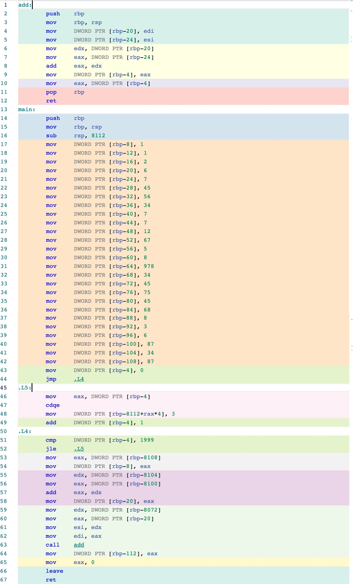
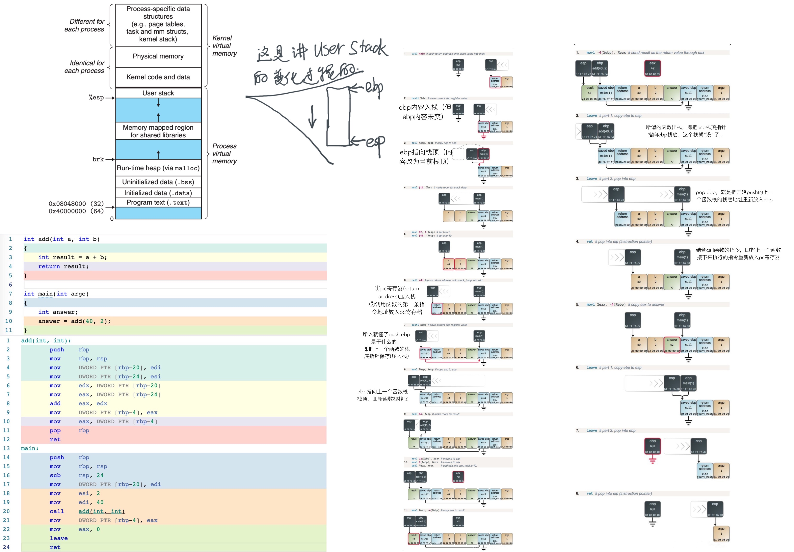
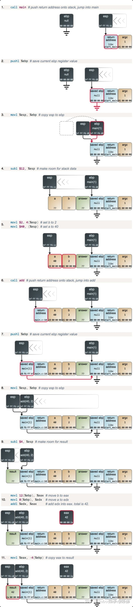
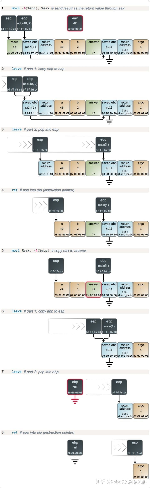
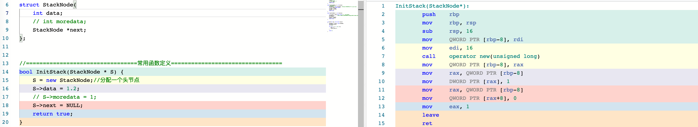
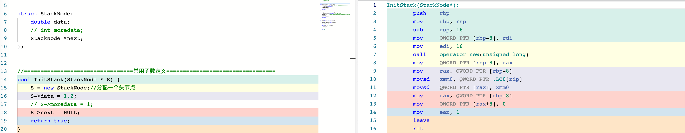
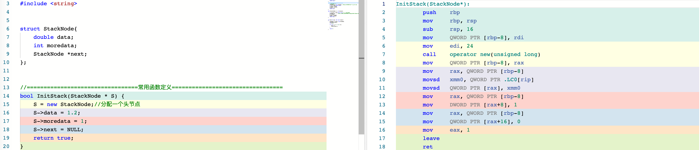
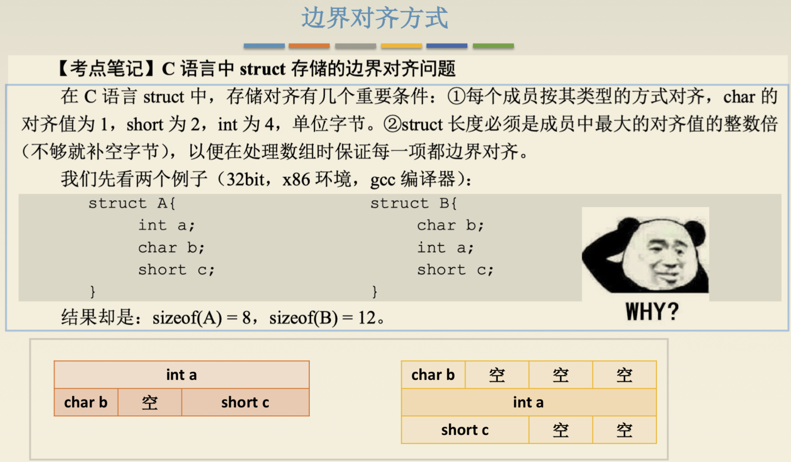

# 程序的机器级表示

当我刚接触汇编时，最费解的问题是：`int a = 1;` 中的 `a` 存在哪里？它可能被分配到寄存器或栈中，也可能在优化后被常量传播，甚至完全不再占用独立存储位置。编译器会把源代码中的名字映射为寄存器、地址或常量，最终生成相应的机器指令。

* 机器码通常不保留源代码中的变量名和函数名，而是使用寄存器编号、地址、偏移或立即数；调试信息和符号表可以另外保存名称与机器位置的对应关系。
* 数组名和函数名本身并不是指针对象，但数组表达式和函数指示符在许多表达式上下文中会分别转换为指向首元素和函数的指针。


## 编译环境及指令

[objdump指令的用法](https://ivanzz1001.github.io/records/post/linux/2018/04/09/linux-objdump)。

```shell
gcc -Og -S -masm=intel mstore.c -o mstore.s # 预处理并编译为 Intel 语法的汇编文件，-Og 表示进行兼顾调试体验的优化

g++ -E test.cpp -o test.i # 预处理，-o 指定输出文件名
g++ -S test.i -o test.s # 编译，生成汇编文件
g++ -c test.s -o test.o # 汇编，生成目标文件
g++ test.o -o test # 链接目标文件和所需库，生成可执行文件

objdump -d test.o # 反汇编目标文件

# 单文件直接生成可执行文件
g++ test.cpp -o test
# 多文件直接生成可执行文件
g++ test1.cpp test2.cpp -o test
```


macOS 上安装反汇编工具：

```shell
brew install binutils

# 使用 Homebrew 返回的实际安装前缀，兼容不同处理器和安装位置
BINUTILS_PREFIX="$(brew --prefix binutils)"
export PATH="${BINUTILS_PREFIX}/bin:${PATH}"
export LDFLAGS="-L${BINUTILS_PREFIX}/lib ${LDFLAGS:-}"
export CPPFLAGS="-I${BINUTILS_PREFIX}/include ${CPPFLAGS:-}"

# Homebrew 的 GNU 工具在 macOS 上通常带有 g 前缀
gcc -c test.c -o test.o
gobjdump -d test.o
```

## 函数调用栈（虚拟地址空间）


结合这个图，可以理解程序的汇编代码如何执行，例如函数如何跳转，以及 `push` 保存了什么内容。

（注意，这是虚拟地址空间。虚拟地址需要经过地址转换，并通过 Cache 或主存完成访问；TLB 查询和 Cache 索引在某些处理器中可以部分并行。虚拟地址连续也不意味着对应的物理页连续，但这不影响用该图理解栈帧的逻辑布局。）


## 汇编代码的意义？

可以使用 [Compiler Explorer](https://godbolt.org) 在线查看源码对应的汇编代码。

下面查看一段 C 代码，以及这个网站生成的汇编代码：


上图是 C 代码，不同颜色的代码行对应下图中相同颜色的汇编代码块：



例如第 61、62 行把两个实参放入 `esi`、`edi` 对应的参数寄存器。具体使用哪些寄存器及参数顺序由目标平台的 ABI 决定；被调用的 `add` 函数按照同一 ABI 从相应寄存器取得参数，从而完成函数参数传递。


栈空间的分配也很清楚：第 16 行将 `rsp` 减去 8112，相当于一次性为 `main` 函数的局部对象预留 8112 B 栈空间，而不是逐个使用 `push`。如果这些局部对象合计为 2028 个 4 B 单元，那么 `2028 × 4 B = 8112 B`，这就是 8112 的由来；实际布局还要服从 ABI 的对齐要求。


从第 2～12 行还可以看到，编译器能够把局部变量和参数完全保存在寄存器中时，就不必为它们分配栈空间，因此 `add` 函数没有调整 `rsp`。这点也是《深入理解计算机系统》3.7.1“运行时栈”中所讲到的。


## 所谓函数压栈，push/pop rbp 到底做了哪些事？


1. **函数开始push rbp做了什么？**

在 x86-64 中，`push rbp` 先把 `rsp` 减少 8 B，再把旧的 `rbp` 值写入 `[rsp]`。由于栈向低地址方向增长，栈空间增加时 `rsp` 的数值会减小。32 位 x86 的 `push ebp` 同理，只是步长通常为 4 B。

2. **函数结束leave（pop rbp）做了什么？**

① `leave` 通常等价于先执行 `mov rsp, rbp`，释放当前栈帧中的局部变量空间，再执行 `pop rbp`。

② `pop rbp` 从 `[rsp]` 读取调用者原来的帧指针并写入 `rbp`，随后把 `rsp` 增加 8 B，从而越过刚弹出的栈元素。

③ 此时 `[rsp]` 通常是 `call` 指令压入的返回地址，即调用者中 `call` 后一条指令的地址。

④ `ret` 从栈顶取出返回地址并写入指令指针 `rip`，随后增加 `rsp`。在 32 位 x86 中对应的指令指针是 `eip`。

⑤ 至此，控制流返回调用者，调用者的帧指针和栈指针也得到恢复。函数返回值放在哪里由 ABI 决定；x86 常用 `eax` 或 `rax` 返回整数和指针，而不是使用 `esp` 或 `rsp`。


具体见下文引用。


> 一个[不错的知乎专栏](https://zhuanlan.zhihu.com/p/54954221)：
>
> ### 源代码
>
> ```c
> int add(int a, int b)
> {
> 	int result = a + b;
> 	return result;
> }
> 
> int main(int argc)
> {
> 	int answer;
> 	answer = add(40, 2);
> }
> ```
>
> 
>
> ### main函数执行并调用add函数
>
> 
>
> ### add 函数返回过程
>
> 


## 408-2017 真题（一段 C 代码的汇编）

```c
int f1(unsigned n){
    int sum = 1, power = 1;
    
    for (int i = 0; i <=n-1; ++i){
        power *= 2;
        sum += power;
    }
    return sum;
}

int main(){
    unsigned x = 100;
    f1(x);
    return 0;
}
```

> [!NOTE]
> 当 `n == 0` 时，表达式 `n - 1` 会发生无符号下溢，使循环条件不符合直觉。若要覆盖这一输入，更稳妥的写法是 `for (unsigned i = 0; i < n; ++i)`。

我们再用[这个网站](https://godbolt.org)编译看看汇编代码：


例如真题中有一问涉及上图汇编代码第 10 行，即使用左移一位实现 `power * 2`。理解整个汇编过程后，这个问题就变得很简单了。


### 再看 objdump 反汇编

这时候再看反汇编指令就更容易理解了。下面是 macOS 下对上述 408 真题代码的反汇编结果，与 Linux 下的结果略有不同；若在上文网站中把编译器改为 Clang，结果会与下面的代码接近。

```assembly
a.out:     file format mach-o-x86-64


Disassembly of section .text:

0000000100000f20 <_f1>:
   100000f20:  55                      push   %rbp
   100000f21:  48 89 e5                mov    %rsp,%rbp
   100000f24:  89 7d fc                mov    %edi,-0x4(%rbp) ##这就是将edi存入[rbp-4]这个地址，也就是将这个传入的参数n，放到栈中
   100000f27:  c7 45 f8 01 00 00 00    movl   $0x1,-0x8(%rbp)
   100000f2e:  c7 45 f4 01 00 00 00    movl   $0x1,-0xc(%rbp)
   100000f35:  c7 45 f0 00 00 00 00    movl   $0x0,-0x10(%rbp)
   100000f3c:  8b 45 f0                mov    -0x10(%rbp),%eax
   100000f3f:  8b 4d fc                mov    -0x4(%rbp),%ecx
   100000f42:  83 e9 01                sub    $0x1,%ecx
   100000f45:  39 c8                   cmp    %ecx,%eax
   100000f47:  0f 87 20 00 00 00       ja     100000f6d <_f1+0x4d>
   100000f4d:  8b 45 f4                mov    -0xc(%rbp),%eax
   100000f50:  c1 e0 01                shl    $0x1,%eax
   100000f53:  89 45 f4                mov    %eax,-0xc(%rbp)
   100000f56:  8b 45 f4                mov    -0xc(%rbp),%eax
   100000f59:  03 45 f8                add    -0x8(%rbp),%eax
   100000f5c:  89 45 f8                mov    %eax,-0x8(%rbp)
   100000f5f:  8b 45 f0                mov    -0x10(%rbp),%eax
   100000f62:  83 c0 01                add    $0x1,%eax
   100000f65:  89 45 f0                mov    %eax,-0x10(%rbp)
   100000f68:  e9 cf ff ff ff          jmpq   100000f3c <_f1+0x1c>
   100000f6d:  8b 45 f8                mov    -0x8(%rbp),%eax
   100000f70:  5d                      pop    %rbp
   100000f71:  c3                      retq   
   100000f72:  66 2e 0f 1f 84 00 00    nopw   %cs:0x0(%rax,%rax,1)
   100000f79:  00 00 00 
   100000f7c:  0f 1f 40 00             nopl   0x0(%rax)

0000000100000f80 <_main>:
   100000f80:  55                      push   %rbp
   100000f81:  48 89 e5                mov    %rsp,%rbp
   100000f84:  48 83 ec 10             sub    $0x10,%rsp
   100000f88:  c7 45 fc 00 00 00 00    movl   $0x0,-0x4(%rbp)
   100000f8f:  c7 45 f8 64 00 00 00    movl   $0x64,-0x8(%rbp)
   100000f96:  8b 7d f8                mov    -0x8(%rbp),%edi
   100000f99:  e8 82 ff ff ff          callq  100000f20 <_f1>
   100000f9e:  31 c9                   xor    %ecx,%ecx
   100000fa0:  89 45 f4                mov    %eax,-0xc(%rbp)
   100000fa3:  89 c8                   mov    %ecx,%eax
   100000fa5:  48 83 c4 10             add    $0x10,%rsp
   100000fa9:  5d                      pop    %rbp
   100000faa:  c3                      retq 
```


## new 分配内存的汇编

```c++
// 示例：通过引用初始化栈顶指针，并显式处理内存分配失败。
#include <new>

struct StackNode {
    double data;
    StackNode *next;
};

bool InitStack(StackNode*& stack, double initialData) {
    stack = new (std::nothrow) StackNode{initialData, nullptr};
    return stack != nullptr;
}
```

几种不同数据大小下的汇编：

* int



* double



* double + int




### 分析

Q：为何把 `int` 改成 `double` 后，仍然申请了 16 B 的内存空间来存放这个 `struct`？

一个 `struct` 对象占用一段连续的虚拟地址空间，其中既包含各成员的数据，也可能包含编译器为满足对齐要求而插入的填充字节。编译器通常把成员访问转换成“对象基地址 + 成员偏移”的形式，例如 `S->data` 和 `S->next` 会使用各自固定的成员偏移。物理页是否连续则由内存管理系统决定。结构体是一种聚合数据类型，本身不能等同于面向对象思想。

结构体成员可以是基本类型、指针、数组、嵌套结构体、联合体等，但函数本身不能直接作为数据成员。结构体的对齐要求通常由其成员中最严格的对齐要求决定，并且还受 ABI、编译器选项和显式对齐声明影响。编译器会依次为成员安排满足对齐要求的偏移，并把结构体总大小向其对齐值的整数倍取整。因此，结构体大小不能用 `成员数 × 最大成员大小` 直接计算。例如，在常见的 64 位 ABI 中，`double` 和指针通常都占 8 B 且按 8 B 对齐，所以示例中的两个成员可以正好组成 16 B；换成较小成员后，也可能因为成员间填充或尾部填充仍然得到 16 B。寄存器宽度、内存页大小和 cache line 大小不是结构体对齐公式的依据。




一个不错的博客：

> 原文链接：https://blog.csdn.net/K346K346/article/details/49339767
>
> 下面以Visual C++编译器为例进行研究。
>
> ```c
> #include <stdio.h>
> 
> int mixAdd(int i,char c)
> {
> 	int tmpi=i;
> 	char tmpc=c;
> 	return tmpi+tmpc;
> }
> 
> int main()
> {
> 	int res=mixAdd(4,'A');
> 	printf("%c",res);
> }
> ```
>
> 在VS2017环境下，以C/C++默认的函数调用约定__cdecl来生成该程序的调试版本（Debug）的.
>
> (我们在Linux、Mac上再terminal中用gcc编译器一样，而且可以objdump反汇编生成类似有虚拟地址的汇编代码)
>
> ### 汇编代码
>
> mixAdd()函数对应的汇编代码是：
>
> ```assembly
> int mixAdd(int i,char c)
> {
> 00F713E0  push        ebp  
> 00F713E1  mov         ebp,esp  
> 00F713E3  sub         esp,0D8h  
> 00F713E9  push        ebx  
> 00F713EA  push        esi  
> 00F713EB  push        edi  
> 00F713EC  lea         edi,[ebp-0D8h]  
> 00F713F2  mov         ecx,36h  
> 00F713F7  mov         eax,0CCCCCCCCh  
> 00F713FC  rep stos    dword ptr es:[edi]  
> 	int tmpi=i;
> 00F713FE  mov         eax,dword ptr [i]  
> 00F71401  mov         dword ptr [tmpi],eax  
> 	char tmpc=c;
> 00F71404  mov         al,byte ptr [c]  
> 00F71407  mov         byte ptr [tmpc],al  
> 	return tmpi+tmpc;
> 00F7140A  movsx       eax,byte ptr [tmpc]  
> 00F7140E  add         eax,dword ptr [tmpi]  
> }
> 001E1411  pop         edi  
> 001E1412  pop         esi  
> 001E1413  pop         ebx  
> 001E1414  mov         esp,ebp  
> 001E1416  pop         ebp  
> 001E1417  ret  
> ```
>
>
> main()函数对应的汇编代码：
>
> ```assembly
> int main()
> {
> 001E1430  push        ebp  
> 001E1431  mov         ebp,esp  
> 001E1433  sub         esp,0CCh  
> 001E1439  push        ebx  
> 001E143A  push        esi  
> 001E143B  push        edi  
> 001E143C  lea         edi,[ebp-0CCh]  
> 001E1442  mov         ecx,33h  
> 001E1447  mov         eax,0CCCCCCCCh  
> 001E144C  rep stos    dword ptr es:[edi]  
> 	int res=mixAdd(4,'A');
> 001E144E  push        41h  
> 001E1450  push        4  
> 001E1452  call        mixAdd (01E1168h)
> 001E1457  add         esp,8
> 001E145A  mov         dword ptr [res],eax  
> 	printf("%c",res);
> 001E145D  mov         esi,esp  
> 001E145F  mov         eax,dword ptr [res]  
> 001E1462  push        eax  
> 001E1463  push        1E5858h  
> 001E1468  call        dword ptr ds:[1E92C0h]  
> 001E146E  add         esp,8  
> 001E1471  cmp         esi,esp  
> 001E1473  call        __RTC_CheckEsp (01E1136h)  
> }
> 001E1478  xor			eax,eax
> 001E147A  pop         	edi  
> 001E147B  pop         	esi  
> 001E147C  pop         	ebx  
> 001E147D  add        	esp,0CCh  
> 001E1483  cmp        	ebp,esp  
> 001E1485  call        	__RTC_CheckEsp (01E1136h)  
> 001E148A  mov         	esp,ebp  
> 001E148C  pop         	ebp  
> 001E148D  ret  
> ```
>
> 
>
>
> ### mixAdd()函数汇编代码详解
>
> 在进入mixAdd后，可以马上看到这样三条汇编指令：
>
> ```assembly
> push ebp      //保留主调函数的帧指针
> mov ebp,esp   //建立本函数的帧指针
> sub esp,xxx   //为函数局部变量分配空间
> ```
>
> 
>
> 这是所有C/C++函数的汇编代码所共同遵循的规范。其中ebp（Extended Base Pointer）为扩展基址指针寄存器，也被称为帧指针（Frame Pointer）寄存器，其存放一个指针，该指针指向系统栈最上面一个栈帧的底部。
>
> 一个栈帧起始位置由帧指针ebp指明，在函数运行期间，帧指针ebp的值保持不变。而栈帧的另一端由栈指针esp动态维护。esp（Extended Stack Pointer）为扩展栈指针寄存器，用于存放当前函数的栈顶指针。
>
> 在内存管理中，与栈对应是堆。对于堆来讲，生长方向是向上的，也就是向着内存地址增加的方向；对于栈来讲，它的生长方式是向下的，是向着内存地址减小的方向增长。在内存中，“堆”和“栈”共用全部的自由空间，只不过各自的起始地址和增长方向不同，它们之间并没有一个固定的界限，如果在运行时，“堆”和 “栈”增长到发生了相互覆盖时，称为“栈堆冲突”，程序将会崩溃。
>
> 在Debug模式下，一个C/C++函数即使没有定义一个局部变量，仍然会分配192B空间，供临时变量使用。如果定义了局部变量，则会为每个局部变量分配12字节的空间（大于任何基本数据类型）。mixAdd()函数中定义了两个局部变量，所以给局部变量和临时变量预留空间大小是192+12+12=216（D8h）。
>
> 接下来的汇编指令：
>
> ```assembly
> 00F713E9  push        ebx  //保存扩展基址寄存器，入栈
> 00F713EA  push        esi  //保存扩展源变址寄存器，入栈
> 00F713EB  push        edi  //保存扩展目的变址寄存器，入栈
> ```
>
>
> 以上汇编指令保存本函数可能改变的几个寄存器的值，这些寄存器在函数结束后恢复到进入本函数的时候的值。
>
> 接下来的汇编指令：
>
> ```assembly
> 00F713EC  lea         edi,[ebp-0D8h]      //获取栈顶地址
> 00F713F2  mov         ecx,36h             //赋36H至扩展计数寄存器
> 00F713F7  mov         eax,0CCCCCCCCh      //给扩展累加寄存器赋值
> 00F713FC  rep stos    dword ptr es:[edi]  //作用见下面解释
> ```
>
>
> stos指令：字符串存储指令，将eax中的值拷贝至es:[edi]指向的空间，如果设置了direction flag，那么edi会在该指令执行后减小，如果没有设置direction flag，那么edi的值会增加，这是为了下一次存储做准备。
>
> rep指令：重复指令，重复执行后面的指令，重复次数由扩展计数寄存器ecx决定。
>
> 因此，上面四条指令的作用是从栈的低地址到高地址将所有的预留空间填充CCCCCCCCh，未赋值的局部变量也就默认被设置为CCCCCCCCh。
>
> 接下来的汇编指令：
>
> ```assembly
> int tmpi=i;
> 
> 00F713FE  mov         eax,dword ptr [i]     //i赋值给eax
> 00F71401  mov         dword ptr [tmpi],eax  //eax赋值给tmpi
> 	char tmpc=c;
> 00F71404  mov         al,byte ptr [c]    	//c赋值给寄存器ax低8位al
> 00F71407  mov         byte ptr [tmpc],al 	//al赋值给tmpc
> 	return tmpi+tmpc;
> 00F7140A  movsx       eax,byte ptr [tmpc]  	//带符号扩展传送指令,将rmpc赋值给eax
> 00F7140E  add         eax,dword ptr [tmpi] 	//tmpi与eax相加
> ```
>
>
> 以下汇编指令，用于函数结束的清理工作：
>
> ```assembly
> 001E1411  pop         edi     //edi出栈，还原edi
> 001E1412  pop         esi     // esi出栈，还原esi
> 001E1413  pop         ebx     // ebx出栈，还原ebx
> 001E1414  mov         esp,ebp // 清空栈，释放局部变量
> 001E1416  pop         ebp     //源ebp出栈，恢复ebp
> 001E1417  ret                 //子程序的返回指令,结束函数
> ```
>
>
> 注意： 以上汇编代码对mixAdd()函数的调用采用的函数调用约定是__cdecl，这是C/C++程序的默认函数调用约定，其重要的一点就是在被调用函数 (Callee) 返回后，由调用方 (Caller)调整堆栈，因此在main()函数中调用mixAdd()的地方会出现add esp 8这条指令。esp加上8，是因为main()函数将两个参数压入栈，用于传给mixAdd()。感兴趣的读者可以将mixAdd()函数的定义改为如下形式：
>
> ```c
> int __stdcall mixAdd(int i,char c)
> {
> 	int tmpi=i;
> 	char tmpc=c;
> 	return tmpi+tmpc;
> }
> ```
>
>
> 即将mixAdd()函数的调用约定改为标准调用约定，那么mixAdd()函数结束时的汇编代码会变成ret 8，main()函数调用mixAdd()的地方会原本出现的add esp 8这条指令将会消失，这是因为__stdcall约定被调函数自身清理堆栈。有关函数调用约定的介绍见我的另一篇blog：关于函数参数入栈的思考。
>
> ### main()函数对应的汇编代码注意要点
>
> main()函数的汇编代码大致与mixAdd()相似，但也有不同之处，需要注意以下几点。
> （1）printf()函数参数的入栈和调用。
>
> ```assembly
> push        1E5858h  					//将”%c”入栈
> call        dword ptr ds:[1E92C0h]  	//调用printf()函数
> 
> 001E1471  cmp         esi,esp  
> 001E1473  call        __RTC_CheckEsp (01E1136h)  
> ```
>
> 

> [!NOTE]
> 这段引文分析的是 Visual Studio 2017、32 位 x86、Debug 构建和特定调用约定下的结果，不能推广为所有 C/C++ 函数的固定形式。编译器可以省略帧指针，也不会规定“每个局部变量分配 12 字节”；`0xCCCCCCCC` 是特定调试构建的填充值，不是 C/C++ 对未初始化局部变量的默认值。堆和栈的方向、位置及是否可能相遇也取决于平台和进程地址空间布局。原文代码注释中的 `rmpc` 应为 `tmpc`。
