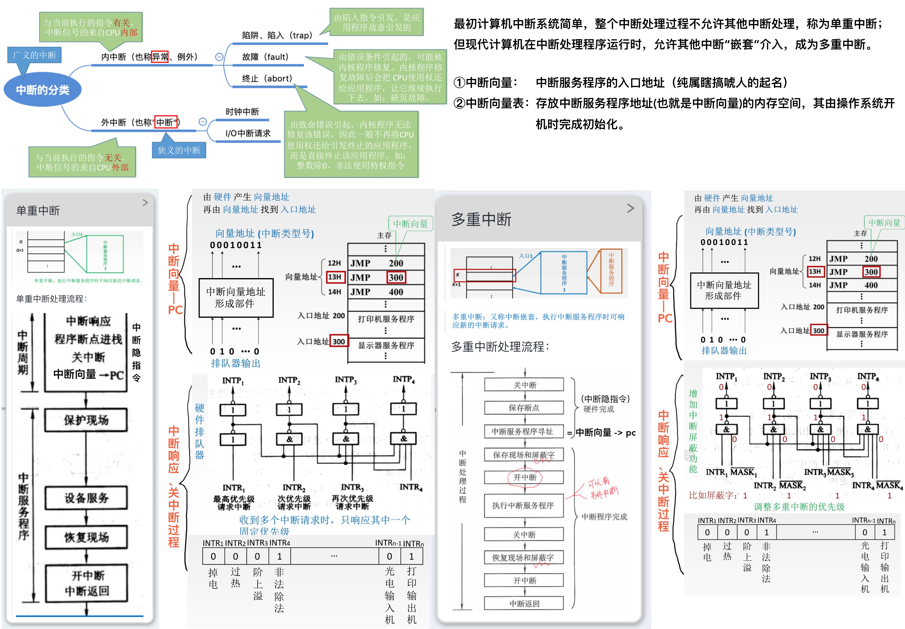

# I/O

I/O 外设通过总线或片上互连与 CPU 通信，常见的数据传送控制方式包括程序查询、中断和 DMA。

## 程序查询

## 中断

中断并不是专门为外设（I/O 设备）设计的。处理器通常使用相关的控制转移机制处理外部中断和内部异常，但二者概念不同：外部中断通常是异步事件，异常通常由当前指令同步触发；系统调用一般通过陷阱或专用指令进入内核。

外设的某些事件可以触发中断。中断控制器、处理器硬件和操作系统共同完成中断仲裁、现场保存与处理程序分派。其简化流程见下图：

## DMA

DMA 用于在外设与内存之间成批传输数据，避免 CPU 逐字节或逐字搬运。CPU 通常只需配置 DMA 描述符并在传输完成或出错时处理中断。键盘等低速设备适合按事件触发中断；磁盘、网卡等高吞吐设备则常结合缓冲区、DMA 和批量完成通知。非连续缓冲区可以通过多个描述符或散布/聚集 DMA 支持，但具体能力取决于 DMA 控制器和设备。

**程序查询、中断和 DMA 等 I/O 机制不仅需要处理器和芯片组支持，也需要设备控制器、固件、驱动程序和操作系统共同遵守相应的硬件接口与软件协议。**

