# Computer System

[toc]

---

废话不多说，先提几个正式系统性学习操作系统之前困扰我的问题：

1. 编译器是在操作系统之前被发明，那没有操作系统，现代编译器还能用吗？
2. 用户所谓的应用程序也都是用像编译操作系统一样的编译器编译而成的机械指令，为何执行会有区别（比如应用程序权限低等），换句话说：操作系统是什么实现的权限管理（在不调用系统API时）？
3. 虚拟内存也就是内存映射，能实现对操作系统的隔离保护，但是如何**让/不让**“用户/软件”访问硬件？（物理硬盘，物理内存，寄存器）
4. ？

[一个大致能回答上述一些问题的答案](https://www.zhihu.com/question/306127044/answer/555327651)。


> **关于《计算机组成原理》，推荐[《计算机组成：结构化方法》](https://book.douban.com/subject/1886058/)**


## 参考书籍/网站

* [Linux内核设计与实现](https://book.douban.com/subject/6097773/)
* [现代操作系统](https://book.douban.com/subject/27096665/)
* linux git 仓库
* [Linux Kernel Doc](https://www.kernel.org/doc/html/latest/index.html)
* [LXR](http://lxr.linux.no)
* [深入理解计算机系统](https://book.douban.com/subject/26912767/)
* [计算机组成：结构化方法](https://book.douban.com/subject/1886058/)
* [一个讲的非常不错的博客](https://manybutfinite.com/post/anatomy-of-a-program-in-memory/)

---


## 绪论

这里肯定是随便简单的说一说。


### 重要理念

1. CPU执行的都是机器指令，并不是用任何语言写的函数之类；另外，计算机是多米诺骨牌，不会说不：CPU只会执行下一条指令，它不会说不，所谓的禁止，只是它首先执行了一个判断的指令，比如判断你的内存地址，再执行判断后结果。 
2. 真实世界的界限并不明显：CPU制造商如Intel、AMD与操作系统厂商如Apple、MicroSoft是有深度的合作，从指令集到编译器再到内核众多C函数的实现，是由**它们深度合作开发**，并非“我做好了，你来适配”。


### 内核态和用户态

> 节选自Linux内核设计与实现：
>
> 用户界面是操作系统的外在表象，内核才是操作系统的内在核心系统其他部分必须依靠内核这部分软件提供的服务，像管理硬件设备、分配系统资源等。内核有时候被称作是管理者或者是操作系统核心。通常一个内核由负责响应中断的中断服务程序，负责管理多个进程从而分享处理器时间的调度程序，负责管理进程地址空间的内存管理程序和网络、进程间通信等系统服务程序共同组成。对于提供保护机制的现代系统来说，内核独立于普通应用程序，它一般处于系统态，拥有受保护的内存空间和访问硬件设备的所有权限。这种系统态和被保护起来的内存空间，统称为内核空间。相对的，应用程序在用户空间执行。它们只能看到允许它们使用的部分系统资源，并且只使用某些特定的系统功能，不能直接访问硬件，也不能访问内核划给别人的内存范围，还有其他一些使用限制。当内核运行的时候，系统以内核态进入内核空间执行。而执行一个普通用户程序时，系统将以用户态进入以用户空间执行。
> 在系统中运行的应用程序通过系统调用来与内核通信（见图1-1）。应用程序通常调用库函数（比如C库函数）再由库函数通过系统调用界面，让内核代其完成各种不同任务。一些库调用提供了系统调用不具备的许多功能，在那些较为复杂的函数中，调用内核的操作通常只是整个工作的一个步骤而已。举个例子，拿 print()函数来说，它提供了数据的缓存和格式化等操作，而调用 write函数将数据写到控制台上只不过是其中的一个动作罢了。不过，也有一些库函数和系统调用就是一一对应的关系，比如， open库函数除了调用 open系统调用之外，几乎什么也不做。还有一些c库函数，像strcpy根本就不需要直接调用系统级的操作。当一个应用程序执行一条系统调用，我们说内核正在代其执行。如果进一步解释，在这种情况下，应用程序被称为通过系统调用在内核空间运行，而内核被称为运行于进程上下文中。这种交互关系——应用程序通过系统调用界面陷入内核——是应用程序完成其工作的基本行为方式。

**值得注意的是，这与我们平常所谓的用户模式和管理员模式是完全两码事！**


### MMU与虚拟内存管理

> 由于所有的 Unix 内核都同宗同源，并且提供相同的 API，现代的 Unix 内核存在许多设计上的相似之处（请看参考目录中我所推荐的关于传统 Unix 内核设计的相关书籍）。Unix 内核几乎毫无例外的都是一个不可分割的静态可执行库。也就是说，它们必须以巨大、单独的可执行块的形式在一个单独的地址空间中运行。Uni 内核通常要硬件系统提供页机制（MMU）以管理内存。这种页机制可以加强对内存空间的保护，并保证每个进程都可以运行于不同的虚地址空间上。初期的 Linux 系统也需要 MMU 支持，但有一些特殊版本不依赖于此。这无疑是一个简洁的设计，因为它可以使 Lin 系统运行在没有 MMU 的小型嵌入系统上。不过现实之中，即便很简单的嵌入系统都开始具备内存管理单元这种高级功能了。


### 启动过程


> 这部分参考[阮一峰博客](http://www.ruanyifeng.com/blog/2013/02/booting.html)：
>
> 1. BIOS（Basic Input/Output System）
>
> 进行硬件检查，但它没这么能耐也没这个兴趣接管计算机，就按照设定（启动顺序，可以自行修改）检查并将控制权交给首位“硬盘”（现代计算机大多数情况都是硬盘）的第一个分区——MBR。
>
> 2. MBR（Master boot record）
>
> 它其实还有其他代替方案：GPT/GUID。它们有个共同的任务，就是让计算机读取分区表，从而引导操作系统内核被读入内存。这个工作具体交由MBR中一段代码——“主引导加载程序”来执行。若主分区中有一个为“激活分区”，也就是有特殊标识，则将其加载到内存（若不是你的代码，就凉了），若有多个分区，然后由下个程序（Boot Loader）接管，让用户选择启动哪个。
>
> 3. Boot Loader——系统内核
>
> 它就是加载这个分区的引导扇区，然后就是一系列操作——操作系统内核加载——init进程（所有进程的父进程），其中还包括[CPU从实模式切换到保护模式](https://www.cnblogs.com/cyx-b/p/11809742.html)。


* **但在linux中，所有进程都由init进程使用fork创建，那问题就来了：init进程怎么来的？还有，负责进程调度的进程何时被创建？那再其被创建之前的进程，或者它本身是如何被分配系统资源的？**

其实init进程（1号进程）的前面还有一个0号进程———[idle进程](https://cloud.tencent.com/developer/article/1339566)。第二个问题尚不清楚。


### 控制存储器---机器指令不是最后一步

编译器生成的机器指令，CPU并不能直接执行，而是


### 调度算法的总结

这部分内容在整篇


## 进程管理


#### 操作系统的调度程序如何调度自己？

简单来说，调度是个整体思想，不是一个想象的“上帝”在控制其他。在运行过程中：

一般是由用户进程“主动”的调用Block（或者其他如write）系统调用，来触发一系列的操作，包括发生中断，唤醒进程调度程序。另外，若一个用户进程的时间片到了，就由硬件触发中断，唤醒进程调度程序。

所以并不是进程调度程序处于一直在线或者“上帝视角”之类的状态，他和其他用户进程很像，除了他有更高的系统权限。


以下来自一个知乎回答：https://www.zhihu.com/question/46540636/answer/109725830

> **1：应用程序运行过程中，CPU被应用程序的任务占用，这个时候操作系统内核程序在什么地方？处于什么状态？**
>OS通常是通过中断来获得CPU时间的。也就是说如果你的电脑不触发**中断**，那么OS得不到CPU时间。
> 
> 通常来说OS是类似于精灵进程并不需要被调度，大多数情况下是**中断或者syscall/sysenter**触发了OS的中断处理/系统调用程序，然后OS干完活之后就会把控制权转交给用户进程。如果用户进程没有处于就绪态的，OS就去执行idle。这是非抢占式内核。
> 
> 一般系统调用和中断都会引起OS大多数模块工作状态的改变，比如**硬件中断**会触发进程/线程调度中某些进程的就绪/睡眠状态的切换，而很多**系统调用**会使得进程由就绪态进入睡眠态。和网络相关的中断通常会在内核的网络模块中转很长一圈，和fs有关的中断通常也会在fs相关模块被处理很长一圈
>**时钟中断**会触发计时和进程状态改变。
> 对于抢占式内核，在内核处理某些低优先级任务时，如果触发中断并且在处理完成后有进程进入了就绪态，内核有可能停下手中的任务转而去执行这个进程。所以叫抢占。
>
> **它是如何保持对应用软件线程状态的监控的？**
> **进程/线程调度模块**负责调度进程/线程，这个模块会维护一张**进程调度表**。
>**内存管理模块**会维护进程在内存中的状态。另外**进程控制块**还记录了进程的信息，比如页表。详见intel手册卷3的保护模式和分页，以及CR3寄存器。
> 
>嗯以上提到的内核中关于进程的数据结构可以认为都是一个东西的不同名字，不过OS确实可以把不同的数据分开存放，不过似乎这么干很傻
> [Process control block](https://link.zhihu.com/?target=https%3A//en.wikipedia.org/wiki/Process_control_block)
> [Paging](https://link.zhihu.com/?target=https%3A//en.wikipedia.org/wiki/Paging)
> 
>**2、操作系统内核调度程序自身的执行靠谁来调度？**
> 简单的说，是内核的其他模块。而这些模块又是直接或间接被中断/软中断/系统调用唤醒的。所以，**中断/软中断/系统调用**，其实系统调用和中断差不多，linux到现在还在用int 0x80
> [Interrupt](https://link.zhihu.com/?target=https%3A//en.wikipedia.org/wiki/Interrupt)
> [Scheduling (computing)](https://link.zhihu.com/?target=https%3A//en.wikipedia.org/wiki/Scheduling_(computing))
>
> **3、在机器码层面，操作系统与应用程序线程的通讯纽带是CPU寄存器吗？**
> 通常x64上的话所有的通用寄存器都会参与，但是更多的是**栈**，毕竟寄存器数量有限。因为存在**特权级切换**所以这里会有**栈复制**。
> 
>**内核调度程度是通过查看和修改CPU寄存器的值来完成调度的？**
> 不，内核通过**iret指令，sysret指令和sysexit指令**返回用户态。在x64上可能会有仅有的两个辅助段寄存器的参与，但是核心过程都是中断返回，因为牵扯到**特权级切换**所以必须用中断返回方法。
> **只要修改了寄存器的值，CPU就会自动完成线程的切换**？
> 在任何情况下，cpu控制权的移交只能由以下指令和中断完成。在IF清零时，只能由指令和NMI完成
> 跳转指令：
>jmp，jcc (short,near,far)
> 函数调用：
> call，ret (near,far)
>软中断/系统调用：
> int，syscall，sysenter
> 中断返回/软中断返回/系统调用返回：
> iret，sysret，sysexit
> 
> 嗯关于分页和CR3的事情还是查查手册再说
> 你要是去看了下面这俩(尤其是第二个)，那计算机组成原理/计算机体系结构/汇编语言/操作系统你可以不去上课了=.=
> [Expanded Main Page](https://link.zhihu.com/?target=http%3A//wiki.osdev.org/)
> [Intel® 64 and IA-32 Architectures Software Developer Manuals](https://link.zhihu.com/?target=http%3A//www.intel.com/content/www/us/en/processors/architectures-software-developer-manuals.html)


以下来自另一知乎回答：（这个回答不错我感觉，大致意思是：不是操作系统调度程序或者中断程序一直工作，而是由用户之手，借着某些进程，触发了这种中断，激活了相应的内核进程，比如用于进程调度的。）

> 作者：sonald----链接：https://www.zhihu.com/question/46540636/answer/102247496
>
> 1：应用程序运行过程中，CPU被应用程序的任务占用，这个时候操作系统内核程序在什么地方？处于什么状态？
>
> 你得换个角度看待操作系统。在操作系统完成初始化并运行第一个进程（/sbin/init）后，你可以认为操作系统是不存在的，有的只是很多的进程（线程在Linux下也是一个进程实例，只是在一些属性上有区别），它们交替使用CPU和各种硬件资源。每个进程都有用户态的部分和内核态的部分。当然这个交替不是主动的，而是由硬件或者各种内核事件驱动的。所以操作系统（内核）本身不是一个独立的执行体，它是代表进程执行某些受控的操作（比如IO、分配物理内存、设备访问等），这些操作基本上都是用户发起的。所以你把内核当成一个库来看更合适。


### 任务队列（task list）

Task List 是一个双向循环链表（**Link List**），储存在内存某个位置，其中每一项都是个结构（**task_struct**），称为**进程描述符/进程控制块（PCB）**。该结构定义在`<Linux/sched.h>`中，该结构描述了该进程打开的文件、所在的内存地址空间、挂起的信号、进程的状态等。

```c
struct task_struct {
 volatile long state; /* -1 unrunnable, 0 runnable, >0 stopped */
 void *stack;
 atomic_t usage;
 unsigned int flags; /* per process flags, defined below */
 unsigned int ptrace;
 int lock_depth; /* BKL lock depth */ 
 /* ...... */ 
};
```
Linux使用slab分配`task_struct`，其在该进程内核栈底端创建一个`thread_info`的struct，其存放着`task_struct`的地址偏移量。


> **节选自《Linux内核设计与实现》3.3.2**
>
> 上文 `task_struct` 中有一个 `stack` 成员，而 `stack` 正好用于保存内核栈地址。内核栈在进程创建时绑定在 `stack` 上。可以观察 `fork` 流程：Linux 通过 `clone()` 系统调用实现 `fork()`，然后由 `fork()` 去调用 `do_fork()`。定义在<kernel/fork.c>中的 `do_fork()` 负责完成进程创建的大部分工作，它通过调用 `copy_process()` 函数，然后让进程运行起来。`copy_process()` 完成了许多工作，这里重点看内核栈相关部分。`copy_process()` 调用 `dup_task_struct` 来创建内核栈、`thread_info` 和 `task_struct`：

```c
static struct task_struct *dup_task_struct(struct task_struct *orig) { 
 struct task_struct *tsk;
 struct thread_info *ti;
 unsigned long *stackend;
 int err; prepare_to_copy(orig);
 tsk = alloc_task_struct();
 if (!tsk) return NULL;
 ti = alloc_thread_info(tsk); 
 if (!ti) { 
  free_task_struct(tsk);
  return NULL; 
 } 
 err = arch_dup_task_struct(tsk, orig);
 if (err) goto out;
 tsk->stack = ti;
 err = prop_local_init_single(&tsk->dirties);
 if (err) goto out;
 setup_thread_stack(tsk, orig);
 stackend = end_of_stack(tsk);
 *stackend = STACK_END_MAGIC;
 /* for overflow detection */
 #ifdef CONFIG_CC_STACKPROTECTOR 
 tsk->stack_canary = get_random_int();
 #endif 
 /* One for us, one for whoever does the "release_task()" 
 (usually parent) */
 atomic_set(&tsk->usage,2);
 atomic_set(&tsk->fs_excl, 0);
 #ifdef CONFIG_BLK_DEV_IO_TRACE
 tsk->btrace_seq = 0;
 #endif 
 tsk->splice_pipe = NULL;
 account_kernel_stack(ti, 1);
 return tsk;
out:
 free_thread_info(ti);
 free_task_struct(tsk);
 return NULL; 
}
```


#### 页表基址寄存器（pagetablebaseregister,PTBR）

在内存管理中会细聊这个问题，这里只是提一下，页表的查询也是记录在这个task_struct的。


### Linux 中线程的实现

> 本段参考《Linux内核设计与实现》3.4节，与《现代操作系统》2.2.2及2.2.3

在Linux中，每个线程有唯一属于自己的task_struct，所以它在内核中，看起来就像是一个普通的进程（只是线程和其他一些线程共享资源，如地址空间）。**但没这么简单，线程和进程还是有很多区别的，线程的机制没有阻塞，也没有保护，这是因为进程之间往往是不同的程序员实现不同的功能写的代码，它们是由天生的竞争性的，而线程总是由同一程序员编写，会自行设计线程的相互协调问题。**


而相反，Windows中线程机制的实现有很大的不同，它往往会有一个包含指向四个不同线程的指针的进程描述符，该描述符负责描述像地址空间、打开的文件这样的共享资源，线程本身再去描述它独占的资源。


#### 创建线程

线程使用clone函数创建，其与进程的创建基本类似，只是在调用clone的时候需要传递一些参数标志位来指明需要共享的资源：

```c
clone(CLONE_VM | CLONE_FS | CLONE_FILES | CLONE_SIGHAND, 0);
```

其与fork的不同 (fork最终是clone) 在于父子“线程”共享地址空间、文件系统资源、文件描述符、信号处理程序。


#### 进程终结

`exit()`系统调用是用来终结进程的，也可能隐式地从某个程序的主函数返回（其实c编译器会在main函数的返回点后面放置调用`exit()`的代码）


#### 进程互斥

> 本段节选自《现代操作系统》2.3.2 

要使得进程之间互不干扰的访问某些共享系统资源，系统需要如何调度进程，让每个进程都有机会访问，且不会出错，具体需要满足以下几点：


* 任何两个进程不得处于一个临界区
* 不应对CPU速度和数量做任何假设
* 临界区外运行的进程不得阻塞其他进程
* 不得使进程无限期等待进入临界区


##### 信号量

```c++
// 信号量(semaphores)
struct semaphore
{
    int value;          //剩余资源数
    struct prosess *L;  //等待队列
};

//进程进入临界区前的wait操作，这是“原子操作”，也称原语，执行此函数时，操作系统会暂时屏蔽所有中断
void wait(semaphore & S){
    S.value--;
    if (S.value < 0){
        block(S.L) //若资源“忙碌”，主动阻塞自己（加入等待队列）
    }
}

//进程使用完资源后，通过signal原语释放
void signal(semaphore & S){
    S.value++;
    if (S.value <= 0){
        wakeup(S.L); //若释放资源后。等待队列还有进程，则唤醒它
    }
}
```


*  使用信号量实现同步

```c++
//信号量机制实现进程同步（保证进程间的先后顺序），需要设置“同步”信号量S，初始为0
semaphore * S;
S->value = 0;

//前操作之后执行V(S)
P1(){
    代码1;
    V(S);
    代码3;
}

//后操作之前执行P(S)
P2(){
    P(S);
    代码4;
    代码5;
}

```


## 系统调用

由于内核“抢先”拥有了设备控制权（因为开机BIOS“首先”加载内核），所以除它本身，其余指令“都”被认为是用户程序，经由它筛选执行。而如果用户程序想要访问某些硬件（绝大部分都是必要的），只能通过系统调用（操作系统提供的函数）来实现。而这一组函数再被封装，就被称为API了。

* **API不是系统调用，它们一般是操作系统厂商写好的一组系统调用的集合，让用户使用更加方便。**


由于内核是C语言写的（开始汇编写了很多，后来大部分用C重写），所以系统调用一般就是指的C库的众多函数。

> **C库不完全是系统调用，部分是系统调用**（这一部分有些是汇编写的，因为没有对应的C函数可以用）；部分则是在系统调用和系统API之上的封装 **[ Unix一般就是直接在系统调用上封装，Win的C库是在Win32API（Win32API是对Windows系统调用的封装）之上封装 ]** ，这部分也就是C标准库。之所以Windows多了一环，就是没有遵循Unix设计理念和规范，所以需要封装一层适配来实现C标准库的跨平台。
>
> **所以C库有一部分属于操作系统内核，而标准库属于用户层，而我们自行安装的整个GCC/Clang都是在用户层（没有关于操作系统内核那一部分代码）工作。** 它们也就是对应的所谓内核态和用户态。

API的函数一般会利用一组系统调用来集成。比如Unix标准结构规范就将这标准化——POSIX。POSIX表示可移植操作系统接口（Portable Operating System Interface of UNIX，缩写为 POSIX ），POSIX标准定义了操作系统应该为应用程序提供的接口标准（也就是它定义了API长啥样），是IEEE为要在各种UNIX操作系统上运行的软件而定义的一系列API标准的总称，但Windows也对其做了适配。


**Q：既然内核操作硬件是用C写的函数，那么我（用户）写相似的代码，为什么不能访问或操作硬件？**

A：正如本节开头所讲，内核在开机时抢占了硬件控制权，你如果不用它提供的函数访问或操作硬件，那么它拒绝指令这个执行，比如某些直接访问物理内存的指令？

**Q：用户程序也是被编译成汇编、机器码，这时内核如何知道它（这些机器指令）是否使用了系统调用来访问硬件？**

A：因为CPU制作商同操作系统厂商一起设定的在CPU层级的权限认证机制。而且同样如上述，系统内核及众多系统服务是被加载到特殊的内存空间，而后CPU就会把这个内存空间的指令设为高权限。而用户写的程序，在编译后，某些机器指令如访问某些“敏感”寄存器等，就会被否决。而用户程序若通过系统调用访问硬件，则运行时该指令是跳转到内核内存段执行的，所以可以执行。主板上电的那一刻，就决定了BIOS指定的硬盘的某个特殊分区的特殊文件会被首次加载到内存，而它将完全控制硬件，它在大多数情况，便是我们熟知的操作系统。

> 有两个重要的概念需要说明：
>
> 1. CPU执行的都是机器指令，并不是用任何语言写的函数之类；另外，计算机是多米诺骨牌，不会说不：CPU只会执行下一条指令，它不会说不，所谓的禁止，只是它首先执行了一个判断的指令，比如判断你的内存地址，再执行判断后结果。 
> 2. 真实世界的界限并不明显：CPU制造商如Intel、AMD与操作系统厂商如Apple、MicroSoft是有深度的合作，从指令集到编译器再到内核众多C函数的实现，是由它们深度合作开发，并非“我做好了，你来适配”。


### 系统调用、中断、内核态、用户态、地址空间、库


#### 代码的“层次结构”

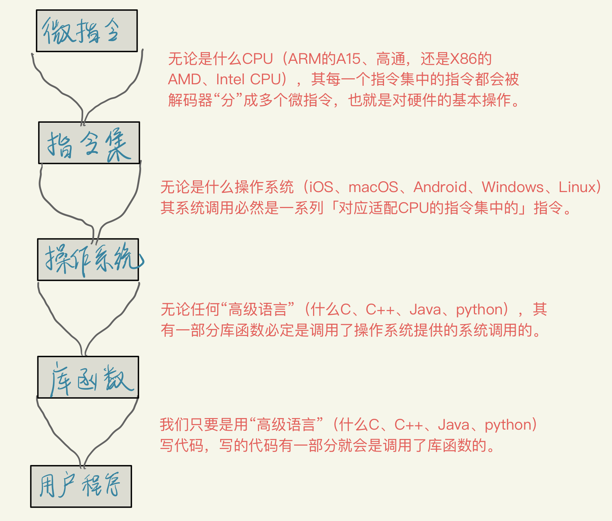

#### 库函数和系统调用的过程分析

见下图：


#### 系统调用在汇编的“样子”

[一个知乎回答](https://www.zhihu.com/question/478194909/answer/2061172032)，见下图：


#### 什么是“硬件完成”？**

** 什么是“硬件完成”？什么是操作系统完成(操作系统算法不是由硬件完成的吗？)？**

> **凡是一系列操作是由单条指令（机器码）完成的，我们就说这些操作就是硬件完成的。**
>
> **若是一系列“操作”是由多条指令完成的，且在内核态，则我们称这是由操作系统完成的。**
>
> **若是一系列“操作”是由多条指令完成的，且在用户态，则我们称这是由用户进程完成的。**
>
> 形象说明一下：
>
> **1. 若实现该指定功能的一系列操作在CPU不变，更换操作系统不可能改变时，就是由硬件实现的（也就是这些操作的单位小于该CPU指令集中的单条指令）**
>
> **2. 若实现该功能的一系列操作在操作系统不变时，更换不同的用户进程并不改变时，就是由操作系统完成的。（其单位大于一个指令）**
>
> **注：**
>
> **1. 所谓操作，即CPU将指令解码成的微操作。**
>
> **2. 所谓内核态和用户态，本质上就是地址空间（和CPU上下文）的切换。只不过内核态这个地址空间的指令拥有更高的“指令执行权”。**


#### 中断的过程

王道和很多课程中讲的，往往是8086这种上古处理器的中断过程。当然这样还是值得一看先：


[一个知乎回答](https://www.zhihu.com/question/47862508/answer/110694813)：

> 
>
> 我们先看一张全景（示意）图：
>
> 
>
>
> 一个系统的的中断系统通常是类似这样的组成，我们应该注意到，设备眼中的中断，中断控制器眼中的中断，还有CPU眼中的中断，都不是同一个概念。所以，当我们说“关中断”一类的说法的时候，对它们三者也是不一样的。
>
> 
>
> 设备的中断，是设备要产生一个事件通知CPU，事件的产生的方法有很多，最简单的是在一条信号线上产生特定的电平（电平中断，比如平时都是高电平，拉低了就表示有中断了），或者产生一次电平变化（边缘触发中断），复杂的可以很复杂，比如在总线上发送特定消息或者消息序列。对设备“关中断”，指的仅仅是让这个设备不要再提供中断信号了，但如果中断控制器已经获得这个中断信号，这个中断信号还是会报到CPU上的。
>
> 中断控制器，是对多个设备的中断进行采样，排队，分发的机制。对中断控制器说：关中断，是让中断控制器不要给CPU（或者上级）发送中断信号了，设备报不报信号上来，这些信号是否被排队，那是另一个问题。
>
> 最后，是对我们软件程序员最熟悉的CPU了，CPU的中断，是CPU核上有一条中断线，当这条线加上合适的电平或者信号，CPU核就会从当前的执行上下文中，直接跳转到中断处理程序中执行。在CPU的角度上关中断，就是跟CPU说：就算现在你的中断线上有中断，也不要执行“跳转到中断处理程序”这个动作。
>
> CPU能认识的就仅仅是中断线和中断处理程序这些概念。所谓线程，进程，软中断等概念，是软件发明出来的，CPU是不认识的。所谓线程，本质上是保存CPU运行状态的一种形式，CPU的运行状态，就是CPU的所有寄存器的内容的集合（包括用来控制中断的寄存器），线程的作用就是可以把这些寄存器都保存下来（其实还有软件本身的堆栈等其他信息，但我们这里不关心软件，先忽略），然后用另一个保存的状态刷新CPU的状态，让CPU感觉自己在运行到另一个上下文上。OS对CPU不断进行状态的切换，保存上一个状态，加载下一个线程的状态，就实现线程切换了。至于进程，本质上可以认为是线程切换的同时也会切换地址空间。这里我们混用这两个概念。


## 内存管理

现代内存系统非常复杂：**虚拟内存、硬盘映射、多级缓存预取**等等。CPU从内存取指令和数据在当今计算机系统中占比微乎其微。最大程度缓解CPU到内存延迟的当属cache：cache如何从内存预取、多级cache如何配合、CPU在cache不命中时如何取址？这全部由硬件负责。

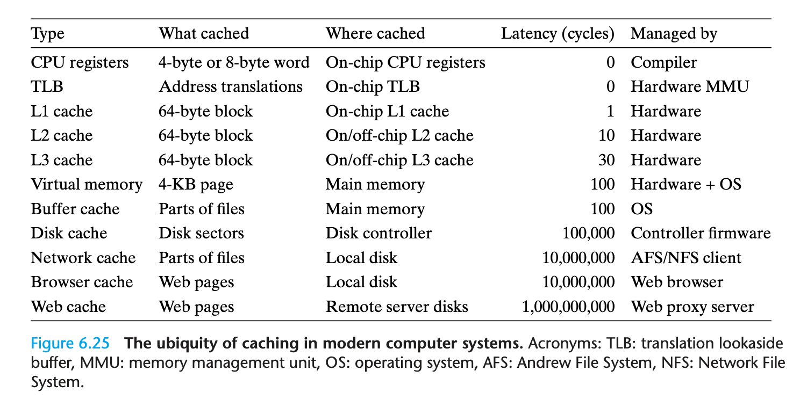

### 内存地址空间！


**关键问题是：顺序还是分页，分段还是分页，当然可以有折中的做法，就是段页式，也是下文中提到的。**

值得注意的是，本节下述内容已经过时（2021年），在《现代操作系统》3.9小结中提到：如今UNIX和windows（x64）不支持真正意义的分段了。

**但，物理内存不支持分段，虚拟内存地址空间（编译器生成）还是会分段的：[这个视频第49分钟](https://www.youtube.com/watch?v=IpspU4yXGPQ&list=PLjAs5kw1NNs39x5O23T-plIzer0pwFrPv&index=19)**，咸鱼讲的不错（关于程序虚拟地址空间、函数的执行与调用）。

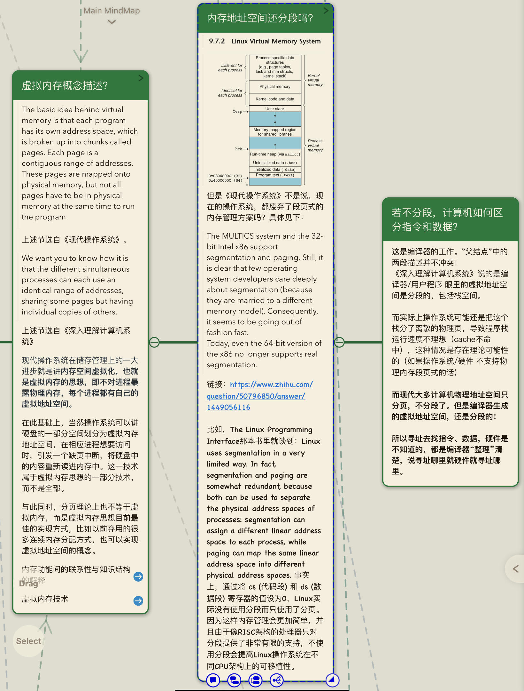


> 下图文引用自一个博客https://manybutfinite.com/post/anatomy-of-a-program-in-memory/
>
> 其中文译文：https://www.cnblogs.com/xkfz007/archive/2012/10/08/2715163.html


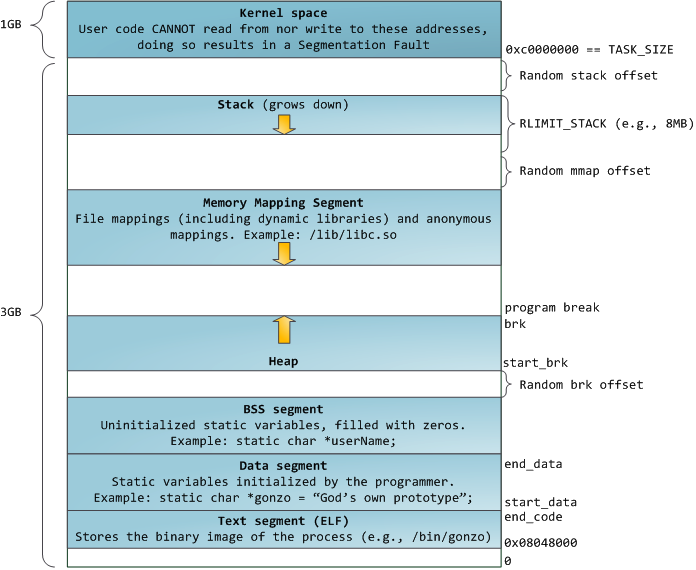

 进程地址空间中最顶部的段是栈，大多数编程语言将之用于存储局部变量和函数参数。调用一个方法或函数会将一个新的**栈桢**（stack frame）压入栈中。栈桢在函数返回时被清理。也许是因为数据严格的遵从LIFO的顺序，这个简单的设计意味着不必使用复杂的数据结构来追踪栈的内容，只需要一个简单的指针指向栈的顶端即可。因此压栈（pushing）和退栈（popping）过程非常迅速、准确。另外，持续的重用栈空间有助于使活跃的栈内存保持在CPU缓存中，从而加速访问。进程中的每一个线程都有属于自己的栈。


最后，我们来看看最底部的内存段：BSS，数据段，代码段。在C语言中，BSS和数据段保存的都是静态（全局）变量的内容。区别在于BSS保存的是未被初始化的静态变量内容，它们的值不是直接在程序的源代码中设定的。BSS内存区域是匿名的：它不映射到任何文件。如果你写static int cntActiveUsers，则cntActiveUsers的内容就会保存在BSS中。


### 进程与内存管理？

> 下图文依然引用自上面那个博客https://manybutfinite.com/post/anatomy-of-a-program-in-memory/
> 其中文译文：https://www.cnblogs.com/xkfz007/archive/2012/10/08/2715163.html

上章《进程管理》中我提到了一个页面相关的寄存器，还提到其也在进程描述符（也被称为PCB），也就是task_struct中，在这里细细道来。

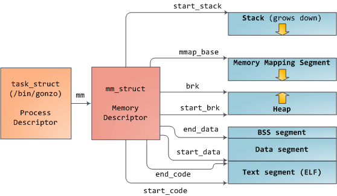

Linux进程在内核中是由task_struct的实例来表示的，即进程描述符（PCB）。task_struct的mm字段指向**内存描述符**（memory descriptor），即mm_struct，一个程序的内存的执行期摘要。它存储了上图所示的内存段的起止位置，进程所使用的物理内存页的[数量](http://lxr.linux.no/linux+v2.6.28.1/include/linux/mm_types.h)（**rss**表示Resident Set Size），虚拟内存空间的[使用量](http://lxr.linux.no/linux+v2.6.28.1/include/linux/mm_types.h)，以及其他信息。我们还可以在内存描述符中找到用于管理程序内存的两个重要结构：**虚拟内存区域**集合（the set of virtual memory areas）及**页表**（page table）。内存区域如下图所示：

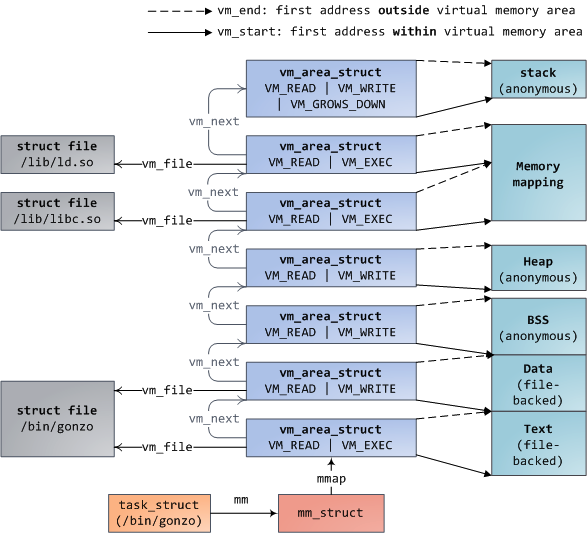


### 页

最早的计算机并没有用页来管理内存（这是个很棒的想法），而只是把系统区和用户区分开（这表述的是已经使用虚拟内存技术的计算机操作系统），用户区如何分配与回收内存？

> 引用自《现代操作系统》3.2.3---空闲内存管理
>
> 一般采用一个循环链表（当然也可以用位图），使用首次适配算法（first fit）顺序搜索能用的连续内存块。
>
> 当然也有几个挺有想法但均被证明没啥卵用的算法，比如最佳适配（best fit）和下次适配（next fit），很明显：**空间利用率，空分区大小，分配速度。三者不可兼得。**
>
> 当然，下面讲到的用页来管理内存就做到了“兼得”，这当然也是有代价的------就是增加了硬件成本（额外几个寄存器与单独的MMU），也增大了研发成本（但通用的算法一劳永逸，所以这代价长远来看不是问题）


现代计算机系统将内存等分为若干页（**这个表述是不严谨的，虚拟内存空间分成页/page，而物理内存空间分成页框/page frame，这两者大小通常都是一样的，但这是两个概念**），比如64位系统每个内存页为8KB。上节中所述的`task_struct->mm_struct`结构体成员用来保存该进程的页表。在进程切换的过程中，内核把新的页表的地址写入CR3控制寄存器（页表基地址寄存器（PTBR）指向页表）。

正如上述（上章）的`task_struct`，内核用`struct page`来管理页，页的概念不仅是在内核中体现，现代计算机有专门的硬件来管理内存——MMU。

```c
struct page {

 /* ...... */ 
};
```

**Question：page是用来描述虚拟内存还是物理内存的？**

> 引用自《Linux内核设计与实现》12.1
>
> 内核用struct page结构表示系统中的**每个物理页**，这得多浪费啊！但是这个struct也就占40B内存，若4GB物理内存，所有的page结构体也就占用20M，是可以接受的。


#### 地址转换过程

> 下图引用自王道考研课件

PCB（linux中也就是task_struct）中存放着这个页表初始地址（实际更复杂，这只是另一个内存描述符struct指针，内部存放着很多内存管理信息），进程被运行时，操作系统把这个量加载到专用的这个页表寄存器中，然后和其要访问的逻辑地址页号相加，找到对应页表中的物理地址页号（也称为页框号），再加上页内偏移量就找到了实际的地址。

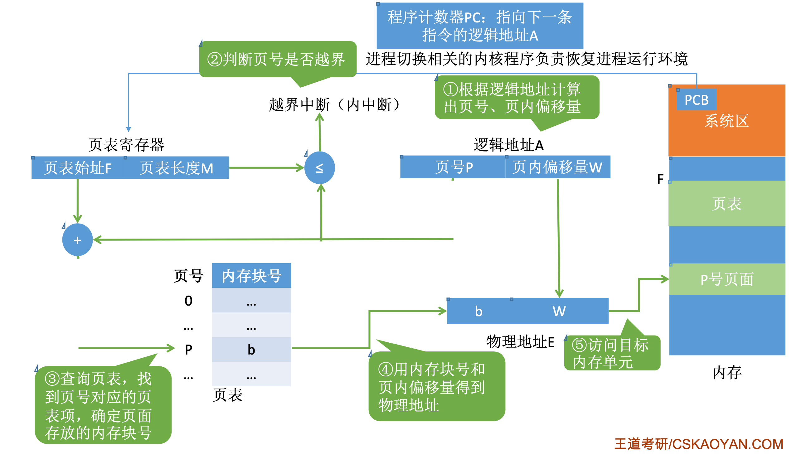


其实实际情况比这还要复杂：**一方面是现代计算机内存很大，虚拟地址空间也很大，一个页表太大会拖慢计算搜索的速度，所以现代计算机大多采用多级页表；另一方面，每次地址访问都要到内存中“绕道”一圈，效率太低，积极上，访问内存机会很小，因为大多情况都被cache命中，而对于访存时要绕道访问的页表，也是单独有它的cache----TLB。**

注：页表一般是像数组一样连续存放在内存块中的，这样做是为了便于快速查找，但是页表也是放在页框中的，所以尽可能的让页框大小是页表项的整数倍。


**Question：页表项的大小是多少？只有内存块号吗？还是全部地址长度？why？**

实际的页表远比上图复杂，因为要求页表顺序存储，所以不需要空间存放索引；因为在绝大多数情况，虚拟内存的页面大小和物理内存的页框大小是一样的，所以其页内偏移量（也就是低n位地址）是一致的，所以它不需要存在页表项中。

但页表项中不仅仅有内存块号（页框号/物理页号），还有很多标志位（控制信息）如：该内存块权限、是否内存命中。


### MMU

MMU是CPU的一部分，每个处理器core都有一个MMU，包含：

- **TLB（Translation Lookaside Buffer）**：是页表的高速缓存（一般在L2缓存或L1缓存中的独立结构，不算其容量，现代CPU甚至有多层TLB，相当于“同时”存在于L1和L2），存储着最近转化的一些目录项。
- Table Walk Unit：负责从页表中读取虚拟地址对应的物理地址


> **下图描述了有TLB的计算机的寻址过程：**（此图节选自王道考研的PPT）

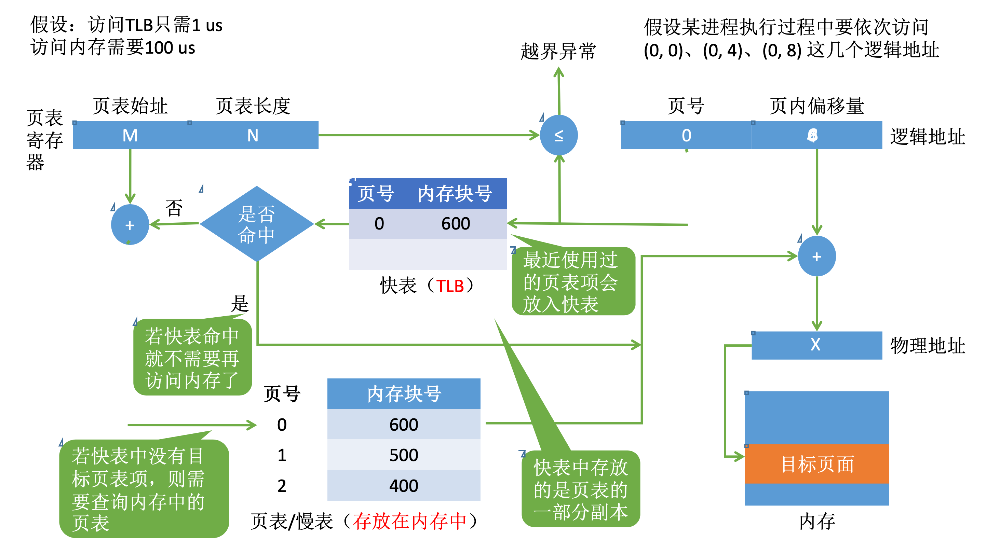


### 多级页表

另一个提高访问效率与内存利用率的方式就是多级页表。

使用多级页表一个重要的原因是我们使用页表的初衷是为了让进程的虚拟内存在物理内存中能够离散存放，提高空间利用率与灵活性。然而对于每个进程，要保证访存效率，需要页表连续存放，而页表的大小并不小（需要**虚拟地址空间/页面大小**那么大），这显然违背了初衷。

所以使用多级页表，最好的情况就是**一个“上级”页表项所指向的页表正好占用一个页框大小**。


### 内存扩充（交换与虚拟内存）

内存“永远”都不够用，所以我们把一部分硬盘的地址空间“纳入”内存。当然，如果就简单的纳入，访存延迟会指数级暴增！所以我们需要一系列的算法逻辑，让不常用的进程去硬盘待着，常用的进程依然在内存中，这样就达成了虚拟内存的空间很大（是对于进程来讲）而物理内存利用率更高的效果。

> 值得注意的是：虚拟内存这个概念有歧义，一方面**地址空间**常被称为虚拟地址空间，以用来对比物理地址空间，上段提到的“虚拟内存的空间”就是这个虚拟地址空间，而这是个不严谨的说法。而严谨的虚拟内存指的是将硬盘（外存）部分地址空间纳入内存中。

关于上述的实现有两种不同的方式，其有一定的相似度又有所不同：一是**交换技术（swapping）**，二是**虚拟内存（virtual memory）**。这两者最重要的不同就是交换技术无法分离同一进程的地址空间，也就是至少把一整个进程加载到内存中（从外存/硬盘），所以就不允许运行所需逻辑地址空间超过实际物理地址的进程。而虚拟内存技术就是对其的改进，既能将不常用的进程随时换出内存，还可以把进程中的逻辑地址空间进一步划分，部分的加载到内存中。

**虚拟内存技术有很多好处：**

* 这扩充了逻辑内存空间，使得游戏等大型软件的运行成为可能。
* 这会加快软件的加载速度，因为不需要全部加载到内存就可以运行。

当然，**虚拟内存也是建立在增大了操作系统开发难度、系统进程开销的基础之上的**，比如这需要操作系统硬盘内存联合动态管理，访存不存在时负责将进程的硬盘代码数据读入内存中。不过事实证明，这些代价是值得的。


#### 各类缓存、TLB、虚拟内存的设计初衷和思路是一模一样的！

> 思路就是本次用到的指令和数据周围的部分数据加载一个副本到更快速的存储介质中，以便更高效率访问与修改。
>
> 
>
> 这背后的原因就是所谓的**局部性原理**：
>
> * 现在访问的指令，不久还是会被访问（因为程序中不可避免的有大量循环）
> * 现在访问的地址周围的内存空间，不久大概率被访问（因为程序内存在局部上还是连续存放的，即使有各种离散存储的技术）


**硬件和操作系统的所谓预测机制都很“弱智”**：

> 值得注意的是，这种所谓的预测与命中，都是很“低级”的算法：因为这是针对底层硬件和系统的，系统在执行一条或几条指令的时间开销很低，若应用更“高级”的算法，大大增加了系统调度开销，会得不偿失；另一方面，在机器指令这一级别，局部性非常强，所以命中率很高。
>
> 这就像是物理学中宏观和微观的规律之间的矛盾，微观现象造就了宏观现象，却有着和宏观不同的规律，这点的确有趣，且令人费解。


#### 页面置换

一个页面在不在内存中？若不在，在硬盘的哪个地址中？这些信息还是被记录在页表中，也就是我们上文中（**页->地址转换过程 -> Question**）提到过的那些页表项的控制位。其实下图没有提到一些关于权限和优先级的控制位，比如系统内核等重要区段是不可以被换出内存的，所以会有一个标志位表示这个信息。

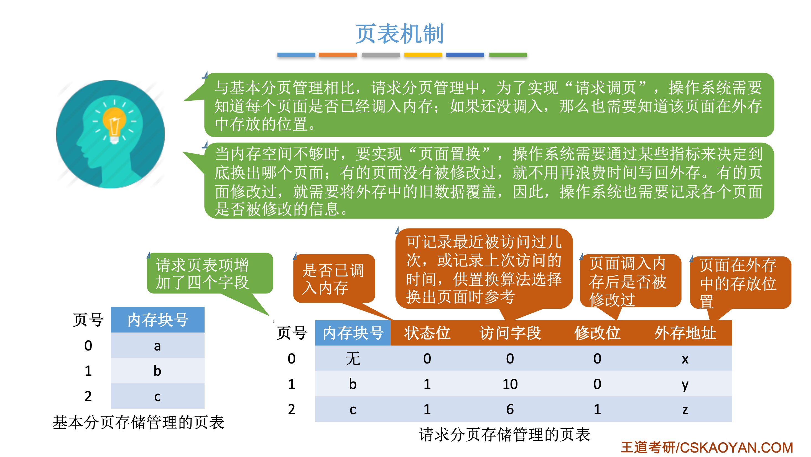

应该选择哪些页面被换出内存呢？


#### 页面分配

上文中讲页面置换的时候，我们都假设系统为某个进程分配n个页面，若缺页后如何置换，然而这个n具体是多大，就是现在要考虑的内容。

给进程分配页面，就像是绝大多数计算机系统设计一样，是一个取舍平衡的过程：同一段时期，鱼和熊掌不可兼得。比如分配页面过多，就达不到虚拟内存这个最初想法的预期；若分配页面过少，会导致进程频繁缺页，也就会使CPU频繁处理中断、IO等“巨慢”操作。而且现实中进程大小各异，又需不需要根据进程大小及特点，甚至实时动态（堆栈？）分配页面多少呢？


* 全局分配


* 局部分配


* 预调页策略

由于我们在上文中说到的**局部性原理**，我们可以不仅调入所需页面，而是一次调入相邻的多个页面，这样减少了访问IO的频率。事实上cache就是这么做的，但是虚拟内存中这个方法使用的不多，也是因为我们上文中提到过的一个现象：在“微观”（机器指令）顺序执行时，这种局部性很强，但是在虚拟内存技术中，调入调出的“内存量”要远多于cache中，这时局部性就不那么强了（举个例子，10个机器指令大概率是强相关的，但是100行python代码就很可能相关性不大，而cache处理的是前者，虚拟内存很多时候处理的是后者）。


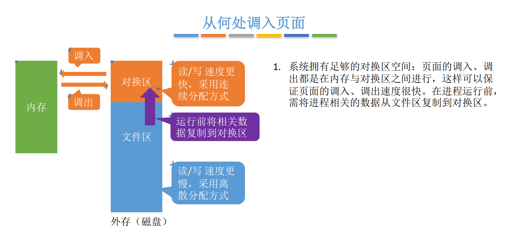


### cache工作原理（具体见《learn Computer Organization》）

讲完了MMU和页表，来说说CPU、寄存器、cache、内存的关系，首先说明，cache是有单独的取址单元，类似内存控制器。可以“独立于”CPU访问并拷贝内存数据。而且这个过程并不依赖于任何软件编程（完全由硬件控制）。

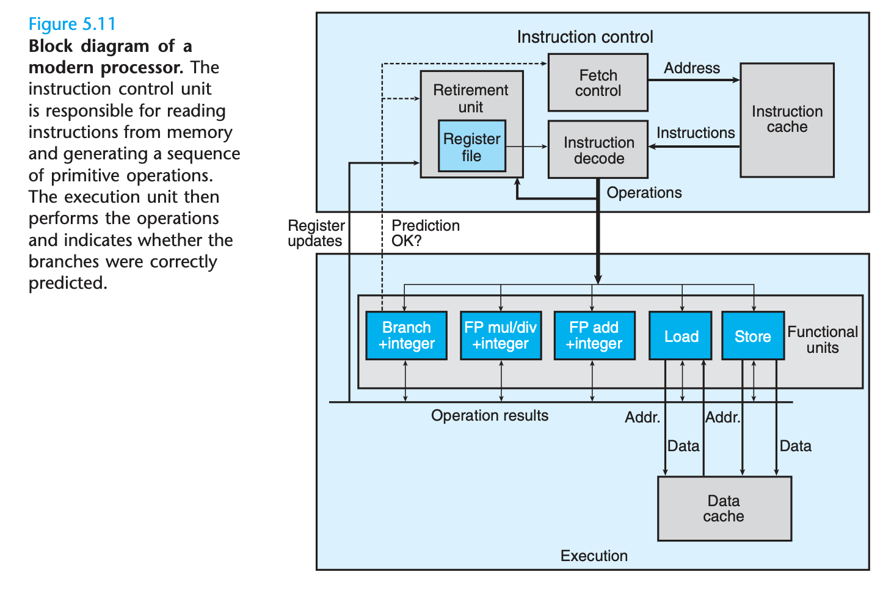

上图是节选自《深入理解计算机系统》。


>  **Cache与DRAM存取的一致性**
>
> 在CPU与主存之间增加了Cache之后，便存在数据在CPU和Cache及主存之间如何存取的问题。读写各有2种方式。
>
> 贯穿读出式(Look Through)
>
> 该方式将Cache隔在CPU与主存之间，CPU对主存的所有数据请求都首先送到Cache，由Cache自行在自身查找。如果命中。 则切断CPU对主存的请求，并将数据送出；不命中。则将数据请求传给主存。
>
> 该方法的优点是降低了CPU对主存的请求次数，缺点是延迟了CPU对主存的访问时间。
>
> 旁路读出式(Look Aside)
>
> 在这种方式中，CPU发出数据请求时，并不是单通道地穿过Cache。而是向Cache和主存同时发出请求。由于Cache速度更快，如果命中，则Cache在将数据回送给CPU的同时，还来得及中断CPU对主存的请求；不命中。则Cache不做任何动作。由CPU直接访问主存。它的优点是没有时间延迟，缺点是每次CPU对主存的访问都存在，这样。就占用了一部分总线时间。
>
> 写穿式(Write Through)
>
> 任一从CPU发出的写信号送到Cache的同时，也写入主存，以保证主存的数据能同步地更新。它的优点是操作简单，但由于主存的慢速，降低了系统的写速度并占用了总线的时间。
>
> 回写式(Copy Back)
>
> 为了克服贯穿式中每次数据写入时都要访问主存。从而导致系统写速度降低并占用总线时间的弊病，尽量减少对主存的访问次数，又有了回写式。
>
> 它是这样工作的：数据一般只写到Cache，这样有可能出现Cache中的数据得到更新而主存中的数据不变(数据陈旧)的情况。但此时可在Cache 中设一标志地址及数据陈旧的信息。只有当Cache中的数据被再次更改时。才将原更新的数据写入主存相应的单元中，然后再接受再次更新的数据。这样保证了Cache和主存中的数据不致产生冲突。


### 内存延迟

[CPU—cache—Memory—Drive的过程](https://www.cnblogs.com/xkfz007/archive/2012/10/08/2715163.html)写的非常清楚。当然这篇有些老，比如架构还有北桥，而现代CPU都把北桥中的内存控制器等部件集成在CPU内部，但是对于理解缓存结构来说，足够了。


关于内存延迟，有一篇知乎文章写得不错，现节选下来。

> [内存延迟](https://zhuanlan.zhihu.com/p/57780996):
>
> #### **多级缓存**
>
> 而缓存的硬件本质，本质上是对内存空间的映射，通过访问缓存，减少到访问内存的时间。但是存储器有着天生的一个矛盾：体积、速度还有成本。越接近寄存器的存储，体积越小，但是速度越快，成本也更高，但是像网络的存储，是其所有计算机存储的总和，但是速度就以 ms 计，不过成本就可以相对更低（就像你看知乎的文章，不用自己买硬盘，只要为流量或者带宽付费）。
>
> 我们根据存储器的容量之比，可以得出很明显的结论，越近的存储器层级访问越快，体积越大的存储器访问越慢。所以低级缓存速度很快（延迟低带宽高）但是不易命中，而高级缓存命中率相对高但是访问慢（延迟大带宽低）。另外一方面，每级缓存都需要访问cache tag，这也是一个主要的延迟。
>
> 同时存在一个边际效益问题：如果提升低级缓存的空间，单位成本比高级缓存高，但是带来的性能提升是越来越少；如此一来不如引入更多级缓存，这样就能最大化存储系统的最重要的目标：平均内存访问时间（Average Memory Access Time, **AMAT**）。
>
> #### **MMU 和 TLB**
>
> 离开了缓存之后，就是内存了么？不是。现代 CPU 之所以独立区分于 MCU（微控制器），有个很重要的部件就是 MMU（内存管理单元）。现代处理器通常采用了虚拟地址（也就是严格意义上的虚拟内存）作为指令后的参数，通过 MMU 翻译到物理内存的地址。而这个翻译工作交给了 TLB （页表缓存）。TLB 缓存找到了访问地址的页号（即命中），即明确了虚拟内存到物理内存的映射，就可以完成翻译；而如果找不到页号，就有两种情况
>
> - CPU 必须自行遍历页表，找到对应的分页条目，从而完成物理内存的访问
> - 如果找不到分页条目，说明这个页不在物理内存上，就要中断正在执行的程序，将控制权交给内核，完成所谓的”缺页中断“，内核此时通过 IO （比如访问磁盘）将磁盘上的页面文件复制到内存中，或者是将被压缩的内存页解压，从而完成读取，返回到程序中。
>
> ##### **TLB 与 Spectre 漏洞**
>
> TLB 是缓存，所以就需要一套预测算法，尽可能让 TLB 完成命中；同样，更底层的缓存也要有套预测算法。然而这套算法存在一种缺陷，通过一套攻击方法操纵分支预测逻辑，可以可靠地对 **缓存命中 和 未命中 间的差异**进行计时, 这种信息可以暴露进程的内部工作信息，从而实现对另外一个本该被页表隔离的进程空间的访问。
>
> 为了防止用户态进程通过这种方法攻击其他进程和内核，内核会要求 CPU 在上下文切换（即切换用户态到内核态的切换，进程之间的切换至少经历两次）强制刷新 TLB 缓存。但是这种操作就导致上下文切换的额外开销，以及 TLB 的命中率下降。这种性能影响不会对重运算类的应用有特别影响，而对程序编译（计算+IO密集型）和文件网络访问这样的应用有着严重影响。
>
> **平台架构**
>
> **MMU**
>
> MMU 之后就是内存控制器。在早期，内存控制器并不是作为 CPU 的一部分存在的。
>
> 945GM 的架构图
>
> 可以看到，CPU 到北桥（945GM）中间经过了 FSB 总线；北桥集成了 PCIe 控制器，内存控制器，GPU和显示输出单元。
>
> - PCIe：连接高速外设
> - 内存控制器：连接内存，此处有两个内存通道
> - GPU和显示输出单元：2D/3D渲染和显示输出，外接 LVDS 屏幕，CRT 显示器或者电视
>
> 同时借助 DMI 总线（实际是 PCIe），连接南桥（Chipset，芯片组）
>
> 可以看到芯片组连接了无线网卡，千兆有线网卡，外接 ExpressCard 和扩展坞，并且提供了内置存储的 PATA（IDE）和SATA总线，继承了 AC97 标准的音频规范，PCI 提供对旧外设的兼容，同时还有一些 SPI 闪存用于充当 NVRAM Nor Flash（有地址线，和一般 Nand Flash 按块读写不同），TPM 安全平台，和嵌入式控制器 EC（控制风扇键盘以及一些通用 IO 接口，如盖子、电源开关等）。
>
> 所以这种架构下，CPU 访问内存必须经过北桥这一关，所以在当时主板的 FSB 频率是一个非常重要的指标，当 CPU 超频，对于内存的吞吐需求增大，那么 FSB 频率提升就能有效提升内存的吞吐和降低延迟，并且也可以间接提升到 PCIe 的性能。
>
> 后来 AMD 率先将北桥融合入CPU，后来就出现了 GPU 整合入 CPU，所以我们现在看到的架构是这样的：
>
> 
>
> 
>
> 并且 Intel 先后引进了环形总线和 eDRAM（嵌入式动态访问内存，和 DRAM 有类似之处，L1-L3 都是 SRAM）。所谓环形总线，就是围绕 L3 的一条数据通路，连接各个核心、GPU、System Agent（包含内存控制器、PCIe 控制器、eDRAM 控制器和显示输出单元）。环形总线上核心之间访问的延迟约等于访问 L3 的延迟，这样并发任务锁能够更快被处理。而 eDRAM 缓存和传统 SRAM 缓存不同，他更像是一块带宽更大的内存。最近有些玩家在通过 Intel GPU 配合没有显示输出的 P106 显卡进行输出画面。由于这种方式输出需要将显存的 framebuffer 复制到 CPU 的 hostmemory，eDRAM 能够显著改善这个过程所需的带宽，从而提升帧率降低延迟。
>
> 但是服务器核心就有所不同，由于拥有更多核心，环的半径就会显著增大，内存延迟和核心同步延迟都显著增大，于是 Intel 就引入了双环结构。多线程应用在一个环内就能减少延迟，而吞吐密集应用可以靠近内存控制器从而获得更强性能。虽然两个环并没有被认为是一种 NUMA 结构，但是这种结构并不完美，第一个问题是两个环之间的数据通路是一个严重的瓶颈，特别是一个环的内存控制器和另外一个环上所示的核心访问时就有更大的带宽和延迟瓶颈。而对于低端CPU来说部分被屏蔽的核心就会导致第二个环只有一半能够继续工作，这就进一步降低了吞吐量和提升了延迟。
>
> 
>
> 为了缓解这种情况，提升每个核心能分配到的带宽和降低平均延迟，Skylake-SP 架构引入了 mesh 总线，从而提供更大的内存有效吞吐（六通道）和平均延迟。但是为了提升命中率，每个核心独占的 L2 容量提升至 1M，这就导致部分核心之间延迟变得更大。外加 mesh 总线频率和 CPU 频率呈现相关性，这就让低端处理器性能进一步下降。甚至不少评测媒体得出 SNB-E 的 2670 在游戏性能上相比默认频率的四通道的 Skylake-SP 产品要好。
>
> 
>
> 而 AMD 在 Zen 时代也变得更加奇葩。AMD 在 Zen 上采用了集成了两个 CCX 单元、双通道控制器，32 Lane PCIe 的单个 Die，在Ryzen 5/7 平台上通过一个Die就做出了 4-8核心的规格，而在 Threadripper 一代上两组 Die 实际运作，另外两组 Die 提供 Frabic 总线，形成最高 16 核心的桌面产品；Zen 2xxx 系列在 Zen 1xxx 基础上作何很多稳定性和细节调整，并且开启了 TR 的两个 Die 从而形成了最高 32 核心的 2990WX。服务器在开启剩下两个核心的 DDR4 和 PCIe 控制器，从而达到了单 Package 128 Lane PCIe，8通道内存的恐怖规格。
>
> 
>
> > 来源：[https://www.suse.com/documentation/suse-best-practices/pdfdoc/optimizing-linux-for-amd-epyc-with-sle-12-sp3/optimizing-linux-for-amd-epyc-with-sle-12-sp3.pdf](https://link.zhihu.com/?target=https%3A//www.suse.com/documentation/suse-best-practices/pdfdoc/optimizing-linux-for-amd-epyc-with-sle-12-sp3/optimizing-linux-for-amd-epyc-with-sle-12-sp3.pdf)
> > EPYC 的 hwloc（一种 NUMA 实用工具，让应用尽可能避免受到 NUMA 跨核访问的影响）结构示意图，可以看到一共有八个主存节点，每个主存节点下有两个 L3 簇，而 SCSI/ATA 控制器和网卡等 IO 设备都分布在不同的 NUMA node，这就意味着跨 NUMA 访问非常难以避免，如果你的虚拟机被分配在远离网卡的机器，显然网络 IO 性能就会有影响，这就需要 QoS。
>
> 到了 Zen 2 越加不可收拾，八核心产品采用了奇怪的设计：GPU Die 和 IO Die。这其实一看就能理解，IO Die 相当于当年的北桥，提供了内存/PCIe 控制器，APU 型号额外增加 Vega 图形单元，可能还会集成 eDRAM，或者说不定换成 GDDR 内存控制器，做成和游戏机类似的架构。
>
> 有些玩家可能想象这个 Die 看上去能塞下另外一个 8 核心的 Die，但是从内存带宽的角度看，目前 Ryzen 大多数型号都可以从高频低延迟重获取明显的整体性能提升，所以如果真的做到16核心，内存带宽就会成为极大的瓶颈。以及目前的设计引入了 CPU-北桥-L4缓存（不确定是 SRAM 还是 eDRAM）-内存控制器-DDR4 显存，这就让本身对内存敏感的 Ryzen 的内存性能更加存疑。
>
> 左: IO Die 右: CPU Die 手: 苏妈
>
> 这种诡异的设计更像是为了 EPYC 让步, CPU Die 就可以以更高的良率生产， EPYC 同样借助 IO Die 就可以实现更灵活的组合，以相对低的成本塞进更多的核心。对于虚拟化平台来说这种方案能够有效降低单机成本。同样运算密集型的 HPC 平台也有更大的吞吐能力。但是如果是数据库这种对于缓存敏感、有着大量并发锁（还记得 Intel TSX 指令集么）的应用，这种引入8（16）个 NUMA 节点的单路平台是难以优化的。


### 内存映射（Memory mapping）IO


## 文件系统

这个文件系统是较为广义的文件系统（计算机对数据存放和读写的实现），而不仅是狭义的文件系统，如NTFS、APFS、ZFS等。

**文件系统的很多特性和方法，是现代文件系统通用的，但有些方法，是不同的，甚至是过时的，具体本章最后我会尽可能详细的统计出这些特性。**


### 文件系统知识结构解释

正如我在《进程管理》部分提到的，很多知识体系划分界限就是两难的情形，因为很多并不是绝对的附属关系或者并列关系。一个技术也可能是对多层次功能的系统性实现，那如何讲解这项技术？

**但无论哪种划分方式、技术多么复杂，人类发明的就可以由人类讲清楚。**

回到正题——文件系统。文件系统在本质上的管理与内存相似，但有很多区别，其中重要的就是面向用户，具体描述见《一切皆文件》部分”文件的不同之处“一部分。这就让文件系统要比内存管理更具层次性。

所以说这有些像计算机网络，可以站在用户的角度自顶向下讲述，也可以站在历史的角度自下而上讲述，都是可以的。**在用户层就有很多概念和功能是必须的：文件基本操作、文件保护、用户共享、甚至可以包括目录。然后在这基础上操作系统需要从底层定义数据结构来描述文件的基本信息，这就是索引节点（iNode）。以此为基础来开发一系列算法实现对文件的基本操作。**

#### 文件系统思路（重要!）

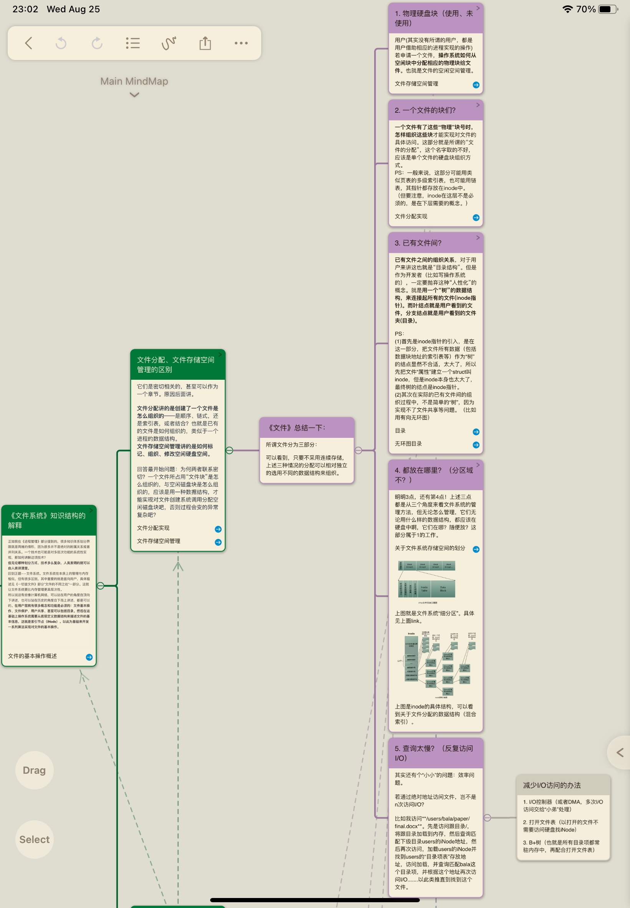

1. 用户(其实没有所谓的用户，都是用户借助相应的进程实现的操作)若申请一个文件，**操作系统如何从空闲块中分配相应的物理块给文件**。也就是文件的空闲空间管理。


2. **一个文件有了这些“物理”块号时，怎样组织这些块**才能实现对文件的具体访问。这部分就是所谓的“文件的分配”，这个名字取的不好，应该是单个文件的硬盘块组织方式。

   PS：一般来说，这部分可能用类似页表的多级索引表，也可能用链表，其指针都存放在inode中。（但要注意，inode在这层不是必须的，是在下层需要的概念。）


3. **已有文件之间的组织关系**，对于用户来讲这也就是“目录结构”。但是作为开发者（比如写操作系统的），一定要抛弃这种“人性化”的概念。就是**用一个“树”的数据结构，来连接起所有的文件(inode指针)。而叶结点就是用户看到的文件，分支结点就是用户看到的文件夹(目录)。**

   PS：(1)首先是inode指针的引入，是在这一部分，把文件所有数据（包括数据块地址的索引表等）作为“树”的结点显然不合适，太大了，所以先把文件“属性”建立一个struct叫inode，但是inode本身也太大了，最终树的结点是inode指针。

   ​		(2)其次在实际的已有文件间的组织过程中，不是简单的“树”，因为实现不了文件共享等问题。（比如用有向无环图）


4. 效率问题：**若通过绝对地址访问文件，岂不是n次访问I/O**？

   比如我访问**/users/bala/paper/final.docx**。先是访问跟目录/，将跟目录加载到内存，然后查询匹配下级目录users的iNode地址，然后再次访问，加载users的iNode并找到users的“目录项表”存放地址，访问加载，并查询匹配bala这个目录项，并根据这个地址再次访问I/O.......以此类推直到找到这个文件。我拿着显微镜找都比这快！

   没有什么是用“缓存”解决不了的。

   1. “雇小弟”原则DMA（或者I/O控制器），CPU不需要一个个找，只需要把这些通过总线交给I/O控制器，让它都给你找出来一起给你。

   2. “都拿去”原则，你访问的users目录项，周围一大块都一同加载到内存，想要的不想要的都给你。而且，所有目录项及iNode，都在内存中有一个副本，这样就不需要找了，参考B+树。配合“打开文件表”，可以做到只有到文件一级才可能访问硬盘。
   3. “来了别走”原则，内存中的数据/指令，并不是在相关进程被终止后就立即清出内存，而是作为“cached files”被标记为缓存，实在内存不够用操作系统才会清理。下图中16GB内存的电脑，看那个MEMORY PERSSUER 好像没怎么用，但是Used7.92GB，另外Cached File 7.55GB，这就差不多满了！看Process Name那一列：Safari Web Content(Cached)，就是我之前关掉的网页，等下次打开系统会优先加载这个。文件也是一样，来到内存的文件，很可能最近被再次访问，所以尽量“没事儿”别走。

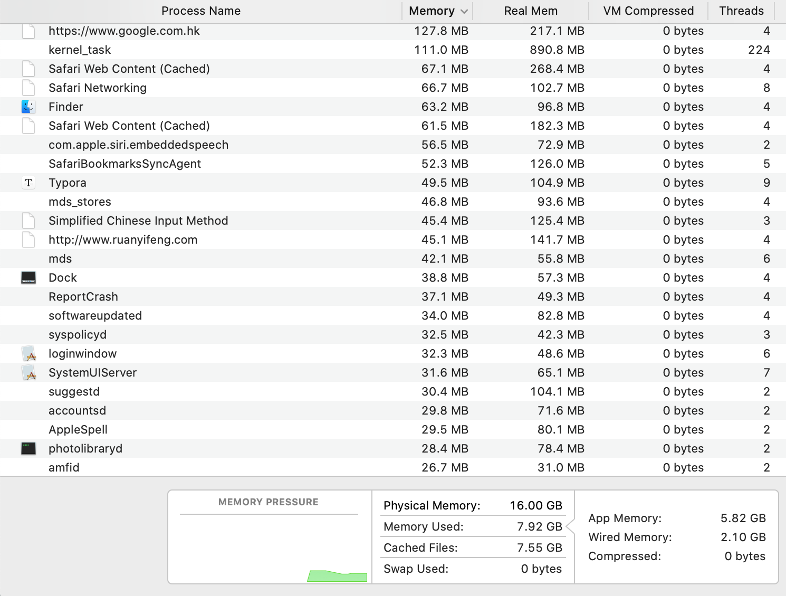


### 一切皆文件

在计算机中，与其说一切皆文件更不如说是一切皆二进制更为准确。但我为何说一切皆文件，也是有其中的道理的，因为文件几乎是最接近用户的二进制信息，文件也是几乎唯一可以被更改的二进制信息。一切指令和数据需我们把它写成文件，再使用另一（几）个程序将它从硬盘加载到内存中，剩下的事情，我们几乎就无能为力了，若想修改某些信息，大多数情况只能停止运行后修改这个文件再运行。

还是多米诺骨牌的例子，文件更像是我们在摆这些骨牌，而当其开始运行时，就是推翻第一块骨牌的时候，大多情况下，这期间我们不能做些什么。

当然有反例，假设内存（RAM）足够大，且电源供应足够稳定持久，我们可以建造一台没有硬盘只有内存的计算机，一切操作都在内存中进行，那这不就没有文件的概念了吗？是的，一定程度上是的。但一定程度上也可以把这时候RAM内的二进制信息成为文件。


所以很多教材中讲的文件这个概念有些问题，个人感觉会被误导：寄存器或者RAM中的数据和指令是二进制的，而文件好像是多种多样的。这是错误的。

之所以文件被叫做文件，因为硬盘是可以断电保存信息的，其实硬盘中的一些文件都是二进制，一些是指令，一些是数据，开机后属于操作系统内核的那部分指令和数据被复制到内存中，再到cache、再到寄存器。这些二进制信息基本没有改变。


> 关于文件系统中文件的表示，《现代操作系统》4.1.2和4.1.3自相矛盾。
>
> **文件内容都有它自己类型相对应的编码方式，相应的软件/进程按照对应的方式解码就可以获取这些信息。**
>
> txt文件不论按照ASCII还是UTF-8编码，只要文本编辑器这个进程按照其编码方式就能正确获取这些信息，如果支持GUI，还可以把它显示出来。
>
> 同样的，PNG文件也有它的编码方式，比如RGB怎么表示之类，只要图片查看器这个进程能解码，就能正确显示图片。但PNG文件对于文本编辑器（我指的是没有特殊功能的）就是没有意义的二进制文件，但依然按照UTF-8或者ASCII解码，就会出现乱码。反之亦反，所以这本书4.1.3中说“普通文件分为ASCII文件和二进制文件”是完全错误的。
>
> 但话说回来，之所以作者会这么说，我猜测是有一定历史包袱：最初计算机就是用来编写和执行用户程序的，甚至在那个没有屏幕只有打印机的年代，ASCII码文件和可执行文件几乎是唯二的文件类型。可这本书并非出版在那个年代，所以这也不是借口。
>
> 进一步讲，ASCII码文件的另一特殊之处是对于编译器来讲（虽然现代编译器也至少支持UTF-8编码了），毕竟当今（2021年）机器指令几乎都是由编译器将文本文件“解释”出来的。


**Question1：为什么看起来文件有很多类型，很多编码方式，也可以打开修改呢？**

这就是文件容易被误解的原因之一。比如我正在编写的这个MarkDown文件，我在键盘上打的字显示在屏幕中，但我敲击的每一下，都会以二进制的信息流进入到IO缓存中，并每隔一段时间被CPU相关的进程激活检查，将这些二进制信息拷贝到指定内存地址，然后将这些二进制信息的编码方式，显示位置等基本信息组合起来送到显卡，最后经过又一系列过程显示在屏幕上。

**关键问题是：计算机中所有信息都是二进制信息，文件一点没有例外；每个二进制信息被人为赋予了意义，这些就会对应的导致人类想让它导致的一连串“多米诺骨牌”式操作，这就让他们看起来很“生动”。**

若没有屏幕，这些操作和信息依然被记录下来，保存下来，之不过可能由于没有实时反馈很慢很吃力，而这就是3、40年前的计算机。


**我认为，学好计算机就应该用机器的思维去思考问题。** 

比如我右键新建了一个.txt文件，那么这个鼠标的一个点击操作（触点接触后的一个电信号），就会导致一系列非常繁琐的连锁反应，但它们在计算机中都是二进制（其实二进制也是抽象，不同的储存介质对应着不同的状态，它们的共同点是它们用来储存的单元被规定只有两种状态），我们看到的代码、图片、视频，只是它们的二进制数字排列方式不同罢了，而排列方式都是认为规定的，有百万千万种。


像上图这样一张漂亮的图片，若我们用Ubuntu的shell打开它（输入指令 cat Name.PNG），我们会看到下面这些“乱码”。

```shell
Y]xh��OVvq���H����)o��$3D���0L�a�"�m�~�/O�Ο���֔�G_�ի�������B����;�.���_�~��j)��
                                    �
                                     ��JɚF0
�w�@F�,��NO                                 ]K��0d�s�%���
-!S�H��*�p�Tt����fҊ�/^lES���;Ŋ�0#�^j��fڡ�xJl��*L�+S
�վ��A�ڲ��E���X~�9]����1��I&��h��1w��$6���q�'�,d0jǘL��DX�7��!mH��dNsf�[�R����\�U˝�rT�B֤��t�O�_��uekQ*�j2f�
```

这也并不是二进制，只是cat这个程序，并不能识别.png文件的编码，也就无法正确解码这些二进制信息。但无论什么程序，打开这张图片的时候，图片的二进制信息被完整拷贝到内存对应的区块中。

好奇的朋友可能想说：那上面那张图片的二进制是什么，我就想看看。方法很简单，我们把图片的格式改为.exe（windows用户）或者删除格式名（Linux、Mac用户），然后用sublime打开，就可以看到：

```shell
8950 4e47 0d0a 1a0a 0000 000d 4948 4452
0000 0938 0000 0668 0802 0000 0033 f7af
0100 0020 0049 4441 5478 01ec bdd9 8e24
4b92 a617 fb9a 9927 33cf 5a55 5d55 d33d
d3cb 8020 40de 10e0 1daf f844 7c2d be00
1f81 0009 5e10 2486 d33d ddec aeae 5367
cb25 3256 0f0f 0f7e bffc 2aa2 6ae6 ee91
798a 350b 38b4 8c34 1395 e517 d1c5 d4d4
54cd cc77 ff9b ffe1 7fdc 896d 772f 0eab
9dc7 1dfd ed92 32c7 e2e0 43c2 473a 1291
......
```

这依然不是二进制，但是非常接近了---这时16进制，每个数字（字母）对应着4个二进制数字，比如第一个8就是0100。假设这四位二进制信息被加载到内存中，对应的内存的第三位的电容就处在充满电状态，在硬盘中有更复杂的物理机制让它处在被规定的两种状态之一，而这种状态恐怕只有显微镜才能观察到。但这就很接近多米诺骨牌了不是吗？


**Question2：若文件的二进制信息同内存中并无多大差距，那为何文件系统单独一章，有这么多不同于内存管理的方法呢？**

这就有点像cache不同于内存的管理策略，本质上还是存储体系的矛盾，即价格、速度、容量的矛盾。

1. 相比于内存和cache，硬盘更重要的功能应该是被存入更多的信息，之后再考虑速度和延迟，这就是设计文件系统的核心思想。
2. 而内存，我们希望一开始就是所有信息都被归位，比如每个进程属于自己的地址空间（当然虚拟内存技术也是打破了这个现象），指令和数据分开放置等等，但同时我们也希望它可以放的多一点（最重要的就是离散存储效率高，但是牺牲了速度）。
3. 而cache就是这个平衡的另一种极端了，要它存在不就是为了延迟低，速度高吗！所以它其中的指令、数据存放严格到像是强迫症+洁癖的屋子一样，我不需要想（额外算法寻址）就直接可以找到我想要的。
4. 当然，最极端的非寄存器莫属了，现代计算机几百个寄存器其中至少几十个都是专用寄存器---即我这个屋子就放一种东西，谁来都不要。

所以这才造就了文件系统的设计思路不同于内存，因为要权衡的尺度不一样，但是数据和指令，是计算机中唯二的东西，它们都是二进制信息。


#### 文件的不同之处

1. 最核心的不同之处肯定是断电不失效。
2. 其次就是文件对应的一般为相对慢速、大容量二进制数据，所以很多管理策略是针对这点的。
3. 文件管理还有很多不同与内存管理的方面：比如多用户访问等。**面向用户**，这是文件管理与内存不同的另一方面，这就使得很多设计是为了方便用户，比如很多相应的系统调用如write、copy等。


### 文件分配

正如上章讲内存管理时也讲到页面分配问题，还有一系列其他的问题需要解决。

* 首先就是**分段还是分页（块）**的问题，前者连续存放，读写速度快；后者离散存放，存储利用率高。
* 其次就是若是分块**（**现代操作系统大都是这样做的，将一个硬盘的物理空间划分为块的基本单元：**Linux中是struct super_block）**，但是**划分多大**合适？
* **空闲分配**问题（空闲内存分配中的首次适配等算法同样适用）


#### 连续分配


#### 链表分配


##### FAT（File Allocation Table）

这种文件分配方式本质上还是属于链表分配，只是其链表存放在内存中。

也就是系统为每个磁盘建立一张物理块分配表（FAT），读入内存后常驻，每个物理块号存放的是下一个逻辑块号的物理块号，由于连续存放，物理块号也不需要占用空间，就像是页表。


其用在FAT文件系统中，由微软开发，现有些过时，最大的缺点就是不适合较大容量硬盘（占内存），比如一个1TB的硬盘被分为1KB的块，这张表的表项就算仅有3B，则其需要3GB内存。


####  文件控制块（FCB）/索引分配/inode

创建一个struct，把文件的一系列控制信息、文件所在地址存放其中。**注意，这不同于PCB，也不同于页表项**（页表是用来地址转换的，更像是接下来讲到的FAT）。在Linux中，这是**inode（不准确，下文会提到）**。


> **核心思路就像是内存中的页表，在连续分配和离散分配中找一个平衡点。**


#### 索引（index node）节点

 将每个文件的属性和信息单独存放并体现不出“索引”二字。索引主要是在inode中有一个属性为文件地址转换表（索引表？），其为**连续存放**，所以支持随机访问。

既然是连续存放，又会存在连续存放的一系列问题，比如这个inode中的索引表多大合适？大文件不够用怎么办？**办法还是老办法———多级索引、索引块链接**


**Question：FCB中有指向inode的指针，inode中不仅包含文件地址信息，还有很多信息，它们也是另外的一些结构指针吗？若是，磁盘寻址岂不需要两次IO？，若通过绝对地址（n层目录）访问文件，岂不是n+1次访问I/O？**

A：

* 知道iNode地址需要两次IO？是的，但是现实是有内存缓存、打开文件表等，将初次打开的文件加载到内存中后不“轻易”删除，这样访问时候就不需要两次了。
* **若通过绝对地址（n层目录）访问文件，岂不是n+1次访问I/O？**


下文节选自[阮一峰博客](http://www.ruanyifeng.com/blog/2011/12/inode.html)：写的很好，但还是有些问题，比如下面引文中：「inode区（inode table）」两者是一个概念吗？inode table是用来存放目录的“数据”的，还是存放inode的？此文也与下一节《储存空间划分？》有所冲突。

> **二、inode的内容**
>
> inode包含文件的元信息，具体来说有以下内容：
>
>  　　* 文件的字节数
>
>  　　* 文件拥有者的User ID
> 
>  　　* 文件的Group ID
> 
>  　　* 文件的读、写、执行权限
> 
>  　　* 文件的时间戳，共有三个：ctime指inode上一次变动的时间，mtime指文件内容上一次变动的时间，atime指文件上一次打开的时间。
> 
>  　　* 链接数，即有多少文件名指向这个inode
> 
>  　　* 文件数据block的位置
> 
> 可以用stat命令，查看某个文件的inode信息：
>
> ```
>stat example.txt
> ```
> 
> 
> 总之，除了文件名以外的所有文件信息，都存在inode之中。至于为什么没有文件名，下文会有详细解释。
>
> **三、inode的大小**
>
> inode也会消耗硬盘空间，所以硬盘格式化的时候，操作系统自动将硬盘分成两个区域。一个是数据区，存放文件数据；另一个是inode区（inode table），存放inode所包含的信息。
>
> 每个inode节点的大小，一般是128字节或256字节。inode节点的总数，在格式化时就给定，一般是每1KB或每2KB就设置一个inode。假定在一块1GB的硬盘中，每个inode节点的大小为128字节，每1KB就设置一个inode，那么inode table的大小就会达到128MB，占整块硬盘的12.8%。
>
> 查看每个硬盘分区的inode总数和已经使用的数量，可以使用df命令。
>
> ```
>df -i
> ```
> 
> 
>
> 查看每个inode节点的大小，可以用如下命令：
>
> ```
>sudo dumpe2fs -h /dev/hda | grep "Inode size"
> ```
> 
> 
> 
> 由于每个文件都必须有一个inode，因此有可能发生inode已经用光，但是硬盘还未存满的情况。这时，就无法在硬盘上创建新文件。
>
> **四、inode号码**
>
> 每个inode都有一个号码，操作系统用inode号码来识别不同的文件。
>
> 这里值得重复一遍，Unix/Linux系统内部不使用文件名，而使用inode号码来识别文件。对于系统来说，文件名只是inode号码便于识别的别称或者绰号。
>
> 表面上，用户通过文件名，打开文件。实际上，系统内部这个过程分成三步：首先，系统找到这个文件名对应的inode号码；其次，通过inode号码，获取inode信息；最后，根据inode信息，找到文件数据所在的block，读出数据。
>
> 使用ls -i命令，可以看到文件名对应的inode号码：
>
> ```
>ls -i example.txt
> ```
> 
> 


#### FCB、目录、inode？

**Question：目录是什么? 和FCB有何区别与联系？inode和FCB都被称为存放文件属性，它们是一个东西吗？目录、FCB都存放在哪里？**

1. 首先，目录、FCB也只是文件而已。FCB是目录项，FCB顺序存放组成了目录。
2. FCB包括文件名和一个inode指针，inode是一个struct，存放除文件名以外的文件信息。

目录有特殊的“标记位”，也就是在iNode（每个文件的信息都存放在这）中会有本文件是否为目录这个“选项”。

> 
>
> ​	VFS 把目录当作文件对待，所以在路径 bin/vi中，bin 和vi都展于文件———bin是特殊的目录文件，而vi 是一个普通文件，路径中的每个组成部分都由一个索引节点对象表示。虽然它们可以统一由
> 索引节点表示，但是 VFS 经常需要执行目录相关的操作，比如路径名查找等。路径名查找需要解析
> 路径中的每一个组成部分，不但要确保它有效，而且还需要再进一步寻找路径中的下一个部分。
>
> ​	为了方便查找操作，VFS 引入了目录项的概念。每个dentry 代表路径中的一个特定部分。
> 对前一个例子来说，/、bin 和Vi都服于目录项对象。前两个是目录，最后一个是普通文件。
>
> ​	必须明确一点：在路径中（包括普通文件在内），每一个部分都是目录项对象。解析一个路径并遍历其分量绝非简单的演练，它是耗时的、常规的字符串比较过程，执行耗时、代码繁琐。目录項对
> 象的引入使得这个过程更加简单。
>
> ​	目录项也可包括安装点。在路径 /mnt/cdrom/foo 中，构成元素/、mnt、cdrom 和foo 都脑于
> 目录项对象。VFS 在执行目录操作时（如果需要的话）会现场创建目录项对象。
> ​	目录项对象由 dentry 结构体表示，定义在文件 <linux/dcache.h>中。下面给出该结构体和其
> 中各项的描述：

```c
// 本段代码引用自《Linux内核设计与实现》13.9


// 目录项“对象”（虽然c语言中没有面向对象的实现，但是将一个相关量的集合定义为结构体，再把其相关的函数同样定义为一个集合---这个思想就是面向对象），其由dentry结构体表示，定义在文件<linux/dcache.h>中。
struct dentry {
    atomic_t			d_count;		/*使用计数*/
    unsigned int		d_flags;		/*目录项标识*/
    spinlock_t			d_lock;			/*单目录项锁*/
    int 				d_mounted;		/*是登录点的目录项吗？*/
    struct inode		*d_inode;		/*相关联的索引节点*/
    ...
}

// inode结构定义在文件<linux/fs.h>中。
struct inode {
    struct hlist_node	i_hash;			/*散列表*/
    ...
}
```

> 目录项缓存：
>
> 如果 VFS 层遍历路径名中所有的元素并将它们逐个地解析成目录项对象，还要到达最深层
> 目录，将是一件非常费力的工作，会浪费大量的时间。所以内核将目录项对象级存在目录项缓存
> （简称 dcache）中。
>
> **目录项缓存**包括三个主要部分：
> •“被使用的〞 **目录项链表**。该链表通过素引节点对象中的identry 項连接相关的素引节点，
> 因为一个给定的素引节点可能有多个链接，所以就可能有多个目录項对象，因此用一个链
> 表来连接它们。
> •**“最近被使用的” 双向链表**。该链表含有未被使用的和负状态的目录項对象。由于该链总
> 是在头部插人目录项，所以链头节点的数据总比链尾的数据要新。当内核必须通过刷除节
> 点项回收内存时，会从链尾鼎除节点项，因为尾部的节点最旧，所以它们在近期内再次被
> 使用的可能性最小。
> •**散列表**和相应的散列函数用来快速地将给定路径解析为相关目录項对象。
> 散列表由数组 dentry_bashtable 表示，共中每一个元素都是一个指向具有相同键值的目录项
> 对象链表的指针。数组的大小取决于系统中物理内存的大小。
> 实际的散列值由dhasb0 西数计算，它是内校提供给文件系统的唯一的一个故列函数。
> 香找散列表要通过d1ookup0西数，如果该西数在 dcache 中发现了与共相匹配的目录顼对
> 象，则匹配的对象被返回：否則，返回 NULL 指针。
>
> 
>
> 举例说明：假设你需要在自己目录中编译一个源文件/home/dracula/src/the_ sun_sucks.c,
> 每一次对文件进行访向（比如说，首先要打开它，然后要存储它，还要进行编译等），
>
> VFS 都必须沿着嵌套的目录依次解析全部路径：/、home、dracula、src 和最终的the_sun_sucks.c。 为了避免每次访向该路径名都进行这种耗时的操作，VFS 会先在目录项级存中搜素路径名，如果找到了，就无须花费那么大的力气了。相反，如果该目录項在目录项缓存中井不存在，VFS 就必須自己通过通历文件系统为每个路径分量解析路径，解析完毕后，再将目录项对象加人 dcache 中，以便以后可以快速查找到它。
>
> 而 dcache 在一定意义上也提供对索引节点的缓存，也就是icache。和目录项对象相关的索
> 引节点对象不会被释放，因为目录项会让相关索引节点的使用计数为正，这样就可以确保索引节
> 点留在内存中。只要目录项被缓存，其相应的素引节点也就被缓存了。
>
> 所以像前面的例子，只要路径名在缓存中找到了，那么相应的素引节点肯定也在内存中缓存着。
> 因为文件访问量呈现空间和时间的局部性，所以对目录项和索引节点进行缓存非常有益。文件访向有时间上的局部性，是因为程序可能会一次又一次地访问相同的文件。因此，当一个文件被访向时，所线存的相关目录项和索引节点不久被命中的概率较高。文件访向具有空间的局部性是因为程序可能在同一个目录下访问多个文件，因此一个文件对应的目录项缓存后极有可能被命中，因为相关的文件可能在下次又被使用。
>
> 
>
> 类似于目录项对象，文件对象实际上没有对应的磁盘数据。所以在结构体中没有代表共对象是否为脏、是否需要写回磁盘的标志。文件对象通f_dentry 指针指向相关的目录项对象。目录项会指向相关的索引节点，索引节点会记录文件是否是脏的。


3. 目录，也就是FCB顺序组成的“表”，是专门存放在硬盘分区的“目录区”**（这里有些问题，目录也是有自己的iNode的，那么目录是不是也要通过目录的iNode来查询这个“表”的地址？那这个目录的iNode放在哪里呢？具体见下文）**，因为其是连续存放的。（见下图）


#### 储存空间的划分？

> 图中把它称为目录区是有问题的，应该是iNode区与数据区。
>
> 若按照他所说的目录区，目录（它也是一个文件，有该目录的inode，以及inode中存放着数据的地址，只不过这个地址中存放的数据是一系列其他inode的地址）是存放在目录区（包括目录的inode、目录的数据），而“文件”的inode、数据都在文件区。这应该是不对的，与下图中它描述《目录区主要存放FCB、磁盘管理信息》相违背。

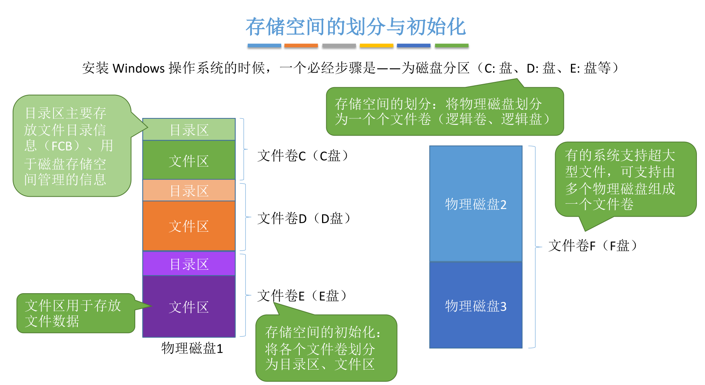

>  但，有单独的iNode分区，与再把目录的数据分区也不冲突，也就是所有iNode一个分区（包括目录的iNode）、所有目录数据一个分区、所有文件数据一个分区。再加上文件系统的基本信息（Linux 中的Superblock等），基本就这些了，但我也不保证可信，等待今后进一步确认吧。
>
> 且看这篇博客：https://www.huaweicloud.com/articles/a99b1d6ac3a1db3563cbf4843c7c4852.html
>
> 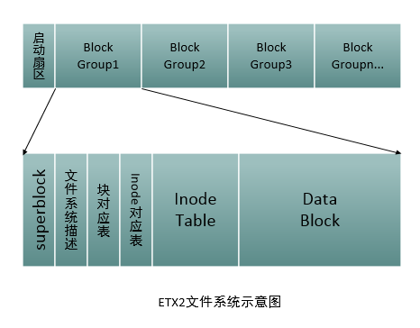
>
> 这篇博客还详细描述了iNode中的“文件分配”的方法——混合索引，如下图：
>
> 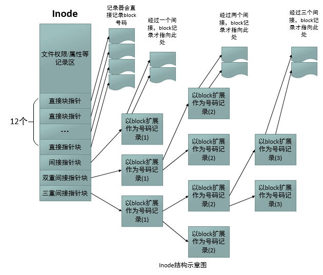
>
> 至此先告一段落，具体文件系统的细化分区，还有待进一步考证。


### B+树在文件系统中的应用

>  相关链接：
>
> * https://www.zhihu.com/question/47874339
> * https://blog.51cto.com/einst/1623269
>
> ## B+ 树在xfs中的应用
>
> 当前大部分Linux filesystem的inode都用B+ 树来组织他们的inode节点。使得查找更快更便捷。
>
> xfs相关的是参照 [ 麦子迈的博客](http://www.wzxue.com/xfs-的磁盘存储格式分析/)。
>
> ### Linux filesystem的结构特点
>
> 在Linux系统内部，一个文件系统是由逻辑块的序列组成的，每块为512个字节。具体组成下面表中所示。
>
> | 引导块               | 超级块                                                       | 索引节点（inode）区                                          | 数据区                                                       |
> | -------------------- | ------------------------------------------------------------ | ------------------------------------------------------------ | ------------------------------------------------------------ |
> | 用于读入启动操作系统 | 记录文件系统的当前状态，如硬盘空间的大小和文件系统的基本信息 | 存放文件系统的索引节点表，Linux系统中每个文件和目录都占据一个索引节点。文件系统一般从根节点开始 | 存放文件系统的索引节点表，Linux系统中每个文件和目录都占据一个索引节点。文件系统一般从根节点开始 |
>
> > 当然，现在主流的filesystem超级块可能不止一个，索引节点区和数据区又会划分成多个block group。
>
> ### xfs中Allocation Group
>
> XFS 引入了 Allocation Group(AG) 来划分一系列相等的块，每个 AG 所含的信息非常接近于一个完整的 XFS。每个 AG 都有三个主要功能:
>
> 1. 一个 Superblock 来描述整个文件系统信息
> 2. 空闲空间管理
> 3. Inode 分配和管理
>
> 多个 AG 的引入使得整个文件系统更加并行化，因为 AG 之间没有太多的共享资源和依赖。唯一的全局信息是第一个 AG 维护了一个全局的空闲空间情况和全局 inode 数(只在 umount 的时候会更新)。
>
> ### B+树在AG中得使用
>
> 
>
> XFS 通过两个B+树来管理空闲空间，如上图所示，分别是 Key 为 Block number 和 Block count 的两个。这使得 XFS 能通过 Block number 或者 Block size 来快速定位。如上图所示”AG free block info”主要是包括两个B+树的 root 节点的 block number(一个 block 存储一个 root 节点)，level，第一个和最后一个空闲列表块，空闲列表块的数量等等。
>
> 从”AG free block info”得到两个B+树的 root 节点信息后，每个节点分为两部分，一部分是节点信息，另一部分是 Key(Block count 或者 Block size)。
>
> 而图中的”AG Free List”是每个 AG 保留下来供B+树增长使用的，通常来说会是4个 block。
>
> ### AG inode管理
>
> Inode 管理是每个 Linux 文件系统的重点，如何使用和分配 Inode 影响着文件系统的性能和利用率。”AG inode B+tree info”包含着 AG 的 inode 信息，如 inode 已分配数，root 节点，空闲 inode 数，最近分配的 inode 和一个已删除 inode (inode 被删除但是其管理的数据块仍在，需要推迟删除，这个表在 mount 和 umount 的时候通常会清空)的哈希表。
>
> 与空闲空间管理的B+树类似，inode B+树的每个节点都包含着节点信息和Key(块位置)。
>
> ### Data fork
>
> XFS 使用 extent 来管理空间，一个 extent 包含了文件的逻辑 offset 和 block 的开始位置与长度，状态。一个文件可能会有多个 extent 组成，当 extent 所代表的 block 连续时，多个 extent 会相互合并。
>
> data fork 里的 extent 数据在绝大多数都可以放在 inode block 里，每个 extent 代表一个记录组成一个数组放在 data fork。但是当 data fork 无法容纳更多的 extent 时，extent 会被使用B+树管理。B+树的 root 节点会被放在 data fork 里。


### 逻辑文件结构与物理文件结构

之前我们讲到的关于文件系统都是以操作系统的视角，怎么构建文件的物理结构，也就是文件在硬件中会是怎么存放与查找的。

但事实上用户和应用程序（用户进程）也会按照自己想要的方式创建文件结构———逻辑文件结构。比如我们创建了一个结构数组（顺序存放），然后将其保存为文件。**对于我们（用户/应用程序）来说，这就是可以随机访问、顺序存储的文件，但是物理结构是什么样的还是取决于操作系统。这种情况同样存在于数据结构/算法中。**

当用户程序设计了一种数据结构，这实际上属于逻辑结构，最终解释权还是操作系统的具体实现方式，但这并不影响（其实在效率上会受影响，但在功能性上不会受影响）该用户程序针对该数据结构设计的算法的功能性。

当我们学习计算机网络的时候，这种一层层封装的概念会愈加明确。理论上不需要关注更底层的实现方式就可以做好这一层的工作，但是对于学习和进一步深入研究的学者来讲，这（不关心底层实现）是万万不行的。

> 下图节选自王道ppt，简单的描述了文件系统的“分层”结构。实际的系统中，层次并没有这么明显，比如文件目录和控制模块都在inode中表示，并无明显的分层现象。

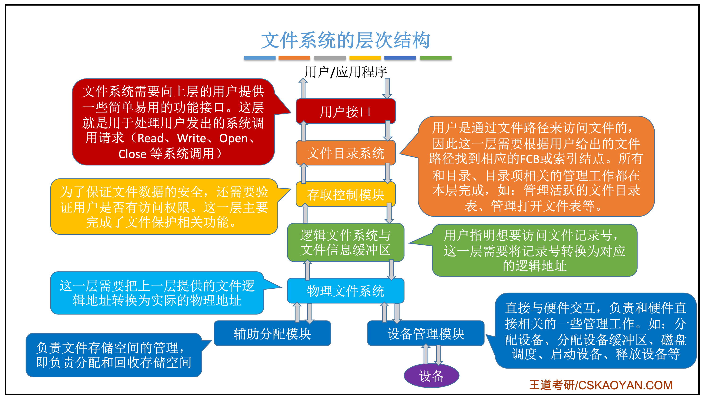


### 文件操作

> 下图节选自王道ppt，是关于文件操作的总结

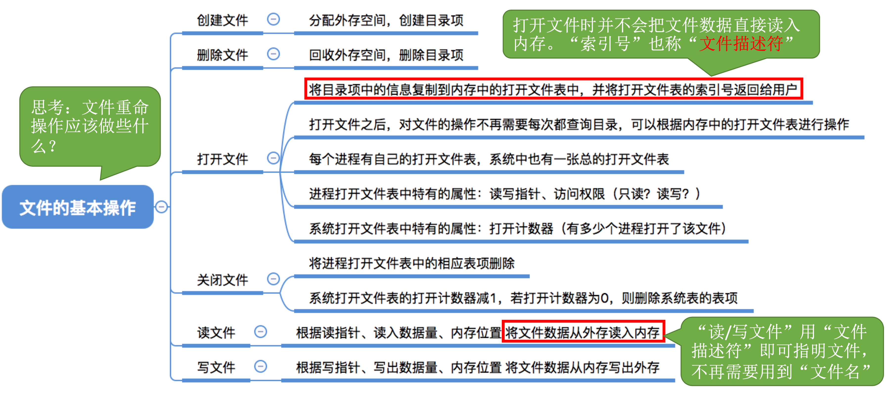

* 创建文件


* 删除文件


#### 打开文件表


* 打开文件

系统会在内存中创建一个**打开文件表**（open file table/整个系统唯一），记录着文件名、外存地址、打开次数等信息。每个进程也有自己的打开文件表。在Linux中，这被称为**文件描述符（File descriptor）**。


**Question：系统打开文件表、进程打开文件表、inode节点的关系？都存放在哪里？**

> 之前讲inode的时候，提到每打开一个文件，就会将其FCB、inode加载到内存（**此时并没有把文件内容加载到内存**），实际上就是建立一张打开文件表来集中管理打开文件，这样做有很多优点：
>
> * 以便再次打开时不用IO操作。
> * 系统可以管理同时被访问的文件，避免多个应用程序操作冲突。
>
> 下图较为准确的描述了他们的关系，该图来源于博客：https://blog.csdn.net/cywosp/article/details/38965239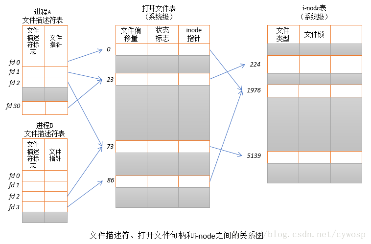
>
> 下面这篇文章感觉被各种转载，就不放原链接了：
>
> ## 一、概念
>
> 　　Linux 系统中，把一切都看做是文件，当进程打开现有文件或创建新文件时，内核向进程返回一个文件描述符，文件描述符就是内核为了高效管理已被打开的文件所创建的索引，用来指向被打开的文件，所有执行I/O操作的系统调用都会通过文件描述符。
>
> ## 二、文件描述符、文件、进程间的关系
>
> ### 1.描述：
>
> 我们可以通过linux的几个基本的I/O操作函数来理解什么是文件操作符。
>
> ```cpp
> fd = open(pathname, flags, mode)
> // 返回了该文件的fd
> rlen = read(fd, buf, count)
> // IO操作均需要传入该文件的fd值
> wlen = write(fd, buf, count)
> status = close(fd)
> ```
>
> 每当进程用`open（）`函数打开一个文件，内核便会返回该文件的文件操作符（一个非负的整形值），此后所有对该文件的操作，都会以返回的fd文件操作符为参数。【注1】
>
> > 注1： **文件描述符**可以理解为进程文件描述表这个表的**索引**，或者把文件描述表看做一个数组的话，文件描述符可以看做是数组的下标。当需要进行I/O操作的时候，会传入fd作为参数，先从进程文件描述符表查找该fd对应的那个条目，取出对应的那个已经打开的文件的**句柄**，根据文件句柄指向，去系统fd表中查找到该文件指向的**inode**，从而定位到该文件的真正位置，从而进行I/O操作。
>
> - 每个文件描述符会与一个打开的文件相对应
> - 不同的文件描述符也可能指向同一个文件
> - 相同的文件可以被不同的进程打开，也可以在同一个进程被多次打开
>
> ### 2.系统为维护文件描述符，建立了三个表
>
> - 进程级的文件描述符表
> - 系统级的文件描述符表
> - 文件系统的i-node表 (inode 见下文)
>
> ### 进程级别的文件描述表：
>
> linux内核会为每一个进程创建一个`task_truct`结构体来维护进程信息，称之为 进程描述符，该结构体中 指针
>
> ```cpp
> struct files_struct *files
> ```
>
> 
>
> 指向一个名称为`file_struct`的结构体，该结构体即 进程级别的文件描述表。
>
> 它的每一个条目记录的是单个文件描述符的相关信息
>
> 1. fd控制标志，前内核仅定义了一个，即close-on-exec
> 2. 文件描述符所打开的文件句柄的引用【注2】
>
> > [注释2]：文件句柄这里可以理解为文件名，或者文件的全路径名，因为linux文件系统文件名和文件是独立的，以此与inode区分
>
> ### 系统级别的文件描述符表
>
> 内核对系统中所有打开的文件维护了一个描述符表，也被称之为 【打开文件表】，表格中的每一项被称之为 【打开文件句柄】，一个【打开文件句柄】 描述了一个打开文件的全部信息。
> 主要包括：
>
> 1. 当前文件偏移量（调用read()和write()时更新，或使用lseek()直接修改）
> 2. 打开文件时所使用的状态标识（即，open()的flags参数）
> 3. 文件访问模式（如调用open()时所设置的只读模式、只写模式或读写模式）
> 4. 与信号驱动相关的设置
> 5. 对该文件i-node对象的引用
> 6. 文件类型（例如：常规文件、套接字或FIFO）和访问权限
> 7. 一个指针，指向该文件所持有的锁列表
> 8. 文件的各种属性，包括文件大小以及与不同类型操作相关的时间戳
>
> ### Inode表
>
> 每个文件系统会为存储于其上的所有文件(包括目录)维护一个i-node表，单个i-node包含以下信息：
>
> 1. 文件类型(file type)，可以是常规文件、目录、套接字或FIFO
> 2. 访问权限
> 3. 文件锁列表(file locks)
> 4. 文件大小
>    等等
>    i-node存储在磁盘设备上，内核在内存中维护了一个副本，这里的i-node表为后者。副本除了原有信息，还包括：引用计数(从打开文件描述体)、所在设备号以及一些临时属性，例如文件锁。
>
> 
>
> 
>
> 
>
> > 注：进程A的fd表中，左边fd0，fd1，fd2… 就是各个文件描述符，它是fd表的索引，fd不是表里那个fd flags！这里不要搞混淆了，fd flags 目前只有一个取值。
>
> 在进程A中，文件描述符1和30都指向了同一个打开的文件句柄（标号23）。这可能是通过调用dup()、dup2()、fcntl()或者对同一个文件多次调用了open()函数而形成的。
> **dup（）**，也称之为**文件描述符复制函数**，在某些场景下非常有用，比如：标准输入/输出重定向。在shell下，完成这个操作非常简单，大部分人都会，但是极少人思考过背后的原理。
>
> 大概描述一下需要的几个步骤，以标准输出(文件描述符为1)重定向为例：
>
> 1. 打开目标文件，返回文件描述符n；
> 2. 关闭文件描述符1；
> 3. 调用dup将文件描述符n复制到1；
> 4. 关闭文件描述符n；
>
> 进程A的文件描述符2和进程B的文件描述符2都指向了同一个打开的文件句柄（标号73）。这种情形可能是在调用fork()后出现的（即，进程A、B是父子进程关系）【注3】，或者当某进程通过UNIX域套接字将一个打开的文件描述符传递给另一个进程时，也会发生。再者是不同的进程独自去调用open函数打开了同一个文件，此时进程内部的描述符正好分配到与其他进程打开该文件的描述符一样。
>
> > 注3： 子进程会继承父进程的文件描述符表，也就是子进程继承父进程打开的文件 这句话的由来。
>
> 此外，进程A的描述符0和进程B的描述符3分别指向不同的打开文件句柄，但这些句柄均指向i-node表的相同条目（1976），换言之，指向同一个文件。发生这种情况是因为每个进程各自对同一个文件发起了open()调用。同一个进程两次打开同一个文件，也会发生类似情况。


* 关闭文件


* 读文件


### 文件共享

值得注意的一点是，上节讲到的不同进程打开同一个文件，系统打开文件表中会有一个“打开计数器”来描述其被打开的次数，但这并不是文件共享，**文件共享往往指多个用户“同时”（并不会也不可能真正的同时）修改和访问一个文件。**


#### 硬链接（共享inode）

正是因为FCB（目录项）中存放着inode指针（而不是inode结构本身），这样多个文件的FCB中的inode指针都可以指向inode结构，其中有个参数count就是记录有几个FCB指向这个inode。


#### 软链接（符号链接）

创建一种**新的类型（link）**文件（就叫它符号链接吧），这种类型的文件会存放想要链接的文件地址，当进程访问该文件时，操作系统会根据这个地址找到最终文件。

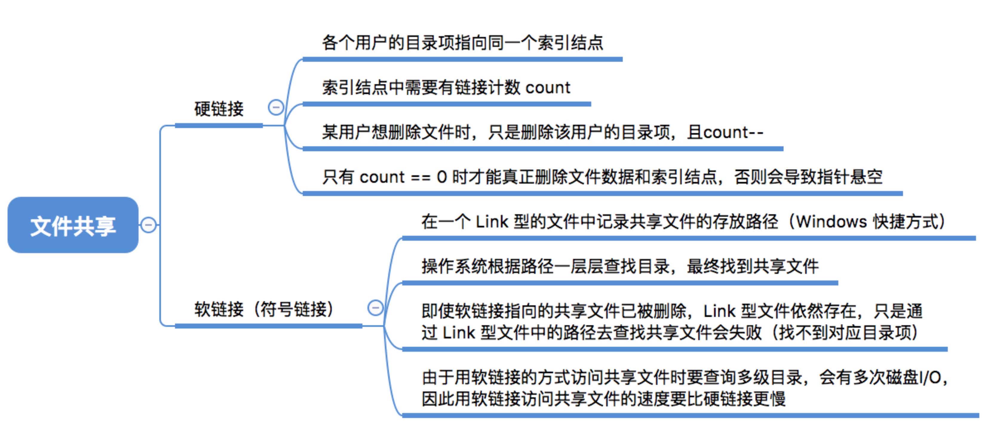


### 文件保护

> 下图中清楚的描述了操作系统对文件的保护方式，其中访问控制是最普遍的，它几乎不需要额外的解密加密开销，也实现了批量保护等功能。
>
> 但加密保护永不过时（具体的加密算法可能会更新），这是安全性最高的文件保护措施。

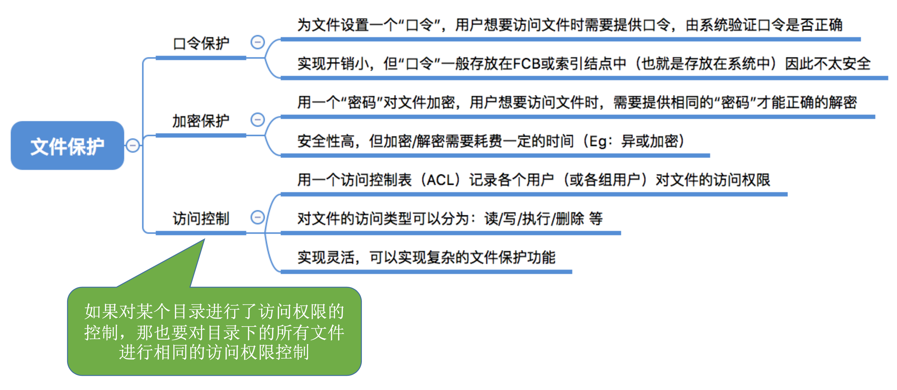


#### 访问控制

> inode中又又又添加了“新东西”。这就是下图中的访问控制列表，实现了对文件的保护。

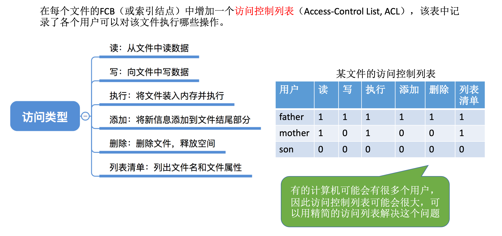


### 文件系统实例

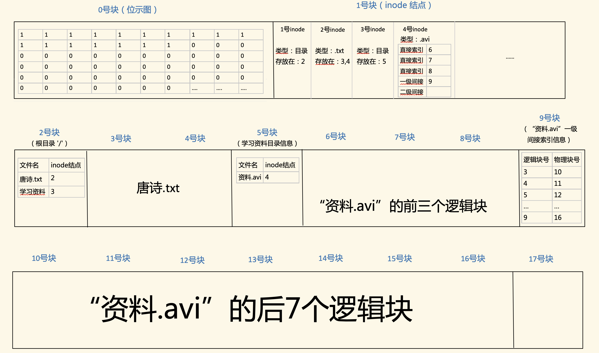

> 上图和下述解释均来自王道资料：
>
> 文件系统采用的策略：
> 1.文件的物理结构－-索引分配（混合索引）
>
> 2. 文件目录的实现－inode结点
> 3.空闲分区管理－一位示图
> 创建各级目录、文件：
> 1. 在根目录中创建一个“唐诗．txt”，文件占2块
> 2. 在根目录中创建一个子目录“学习资料”
>
> 3.在“学习资料”目录下创建一个文件“资料．avi”，10块
> open（＂／学习资料/资料.avi＂）；
> 操作系统检查1号inode的信息，可知根目录存放在2号物理块中
> 读入2号物理块，读入内存之后，可知“学习资料”目录文件，inode编号3
> 操作系统检查3号inode的信息，可知“学习资料”目录文件存放在5号物理块中
> 读入5号物理块的内容，可知“资料．avi”，inode编号4
> 操作系统会把4号inode的信息读入内存。
> read（资料．avi，2号逻辑块）
> 操作系统会根据4号inode中保存的“索引表”，来确定，2号逻辑块存放的位置应该是8号物理块中，接下来把8号物理块读入内存。
> read（资料．avi，7号逻辑块）
> 操作系统会根据4号inode中保存的“索引表”，可知，要找到7号逻辑块，必须先查找一级间接索引，因此会先读入9号物理块
> 查询一级间接索引信息，就可以知道7号逻辑块的物理块号＝14
> 最后，读入14号物理块

**Question：文件目录、inode不是存放在磁盘单独的目录区吗？**


### 虚拟文件系统（VFS）


> VFS 其实采用的是面向对象的设计思路，使用一组数据结构来代表通用文件对象。这些数据结构类似于对象。因为内核纯粹使用 C 代码实现，没有直接利用面向对象的语言，所以内核中的数据结构都使用 C 语言的结构体实现，而这些结体包含数据的同时也包含操作这些数据的函数指针，其中的操作函数由具体文件系统实现。
>
> VFS 中有四个主要的对象类型，它们分别是：
>
> * 超级块对象，它代表一个具体的已安装文件系统。
>
> * 索引节点对象，它代表一个具体文件。
>
> * 目录项对象，它代表一个目录项，是路径的一个组成部分。
>
> * 文件对象，它代表由进程打开的文件。
>
> 注意，因为 VFS 将目录作为一个文件来处理，所以不存在目录对象。回忆本章前面所提到的目录项代表的是路径中的一个组成部分，它可能包括一个普通文件。换句话说，目录项不同于目录，但目录却是另一种形式的文件。每个主要对象中都包含一个操作对象，这些操作对象描述了内核针对主要对象可以使用的方法: 
>
> * super operations，对象，其中包括内核针对特定文件系统所能调用的方法，比如 write  inode 和 sync_fs0 等方法。
>
> * inode operations 对象，其中包括内核针对特定文件所能调用的方法，比如 create (0 和 ink 等方法。
>
> * dentry operations 对象，其中包括内核针对特定目录所能调用的方法，比如 d compare 和  d delete0 等方法。
>
> * file operations 对象，其中包括进程针对已打开文件所能调用的方法，比如 read 和 write 等方法。
>
> 操作对象作为一个结构体指针来实现，此结构体中包含指向操作其父对象的函数指针。对于其中许多方法来说，可以继承使用 VFS 提供的通用函数，如果通用函数提供的基本功能无法满足需要，那么就必须使用实际文件系统的独有方法填充这些函数指针，使其指向文件系统实例。
>
> 再次提醒，**我们这里所说的对象就是指结构体，而不是像 C+或 Java 那样的真正的对象数据类类型。但是这些结构体的确代表的是一个对象，它含有相关的数据和对这些数据的操作，所以可以说它们就是对象。**

**题外话：**上段话中也说清楚了所谓的面向对象，也就是类（class）的概念，就是一个内存块，包含一个结构和众多函数（这些函数也可以包含在结构中，如接下来要讲的超级块操作函数表：**sturct super_operations**），这个集合就是一个没有继承功能的类。


### Unix文件系统

Unix系统将文件信息和文件本身区分开来，文件信息被称为文件元数据，被存放在一个单独的数据结构中——索引节点（**inode**——index node）。

文件系统的控制信息也被存放在一个特殊的数据结构中——超级块（**super_block**），定义在<linux/fs.h>中。super_block不仅仅是抽象的概念，在物理硬盘中也存放在特殊的位置，以便访问。

```c
struct super_block {

 /* ...... */ 
};
```


## I/O---输入输出

计算机的指令执行过程就是从硬盘到内存，内存到缓存，缓存CPU（寄存器）的，所以**文件系统**一章是在讲硬盘是怎么回事儿、**内存管理**一章是在讲内存/RAM是怎么回事儿、**进程管理**一章是在讲这些数据和指令是怎么被CPU管理的。但I/O呢？so...

IO设备主要指外设，如硬盘、鼠标键盘显示器等。这里主要以硬盘为例，但是提到硬盘，往往和下一章节的文件系统联系起来，因为一般意义上，文件都放在硬盘里。但这是不严谨的。

**一切储存和运算最终都是以二进制的形式，而硬盘（固态、机械、光盘）、内存、cache等储存机理各不相同，但是他们都是可以存放文件的，所以一个文件系统完全可以在内存（Memory）中被实现，之所以它往往被与硬盘联系起来，只是硬盘断电还能保持其二进制状态信息罢了。**

同样地，如果硬盘在成本不变的情况下读写速度极快、延迟极低（和cache一样块），那我们就不需要内存（Memory）这种东西了。 但现实是，我们都需要。

以硬盘为例，其主要作用除了储存数据（断电也可以保存信息）之外，就是**把数据拷贝到内存里，再从**

**内存中把数据写到硬盘里。**这个过程本来是由CPU完成，但是CPU做这些太低效率了，所以有个专门的硬件做这个工作，其接受CPU的指令，向CPU汇报工作——它就是DMA。


**Question：这章内容往往主要在讲硬盘，甚至大多只是机械硬盘。但为什么还要单独一章？而不是放入文件系统中的物理结构模块呢？**

* 首先，这章节的确是讲很多关于机械硬盘的底层原理，但是这只是因为其几乎是最复杂的I/O设备之一，将其作为案例讲解I/O设备的管理策略最适合不过。


* 其次，为何不放在文件系统一章讲解机械硬盘问题？这背后有一个很重要的fact：**操作系统并不是最直接接触硬件的“软件”**。

  操作系统更像是用户和设备厂商的媒介，但现实中操作系统开发商（Apple、Microsoft、Google）它们的研发能力和影响力巨大，往往是它们同**设备厂商**协调研发计算机系统的最佳解决方案（这点我在**绪论**一章的重要理念中提到过）。

  所谓的设备厂商，其实是一切的计算机硬件设备。所以在理论上，应该每个硬件都有一个所谓**“设备驱动程序/固件”**，它才是直接与硬件沟通的软件，而操作系统也是使用了它提供的“函数”（它提供的函数是极其简单的比如只有读写数据等操作）进行进一步优化和添加功能。


* 我们前面几章所讲的内容，其实还是屏蔽了大量底层细节（操作系统和设备驱动软件的“沟通问题”）的内容。而**I/O**这一章节则是在补全这方面的内容。


* 细心的读者会意识到：所谓的设备驱动程序，好像之前讲的CPU并没有这部分啊！的确，由于CPU是计算机的最最最核心硬件，一切计算机系统都是围绕CPU（当然，可能以后也可以实现只有GPU的计算机，但GPU和CPU本质并无区别，最主要就是不同功能计算单元占比问题）展开的。所以所谓操作系统最核心的算法（进程管理、内存管理等）本身就可以看作是一个功能齐全的CPU驱动程序。

  


所以与此区别开来，I/O就显得像是“干儿子”了。为何会出现这样的现象？由于I/O并不像是CPU等计算机核心硬件，是几乎统一的标准和少数几个公司垄断性的产物（因为极高的技术壁垒）。

除了CPU的核心地位，它们在技术上的区别真的不大，虽然我一再强调分层、黑盒在计算机中的运用淋漓尽致，但是我们也要学会用直接的、“面向机器” 的思维方式是思考———计算机是多米诺骨牌（也就是我在**绪论**一章的重要理念中提到过的另一点），它并不只知道任何层次、编码、组织数据的方式，只是一步步的机械的执行下去，直到停电。

在计算机网络体系中同样如此，在任何一个科目、行业更是如此。人类为了便于理解与分工，将许多事情划分为许多联系不大的类别或层次，这个思想非常伟大，但正因如此，容易让我们忽略掉其中的微妙的联系，会让我们难以深刻理解其本质。我在物理学习系列的科普文章中也强调过这一点。


### I/O分类


### I/O控制方式


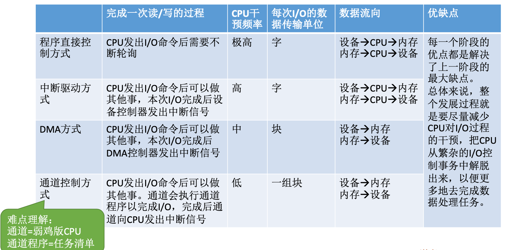


### I/O软件层次结构


#### I/O软件层次结构 与 文件系统层次结构

明显 **前者(I/O) 包含 后者(文件系统)**：

**文件系统本质上就是操作系统对硬盘这个I/O设备的操作“抽象”、“简化”成几个简单的系统调用提供给用户**。而所有I/O设备都是如此。只不过硬盘相对复杂、通用且重要。就有了单独的文件系统一章。


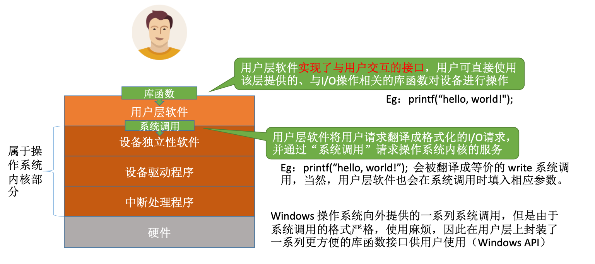


#### I/O核心子系统

本节开头提到的I/O层次中间三环，被称为I/O系统，如下图所示：

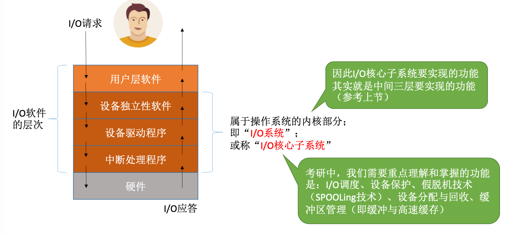


#### 设备独立性软件

这个部分是操作系统对设备操作进行无差别封装的关键一环，也被称为设备无关性软件。功能主要如下：

* 系统调度I/O
* 提供统一的调用接口（如read/write系统调用）
* **设备的保护**

> 操作系统需要实现文件保护功能，不同的用户对各个文件有不同的访问权限(如:只读、读和写等)。 **在UNIX系统中，设备被看做是一种特殊的文件，每个设备也会有对应的FCB。**当用户请求访问 某个设备时，系统根据FCB中记录的信息来判断该用户是否有相应的访问权限，以此实现“设备保护”的功能。(参考“文件保护”小节)


* 差错处理
* 设备的分配与回收
* **数据缓冲区管理**
* 建立逻辑设备名与物理设备名的映射关系（通过**Logical Unit Table**实现）


#### 设备驱动程序


### 假脱机技术

这个技术看似有些像cache，但有些不同。目的不仅仅是为了加快访问速度，更多的是为了“并行”访问I/O设备。


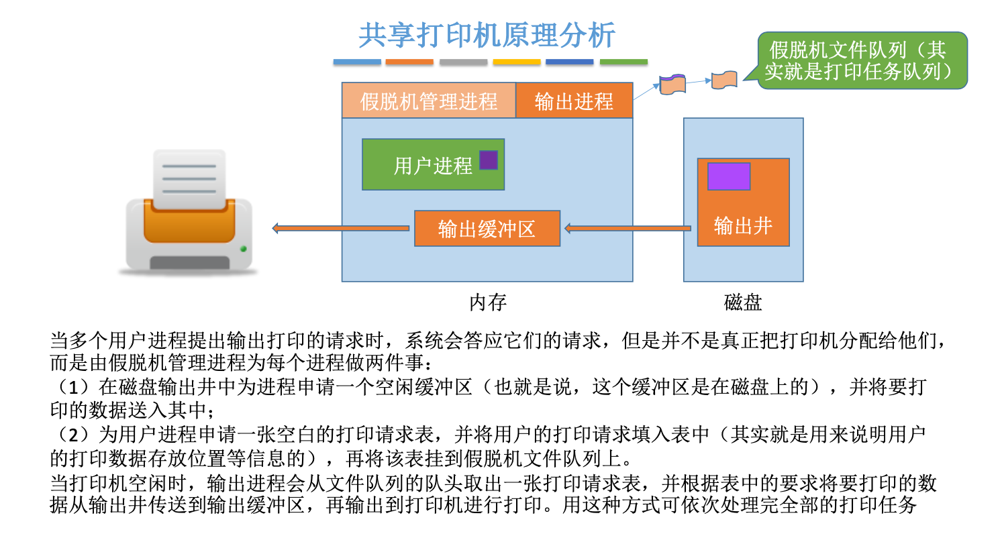


### 缓冲区


#### cache与buffer的区别与联系


> 引用部分总结自知乎回答：https://www.zhihu.com/question/26190832
>
> 1. 联系/共同点很明显，也就是王道ppt强调的，它们两者都是解决CPU与慢速设备的速度矛盾，让CPU更高效的运行。
> 2. 区别其实也很鲜明：**cache****是随机访问，buffer往往是顺序访问。**在read的场合，cache通常被用于减少重复读取数据时的开销，而buffer则用于规整化每次读取数据的尺寸。


**Buffer 是一个“进程”层次的概念；而cache要“底层”的多，是“通用”的、硬件层面的解决方案。而且，每个缓冲区在[空，满]之间是“单向”的。而cache灵活的多。

PS：TLB的这个buffer是起错名字了，它是实打实的cache。


#### buffer与信号量

由于这是最后一部分内容，而进程管理是第一部分内容，所以作为学生很可能忘了记在解决进程互斥时引入的信号量，并建立几种“抽象”的模型，如生产者消费者问题，哲学家进餐问题等。

以多生产者消费者问题为例，那个需要互斥访问的公共区域，就是缓冲区，而回忆起这个问题，也就更容易理解上文中「**Buffer 是一个“进程”层次的概念；而cache是硬件层面**」的结论了。

