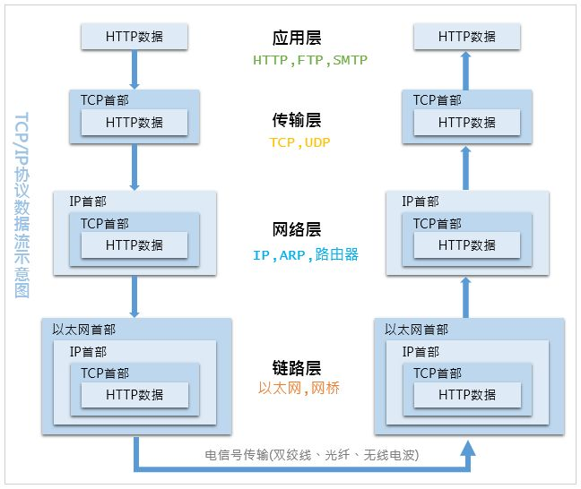

# Internet Protocol suite


[toc]

---

[wiki of internet protocol suite](https://en.wikipedia.org/wiki/Internet_protocol_suite)




### 一些小问题

* 网络不管是那个部分，都会分客户端和服务器，初学者可能总是认为客户端指的是我们自己的电脑，而服务器指的是那种大机房。很多情况下是的，但很多时候并不是，只要是等待数据报并作出回应的基本都可以看作服务器，而服务器更多的是面向进程的一个概念，也就是一台设备可以同时有客户端进程和服务器进程。
* 初学者，尤其是计算机大方向的初学者总是不自觉的将计算机代入成人，这是非常错误的想法，想其原因，我猜测可能是现在的（2020后）计算机的确越来越“智能”，但是它们目前仍是机器，100%的机器，十分精密且复杂到可以自动化的实现人类预先设计好的让他们工作的步骤。这些人类是好多代聪明的科学家和工程师的思想，而没有一个是“计算机”想出来的，所以比如我为什么连上WiFi就可以上网了？这背后的机制非常复杂，但都是人类想法的实现。
* 

## 信息传输的基本概念


### 传输速度/时延、传播速度/时延 的关系

1. 比如带宽100Mb/s，到底是什么意思？带宽和传输速度有什么关系？
2. 为什么有人把传输速度比喻成「车道宽度」或「漏斗管子横截面积」？这合理吗（非常不合理）
3. 这些bits是串行的吗？一根网线的极限传输速度是由于什么被限制？物理极限大约为多少？
4. 哪些“人为”因素限制了用户的传输速度；延迟是什么？受限于什么因素？和传输速度有关吗？
5. 同时包括延迟和传输速率限制的完整的传输过程是什么样子的？


虽然光纤的理论传输速率很高(TB量级)，但是由于现在的网络结构，一根光纤往往同时承载大量网络节点的数据传输，所以平均每台设备的分得的传输速率就少很多。加下图：


#### 延迟与传播速度关系不大


##### 内容提供商限制传播速率

> 快递的例子，假设我贼有钱，在京东自营上买了10万件东西，一件一单。这时候京东收到了我的请求，开始去仓库找货(10万件假设1秒找一件)，然后包装，写上我的收货地址，发货，中间有经过了n多次中转，终于2天后收到了第一个包裹，而在接下来的时间里，不出意外就是1秒收到一件。
>
> **「2天」就是延迟，而1秒1件就是网速。**

若不间断的给我发件，我收件的速度一直会是1s1件，这时便感觉不到延迟的存在，这时的速度，才被称为传播速度。

而事实上，往往是相反的情况：假设用任意门发快递，但是京东人手不够，发货速度最快1h一件，但是由于任意门，只要发货，几乎瞬间就能到。这时延迟就极低，但是传输速度却低了很多，变成了1h1件。

以上讲到的传输速率都是取决于京东发货的速度，这对应到现实就是：没有买会员，服务器给你转发的慢。


##### 运营商限制传播速率

若你买了10M宽带，这就对应着，任意门1h只给你一件货，并且会通知京东，我这里1h1件货，你不用1s1件的发货了(这就是TCP的流量控制)。


##### 物理层限制传播速率

若你很有钱，开了1000M的宽带，并开了腾讯超级会员。但是你的网线是100M的，这意味着什么？这是因为，任意门的延迟虽然很低，但是门很小，每次(搬一次10ms)只能搬一个小包，大包还需要分开搬。


所以任意门很快，几乎瞬间到，但是如果持续发送包裹，还是收到任意门大小的限制**（这个限制在网线上就是香浓定理和编码规则）**。


### 电磁波的“穿透力”？

所有波，应该都有一个共性：低频波衍射能力强，高频波穿透能力强。(But why？)


* 下面[引文](https://www.wpgdadatong.com/cn/blog/detail?BID=B1196)，也没有解释为什么，而是用“实验”显示了，衍射现象在波长长的时候更容易发生。

> 只有缝、孔的宽度或障碍物的尺寸跟波长相差不多或者比波长更小时，才能观察到明显的衍射现象。但当孔的尺寸远小于波长时（小于波长的3/10时），尽管衍射十分突出，由于能量减弱，衍射现象已不容易观察。
>
> 


* 下面选自[一知乎回答](https://www.zhihu.com/question/59506734/answer/166405974):

> 光衍射的本质是光绕过较小的障碍物，与直线传播不符的一种现象。那这么想一下，如果障碍物太大，光根本绕不过去呀，所以要求障碍物小于光的波长。
>
> 我们可以看出当宽度大于波长的时候，根本不会在缝附近产生次波的相干叠加，也就没有衍射现象。


还是没有令人信服的理论，先不管为什么了，假设是正确的。所以X射线可以用来骨成像，而5G频率的WiFi“穿墙能力”比2.4G频率的差。


### 电磁波的频率

由于编码方式主要针对于一周期的周期信号，所以频率高的信号，自然承载的信号量就多，网线中交流电的100MHz量级，远远小于电磁波的GHz-THz量级。


## 物理层

巴拉巴拉


### 奈氏准则


> [知乎回答](https://www.zhihu.com/question/40443733/answer/1459206942)
>
> 


## Link layer

巴拉巴拉


### MAC

在链接层，计算机把自己本地的数据按照一定的格式封装实现以太网(Ethernet)之间的传输。也就是所谓的MAC封装(Media Access Control)，标准为：(**CSMA/CD**)。

MAC地址是唯一的设备号，但是只在局域网中生效，也就是link layer这一层。因为当你和internet交流时，需要一个“路由”，此时相当于它和外网服务器组成局域网，就是它的MAC地址，自己计算机的MAC就被“隐藏了”。

**exponential backoff**：

事实上Mac地址很像我们的身份证号，从出场就写入硬件了（网卡）。但是就像有人违规用假身份证号类似，Mac地址也可以“骗过”操作系统，“更改/伪造”Mac地址。

### ARP 协议/NDP协议

[ARP](https://zhuanlan.zhihu.com/p/28771785)

这是因为操作系统会有一个ARP缓存表，这就要说到这个ARP（IPv4）/DNP（IPv6中替代前者）协议。

> OSI模型把网络划分为七层，IP地址在OSI模型的第三层，MAC地址在第二层，彼此不直接交流。在通过以太网发送IP数据包时，需要先封装第三层（32位IP地址）、第二层（48位MAC地址）的报头，但由于发送时只知道目标IP地址，不知道其MAC地址，又不能跨第二、三层，所以需要使用地址解析协议ARP，根据网络层IP数据包包头中的IP地址信息解析出目标硬件地址（MAC地址）信息，以保证通信的顺利进行。


## Internet/Network layer


在网络层，也就是IP的定义和封装了。

### Why IP？

Q：为什么都有MAC地址了，还需要IP地址，有了MAC地址设备对设备不就可以实现数据传输了吗？

A：这就是为什么有身份证号还要家庭住址，家庭住址就类似IP，表征了计算机在网络上的相对位置，而这个是可能会变化的，比如我搬家了。这也就是为什么需要MAC。IP的好处就像家庭住址的好处，寄快递的时候不用上来看你身份证号，而是看地址，一层层的走。而且也具有动态分配的诸多好处。


#### 问题：

**每一跳都要重写ip数据首部的源地址和Mac桢首部的源地址、目的地址吗？那数据传回时怎么还原？且重写源IP和网络地址转换（NAT）有哪些联系和区别？**

这是不是意味着MAC地址的重要性？因为目的IP地址不变，查询路由表确定下一条IP之后要由ARP缓存确定其MAC，才能发给下一跳（因为并没有指定目的IP是下一跳的目的IP）？


### Class Of IP


IP为了方便管理，分为了五级：

```
Class A :   0.xx.xx.xx - 127.xx.xx.xx
Class B : 128.xx.xx.xx - 191.xx.xx.xx
Class C : 192.xx.xx.xx - 223.xx.xx.xx
Class D : 224.xx.xx.xx - 239.xx.xx.xx
Class E : 240.xx.xx.xx - 255.xx.xx.xx
```

其中每级拿出一部分来作为局域网IP来使用，这些IP是没有办法接入互联网的，仅作为局域网IP使用，这样主要是为了解决设备多余IP地址的问题：

而且送你家里的快递，你爸妈直接叫你名字你就过来拿了（事实上有很多和你重名的人，但你在家是相对唯一可以确定的），这就是ip可以分级的好处，也称为**子网掩码**（Netmask）：255.255.255.0。实时的表示了现在你所在的网络位置，有时绝对，有时相对，方便找到你，就像是地址。但是这种只用于内部网络的IP并不能随便使用(类似于不能随便起名)，就是Private IP（家里给你起的名，或者小镇上某一个地点的别名），反之其他的成为Public IP（可以唯一确定的地址）。

**注意：下面几类私有IP地址跟子网掩码没有直接对应关系，这里容易产生误解，换句话说，公有IP地址也可以对应子网掩码。下面《关于分类编址、子网掩码、CIDR》会细讲。**

- Class A：10.0.0.0  - 10.255.255.255
- Class B：172.16.0.0 - 172.31.255.255
- Class C：192.168.0.0 - 192.168.255.255

由于这三段 Class 的 IP 是预留使用的，所以并不能直接作为 Internet 上面的连接之用，不然的话，到处就都有相同的 IP 啰！那怎么行！网络岂不混乱？所以啰，这三个 IP 网段就只做为内部私有网域的 IP 沟通之用。

**Q：**为什么私有IP要分级呢，有什么好处？

A：这是因为所谓局域网，家里的路由和计算机设备组成了局域网。那一个小区千百家的路由器其实也是在一个更大的局域网罢了，**（家外的一般属于互联网服务提供商ISP--Internet Service Provider）**并不是直接接入互联网的，原因也很简单，就像地址有国家，也有省，市，区一样，这个ClassA就像是省，仔细看ClassA给的可用IP地址也能知道，数量远远大于ClassB和C。这也就是为什么我们路由器的ip都是用如192.168.0.12来表示的，因为家里局域网不需要这么多设备，路由器也没有这么高的处理能力来给这么多IP解码分发数据。

ClassC其实可以再次切分。为了准确表示：**192.168.0.0/24（这是子网掩码）**。IPv4一共32位二进制，每个‘.’就是8位，像这个表示意思就是说：我只给你这个局域网分配了32-24

正如同地址，美国白宫的地址在可预见的时间内是不会变的，你家就几乎不可能搬到那里，所以ip也有静态ip，是某些大型机构的专属“地址”，这也让网络访问变得容易。


**Q：**有了IP，MAC地址在网络传输中还有什么作用？怎么核对它们？

A：虽然MAC只能点对点，在局域网内，也就是每个设备只存自己局域网的`ARP table`，里边包含了局域网内设备的MAC和IP的对应关系，然后路由器和“外网”也有一个大路由组建的局域网，以此类推。

**IP这一层也限制了每个数据包的大小**，同时还定义了路由协议，让包在网络节点上传播时更高效，灵活。


**Q：**我们的IP是虚拟IP，那么访问服务器时，必然只能使用公网那个“大”路由的公网IP地址，这必然会造成阻塞，怎么解决？

A：这就需要下面讲到的UDP/TCP协议，制定了端口，然后[NAT协议](https://zh.wikipedia.org/zh-cn/网络地址转换)用来把私有IP转换为公网IP的一个端口，相当于把我们电脑的请求变成路由器的一个“软件/进程”。所以，现代路由器，绝不是仅工作在网络层使用路由协议负责包转发的，而是相当于一个“服务器”，需要端口号，甚至需要在应用层（[DHCP](https://baike.baidu.com/item/DHCP)）。

#### NAT

这就是上文问题中提到的NAT协议，及地址端口转化协议。其实这需要端口号，所以严格来讲，不能说是网络层的一个协议。但是**这个NAT是要解决私有IP无法直接与互联网通信的问题。**


#### 关于分类编址、子网掩码、CIDR

1. 子网的引入并不是IPv4地址不够，所以这也是说私有IP同这个问题不是一回事儿的原因。

2. 子网引入的原因就是根据当前网络结构方便规律编址结点，以快速查询通信。
3. 在此基础上，这个编址的规律性实践下来就是子网掩码，而根据子网掩码划分的不同，分为**现代的CIDR**和刚刚讲的分类编址。所谓网络号就是用来划分子网的。
4. 在CIDR中，分类编址规定的只能8、16、24位作为网络号被废弃，所以可以任意位作为网络号，大大增加了子网的数量。
5. 所谓**网络地址（网络号）就是指的一个子网中IP相同的部分**。而**子网掩码就是相同的部分都写1（二进制），不同的部分写0**。
6. 关于CIDR：比如**128.14.35.7/20**是某CIDR地址块中的一个地址，20指的前20位2进制为网络号。


#### 路由协议


##### 关于转发和路由

转发是指的确定了下一跳地址的具体链路接口之间的数据报转发过程，其时间尺度很短；而路由选择是指确定源到目的的最优路径计算过程，其时间尺度很长；转发表是根据路由表确定的下一跳IP地址。

> 摘抄自一篇博客：https://blog.51cto.com/jettcai/1835200
>
> **IP数据包经由路由转发的时候源IP，目的ip是否改变？**
>
> 这是个搞网络的基础问题，答案是不能改变的*，*除非做了nat转换才能改变。否则，数据包在整个传输过程中，源IP和目的IP不会发生改变。
>
> 不过MAC地址是变化的，因为发送端开始不知道目的主机的MAC地址，所以每经过一个路由器，MAC地址都会发生变化。
>
> **目的MAC地址是如何得到的？**
>
> TCP/IP里面是用的ARP协议。比如新建了一个内网，如果一台机器A找机器B，封装Fram时（OSI的第二层用的数据格式），要封装对方的 MAC，开始时A不知道B的MAC，只知道IP，它就发一个ARP包，源IP是自己的，目的IP是B的，源MAC是自己的，目的MAC是广播的。然后这个ARP请求包在内网内被广播，当其他机器接到这个包时，用目的IP和自己的IP比较，不是的话就丢弃。是的话，B接到时，发现IP与自己的一样，就答应这个包的请求，把自己的MAC送给A。如果B是其他子网的机器，那么路由器会判断出B是其他子网，然后路由器把自己的MAC返回给A，A以后再给B发包时，目的MAC封装 的是路由器的。
>
> **路由转发过程：**
>
> 当主机A发向主机B的数据流在网络层封装成IP数据包，IP数据包的首部包含了源地址和目标地址。**主机A会用本机配置的24位IP网络掩码255.255.255.0与目标地址进行与运算，得出目标网络地址与本机的网络地址是不是在同一个网段中。**如果不是将IP数据包转发到网关。
>
> 在发往网关前主机A还会通过ARP的请求获得默认网关的MAC地址。在主机A数据链路层IP数据包封装成以太网数据帧，然后才发住到网关……也就是路由器上的一个端口。
>
> 当网关路由器接收到以太网数据帧时，发现数据帧中的目标MAC地址是自己的某一个端口的物理地址，这时路由器会把以太网数据帧的封装去掉。路由器认为这个IP数据包是要通过自己进行转发，接着它就在匹配路由表。匹配到路由项后，它就将包发往下一条地址。
>
> **路由器转发数据包就是这样，所以它始终是不会改IP地址的。只会改MAC。**
>
> 当有数据包传到路由器时，路由器首先将其的目的地址与路由表进行对比，如果是本地网络，将不会进行转发到外网络，而是直接转发给本地网内的目的主机；**但是如果目的地址经路由表对比，发现不是在本网中，有nat就将改变源地址的IP（原源地址的Ip地址改为了路由器的IP地址），**路由器将数据包转发到相应的端口，进行通信。
>
> 举个例子，如：A访问B： 
> 首先对比是否同一子网，如果是,检查ARP表,有B的MAC就直接发送,没有就发送ARP请求.如果否，发送到默认网关C，源IP为A，源MAC为A，目的IP为B，目的MAC地址为C， 
> C接收到这个包，检查路由表，发送到下一跳D，源IP为A，源MAC为C，目的IP为B，目的MAC为D….. 
> 如此循环,直到发送到B.
>
> **NAT为特殊应用，会修改源IP为网关自己外网IP。**

##### 关于路由

* 要注意路由选择的复杂算法主要是针对网状结构，也就是数据结构中的图，而对于我们家庭网络都是树状结构，比如电脑一般都只连接路由器，那下一跳只会是路由器（所以个人电脑没有路由算法，不需要路由表），家庭路由器也一样，下一跳一定是下一个（可能是小区局域网的路由器）路由器。

* 并不是只有路由器才有路由表，也可以这样理解：有路由表的设备必然运行路由算法程序（对于每路由器控制方式来说），而有路由算法程序的设备大概率是路由器（这个路由器指的我们一般意义上的路由器，就是一台计算机只负责路由、分发网络数据保等网络传输功能）。


路由协议也是建立在IP层，有诸多协议包括[ICMP](https://baike.baidu.com/item/ICMP)、[RIP](https://baike.baidu.com/item/RIP)，[IGRP](https://baike.baidu.com/item/IGRP)（[Cisco](https://baike.baidu.com/item/Cisco)私有协议），[EIGRP](https://baike.baidu.com/item/EIGRP)（Cisco私有协议），[OSPF](https://baike.baidu.com/item/OSPF)，[IS-IS](https://baike.baidu.com/item/IS-IS)，[BGP](https://baike.baidu.com/item/BGP)。是用来“找路”的。使用traceroute就可以查看跳转的路由表(routing table)。

> 路由协议通过在[路由器](https://baike.baidu.com/item/路由器)之间共享路由信息来支持[可路由协议](https://baike.baidu.com/item/可路由协议)。路由信息在相邻[路由器](https://baike.baidu.com/item/路由器)之间传递，确保所有路由器知道到其它路由器的路径。总之，路由协议创建了[路由表](https://baike.baidu.com/item/路由表)，描述了[网络拓扑结构](https://baike.baidu.com/item/网络拓扑结构)；路由协议与[路由器](https://baike.baidu.com/item/路由器)[协同工作](https://baike.baidu.com/item/协同工作)，执行[路由选择](https://baike.baidu.com/item/路由选择)和数据包转发功能。

---
路由选择主要可分为两种方式，首先是有一个大型服务器作为控制器，负责计算路由选择，分发给各个路由器，这叫逻辑集中式控制，现大量应用于大型网络结构。另一种为每路由器控制，就是平级管理，每个路由器都有路由选择的算法，现常用于中小型网络结构。


##### 每路由器控制


##### 逻辑集中式控制


##### [ICMP](https://baike.baidu.com/item/ICMP)

路由协议中ICMP协议非常重要，我们经常使用的`ping`、`tractert`都是基于ICMP协议的。

ICMP 协议应用在许多网络管理命令中，下面以 ping 和 tracert 命令为例详细介绍 ICMP 协议的应用。

（1） ping 命令使用 ICMP 回送请求和应答报文

在网络可达性测试中使用的分组网间探测命令 ping 能产生 ICMP 回送请求和应答报文。目的主机收到 ICMP 回送请求报文后立刻回送应答报文，若源主机能收到 ICMP 回送应答报文，则说明到达该主机的网络正常。

（2）路由分析诊断程序 tracert 使用了 ICMP时间超过报文

tracert 命令主要用来显示数据包到达目的主机所经过的路径。通过执行一个 tracert 到对方主机的命令，返回数据包到达目的主机所经历的路径详细信息，并显示每个路径所消耗的时间。


## Transport layer


### UDP

主要是两个问题：一台计算机有很多应用“同时访问”不同的网站，但一个IP只标注了一台计算机，就需要另外的协议把计算机上每个应用进程的请求数据区分开，也就是UDP协议！

用的就是端口(Port)，这也是这层封装的重要概念，而UDP还有很多缺陷，比如没有确认链接稳定等机制，这在有些重要连贯信息的传输上就很麻烦，所以TCP就是解决了这些问题，但是也正是这些机制处理需要时间，TCP协议要比UDP慢，所以像视频通话这种丢失数据不是很影响整体效果且需要大量带宽的应用，还是使用UDP。

### TCP

[TCP-wiki](https://en.wikipedia.org/wiki/Transmission_Control_Protocol)、

> [一篇很不错的博客](https://baike.baidu.com/item/DHCP): 
> 
>
> 
>
> 

#### [端口号规则](https://www.iana.org/assignments/service-names-port-numbers/service-names-port-numbers.xml)

0～1023端口号被口头规定为熟知端口号（Well-known port），这部分端口号默认每个都对应着固定的应用层的某一个通用协议。

> 在[RFC 6335](http://tools.ietf.org/html/rfc6335)中解释这一点：
>
> > 动态端口范围（49152-65535）中的端口已专门留作本地和动态使用，不能通过IANA进行分配。应用程序软件可以简单地使用本地主机上可用的任何动态端口，而无需进行任何分配。另一方面，应用程序软件不得假定“动态端口”范围内的特定端口号始终始终可用于通信，因此该范围内的端口号不得用作服务标识符。
>
> 保留的端口：
>
> > 用户端口范围（1024-49151）中的端口可通过IANA进行分配，并且在成功分配后可用作服务标识符。
> >
> > 也可以通过IANA分配“系统端口”范围（0-1023）中的端口。由于“系统端口”范围既是最小端口，也是分配最密集的端口，所以新分配的要求比“用户端口”范围的要求更为严格，并且仅在“ IETF审查”或“ IESG批准”过程[RFC5226中](http://tools.ietf.org/html/rfc5226)被授予。
>
> 引言解释了这种困惑：
>
> > 多年来，与传输控制协议（TCP）[RFC0793]和用户数据报协议（UDP）[RFC0768]一起使用的新服务名称和端口号值的分配不够明确。
>
> 看来Windows XP没有遵循RFC6335，但是Solaris 10遵循了。


**[端口复用](https://www.zhihu.com/question/342296674)**


**Q：**TCP为什么需要三次握手？

A：因为要建立双向连接，双方都需要相互确认对方信息：

	  1. A发送A的序号（并将SYN标志位设为1等操作）
	  2. B收到后回复（A的序号+1），且同时发送B的序号
	  3. A收到后回复（B的序号+1），并同时发送第一波包裹

值得注意的是，**这个序列号和SYN标志位不仅仅是有些比喻为打招呼那么简单，而是避免了与旧报文混淆。**但这样讲还是说不清楚这个问题，《计算机网络---自顶向下》这本书的该部分内容思路就非常棒，完整的展示了，为什么我们需要这么多参数来保证这个“可靠性”传输。下节重点讲，


#### 面向连接传输、加密传输、可靠性传输

* 可靠性传输与网络安全完全是两码事：

可靠性是担心环境、非人为因素导致数据损坏、丢失；安全问题是防止人为因素导致数据泄露。

* 面向连接与可靠性传输也不是一回事：

面向连接就是在传输数据之前的交换信息。但是不一定意味着可靠传输，后者是指数据的传输都有确认机制。


所以TCP是不安全的(没有加密)、可靠的、面向连接的传输协议。


#### TCP与可靠传输实现！

1. 首先来看若没有任何措施，发送会出现哪些意外情况：


a）也就是收到了数据，但是出错了，甚至都不会意识到自己的数据错误；

b）也就是对丢包，接收方根本没收到，发送方不管，直接继续发。


2. 解决上述两个问题：

**首先是针对a）：**

（1）肯定要加入bit检验位，也就是校验码，这是《组成原理》中学过的，不展开。

（2）但是有很多情况是知道错误但是还原不出原有数据，所以这时候需要一个重传的机制，也就是接收方要跟发送方报告接收到的数据是否完整，所以就有了**ACK/NAK**（分别代表：没问题/有误需重发）。


c）所示，改进后出现bit错误没问题了；但是看d），当ACK/NAK包出错时，没有办法；另外如e）ACK丢包也是不行。

**针对b）、e）丢包问题：**

（3）我们可以让**发送方设置等待时间t**，若到时间未收到ACK/NAK包，则直接重发。

**针对d）的ACK/NAK包错误问题：**

（4）同样可以让发送方遇到错误的ACK/NAK包，NAK包，到时间t未收到包，都重发数据包。

但此时又有了新的问题：就是这个包的序号0、1只有上帝视角知道，然而当接收方发送了ACK后，他会等待下一组数据，然而中途若ACK丢包或者ACK解析错误，发送方会重发，而此时接收方误以为下一组数据。这个问题很好解决，就是给**分组数据编号**。所以经过了（3）、（4）的改进，TCP的基本逻辑已经成型了。


上图几种可能出现的错误情况都没问题，但是效率的问题就来了，这样发送太慢了，我们能不能多组一起发？可以，但问题就会复杂起来，这就是所谓的流水线问题：(更像是多发射？)


这怎么确认呢？**GBN（Go-Back-N）协议**来了：


**Q：IP数据就已经分包了，TCP是在此基础上按应用请求分包？还是和IP是融合的？TCP给分包编号，那IP那一层编号吗？**

A：在实体数据层面（光纤或网线的光电信号），一个包是既有TCP表头也有IP表头的，但是他们编号是不同的，TCP是以端口（）


**Q：这层的核心应该在于数据传输实现了进程到进程的抽象（端口）。为什么在这层建立可靠传输，而不是网络层或者应用层？**

A：**网络传输中这些工作（路由选择、地址编码、可靠传输、安全性等等）是必须的，其他的都不是必须的**，尤其是所谓的分层问题，这更多的是历史遗留问题，我们可不可以只分两层：设备层、进程层？大概率也是没什么问题的，就是把这些实现方式重新打包一下，协议该“浓缩”成一个就浓缩一下，理想化的网络协议结构会精简的多。

- 首先，当然可以。但是在那个时代，哪有这么多进程啥的，IP、路由协议，主要还是考虑设备到设备的通信，所以最大的原因是没有考虑到进程这一层面的通信问题，然后就有人在此基础上发明了新的协议来解决这个问题，就像是一层层的补丁（先是UDP用端口号来“独立”进程间的通信，然后TCP就“补”上了验证的机制，让通信可靠一点）。

- 要说为什么不在网络层实现，还是有一点点原因的？因为很多延迟敏感、速度敏感，却对丢包相对 不敏感的网络应用很多，如视频直播、网络游戏等。它们倾向于“不可靠”传输。很明显，这种选择（到底是可靠速度慢还是不可靠速度快）是在进程这一层开始思考的问题，而对于设备（网络层）这一层来说，“无脑”转发，做 以一个设备的身份（所有进程）进行数据传输 要做的那部分工作最好。

当然，HTTP这一层也可以在UDP的基础上实现“自己”的可靠传输，事实上也有这样的做法了———**QUIC**（Quick UDP Internet Connection）。

> https://www.chromium.org/quic
>
> QUIC is a new multiplexed transport built on top of UDP. HTTP/3 is designed to take advantage of QUIC's features, including lack of Head-Of-Line blocking between streams.
>
> The QUIC project started as an alternative to TCP+TLS+HTTP/2, with the goal of improving user experience, particularly page load times. The [QUIC working group](https://datatracker.ietf.org/wg/quic/about/) at the IETF defined a clear boundary between the transport([QUIC](https://datatracker.ietf.org/doc/html/rfc9000)) and application(HTTP/3) layers, as well as migrating from QUIC Crypto to [TLS 1.3](https://datatracker.ietf.org/doc/html/rfc8446).
>
> Because TCP is implemented in operating system kernels and middleboxes, widely deploying significant changes to TCP is next to impossible. However, since QUIC is built on top of UDP and the transport functionality is encrypted, it suffers from no such limitations.
>
> **Key features of QUIC and HTTP/3 over TCP+TLS and HTTP/2 include** 
>
> - Reduced connection establishment time - 0 round trips in the common case
> - Improved congestion control feedback
> - Multiplexing without head of line blocking
> - Connection migration
> - Transport extensibility
> - Optional unreliable delivery


### TCP异常处理

> 原问题：TCP连接中，一端断电和一端进程崩溃时，表现有何区别？
>
> 作者：小林coding
> 链接：https://zhuanlan.zhihu.com/p/390939380
> 来源：知乎
> 著作权归作者所有。商业转载请联系作者获得授权，非商业转载请注明出处。
>
> 
>
> 这个属于 **TCP 异常断开连接**的场景，这部分内容在我的「图解网络」还没有详细介绍过，这次就乘着这次机会补一补。
>
> 
>
> 
>
> 
>
> 这个问题有几个关键词：
>
> - 没有开启 keepalive；
> - 一直没有数据交互；
> - 进程崩溃；
> - 主机崩溃；
>
> 我们先来认识认识什么是 TCP keepalive 呢？
>
> 这东西其实就是 **TCP 的保活机制**，它的工作原理我之前的文章写过，这里就直接贴下以前的内容。
>
> 
>
> 
>
> 
>
> 如果两端的 TCP 连接一直没有数据交互，达到了触发 TCP 保活机制的条件，那么内核里的 TCP 协议栈就会发送探测报文。
>
> - 如果**对端程序是正常工作**的。当 TCP 保活的探测报文发送给对端, 对端会正常响应，这样 **TCP 保活时间会被重置**，等待下一个 TCP 保活时间的到来。
> - 如果**对端主机崩溃，或对端由于其他原因导致报文不可达**。当 TCP 保活的探测报文发送给对端后，石沉大海，没有响应，连续几次，达到保活探测次数后，**TCP 会报告该 TCP 连接已经死亡**。
>
> 所以，TCP 保活机制可以在双方没有数据交互的情况，通过探测报文，来确定对方的 TCP 连接是否存活。
>
> 
>
> 
>
> 
>
> 注意，应用程序若想使用 TCP 保活机制需要通过 socket 接口设置 `SO_KEEPALIVE` 选项才能够生效，如果没有设置，那么就无法使用 TCP 保活机制。
>
> 知道了 TCP keepalive 作用，我们再回过头看题目中的「主机崩溃」这种情况。
>
> > 在没有开启 TCP keepalive，且双方一直没有数据交互的情况下，如果客户端的「主机崩溃」了，会发生什么。
>
> 如果客户端主机崩溃了，服务端是**无法感知到的**，在加上服务端没有开启 TCP keepalive，又没有数据交互的情况下，**服务端的 TCP 连接将会一直处于 ESTABLISHED 连接状态**，直到服务端重启进程。
>
> 所以，我们可以得知一个点。
>
> 在没有使用 TCP 保活机制，且双方不传输数据的情况下，一方的 TCP 连接处在 ESTABLISHED 状态时，并不代表另一方的 TCP 连接还一定是正常的。
>
> > 那题目中的「进程崩溃」的情况呢？
>
> 我自己做了个实验，使用 kill -9 来模拟进程崩溃的情况，发现**在 kill 掉进程后，服务端会发送 FIN 报文，与客户端进行四次挥手**。
>
> 所以，即使没有开启 TCP keepalive，且双方也没有数据交互的情况下，如果其中一方的进程发生了崩溃，这个过程操作系统是可以感知的到的，于是就会发送 FIN 报文给对方，然后与对方进行 TCP 四次挥手。
>
> 以上就是对这个面试题的回答。
>
> 这面试题其实在变相考察 TCP 保活机制的作用。
>
> 
>
> 
>
> 接下来我们看看在「**有数据传输**」的场景下的一些异常情况：
>
> - 第一种，客户端主机宕机，又迅速重启，会发生什么？
> - 第二种，客户端主机宕机，一直没有重启，会发生什么？
>
> ### **客户端主机宕机，又迅速重启**
>
> 在客户端主机宕机后，服务端向客户端发送的报文会得不到任何的响应，在一定时长后，服务端就会触发**超时重传**机制，重传未得到响应的报文。
>
> 服务端重传报文的过程中，刚好客户端主机重启完成，这时客户端的内核就会接收重传的报文，：
>
> - 如果客户端主机上**没有**进程监听该 TCP 报文的目标端口号，由于找不到目标端口，客户端内核就会**回复 RST 报文，重置该 TCP 连接**；
> - 如果客户端主机上**有**进程监听该 TCP 报文的目标端口号，由于客户端主机重启后，之前的 TCP 连接的数据结构已经丢失了，客户端内核里协议栈会发现找不到该 TCP 连接的 socket 结构体，于是就会**回复 RST 报文，重置该 TCP 连接。**
>
> 所以，只要有一方重启完成后，收到之前 TCP 连接的报文，都会回复 RST 报文，以断开连接。
>
> ### **客户端主机宕机，一直没有重启**
>
> 这种情况，服务端超时重传报文的次数达到一定阈值后，内核就会判定出该 TCP 有问题，然后通过 Socket 接口告诉应用程序该 TCP 连接出问题了。
>
> 那具体重传几次呢？
>
> 在 Linux 系统中，提供了一个叫 tcp_retries2 配置项，默认值是 15，如下图：
>
> 
>
> 
>
> 
>
> 这个内核参数是控制，在 TCP 连接建立的情况下，超时重传的最大次数。
>
> 不过 tcp_retries2 设置了 15 次，并不代表 TCP 超时重传了 15 次才会通知应用程序终止该 TCP 连接，内核还会基于「最大超时时间」来判定。
>
> 每一轮的超时时间都是**倍数增长**的，比如第一次触发超时重传是在 2s 后，第二次则是在 4s 后，第三次则是 8s 后，以此类推。
>
> 
>
> 
>
> 
>
> 内核会根据 tcp_retries2 设置的值，计算出一个最大超时时间。
>
> 
>
> 
>
> 
>
> **在重传报文且一直没有收到对方响应的情况时，先达到「最大重传次数」或者「最大超时时间」这两个的其中一个条件后，就会停止重传**。
>
> 最后说句。
>
> TCP 牛逼，啥异常都考虑到了


## Application layer

有了MAC和IP，我们就可以在整个互联网中不同的子网络跳转，相互访问；再有了Port，计算机也实现了多进程并发请求。这些就构成了当今计算机网络世界的骨干。但这还不够，就像是有了10和加法器，逻辑运算器，理论上就可以编写一切程序，但是后来还是有函数的定义，再到后来的面向对象，这些对实现功能可能没有太大帮助，但是这种人性化的设计会大大减少人学习和Debug的时间，而这也是不可忽视的，这些就属于应用层。


### SSH/Telnet

这与“常见”的HTTP不同，是应用层的另一个分支，用于远程终端。

### FTP

顾名思义，文件传输协议。在讲述这个协议的具体规范的之前，我们应当思考它为什么存在？可以扩展为：**文件传输与信息传输有何本质区别，以至于需要一系列单独的协议来实现？**


### DNS

我们用域名()来一一对应的描述IP地址，这就像是IP相较于MAC地址，让层级关系更明确，我们更容易记忆和检索，但是计算机服务器还是需要IP，千万乃至上亿网络服务器的域名和IP的对应关系就存在DNS服务器上，当你键入www.google.com时候，浏览器首先会去DNS服务器问其对应的IP地址，返回来之后再进行我们之前说的那些网络传输流程。

而且，为了检索方便，DNS的域名是以树这种数据结构存储的，比如www.google.com就是一个二级域名，而www.mail.google.com就是一个在www.google.com底下的三级域名。


#### 域名解析过程


##### 递归与迭代结合：


这种方式缓解了根DNS、TLD服务器的压力，也提高了综合查询效率（相比递归查询）

1. 迭代就是本地域名服务器自己找：

   它先找根服务器，根服务器返回给本地域名服务器 顶级域名服务器的地址，本地域名服务器自己去找顶级域名服务器。

2. 之所以是结合，那是因为主机与本地域名服务器是递归查询，否则就应该是主机自己去访问根域名服务器了

3. 说明本地域名服务器与其他域名服务器（根、顶级）与主机都不是采用同一种算法。在这种查询方式下：

   根DNS、TLD仅作为DNS服务端；

   本地域名服务器即作为服务端又作为客户端；

   主机仅作为客户端。

### HTTP

以上均为连接到目标服务器，但是连接上服务器之后，具体请求某个特定页面，我们还没有标准，这就是[HTTP](https://developer.mozilla.org/en-US/docs/Web/HTTP/Overview)的作用了。

<div align = "center" >
    
</div>


当我们在浏览器键入www.google.com和www.mail.google.com时，DNS服务器会帮我们返回对应的IP，但是我们可能访问这个服务器的部分内容，比如常见的：www.apple.com/cn 在2019年更新成了www.apple.com.cn这个看似微小的改变实际上是苹果中国官网单独使用了一个服务器。而www.apple.com和www.apple.com/cn是同一个域名（也就是www.apple.com），同样得到同一个IP，也就是在同一个服务器上。这个/cn就是在向这个服务器请求cn页面/文件，所用的协议/标准就是HTTP，而这个‘www.apple.com/cn’被称作**[URL](https://developer.mozilla.org/en-US/docs/Learn/Common_questions/What_is_a_URL)**。


[**Q: http中get和post指令区别？**](https://foofish.net/understand-http.html)

A：HTTP 请求由3部分组成，分别是请求行、请求首部、请求体，首部和请求体是可选的，并不是每个请求都需要的。


**请求行**

请求行是每个请求必不可少的部分，它由3部分组成，分别是请求方法（method)、请求URL（URI）、HTTP协议版本，以空格隔开。

HTTP协议中最常用的请求方法有：GET、POST、PUT、DELETE。GET 方法用于从服务器获取资源，90%的爬虫都是基于GET请求抓取数据。

请求 URL 是指资源所在服务器的路径地址，比如上图的例子表示客户端想获取 index.html 这个资源，它的路径在服务器 foofish.net 的根目录（/）下面。

**请求首部**

因为请求行所携带的信息量非常有限，以至于客户端还有很多想向服务器要说的事情不得不放在请求首部（Header），请求首部用于给服务器提供一些额外的信息，比如 `User-Agent` 用来表明客户端的身份，让服务器知道你是来自浏览器的请求还是爬虫，是来自 Chrome 浏览器还是 FireFox。HTTP/1.1 规定了47种首部字段类型。HTTP首部字段的格式很像 Python 中的字典类型，由键值对组成，中间用冒号隔开。比如：

```
User-Agent: Mozilla/5.0
```

因为客户端发送请求时，发送的数据（报文）是由字符串构成的，为了区分请求首部的结尾和请求体的开始，用一个空行来表示，遇到空行时，就表示这是首部的结尾，请求体的开始。

### 请求体

请求体是客户端提交给服务器的真正内容，比如用户登录时的需要用的用户名和密码，比如文件上传的数据，比如注册用户信息时提交的表单信息。

现在我们用 Python 提供的最原始API *socket* 模块来模拟向服务器发起一个 HTTP 请求

```python
with socket.socket(socket.AF_INET, socket.SOCK_STREAM) as s:
    # 1. 与服务器建立连接
    s.connect(("www.seriot.ch", 80))
    # 2. 构建请求行，请求资源是 index.php
    request_line = b"GET /index.php HTTP/1.1"
    # 3. 构建请求首部，指定主机名
    headers = b"Host: seriot.ch"
    # 4. 用空行标记请求首部的结束位置
    blank_line = b"\r\n"

    # 请求行、首部、空行这3部分内容用换行符分隔，组成一个请求报文字符串
    # 发送给服务器
    message = b"\r\n".join([request_line, headers, blank_line])
    s.send(message)

    # 服务器返回的响应内容稍后进行分析
    response = s.recv(1024)
    print(response)
```

---

接下来是另一部分：

### https 三次握手(非对称加密)

1，客户端输入https网址，链接到server443端口；

2，服务器手中有一把钥匙和一个锁头，把锁头传递给客户端。数字证书既是公钥，又是锁头

3，客户端拿到锁头后，生成一个随机数，用锁头把随机数锁起来（加密），再传递给服务器。这个随机数成为私钥，现在只有客户端知道

4，服务器用钥匙打开锁头，得到随机数。该随机数变成了新的锁头，把内容锁起来（加密），再传递给客户端。这个随机数服务器也知道了，并且用它来加密数据

5，客户端用自己手中的钥匙（随机数），解密后得到内容。客户端用私钥解密数据

6，接下来的客户端和服务器的数据交换都通过这个随机数来加密。只有客户端和服务器知道私钥，所以数据传输是安全的，不是明文的


---
## System API（并不属于上述的每一层）


操作系统配合浏览器会帮你实现上述所有功能，甚至更多那。我不用浏览器怎么自己创建链接呢？自己看完所有协议按照协议写表头吗？太不现实了，操作系统帮我们打包好了协议，然后给了我们端口，IP等自由度（其实就是函数或者python所谓的方法），叫**Socket（这要和socks代理区分开）**。

* 而且有一个非常容易误解的地方：就是**关于Socket接口和TCP/IP协议的关系问题**：有些讲socket的会讲到TCP等协议，就会让人想到：那我在这个网络传输协议整个框架中怎么没有看到过呢？这就是操作系统的“视角”，和功能实现的“视角”。**现在操作系统把内存管理，文件系统，图形界面，网络传输的诸多协议与标准都分类打包好，做成了API，而Socket就是操作系统关于网络传输那一部分打包好的API，自然包含了这些协议。**

举个例子，我们也会想到图形界面是怎么实现的：问题太多，比如字体的每个像素点的相对分布，然后色彩管理，窗口的移动，缩放等等。但是我们编写一个软件，当然会有图形界面，但我们不需要去了解这方面的细节，只需懂一些原理就好，然后利用操作系统提供的图形API，做好内容，窗口之类的不用管太多。这跟网络这一方面是一样的。

* [socket-python博客](https://keelii.gitbooks.io/socket-programming-in-python-cn/content/)

### 代理

* pac文件规则：
```bash
=== 通配符支持 => *
*.example.com/ 代表 http://example.com http://233.example.com https://233.example.com https://666.example.com/233.mp4 全部走代理。
同时"*"可省略，.example.com/ 与 *.example.com/ 效果是一样的
 
=== 正则表达式支持
以 \ 开始和结束，\[\w]+:\/\/example.com\
 
=== 例外规则 => @@
@@*.example.com/ 表示"@@"后面的网址规则(*.example.com)不走代理
如：@@www.baidu.com 表示 www.baidu.com 不走代理
 
=== 匹配地址开始和结尾规则 => |
|http://example.com、example.com| 分别表示 以http://example.com开始 和 以example.com结束 的地址
如：|http://233.com ，代表 http://233.com 开头的网址才会走代理，即 https://233.com http://1.233.com 都不会走代理
如：233.com|，代表 233.com 结尾的网站才会走代理，即 http://233.com https://233.com http://1.233.com 都会走带了，而 http://233.com/index.html 不会走代理。
 
=== 全匹配规则 => ||
||example.com 则代表 http://example.com、https://example.com、ftp://example.com 等协议的地址全部走代理
如：||233.com ，即 http://233.com、https://233.com、ftp://233.com 等地址全都走代理
 
=== 注释规则 => !
!我是注释233
!我也是注释666
```


## Web 服务器(服务端)

> 引用自：https://wangzitian0.github.io/2017/06/27/WEB-server-explore/
>
> ### 几种不同名字的服务器有什么区别？
>
> WEB服务器、应用程序服务器、HTTP服务器
>
> 具体的内容可以看 [这篇文章](http://www.javaworld.com/article/2077354/learn-java/app-server-web-server-what-s-the-difference.html) 和它的 [翻译版](http://blog.csdn.net/flykobesummer/article/details/5024304)
>
> 我只说结论：
>
> - HTTP服务器本质上也是一种应用程序
> - Web服务器的基本功能就是提供Web信息浏览服务。它只需支持HTTP协议、HTML文档格式及URL。与客户端的网络浏览器配合。因为Web服务器主要支持的协议就是HTTP，所以通常情况下HTTP服务器和WEB服务器是相等的，说的是一回事。
> - 应用服务器可能包含PC机上运行的GUI进程，web服务器，甚至其他的app服务器。app服务器和客户端之间的通信并不局限于简单的显示标记，而是可以由程序逻辑，比如数据表单、方法调用，而非静态的HTML。这样，客户端程序就可以按需去用。
> - 举个例子，QQ 的后台是应用程序服务器，QQ 空间的后台是WEB服务器。
>
> ### tomcat 与 nginx，apache的区别是什么？
>
> 知乎有一个关于这个问题的答案 [tomcat 与 nginx，apache的区别是什么？](https://www.zhihu.com/question/32212996)
> 还有一个 Nginx 和 Apache 的对比 [三大Web服务器对比分析](http://www.sohu.com/a/128940634_468650)
>
> 总的来说：
>
> - 应用程序服务器
>   - Tomcat能够动态的生成资源并返回到客户端。
>     - Java Servlet技术以及衍生的Java Server Pages技术可以让Java程序也具有处理HTTP请求并且返回内容。
>     - 它有直接部署 java 程序的能力
>   - Tomcat运行在JVM之上，它和HTTP服务器一样，绑定IP地址并监听TCP端口
>     - 管理Servlet程序的生命周期
>     - 将URL映射到指定的Servlet进行处理
>     - 与Servlet程序合作处理HTTP请求
> - web 服务器
>   - Apache和Nginx都能够将某一个静态资源文件的内容通过HTTP协议返回到客户端。
>     - 无论何时、任何人访问它得到的内容都是完全相同的
>   - Apache和Nginx可以通过其他模块来支持动态资源
>     - 通过Shell、PHP、Python脚本程序来动态生成内容
>     - 其他语言可以通过 CGI、WSGI 等协议接入 web 服务器。
>   - Apache vs Nginx
>     - Apache 的 rewrite 更强大，社区模块非常多，bug极少
>     - nginx 轻量，用 epoll可以扛并发，可以反向代理
>
> ### 各种语言的简易web服务器
>
> 这个地方的 web 服务器应该理解为只能访问静态资源的 web 服务器。
>
> 换句话说，在硬盘某个地方放一些文件，搭起服务器后，可以在浏览器里通过网络协议来访问这些资源。
>
> [C++](https://github.com/eidheim/Simple-Web-Server)
>
> [Golang](https://github.com/itang/gohttp)
>
> [Python](http://coolshell.cn/articles/1480.html)
>
> [Nodejs](https://stackoverflow.com/questions/6084360/using-node-js-as-a-simple-web-server)
>
> - 推荐 light-server
>
> [PHP](https://github.com/youngj/httpserver)
>
> ### 正经网站的结构
>
> 这部分内容的结构来源于【[大型网站技术架构](https://book.douban.com/subject/25723064/)】，然后加上我自己的理解和常见的工具、现代化 MVP 处理方式。
>
> 正经网站基本上都需要需要存储结构化数据，有不同身份用户交互的，需要存储音乐图片视频等媒体文件的，然后是用网络协议调用外部服务。
>
> - 在书里说是 xxx 服务器，但更准确的说法是 xxx 服务，比如缓存，我们很多时候可以和应用程序使用同一个服务器硬件。
> - 更现代的方式应该是监控各种服务的资源占用情况，然后根据资源占用情况混合部署，充分利用 CPU、内存、硬盘 IO 性能等等
> - 这里可以把 xxx 服务器理解为抽象概念的服务器，哪怕调用 memcache 这样的插件也是走网络协议 socket 或者 http 协议
> - 各个部件用不同的协议和端口，所以抽象层逻辑上的单机和多机区别不大，集群带来的效果更多关注总的 CPU 算力、总内存、总硬盘 IO 量等等。


## 浏览器内核(客户端)

[chromium知乎](https://www.zhihu.com/question/290767285/answer/1200063036)

虽然从操作系统底层就有基本网络协议的API，但是现代网络数据解码收发的主要角色还是浏览器内核，我们可以从Webkit说起，当然不可避免要谈Chrome内核，上述的链接文章就总结的不错。

