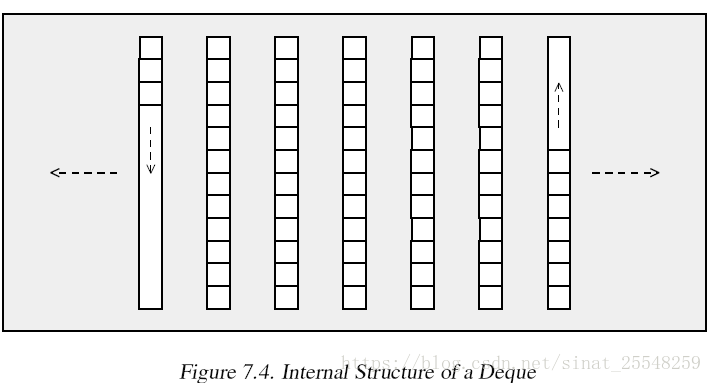

#  learn C++

[toc]

## 参考

> * [一个不错的博客](https://elloop.github.io/categories.html#c++-ref)

### 开源项目
- [poco-网络服务器](https://github.com/pocoproject/poco)
- [drogon-网络服务器](https://github.com/drogonframework/drogon)

> 1. 写一个Json库！
> https://github.com/miloyip/json-tutorial/blob/master/tutorial01/tutorial01.md
> 2. 写一个红黑树：（不再更新）
> https://github.com/william-zk/RB_Tree
> 3. 写一个STL！
> https://github.com/Alinshans/MyTinySTL
> 4. 写一个NoSQL:
> https://www.lanqiao.cn/courses/1341
> 5. 写一个高并发内存池：
> https://blog.csdn.net/qq_41562665/article/details/90546750
> 6. 写一个线程库：（不再更新）
> https://github.com/Winnerhust/uthread
> 7. **[写一个服务器框架](https://github.com/sylar-yin/sylar)！**
> https://www.bilibili.com/video/av53602631?from=search&seid=9029288577396826503
> 8. 写一个WebServer可以参考一些书:《Linux高性能服务器编程》还有陈硕的那本书
> https://github.com/linyacool/WebServer
> 9. 写一个操作系统内核搜一下 “MIT 6.828”感觉课程里的一个作业都可以拿来当做一个项目了: 
> https://github.com/woai3c/MIT6.828


## Framework
---

### 上层与底层

你理解一个事物的更底层原理对理解它会有极其深刻的影响。这不仅对计算机适用，比如你学了量子力学，就理解了化学中元素周期表是怎么回事；你学了c，就理解了python是怎么实现的；你学了机械原理，也知道了汽车很多零部件功能是怎么实现的。这种互相联系，层层深入的学习思路是极其重要的。

最底层的计算机就是电信号，当然这个点信号在物理上解释起来也极其困难。所以学习计算机语言的关键就是当它是个傻子，傻到什么都不知道：比如你写一个a=1，你就要问：它怎么知道=？它怎么知道1？他又怎么知道a？

答案很简单：它当然不知道，它什么都不知道，问题是，你怎么知道你打的那个符号就是=，你只不过按下了键盘上的一个键，然后这个键帽底下连了一根线，通了电，一路到了内存，CPU。然后你得说这是一个=，那就是咯，但是计算机什么都不知道，如果理解了这一点，学计算机只是时间问题了。

正如学习python我们要问：a = 1，它（解释器/编译器）怎么知道我写的这个是整数或小数呢？我们在c++里就会发现，它不知道，只不过我们写了函数模版，看起来就自动识别类型了。

c++的底层呢？当然就是c的底层，也就是汇编语言，`g++ -S main.cpp` 就可以把一个c++代码文件编译成汇编文件，看起来的for循环，根本没有任何智能，只是编译器为我们做了这些“把某个数从内存取出来放入某个寄存器，再加减，再压入栈”这些重新又繁琐的工作。而繁琐也是相对的，否则没有会放弃写c++代码去玩游戏（很多大型游戏底层都有c++的身影）。对于c++和汇编的关系，**《Computer System：A Programer‘s Perspective》**这本书描述的极为清晰。

### 面向对象？可没有这么‘玄’

Python 是C 写的，这其中就有一个**关键的问题**：c语言并不是面向对象，也就是没有类和对象这些定义，那怎么解释python中的面向对象部分呢？

答案也很简单：c++的面向对象是怎么来的？其实这只是计算机语言体系众多抽象概念的一个罢了——函数是什么？编译器或者解释器怎么解释？list是什么？string是什么？那么类就是什么！也就是一部分代码的集合。

对于机器来说，没有函数和类这些概念效率会更高，而对于人类，一段机器码（或者c语言中变量声明，赋值，循环，）实现了一个功能，如果把它打包做一个标签就是再好不过的了，这就是函数，这也是类。这个包。就是申请的一段连续内存（当然虚拟内存技术先忽略）

举个例子：一辆汽车，大家可能都想象得到是什么，但其实没几个人懂，你知道汽车怎么实现转向的吗？恐怕不知道，但甚至没有驾照的人都会转动方向盘，这个方向盘，就是函数，这个车就是类。这就是为什么大多数人不懂的车的工作原理（不知道类的所有原代码），但却能开车（可以进行类的实例化），也能转弯（调用类地下的函数/方法），而且换一个车基本还能开（类的继承）

### list，array or vector？

刚开始接触c语言或者python等其他，就会想，list这么着重讲有什么用？其实几乎所有数据都是一个list，甚至包括string，所谓list，就是一组顺序不可以更改的二进制数，然后按照特殊的人为规定的规则编码成不同的格式，比如字符串，图片，音频，视频，实质上对于计算机来说就是list。所以这种数据格式看起简单，但却像二进制一样意义深远。

而在c++中，verctor就是自动用new和delete来创建的动态数组，具体见下文中讲解

### 文件

读写文件的函数（不管是Python还是C++），我们发现它是无法直接内容前追加新内容的，why？

如果底层可以实现，这个write函数必然早就更新了（可以直接追加内容），我们进一步站在硬盘及文件系统的角度，想象下为什么这个看似“很人性化很简单”的操作却不可以实现：

首先硬盘就是一系列可以和光或电磁反应产生“相变”的“微观”材料，组成了“位”。而文件系统就是把这些位解释为一个个文件和文件里的内容。而这些看起来可以随意操作，随意更改的内容，在底层则必须为顺序的，严格按照一定格式的位的集合。（乱序储存也是用标记，来让其“变成”顺序读写的）。

PS：文件内容，完全是字符串编码。也就意味着：你看似写了一个Python或C++文件，里面定义了一个“数组”或“整数”，但这是编译器把这些“字符串”解释为“数组”或“整数”而已。在文件中，它们就只是字符串。

比如一个文件，在硬盘里就是一段连续的位。而位的开始某些位（确定长度或者用特殊标记字符来指定始末）就分别代指文件名，文件位置，文件类型，访问权限等一系列信息，而“紧接着”就是文件内容，所以，如何才能在文件内容开始插入一段新内容，却不改变原始内容呢？这非常难，难到现在都没有被解决。

所以现在看到的：我们在任何可以写入的app中，比如Office，记事本，Markdown编辑器等等，只要进行文件读写的，我们好像都可以随意在任意位置插入一段数据，而原始数据保持不变，但在底层，这些文件的更改不是这么简单的（哪怕你在文件开头只插入了一个字符，保存时都需要把之后的全部内容先读取到内存里，再写入才行）

PS：还有一个问题，就是文件怎么“放”，只有理解了这个问题，我们才能更好的理解为什么文件不可以不被改变的插入新数据，也能了解什么叫碎片化。


现代文件系统（操作系统的一部分）是将文件抽象的分成N个Block，新文件先分配一个Block，然后再从头开始写，写满了之后再写的话，文件系统会再分配一个块，这就说明了，为什么不能“插入”，而能追加（append）。而这同时，造成了文件碎片化，这大大拖慢了文件读写速度，怎么解决呢？

操作系统会在空闲时移动（也就是给一个文件分配相邻块，重新读写）文件来处理碎片化：


需要注意的是：尤其是对于固态硬盘，在硬件层次还是有很多问题需要处理（机械硬盘也是，但固态在分配块来均衡块寿命等），这部分不属于文件系统的工作，而是由驱动程序负责，且有专门的硬件来负责———主控芯片

### c++ 各种声明？

python 和 c++有很多区别，其中一个重要区别就是不管是变量，数组，还是函数，python都不需要声明再定义，且不用指定类型，看起来非常人性化，事实也是如此，但没这么简单：

首先c++在很多情况也可以“智能”判断，但是首先要知道，机器是不会给你“预先判断的”，所谓预先判断都是编译器的算法而已，而在使用角度肯定是越“人性化”越好，但是这样你为什么要学习代码呢？直接在屏幕上划一划不就好了，而实现这些“人性化”功能的工作总要有人做，而作为一个想了解计算机的人，这也是必经之路。

再一点就是声明也有声明的好处，比如你有些量想定义浮点值（2.0）但写成了2，这时候python不会告诉你的，而如果在c++里你声明过就没有问题。当然了，在很多情况，python是不可或缺的，因为它实现一个类似的功能，其代码要简单很多，这也是python的“占有率”这么高的原因之一。

**总结：我想要说的还是那个结论，就是理解一个事物，必须联系的看待，即理解底层，又了解上层，就非常清晰了。**

### 运算符，函数，类，库，模块？链接？

Q：new 是一个运算符，而malloc( )是一个库函数，这两者有什么区别呢？


### 标准更新与编译器

[c++20/c++17/c++14/c++11“新”特性](https://zh.cppreference.com/w/cpp/compiler_support#cpp2a)

整个计算机行业还是在“高速”发展的，尤其是和传统行业相比，学习十年前甚至几十年前的东西，当然会对理解行业底层，了解行业发展有些至关重要的帮助，但是如果要应用到当今社会，了解“更新”也是必须的，c++也是如此，常用书籍如c++ primer只是更新到c++11，而在2020年学习这些，c++20的标准已经落地了，c++14和c++17也有不少小的改动，包括对一些指令的弃用，增加和完善了一些新的功能，而这些细节虽然对整体框架没多少影响，但随着发布版本积累，积少成多的更新会影响代码结构的改变。所谓更新，就是编译器想帮你做更多事情，比如类型的自动选择，比如数组的动态长度，当然同时让代码更精简，综上所述：学习框架不分新旧，但是应用还是要了解更新，用好更新就是再利用别人（编译器）不断更新的工具，这样才能更快更好的做出自己的工具。

编译器就是对标准的“践行”，比如apple用的“自己”开发的apple clang & llvm编译器，目前2020年更新到11.0.3版本，实现了对c++17特性的全部支持和c++20特性的部分支持。[apple develop链接](https://developer.apple.com/videos/play/wwdc2019/409/)

[编译全过程](https://www.processon.com/view/link/5c70f497e4b0feef9f352ea2#map)。


### c++编译指令

[g++ 指令](https://www.cnblogs.com/yyehl/p/6862153.html) 
```bash
g++ -E test.cpp (-o test.i)#预处理, -o是指定输出文件名
g++ -S test.i (-o bala.s) #编译（生成的就是汇编文件）
g++ -c test.s -o balabala.o #汇编，生成的为二进制文件
g++ test.o #链接，就是把相关的#include文件链接起来，生成a.out文件

#单文件直接生成可执行文件
g++ test.cpp
#多文件直接生成可执行文件
g++ test1.cpp test2.cpp

gcc -Og -S -masm=intel mstore.c #预处理+编译，且汇编语言为intel格式标准，-Og表示不进行优化
gcc -fPIC -shared great_module.c -o great_module.so -I/usr/include/python2.7/ -lpython2.7 #编译c++用的python函数

##选项
-E 			#只运行 C 预编译器。
-S			#预处理+编译，生成汇编
-c			#汇编，生成二进制文件，但不链接
-o			#指定生成二进制文件名

-g 			#生成调试信息。GNU 调试器可利用该信息。
-I(DIRECTORY) #指定额外的头文件搜索路径DIRECTORY。
-L(DIRECTORY) #指定额外的函数库搜索路径DIRECTORY。
-l(LIBRARY) #连接时搜索指定的函数库LIBRARY。
-lm			#链接数学库，由于种种历史原因，include数学库时还需要手动链接

-m486 		#针对 486 进行代码优化。
-o 			#FILE 生成指定的输出文件。用在生成可执行文件时。
-O0 		#不进行优化处理。同-Og？
-O 			#或 -O1 优化生成代码。
-O2 		#进一步优化。
-O3 		#比 -O2 更进一步优化，包括 inline 函数。
-std=c++17 	#使用c++17标准
-fPIC       #编译库文件时，
-shared 	#生成共享目标文件。通常用在建立共享库时。
-static 	#禁止使用共享连接。
-UMACRO 	#取消对 MACRO 宏的定义。
-w 			#不生成任何警告信息。
-Wall 		#生成所有警告信息。
```
#### c++ 编译结果分析(重要!)

1. 编译过程分析


2. Class编译结果分析


### c++的标准库头文件都在哪？

比如下面代码，常用include<...>，这些往往是标准库的头文件，他们在哪里呢？
* Linux系统中，一般在usr/local/include，当然这主要取决去C_INCLUDE_PATH这个环境变量设置的路径。
* 在MAC系统中，这些常用的编译器被XCODE“接管”了，一般在`/Applications/Xcode.app/Contents/Developer/Platforms/MacOSX.platform/Developer/SDKs/MacOSX.sdk/usr/include`


```c++
#include "apue.h"
#include <sys/wait.h>

int
main(void)
{
	pid_t	pid;
	int		status;

	if ((pid = fork()) < 0)
		err_sys("fork error");
	else if (pid == 0)				/* child */
		exit(7);
}
```


## C++环境配置

> 注意mac用xcode--select 安装的clang编译器，默认不使用gcc标准，所以在编译时，可以使用下面指令：
> ```c
> g++ your_c_file.cpp -std=c++17
> ```

###  vscode c++配置

[配置](https://code.visualstudio.com/docs/cpp/config-clang-mac)、

1.  **create a ``tasks.json`` file** 

    -------in the `.vscode` folder and open it in the editor. Replace the contents of that file with the following:

```json
{
  // See https://go.microsoft.com/fwlink/?LinkId=733558
  // for the documentation about the tasks.json format
  "version": "2.0.0",
  "tasks": [
    {
      "type": "shell",
      "label": "clang++ build active file",
      "command": "/usr/bin/clang++",
      "args": [
        "-std=c++17",
        "-stdlib=libc++",
        "-g",
        "${file}",
        "-o",
        "${fileDirname}/${fileBasenameNoExtension}"
      ],
      "options": {
        "cwd": "${workspaceFolder}"
      },
      "problemMatcher": ["$gcc"],
      "group": {
        "kind": "build",
        "isDefault": true
      }
    }
  ]
}
```

**当我们不debug，只想一键编译执行时，tasks.json 文件应该如下**

```json
{
	"version": "2.0.0",
	"tasks": [
	  {
		"type": "process",
		"label": "build",
		"command": "/usr/bin/g++",
		"args": [
		  "-std=c++17",
		  "-stdlib=libc++",
		  "-g",
		  "-Wall",
		  "-lm",
		  "${file}",
		  "-o",
		  "${fileDirname}/${fileBasenameNoExtension}.o"
		],
		"presentation": {
			"echo": false,
			"reveal": "silent",
			"showReuseMessage": false
		},
		"options": {
		  "cwd": "${workspaceFolder}"
		},
		"problemMatcher": ["$gcc"],
		"group": {
		  "kind": "build",
		  "isDefault": true
		}
	  },
	  {
		"label": "run",
		"type": "shell",
		"dependsOn": "build",
		"command": "${fileDirname}/${fileBasenameNoExtension}.o",
		"presentation": {
		  "focus": true
		},
		"group": {
		  "kind": "test",
		  "isDefault": true
		}
	  }
	]
  }
```

这样我们就可以通过 vscode 的指令`task: run test task` 一键编译执行c++文件！

2. **creates a `launch.json` file** 

------From the main menu, choose **Run** > **Add Configuration...** and then choose **C++ (GDB/LLDB)**. opens it in the editor, and builds and runs 'helloworld'. Your `launch.json` file will look something like this:

```json
{
  // Use IntelliSense to learn about possible attributes.
  // Hover to view descriptions of existing attributes.
  // For more information, visit: https://go.microsoft.com/fwlink/?linkid=830387
  "version": "0.2.0",
  "configurations": [
    {
      "name": "clang++ - Build and debug active file",
      "type": "cppdbg",
      "request": "launch",
      "program": "${fileDirname}/${fileBasenameNoExtension}",
      "args": [],
      "stopAtEntry": true,
      "cwd": "${workspaceFolder}",
      "environment": [],
      "externalConsole": false,
      "MIMode": "lldb",
      "preLaunchTask": "clang++ build active file"
    }
  ]
}
```

3. **creat a `c_cpp_properties.json` file**

    ----- View the C/C++ configuration UI by running the command **C/C++: Edit Configurations (UI)** from the Command Palette (⇧⌘P).

```json
{
  "configurations": [
  {
    "name": "Mac",
    "includePath": [
    "${workspaceFolder}/**",
    "/Library/Developer/CommandLineTools/usr/include/c++/v1",
    "/usr/local/include",
    "/Library/Developer/CommandLineTools/usr/include"
    ],
    "defines": [],
    "macFrameworkPath": [
    "/System/Library/Frameworks",
    "/Library/Frameworks"
    ],
    "compilerPath": "/usr/bin/clang",
    "cStandard": "c11",
    "cppStandard": "c++17",
    "intelliSenseMode": "clang-x64"
  }
  ],
  "version": 4
}

```


### windows的c++编译器

#### GNU（mingw64）

* 安装mingw-[w64](http://mingw-w64.org/)、
* [一个傻瓜式安装mingw64的博客](https://www.jianshu.com/p/d66c2f2e3537)、

```bash
# 这显示mingw-c的库搜索路径
gcc -print-search-dirs
```


上图所示，我们创建几个环境变量，定义“用户”的库文件和头文件搜索地址：

* C_INCLUDE_PATH
* CPLUS_INCLUDE_PATH
* LIBRARY_PATH
* LD_LIBRARY_PATH

上述四个变量分别指定了C/C++头文件、静态库、动态库搜索地址。但要注意的是，这只是让编译器（mingw）找到它们，然后成功编译，但是若有动态库（因为动态库是运行是链接的），还需要“告诉”操作系统动态库的位置，即添加动态库路径。当然，你也可以把你的动态库放入默认的动态库文件夹中，64位动态库默认在`C:\Windows\System32`中。但我并不推荐，这样不利于管理，系统升级后也可能失效之类的。所以把这个路径加入环境变量Path，系统会找到。


#### Clang+LLVM

* 官网有window[编译版本](https://releases.llvm.org/download.html)、

但可能会出问题：这是个半成品，GCC的库（包括头文件和动静态库都没有），它默认去找VS版本，我们需要让它找mingw版本。

https://zhuanlan.zhihu.com/p/34520938

```bash
clang++ -O3 -target x86_64-pc-windows-gnu for.cpp -o for.exe
```


#### 安装msys2

* [msys2](https://www.msys2.org/)、

msys2和mingw的关系见下文节选知乎的片段，这里简要说明一下：

msys就像是“app store”，用来在windows系统 下载安装配置 一系列linux系统的开发套件，最核心套件就是mingw，也就是GCC编译器的windows实现。

所以如上述情况，已经安装了mingw-w64，则安装msys2后可以选择把mingw64文件夹剪切到`msys64\mingw64`文件夹中。（环境变量也要改过来）

[一个msys2详细的安装博客](https://hustlei.github.io/2018/11/msys2-for-win.html)、

#### mingw、msys、cygwin？
> [一个知乎回答](https://www.zhihu.com/question/22137175)


#### make
* [Makefile](https://seisman.github.io/how-to-write-makefile/introduction.html):
* [跟我一起写 Makefile](https://haoel.blog.csdn.net/article/details/2886?spm=1001.2014.3001.5502)

一般有一定规模的软件不会自己手动在命令行编译，这时候make工具包（也是一个软件）应运而生。也就是类似一个shell脚本，执行一系列的编译文件。

但但但是！这也太麻烦了，中大型项目根本不可能自己完成makefile，所以，[autotools](http://inti.sourceforge.net/tutorial/libinti/autotoolsproject.html)应运而生，与此“竞争”的是cmake工具包，总之他们两个是目前（2020年）主流的c系语言大型软件编译的两大解决方案。

#### cmake
* [cmake](https://www.hahack.com/codes/cmake/)：

##### 什么是 CMake

> All problems in computer science can be solved by another level of indirection. 
>
> **David Wheeler**

你或许听过好几种 Make 工具，例如 [GNU Make](https://www.hahack.com/wiki/tools-makefile.html) ，QT 的 [qmake](http://qt-project.org/doc/qt-4.8/qmake-manual.html) ，微软的 [MS nmake](http://msdn.microsoft.com/en-us/library/ms930369.aspx)，BSD Make（[pmake](http://www.freebsd.org/doc/en/books/pmake/)），[Makepp](http://makepp.sourceforge.net/)，等等。这些 Make 工具遵循着不同的规范和标准，所执行的 Makefile 格式也千差万别。这样就带来了一个严峻的问题：如果软件想跨平台，必须要保证能够在不同平台编译。而如果使用上面的 Make 工具，就得为每一种标准写一次 Makefile ，这将是一件让人抓狂的工作。

CMake 就是针对上面问题所设计的工具：它首先允许开发者编写一种平台无关的 CMakeList.txt 文件来定制整个编译流程，然后再根据目标用户的平台进一步生成所需的本地化 Makefile 和工程文件，如 Unix 的 Makefile 或 Windows 的 Visual Studio 工程。从而做到“Write once, run everywhere”。显然，CMake 是一个比上述几种 make 更高级的编译配置工具。一些使用 CMake 作为项目架构系统的知名开源项目有 [VTK](http://www.vtk.org/)、[ITK](http://www.itk.org/)、[KDE](http://kde.org/)、[OpenCV](http://www.opencv.org.cn/opencvdoc/2.3.2/html/modules/core/doc/intro.html)、[OSG](http://www.openscenegraph.org/) 等 [[1\]](https://www.hahack.com/codes/cmake/#fn1)。

在 linux 平台下使用 CMake 生成 Makefile 并编译的流程如下：

1. 编写 CMake 配置文件 CMakeLists.txt 。
2. 执行命令 `cmake PATH` 或者 `ccmake PATH` 生成 Makefile（`ccmake` 和 `cmake` 的区别在于前者提供了一个交互式的界面）。其中， `PATH` 是 CMakeLists.txt 所在的目录。
3. 使用 `make` 命令进行编译。

本文将从实例入手，一步步讲解 CMake 的常见用法，文中所有的实例代码可以在[这里](https://github.com/wzpan/cmake-demo)找到。如果你读完仍觉得意犹未尽，可以继续学习我在文章末尾提供的其他资源。

##### 单个源文件


对于简单的项目，只需要写几行代码就可以了。例如，假设现在我们的项目中只有一个源文件 [main.cc](http://main.cc/) ，该程序的用途是计算一个数的指数幂。

```c++
#include <stdio.h>
#include <stdlib.h>

/**
 * power - Calculate the power of number.
 * @param base: Base value.
 * @param exponent: Exponent value.
 *
 * @return base raised to the power exponent.
 */
double power(double base, int exponent)
{
    int result = base;
    int i;
    
    if (exponent == 0) {
        return 1;
    }
    
    for(i = 1; i < exponent; ++i){
        result = result * base;
    }

    return result;
}

int main(int argc, char *argv[])
{
    if (argc < 3){
        printf("Usage: %s base exponent \n", argv[0]);
        return 1;
    }
    double base = atof(argv[1]);
    int exponent = atoi(argv[2]);
    double result = power(base, exponent);
    printf("%g ^ %d is %g\n", base, exponent, result);
    return 0;
}
```

* 编写 CMakeLists.txt

首先编写 CMakeLists.txt 文件，并保存在与 [main.cc](http://main.cc/) 源文件同个目录下：

```cmake
# CMake 最低版本号要求
cmake_minimum_required (VERSION 2.8)

# 项目信息
project (Demo1)

# 指定生成目标
add_executable(Demo main.cc)
```

CMakeLists.txt 的语法比较简单，由命令、注释和空格组成，其中命令是不区分大小写的。符号 `#` 后面的内容被认为是注释。命令由命令名称、小括号和参数组成，参数之间使用空格进行间隔。

对于上面的 CMakeLists.txt 文件，依次出现了几个命令：

1. `cmake_minimum_required`：指定运行此配置文件所需的 CMake 的最低版本；
2. `project`：参数值是 `Demo1`，该命令表示项目的名称是 `Demo1` 。
3. `add_executable`： 将名为 [main.cc](http://main.cc/) 的源文件编译成一个名称为 Demo 的可执行文件。

* 编译项目

之后，在当前目录执行 `cmake .` ，得到 Makefile 后再使用 `make` 命令编译得到 Demo1 可执行文件。

```bash
[ehome@xman Demo1]$ cmake .
-- The C compiler identification is GNU 4.8.2
-- The CXX compiler identification is GNU 4.8.2
-- Check for working C compiler: /usr/sbin/cc
-- Check for working C compiler: /usr/sbin/cc -- works
-- Detecting C compiler ABI info
-- Detecting C compiler ABI info - done
-- Check for working CXX compiler: /usr/sbin/c++
-- Check for working CXX compiler: /usr/sbin/c++ -- works
-- Detecting CXX compiler ABI info
-- Detecting CXX compiler ABI info - done
-- Configuring done
-- Generating done
-- Build files have been written to: /home/ehome/Documents/programming/C/power/Demo1
[ehome@xman Demo1]$ make
Scanning dependencies of target Demo
[100%] Building C object CMakeFiles/Demo.dir/main.cc.o
Linking C executable Demo
[100%] Built target Demo
[ehome@xman Demo1]$ ./Demo 5 4
5 ^ 4 is 625
[ehome@xman Demo1]$ ./Demo 7 3
7 ^ 3 is 343
[ehome@xman Demo1]$ ./Demo 2 10
2 ^ 10 is 1024
```

##### 同一目录，多个源文件

上面的例子只有单个源文件。现在假如把 `power` 函数单独写进一个名为 `MathFunctions.c` 的源文件里，使得这个工程变成如下的形式：

```bash
./Demo2
    |
    +--- main.cc
    |
    +--- MathFunctions.cc
    |
    +--- MathFunctions.h
```

这个时候，CMakeLists.txt 可以改成如下的形式：

```cmake
# CMake 最低版本号要求
cmake_minimum_required (VERSION 2.8)

# 项目信息
project (Demo2)

# 指定生成目标
add_executable(Demo main.cc MathFunctions.cc)
```

唯一的改动只是在 `add_executable` 命令中增加了一个 `MathFunctions.cc` 源文件。这样写当然没什么问题，但是如果源文件很多，把所有源文件的名字都加进去将是一件烦人的工作。更省事的方法是使用 `aux_source_directory` 命令，该命令会查找指定目录下的所有源文件，然后将结果存进指定变量名。其语法如下：

```cmake
aux_source_directory(<dir> <variable>)
```

因此，可以修改 CMakeLists.txt 如下：

```cmake
# CMake 最低版本号要求
cmake_minimum_required (VERSION 2.8)

# 项目信息
project (Demo2)

# 查找当前目录下的所有源文件
# 并将名称保存到 DIR_SRCS 变量
aux_source_directory(. DIR_SRCS)

# 指定生成目标
add_executable(Demo ${DIR_SRCS})
```

这样，CMake 会将当前目录所有源文件的文件名赋值给变量 `DIR_SRCS` ，再指示变量 `DIR_SRCS` 中的源文件需要编译成一个名称为 Demo 的可执行文件。

##### 多个目录，多个源文件


本小节对应的源代码所在目录：[Demo3](https://github.com/wzpan/cmake-demo/tree/master/Demo3)。

现在进一步将 MathFunctions.h 和 [MathFunctions.cc](http://mathfunctions.cc/) 文件移动到 math 目录下。

```bash
./Demo3
    |
    +--- main.cc
    |
    +--- math/
          |
          +--- MathFunctions.cc
          |
          +--- MathFunctions.h
```

对于这种情况，需要分别在项目根目录 Demo3 和 math 目录里各编写一个 CMakeLists.txt 文件。为了方便，我们可以先将 math 目录里的文件编译成静态库再由 main 函数调用。

根目录中的 CMakeLists.txt ：

```cmake
# CMake 最低版本号要求
cmake_minimum_required (VERSION 2.8)

# 项目信息
project (Demo3)

# 查找当前目录下的所有源文件
# 并将名称保存到 DIR_SRCS 变量
aux_source_directory(. DIR_SRCS)

# 添加 math 子目录
add_subdirectory(math)

# 指定生成目标 
add_executable(Demo main.cc)

# 添加链接库
target_link_libraries(Demo MathFunctions)
```

该文件添加了下面的内容: 第3行，使用命令 `add_subdirectory` 指明本项目包含一个子目录 math，这样 math 目录下的 CMakeLists.txt 文件和源代码也会被处理 。第6行，使用命令 `target_link_libraries` 指明可执行文件 main 需要连接一个名为 MathFunctions 的链接库 。

子目录中的 CMakeLists.txt：

```cmake
# 查找当前目录下的所有源文件
# 并将名称保存到 DIR_LIB_SRCS 变量
aux_source_directory(. DIR_LIB_SRCS)

# 生成链接库
add_library (MathFunctions ${DIR_LIB_SRCS})
```

在该文件中使用命令 `add_library` 将 src 目录中的源文件编译为静态链接库。


#### automake

* [automake](https://www.gnu.org/software/automake/manual/html_node/index.html#SEC_Contents):

```bash
#Ubuntu
sudo apt update #更新
sudo apt upgrade

sudo apt install build-essential

sudo apt install gcc g++ make cmake gfortran#上边指令应该就是安装了这几个，但没有gfortran

sudo apt install wget curl vim git #下载、编辑器

sudo apt install autoconf automake libtool #额外不在build-essential里的GNU套件
```

```bash
#mac

```


## Theory

### c++参考网页
* [cplusplus](https://www.cplusplus.com)
* [cppreference](https://en.cppreference.com/w/)
* [The C++ Standards Committee](http://www.open-std.org/JTC1/SC22/WG21/)
* [Microsoft C++、C 和汇编程序文档](https://docs.microsoft.com/zh-cn/cpp/?view=msvc-170)

### 头文件

头文件最大的作用在于，一个include 就可以把其他文件的所有函数声明写在“前面”，然后随时调用。

这样就又产生了另一个好处：在编译的时候，只要头文件没有更改（也就是函数声明没有改变），只改动了函数的定义（具体实现方式），需要它（这个文件）的文件是不需要重新编译的。

比如，makefile中，文件只依赖于“所需函数”所在的头文件，而不依赖于它的定义，也就是“库文件”，这样改变函数定义（没有改声明）的话，make只需要重编译库文件，再进行链接。

头文件中常包含的内容。
● 函数原型。
● 使用#define或const定义的符号常量。
● 结构声明。
● 类声明。
● 模板声明。
● 内联函数。

1. 头文件名称

> 包含头文件时，我们使用“coordin.h”，而不是<coodin.h>。如果文件名包含在尖括号中，则C++编译器将在存储标准头文件的主机系统的文件系统中查找；但如果文件名包含在双引号中，则编译器将首先查找当前的工作目录或源代码目录（或其他目录，这取决于编译器）。如果没有在那里找到头文件，则将在标准位置查找。因此**在包含自己的头文件时，应使用引号而不是尖括号**。

2. 同一个文件中只能将同一个头文件包含一次

   所有头文件都应该使用 `#define` 来防止头文件被多重包含 (在同一个文件中只能将同一个头文件包含一次)。记住这个规则很容易，但很可能在不知情的情况下将头文件包含多次。例如，可能使用包含了另外一个头文件的头文件。

   有一种标准的C/C++技术可以避免多次包含同一个头文件。它是基于预处理器编译指令`#ifndef`（即if not defined）的。下面的代码片段意味着仅当以前没有使用预处理器编译指令`#define`定义名称`FOO_BAR_BAZ_H_`时，才处理`#ifndef`和`#endif`之间的语句.

   为保证唯一性, 头文件的命名应该基于所在项目源代码树的全路径, 命名格式当是: `<PROJECT>_<PATH>_<FILE>_H_` . 例如, 项目 `foo` 中的头文件 `foo[表情]c/bar/baz.h` 可按如下方式保护:
   
   ```c++
   #ifndef FOO_BAR_BAZ_H_
   #define FOO_BAR_BAZ_H_
   ...
   #endif // FOO_BAR_BAZ_H_
   ```


### c++运算符的优先级

当然，这是根据您提供的原始内容恢复和整理后的C++操作符优先级表格。我对格式进行了优化，并修正了一些描述和例子，使其更准确、清晰和易于理解。

### C++ 操作符优先级与结合性

| 优先级 | 操作符                                                                                             | 描述                                           | 例子                                                                                             | 结合性   |
| :----- | :------------------------------------------------------------------------------------------------- | :--------------------------------------------- | :----------------------------------------------------------------------------------------------- | :------- |
| **1**  | `::`                                                                                               | 作用域解析                                     | `std::cout`                                                                                      | 从左到右 |
|        | **`()`**                                                                                           | 函数调用、初始化、类型转换                     | `func(), int(x), T(x)`                                                                           |          |
|        | **`[]`**                                                                                           | 数组下标                                       | `array[5]`                                                                                       |          |
|        | **`.`**                                                                                            | 通过对象访问成员                               | `obj.member`                                                                                     |          |
|        | **`->`**                                                                                           | 通过指针访问成员                               | `ptr->member`                                                                                    |          |
|        | **`++`** **`--`**                                                                                  | 后置自增与自减                                 | `i++, i--`                                                                                       |          |
| **2**  | **`++`** **`--`**                                                                                  | 前置自增与自减                                 | `++i, --i`                                                                                       | 从右到左 |
|        | **`+`** **`-`**                                                                                    | 一元正号、一元负号                             | `+5, -value`                                                                                     |          |
|        | **`!`** **`~`**                                                                                    | 逻辑非、按位取反                               | `!done, ~flags`                                                                                  |          |
|        | **`(type)`**                                                                                       | C风格类型转换                                  | `(int) floatNum`                                                                                 |          |
|        | **`*`**                                                                                            | 解引用（取指针指向的值）                       | `*ptr`                                                                                           |          |
|        | **`&`**                                                                                            | 取地址                                         | `&obj`                                                                                           |          |
|        | **`sizeof`**                                                                                       | 获取类型或对象的大小                           | `sizeof(int), sizeof x`                                                                          |          |
|        | **`new`** **`new[]`** **`delete`** **`delete[]`**                                                  | 动态内存分配与释放                             | `new T, delete ptr`                                                                              |          |
|        | **`co_await`**                                                                                     | await表达式 (C++20)                            | `co_await promise`                                                                               |          |
| **3**  | **`.*`** **`->*`**                                                                                 | 成员指针访问                                   | `obj.*ptr, pmember->*ptr`                                                                        | 从左到右 |
| **4**  | **`*`** **`/`** **`%`**                                                                            | 乘法、除法、取模（取余）                       | `2 * 4, 10 / 3, 4 % 3`                                                                           | 从左到右 |
| **5**  | **`+`** **`-`**                                                                                    | 加法、减法                                     | `2 + 3, 5 - 1`                                                                                   | 从左到右 |
| **6**  | **`<<`** **`>>`**                                                                                  | 按位左移、按位右移                             | `flags << 2, flags >> 1`                                                                         | 从左到右 |
| **7**  | **`<=>`**                                                                                          | 三路比较 (C++20)                               | `a <=> b`                                                                                        | 从左到右 |
| **8**  | **`<`** **`<=`** **`>`** **`>=`**                                                                  | 小于、小于等于、大于、大于等于                 | `i < 42, i >= 0`                                                                                 | 从左到右 |
| **9**  | **`==`** **`!=`**                                                                                  | 等于、不等于                                   | `i == 42, i != 0`                                                                                | 从左到右 |
| **10** | **`&`**                                                                                            | 按位与                                         | `flags & new_flags`                                                                              | 从左到右 |
| **11** | **`^`**                                                                                            | 按位异或                                       | `flags ^ new_flags`                                                                              | 从左到右 |
| **12** | **`\|`**                                                                                           | 按位或                                         | `flags \| new_flags`                                                                             | 从左到右 |
| **13** | **`&&`**                                                                                           | 逻辑与                                         | `conditionA && conditionB`                                                                       | 从左到右 |
| **14** | **`\|\|`**                                                                                         | 逻辑或                                         | `conditionA \|\| conditionB`                                                                     | 从左到右 |
| **15** | **`? :`**                                                                                          | 条件（三元）运算符                             | `int max = (a > b) ? a : b;`                                                                     | **从右到左** |
|        | **`=`** **`+=`** **`-=`** **`*=`** **`/=`** **`%=`** **`<<=`** **`>>=`** **`&=`** **`^=`** **`\|=`** | 赋值、复合赋值                                 | `a = b; a += 3; a <<= 2;`                                                                        | **从右到左** |
|        | **`throw`**                                                                                        | 抛出异常                                       | `throw std::runtime_error("Error");`                                                             |          |
| **16** | **`,`**                                                                                            | 逗号运算符                                     | `for(i=0, j=0; ...; i++, j++)`                                                                   | 从左到右 |

*   **优先级数字 (1为最高)**：数字越小，优先级越高。例如，乘法(`4`)优先于加法(`5`)。
*   **结合性**：当多个相同优先级的操作符相邻时，计算的方向。
    *   **从左到右**：表达式从左向右分组求值。例如，`a - b - c` 等价于 `(a - b) - c`。
    *   **从右到左**：表达式从右向左分组求值。例如，`a = b = c` 等价于 `a = (b = c)`。
*   **注意**：操作符优先级决定了表达式的**组合方式**，但并不完全决定其**求值顺序**。例如，在 `f() + g() * h()` 中，`g() * h()` 确定在 `f()` 之后计算，但 `f()`, `g()`, `h()` 三个函数的具体调用顺序是未指定的。


### 名称空间

名称空间支持是一项C++特性，旨在让您编写大型程序以及将多个厂商现有的代码组合起来的程序时更容易，它还有助于组织程序。一个潜在的问题是，可能使用两个已封装好的产品，而它们都包含一个名为wanda( )的函数。这样，使用wanda( )函数时，编译器将不知道指的是哪个版本。名称空间让厂商能够将其产品封装在一个叫做名称空间的单元中，这样就可以用名称空间的名称来指出想使用哪个厂商的产品。因此，Microflop Industries可以将其定义放到一个名为Microflop的名称空间中。这样，其wanda( )函数的全称Microflop::wanda( )；同样，Piscine公司的wanda( )版本可以表示为Piscine::wanda( )。这样，程序就可以使用名称空间来区分不同的版本了：

```c++
Microflop::wanda("go dancing?"); //using Microflop namespace
Piscine::wanda("go dancing?"); //using Piscine namespace
using namespace std; //偷懒做法，使以后的函数都不必加上std::的前缀
```


### 运算符重载

如果熟悉C后才开始学习C++，则可能注意到了，插入运算符（<<）看上去就像按位左移运算符（<<），这是一个运算符重载的例子，通过重载，同一个运算符将有不同的含义。编译器通过上下文来确定运算符的含义。C本身也有一些运算符重载的情况。例如，&符号既表示地址运算符，又表示按位AND运算符；* 既表示乘法，又表示对指针解除引用。这里重要的不是这些运算符的具体功能，而是同一个符号可以有多种含义，而编译器可以根据上下文来确定其含义（这和确定“sound card”中的“sound”与“sound financial basic”中的“sound”的含义是一样的）。C++扩展了运算符重载的概念，允许为用户定义的类型（类）重新定义运算符的含义。

**printf 与 cout**

同为显示信息，cout要“聪明”的多：

```c++
printf("%s\n","hello world!，this is in c++");
printf("%d\n",25)
   
//下面是使用cout来输出
cout << "hello world!，this is in c++" << 25;
```

### 数组

就如同c++中其他任何“item”，数组也需要声明：

```c++
int months[12]; //声明了一个数组，个数是12，数组元素类型为int，名为months


```

只有在定义数组时才能使用初始化，此后就不能使用了，也不能将一个数组赋给另一个数组。

```c++
int cards[4] = {3, 6, 8, 10}; //that's ok
int hand[4];  //that's ok
hand[4] = {5, 6, 7, 9}  //not allowed
hand = cards;  //not allowed
```

这样声明有一个问题：为了避免报错，我声明一个数组的长度肯定要大于我需要的长度。但这样会浪费很多内存，**OOP强调的是运行阶段进行决策而不是编译阶段进行决策，也就是动态调整系统分配给数组的内存块大小。**这时候就用到动态数组：

```c++
#include <iostream>

int main()
{
    using namespace std;
    int a;
    cout << "Type the lenth of a list: ";
    cin >> a;

    //用new在堆（heap）/自由存储区（free）创建动态数组（对于上述变量和数组的创建，没有用new的，都是在‘栈’中）
    int* psome = new int[a];  // 这是常规数组做不到的

    //输入数组元素
    int i;
    for (i = 0; i<a; i++)
    {   //这里没有花括号，新标准下也是合法的
        cout << "Type the " << i+1 << "th element of the list: ";
        cin >> *(psome + i);
    };

    //输出数组元素
    cout << endl << "The list is [ ";
    for (i = 0; i<a; i++)
        cout << psome[i] << " "; //c++都是用指针处理数组，所以声明了一个指针指向这个数组时，同样可以作为数组名使用
    cout << "]\n";

    delete [] psome;
    
    return 0;
}
```


### 字符串

#### 字符串“重载”+/-运算符
为了方便很多操作，char类型也是可以用+/-符号来运算的，在硬件层面，其实就是他们的二进制进入加法器相加减，得到的二进制值，并不再以char类型来体现，而是被“强制”转换为int类型，但注意，在二进制值上，没有区别，但是如何解释很关键。
另一方面，若`char c = '1'-'0'`，就会把这个二进制的1，再次转换为char类型，也就是1对应的ASCII码。

所以，char之间相加减，本质可以看作运算符重载，+是一个函数：`int add(char c1, char c2);` 而`char c = '1'-'0'`时，就会发生强制类型转换，将int转为char，具体应用代码见下：

```c
#include <iostream>
#include <string>
using namespace std;

// 下一大章《面试题》--《字符串相加》中，运用更为深刻。
int main(){
    string s = "8964554";

    for (int i = 0; i < s.size(); ++i){
        s[i] -= '1';
        cout << typeid(s[i] - '1').name();
        // s[i] = s[i] - '1';
        // char c = s[i] - '1';
    }

    for (int i = 0; i < s.size(); ++i){
        cout << typeid(s[i]).name();
    }

    return 0;
}
```

#### 字符串指针

```c++
#include <iostream>

int main()
{
    using namespace std;
    const char * wail = "ululate";    // wail points to string

    int a = 12;
    int * p = &a;

    cout << wail << endl;    //cout 重载了 指向char类型的地址，直接将其显示为字符串本身
    
    //下面指令结果：0x10539df50
    cout << (int *) wail << endl;   //强制类型转换为int*，由于cout不重载int指针，所以能显示地址

    cout << (long long int) wail << endl;

    //下面指令结果：0x10539df50
    printf("%p\n", wail);      

    //下面指令结果：ululate
    printf("%s\n", wail);      

    //下面指令结果：87678800
    printf("%d\n", wail);      //warning: format specifies type 'int' but the argument has type 'const char *'
    
    //下面是16进制int输出wail：a79ff40
    printf("%x\n", wail);
    
    return 0;
}

```

#### c/c++ 进制转换

```c++
#include <bitset>  
#include<iostream>
using namespace std;

int main()
{
	printf("%05o\n",35);    //按八进制格式输出，保留5位高位补零
	printf("%03d\n",35);    //按十进制格式输出，保留3位高位补零
	printf("%05x\n",35);    //按十六进制格式输出，保留5位高位补
    
    cout << "35的8进制:" << std::oct << 35<< endl;  
    cout << "35的10进制" << std::dec << 35 << endl;  
    cout << "35的16进制:" << std::hex << 35 << endl;  
    cout << "35的2进制: " << bitset<8>(35) << endl;      //<8>：表示保留8位输出
    return 0;  
}
```

#### 字符串转数字


这个算法题解答见leetcode:
* [atoi--leetcode](https://leetcode-cn.com/problems/string-to-integer-atoi/)
* [atof--leetcode](https://leetcode-cn.com/problems/biao-shi-shu-zhi-de-zi-fu-chuan-lcof/)

当然, c标准库中都替我们实现好了,具体有三个系列: 
* sto 系列 
* ato 系列
* strto 系列

注: 后面接i就是转int, 后面接d就是转double, 比如atio就是转int, strtod就是转double.


### 输入输出


> 节选自：[输入输出](https://www.runoob.com/note/50168)
> 
> C++ 中常见的几种输入字符串的方法如下：
> cin、cin.get()、cin.getline()、getline()、gets()、getchar()
> 
> 1. cin>>
> 用法一：最常用、最基本的用法，输入一个数字：
> ```c
> #include <iostream>
> using namespace std;
> int main ()
> {
>   int a,b;
>   cin>>a>>b;
>   cout<<a+b<<endl;
> }
> ```
> //输入：2[回车]3[回车]
> //输出：5
> 
> 用法二：接受一个字符串，遇“空格”、“Tab”、“回车”都结束
> ```c
> #include <iostream>
> using namespace std;
> int main ()
> {
>   char a[20];
>   cin>>a;
>   cout<<a<<endl;
> }
> ```
> //输入：jkljkljkl
> //输出：jkljkljkl
> 
> //输入：jkljkl jkljkl //遇空格结束，所以不能输入多个单词
> //输出：jkljkl
> 
> 2. cin.get()
> 用法一：cin.get(字符变量名)可以用来接收字符
> ```c
> #include <iostream>
> using namespace std;
> int main ()
> {
> char ch;
> ch=cin.get(); //或者cin.get(ch);只能获取一个字符
> cout<<ch<<endl;
> }
> ```
> //输入：jljkljkl
> //输出：j
> 用法二：cin.get(字符数组名，接收字符数)用来接收一行字符串，可以接收空格
> ```c
> #include <iostream>
> using namespace std;
> int main ()
> {
> char a[20];
> cin.get(a,20); //有些类似getline。可以输入多个单词，中间空格隔开。
> cout<<a<<endl;
> }
> ```
> //输入：jkl jkl jkl
> //输出：jkl jkl jkl
> 
> //输入：abcdeabcdeabcdeabcdeabcde （输入25个字符）
> //输出：abcdeabcdeabcdeabcd （接收19个字符+1个'\0'）
> 
> 
> 用法三：cin.get(无参数)没有参数主要是用于舍弃输入流中的不需要的字符, > 或者舍弃回车, 弥补cin.get(字符数组名,接收字符数目)的不足.
> ```c
> #include <iostream>
> using namespace std;
>  
> int main(void)
> {
>      
>     char arr[10];
>     cin.get(arr,10);
>     cin.get();//用于吃掉回车，相当于getchar();
>     cout<<arr<<endl;
>     cin.get(arr,5);
>     cout<<arr<<endl;
>     system("pause");
>     return 0;
> }
> ```
> //输入abcdefghi
> //输出abcdefghi
> //输入abcde
> //输出abcd
> //请按任意键继续
> ```c
> #include <iostream>
> using namespace std;
>  
> int main(void)
> {
>      
>     char arr[10];
>     cin.get(arr,10);
>     //cin.get();//用于吃掉回车，相当于getchar(); 现在把这行注释掉试试看
>     cout<<arr<<endl;
>     cin.get(arr,5);
>     cout<<arr<<endl;
>     system("pause");
>     return 0;
> }
> ```
> //输入abcdefghi
> //输出abcdefghi
> //请按任意键继续
> 
> 3. cin.getline()
> cin.getline(): 接受一个字符串，可以接收空格并输出
> ```c
> #include <iostream>
> using namespace std;
> int main ()
> {
> char m[20];
> cin.getline(m,5); //与上面基本相同。
> cout<<m<<endl;
> }
> ```
> //输入：jkljkljkl
> //输出：jklj
> 接受5个字符到m中，其中最后一个为'\0'，所以只看到4个字符输出； 
> 如果把5改成20：
> 输入：jkljkljkl
> 输出：jkljkljkl
> 
> 输入：jklf fjlsjf fjsdklf
> 输出：jklf fjlsjf fjsdklf
> 延伸：
> cin.getline()实际上有三个参数，cin.getline(接受字符串到m,接受个数5,结束字符)
> 当第三个参数省略时，系统默认为'\0' 是‘/n’吧。
> 如果将例子中cin.getline()改为cin.getline(> m,5,'a');当输入jlkjkljkl时输出jklj，输入jkaljkljkl时，输出jk
> 当用在多维数组中的时候，也可以用cin.getline(m[i],20)之类的用法： 
> ```c
> #include<iostream>
> #include<string>
> using namespace std;
> 
> int main ()
> {
> char m[3][20];
> for(int i=0;i<3;i++)
> {
> cout<<"\n请输入第"<<i+1<<"个字符串："<<endl;
> cin.getline(m[i],20);
> }
> 
> cout<<endl;
> for(int j=0;j<3;j++)
> cout<<"输出m["<<j<<"]的值:"<<m[j]<<endl;
> 
> }
> ```
> 测试：
> 请输入第1个字符串：
> kskr1
> 
> 请输入第2个字符串：
> kskr2
> 
> 请输入第3个字符串：
> kskr3
> 
> 输出m[0]的值:kskr1
> 输出m[1]的值:kskr2
> 输出m[2]的值:kskr3
> 

1. getline()
getline() ：接受一个字符串，可以接收空格并输出，需包含 `#include<string>`

```c
#include<iostream>
#include<string>
using namespace std;
int main ()
{
    string str;
    getline(cin,str);
    cout<<str<<endl;
}
```
测试：
输入：jkljkljkl //VC6中有个bug,需要输入两次回车。
输出：jkljkljkl

输入：jkl jfksldfj jklsjfl
输出：jkl jfksldfj jklsjfl

和cin.getline()类似，但是cin.getline()属于istream流，而getline()属于strin> g流，是不一样的两个函数

1. gets()
gets()： 接受一个字符串，可以接收空格并输出，需包含 #include string> 。
```c
#include<iostream>
#include<string>
using namespace std;
int main ()
{
    char m[20];
    gets(m); //不能写成m=gets();
    cout<<m<<endl;
}
```
测试：
输入：jkljkljkl
输出：jkljkljkl

输入：jkl jkl jkl
输出：jkl jkl jkl

类似cin.getline()里面的一个例子，gets()同样可以用在多维数组里面： 
```c
#include<iostream>
#include<string>
using namespace std;

int main ()
{
    char m[3][20];
    for(int i=0;i<3;i++)
    {
        cout<<"\n请输入第"<<i+1<<"个字符串："<<endl;
        gets(m[i]);
    }

    cout<<endl;
    for(int j=0;j<3;j++)
        cout<<"输出m["<<j<<"]的值:"<<m[j]<<endl;
}
```
测试：
请输入第1个字符串：
kskr1

请输入第2个字符串：
kskr2

请输入第3个字符串：
kskr3

输出m[0]的值:kskr1
输出m[1]的值:kskr2
输出m[2]的值:kskr3

自我感觉gets()和cin.getline()的用法很类似，只不过cin.getline()多一个参数罢了> ； 
这里顺带说明一下，对于本文中的这个kskr1,kskr2,kskr3的例子，对于cin>>也可以适用> ，原因是这里输入的没有空格，如果输入了空格，比如“ks kr jkl[回车]> ”那么cin就会已经接收到3个字符串，“ks,kr,jkl”；再如“kskr 1[回车]kskr 2[回车]> ”，那么则接收“kskr,1,kskr”；这不是我们所要的结果！而cin.getline()和gets()因> 为可以接收空格，所以不会产生这个错误；
6.getchar()
getchar() ：接受一个字符，需包含 `#include<string>`。
```c
#include<iostream>
using namespace std;
int main ()
{
    char ch;
    ch=getchar(); //不能写成getchar(ch);
    cout<<ch<<endl;
}
```

测试：
输入：jkljkljkl
输出：j


### 结构

数组无法存储不是同一类型的一组数据，这时“结构”就应运而生。**结构声明定义了一种新类型**

```c++
#include <iostream>
#include <string>


int main()
{
    using namespace std;
    
    struct inflatable
    {
        char name[20];
        float volume;
        double price;
    };  //有点像类，这是定义结构---定义了一种新类型
    
    inflatable hat;  //这是创建这种类型的变量
    
    return 0;
}
```


### 函数定义与调用

这就是（函数原型）为什么python中调用函数需要先定义，就是因为解释器也需要先读取函数声明，但python简化了这一过程，所以也就不能之后定义。

这更解释了python中一特例，就是在a函数中调用b函数时可以把b函数定义放在a后，这是因为python执行def时并不执行def里边的代码，只看def了什么样的函数，返回值是什么，就像是c中这个原型的声明。

当然c++也可以把函数定义放在调用之前来代替原型的声明，这也是合法的，但是main（）函数的书写规范就是在最前边，这也让代码的可读性极强，逻辑清晰。这对构建大型程序来说很重要。

所以，也看得出来，如果在代码易读性，代码书写简洁程度，和代码执行效率之间权衡，是目前计算机语言之间的根本区别。

```c++ 
// 这是一个直角坐标系转换为极坐标系的c++代码，是函数与结构的应用
#include <iostream>
#include <string>
#include <cmath>

struct polar
{
    double distance;
    double angle;
};
struct rect
{
    double x;
    double y;
};

void show_polar(polar dapos);
polar rect_to_polar(rect xypos);


int main()
{
    using namespace std;
    int x, y;
    rect xypos;
    polar answer;

    cout << "Type your x position: ";
    cin >> x;
    cout << "Type your y position: ";
    cin >> y;
    xypos.x = x;
    xypos.y = y;

    show_polar(rect_to_polar(xypos));

    return 0;
}


void show_polar (polar dapos)
{
    using namespace std;
    const double Rad_to_deg = 57.29577951;

    cout << "distance = " << dapos.distance;
    cout << endl << "angle = " << dapos.angle * Rad_to_deg;
    cout << " degrees\n";
}


polar rect_to_polar(rect xypos)
{
    using namespace std;
    polar answer;

    answer.distance = sqrt(xypos.x * xypos.x + xypos.y * xypos.y);
    answer.angle = atan2(xypos.y , xypos.x);

    return answer;
}
```

我们若用指针传递这两个结构参数，既可以避免复制数据增加内存占用，也节省了时间，代码修改如下，注意对比区别：
```c++
// 用指针传递结构参数

#include <iostream>
#include <string>
#include <cmath>

struct polar
{
    double distance;
    double angle;
};
struct rect
{
    double x;
    double y;
};

void show_polar(const polar* dapos);
void rect_to_polar(rect* xypos, polar* dapos);


int main()
{
    using namespace std;
    rect xypos;
    polar answer;

    cout << "Type your x position: ";
    cin >> xypos.x;
    cout << "Type your y position: ";
    cin >> xypos.y;

    rect_to_polar(&xypos, &answer);

    cout << "The Adress of the polar struct 'answer' is " << &answer << endl;
    show_polar(&answer);

    return 0;
}


void show_polar (const polar* dapos)
{
    using namespace std;
    const double Rad_to_deg = 57.29577951;

    cout << "distance = " << dapos->distance;
    cout << endl << "angle = " << dapos->angle * Rad_to_deg;
    cout << " degrees\n";
}


void rect_to_polar(rect* xypos, polar* answer)
{
    using namespace std;

    answer->distance = sqrt(xypos->x * xypos->x + xypos->y * xypos->y);
    answer->angle = atan2(xypos->y , xypos->x);

}
```

### 指针

关于指针声明形式的含义有多种理解方式，为了避免歧义，我倾向于下述理解方式：

```c++
int a;
int* t = &a; //int*在一起不是必要的，但可以理解为int*就是声明指针这种类型，就像是int就是声明整数类型一样，然后t就是这个指针，也即是地址，所以t = &a。

//当然下面这种理解也可以
int *t = &a; //
```

好处有很多，尤其是下文中讲到的函数指针，我感觉理解起来会有很大帮助。

```c++
#include <iostream>
#include <string>

int main()
{
    using namespace std;
 
    //整数与指针
    int a = 6;
    int* p;
    p = &a;
 
    cout << "Adress of vaiable a is " << p << endl;
    cout << "a is equal to " << *p;

    int* pt = new int;  // if i don't use the "new" command, it'll be wrong.
    *pt = 6;

    cout << "Adress of the int data '6' is " << pt << endl;
    cout << "This is not a vaiable, but it do have a memory block. ";
	
	delete pt;
	
    return 0;
}
```

#### 函数与指针：

函数指针，指针函数，函数指针数组？这些概念的区分就靠上文中讲到的**运算符优先级**。

```c++
#include <iostream>

const double* f1(const double ar[], int n);
const double* f2(const double [], int);
const double* f2(const double*, int);

int main()
{
    using namespace std;
    double av[3] = {1112.3, 1542.6, 2227.9};

    const double* (*p1)(const double* ,int) = f1; //这是一个函数指针的声明与定义，const 在*左边，它是一个const的double*，所以指针本身是常量（地址不能变），这个常量地址是函数的返回值
    auto p2 = f2;

    cout << "Using pointers to function:\n";
    cout << "Adress Value\n";
    cout << (*p1)(av, 3) << " : " << *(*p1)(av, 3) << endl;
    cout << p2(av ,3) << " : " << *p2(av , 3) << endl;

    const double* (*pa[3])(const double*, int) = {f1, f2, f3};
    auto pb = pa;
    
    cout << "\nUsing an array of pointers to functions:\n";
    cout << "Adress Value:\n";
    for (int 1 =0; i<3; i++)
        cout << pa[i](av ,3) << " : " << *pa[i](av, 3) << endl;

    cout << "\nUsing pointers to an array of pointers to functions:\n";
    cout << "Adress Value:\n";

    auto pc = &pa;
    cout << (*pc)[0](av, 3) << " : " << *(*pc)[0](av, 3);

    return 0;
}
```

> [原文链接](https://www.zhihu.com/question/59605233/answer/166952863)
>
> * 指针数组，看后面两个字，它是一个数组，数组元素是指针；
> * 数组指针，看后面两个字，它是一个指针，指向一个数组；
> * 函数指针，看后面两个字，它是一个指针，指向一个函数；
> * 指针函数，看后面两个字，它是一个函数，返回指针类型；
> * 指向函数指针的数组，看后面两个字，它是一个数组，数组元素是指向函数的指针，即函数指针。
>
> 再来看看代码吧。比如 int* p[10] 和 int (*p)[10] ，哪个是指针数组，哪个是数组指针呢？其实很容易区分，可以按照运算优先级从低到高的顺序依次说出来就得到了其名字（PS：从高到低的顺序也可以，那样的话名字要倒过来念）。

```c++
int* p[10] // 指针运算的优先级比下标低，所以排列结果是 指针<数组，所以这是一个指针数组
int (*p)[10] // 加了括号后指针的优先级更高，所以 数组<指针，这是一个数组指针
int* pfun(int a, int b) // 优先级 指针<函数，所以这是一个指针函数
int (*pfun)(int a, int b) // 函数<指针，所以这是一个函数指针
int (*pfun[3])(int a, int b) // 函数<指针<数组，所以这是一个数组，数组元素是指针，指针是指向函数的指针，函数的返回值是int类型，参数也是两个int类型，所以这是一个函数指针数组
```

##### 函数指针的作用？传递函数的使用场景？

1. **函数指针：**函数名本身就是指针，所以没啥用。。。。
2. **传递函数：**有一些情况，是需要将函数（函数2）作为参数传递给另一个函数（函数1）的。往往是需要不同的函数来实现相似又不同的功能：

```c++
#include <iostream>

using namespace std;

int add(int x, int y){
    return x + y;
}

int minus(int x, int y){
    return x - y;
}

int multiply(int x, int y){
    return x * y;
}

int bala(int a, int b, int (*some_func)(int, int)){
    return (*some_func)(a, b);
}

int main(){
    int w = 10;
    int q = 3;
    cout << bala(w, q, add) << endl;
    cout << bala(w, q, minus) << endl;
}
```


`int *pt = new int;`是利用new运算符来申请一块内存，把地址给指针，当然也要和delete 配合使用，如上述代码。值得注意的是，new申请的是堆，没有用new创建的变量和指针都存在栈中（静态除外）。（见下文章节---内存管理）

**函数名和数组名都是指针，也就是数据的起始地址---这句话其实是有问题的，只是有些时候数组名和函数名被编译器根据上下文被翻译成指针，而且数组名和函数名的用法也不一样（数组与指针见下面代码）**

```c++
#include <iostream>
#include <string>

int Baby(const int* a);

int main()
{
	using namespace std;
	int Array[7] = {5, 3, 54, 65, 77, 88, 99};
    int* pl = Array;
    // 数组与指针，数组名直接可以当指针用
    cout << endl << "This part is 数组与指针" << endl;
    cout << pl << " is Adress of the Array. " << endl;
    cout << *pl << endl << *(pl+4) << endl;
    cout << Array << endl << pl << endl << pl+1 << endl << pl << endl;
    cout << Array+1 << endl;
    

    return 0;
}
```

#### typedef

上述函数指针数组让人眼花缭乱，我们可以用typedef来创建类型的别名：

```c++
typedef const double* (*p1)(const double* ,int);
p1 = f1;
```


#### 指针与内存空间的利用与处理：

> [原文链接](https://blog.csdn.net/isnil/java/article/details/4221636)
>
> 在“函数的 工作原理 ”中，提到了5个内存区域：
>
> 全局名称空间
> 自由存储区
> 寄存器
> 代码空间
> 堆栈
>
> 局部变量和函数参数位于堆栈中 ：当然，代码位于代码空间中；而全局变量位于全局名称空间中；寄存器用于内部管理工作，如记录栈顶指针和指令指针。余下的所有内存都被作为自由存储区，通常被称为堆。
>
> 局部变量不是永久性的，函数返回时，局部变量就被删除。这很好，因为这意味着根本不用为管理这种内存空间而劳神；也不好，因为这使得函数在不将堆中的对象复制到调用函数中的目标对象的情况下，将难以创建供其他对象或函数使用的对象。全局变量解决了这种问题，其代价是整个程序中都可以访问它们。这导致创建了难以理解和维护的代码。如果管理得当，将数据存储在自由存储区可以解决这两种问题。
>
> 可以将自由存储区视为一块很大的内存，其中有数以千计的依次被编号的内存单元，可用于存储数据。与堆栈不同，你不能对这些单元进行标记，而必须先申请内存单元的地址，然后将它存储到指针中。
>
> 可以使用这样的类比：朋友给了你交通银行的800客服电话号码。你回到家中，将该电话号码与某个按钮绑定，然后扔掉记录电话号码的纸张。如果按下按钮，被拨打的电话将响铃，交通银行的职员进行接听。你不需要记下这个电话号码，，也不知道被拨打的电话在哪里，但只要按下绑定的按钮就能致电交通银行。自由存储区中的数据就像交通银行一样，你不知道它在什么地方，但知道如何找到它。你使用地址（在这个例子中，地址为电话号码）访问它。你不必知道地址，只需将其放在一个指针（按钮）中。指针让你能够访问数据，而不必知道细节。
>
> 函数返回时，堆栈被自动清空。所有局部变量都不在作用域内，他们被从堆栈中删除。程序结束前，自由存储器不会自动清空，程序员使用完自己分配的内存后，必须负责将其释放。
>
> 自由存储区的优点是，你从中分配的内存将一直可用，知道你明确的指出不再需要——将其释放为止。如果在函数中分配自由存储区中的内存，在函数返回后该内存仍可用。
>
> 这也是自由存储区的缺点，如果你忘记释放内存，被占据而没有使用的内存将随着时间的推移愈来愈多，导致系统崩溃。
>
> 采用这种内存访问方式而不是全局变量的优点是，只有能够访问指针的函数才能访问它指向的数据。这样只有将包含指针的对象或指针本身传递给函数，函数才能修改指针指向的数据，从而减少了函数能够改变数据，而又无法跟踪变更的情况发生。

#### 栈（stack）

[一个栈原理的博客](https://www.cnblogs.com/findumars/p/7545818.html)


#### 参数（数据）传递

参数传递主要是指在把参数传递给函数，按值传递就是把参数复制到一个“虚拟参数”（也就是函数调用的栈内存块中），所以这被称为**形参**，与之对应，原本的参数就被称为**实参**。----见c++primer 7.2

复制，指针，引用，是三种传递参数的方式。引用可以看作一个**const 指针(这个const指针可不是不能变，这需要好好研究见下面代码)**，而指针就尝尝用在需要指定变化的量时。当然具体数据类型不同，也有所不同：

* 传递参数：c++在传递一个变量参数时，是复制了该值。
* 传递数组：只是复制了该数组名（也就是数组指针 / 或者是数组第一个元素的地址）
* 传递结构：像传递参数一样，是会复制的，所以我们尽量使用结构指针。值得注意的是，

#### 引用

```c++
#include <iostream>
#include <string>

int main(int argc, char const *argv[])
{
    using namespace std;
    
    int rats;
    int & rodents = rats; //与下句等同但是，很明显，引用是一个值，而const p 是一个地址！
    int* const pr = &rats; //int* 这是一个指针，指向const pr，所以pr是常量，地址（指针本身）可以变

    int a;
    const int* p = &a; //const在*的左边，这是一个不能变的指针，所以地址不能变，p不能变，*p能变

    int b;
    const int & ref = b;


    return 0;
}
```

相比于按值传递，引用和指针类似，**（但是*p是变量值，而引用名a就是变量值）**但是要记住，普通的数值类型如int，double是没必要用引用或者指针的，因为本身数据量就很小，而且用了会有一些问题，因为我们常常会用到`a = a +1` 这种，问题见下代码：

```c++
#include <iostream>
double cube(double a);
double refcube(double& ra);

int main()
{
    using namespace std;
    double x = 3.0;
    
    cout << cube(x);
    cout << " = cube of " << x << endl;
    cout << refcube(x);
    cout << " = cube of " << x << endl;
    
    return 0;
}

double cube(double a)
{
    a *= a * a;
    return a;
}

double refcube(double& ra); //符号&和类型关键字如double在一起时就是引用，而和变量在一起时就是取地址
{
    ra *= ra * ra;
    return ra;
}

/* 
该程序就有了问题
/*
```


#### 引用和指针的区别

像下面函数中接受的参数，我们来解读下这是什么意义，以及为何要用这个`LinkList *&L`？

```c++ 
//删除单链表某值
void 删除单链表某值(LinkList * & L, ElemType x) {
    LNode *p = (LNode *)malloc(sizeof(LNode));
    if (L == NULL) {
        return;
    }
    if (L->data == x) {
        p = L;
        L = L->next;  //精髓所在
        free(p);
        删除单链表某值(L, x);
    }
    else {
        删除单链表某值(L->next, x);
    }
}
```

`LinkList *` 表示这个参数是一个地址，而`&`表示，L是这个地址的引用，而传递这个地址时，不能直接拷贝这个地址，而是去存放这个地址的地址寻址！


#### 指针和引用的危险：

1. c++创建指针时，计算机将分配用来储存地址的内存，而不会分配指针指向的数据的内存！这意味着不能用指针赋值**（像这样`*p = 235`就是错的）**。
这个指令只会让计算机寻找235这个数，如果有，那么它的地址放在指针p里，如果没有就报错，而并不是创建一个新的量放在新的内存中。且`int *p;`代表指针指向的数据类型是int，而指针本身也就是地址的类型并不一定是int。
2. 指针或应用的参数，对象等可能会被“清空”。  
   比如**引用了非同一代码段的对象时**，原对象会在其所在代码段执行完成时调用析构函数进而所在内存块被标记被“无效”，这时如果还引用就会导致问题。  
   再比如返回的对象是本函数中的局部变量时，也就是**对象是在函数中创建的，要返回它，不能用引用或者指针**，因为这时这个对象作为局部变量，在函数调用完成后就被“清空”了。

对于上述这一点，非常重要，需多说几句才能

1. 指针或对象还可能被更改


#### 值类型与引用类型

> 这部分同《learn-swift》

几乎每种语言都存在这种问题。有个模糊的概念，就是值类型一般存在栈中（但不仅限于栈），而[引用类型只能放在堆中](https://blog.csdn.net/nicepainkiller/article/details/78213694)（**这里有问题，小数组不应该是在栈上吗，为啥是引用类型？**）。其中栈是个较复杂的历史问题。


> 比如C/C++的栈实现，是得到了CPU的基本支持的：一方面，CPU就有相应的栈指针寄存器，所以这是直接绑定到CPU指令上的，执行、取值都快速的多；另一方面，Stack的最顶端一般会留存在CPU registers和 cache中，遇到频繁但是层次不多的函数调用，可以利用高速 cache（栈一般是在一级缓存中做缓存的, 而堆则是在二级缓存中，**这个表述可能有问题**），而大块的内存会破坏这种优化。
>
> 比如swift语言中, 三个字及以内的struct结构, 可以在栈中内联, 从而达到更快的处理速度。

这也是为什么值类型一般存在栈上，且为占用内存小的数据。但是像python这种值类型，即使也是在栈上，它的栈并没有直接利用上CPU指令集，而是编译器靠算法实现了这种先入后出的数据结构罢了，python一开始就申请了一大块堆内存来运行时确定大部分工作，这也是python被称为动态语言的原因之一，更是效率低的重要原因之一。

对于Swift，数字、结构等是值类型（**但不一定被分配在栈上**），数组、类是引用类型。对于多数语言，**有争议的一般都在数组（Array/List）上**，因为数组算是基本类型，但可大可小，比如C++中，默认声明的数组是在栈上，使用new等申请的数组是在堆上，这时往往是数组比较大。


 **Q：结构是值类型，其可以包含函数和数组，但是数组、函数确是引用类型？**

A：结构中声明数组和函数，所以同样地，传递结构时，其”所有“数据（包括数组、函数的引用/指针，但不包括其本身）被拷贝，所以上述问题不冲突。


### 函数模版

模版主要解决了函数参数必须要声明的问题，函数模版主要是“通用”参数类型的声明。

```c++

```

最初，编译器只能通过隐式实例化，来使用模板生成函数定义，但现在C++还允许显式实例化（explicit instantiation）: 

```c++

```


### 类


#### 构造函数与析构函数

我们希望创建对象时传入参数，且自动对它内部的参数也进行初始化。为此，C++提供了一个特殊的成员函数——类构造函数，专门用于构造新对象、将值赋给它们的数据成员。也就是说，一个类在实例化时就通过这个函数传入参数，就跟python类中的init函数一样。
看起来很奇怪，因为我们可以把它就当作类的传入参数，就会很有层次感，但是只有函数才可以传递参数，所以才有了类底下的这样一个特殊的函数，用来给类传入参数。

如果你没写构造函数，系统会默认一个无参数的构造函数。但只有一个默认的构造函数，如果你定义了构造函数有参数的，但你类实例化时候没写参数，这是报错的，除非你为构造函数提供初始值。

**构造函数可以有很多个，默认构造函数只有一个（无传入参数或传入参数都有默认值），这是因为在创建对象是，内部参数初始化的形式有很多种（可以传入不同量，可以不传入，可以复制另一个对象等等）**

同样，我们也希望**在定义对象的代码块执行完毕时**（也就是**"{}"**里边的代码执行完）做些什么（比如清空申请的堆内存），这就是析构函数的作用。**只有一个析构函数，且未声明系统会自动创建一个析构函数**。


```c++

```

##### 默认构造函数


##### 复制构造函数

复制构造函数用于将一个对象复制到另一个新创建的对象中。复制构造函数的默认创建和调用远比“想象”中多：

1. 将新对象显式地初始化为现有的对象时：

```c++
// calls StringBad(const StringBad &
StringBad ditto(motto); 
StringBad metoo = motto;
StringBad also = StringBad(motto);
StringBad * pStringBad = new StringBad(motto);
```

2. 函数按值传递对象或返回对象时：

```c++
int func(StringBad motto);
StringBad func()

```

而复制构造函数是怎样进行对象复制的呢？（因为对象有很多成员，其中静态成员是属于整个类的）：复制非静态成员。

###### 有个经常出现的问题：

当对象成员中有指针时，比如上述代码中motto对象在其所在代码块执行结束时调用了析构函数，指针也被“清空”，而当前可能ditto对象还处于活跃状态，但是该地址的数据以失效。

且在这种情况，ditto对象完成时同样调用析构函数，这可能会导致内存被释放两次，从而引发错误。

###### 解决方案：

定义一个显式复制构造函数：其应当在复制指针类型时做数据拷贝，再把副本的地址赋值给新对象的指针，而不是仅仅复制地址。

##### 类自动重载赋值运算符

我们应该想到这个问题：是在创建对象时，有一种是将一个对象复制到另一个新创建的对象中，也就是调用复制构造函数时：

```c++
StringBad headline1("Celery Stalks at Midnight");
StringBad knot;
knot = headline1;   // 这种情况使用重载的赋值运算符
StringBad & StringBad::operator=(const StringBad &); //这是默认自动生成的
    

StringBad metoo = knot; //此时用到复制构造函数，也可能分两步，先使用复制构造函数创建一个临时对象，然后通过赋值将临时对象的值复制到新对象中。这就是说，初始化总是会调用复制构造函数，而使用=运算符时也可能调用赋值运算符
```

**注意：**引用类时，就不会掉用复制构造函数了。


#### 友元函数与重载运算符<<

友元函数可以像类方法一样定义，但是不属于类，所以可以把类对象作为“显式”参数传入，这样的好处是对称性。

```c++
#ifndef FRIENDTIME_H
#define FRIENDTIME_H

#include <iostream>

class Time
{
private:
    int hours;
    int minutes;
    
public:
    Time();
    Time(int h, int m = 0);
    // ~Time();
    void AddMin(int m);
    void AddHr(int h);
    void Reset(int h = 0, int m = 0);
    void Show() const;
    Time operator+(const Time & t) const;//运算双方都是这种类对象的话，像加减，就不需要友元函数
    Time operator-(const Time & t) const;
    //下面这是设定友元函数来实现“乘法符号重载后的交换性”
    Time operator*(double mult) const;
    friend Time operator*(double m, const Time & t) //这不会有错误吗？两个operator*？
    {return t * m;}

    friend std::ostream & operator<<(std::ostream & os, const Time & t);

};

#endif
```

下面是对应的类定义：

```c++
#include "friendtime.h"

Time::Time()
{
    hours = minutes = 0;
}

Time::Time(int h, int m)
{
    hours = h;
    minutes = m;
}

void Time::AddMin(int m)
{
    minutes += m;
    hours +=minutes / 60;
    minutes %= 60;
}

void Time::AddHr(int h)
{
    hours += h;
}

void Time::Reset(int h, int m)
{
    hours = h;
    minutes = m;
}

Time Time::operator+(const Time & t) const
{
    Time sum;
    sum.minutes = minutes + t.minutes;a //此时Time t这个对象是“外面”的，为什么也可以访问它的private参数？
    sum.hours = hours + sum.minutes / 60;
    sum.minutes %= 60;
    return sum;
}

Time Time::operator*(double mult) const
{
    Time result;
    long totalminutes = hours * mult * 60 + minutes * mult;
    result.hours = totalminutes / 60;
    result.minutes = totalminutes % 60;
    return result;
}

//友元函数的定义就应该和普通函数一样，因为它并不属于类方法，只是他需要在类声明中声明friend
std::ostream & operator<<(std::ostream & os, const Time & t) //这个友元函数代替了下边的show函数，使用cout重载<<符号?全程不见cout是什么鬼？因为os就是cout，都是ostream类的对象
{
     os << t.hours << " hours, " << t.minutes << " minutes.\n"; // 这里把<<符号看做*就很好理解了，因为它已经被定义和重载过了，所以你只需要用这个类
     return os; //为什么只用在h文件中声明iostream库就可以？
}
void Time::Show() const 
{
    std::cout << hours << "hours, " << minutes << "minutes.\n";
}
```

下面是使用上述类的main函数：

```c++
#include <iostream>
#include "friendtime.h"

int main()
{
    using std::cout;
    using std::endl;

    Time aida(3, 35);
    Time tosca(2, 40);
    Time temp;

    cout << "aida and tosca: ";
    cout << aida << "; " << tosca << endl; //这种显示要比show()函数更直观通用，这就是重载运算符的好处
    temp = aida + tosca;
    cout << "aida + tosca: " << temp << endl;
    temp = aida * 1.17;
    cout << "aida * 1.17: " << temp << endl;
    cout << "10.0 * tosca: " << 10.0 * tosca << endl; 

    return 0;
}
```

对于重载运算符<<，我们对cout输出理解的更深刻了，当然还是有很多问题，只能看iostream库的代码才能完全理解。

所以说，对于被重载的运算符，更像是一个类方法（基本就是），它的结果就是它定义的返回值，很多情况下这个返回值都是这个类对象修改后的引用，或者定义了一个新的这个类对象。

而对于cout对象，它的实现还要更加复杂，是因为，它不仅仅是简单的几组数和函数的集合，还要涉及输出。这必然会涉及到系统输入输出API，比如如何向显存写入数据，而显卡又是怎么将这些数据转化为像素值，像屏幕显示led元件发出信号，使其对应光电元件通电发光，这就是系统级别的实现，仅依靠c++是不可能的。（关于c++GUI的实现即使也很复杂，需要第三方库来实现，如MFC）

对于网络部分的c++库的实现也是类似，都是靠操作系统API来交互，而不用操作系统理论上也是可行的（基本上就约等于自己写操作系统），比如你要理解所有网络协议的规则及其实现细节，然后发现有些c++实现不了，还得用汇编，然后就可以独立于操作系统和标准库实现输入输出，“上网”等看似及其基本的操作了。

指针的实现也没有这么简单，怎么才能知道每一个数据都存放在哪里呢，那这个地址不也需要地址来存放吗，数据量岂不一直递增，存储和检索的效率岂不很低？即使像c这么底层的语言，很多关键字（Keyword）和运算符都需要一定量的“包装”才得以实现。

但是有些运算符，就“一路到底”的“简单”，比如加减，在晶体管级别就有加法器，所以这是存在于CPU 指令集中的，每种语言对其的包装相对都是十分简单的。

##### 值得注意的几点：

1. 重载运算符<<时，返回的是**非const string对象的引用**，只能这么做。因为该对象在库文件中被定义，使用时也是调用原本就创建在String库文件中的对象，所以是要**修改该对象**。
2. 


### c++程序：头文件，源代码，链接

make程序，使用makefile来声明源代码之间的关系等，然后把它们链接起来。


> “头文件中常包含的内容。
>
> * 函数原型。
>
> * 使用#define或const定义的符号常量。
>
> * 结构声明。
>
> * 类声明。
>
> * 模板声明。
>
> * 内联函数。
>
> 将结构声明放在头文件中是可以的，因为它们不创建变量，而只是在源代码文件中声明结构变量时，告诉编译器如何创建该结构变量。同样，模板声明不是将被编译的代码，它们指示编译器如何生成与源代码中的函数调用相匹配的函数定义。被声明为const的数据和内联函数有特殊的链接属性（稍后将介绍），因此可以将其放在头文件中，而不会引起问题。
>
> 程序清单9.1、程序清单9.2和程序清单9.3是将程序清单7.12分成几个独立部分后得到的结果。注意，在包含头文件时，我们使用“coordin.h”，而不是<coodin.h>。如果文件名包含在尖括号中，则C++编译器将在存储标准头文件的主机系统的文件系统中查找；但如果文件名包含在双引号中，则编译器将首先查找当前的工作目录或源代码目录（或其他目录，这取决于编译器）。如果没有在那里找到头文件，则将在标准位置查找。因此在包含自己的头文件时，应使用引号而不是尖括号。”
>
> 在同一个文件中只能将同一个头文件包含一次。记住这个规则很容易，但很可能在不知情的情况下将头文件包含多次。例如，可能使用包含了另外一个头文件的头文件。有一种标准的C/C++技术可以避免多次包含同一个头文件。它是基于预处理器编译指令#ifndef（即if not defined）的。下面的代码片段意味着仅当以前没有使用预处理器编译指令#define定义名称COORDINH时，才处理#ifndef和#endif之间的语句：
>
> ```c++
> #ifndef COORDIN_H
> #define COORDIN_H
> #endif
> ```
>
> Excerpt From: [美] Stephen Prata. “C++ Primer Plus（第6版）中文版.” Apple Books. 


### 一个很基本的问题

函数递归、类的自引用，是怎么样的逻辑？


## c++标准库(STL)

### STL 模版类

> 代码重用是语言效率的关键！这也是STL模版类的初衷：
> 比如数组、堆栈、队列等通用的数据结构，注意这是逻辑层面的，也就是我们使用对应数据结构的特性来实现特定功能的算法。
> 而在实现细节上，比如一个堆栈，既可以是数组实现，也可以是链表实现。另外，一个堆栈，可以是int类型的堆栈，也可以是double类型的堆栈，或者char类型、string类型。
> 实现上的不同会让使用上产生割裂感，比如不同类型的堆栈就需要建立不同类型的数据结构(实现层面而非使用层面)，写不同的函数来实现类似的功能等。
> 
> 当然，上述很多问题可以通过：函数模版、运算符重载等方法部分的解决。
> 但是我们还是希望在使用者的角度，让看似逻辑上相同的“东西(数据结构如堆栈)”，使用起来几乎没有区别。比如访问数据、push()、pop()不需要考虑是那种类型的数据，或者是数组还是链表实现的。
> 这就是模版类要做的事情。

#### 常见的容器
> [container lib](https://en.cppreference.com/w/cpp/container)
> 上述网站上并没有把string归为container，可能是因为string仅可以看作一个char类型的container，而其他几种都是可以支持很多基本类型的，但是string类与其他几种container几乎共享所有函数，下文中会罗列一下。

* vector ✔
* set
* string ✔
* map    ✔
* stack  ✔
* list   ✔
* array  
* queue  ✔
* pair

#### 迭代器(iterator)

接上文对模版类的描述，下文的解释应该会很轻松了。在数组中，我们用数组下标找到数据，在链表中我们用指针访问数据，然而为了抽象出一种“不依赖”实现细节的访问方式，迭代器就诞生了。

> 简单来说，迭代器大概是靠：一个类中定义一个private pointer来实现的，同时重载了指针应用时的一些运算符，这样就得到了只针对这一个类能使用的类似指针的“东西”。
> 当然，其实没这么简单，迭代器本身也是一个类，不仅重载了一些运算符，还有其他一些问题，比如每个“容器”类的实现方式可能不同，甚至同一个的实现方式都有所不同，比如一个VECTOR可能是数组实现的，也可能是了链表实现的，此时访问方式就不同，而这个迭代器比指针“高级”就在这里：
> 迭代器提供了统一的访问数据的方式，无论它是具体如何实现的，是否真的使用指针。


下文引用自： https://www.cnblogs.com/wengle520/p/12492708.html

1. 迭代器简介

为了提高C++编程的效率，STL（Standard Template Library）中提供了许多容器，包括vector、list、map、set等。然而有些容器（vector）可以通过下标索引的方式访问容器里面的数据，但是大部分的容器（list、map、set）不能使用这种方式访问容器中的元素。为了统一访问不同容器时的访问方式，STL为每种容器在实现的时候设计了一个内嵌的iterator类，不同的容器有自己专属的迭代器（专属迭代器负责实现对应容器访问元素的具体细节），使用迭代器来访问容器中的数据。除此之外，通过迭代器可以将容器和通用算法结合在一起，只要给予算法不同的迭代器，就可以对不同容器执行相同的操作，例如find查找函数（因为迭代器提供了统一的访问方式，这是使用迭代器带来的好处）。迭代器对一些基本操作如*、->、++、==、!=、=进行了重载，使其具有了遍历复杂数据结构的能力，其遍历机制取决于所遍历的容器，所有迭代器的使用和指针的使用非常相似。通过begin，end函数获取容器的头部和尾部迭代器，end迭代器不包含在容器之内，当begin和end返回的迭代器相同时表示容器为空。

STL主要由 容器、迭代器、算法、函数对象、和内存分配器 五大部分构成。

2. 迭代器的实现原理

首先，看看STL中迭代器的实现思路：


从上图中可以看出，STL通过类型别名的方式实现了对外统一；在不同的容器中类型别名的真实迭代器类型是不一样的，而且真实迭代器类型对于++、--、*、->等基本操作的实现方式也是不同的。（PS：迭代器很好地诠释了接口与实现分离的意义）

既然我们已经知道了迭代器的实现思路，现在如果让我们自己设计一个list容器的简单迭代器，应该如何实现呢？

list类需要有操作迭代器的方法
begin/end
insert/erase/emplace
list类有一个内部类list_iterator
有一个成员变量ptr指向list容器中的某个元素
iterator负责重载++、--、*、->等基本操作
list类定义内部类list_iterator的类型别名
以上就是实现一个list容器的简单迭代器需要考虑的具体细节。

3. 迭代器和指针的区别与联系

```c
#include <iostream>
#include <vector>
using namespace std;
int main()
{
    vector<int> v;  //v是存放int类型变量的可变长数组，开始时没有元素
    for (int n = 0; n<5; ++n)
        v.push_back(n);  //push_back成员函数在vector容器尾部添加一个元素
    
    vector<int>::iterator i;  //定义正向迭代器
    for (i = v.begin(); i != v.end(); ++i) {  //用迭代器遍历容器
        cout << *i << " ";  //*i 就是迭代器i指向的元素
        *i *= 2;  //每个元素变为原来的2倍
    }
    cout << endl;
    //用反向迭代器遍历容器
    for (vector<int>::reverse_iterator j = v.rbegin(); j != v.rend(); ++j)
        cout << *j << " ";
    return 0;
}
```

1. 指针和iterator都支持与整数进行+，-运算，而且其含义都是从当前位置向前或者向后移动n个位置
2. 指针和iterator都支持减法运算，指针-指针得到的是两个指针之间的距离，迭代器-迭代器得到的是两个迭代器之间的距离
3. 通过指针或者iterator都能够修改其指向的元素

通过上面这几点看，两者真的很像，但是两者也有着下面的几个不同地方
1.  cout操作符可以直接输出指针的值，但是对迭代器进行在操作的时候会报错。通过看报错信息和头文件知道，迭代器返回的是对象引用而不是对象的值，所以cout只能输出迭代器使用*取值后的值而不能直接输出其自身。
2.  指针能指向函数而迭代器不行，迭代器只能指向容器。这就说明了迭代器和指针其实是完全不一样的概念来的。指针是一种特殊的变量,它专门用来存放另一变量的地址，而迭代器只是参考了指针的特性进行设计的一种STL接口。

### c++容器共有的函数


#### 1.序列容器(Sequence containers)：


#### 容器适配器(Container adaptors)
* stack
* queue
这个名字起的太差劲，其实就是继承与容器，本质一样的数据结构实现用法上的不同，比如stack就是“禁用”了一端的deque，看stack的定义语句也能看出：

```c++
template <class T, class Container = deque<T> > class stack;
```

#### 关联容器(Associative containers)：
一般关联容器（见下图）是由二叉树实现的，其为了排序与更有效的查询（unordered_map是哈希表构建的，之后会详细讲到）。
所以这类容器，push_back()、pop_back()等操作就没有意义了。（存取没有顺序）


> 下图截取自[cpluslpus官网](https://www.cplusplus.com/reference/stl/):
> 


### vector 类

> （具体见《c++ Primer Plus》16.3）
> “模板类vector类似于string类，也是一种动态数组。您可以在运行阶段设置vector对象的长度，可在末尾附加新数据，还可在中间插入新数据。基本上，它是使用new创建动态数组的替代品。实际上，vector类确实使用new和delete来管理内存，但这种工作是自动完成的。”

```c
#include <vector>

int main()
{
    using namespace std;

    vector<int> vi;  //vi实际上是一个vector<int>对象，
    int n;
    cin >> n;
    vector<double> vd(n);  //由于vector是用new申请的堆内存，所以效率要比array稍低

    return 0;
}
```

思考：vector对象？这应该就是一个类的应用吧！还要include，说明也是一个库文件，这个库文件定义了vector类模版？然后`vector<int>`就是vector类模版的具体化，然后我们就创建了这个实例vi。

#### vector类的常用函数

> push_back(i)      在数组的最后添加一个数据
> pop_back()        去掉数组的最后一个数据
> at(i)             得到编号位置的数据
> begin()           得到数组头的指针
> end()             得到数组的最后一个单元+1的指针
> front()           得到数组头的引用
> back()            得到数组的最后一个单元的引用
> max_size()        得到vector最大可以是多大
> capacity()        当前vector分配的大小
> size()            当前使用数据的大小
> resize            改变当前使用数据的大小，如果它比当前使用的大，者填充默认值
> reserve           改变当前vecotr所分配空间的大小
> erase()           删除指针指向的数据项
> clear()           清空当前的vector
> empty()           判断vector是否为空
> swap              与另一个vector交换数据

### list类
内部是由双向链表实现。缺点当然就是不支持随机访问，优点就是中间插入快很多。

### deque类
即双端队列(double-end-queue)。

> [深入剖析deque容器实现](https://www.cnblogs.com/jinxiang1224/p/8468417.html)
> 
> 下图可以看到，在物理存储方面，deque应该是分块连续存储的。所以可以看作是list类和vector类的取舍。
> 
> deque的二级数组是一个连续内存，它纪录了一级数组各元素的指针。

所以deque类中间插入速度和随机访问速度都介于list和vector之间。


### String类
string是C++标准库的一个重要的部分，主要用于字符串处理。可以使用输入输出流方式直接进行操作，也可以通过文件等手段进行操作。同时C++的算法库对string也有着很好的支持，而且string还和c语言的字符串之间有着良好的接口。虽然也有一些弊端，但是瑕不掩瑜。 
其中使用的代码多数都是来自cpp官网，因为例子非常全。

#### 声明和初始化方法：

想使用string首先要在头文件当中加入< string > 
声明方式也很简单

声明：
```c
string s;//声明一个string 对象
string ss[10];//声明一个string对象的数组
```

初始化：

使用等号的初始化叫做拷贝初始化，不使用等号的初始化叫做直接初始化。

```c
#include <bits/stdc++.h>
using namespace std;

int main()
{
    ios::sync_with_stdio(false);
    string s;//默认初始化，一个空字符串
    string s1("ssss");//s1是字面值“ssss”的副本
    string s2(s1);//s2是s1的副本
    string s3=s2;//s3是s2的副本
    string s4(10,'c');//把s4初始化
    string s5="hiya";//拷贝初始化
    string s6=string(10,'c');//拷贝初始化，生成一个初始化好的对象，拷贝给s6

    //string s(cp,n)
    char cs[]="12345";
    string s7(cs,3);//复制字符串cs的前3个字符到s当中

    //string s(s2,pos2)
    string s8="asac";
    string s9(s8,2);//从s2的第二个字符开始拷贝，不能超过s2的size

    //string s(s2,pos2,len2)
    string s10="qweqweqweq";
    string s11(s10,3,4);//s4是s3从下标3开始4个字符的拷贝，超过s3.size出现未定义
    return 0;
}
```

#### substr操作：

注意substr没有迭代器作为参数的操作

```c
#include <bits/stdc++.h>
using namespace std;
int main()
{
    ios::sync_with_stdio(false);
    string s="abcdefg";

    //s.substr(pos1,n)返回字符串位置为pos1后面的n个字符组成的串
    string s2=s.substr(1,5);//bcdef

    //s.substr(pos)//得到一个pos到结尾的串
    string s3=s.substr(4);//efg

    return 0;
}
```
如果输入的位置超过字符的长度，会抛出一个out_of_range的异常


#### insert操作:

代码来自cpp官网，经过自己的整理 
注意用迭代器当参数和无符号数当参数的区别

```c
#include <bits/stdc++.h>
using namespace std;
int main()
{
    ios::sync_with_stdio(false);
    string str="to be question";
    string str2="the ";
    string str3="or not to be";
    string::iterator it;

    //s.insert(pos,str)//在s的pos位置插入str
    str.insert(6,str2);                 // to be the question

    //s.insert(pos,str,a,n)在s的pos位置插入str中插入位置a到后面的n个字符
    str.insert(6,str3,3,4);             // to be not the question

    //s.insert(pos,cstr,n)//在pos位置插入cstr字符串从开始到后面的n个字符
    str.insert(10,"that is cool",8);    // to be not that is the question

    //s.insert(pos,cstr)在s的pos位置插入cstr
    str.insert(10,"to be ");            // to be not to be that is the question

    //s.insert(pos,n,ch)在s.pos位置上面插入n个ch
    str.insert(15,1,':');               // to be not to be: that is the question

    //s.insert(s.it,ch)在s的it指向位置前面插入一个字符ch，返回新插入的位置的迭代器
    it = str.insert(str.begin()+5,','); // to be, not to be: that is the question

    //s.insert(s.it,n,ch)//在s的it所指向位置的前面插入n个ch
    str.insert (str.end(),3,'.');       // to be, not to be: that is the question...

    //s.insert(it,str.ita,str.itb)在it所指向的位置的前面插入[ita,itb)的字符串
    str.insert (it+2,str3.begin(),str3.begin()+3); // to be, or not to be: that is the question...

    return 0;
}
```

#### erase操作：

用来执行删除操作 
删除操作有三种

指定pos和len，其中pos为为起始位置，pos以及后面len-1个字符串都删除
迭代器，删除迭代器指向的字符
迭代器范围，删除这一范围的字符串，范围左闭右开

```c
#include <iostream>
#include <string>

int main ()
{
  std::string str ("This is an example sentence.");
  std::cout << str << '\n';
                          // "This is an example sentence."
  str.erase (10,8);       //            ^^^^^^^^
  //直接指定删除的字符串位置第十个后面的8个字符
  std::cout << str << '\n';
                            // "This is an sentence."
  str.erase (str.begin()+9);//           ^
  //删除迭代器指向的字符
  std::cout << str << '\n';
                            // "This is a sentence."
                            //       ^^^^^
  str.erase (str.begin()+5, str.end()-9);
  //删除迭代器范围的字符
  std::cout << str << '\n';
                            // "This sentence."
  return 0;
}
```


#### append和replace操作:

append函数可以用来在字符串的末尾追加字符和字符串。由于string重载了运算符，也可以用+=操作实现 
repalce顾名思义，就是替换的意思，先删除，后增加。 
代码来自cpp官网，附上自己的解释


```c
#include <iostream>
#include <string>

int main ()
{
    std::string str;
    std::string str2="Writing ";
    std::string str3="print 10 and then 5 more";

    //直接追加一个str2的字符串
    str.append(str2);                       // "Writing "
    //后面追加str3第6个字符开始的3个字符串
    str.append(str3,6,3);                   // "10 "
    //追加字符串形参的前5个字符
    str.append("dots are cool",5);          // "dots "
    //直接添加
    str.append("here: ");                   // "here: "
    //添加10个'.'
    str.append(10u,'.');                    // ".........."
    //添加str3迭代器范围的字符串
    str.append(str3.begin()+8,str3.end());  // " and then 5 more"
    //最后这个比较特殊，意思是添加5个'A'，实际上参数里面的65对应的asc码就是65
    str.append<int>(5,65);                // "....."
    //字符串追加也可以用重载运算符实现
    str+="lalala";
    std::cout << str << '\n';
    return 0;
}
```

replace的使用方法，replace支持使用无符号整数寻找位置，也支持用迭代器寻找位置


```c
#include <iostream>
#include <string>

int main ()
{
    std::string base="this is a test string.";
    std::string str2="n example";
    std::string str3="sample phrase";
    std::string str4="useful.";

    // replace signatures used in the same order as described above:

    // Using positions:                 0123456789*123456789*12345
    std::string str=base;           // "this is a test string."
    //第9个字符以及后面的4个字符被str2代替
    str.replace(9,5,str2);          // "this is an example string." (1)
    //第19个字符串以及后面的5个字符用str的第7个字符以及后面的5个字符代替
    str.replace(19,6,str3,7,6);     // "this is an example phrase." (2)
    //第8个字符以及后面的9个字符用字符串参数代替
    str.replace(8,10,"just a");     // "this is just a phrase."     (3)
    //第8个字符以及后面的5个字符用字符串参数的前7个字符替换
    str.replace(8,6,"a shorty",7);  // "this is a short phrase."    (4)
    //第22以及后面的0个字符用3个叹号替换
    str.replace(22,1,3,'!');        // "this is a short phrase!!!"  (5)
    //迭代器的原理同上
    // Using iterators:                                               0123456789*123456789*
    str.replace(str.begin(),str.end()-3,str3);                    // "sample phrase!!!"      (1)
    str.replace(str.begin(),str.begin()+6,"replace");             // "replace phrase!!!"     (3)
    str.replace(str.begin()+8,str.begin()+14,"is coolness",7);    // "replace is cool!!!"    (4)
    str.replace(str.begin()+12,str.end()-4,4,'o');                // "replace is cooool!!!"  (5)
    str.replace(str.begin()+11,str.end(),str4.begin(),str4.end());// "replace is useful."    (6)
    std::cout << str << '\n';   
    return 0;
}
```

以上的replace操作可以用insert和erase的操作组合替换，但是replace操作更加方便。

#### assign操作： 
assign操作在一起列容器当中都存在，比如vector等等。是一个很基本的操作函数，string使用assign可以灵活的对其进行赋值。 
代码来自cpp官网
```c
#include <iostream>
#include <string>

int main ()
{
    std::string str;
    std::string base="The quick brown fox jumps over a lazy dog.";

    // used in the same order as described above:
    //直接把base赋值给str
    str.assign(base);
    std::cout << str << '\n';
    //把base第10个字符以及后面的8个字符赋给str
    str.assign(base,10,9);
    std::cout << str << '\n';         // "brown fox"
    //把参数中的0到6个字符串赋给str
    str.assign("pangrams are cool",7);
    std::cout << str << '\n';         // "pangram"
    //直接使用参数赋值
    str.assign("c-string");
    std::cout << str << '\n';         // "c-string"
    //给str赋值10个'*'字符
    str.assign(10,'*');
    std::cout << str << '\n';         // "**********"
    //赋值是10个'-'
    str.assign<int>(10,0x2D);
    std::cout << str << '\n';         // "----------"
    //指定base迭代器范围的字符串
    str.assign(base.begin()+16,base.end()-12);
    std::cout << str << '\n';         // "fox jumps over"

    return 0;
}
```

#### string的搜索操作:（find和rfind）

string类中提供了很多性能优秀，使用方便的成员方法。而且在泛型算法当中也有很多实用的技巧。

find和rfind函数:

find函数主要是查找一个字符串是否在调用的字符串中出现过，大小写敏感。 
代码来自cpp官网

```c
#include <bits/stdc++.h>
using namespace std;

int main()
{
    ios::sync_with_stdio(false);
    std::string str ("There are two needles in this haystack with needles.");
    std::string str2 ("needle");

    // different member versions of find in the same order as above:
    //在str当中查找第一个出现的needle，找到则返回出现的位置，否则返回结尾
    std::size_t found = str.find(str2);
    if (found!=std::string::npos)
    std::cout << "first 'needle' found at: " << found << '\n';
    //在str当中，从第found+1的位置开始查找参数字符串的前6个字符
    found=str.find("needles are small",found+1,6);
    if (found!=std::string::npos)
    std::cout << "second 'needle' found at: " << found << '\n';
    //在str当中查找参数中的字符串
    found=str.find("haystack");
    if (found!=std::string::npos)
    std::cout << "'haystack' also found at: " << found << '\n';
    //查找一个字符
    found=str.find('.');
    if (found!=std::string::npos)
    std::cout << "Period found at: " << found << '\n';
    //组合使用，把str2用参数表中的字符串代替
    // let's replace the first needle:
    str.replace(str.find(str2),str2.length(),"preposition");
    std::cout << str << '\n';
    return 0;
}
```


rfind函数就是找最后一个出现的匹配字符串，返回的位置仍然是从前往后数的。

```c
#include <bits/stdc++.h>
using namespace std;

int main()
{
    ios::sync_with_stdio(false);
    std::string str ("The sixth sick sheik's sixth sheep's sick.");
    std::string key ("sixth");//                    ^
    //rfind是找最后一个出现的匹配字符串
    std::size_t found = str.rfind(key);
    if (found!=std::string::npos)
    {
        cout<<found<<endl;//输出23
        str.replace (found,key.length(),"seventh");//找到的sixth替换成seventh
    }

    std::cout << str << '\n';
    return 0;
}
```

查找的效率非常高，我没看过stl源码剖析，但是感觉是用kmp实现的。呵呵，可以自己写一个。

* find_….of函数:
find_first_of(args) 查找args中任何一个字符第一次出现的位置
find_last_of(args) 最后一个出现的位置
find_fist_not_of(args) 查找第一个不在args中的字符
find_last_not_of 查找最后一个不在args中出现的字符

```c
#include <bits/stdc++.h>
using namespace std;

int main()
{
    ios::sync_with_stdio(false);
    std::string str1 ("Please, replace the vowels in this sentence by asterisks.");
    std::size_t found1 = str1.find_first_of("aeiou");
    //把所有元音找出来用*代替
    while (found1!=std::string::npos)
    {
        str1[found1]='*';
        found1=str1.find_first_of("aeiou",found1+1);
    }
    std::cout << str1 << '\n';

    //在str2中找到第一个不是消协英文字母和空格的字符
    std::string str2 ("look for non-alphabetic characters...");
    std::size_t found2 = str2.find_first_not_of("abcdefghijklmnopqrstuvwxyz ");
    if (found2!=std::string::npos)
    {
        std::cout << "The first non-alphabetic character is " << str2[found2];
        std::cout << " at position " << found2 << '\n';
    }
    return 0;
}
```

find_last_of和find_last_not_of与first基本相同，就不写例子代码了。

#### 比较与转换:（compare、to_string）

类似c语言的字符串比较函数strcmp函数一样，支持字符串比较操作，同时也类似python、C#语言中的函数一样，支持把数字和字符串转换。有些特性是C++11当中才有。 
注意编译器bug： 
在MinGW编译器当中如果版本低于3.8，虽然支持c++11但是里面有一个bug，就是不支持字符串和数组的转换！要更新MinGW的版本才可以，或者直接使用g++。

compare函数:

和strcmp函数一样，如果两个字符串相等，那么返回0，调用对象大于参数返回1，小于返回-1。 
在compare当中还支持部分比较，里面有6个参数可以设置。

```c
#include <bits/stdc++.h>
using namespace std;

int main()
{
    ios::sync_with_stdio(false);
    string s1="123",s2="123";
    cout<<s1.compare(s2)<<endl;//0

    s1="123",s2="1234";
    cout<<s1.compare(s2)<<endl;//-1

    s1="1234",s2="123";
    cout<<s1.compare(s2)<<endl;//1

    std::string str1 ("green apple");
    std::string str2 ("red apple");

    if (str1.compare(str2) != 0)
    std::cout << str1 << " is not " << str2 << '\n';
    //str1的第6个字符以及后面的4个字符和参数比较
    if (str1.compare(6,5,"apple") == 0)
    std::cout << "still, " << str1 << " is an apple\n";

    if (str2.compare(str2.size()-5,5,"apple") == 0)
    std::cout << "and " << str2 << " is also an apple\n";
    //str1的第6个字符以及后面的4个字符和str2的第4个字符以及后面的4个字符比较
    if (str1.compare(6,5,str2,4,5) == 0)
    std::cout << "therefore, both are apples\n";
    return 0;
}
```

由于string重载了运算符，可以直接用>,<，==来进行比较，也很方便。

数值转换：

在io的部分有过数值和字符串相互转换的例子，使用的是stringstream函数，在c++11当中有定义好的现成的函数取调用，非常方便。


* string和数值转换 
    to_string(val)  把val转换成string
    stoi(s,p,b) 把字符串s从p开始转换成b进制的int
    stol(s,p,b) long
    stoul(s,p,b)    unsigned long
    stoll(s,p,b)    long long
    stoull(s,p,b)   unsigned long long
    stof(s,p)   float
    stod(s,p)   double
    stold(s,p)  long double
//注意，下段代码在MinGw中会报错！即使使用c++11编译也一样，无法识别to_string！

```c
#include <bits/stdc++.h>
using namespace std;

int main()
{
    ios::sync_with_stdio(false);
    string s1;
    s1=to_string(100);
    cout<<s1<<endl;
    int a=stoi(s1,0,10)+1;
    cout<<a<<endl;

    return 0;
}
```
### Map与unordered_map

就是把两种类型的数据映射在一起，一一对应（类似函数，“自变量(key)”是唯一的，但是value不唯一）

而同样是映射，可以有完全不同的两种实现方式，由于其应用场景也有所不同，所以分成了两个类，map与unordered_map。

* unordered_map这个类是为了加快通过key查询value的速度，而《算法》中我们学过哈希表可以实现非连续存储的同时，有o(1)的时间复杂度。所以unordered_map是用哈密函数来实现映射关系的。

* map则是为了更好的将数据排序，使用红黑树实现。

#### unordered_map与map的区别
> 1. 内部实现机理
> 
> map： map内部实现了一个红黑树，该结构具有自动排序的功能，因此map内部的所有元素都是有序的，红黑树的每一个节点都代表着map的一个元素，因此，对于map进行的查找，删除，添加等一系列的操作都相当于是对红黑树进行这样的操作，故红黑树的效率决定了map的效率。
> 
> unordered_map: unordered_map内部实现了一个哈希表，因此其元素的排列顺序是杂乱的，无序的
> 
> 2. 优缺点以及适用处
> 
> map优点： 
> * 有序性，这是map结构最大的优点，其元素的有序性在很多应用中都会简化很多的操作
> * 红黑树，内部实现一个红黑书使得map的很多操作在lg(n)的时间复杂度下就可以实现，因此效率非常的高
> map缺点：
> 空间占用率高，因为map内部实现了红黑树，虽然提高了运行效率，但是因为每一个节点都需要额外保存父节点，孩子节点以及红/黑性质，使得每一个节点都占用大量的空间
> 适用: 对于那些有顺序要求的问题，用map会更高效一些
> 
> unordered_map 
> 优点： 
> 因为内部实现了哈希表，因此其查找速度非常的快
> 缺点： 
> 哈希表的建立比较耗费时间
> 适用：对于查找问题，unordered_map会更加高效一些，因此遇到查找问题，常会考虑一下
> 对于unordered_map或者unordered_set容器，其遍历顺序与创建该容器时输入元素的顺序是不一定一致的，遍历是按照哈希表从前往后依次遍历的


#### unordered_map常用函数
参考链接：
* [] 

* .insert()

* .emplace() 

* .find(key)	    搜索具有给定键的元素。返回指向该元素的迭代器(iterator)

* .count()	       获取与给定键匹配的元素数。

* .erase(key or iterator)
  


> emplace 和 insert 的区别：
> emplace 最大的作用是避免产生不必要的临时变量，因为它可以完成in place的构造。没啥卵用目前。


### 多线程与锁

> [std::mutex的实现](https://zhiqiang.org/coding/std-mutex-implement.html)
> [std::mutex的使用/lock_guard的使用](https://zhuanlan.zhihu.com/p/91062516)
> [join的意义](https://blog.csdn.net/duan19920101/article/details/121357347): T.join()表示T这个线程执行结束才可以返回, 然后执行接下来的代码
> [如何理解互斥锁、条件锁、读写锁以及自旋锁？ - 果冻虾仁的回答 - 知乎](https://www.zhihu.com/question/66733477/answer/1267625567)

```c++
#include <iostream>
#include <thread>
#include <vector>
#include <mutex>
#include <chrono>
#include <stdexcept>

int counter = 0;
std::mutex mtx; // 保护counter

void increase_proxy(int time, int id) {
    for (int i = 0; i < time; i++) {
        // std::lock_guard对象构造时，自动调用mtx.lock()进行上锁
        // std::lock_guard对象析构时，自动调用mtx.unlock()释放锁
        std::lock_guard<std::mutex> lk(mtx);
        // 线程1上锁成功后，抛出异常：未释放锁
        if (id == 1) {
            throw std::runtime_error("throw excption....");
        }
        // 当前线程休眠1毫秒
        std::this_thread::sleep_for(std::chrono::milliseconds(1));
        counter++;
    }
}

void increase(int time, int id) {
    try {
        increase_proxy(time, id);
    }
    catch (const std::exception& e){
        std::cout << "id:" << id << ", " << e.what() << std::endl;
    }
}

int main(int argc, char** argv) {
    std::thread t1(increase, 10000, 1);
    std::thread t2(increase, 10000, 2);
    t1.join();
    t2.join();
    std::cout << "counter:" << counter << std::endl;
    return 0;
}
```


## 启动一个综合性 C++ 项目常用库

### 标准版本
| 标准         | 时间        | 主要语言特性                                       | 主要库特性                                      | 示例关键字                                  |
| ---------- | --------- | -------------------------------------------- | ------------------------------------------ | -------------------------------------- |
| C++98/03   | 1998/2003 | 类、模板、异常、RAII                                 | STL                                        | `class`, `template`                    |
| C++11      | 2011      | auto, lambda, move 语义, 并发, range-for         | 智能指针, unordered_map                        | `auto`, `[](){}`, `thread`             |
| C++14      | 2014      | 泛型 lambda, 二进制字面量, 数字分隔符                     | make_unique                                | `auto` 参数                              |
| C++17      | 2017      | 结构化绑定, if constexpr, fold expr               | optional, variant, filesystem, string_view | `if constexpr`, `[[nodiscard]]`        |
| C++20      | 2020      | Concepts, Ranges, Coroutines, Modules, `<=>` | 扩展 constexpr, 协程支持                         | `concept`, `co_await`, `views::filter` |
| C++23      | 2023      | if consteval, 显式对象参数, 扩展 constexpr           | expected, print, mdspan                    | `std::expected`, `std::print`          |
| C++26 (草案) | ~2026     | Reflection, Pattern Matching, 执行器模型          | 并发改进                                       | `match`, `reflect`                     |

### 基础设施类
- **Boost**（Asio、Beast、SmartPtr、JSON…）
- **Abseil**（现代工具）
- **Folly**（高性能并发）

### 网络与通信
- **Boost.Asio / Boost.Beast**
- **Drogon / cpp-httplib / CrowCpp**
- **gRPC / Protobuf**（RPC & 序列化）

### 数据处理 & 存储
- **SQLite / MySQL / PostgreSQL client libs**
- **ClickHouse client**（如果做大数据）
- **Eigen / Armadillo / Blaze**（矩阵计算）
- **nlohmann/json / RapidJSON / Boost.JSON**

### 系统与工具
- **spdlog / fmt**（日志 & 格式化）
- **cxxopts / CLI11**（命令行解析）
- **Catch2 / GoogleTest**（单元测试）
- **OpenSSL / Botan**（加密安全）

### GUI / 跨平台框架（可选）
- **Qt**（最全能）
- **ImGui**（轻量级、游戏/工具界常用）
- **wxWidgets**（跨平台 GUI）

## 网络服务器
- [写一个服务器框架](https://github.com/sylar-yin/sylar)：[B站教程]( https://www.bilibili.com/video/av53602631?from=search&seid=9029288577396826503)
- [**poco-网络服务器**](https://github.com/pocoproject/poco)
- [**boost-asio**](https://github.com/boostorg/asio/tree/develop)
- [drogon-网络服务器（基于boost）](https://github.com/drogonframework/drogon)


## C++面试题

* 动态规划

* 贪心算法

* 搜索与回溯

* 分治思想

他们都是啥？有什么区别与联系？


### 两数之和

* 给定一个整数数组 nums 和一个整数目标值 target，请你在该数组中找出 和为目标值 target的那两个整数，并返回它们的数组下标。你可以假设每种输入只会对应一个答案。但是，数组中同一个元素在答案里不能重复出现。你可以按任意顺序返回答案。

示例 ：
```shell
(1)
输入：nums = [2,7,11,15], target = 9
输出：[0,1]
解释：因为 nums[0] + nums[1] == 9 ，返回 [0, 1] 。

(2)
输入：nums = [3,2,4], target = 6
输出：[1,2]
```

* 解答：
很明显暴力的解法是两层for循环查找，时间复杂度是O(n^2)。

建议大家做这道题目之前，先做一下这两道

242. 有效的字母异位词
349. 两个数组的交集
242. 有效的字母异位词 这道题目是用数组作为哈希表来解决哈希问题，349. 两个数组的交集这道题目是通过set作为哈希表来解决哈希问题。

本题呢，则要使用map，那么来看一下使用数组和set来做哈希法的局限。

数组的大小是受限制的，而且如果元素很少，而哈希值太大会造成内存空间的浪费。
set是一个集合，里面放的元素只能是一个key，而两数之和这道题目，不仅要判断y是否存在而且还要记录y的下表位置，因为要返回x 和 y的下表。所以set 也不能用。
此时就要选择另一种数据结构：map ，map是一种key value的存储结构，可以用key保存数值，用value在保存数值所在的下表。

C++中map，有三种类型： 如图

std::unordered_map 底层实现为哈希表，std::map 和std::multimap 的底层实现是红黑树。

同理，std::map 和std::multimap 的key也是有序的（这个问题也经常作为面试题，考察对语言容器底层的理解）。 更多哈希表的理论知识请看关于哈希表，你该了解这些！。

**这道题目中并不需要key有序，选择std::unordered_map 效率更高！**

C++代码：
```c
class Solution {
public:
    vector<int> twoSum(vector<int>& nums, int target) {
        std::unordered_map <int,int> map;
        for(int i = 0; i < nums.size(); i++) {
            auto iter = map.find(target - nums[i]);
            if(iter != map.end()) {
                return {iter->second, i};
            }
            map.insert(pair<int, int>(nums[i], i));
        }
        return {};
    }
};
```
依然不懂这个答案。为何可以直接初始化一个Hash表就可以找vector，它怎么对应的？


### 回文数

* 给你一个整数 x ，如果 x 是一个回文整数，返回 true ；否则，返回 false 。回文数是指正序（从左向右）和倒序（从右向左）读都是一样的整数。

```shell
例如，121 是回文，而 123 不是。
 
示例 1：

输入：x = 121
输出：true
示例 2：

输入：x = -121
输出：false
解释：从左向右读, 为 -121 。 从右向左读, 为 121- 。因此它不是一个回文数。
示例 3：

输入：x = 10
输出：false
解释：从右向左读, 为 01 。因此它不是一个回文数。
```

进阶：你能不将整数转为字符串来解决这个问题吗？

* 解答：
```c
bool isPalindrome(int x) {
    if(x<0) return false;
    if(x==0) return true;
    
    //如果不将其转化为unsigned，则1234567899这个数倒过来会溢出。
    unsigned int y = 0;
    int mid = x; 
    while(mid != 0){
        int d = mid%10;
        y = y*10 + d;
        mid = mid/10;
    }
    cout << y << endl;
    return y==x;
}

int main(int argc, char const *argv[])
{
    int x = 1234567899;
    cout << isPalindrome(x);

    return 0;
}
```
### 罗马数字转整数

```c
class Solution {
private:
    unordered_map<char, int> symbolValues = {
        {'I', 1},
        {'V', 5},
        {'X', 10},
        {'L', 50},
        {'C', 100},
        {'D', 500},
        {'M', 1000},
    };

public:
    int romanToInt(string s) {
        int ans = 0;
        int n = s.length();
        for (int i = 0; i < n; ++i) {
            int value = symbolValues[s[i]];
            if (i < n - 1 && value < symbolValues[s[i + 1]]) {
                ans -= value;
            } else {
                ans += value;
            }
        }
        return ans;
    }
};
```

### 字符串相加

给定两个字符串形式的非负整数 num1 和num2 ，计算它们的和并同样以字符串形式返回。你不能使用任何內建的用于处理大整数的库（比如 BigInteger）， 也不能直接将输入的字符串转换为整数形式。


示例 1：

输入：num1 = "11", num2 = "123"
输出："134"
示例 2：

输入：num1 = "456", num2 = "77"
输出："533"
示例 3：

输入：num1 = "0", num2 = "0"
输出："0"

* 解答思路：
（1）如果不把字符串转为整数，则需要用“ASCII”码来做文章。0-9的ASCII码是挨着的，所以他们与'0'的差，在二进制上就是真正的该数字，比如'5'-'0'，得到4的二进制数。
（2）另一方面，加法运算的逻辑就是CPU加法器了类似，用额外一位来存放进位信息。
（3）可以用几次强制类型转换，让ASCII码和int类型来回转换，不要弄错其转换的对应关系就好（转换时，int的二进制=ASCII码的二进制），下面答案中是隐式的转换。

```c
class Solution {
public:
    string addStrings(string num1, string num2) {
        string ans = "";
        int i = num1.length() -1, j = num2.length() -1, add = 0;
        while (i>=0||j>=0||add!=0){
            int x = i>=0 ? num1[i]-'0' : 0;
            int y = j>=0 ? num2[j]-'0' : 0;
            int result = x+y+add;
            ans.push_back('0' + result%10);
            add=result/10;
            --j;
            --i;
        }
        reverse(ans.begin(), ans.end());
        return ans;
    }
};
```


### 括号匹配问题

给定一个只包括 '('，')'，'{'，'}'，'['，']' 的字符串 s ，判断字符串是否有效。有效字符串需满足：左括号必须用相同类型的右括号闭合。左括号必须以正确的顺序闭合。


* 解答：
```c
class Solution {
public:
    bool isValid(string s) {
        int n = s.size();
        if (n % 2 == 1) {
            return false;
        }

        unordered_map<char, char> pairs = {
            {')', '('},
            {']', '['},
            {'}', '{'}
        };
        stack<char> stk;
        for (char ch: s) {
            if (pairs.count(ch)) {
                if (stk.empty() || stk.top() != pairs[ch]) {
                    return false;
                }
                stk.pop();
            }
            else {
                stk.push(ch);
            }
        }
        return stk.empty();
    }
};
```

### 最大相同前缀

```c
class Solution {
public:
    string longestCommonPrefix(vector<string>& strs) {
        string ans = "";
        for(int i =0; i<strs[0].length();i++){
            char c = strs[0][i];
            for (string s : strs){
                if (s[i] != c)
                    return ans;
            }
            ans += c;
        }
        return ans;
    }
};
```

### 至少是其他两倍大数
给你一个整数数组 nums，其中总是存在唯一的一个最大整数。请你找出数组中的最大元素并检查它是否 至少是数组中每个其他数字的两倍 。如果是，则返回 最大元素的下标 ，否则返回 -1 。

示例 1：

输入：nums = [3,6,1,0]
输出：1
解释：6 是最大的整数，对于数组中的其他整数，6 至少是数组中其他元素的两倍。6 的下标是 1 ，所以返回 1 。
示例 2：

输入：nums = [1,2,3,4]
输出：-1
解释：4 没有超过 3 的两倍大，所以返回 -1 。
示例 3：

输入：nums = [1]
输出：0
解释：因为不存在其他数字，所以认为现有数字 1 至少是其他数字的两倍。

```c
class Solution {
public:
    int dominantIndex(vector<int>& nums) {
        int m1 = -1, m2 = -1;
        int index = -1;
        for (int i = 0; i < nums.size(); i++) {
            if (nums[i] > m1) {
                m2 = m1;
                m1 = nums[i];
                index = i;
            } else if (nums[i] > m2) {
                m2 = nums[i];
            }
        }
        return m1 >= m2 * 2 ? index : -1;
    }
};
```


### 最大子数组和
给你一个整数数组 nums ，请你找出一个具有最大和的连续子数组（子数组最少包含一个元素），返回其最大和。子数组 是数组中的一个连续部分。
 
示例 1：

输入：nums = [-2,1,-3,4,-1,2,1,-5,4]
输出：6
解释：连续子数组 [4,-1,2,1] 的和最大，为 6 。
示例 2：

输入：nums = [1]
输出：1
示例 3：

输入：nums = [5,4,-1,7,8]
输出：23

* 解答：

```c
class Solution {
public:
    int maxSubArray(vector<int>& nums) {
        int ans = nums[0],temp=nums[0];
        
        for (int i =1;i<=nums.size()-1;i++){
            if (temp+nums[i] <= nums[i])
                temp = nums[i];
            else 
                temp += nums[i];
            if(ans < temp)
                ans = temp;
        }
        return ans;
    }
};
```


### 删除有序数组中的重复项

我用的特别笨的办法，还是失败了。因为尝试用“删除”函数。而没有想到，删除函数是一个时间复杂度很高的函数(因为每次删除都需要重排，o(n)的时间复杂度)。

而这种情况下，直接覆盖(赋值)会好的多！（还有下面一个问题《移除指定元素》也是类似的思路）

```c
class Solution {
public:
    int removeDuplicates(vector<int>& nums) {
        int n = nums.size();
        if (n == 0) {
            return 0;
        }
        int fast = 1, slow = 1;
        while (fast < n) {
            if (nums[fast] != nums[fast - 1]) {
                nums[slow] = nums[fast];
                ++slow;
            }
            ++fast;
        }
        return slow;
    }
};
```

* [一个问题](https://stackoverflow.com/questions/3673684/peeking-the-next-element-in-stl-container)

### 移除指定元素
给你一个数组 nums 和一个值 val，你需要 原地 移除所有数值等于 val 的元素，并返回移除后数组的新长度。
不要使用额外的数组空间，你必须仅使用 O(1) 额外空间并 原地 修改输入数组。
元素的顺序可以改变。你不需要考虑数组中超出新长度后面的元素。
 
说明:
为什么返回数值是整数，但输出的答案是数组呢?
请注意，输入数组是以「引用」方式传递的，这意味着在函数里修改输入数组对于调用者是可见的。

```c
#include <string.h>
#include <vector>
#include <map>
#include <stack>
#include <unordered_map>
#include <iostream>
using namespace std;

int removeElement(vector<int>& nums, int val) {
    int j=0;
    for (int i=0; i<nums.size();++i){
        if (nums[i]!=val){
            nums[j]=nums[i];
            j++;
        }
    }
    return j;
}

int main(int argc, char const *argv[])
{
    vector<int> s = {0,1,2,2,3,0,4,2};
    int val = 2;
    removeElement(s,val);
    for (int i = 0; i < 4; ++i)
    {
        cout << endl << s[i];
    }

    return 0;
}
```
### 删除字符串中的所有相邻重复项
给出由小写字母组成的字符串 S，重复项删除操作会选择两个相邻且相同的字母，并删除它们。在 S 上反复执行重复项删除操作，直到无法继续删除。在完成所有重复项删除操作后返回最终的字符串。答案保证唯一。

示例：
输入："abbaca"
输出："ca"
解释：
例如，在 "abbaca" 中，我们可以删除 "bb" 由于两字母相邻且相同，这是此时唯一可以执行删除操作的重复项。之后我们得到字符串 "aaca"，其中又只有 "aa" 可以执行重复项删除操作，所以最后的字符串为 "ca"。

* 解答：

```c

```

### 合并两个有序链表

```shell
示例1: 
输入：l1 = [1,2,4], l2 = [1,3,4]
输出：[1,1,2,3,4,4]

示例2：
输入：l1 = [], l2 = []
输出：[]

示例3：
输入：l1 = [], l2 = [0]
输出：[0]
```

* 解答：
设置两个指针，互。。。

```c
struct ListNode {
    int val;
    ListNode *next;
    ListNode() : val(0), next(nullptr) {}
    ListNode(int x) : val(x), next(nullptr) {}
    ListNode(int x, ListNode *next) : val(x), next(next) {}
};

class Solution {
public:
    ListNode* mergeTwoLists(ListNode* l1, ListNode* l2) {
        ListNode* preHead = new ListNode(-1);

        ListNode* prev = preHead;
        while (l1 != nullptr && l2 != nullptr) {
            if (l1->val < l2->val) {
                prev->next = l1;
                l1 = l1->next;
            } else {
                prev->next = l2;
                l2 = l2->next;
            }
            prev = prev->next;
        }

        // 合并后 l1 和 l2 最多只有一个还未被合并完，我们直接将链表末尾指向未合并完的链表即可
        prev->next = l1 == nullptr ? l2 : l1;

        return preHead->next;
    }
};
```

### 爬楼梯
假设你正在[爬楼梯](https://leetcode-cn.com/problems/climbing-stairs)。需要 n 阶你才能到达楼顶。

每次你可以爬 1 或 2 个台阶。你有多少种不同的方法可以爬到楼顶呢？


示例 1：

输入：n = 2
输出：2
解释：有两种方法可以爬到楼顶。
1. 1 阶 + 1 阶
2. 2 阶
示例 2：

输入：n = 3
输出：3
解释：有三种方法可以爬到楼顶。
1. 1 阶 + 1 阶 + 1 阶
2. 1 阶 + 2 阶
3. 2 阶 + 1 阶

* 解答

```c
class Solution {
public:
    int climbStairs(int n) {
        int p = 0, q = 0, r = 1;
        for (int i = 1; i <= n; ++i) {
            p = q; 
            q = r; 
            r = p + q;
        }
        return r;
    }
};
```

#### 动态规划
[动态规划-知乎](https://www.zhihu.com/question/23995189/answer/613096905)


## 第三方库


### BOOST

- **Boost** 不是单一的库，而是一个 **大型库集合**（umbrella project）。
- 里面包含了 100+ 个高质量 C++ 库，涵盖：
    - **数据结构与算法**（Graph、Multi-Index、Spirit 解析器…）
    - **并发与异步**（Thread、Asio…）
    - **序列化与持久化**（Serialization、Boost.JSON…）
    - **数学与科学计算**（Math、uBLAS、Multiprecision…）
    - **工具类**（Filesystem、Regex、SmartPtr、DateTime…）

- 它是 **C++ 标准库的孵化器**：很多后来进入 C++11/14/17/20 标准的功能（如 `std::shared_ptr`, `std::thread`, `std::filesystem`, `std::regex` 等）都先出现在 Boost 中。

- Boost 仍然在 **活跃维护**（最新版本是 **Boost 1.86.0，2025年8月发布**）。
- 每 3 个月发布一个新版本（类似 Python 的季度 release 节奏）。
- 大部分库都很稳定（比如 SmartPtr、Filesystem 基本不会大改），新的实验性库也还在不断增加（如 Boost.JSON、Boost.URL）。
- Boost.Asio 在 C++ 网络编程里依然是事实标准，很多框架（包括 **Drogon, Boost.Beast, websocketpp** 等）都基于它。
    

#### 适合用 Boost 吗？

- **适合用**：
    - 如果你需要跨平台、成熟、稳定的解决方案（尤其是网络、异步 I/O、序列化、数学函数库）。
    - 如果重视“工业级可靠性”，Boost 的库质量和测试覆盖度非常高。

- **不一定要用**：
    - 一些已经进入 C++17/20/23 标准的功能，完全可以直接用标准库（如 `std::filesystem` 替代 Boost.Filesystem）。
    - 有些 Boost 库比较庞大/复杂，学习曲线陡峭（比如 Boost.Spirit 解析器）。

Boost 可以作为 **工具箱**，选用其中最需要的部分，而不是“一股脑全引入”。


### Qt库

### Eigen 库

#### 类型转化

1. 数组转化为Eigen::Matrix
```c++
// 数组转化为Eigen::Matrix
int array[9];

cout << "colMajor matrix = \n" << Map<Matrix3i>(array) << endl;                      // map a contiguous array as a column-major matrix
cout << "rowMajor matrix = \n" << Map<Matrix<int, 3, 3, RowMajor>>(array) << endl;   // map a contiguous array as a row-major matrix

Map<MatrixXi>  eigMat1(array, 3, 3);                     // eigMat1和array指向的是同一个内存空间，是绑定在一起的
MatrixXi eigMat2 = Map<MatrixXi>(array, 3, 3);    //  eigMat1和array指向不同的内存空间，互不影响
```
2.  Eigen::Matrix转化为数组

```c++
Matrix3d eigMat;

double* eigMatptr = eigMat.data();
double* eigMatptrnew = new double[eigMat.size()];
Map<MatrixXd>(eigMatptrnew, eigMat.rows(), eigMat.cols()) = eigMat;
```

#### new 申请堆
```c++
MatrixXd *XN = new MatrixXd(3,N); //大矩阵用堆内存
for (int i = 0; i < 3; ++i){
    for (int j = 0; j < N; ++j){
        (*XN)(i,j) = x_N0(i)*cos(p[i]*t[j]) + vN0(i)/p[i]*sin(p[i]*t[j]);
    }
}
MatrixXd X = AN * (*XN);
XN->resize(0, 0); //有借就有还
delete XN;
```

#### 常用函数

```c++
#include <Eigen/Dense>
 
Matrix<double, 3, 3> A;               // Fixed rows and cols. Same as Matrix3d.
Matrix<double, 3, Dynamic> B;         // Fixed rows, dynamic cols.
Matrix<double, Dynamic, Dynamic> C;   // Full dynamic. Same as MatrixXd.
Matrix<double, 3, 3, RowMajor> E;     // Row major; default is column-major.
Matrix3f P, Q, R;                     // 3x3 float matrix.
Vector3f x, y, z;                     // 3x1 float matrix.
RowVector3f a, b, c;                  // 1x3 float matrix.
VectorXd v;                           // Dynamic column vector of doubles
double s;                            
 
// Basic usage
// Eigen          // Matlab           // comments
x.size()          // length(x)        // vector size
C.rows()          // size(C,1)        // number of rows
C.cols()          // size(C,2)        // number of columns
x(i)              // x(i+1)           // Matlab is 1-based
C(i,j)            // C(i+1,j+1)       //
 
A.resize(4, 4);   // Runtime error if assertions are on.
B.resize(4, 9);   // Runtime error if assertions are on.
A.resize(3, 3);   // Ok; size didn't change.
B.resize(3, 9);   // Ok; only dynamic cols changed.
                  
A << 1, 2, 3,     // Initialize A. The elements can also be
     4, 5, 6,     // matrices, which are stacked along cols
     7, 8, 9;     // and then the rows are stacked.
B << A, A, A;     // B is three horizontally stacked A's.
A.fill(10);       // Fill A with all 10's.
// Eigen                                    // Matlab
MatrixXd::Identity(rows,cols)               // eye(rows,cols)
C.setIdentity(rows,cols)                    // C = eye(rows,cols)
MatrixXd::Zero(rows,cols)                   // zeros(rows,cols)
C.setZero(rows,cols)                        // C = zeros(rows,cols)
MatrixXd::Ones(rows,cols)                   // ones(rows,cols)
C.setOnes(rows,cols)                        // C = ones(rows,cols)
MatrixXd::Random(rows,cols)                 // rand(rows,cols)*2-1            // MatrixXd::Random returns uniform random numbers in (-1, 1).
C.setRandom(rows,cols)                      // C = rand(rows,cols)*2-1
VectorXd::LinSpaced(size,low,high)          // linspace(low,high,size)'
v.setLinSpaced(size,low,high)               // v = linspace(low,high,size)'
VectorXi::LinSpaced(((hi-low)/step)+1,      // low:step:hi
                    low,low+step*(size-1))  //
// Matrix slicing and blocks. All expressions listed here are read/write.
// Templated size versions are faster. Note that Matlab is 1-based (a size N
// vector is x(1)...x(N)).切片操作
// Eigen                           // Matlab
x.head(n)                          // x(1:n)
x.head<n>()                        // x(1:n)
x.tail(n)                          // x(end - n + 1: end)
x.tail<n>()                        // x(end - n + 1: end)
x.segment(i, n)                    // x(i+1 : i+n)
x.segment<n>(i)                    // x(i+1 : i+n)
P.block(i, j, rows, cols)          // P(i+1 : i+rows, j+1 : j+cols)
P.block<rows, cols>(i, j)          // P(i+1 : i+rows, j+1 : j+cols)
P.row(i)                           // P(i+1, :)
P.col(j)                           // P(:, j+1)
P.leftCols<cols>()                 // P(:, 1:cols)
P.leftCols(cols)                   // P(:, 1:cols)
P.middleCols<cols>(j)              // P(:, j+1:j+cols)
P.middleCols(j, cols)              // P(:, j+1:j+cols)
P.rightCols<cols>()                // P(:, end-cols+1:end)
P.rightCols(cols)                  // P(:, end-cols+1:end)
P.topRows<rows>()                  // P(1:rows, :)
P.topRows(rows)                    // P(1:rows, :)
P.middleRows<rows>(i)              // P(i+1:i+rows, :)
P.middleRows(i, rows)              // P(i+1:i+rows, :)
P.bottomRows<rows>()               // P(end-rows+1:end, :)
P.bottomRows(rows)                 // P(end-rows+1:end, :)
P.topLeftCorner(rows, cols)        // P(1:rows, 1:cols)
P.topRightCorner(rows, cols)       // P(1:rows, end-cols+1:end)
P.bottomLeftCorner(rows, cols)     // P(end-rows+1:end, 1:cols)
P.bottomRightCorner(rows, cols)    // P(end-rows+1:end, end-cols+1:end)
P.topLeftCorner<rows,cols>()       // P(1:rows, 1:cols)
P.topRightCorner<rows,cols>()      // P(1:rows, end-cols+1:end)
P.bottomLeftCorner<rows,cols>()    // P(end-rows+1:end, 1:cols)
P.bottomRightCorner<rows,cols>()   // P(end-rows+1:end, end-cols+1:end)
 
// Of particular note is Eigen's swap function which is highly optimized.
// Eigen                           // Matlab
R.row(i) = P.col(j);               // R(i, :) = P(:, j)
R.col(j1).swap(mat1.col(j2));      // R(:, [j1 j2]) = R(:, [j2, j1])
 
// Views, transpose, etc;
// Eigen                           // Matlab
R.adjoint()                        // R'
R.transpose()                      // R.' or conj(R')       // Read-write
R.diagonal()                       // diag(R)               // Read-write
x.asDiagonal()                     // diag(x)
R.transpose().colwise().reverse()  // rot90(R)              // Read-write
R.rowwise().reverse()              // fliplr(R)
R.colwise().reverse()              // flipud(R)
R.replicate(i,j)                   // repmat(P,i,j)
 
 
// All the same as Matlab, but matlab doesn't have *= style operators.
// Matrix-vector.  Matrix-matrix.   Matrix-scalar.
y  = M*x;          R  = P*Q;        R  = P*s;
a  = b*M;          R  = P - Q;      R  = s*P;
a *= M;            R  = P + Q;      R  = P/s;
                   R *= Q;          R  = s*P;
                   R += Q;          R *= s;
                   R -= Q;          R /= s;
 
// Vectorized operations on each element independently
// Eigen                       // Matlab
R = P.cwiseProduct(Q);         // R = P .* Q
R = P.array() * s.array();     // R = P .* s
R = P.cwiseQuotient(Q);        // R = P ./ Q
R = P.array() / Q.array();     // R = P ./ Q
R = P.array() + s.array();     // R = P + s
R = P.array() - s.array();     // R = P - s
R.array() += s;                // R = R + s
R.array() -= s;                // R = R - s
R.array() < Q.array();         // R < Q
R.array() <= Q.array();        // R <= Q
R.cwiseInverse();              // 1 ./ P
R.array().inverse();           // 1 ./ P
R.array().sin()                // sin(P)
R.array().cos()                // cos(P)
R.array().pow(s)               // P .^ s
R.array().square()             // P .^ 2
R.array().cube()               // P .^ 3
R.cwiseSqrt()                  // sqrt(P)
R.array().sqrt()               // sqrt(P)
R.array().exp()                // exp(P)
R.array().log()                // log(P)
R.cwiseMax(P)                  // max(R, P)
R.array().max(P.array())       // max(R, P)
R.cwiseMin(P)                  // min(R, P)
R.array().min(P.array())       // min(R, P)
R.cwiseAbs()                   // abs(P)
R.array().abs()                // abs(P)
R.cwiseAbs2()                  // abs(P.^2)
R.array().abs2()               // abs(P.^2)
(R.array() < s).select(P,Q );  // (R < s ? P : Q)
R = (Q.array()==0).select(P,R) // R(Q==0) = P(Q==0)
R = P.unaryExpr(ptr_fun(func)) // R = arrayfun(func, P)   // with: scalar func(const scalar &x);
// Reductions.
int r, c;
// Eigen                  // Matlab
R.minCoeff()              // min(R(:))
R.maxCoeff()              // max(R(:))
s = R.minCoeff(&r, &c)    // [s, i] = min(R(:)); [r, c] = ind2sub(size(R), i);
s = R.maxCoeff(&r, &c)    // [s, i] = max(R(:)); [r, c] = ind2sub(size(R), i);
R.sum()                   // sum(R(:))
R.colwise().sum()         // sum(R)
R.rowwise().sum()         // sum(R, 2) or sum(R')'
R.prod()                  // prod(R(:))
R.colwise().prod()        // prod(R)
R.rowwise().prod()        // prod(R, 2) or prod(R')'
R.trace()                 // trace(R)
R.all()                   // all(R(:))
R.colwise().all()         // all(R)
R.rowwise().all()         // all(R, 2)
R.any()                   // any(R(:))
R.colwise().any()         // any(R)
R.rowwise().any()         // any(R, 2)
// Dot products, norms, etc.
// Eigen                  // Matlab
x.norm()                  // norm(x).    Note that norm(R) doesn't work in Eigen.
x.squaredNorm()           // dot(x, x)   Note the equivalence is not true for complex
x.dot(y)                  // dot(x, y)
x.cross(y)                // cross(x, y) Requires #include <Eigen/Geometry>
 
 Type conversion
// Eigen                  // Matlab
A.cast<double>();         // double(A)
A.cast<float>();          // single(A)
A.cast<int>();            // int32(A)
A.real();                 // real(A)
A.imag();                 // imag(A)
// if the original type equals destination type, no work is done
 
// Note that for most operations Eigen requires all operands to have the same type:
MatrixXf F = MatrixXf::Zero(3,3);
A += F;                // illegal in Eigen. In Matlab A = A+F is allowed
A += F.cast<double>(); // F converted to double and then added (generally, conversion happens on-the-fly)
 
// Eigen can map existing memory into Eigen matrices.
float array[3];
Vector3f::Map(array).fill(10);            // create a temporary Map over array and sets entries to 10
int data[4] = {1, 2, 3, 4};
Matrix2i mat2x2(data);                    // copies data into mat2x2
Matrix2i::Map(data) = 2*mat2x2;           // overwrite elements of data with 2*mat2x2
MatrixXi::Map(data, 2, 2) += mat2x2;      // adds mat2x2 to elements of data (alternative syntax if size is not know at compile time)
 
// Solve Ax = b. Result stored in x. Matlab: x = A \ b.
x = A.ldlt().solve(b));  // A sym. p.s.d.    #include <Eigen/Cholesky>
x = A.llt() .solve(b));  // A sym. p.d.      #include <Eigen/Cholesky>
x = A.lu()  .solve(b));  // Stable and fast. #include <Eigen/LU>
x = A.qr()  .solve(b));  // No pivoting.     #include <Eigen/QR>
x = A.svd() .solve(b));  // Stable, slowest. #include <Eigen/SVD>
// .ldlt() -> .matrixL() and .matrixD()
// .llt()  -> .matrixL()
// .lu()   -> .matrixL() and .matrixU()
// .qr()   -> .matrixQ() and .matrixR()
// .svd()  -> .matrixU(), .singularValues(), and .matrixV()
 
// Eigenvalue problems
// Eigen                          // Matlab
A.eigenvalues();                  // eig(A);
EigenSolver<Matrix3d> eig(A);     // [vec val] = eig(A)
eig.eigenvalues();                // diag(val)
eig.eigenvectors();               // vec
```


## Detail


### ++i 与 i++的区别

> https://www.zhihu.com/question/19811087/answer/80210083
>
> i++ 与 ++i 的主要区别有两个：
> **1、 i++ 返回原来的值，++i 返回加1后的值。**
> **2、 i++ 不能作为左值，而++i 可以。**


那么为什么『i++ 不能作为左值，而++i 可以』？
看它们各自的实现就一目了然了：
以下代码来自博客：[为什么(i++)不能做左值，而(++i)可以](https://link.zhihu.com/?target=http%3A//blog.csdn.net/zlhy_/article/details/8349300)

```cpp
// 前缀形式：
int& int::operator++() //这里返回的是一个引用形式，就是说函数返回值也可以作为一个左值使用
{//函数本身无参，意味着是在自身空间内增加1的
  *this += 1;  // 增加
  return *this;  // 取回值
}

//后缀形式:
const int int::operator++(int) //函数返回值是一个非左值型的，与前缀形式的差别所在。
{//函数带参，说明有另外的空间开辟
  int oldValue = *this;  // 取回值
  ++(*this);  // 增加
  return oldValue;  // 返回被取回的值
}
```

如上所示，i++ 最后返回的是一个临时变量，而**临时变量是右值**。


#### 何为左值、右值？

> 左值：
>
> C/C++语言中可以放在赋值符号左边的变量，即具有对应的可以由用户访问的存储单元，并且能够由用户去改变其值的量。左值表示存储在计算机内存的对象，而不是常量或计算的结果。或者说左值是代表一个内存地址值，并且通过这个内存地址，就可以对内存进行读并且写（主要是能写）操作；
>
> 这也就是为什么左值可以被赋值的原因了。相对应的还有右值：当一个符号或者常量放在操作符右边的时候，计算机就读取他们的“右值”，也就是其代表的真实值。简单来说就是，左值相当于地址值，右值相当于数据值


这个[知乎问题](https://www.zhihu.com/question/26203703)问的很好，所谓的左值，也就是有内存地址的值，那么int a = 2；int b = a；a与2相比，多了内存占用（毕竟可以访问？）。有个[博客](https://www.cnblogs.com/catch/p/3500678.html)对左值右值探讨的细致一些。

### for的进阶用法
具体见《c++ Primer Plus》5.4

```c
#include <iostream>
#include <string>
using std::cout;
using std::endl;

int main(){
    double price[5] = {4.9, 10.88, 6.87, 7.99, 8.49};
    string s = "{[(1+2)*(2+3)+5]*6}+4";
    
    for (double x : price)
        cout << x << endl;
    
    for (char c : s)
        cout << c << endl;
      
    return 0;
}


    


```