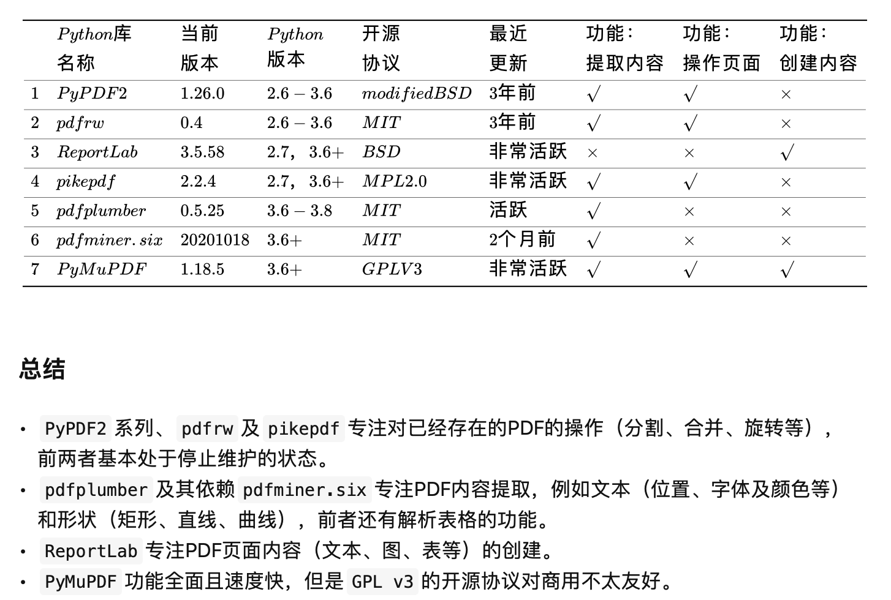
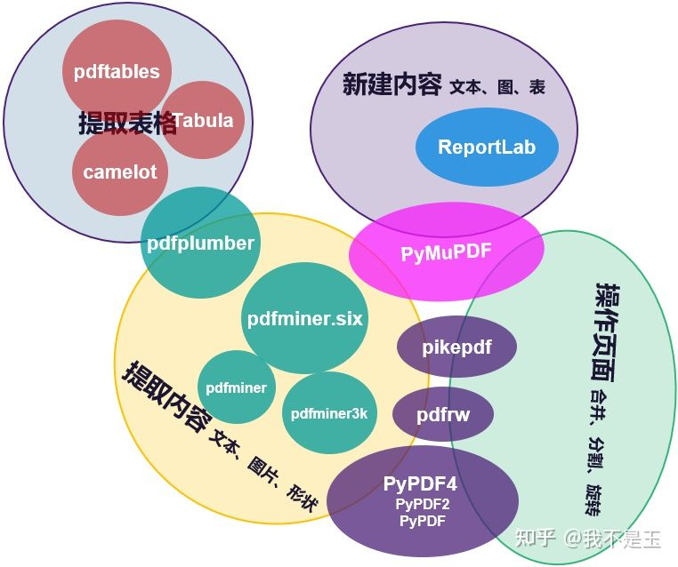

# About PDF

当然这是一种文件格式，但是它一般不会被“修改”，而且排版很好，支持图片、文字等。所以我好奇这个文件格式是怎么定义的，也就是PDF的源码长这么样子，有什么标准之类的。本文的理论知识主要来自于《PDF Explained》这本书(链接在参考章节)，所以下文将聚焦具体操作。

## 常见的pdf库


| pikepdf  (python库) | 基于C++的[QPDF](https://github.com/qpdf/qpdf) |偏向底层|
|:--------------------|----------------------------------------------|------|
| PyMuPDF  (python库) |   基于[mupdf](https://mupdf.com)         |以处理速度著称|

> 摘自一个知乎专栏：
> 
> 
### 参考网站

* [Adobe PDF Reference](https://www.adobe.com/content/dam/acom/en/devnet/pdf/pdfs/pdf_reference_1-7.pdf)
* [PDF Explained译本](https://zxyle.github.io/PDF-Explained/)
* [pikepdf官方文档](https://pikepdf.readthedocs.io/en/latest/index.html)
* [qpdf官方文档](https://qpdf.readthedocs.io/en/stable/)

* [PyMuPDF官方文档](https://pymupdf.readthedocs.io/en/latest/tutorial.html)
* [mupdf官方文档]()

### 安装

* QPDF mac 安装
```shell
brew install qpdf
```
### qpdf使用
> 具体请参考[官方文档](https://qpdf.readthedocs.io/en/stable/)
```shell
qpdf [infile] [options] [outfile]
```
#### 解密pdf

在当前目录下又一个被加密的pdf文件locked.pdf，我们用pikepdf打开它再重新保存就可以完成pdf解密
