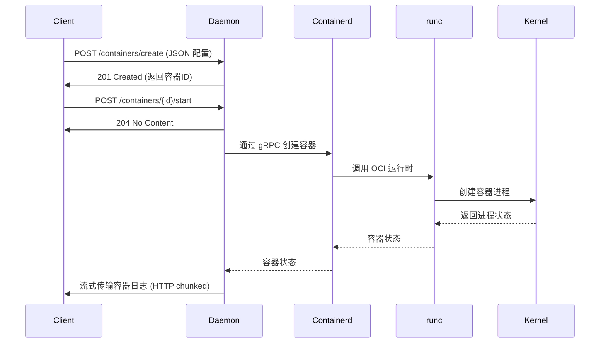
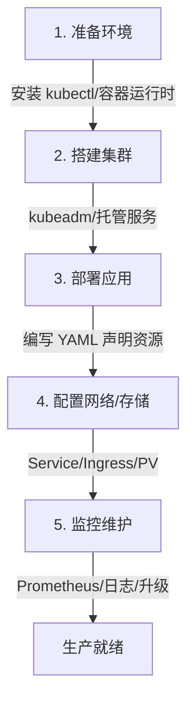

# docker 架构
**一、 [Docker 架构概览](https://yeasy.gitbook.io/docker_practice/introduction/what)**

Docker 采用了经典的 **Client-Server 架构**，主要包含以下核心组件：

1. **Docker Client (`docker` CLI)**:
    - 用户与 Docker 交互的主要接口（命令行工具、图形界面如 Docker Desktop、API 调用）。
    - 接收用户命令（如 `docker run`, `docker build`, `docker pull`），并通过 **Docker API** 发送给 Docker 守护进程。
    - 本身不执行核心功能，只是命令的发起者。

2. **Docker Daemon (`dockerd`)**:
    - Docker 的核心引擎，常驻后台进程。
    - 监听 Docker API 请求（通常通过 UNIX socket 或网络端口）。
    - 负责管理 Docker 的核心对象：**镜像（Images）**、**容器（Containers）**、**网络（Networks）**、**卷（Volumes）**。
    - 处理构建、运行、分发容器等所有繁重工作。
    - 可以与其它 Docker 守护进程通信以管理 Docker 服务（Swarm 模式）。

3. **Docker Registry**:
    - 存储和分发 Docker **镜像**的仓库服务。
    - **Docker Hub** 是默认的公共 Registry。
    - 用户可以搭建私有的 Registry（如 Docker Registry, Harbor, Nexus）。
    - `docker pull` 从 Registry 拉取镜像，`docker push` 将本地镜像推送到 Registry。

4. **Docker Objects**:
    - **镜像（Images）**: 只读模板，包含创建 Docker 容器的指令。**分层存储是其核心特性。**
    - **容器（Containers）**: 镜像的可运行实例。容器在镜像层之上添加一个可写的“容器层”，进程在其中运行。容器是隔离且资源受限的。
    - **网络（Networks）**: 管理容器之间、容器与宿主机、容器与外部的通信（bridge, host, overlay, macvlan 等驱动）。
    - **卷（Volumes）**: 持久化存储容器生成或使用的数据的最佳方式，独立于容器的生命周期。绕过联合文件系统，提供直接访问宿主机文件系统（或网络存储）的能力。

**Docker 架构**：基于 Client-Server 模型，核心是 `dockerd` 守护进程，管理镜像、容器、网络、卷等对象，通过 Registry 分发镜像。

## docker 分层机制
**一、 分层存储（Layered Storage） - 镜像的基石**
这是 Docker 最核心、最高效的设计之一，直接解决了你提到的“镜像体积庞大”的问题。

1. **核心概念**:
    - **只读层（Read-Only Layers）**: 一个 Docker 镜像由多个**只读层**堆叠而成。每一层代表文件系统的一部分变更（添加、修改、删除文件/目录）。
    - **联合文件系统（Union File System - UnionFS）**: Docker 利用 UnionFS（如 Overlay2, AUFS, btrfs, zfs, devicemapper）的技术将所有这些只读层**透明地叠加（Union Mount）** 在一起，呈现给用户一个**统一的、完整的文件系统视图**。用户看到的是所有层合并后的结果。
    - **写时复制（Copy-on-Write - CoW）**: 这是分层存储高效运行的关键机制。当一个容器启动时：
        - Docker 引擎基于镜像的所有只读层创建一个新的、**薄薄的可写层（Container Layer）** 放在最上面。
        - 容器内进程对文件系统的**所有修改（增、删、改）都只发生在这个可写层**。
        - **读操作**：如果文件在可写层，直接读取；如果不在，则向下穿透只读层查找。
        - **写操作**：
            - **修改已存在文件（在底层只读层）**：CoW 机制触发！Docker 会先将该文件从底层**复制**到可写层，然后在可写层进行修改。底层文件保持不变。
            - **创建新文件**：直接在可写层创建。
            - **删除文件**：在可写层创建一个特殊的“白障”（whiteout）文件标记该文件已被删除，隐藏底层文件。底层文件**实际并未被删除**。

2. **分层存储的优势**:
    - **空间效率 & 共享**:
        - 多个镜像可以共享相同的基础层（如 `ubuntu:latest` 层）。拉取新镜像时，如果本地已有其依赖的层，则无需重复下载。
        - 运行多个基于同一镜像的容器时，所有容器共享底层的只读镜像层，仅需为每个容器分配其独有的薄可写层。极大节省磁盘空间。
    - **构建效率 & 缓存**:
        - 镜像构建过程（`docker build`）是分层的（见下文分层构建），每一层的结果会被缓存。
        - 如果 Dockerfile 的指令和之前的构建没有变化（或依赖的文件没变），Docker 会直接复用缓存的层，跳过该步骤的重复执行，显著加速构建过程。
    - **镜像分发效率**:
        - 推送 (`push`) 和拉取 (`pull`) 镜像时，Docker 只传输本地缺失的层。如果仓库中已有大部分层（比如基础层），传输量会很小。
    - **不可变性（Immutability）**:
        - 镜像层一旦构建完成就是**只读且不可变的**。这保证了镜像内容的可靠性和可重复性。无论在哪里运行，同一个镜像的哈希（digest）对应的内容绝对一致。

**二、 分层构建（Layered Build） - 构建镜像的实践**
分层构建是分层存储在镜像创建过程中的具体体现。它由 **Dockerfile** 驱动。

1. **Dockerfile 与层的关系**:
    - Dockerfile 中的**每一条指令**（`FROM`, `RUN`, `COPY`, `ADD`, `CMD`, `ENV` 等）在执行时，通常都会在当前的镜像之上**创建一个新的层**。
    - `FROM` 指令指定基础镜像，它就是新镜像的第一层（或多层，因为基础镜像本身也是分层的）。
    - 后续的 `RUN apt-get update && apt-get install -y package` 会创建一个新层，包含安装包带来的文件系统变更。
    - `COPY ./app /app` 会创建一个新层，包含复制进去的文件。
    - 以此类推。

2. **构建过程详解**:
    - Docker 守护进程读取 Dockerfile。
    - 从 `FROM` 指定的基础镜像开始（如果本地没有，则从 Registry 拉取）。
    - **按顺序执行 Dockerfile 中的每条指令**。
    - **每条指令执行前**：基于上一条指令创建出的镜像层（或基础镜像）启动一个**临时容器**。
    - **在临时容器中执行指令**：例如运行命令 (`RUN`)、复制文件 (`COPY`/`ADD`)、设置环境变量 (`ENV`) 等。这些操作会修改容器内的文件系统（主要发生在容器的可写层）。
    - **指令执行后**：Docker 将**临时容器可写层中的文件系统变更**，**提交（commit）** 为一个**新的、只读的镜像层**。
    - 临时容器被移除。
    - 基于这个新创建的层，继续执行下一条指令，重复上述过程。
    - 所有指令执行完毕后，最终得到一个由多层只读层堆叠而成的**新镜像**，并赋予一个 ID 或 Tag。

3. **分层构建的关键特性与最佳实践**:
    - **缓存机制**：这是分层构建最大的优势之一。Docker 会为每个成功构建的层生成一个唯一的哈希值（基于指令内容、上下文文件等）。如果后续构建时，Dockerfile 中的某条指令及其所有前置指令和上下文文件都未改变，Docker 会直接**复用之前构建缓存的层**，跳过该指令的执行，极大加速构建。因此，**将不常变化的指令（如安装依赖）放在 Dockerfile 前面，将常变化的指令（如复制应用代码）放在后面**是优化构建速度的关键。
    - **层的最小化**：你提到的“每一层尽量只包含该层需要添加的东西，任何额外的东西应该在该层构建结束前清理掉”至关重要。例如：
        - 在同一个 `RUN` 指令中执行 `apt-get update && apt-get install -y package && rm -rf /var/lib/apt/lists/*`。这样，安装包和清理缓存的操作发生在**同一层**。如果分成两个 `RUN` 指令，安装包会在一层，删除操作在下一层。虽然最终用户看不到缓存文件（因为被上层“删除”标记覆盖了），但这些缓存文件**仍然存在于安装包所在的那一层镜像中**，导致镜像总体积**无谓地增大**。
        - 避免在层中引入不必要的临时文件或大文件。
    - **可追溯性**：镜像的每一层都对应 Dockerfile 中的一条（或一组）指令，便于理解镜像的构建历史和内容组成 (`docker history <image>`)。

**三、 总结**
- **分层存储**：是 Docker 镜像的**核心实现机制**。镜像由多层**只读层**通过 **UnionFS** 联合挂载而成。容器启动时在最上层添加一个**可写层**，利用 **CoW** 机制实现高效的文件修改。这带来了空间共享、高效分发、镜像不可变等巨大优势。
- **分层构建**：是**利用分层存储机制创建镜像的具体过程**。Dockerfile 中的每条指令通常生成一个新的只读层。**缓存机制**是分层构建的核心优势，通过优化 Dockerfile 指令顺序和内容（最小化层、及时清理）可以显著提升构建效率和减小最终镜像体积。

## dockerfile & compose
 - **Dockerfile**：一个纯文本文件，包含一系列**指令**（如 `FROM`, `RUN`, `COPY`, `CMD`, `EXPOSE` 等）。它定义了如何从头开始构建一个**单一的 Docker 镜像**。`docker build`指令来读取它构建镜像。
- **Docker Compose：** 一个用于**定义和运行多容器 Docker 应用程序的工具**。它使用一个 **YAML 文件**（通常命名为 `docker-compose.yml`）来配置应用程序所需的**服务**（每个服务通常对应一个容器）、**网络**、**数据卷**以及它们之间的关系（如依赖、连接等）。

```bash
# 个人理解
1.
docker-compose.yml 有点像makefile
Docker Compose 就有点像make

Dockerfile 有点像***.c
docker build 有点像 gcc ***.c

2. 
Docker Compose 会读取配置文件docker-compose.yml
这个文件大概率会有build字段，就会调用docker build，正如makefile也可以没有gcc指令（虽然那makefile就没啥意思），docker-compose.yml同理

3.
如果docker-compose.yml只定义了一个容器，那只用dockerfile，docker build指令来执行就可以，就类似makefile只写了一句gcc ***.c，那就没必要用make
```


[Compose](https://yeasy.gitbook.io/docker_practice/compose/introduction) 项目是 Docker 官方的开源项目，负责实现对 Docker 容器集群的快速编排。从功能上看，跟 `OpenStack` 中的 `Heat` 十分类似。其代码目前在 [https://github.com/docker/compose](https://github.com/docker/compose) 上开源。

`Compose` 定位是 「定义和运行多个 Docker 容器的应用（Defining and running multi-container Docker applications）」，其前身是开源项目 Fig。

通过第一部分中的介绍，我们知道使用一个 `Dockerfile` 模板文件，可以让用户很方便的定义一个单独的应用容器。然而，在日常工作中，经常会碰到需要多个容器相互配合来完成某项任务的情况。例如要实现一个 Web 项目，除了 Web 服务容器本身，往往还需要再加上后端的数据库服务容器，甚至还包括负载均衡容器等。

`Compose` 恰好满足了这样的需求。它允许用户通过一个单独的 `docker-compose.yml` 模板文件（YAML 格式）来定义一组相关联的应用容器为一个项目（project）。

`Compose` 中有两个重要的概念：
- 服务 (`service`)：一个应用的容器，实际上可以包括若干运行相同镜像的容器实例。
- 项目 (`project`)：由一组关联的应用容器组成的一个完整业务单元，在 `docker-compose.yml` 文件中定义。

`Compose` 的默认管理对象是项目，通过子命令对项目中的一组容器进行便捷地生命周期管理。
`Compose` 项目由 Python 编写，实现上调用了 Docker 服务提供的 API 来对容器进行管理。因此，只要所操作的平台支持 Docker API，就可以在其上利用 `Compose` 来进行编排管理。

## entrypoint
 [ENTRYPOINT](https://yeasy.gitbook.io/docker_practice/image/dockerfile/entrypoint)的格式和 `RUN` 指令格式一样，分为 `exec` 格式和 `shell` 格式。
`ENTRYPOINT` 的目的和 `CMD` 一样，都是在指定容器启动程序及参数。`ENTRYPOINT` 在运行时也可以替代，不过比 `CMD` 要略显繁琐，需要通过 `docker run` 的参数 `--entrypoint` 来指定。
当指定了 `ENTRYPOINT` 后，`CMD` 的含义就发生了改变，不再是直接的运行其命令，而是将 `CMD` 的内容作为参数传给 `ENTRYPOINT` 指令，换句话说实际执行时，将变为：
```dockerfile
<ENTRYPOINT> "<CMD>"
```

那么有了 `CMD` 后，为什么还要有 `ENTRYPOINT` 呢？这种 `<ENTRYPOINT> "<CMD>"` 有什么好处么？
1. **当存在 `ENTRYPOINT` 后，`CMD` 的内容将会作为参数传给 `ENTRYPOINT`。**
2. **启动主进程前，需要一些准备工作。**


启动容器就是启动主进程，但有些时候，启动主进程前，需要一些准备工作。

比如 `mysql` 类的数据库，可能需要一些数据库配置、初始化的工作，这些工作要在最终的 mysql 服务器运行之前解决。

此外，可能希望避免使用 `root` 用户去启动服务，从而提高安全性，而在启动服务前还需要以 `root` 身份执行一些必要的准备工作，最后切换到服务用户身份启动服务。或者除了服务外，其它命令依旧可以使用 `root` 身份执行，方便调试等。

这些准备工作是和容器 `CMD` 无关的，无论 `CMD` 为什么，都需要事先进行一个预处理的工作。这种情况下，可以写一个脚本，然后放入 `ENTRYPOINT` 中去执行，而这个脚本会将接到的参数（也就是 `<CMD>`）作为命令，在脚本最后执行。比如官方镜像 `redis` 中就是这么做的：
```dockerfile
FROM alpine:3.4
...
RUN addgroup -S redis && adduser -S -G redis redis
...
ENTRYPOINT ["docker-entrypoint.sh"]

EXPOSE 6379
CMD [ "redis-server" ]
```
可以看到其中为了 redis 服务创建了 redis 用户，并在最后指定了 `ENTRYPOINT` 为 `docker-entrypoint.sh` 脚本。

```bash
#!/bin/sh
...
# allow the container to be started with `--user`
if [ "$1" = 'redis-server' -a "$(id -u)" = '0' ]; then
	find . \! -user redis -exec chown redis '{}' +
	exec gosu redis "$0" "$@"
fi

exec "$@"
```

该脚本的内容就是根据 `CMD` 的内容来判断，如果是 `redis-server` 的话，则切换到 `redis` 用户身份启动服务器，否则依旧使用 `root` 身份执行。比如：
```bash
$ docker run -it redis id
uid=0(root) gid=0(root) groups=0(root)
```

## docker 通信机制


### Docker 网络机制与配置
#### Docker 网络机制

Docker 的网络是其核心功能之一，它允许容器之间以及容器与外部世界（包括主机和外部网络）进行通信。Docker 提供了灵活的网络模型，主要包含以下几个关键概念和网络驱动：

 1. **网络驱动 (Network Drivers)**
Docker 使用不同的网络驱动程序来实现不同类型的网络连接：
*   **`bridge` (默认):**
    *   这是 Docker 在安装后自动创建和使用的默认网络 (`docker0`)。
    *   每个新启动的容器（如果没有指定网络）都会连接到这个默认的 `bridge` 网络。
    *   工作原理：
        *   Docker 在主机上创建一个名为 `docker0` 的虚拟网桥。
        *   容器连接到这个网桥，并获得一个该网桥子网内的私有 IP 地址（如 `172.17.0.2`, `172.17.0.3`）。
        *   **容器间通信：** 同一 `bridge` 网络上的容器可以通过各自的 IP 地址直接通信。
        *   **容器与外部通信：** 容器通过 `docker0` 网桥和主机的 IP 表 (`iptables`) 进行 NAT (网络地址转换) 与外部网络通信。
        *   **外部访问容器：** 默认情况下，外部无法访问 `bridge` 网络上的容器。需要**端口映射 (Port Mapping)** 将容器内部的端口绑定到主机上的一个端口（如 `-p 8080:80`）。外部客户端通过访问 `主机IP:8080`，流量经过 DNAT 规则转发到容器内部的 `80` 端口。
*   **`host`:**
    *   容器直接使用主机的网络命名空间。
    *   容器不会获得自己的 IP 地址，而是直接使用主机的 IP 地址和端口。
    *   优点：性能最好（无虚拟化开销），端口无需额外映射。
    *   缺点：牺牲了网络隔离性，容器端口可能与主机服务端口冲突。
*   **`overlay`:**
    *   用于 **Docker Swarm** 集群环境。
    *   允许不同物理主机（节点）上的容器进行通信，就像它们在同一个网络上一样。
    *   通过创建跨主机的虚拟网络实现。
*   **`macvlan`:**
    *   为容器分配一个物理网络（如主机的以太网接口）上的 MAC 地址。
    *   容器在网络拓扑中看起来就像一台拥有独立 MAC 地址的物理主机。
    *   适用于需要容器直接暴露在物理网络中（获取可路由的 IP 地址）的场景。
*   **`none`:**
    *   容器拥有自己的网络命名空间，但不配置任何网络接口（只有 `lo` 回环接口）。
    *   容器完全与网络隔离，只能通过特殊方式（如 `docker exec`）访问。通常用于高度安全或特殊网络定制的场景。
*   **`ipvlan`:**
    *   类似于 `macvlan`，但多个容器共享父接口的 MAC 地址，使用不同的 IP 地址。
    *   在某些网络设备策略限制 MAC 地址数量的场景下比 `macvlan` 更有优势。

2. **网络隔离与连接**
*   **用户定义网络 (User-Defined Networks):** 除了默认的 `bridge`，你可以创建自己的 `bridge` 网络（或其他类型）。用户定义的 `bridge` 网络相比默认 `bridge` 提供了更好的功能：
    *   **自动 DNS 解析：** 同一用户定义网络中的容器可以通过容器名称相互解析。在默认 `bridge` 上只能通过 IP 通信（除非使用 `--link`，已弃用）。
    *   **更好的隔离：** 不同用户定义网络中的容器默认不能通信。
    *   **可附加的网络选项：** 如配置子网、网关、IP 地址范围、启用/禁用容器间通信等。
*   **容器连接：** 容器可以连接到多个网络。这允许容器充当不同网络之间的桥梁（如果配置了路由）。

3. **端口映射 (Port Mapping) - 关键概念**
*   **目的：** 使运行在 `bridge` 网络（或其他非 `host` 网络）上的容器内的服务能够被**主机外部**的客户端访问。
*   **原理：** 将容器内部的端口绑定到主机操作系统上的一个（或多个）端口。
*   **操作：**
    *   使用 `docker run` 时的 `-p` 或 `--publish` 标志：`docker run -p <主机端口>:<容器端口> ...`
    *   在 docker-compose.yml 中使用 `ports:` 配置项。
*   **类型：**
    *   `-p 8080:80`: 将容器 `80` 端口映射到主机的 `8080` 端口。外部访问 `主机IP:8080`。
    *   `-p 80:80`: 将容器 `80` 端口映射到主机的 `80` 端口（常用于 Web 服务器）。
    *   `-p 127.0.0.1:8080:80`: 只将容器 `80` 端口映射到主机的 `127.0.0.1` (localhost) 的 `8080` 端口，仅限主机本地访问。
    *   `-p 8080:80/udp`: 映射 UDP 端口。
    *   `-p 8080-8090:80-90`: 映射端口范围（较少用）。
*   **底层实现：** Docker 利用主机的 `iptables` 规则实现 DNAT (Destination Network Address Translation) 来完成端口转发。

#### Dockerfile `EXPOSE` & compose.yml `ports`

这是 Docker 学习中最容易混淆的概念之一。它们目的不同，作用范围不同，且**`EXPOSE` 本身不足以让外部访问容器服务！**

 1. **Dockerfile 中的 `EXPOSE`**
*   **作用：**
    *   **文档说明 (Documentation):** 它是一个**元数据指令**。其主要作用是**告知**镜像的使用者（人或工具），这个镜像中的应用程序在运行时**预期会监听**哪些网络端口和协议（默认 TCP）。
    *   **运行时提示：** 当你基于该镜像运行容器时，如果使用了 `-P` (大写的 `P`) 标志，Docker 会自动将 `EXPOSE` 声明的所有容器端口**随机映射**到主机的高端口范围（通常是 32768+）。`docker ps` 可以查看随机分配的端口。
*   **语法：** `EXPOSE <port> [<port>/<protocol>...]` (例如 `EXPOSE 80`, `EXPOSE 80/tcp`, `EXPOSE 80/udp 443/tcp`)
*   **关键点：**
    *   `EXPOSE` **不会**实际打开端口或配置任何网络映射。它只是记录了镜像设计者的意图。
    *   它**不会**导致容器端口被映射到主机端口（除非配合 `-P`）。
    *   它**不能**替代 `-p` 或 `--publish` 或 `ports:` 配置。
    *   即使没有 `EXPOSE`，你仍然可以通过 `-p` 或 `ports:` 将容器内的任何端口映射到主机。

 2. **docker-compose.yml 中的 `ports:`**
*   **作用：**
    *   **实际配置端口映射：** 这个配置项是**真正执行操作的**。它明确指定将容器内部的端口映射到 Docker 主机上的哪些端口（或接口）。
    *   **控制访问：** 它定义了外部客户端如何访问容器内的服务。
*   **语法：**
    ```yaml
    services:
      myservice:
        ...
        ports:
          - "<主机端口>:<容器端口>" # 最常用形式 (e.g., "8080:80")
          - "127.0.0.1:8081:81"     # 绑定到特定主机IP
          - "9090-9091:8080-8081"   # 端口范围 (少用)
          - "49100:22"               # 主机随机端口 (49100是示例)
    ```
*   **关键点：**
    *   这是实现从 Docker 主机外部访问容器服务的**主要和必要方式**（对于非 `host` 网络）。
    *   它直接对应于 `docker run -p` 命令的功能。
    *   它**独立于** Dockerfile 中的 `EXPOSE` 指令。即使 Dockerfile 没有 `EXPOSE 80`，只要 `ports: "8080:80"` 配置了，映射仍然生效，外部就能访问容器内的 80 端口服务（假设容器内服务确实在监听 80 端口）。
    *   如果你在 Compose 文件中配置了 `ports:`，`EXPOSE` 的存在与否对端口映射本身没有影响。

3. **`EXPOSE` 与 `ports:` 的关系总结**

| 特性         | Dockerfile `EXPOSE`                              | docker-compose.yml `ports:` (或 `docker run -p`) |
| :----------- | :----------------------------------------------- | :------------------------------------------------ |
| **主要目的** | **文档化**容器预期监听的端口。                   | **实际配置**容器端口到主机端口的映射。            |
| **作用**     | 提供信息；配合 `-P` 启用随机映射。               | 使容器服务能被外部网络访问。                      |
| **是否必需** | 不是必需的。                                     | **是必需的**（如果外部需要访问非 `host` 网络容器）。 |
| **影响范围** | 镜像层面（元数据）。                             | 容器运行时层面（具体网络配置）。                  |
| **依赖关系** | 不依赖 `ports:` 或 `-p`。                        | **不依赖** `EXPOSE`。可以映射任何容器端口。       |
| **示例**     | `EXPOSE 80`                                      | `ports: - "8080:80"`                             |

*   **协作场景 (使用 `-P`):** 这是两者最直接的联系点。
    *   Dockerfile 中 `EXPOSE 80`。
    *   运行容器时使用 `docker run -P ...`。
    *   结果：Docker 自动将容器暴露的 80 端口随机映射到主机的一个高端口（如 `32768`）。`docker ps` 会显示 `0.0.0.0:32768->80/tcp`。
    *   在 docker-compose.yml 中，`-P` 的等效写法是使用 `ports` 但只指定容器端口，让 Docker 分配主机端口：
        ```yaml
        ports:
          - "80" # 容器端口80，主机端口随机
          - "8080" # 容器端口8080，主机端口随机 (注意写法区别)
        ```
*   **独立场景 (最常见):**
    *   **场景 1 (仅有 `ports:`):** Dockerfile 没有 `EXPOSE 80`，但 docker-compose.yml 配置了 `ports: - "8080:80"`。**外部可以通过 `主机IP:8080` 访问容器服务。** `EXPOSE` 的缺失不影响映射功能。
    *   **场景 2 (仅有 `EXPOSE`):** Dockerfile 有 `EXPOSE 80`，但运行容器时**没有**使用 `-p`、`-P` 或 Compose 中没有 `ports:` 配置。**外部无法访问容器内的 80 端口服务。** `EXPOSE` 本身没有开放访问。
    *   **场景 3 (两者都有):** Dockerfile `EXPOSE 80`，docker-compose.yml `ports: - "8080:80"`。外部通过 `8080` 访问。`EXPOSE` 提供了文档信息，`ports:` 提供了实际访问通道。两者和谐共存但功能独立。

4. **何时使用 `EXPOSE`？**
*   最佳实践：在 Dockerfile 中使用 `EXPOSE` 清晰地**声明**你的应用程序需要监听的端口。这是一种良好的文档习惯，有助于镜像使用者理解镜像的运行时需求。
*   当你想利用 `docker run -P` 或 Compose 的 `ports:` 随机端口映射功能时，`EXPOSE` 是指定哪些端口参与随机映射的依据。

5. **何时使用 `ports:` (或 `-p`)？**
*   **总是**：当你需要从 Docker 主机外部（包括同一主机的其他非容器进程，或其他物理机器）访问运行在非 `host` 网络容器内的服务时。
*   你需要精确控制映射关系（主机端口、绑定 IP 等）。

**总结**
想让外面访问容器服务，必须配 `ports:` (或 `-p`)。`EXPOSE` 是个有用的提示，但配不配它都不影响 `ports:` 的功能。** 写 Dockerfile 时加上 `EXPOSE` 是良好实践。


### linux 进程间socket通信

1.  **内核旁路优化**

- 数据直接在**内核地址空间**内传递
- 避免了网络协议栈的处理（TCP/IP 栈）
- 使用专门的传输路径：
```text
发送进程 → 内核socket缓冲区 → 接收进程
```

2. **内存映射技术**
- 发送方和接收方共享同一块物理内存页
- 通过 `mmap()` 实现内存页面共享
- 修改时使用写时复制（Copy-on-Write）策略

2. **I/O 操作细节**
虽然称为"Socket"，但实际 I/O 操作与传统磁盘 I/O 完全不同：

| 特性         | 本地 Socket               | 磁盘 I/O             |
| ---------- | ----------------------- | ------------------ |
| **介质**     | 内存                      | 磁盘/SSD             |
| **延迟**     | 纳秒级 (100-500ns)         | 微秒/毫秒级             |
| **数据路径**   | 内核缓冲区直接传输               | 块设备驱动              |
| **系统调用**   | `sendmsg()`/`recvmsg()` | `read()`/`write()` |
| **DMA 使用** | 不涉及                     | 必需                 |
| **上下文切换**  | 1-2 次                   | 多次                 |

## docker volume
[`数据卷`](https://yeasy.gitbook.io/docker_practice/data_management/volume) 是一个可供一个或多个容器使用的特殊目录，它绕过 UnionFS，可以提供很多有用的特性：
- `数据卷` 可以在容器之间共享和重用
- 对 `数据卷` 的修改会立马生效
- 对 `数据卷` 的更新，不会影响镜像
- `数据卷` 默认会一直存在，即使容器被删除


```bash
docker volume ls
docker volume create my-vol
docker volume inspect my-vol

# 启动容器并将卷挂载到磁盘里
docker run -d -P \
    --name web \
    # -v my-vol:/usr/share/nginx/html \
    --mount source=my-vol,target=/usr/share/nginx/html \
    nginx:alpine

# 指定挂载一个本地主机的目录到容器中去
docker run -d -P \
    --name web \
    # -v /src/webapp:/usr/share/nginx/html \
    --mount type=bind,source=/src/webapp,target=/usr/share/nginx/html \
    nginx:alpine

docker volume rm my-vol
```

在 Docker 卷（`volumes`）挂载的配置中，`- /proc:/proc:ro` 的 `ro` 表示 **read-only（只读）**。

1. **`- /proc:/proc:ro` 的含义**
    - `/proc`（主机路径）挂载到容器内的 `/proc`（容器路径）。
    - `:ro` 表示容器内对该挂载的目录 **只有读取权限，不能修改**（Read-Only）。

2. **为什么需要 `ro`？**
    - `/proc` 是 Linux 内核提供的虚拟文件系统，包含系统运行时信息（如进程、CPU、内存等）。
    - **安全性**：如果容器内的程序意外（或恶意）修改 `/proc` 下的文件，可能影响主机系统稳定性。
    - **最佳实践**：监控类工具通常只需要读取 `/proc`，不需要写入，因此用 `ro` 更安全。

3. **对比其他选项**
    - **默认情况**（不加 `:ro`）：挂载的卷是可读写的（`rw`）。
        volumes:
          - /proc:/proc   # 读写权限（危险！不推荐用于 /proc）
    - **只读挂载**（推荐）：
        volumes:
          - /proc:/proc:ro  # 只读权限（安全）

4. **你的场景**
    - 你的 `system-monitor` 是一个系统监控工具，只需从 `/proc` 读取数据（如 CPU 使用率、进程列表等），因此 `:ro` 是合理的选择。

- **只读挂载配置文件**：
    volumes:
      - ./config.json:/app/config.json:ro

- **读写挂载数据目录**：
    volumes:
      - ./data:/app/data  # 默认 rw

`:ro` 是 Docker 挂载卷时的常用选项，用于限制容器内对主机文件的修改权限。在你的配置中，`- /proc:/proc:ro` 既能满足监控需求，又能提升安全性。


## 从hello-world看docker 分层

### 1. `hello-world` 镜像的特殊性

这个镜像 **不需要完整的操作系统**，它只包含一个静态编译的二进制文件 `/hello`：

- **大小仅 10KB**（对比：完整 Ubuntu 镜像约 70MB）
    
- **没有包管理器**（如 apt/yum）
    
- **没有 shell**（如 bash）
    
- **甚至没有标准 C 库**（`/hello` 是静态链接的）
    

它直接通过 Linux 内核的 **系统调用** 输出信息，然后退出。

---
### 2. Linux 镜像的分层结构
Docker 镜像的层级关系：

```text
你的应用
└── 运行时环境 (如 Python/Node.js)
    └── 基础系统工具
        └── 发行版用户空间 (如 Ubuntu/Debian)
            └── 内核 (由宿主机提供)
```

但 `hello-world` 跳过了中间所有层，直接：
```text
/hello (静态二进制文件)
└── 内核系统调用接口
```

---

### 3. 与发行版镜像的区别

|特性|`hello-world`|Ubuntu/Debian 镜像|
|---|---|---|
|包含内容|单个静态二进制文件|完整的用户空间工具链|
|依赖关系|无|依赖 glibc、包管理系统等|
|可执行命令|只能运行 `/hello`|可以运行任意 Linux 命令|
|典型用途|测试 Docker 是否工作|实际应用开发/部署环境|
|进入容器|不可能（无 shell）|可以用 `docker exec -it`|

---

### 4. 为什么能直接运行？
- **Linux 内核特性**：所有 Linux 发行版共享同一个内核接口（系统调用）
- **静态编译**：`/hello` 不依赖动态链接库
- **极简主义**：只实现最基本的功能（输出文本+退出）
---

### 5. 实际应用镜像的例子
比如基于 Ubuntu 的 Nginx 镜像：

```text
nginx
└── Debian/Ubuntu 用户空间
    └── 内核系统调用
```
这种镜像需要完整的发行版，因为：
- Nginx 依赖 glibc
- 需要包管理器安装依赖
- 需要 shell 进行配置
---
### 结论
1. Docker 镜像 **不一定需要完整发行版**，取决于应用需求    
2. 越底层的镜像 **体积越小**，但 **功能性越有限**
3. 大多数实际应用镜像还是会基于某个发行版（Alpine/Ubuntu/Debian），因为它们需要：
    - 包管理器
    - 动态链接库
    - 系统工具集


## 架构问题
### Docker 和 app 打包、虚拟机的异同
问：
比如我要部署一个pyside6的GUI APP项目，要在各种操作系统和python版本的环境下部署，这时候又四种方式可以试下在其他环境下运行：1. python虚拟环境， 2. 虚拟机（比如我是在ubuntu 20.04开发的，就可以下载一个虚拟机） 3. pyinstaller打包， 4. docker部署，除了这四种跨环境的运行实现方式还有别的吗？全面分析一下他们的异同

答：
**1. Python 虚拟环境**
**优点**：
• **依赖隔离**：不同项目的依赖不会冲突。
• **灵活性**：开发和测试时快速切换 Python 版本和包版本。

**缺点**：
• **不解决操作系统差异**：无法跨操作系统运行。
• **用户需要 Python 环境**：终端用户需要安装 Python，可能增加复杂性。
• **不适合最终用户分发**：更适合开发和测试阶段。

**2. 虚拟机**
**优点**：
• **环境一致性**：完全复制开发环境，消除环境差异。
• **隔离性**：提供操作系统级别的隔离，安全性高。
**缺点**：
• **资源消耗大**：占用大量的内存和存储空间。
• **性能开销**：运行速度可能比原生环境慢。
• **用户体验差**：终端用户需要安装和配置虚拟机，不友好。

**3. PyInstaller 打包**
**优点**：
• **生成可执行文件**：无需用户安装 Python 环境。
• **代码保护**：源代码被打包，不易被查看。
• **跨平台支持**：可在不同操作系统上生成对应的可执行文件。
**缺点**：
• **打包复杂性**：有时需要处理打包问题，如动态库依赖。
• **文件体积大**：可执行文件可能很大，包含所有依赖。
• **兼容性问题**：不同平台可能出现不一致的行为，需要分别调试。
  
**4. Docker 部署**
**优点**：
• **环境一致性**：确保在任何地方运行都是相同的环境。
• **轻量级**：比虚拟机更轻，占用资源少。
• **依赖管理**：所有依赖都在容器中，主机环境干净。
**缺点**：
• **GUI 支持复杂**：默认情况下，Docker 不支持 GUI 应用程序，需要额外配置（如 X11 转发）。
• **学习成本**：用户需要了解 Docker 的基本使用。
• **不适合桌面应用分发**：更适合服务器和服务的部署。

### Docker 开发部署和虚拟环境
问：
比如用python的pytorch做深度学习开发，我设置一个python的虚拟环境，和pytorch的docker有何区别，如果在不同的机器快速部署我当前这套开发环境的话，哪个比较合适？


答：
在使用 Python 的 PyTorch 进行深度学习开发时，**Python 虚拟环境**和使用 **PyTorch 的 Docker 容器**之间存在一些关键区别。以下是对它们的比较，以及在不同机器上快速部署当前开发环境的建议。

**Python 虚拟环境**

**优点**：
• **依赖隔离**：虚拟环境可以隔离不同项目的 Python 包依赖，防止冲突。
• **轻量级**：不需要额外的系统资源，创建和激活都很快捷。
• **灵活性**：可以根据需要安装特定版本的 PyTorch 和其他库。

**缺点**：
• **系统依赖**：仍然依赖于主机操作系统，可能需要手动安装系统级别的依赖，如 CUDA 驱动、特定的库等。
• **环境可移植性**：在不同机器上重现同样的环境可能会遇到困难，尤其是当操作系统或硬件配置不同的时候。
• **配置复杂性**：需要确保每台机器上的 Python 版本和系统库一致，手动配置可能耗时。


**PyTorch 的 Docker 容器**
**优点**：
• **环境一致性**：Docker 容器包含了操作系统、Python 解释器、PyTorch 及其所有依赖，确保在不同机器上运行的环境完全一致。
• **易于部署**：只需在目标机器上安装 Docker，然后拉取并运行容器即可，无需手动配置环境。
• **包含系统依赖**：如 CUDA 驱动、cuDNN 等都可以在容器中预先配置好，避免了在不同系统上安装这些依赖的麻烦。
• **可移植性**：容器可以在任何支持 Docker 的平台上运行，无论是本地、服务器还是云环境。

**缺点**：
• **资源占用**：Docker 容器相对于虚拟环境更占用系统资源，虽然比虚拟机轻量，但仍需要一定的存储空间和内存。
• **学习成本**：需要了解 Docker 的基本使用和命令，对不熟悉容器技术的用户可能有一定的学习曲线。
• **GPU 配置**：如果需要在容器中使用 GPU，需要配置 NVIDIA Docker，步骤相对复杂。

**哪个更适合快速在不同机器上部署当前的开发环境？**
如果您的目标是**快速、一致地在不同机器上部署完全相同的开发环境**，那么 **Docker 容器**更为合适，原因如下：
• **一致性**：Docker 镜像可以确保在不同的机器上运行相同的环境，避免了“在我机器上可以运行”的问题。
• **简化部署**：只需安装 Docker，然后运行预先构建好的容器，无需在每台机器上手动配置环境。
• **减少系统差异影响**：Docker 容器包含了运行所需的所有组件，主机系统的差异（如操作系统版本、系统库等）对容器内的应用影响很小。

然而，如果您的开发环境相对简单，且目标机器的系统环境与开发机器相似（如操作系统版本、Python 版本、CUDA 驱动等），并且您或您的团队对 Docker 不太熟悉，那么使用 **Python 虚拟环境**也可以满足需求。

**总结建议**：
• **使用 Docker**：
• 需要在多台具有不同操作系统或配置的机器上部署环境。
• 希望确保环境的一致性，避免手动配置带来的问题。
• 项目依赖复杂，包括特定版本的系统库、驱动等。

• **使用 Python 虚拟环境**：
• 目标机器与开发机器环境相似。
• 项目依赖主要是 Python 包，系统级依赖较少或容易安装。
• 团队对 Docker 不熟悉，且不希望增加学习成本。


**额外提示**：
• **GPU 支持**：如果您的项目需要使用 GPU，加速深度学习训练，那么使用 Docker 时需要配置 NVIDIA Docker（现在是 NVIDIA Container Toolkit），以确保容器可以访问主机的 GPU。这可能需要在每台目标机器上进行一些初始设置。
• **环境管理工具**：无论选择哪种方式，都建议使用环境管理工具（如 requirements.txt、conda env 或 Dockerfile）来记录和管理依赖，以便在需要时重现环境。
• **镜像大小**：注意 Docker 镜像可能比较大，尤其是包含了深度学习框架和 CUDA 的镜像。在网络传输和存储时需要考虑这一点。


--- 
# docker 环境配置

## 安装
### mac安装docker
就用brew安装就可以，但是，有cask和命令行两个。
#### 1. **`brew install docker`**
- **安装内容**:  
    仅安装 Docker 的 **命令行工具（CLI）**，不包含 Docker 引擎（守护进程）或图形化界面（Docker Desktop）。
    
- **用途**:  
    适用于以下场景：
    - 你只需要 `docker`、`docker-compose` 等命令（例如连接远程 Docker 主机）。
    - 你已在 macOS 上通过其他方式（如手动安装）配置了 Docker 引擎。
        
- **局限性**:
    - **无法直接使用**：因为 macOS 不是 Linux 系统，缺少原生 Docker 引擎依赖的 Linux 内核特性（如 cgroups、命名空间等）。
    - 如果你直接运行 `docker ps`，会报错 `Cannot connect to the Docker daemon`（因为缺少本地守护进程）。
- **依赖关系**:  
    安装的二进制文件来自 Homebrew 的 **Formula**（纯命令行工具）。

#### 2. **`brew install --cask docker`**
- **安装内容**:  
    安装 **Docker Desktop for Mac**（完整的图形化应用），包含：
    - Docker 引擎（守护进程）
    - 命令行工具（CLI）
    - 图形化管理界面
    - 内置的 Linux 虚拟机（用于运行容器）
        
- **用途**:  
    这是 macOS 上运行 Docker 的 **推荐方式**，因为：
    - Docker Desktop 会自动处理 macOS 的依赖（如虚拟化、文件共享、网络配置等）。
    - 开箱即用，无需手动配置守护进程。
- **安装路径**:  
    应用会被安装到 `/Applications/Docker.app`，同时命令行工具通过软链接添加到 `PATH`。
- **依赖关系**:  
    安装的包来自 Homebrew 的 **Cask**（专为 macOS 图形应用设计）。
    
---

### windows安装docker
- 装wsl，在wsl内就跟ubuntu一样的方法。

### ubuntu安装docker：
apt安装可能版本老一些，可能存在兼容性问题，如果没有，这样最方便，如果有，就按照下面官网方法。

1. apt安装
```bash
sudo apt install docker.io docker-compose
```
2. [官网方式安装](https://docs.docker.com/engine/install/ubuntu/)
```bash
# 1 卸载老版本
for pkg in docker.io docker-doc docker-compose docker-compose-v2 podman-docker containerd runc; do sudo apt-get remove $pkg; done

# 2 加入docker官方源
# Add Docker's official GPG key:
sudo apt-get update
sudo apt-get install ca-certificates curl
sudo install -m 0755 -d /etc/apt/keyrings
sudo curl -fsSL https://download.docker.com/linux/ubuntu/gpg -o /etc/apt/keyrings/docker.asc
sudo chmod a+r /etc/apt/keyrings/docker.asc

# Add the repository to Apt sources:
echo \
  "deb [arch=$(dpkg --print-architecture) signed-by=/etc/apt/keyrings/docker.asc] https://download.docker.com/linux/ubuntu \
  $(. /etc/os-release && echo "${UBUNTU_CODENAME:-$VERSION_CODENAME}") stable" | \
  sudo tee /etc/apt/sources.list.d/docker.list > /dev/null
sudo apt-get update

# 3 安装
sudo apt-get install docker-ce docker-ce-cli containerd.io docker-buildx-plugin docker-compose-plugin

# 用户加入docker组获取权限
sudo groupadd docker
sudo usermod -aG docker $USER

# 试运行
# docker run hello-world
```

#### 为什么不是`apt install docker`？
- **软件包命名冲突**：  
    在早期的 Debian/Ubuntu 中，`docker` 这个名称被一个名为 `docker` 的旧项目（一个基于 KDE 的图形化桌面应用，与容器无关）占用。因此，Docker 官方引擎的包被命名为 `docker.io` 以避免冲突。
- **官方 Docker 包不在默认仓库**：  
    Docker 官方推荐的安装方式是通过 Docker 自己的仓库（`apt.dockerproject.org` 或 `download.docker.com`），而非系统默认仓库。若直接从 Docker 官方安装，包名是 `docker-ce`（社区版）或 `docker-ee`（企业版）。
- **`docker-compose`**：  
    这是一个独立的工具，用于通过 YAML 文件定义和管理多容器应用。它与 Docker 引擎配合使用，但属于不同的项目。在 Debian/Ubuntu 仓库中，它作为一个单独的包提供。

#### [docker set proxy](https://docs.docker.com/engine/daemon/proxy/#daemon-configuration)
You may configure proxy behavior for the daemon in the `daemon.json` file, or using CLI flags for the `--http-proxy` or `--https-proxy` flags for the `dockerd` command. Configuration using `daemon.json` is recommended.

```json
{
  "proxies": {
    "http-proxy": "http://proxy.example.com:3128",
    "https-proxy": "https://proxy.example.com:3129",
    "no-proxy": "*.test.example.com,.example.org,127.0.0.0/8"
  }
}
```

After changing the configuration file, restart the daemon for the proxy configuration to take effect:

```bash
 sudo systemctl restart docker
```

The Docker daemon checks the following environment variables in its start-up environment to configure HTTP or HTTPS proxy behavior:

- `HTTP_PROXY`
- `http_proxy`
- `HTTPS_PROXY`
- `https_proxy`

3. 如果没有小飞机，就用用镜像安装docker
```bash
# 卸载docker
sudo apt-get remove docker docker-engine docker.io containerd runc
# 安装依赖
sudo apt update
sudo apt install apt-transport-https ca-certificates curl software-properties-common gnupg lsb-release
# 阿里云key
curl -fsSL http://mirrors.aliyun.com/docker-ce/linux/ubuntu/gpg | sudo apt-key add -
# 阿里云ppa
sudo add-apt-repository "deb [arch=amd64] http://mirrors.aliyun.com/docker-ce/linux/ubuntu $(lsb_release -cs) stable"
# 安装docker
sudo apt install docker-ce docker-ce-cli containerd.io docker-buildx-plugin docker-compose-plugin
# 用户权限
sudo usermod -aG docker $USER
reboot
```

2. docker pull设置镜像
国内大部分docker镜像都失效了，但是可以登陆[阿里云账号](https://cr.console.aliyun.com)[设置镜像](https://cr.console.aliyun.com/cn-hangzhou/instances/mirrors)。
好像阿里也失效了，[github-docker-镜像网站](https://github.com/DaoCloud/public-image-mirror)
```bash
sudo vim /etc/docker/daemon.json
# 然后添加如下内容
{
    "registry-mirrors": [
	    "https://docker.m.daocloud.io",
	    "https://docker.xuanyuan.me"
    ] 
}
# 然后重启该服务
sudo systemctl daemon-reload
sudo systemctl restart docker
```

## 配置
```bash
# 查看用户组
groups
# 查看用户组（更全）
# cat /etc/group

# 建立 `docker` 组，mac不用
# sudo groupadd docker

# 将当前用户加入 `docker` 组
sudo usermod -aG docker $USER
```


# 指令

注意，镜像和容器不是一个东西。容器是运行时的，依赖镜像。

## 查看信息指令
```bash
# 查看本地镜像
docker image ls

# 查看当前运行的docker container -a 可查看停止的
docker ps -a

# 查看存储使用情况
docker system df

# docker 统计信息
docker stats

# 试运行(运行并进入容器，执行完删除容器)
docker run -it --rm my_image bash

# docker 进入容器
docker exec -it my_container bash

# docker 查看 log
docker logs -f my_container

# 查看镜像信息
docker inspect gcc:11
```

## docker 卷指令
```bash
docker volume ls
docker volume create my-vol
docker volume inspect my-vol

# 启动容器并将卷挂载到磁盘里
docker run -d -P \
    --name web \
    # -v my-vol:/usr/share/nginx/html \
    --mount source=my-vol,target=/usr/share/nginx/html \
    nginx:alpine

# 指定挂载一个本地主机的目录到容器中去
docker run -d -P \
    --name web \
    # -v /src/webapp:/usr/share/nginx/html \
    --mount type=bind,source=/src/webapp,target=/usr/share/nginx/html \
    nginx:alpine

docker volume rm my-vol
```


## 镜像&容器删除
```bash
# 删除无效镜像
docker image prune

# 删除所有已停止的容器
docker container prune

# docker rm -f 是强制删除容器
docker rm my_container

# 删除镜像
docker rmi my_image
```

## 打包指令
```bash
# image 输出压缩包
docker save -o /home/rcny-mlp-v1.0.0.tar rcny-mlp:v1.0.0

# image 导入
docker load -i /yourpath/to/rcny-mlp-v1.0.0.tar
```


# 问题

## 多阶段构建

多阶段构建是必不可少的。多阶段构建的想法很简单：“我不想在最终的镜像中包含一堆 C 或 Go 编译器和整个[编译工具链](https://zhida.zhihu.com/search?content_id=122234546&content_type=Article&match_order=1&q=%E7%BC%96%E8%AF%91%E5%B7%A5%E5%85%B7%E9%93%BE&zhida_source=entity)，我只要一个编译好的可执行文件！”

多阶段构建可以由多个 `FROM` 指令识别，每一个 `FROM` 语句表示一个新的构建阶段，阶段名称可以用 `AS` 参数指定，例如：

```dockerfile
FROM gcc AS buildstage
COPY hello.c .
RUN gcc -o hello hello.c
FROM ubuntu
COPY --from=buildstage hello .
CMD ["./hello"]
```

本例使用基础镜像 `gcc` 来编译程序 `hello.c`，然后启动一个新的构建阶段，它以 `ubuntu`作为基础镜像，将可执行文件 `hello`从上一阶段拷贝到最终的镜像中。最终的镜像大小是 `64 MB`，比之前的 `1.1 GB` 减少了 `95%`：

```dockerfile
# ========== 第一阶段：构建阶段 ==========
FROM python:3.10-slim AS builder

# 安装构建工具
RUN apt-get update && apt-get install -y --no-install-recommends \
    build-essential \
    python3-dev \
    && rm -rf /var/lib/apt/lists/*

# 安装依赖
WORKDIR /app
COPY requirements.txt .
RUN pip install --no-cache-dir -r requirements.txt

# 安装 PyInstaller
RUN pip install pyinstaller

# 拷贝源码
COPY ./app ./app

# 使用 PyInstaller 打包
RUN pyinstaller --onefile app/main.py --name myapp

# ========== 第二阶段：运行阶段 ==========
FROM debian:bullseye-slim

# 拷贝打包后的可执行文件
COPY --from=builder /app/dist/myapp /usr/local/bin/myapp

# 设置运行命令
ENTRYPOINT ["myapp"]
```


## 多平台构建
跨平台部署容易混淆 容器内交叉编译 和 qemu 模拟，我帮你把这两个对比一下：


### QEMU

- 在 x86 主机上，利用 qemu-user 模拟 ARM CPU 指令集，让 ARM 程序能“假装”在 x86 跑。
- Docker 的 buildx 就是用 qemu 来运行 ARM 容器镜像。
 
优点：
- 透明度高：你写的 Dockerfile 不变，只要加上 --platform=linux/arm64 就能构建 ARM 镜像。
- 不需要配置交叉工具链、sysroot。
- 对 Python 这类解释型语言特别方便。
  
缺点：
- 编译速度慢（因为模拟 ARM 指令）。
- 大规模构建会明显拖慢 CI/CD。

#### build和buildx
| 功能       | `docker build`                             | `docker buildx build`                                  |
| -------- | ------------------------------------------ | ------------------------------------------------------ |
| 平台支持     | 只能构建 **一个平台**（比如 `--platform linux/arm64`） | 可以一次构建 **多个平台** (`--platform linux/amd64,linux/arm64`) |
| 输出方式     | 默认把镜像导入到本地 `docker images`                 | 默认 **不会导入本地**，除非加 `--load` 或 `--output`                |
| 多架构镜像    | 不支持                                        | 支持，能直接 push 到 registry 作为 **multi-arch manifest**      |
| CLI 命令范围 | docker 内置                                  | `buildx` 是一个扩展子命令，功能更全（cache、driver、分布式构建）             |
| 生态扩展     | 比较传统                                       | 更现代，支持远程 builder、缓存导出、registry 导出等                     |

- **只构建单平台镜像（amd64 或 arm64），`docker build --platform` 和 `docker buildx build --platform ... --load` 没啥区别。**
- **要多平台 / 发布到仓库 → 必须用 `buildx`。**

```bash
# 开发阶段（单平台，导入本地）下面的buildx是一样的
docker build --platform linux/arm64 -f Dockerfile -t yourcontainername:1.0 .
# docker buildx build --platform linux/arm64 -t yourcontainername:1.0 -f Dockerfile . --load

# CI/CD 阶段（多平台，推送到仓库）
docker buildx build \
  --platform linux/amd64,linux/arm64 \
  -t your-registry/rcny-mlp-base:1.0.0 \
  -f Dockerfile-rcny-mlp \
  --push .
```

#### 搭建本地仓库
```bash
# 启动本地注册表容器（registry是官方的Docker镜像仓库）
docker run -d -p 55000:5000 --name local-registry registry:2
```

```dockerfile
FROM localhost:55000/yourcontainername:1.0
```

### 容器内交叉编译

- 在 x86 主机 上用 ARM 的编译器工具链（如 aarch64-linux-gnu-gcc）编译代码。
- 最终产物是 ARM ELF 文件，可以直接在 ARM 设备上运行。
- 编译过程发生在 x86 上，但不执行 ARM 代码。

优点：
- 编译速度快（因为全程跑在 x86，不涉及模拟）。
- 常见于嵌入式开发（STM32/Linux 驱动等）。

缺点：
- 需要完整的 ARM sysroot（头文件 + 库 + ABI 一致）。
- 配置复杂，要保证交叉工具链版本和目标设备系统完全兼容。
- 对 Python 项目不太友好（Python ABI、第三方依赖复杂）。


| 特性       | 交叉编译                  | QEMU 模拟（buildx）    |
| -------- | --------------------- | ------------------ |
| 速度       | 快（原生编译速度）             | 慢（指令模拟开销大）         |
| 兼容性      | 要配 sysroot/ABI，容易踩坑   | 高，几乎不用改配置          |
| 难度       | 高，需要工具链 & 环境匹配        | 低，开箱即用             |
| 适用场景     | 嵌入式、纯 C/C++ 项目        | Python、Java、混合项目   |
| Docker 里 | 要自己准备 cross toolchain | docker buildx 自动完成 |

- 如果是 Python/java 项目（PyInstaller/Cython），推荐 QEMU（buildx），最省心。
- 如果是 性能敏感的 C/C++ 项目（比如驱动、底层库），推荐 交叉编译，构建快，产物小。


### 多平台分阶段构建实战

```bash

```


## 悬空镜像
这些 `<none>` 镜像（称为 **悬空镜像**），是 Docker 构建过程中的常见产物。

1. **构建过程中的中间层**
    - 反复构建/更新 `machine-learning-platform` 镜像时（如 `docker build -t machine-learning-platform:1.0.0`），Docker 会为每个构建步骤生成中间层镜像。
    - 构建完成后，旧版本的镜像会被新版本取代，**失去标签**（变为 `<none>`），但不会自动删除。
        
2. **覆盖标签后的旧镜像**
    - 如果您多次构建同一标签（如 `:1.0.0`），Docker 会将标签从旧镜像转移到新镜像上，导致旧镜像变成无标签的 `<none>`。
        
3. **未清理的缓存层**
    - Docker 会保留构建缓存以加速后续构建，但未使用的缓存层会堆积为 `<none>` 镜像。

```bash
# 仅删除无标签镜像
docker image prune
```

## 手动安装buildx
提示没有安装buildx，那就手动安装。
- [buildx/releases](https://github.com/docker/buildx/releases)找到你docker version相对应的版本，wget 这个地址，然后移动到`/usr/local/lib/docker/cli-plugins/docker-buildx`
```bash
# 1. 下载安装包
wget https://github.com/docker/buildx/releases/download/${BUILDX_VERSION}/buildx-${BUILDX_VERSION}.linux-${ARCH}

# 2. 安装到Docker插件目录
sudo mkdir -p /usr/local/lib/docker/cli-plugins
sudo mv buildx-${BUILDX_VERSION}.linux-${ARCH} /usr/local/lib/docker/cli-plugins/docker-buildx

# 3. 赋予执行权限
sudo chmod +x /usr/local/lib/docker/cli-plugins/docker-buildx

# 4. 确认下
docker buildx version
```

## DNS问题

1. **`/etc/resolv.conf` 的作用**
    - 这个文件是 Linux/macOS 系统中 **DNS 解析的配置文件**，指定了系统使用的 DNS 服务器地址。
    - 默认情况下，系统会使用网络接口（如路由器、ISP）提供的 DNS，但有时这些 DNS 可能不稳定或无法解析某些域名（如 Docker Hub）。
        
2. **`nameserver 8.8.8.8` 和 `nameserver 8.8.4.4` 的作用**
    - `8.8.8.8` 和 `8.8.4.4` 是 **Google 的公共 DNS 服务器**，它们通常比 ISP 提供的 DNS 更稳定、响应更快。
    - 修改后，系统会优先使用 Google DNS 解析域名，从而可能解决 Docker Hub 连接超时的问题。
        
3. **为什么会影响 Docker？**
    - Docker 在拉取镜像时，需要解析 `registry-1.docker.io` 的 IP 地址。
    - 如果默认 DNS 无法正确解析或响应慢，就会导致 `i/o timeout` 错误。
    - 使用更可靠的 DNS（如 `8.8.8.8`）可以避免这个问题。
        
这种修改是否影响全局网络？✅ **是的，会影响整个系统的 DNS 解析**

- 修改 `/etc/resolv.conf` 后，**所有网络请求**（不仅仅是 Docker）都会使用新的 DNS 服务器。
- 但通常不会有负面影响，因为 Google DNS (`8.8.8.8`) 是广泛使用的公共 DNS，稳定性和速度都较好。

⚠️ **注意**：

- 在 macOS 上，`/etc/resolv.conf` 可能是由 `systemd-resolved` 或 `NetworkManager` 动态管理的，手动修改可能会被覆盖。
- 更推荐的方式是通过 **系统设置** 或 **Docker 配置** 修改 DNS，而不是直接编辑 `/etc/resolv.conf`。

---

### 更好的解决方案（推荐）

#### 1. **直接修改 Docker 的 DNS 配置（不影响系统全局）**

在 Docker 的配置文件 `daemon.json`（通常位于 `/etc/docker/daemon.json` 或 `~/.docker/daemon.json`）中添加自定义 DNS：
```json
{
  "dns": [
	  "223.5.5.5",
	  "8.8.8.8",
	  "8.8.4.4"
  ]
}
```

然后重启 Docker：
```bash
sudo systemctl restart docker  # Linux
# 或者在 macOS 上通过 Docker Desktop 重启
```

#### 2. **在 macOS 上修改全局 DNS（推荐）**

1. 打开 **系统偏好设置 > 网络**。
2. 选择当前网络（如 Wi-Fi），点击 **高级 > DNS**。
3. 添加 `8.8.8.8` 和 `8.8.4.4`，并拖到列表顶部。
4. 点击 **OK** 并应用更改。

#### 为什么会出现默认 DNS 解析失败？
可能的原因：
1. **ISP 的 DNS 服务器不稳定**（如某些国内运营商 DNS 污染或拦截）。
2. **网络代理/VPN 干扰**（如果使用代理，可能需要配置 Docker 使用代理）。
3. **系统 DNS 缓存问题**（可尝试刷新缓存：`sudo dscacheutil -flushcache`（macOS））。


## docker 外部连接
有两种连接，一个是docker服务对外开放的端口（一般是tcp:2375或者tls:2376），另一个是docker容器运行时监听的端口。前者是让你可以外部使用docker，后者是让你外部访问某个docker容器的服务。
这都需要系统防火墙开放对应的端口权限，linux和mac都有对应的指令，windows也有。
```powershell
New-NetFirewallRule -DisplayName 'Docker SSL Inbound' -Profile @('Domain', 'Public', 'Private') -Direction Inbound -Action Allow -Protocol TCP -LocalPort 2376

New-NetFirewallRule -DisplayName 'Docker ML container' -Profile @('Domain', 'Public', 'Private') -Direction Inbound -Action Allow -Protocol TCP -LocalPort 5003
```
上述指令等同于在控制面板-系统安全-防火墙-允许应用或功能通过防火墙-查看（名称、协议、端口号、私有/共有网络访问）

这种是允许所有进入本机的 TCP 连接，只要它们的目标端口是 5003。” 无论背后是 Docker、Python 还是其他任何程序在监听，防火墙都会放行。而之所以python直接运行没有问题，是因为python程序的所有流量都被放行了（python安装或者第一次运行时会申请网络权限，一般就被允许了）

## Kubernetes & docker
- [Docker Swarm 还是 K8？](https://www.reddit.com/r/devops/comments/t204vt/to_docker_swarm_or_to_k8/?tl=zh-hans)- K8
```text
用 Docker-compose 是因为我只有一个服务器。我觉得在 Arch Linux 上用 k0s/k3s/k8s 没啥意义；可能以后，如果多于一个物理服务器，我会迁移到 Kubernetes，因为那样就能用上一些功能了，但现在没必要。但是别Docker Swarm。
```

### Kubernetes 不需要 docker？
Docker还是需要构建镜像，只是运行时，Kubernetes不再直接通过Docker管理container，而是通过[containerd](https://containerd.io/)（Docker 的底层引擎，更轻量）。
#### 1. Kubernetes 已弃用 Docker 运行时

- **原因**：Kubernetes 通过 **CRI (Container Runtime Interface)** 管理容器，而 Docker 不直接兼容 CRI。
- **历史**：
    - ≤ v1.19：通过 `dockershim` 桥接 Docker 与 CRI。
    - v1.20+：`dockershim` 标记为废弃。
    - **≥ v1.24（2022年4月）**：`dockershim` **彻底移除**，Docker 不再作为受支持运行时。

#### 2. 替代容器运行时（生产集群必需）
Kubernetes 现在需要兼容 **CRI** 的运行时：
- **[containerd](https://containerd.io/)**（**默认推荐**，Docker 的底层引擎，更轻量）
- **[CRI-O](https://cri-o.io/)**（专为 Kubernetes 设计的轻量运行时）
- 其他：`kata-containers`（安全沙箱）、`gVisor` 等。

#### 3. 何时仍需 Docker？
- **构建容器镜像**：  
    Docker 仍是开发环境构建镜像的主流工具（如 `docker build`）。镜像构建后推送到仓库（如 Docker Hub），集群再拉取运行。
- **本地开发/测试**：  
    工具如 `minikube`、`kind` 或 `Docker Desktop`（内置 Kubernetes）仍依赖 Docker 提供本地环境。
- **运维习惯**：  
    部分管理员习惯用 `docker ps` 调试节点，但 **生产集群中应改用 `crictl`**（专为 CRI 设计的调试工具）。

### 典型流程
以下是一个 **Kubernetes (k8s) 从零开始的典型完整流程**，涵盖环境准备、集群搭建、应用部署到生产维护的核心步骤，适用于开发者或运维人员：

#### 核心流程图


#### 阶段一：环境准备
 **(1) 基础设施选择**
- **本地开发**：  
  - 工具：`Minikube`、`Kind`（Docker 容器模拟集群）、`Docker Desktop`（内置单节点 k8s）
- **生产环境**：  
  - 云服务：AWS EKS、Google GKE、Azure AKS（托管集群）  
  - 自建：物理机/虚拟机（需手动部署高可用集群）

 **(2) 安装必备工具**
 
| 工具          | 作用          | [安装命令示例](https://kubernetes.io/zh-cn/docs/tasks/tools/)（Linux）                                                                                     |
| ----------- | ----------- | -------------------------------------------------------------------------------------------------------------------------------------------------- |
| **kubectl** | 操作集群的核心 CLI | `curl -LO "https://dl.k8s.io/release/$(curl -L -s https://dl.k8s.io/release/stable.txt)/bin/linux/amd64/kubectl"`mac：`brew install kubernetes-cli` |
| **容器运行时**   | 运行容器的引擎     | 生产集群：`containerd`（[安装指南](https://github.com/containerd/containerd/blob/main/docs/getting-started.md)）<br>开发机：`Docker`（构建镜像）                        |
| **集群安装工具**  | 部署 k8s 集群   | `kubeadm`（自建集群常用）                                                                                                                                  |

#### 阶段二：搭建集群
 **(1) 初始化控制平面（Master 节点）**
```bash
# 使用 kubeadm 初始化集群（自建方案）
kubeadm init --pod-network-cidr=10.244.0.0/16

# 配置 kubectl 访问权限
mkdir -p $HOME/.kube
cp /etc/kubernetes/admin.conf $HOME/.kube/config
```

**(2) 加入工作节点（Worker 节点）**
```bash
# 在 Worker 节点执行 kubeadm 生成的加入命令（示例）：
kubeadm join <Master-IP>:6443 --token <token> --discovery-token-ca-cert-hash <hash>
```

 **(3) 安装网络插件（CNI）**
- **必选**：解决 Pod 间通信问题（如 `Flannel`、`Calico`）
```bash
kubectl apply -f https://raw.githubusercontent.com/coreos/flannel/master/Documentation/kube-flannel.yml
```

> ✅ 验证集群状态：  
> `kubectl get nodes`   # 所有节点状态应为 `Ready`

#### 阶段三：部署应用
**(1) 构建镜像 → 推送镜像仓库**
```bash
# 开发机用 Docker 构建镜像
docker build -t your-username/my-app:v1 .

# 推送至 Docker Hub 或其他仓库
docker push your-username/my-app:v1
```

 **(2) 编写部署清单（YAML）**
```yaml
# deployment.yaml
apiVersion: apps/v1
kind: Deployment
metadata:
  name: my-app
spec:
  replicas: 3
  selector:
    matchLabels:
      app: my-app
  template:
    metadata:
      labels:
        app: my-app
    spec:
      containers:
      - name: my-app
        image: your-username/my-app:v1  # 从仓库拉取镜像
        ports:
        - containerPort: 80
```

**(3) 部署应用到集群**
```bash
kubectl apply -f deployment.yaml
```

 **(4) 暴露服务（Service/Ingress）**
```yaml
# service.yaml
apiVersion: v1
kind: Service
metadata:
  name: my-app-service
spec:
  selector:
    app: my-app
  ports:
    - protocol: TCP
      port: 80
      targetPort: 80
  type: LoadBalancer  # 云平台会自动分配外部IP
```
```bash
kubectl apply -f service.yaml
```

> ✅ 验证访问：  
> `kubectl get svc my-app-service` → 通过 `EXTERNAL-IP` 访问应用

#### 阶段四：配置进阶功能
| **需求**               | **解决方案**                                  |
|------------------------|---------------------------------------------|
| 持久化存储             | `PersistentVolume (PV)` + `PersistentVolumeClaim (PVC)` |
| 配置文件/密钥管理      | `ConfigMap` + `Secret`                      |
| HTTPS 访问             | `Ingress` + 证书管理器（如 `cert-manager`） |
| 自动扩缩容             | `Horizontal Pod Autoscaler (HPA)`           |
| 灰度发布               | `Service Mesh (Istio)` 或 `Ingress` 路由规则 |

#### 阶段五：监控与维护
 **(1) 监控日志**
- **工具栈**：  
  - 监控：`Prometheus` + `Grafana`（可视化）  
  - 日志：`EFK`（Elasticsearch + Fluentd + Kibana）或 `Loki`

 **(2) 日常运维操作**
 
| 操作                  | 命令示例                          |
|-----------------------|----------------------------------|
| 查看 Pod 状态         | `kubectl get pods -A`            |
| 进入容器调试          | `kubectl exec -it <pod-name> -- sh` |
| 更新应用版本          | `kubectl set image deployment/my-app my-app=your-username/my-app:v2` |
| 回滚部署              | `kubectl rollout undo deployment/my-app` |

#### 关键注意事项
1. **生产环境必须配置**：  
   - 集群高可用（多 Master 节点）  
   - RBAC 权限控制  
   - 资源限制（`Resource Quotas` + `Limit Ranges`）
2. **声明式管理**：  
   所有配置通过 YAML 文件管理（GitOps 最佳实践，如用 `Argo CD` 实现持续部署）。
3. **安全加固**：  
   - 定期更新 k8s 版本  
   - 启用网络策略（`NetworkPolicy`）  
   - 扫描镜像漏洞（如 `Trivy`）

#### 完整流程总结


> 从零开始的关键是 **先搭建最小可用集群（如 Minikube）**，再逐步深入生产级配置。建议优先使用托管 k8s 服务（如 EKS/GKE）降低运维复杂度。


## 自动部署
---
注：《该章节由deepseek生成，还未实践校对》

---

 在服务器端实现 Docker 的自动部署，通常通过 **CI/CD 流水线** 结合 **容器编排工具** 完成。以下是完整的实现方案和步骤：
### 一、核心组件与流程


### 二、具体实现步骤

#### 1. 准备阶段
- **代码仓库**：GitHub/GitLab/Bitbucket 存储 Dockerfile 和应用代码
- **镜像仓库**：Docker Hub / Harbor / AWS ECR / 阿里云ACR
- **服务器环境**：安装 Docker 和编排工具（Docker Compose/Kubernetes) [
#### 2. 自动部署实现方案
**方案一：基础版（Docker Compose + CI/CD）**
```yaml
# .gitlab-ci.yml 示例
stages:
  - build
  - deploy

build_image:
  stage: build
  script:
    - docker build -t $CI_REGISTRY_IMAGE:$CI_COMMIT_SHORT_SHA .
    - docker push $CI_REGISTRY_IMAGE:$CI_COMMIT_SHORT_SHA

deploy_prod:
  stage: deploy
  only:
    - main
  script:
    - ssh user@server "docker pull $CI_REGISTRY_IMAGE:$CI_COMMIT_SHORT_SHA"
    - ssh user@server "docker-compose down && docker-compose up -d"
```

**方案二：生产级（Kubernetes + Helm）**
```yaml
# GitHub Actions 示例
name: Deploy to K8s

on:
  push:
    branches: [ main ]

jobs:
  deploy:
    runs-on: ubuntu-latest
    steps:
    - name: Checkout
      uses: actions/checkout@v4

    - name: Build & Push
      run: |
        docker build -t ${{ secrets.REGISTRY }}/app:${{ github.sha }} .
        docker push ${{ secrets.REGISTRY }}/app:${{ github.sha }}

    - name: Deploy to Cluster
      uses: helm/action@v1.1.0
      with:
        cluster_url: ${{ secrets.K8S_URL }}
        token: ${{ secrets.K8S_TOKEN }}
        command: upgrade --install my-app ./chart --set image.tag=${{ github.sha }}
```

### 三、关键配置详解
#### 1. Docker 镜像构建优化
```Dockerfile
# 多阶段构建减小镜像体积
FROM maven:3.8-jdk-11 AS build
COPY . /app
RUN mvn package -DskipTests

FROM openjdk:11-jre-slim
COPY --from=build /app/target/*.jar /app.jar
CMD ["java","-jar","/app.jar"]
```

#### 2. 容器编排配置（docker-compose.yml）
```yaml
# version: '3.8'
services:
  web:
    image: registry.example.com/app:latest
    restart: always
    ports:
      - "80:8080"
    healthcheck:
      test: ["CMD", "curl", "-f", "http://localhost:8080/health"]
      interval: 30s
      timeout: 5s
      retries: 3

  db:
    image: postgres:14
    environment:
      POSTGRES_PASSWORD: example
```

#### 3. 零停机部署策略
```bash
# Kubernetes 滚动更新
kubectl set image deployment/my-app app=registry.example.com/app:v2.0

# Docker Swarm 蓝绿部署
docker service update --image new-image:tag --update-parallelism 1 --update-delay 30s my_service
```

### CI/CD工具对比

- [Gitlab CI vs Jenkins vs GitHub Actions](https://www.reddit.com/r/devops/comments/105a2bn/gitlab_ci_vs_jenkins_vs_github_actions/?tl=zh-hans)
- [你们使用哪个 CI/CD 工具](https://www.reddit.com/r/devops/comments/1hm24sj/which_cicd_tool_do_you_use/?tl=zh-hans)
- [哪个 CI/CD 工具最好？Jenkins 还是 Github Actions？](https://www.reddit.com/r/webdev/comments/1chjuf7/what_is_considered_the_current_best_cicd_tool_to/?tl=zh-hans)

#### 一、安装 GitLab 服务器
1. **系统要求**  
   - Linux 系统（Ubuntu/CentOS 推荐）
   - 至少 4GB RAM + 4 核 CPU
   - 域名或 IP 地址

2. **安装步骤（以 Ubuntu 为例）**
   ```bash
   # 安装依赖
   sudo apt update
   sudo apt install -y curl openssh-server ca-certificates

   # 添加 GitLab 仓库
   curl -sS https://packages.gitlab.com/install/repositories/gitlab/gitlab-ce/script.deb.sh | sudo bash

   # 安装 GitLab（替换 YOUR_DOMAIN）
   sudo EXTERNAL_URL="http://YOUR_DOMAIN_OR_IP" apt install gitlab-ce
   ```

3. **初始化配置**
   ```bash
   sudo gitlab-ctl reconfigure
   ```
   - 访问 `http://YOUR_DOMAIN`，首次登录使用 root 账户
   - 初始密码在 `/etc/gitlab/initial_root_password`

#### 二、[安装 GitLab Runner](https://docs.gitlab.com/runner/install/)
GitLab Runner 是执行 CI/CD 任务的代理程序。

1. **安装 Runner（Linux）**
   ```bash
   # 下载二进制文件
   curl -LJO "https://gitlab-runner-downloads.s3.amazonaws.com/latest/binaries/gitlab-runner-linux-amd64"

   # 赋予执行权限
   chmod +x gitlab-runner-linux-amd64
   sudo mv gitlab-runner-linux-amd64 /usr/local/bin/gitlab-runner

   # 创建系统用户
   sudo useradd --comment 'GitLab Runner' --create-home gitlab-runner --shell /bin/bash

   # 安装服务
   sudo gitlab-runner install --user=gitlab-runner --working-directory=/home/gitlab-runner
   sudo gitlab-runner start
   ```

2. **注册 Runner**
   - 在 GitLab 项目页：`Settings > CI/CD > Runners` 获取 URL 和 Token
   ```bash
   sudo gitlab-runner register
   ```
   - 输入 GitLab 实例 URL
   - 输入注册 Token
   - 填写描述（如 `my-runner`）
   - 添加标签（如 `docker, linux`）
   - 选择执行器（推荐 `docker` 或 `shell`）

#### 三、配置 CI/CD 流水线
1. **创建 `.gitlab-ci.yml` 文件**  
   在项目根目录创建此文件，定义流水线阶段。

2. **基础示例**
   ```yaml
   stages:
     - build
     - test
     - deploy

   build_job:
     stage: build
     script:
       - echo "Compiling code..."
       - make build

   test_job:
     stage: test
     script:
       - echo "Running tests..."
       - make test

   deploy_prod:
     stage: deploy
     script:
       - echo "Deploying to production!"
       - ./deploy.sh
     only:
       - main  # 仅 main 分支触发
   ```

#### 四、高级功能配置
1. **使用 Docker 执行任务**
   ```yaml
   image: node:18  # 全局使用 Node.js 镜像

   build:
     script:
       - npm install
       - npm run build
     cache:
       paths:
         - node_modules/  # 缓存依赖
   ```

2. **环境变量管理**
   - 在 `Settings > CI/CD > Variables` 添加敏感变量（如 API_KEY）
   ```yaml
   deploy:
     script:
       - echo "Using secret: $API_KEY"
   ```

3. **手动部署审批**
   ```yaml
   deploy_prod:
     stage: deploy
     script: ./deploy.sh
     environment: production
     when: manual  # 需手动点击执行
   ```

4. **流水线触发规则**
   ```yaml
   rules:
     - if: $CI_COMMIT_BRANCH == "main"
       when: always
     - if: $CI_COMMIT_TAG
       when: never  # 标签提交时不运行
   ```

#### 五、常见问题排查
1. **Runner 未执行任务**
   - 检查 Runner 状态：`sudo gitlab-runner status`
   - 查看日志：`sudo gitlab-runner --debug run`

2. **流水线卡在 Pending**
   - 确认 Runner 标签与 `.gitlab-ci.yml` 匹配
   - 检查 Runner 是否在线（GitLab 后台 Runners 页面）

3. **Docker 权限问题**
   ```bash
   # 将 gitlab-runner 加入 docker 组
   sudo usermod -aG docker gitlab-runner
   sudo systemctl restart gitlab-runner
   ```

#### 六、最佳实践
1. **使用缓存加速构建**
   ```yaml
   cache:
     key: $CI_COMMIT_REF_SLUG
     paths:
       - vendor/
   ```

2. **分阶段并行执行**
   ```yaml
   test:
     stage: test
     parallel: 3  # 启动 3 个并行任务
     script: ./run-tests.sh
   ```

3. **部署到 Kubernetes**
   ```yaml
   deploy:
     image: bitnami/kubectl
     script:
       - kubectl apply -f k8s/
   ```

> **提示**：GitLab 免费版支持完整的 CI/CD 功能，可通过 `http://localhost:8080` 测试本地部署。详细文档见 [GitLab CI/CD Docs](https://docs.gitlab.com/ci/)。