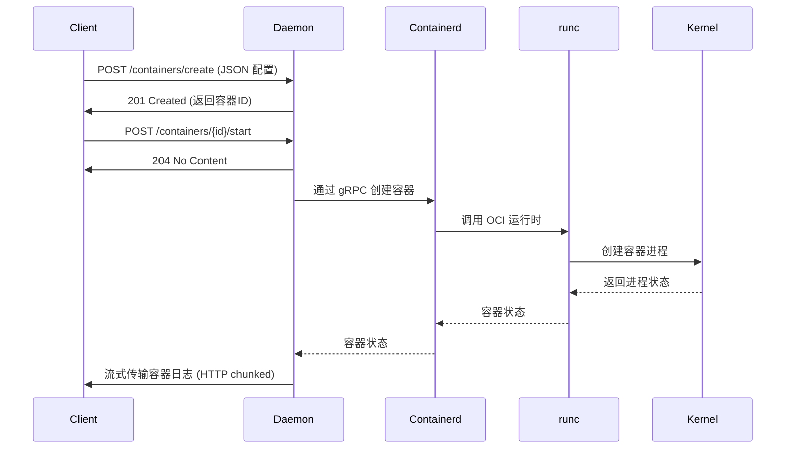

# docker 架构
**一、 Docker 架构概览**

Docker 采用了经典的 **Client-Server 架构**，主要包含以下核心组件：

1. **Docker Client (`docker` CLI)**:
    - 用户与 Docker 交互的主要接口（命令行工具、图形界面如 Docker Desktop、API 调用）。
    - 接收用户命令（如 `docker run`, `docker build`, `docker pull`），并通过 **Docker API** 发送给 Docker 守护进程。
    - 本身不执行核心功能，只是命令的发起者。

2. **Docker Daemon (`dockerd`)**:
    - Docker 的核心引擎，常驻后台进程。
    - 监听 Docker API 请求（通常通过 UNIX socket 或网络端口）。
    - 负责管理 Docker 的核心对象：**镜像（Images）**、**容器（Containers）**、**网络（Networks）**、**卷（Volumes）**。
    - 处理构建、运行、分发容器等所有繁重工作。
    - 可以与其它 Docker 守护进程通信以管理 Docker 服务（Swarm 模式）。

3. **Docker Registry**:
    - 存储和分发 Docker **镜像**的仓库服务。
    - **Docker Hub** 是默认的公共 Registry。
    - 用户可以搭建私有的 Registry（如 Docker Registry, Harbor, Nexus）。
    - `docker pull` 从 Registry 拉取镜像，`docker push` 将本地镜像推送到 Registry。

4. **Docker Objects**:
    - **镜像（Images）**: 只读模板，包含创建 Docker 容器的指令。**分层存储是其核心特性。**
    - **容器（Containers）**: 镜像的可运行实例。容器在镜像层之上添加一个可写的“容器层”，进程在其中运行。容器是隔离且资源受限的。
    - **网络（Networks）**: 管理容器之间、容器与宿主机、容器与外部的通信（bridge, host, overlay, macvlan 等驱动）。
    - **卷（Volumes）**: 持久化存储容器生成或使用的数据的最佳方式，独立于容器的生命周期。绕过联合文件系统，提供直接访问宿主机文件系统（或网络存储）的能力。

**Docker 架构**：基于 Client-Server 模型，核心是 `dockerd` 守护进程，管理镜像、容器、网络、卷等对象，通过 Registry 分发镜像。

### docker 分层机制
**一、 分层存储（Layered Storage） - 镜像的基石**
这是 Docker 最核心、最高效的设计之一，直接解决了你提到的“镜像体积庞大”的问题。

1. **核心概念**:
    - **只读层（Read-Only Layers）**: 一个 Docker 镜像由多个**只读层**堆叠而成。每一层代表文件系统的一部分变更（添加、修改、删除文件/目录）。
    - **联合文件系统（Union File System - UnionFS）**: Docker 利用 UnionFS（如 Overlay2, AUFS, btrfs, zfs, devicemapper）的技术将所有这些只读层**透明地叠加（Union Mount）** 在一起，呈现给用户一个**统一的、完整的文件系统视图**。用户看到的是所有层合并后的结果。
    - **写时复制（Copy-on-Write - CoW）**: 这是分层存储高效运行的关键机制。当一个容器启动时：
        - Docker 引擎基于镜像的所有只读层创建一个新的、**薄薄的可写层（Container Layer）** 放在最上面。
        - 容器内进程对文件系统的**所有修改（增、删、改）都只发生在这个可写层**。
        - **读操作**：如果文件在可写层，直接读取；如果不在，则向下穿透只读层查找。
        - **写操作**：
            - **修改已存在文件（在底层只读层）**：CoW 机制触发！Docker 会先将该文件从底层**复制**到可写层，然后在可写层进行修改。底层文件保持不变。
            - **创建新文件**：直接在可写层创建。
            - **删除文件**：在可写层创建一个特殊的“白障”（whiteout）文件标记该文件已被删除，隐藏底层文件。底层文件**实际并未被删除**。

2. **分层存储的优势**:
    - **空间效率 & 共享**:
        - 多个镜像可以共享相同的基础层（如 `ubuntu:latest` 层）。拉取新镜像时，如果本地已有其依赖的层，则无需重复下载。
        - 运行多个基于同一镜像的容器时，所有容器共享底层的只读镜像层，仅需为每个容器分配其独有的薄可写层。极大节省磁盘空间。
    - **构建效率 & 缓存**:
        - 镜像构建过程（`docker build`）是分层的（见下文分层构建），每一层的结果会被缓存。
        - 如果 Dockerfile 的指令和之前的构建没有变化（或依赖的文件没变），Docker 会直接复用缓存的层，跳过该步骤的重复执行，显著加速构建过程。
    - **镜像分发效率**:
        - 推送 (`push`) 和拉取 (`pull`) 镜像时，Docker 只传输本地缺失的层。如果仓库中已有大部分层（比如基础层），传输量会很小。
    - **不可变性（Immutability）**:
        - 镜像层一旦构建完成就是**只读且不可变的**。这保证了镜像内容的可靠性和可重复性。无论在哪里运行，同一个镜像的哈希（digest）对应的内容绝对一致。

**二、 分层构建（Layered Build） - 构建镜像的实践**
分层构建是分层存储在镜像创建过程中的具体体现。它由 **Dockerfile** 驱动。

1. **Dockerfile 与层的关系**:
    - Dockerfile 中的**每一条指令**（`FROM`, `RUN`, `COPY`, `ADD`, `CMD`, `ENV` 等）在执行时，通常都会在当前的镜像之上**创建一个新的层**。
    - `FROM` 指令指定基础镜像，它就是新镜像的第一层（或多层，因为基础镜像本身也是分层的）。
    - 后续的 `RUN apt-get update && apt-get install -y package` 会创建一个新层，包含安装包带来的文件系统变更。
    - `COPY ./app /app` 会创建一个新层，包含复制进去的文件。
    - 以此类推。

2. **构建过程详解**:
    - Docker 守护进程读取 Dockerfile。
    - 从 `FROM` 指定的基础镜像开始（如果本地没有，则从 Registry 拉取）。
    - **按顺序执行 Dockerfile 中的每条指令**。
    - **每条指令执行前**：基于上一条指令创建出的镜像层（或基础镜像）启动一个**临时容器**。
    - **在临时容器中执行指令**：例如运行命令 (`RUN`)、复制文件 (`COPY`/`ADD`)、设置环境变量 (`ENV`) 等。这些操作会修改容器内的文件系统（主要发生在容器的可写层）。
    - **指令执行后**：Docker 将**临时容器可写层中的文件系统变更**，**提交（commit）** 为一个**新的、只读的镜像层**。
    - 临时容器被移除。
    - 基于这个新创建的层，继续执行下一条指令，重复上述过程。
    - 所有指令执行完毕后，最终得到一个由多层只读层堆叠而成的**新镜像**，并赋予一个 ID 或 Tag。

3. **分层构建的关键特性与最佳实践**:
    - **缓存机制**：这是分层构建最大的优势之一。Docker 会为每个成功构建的层生成一个唯一的哈希值（基于指令内容、上下文文件等）。如果后续构建时，Dockerfile 中的某条指令及其所有前置指令和上下文文件都未改变，Docker 会直接**复用之前构建缓存的层**，跳过该指令的执行，极大加速构建。因此，**将不常变化的指令（如安装依赖）放在 Dockerfile 前面，将常变化的指令（如复制应用代码）放在后面**是优化构建速度的关键。
    - **层的最小化**：你提到的“每一层尽量只包含该层需要添加的东西，任何额外的东西应该在该层构建结束前清理掉”至关重要。例如：
        - 在同一个 `RUN` 指令中执行 `apt-get update && apt-get install -y package && rm -rf /var/lib/apt/lists/*`。这样，安装包和清理缓存的操作发生在**同一层**。如果分成两个 `RUN` 指令，安装包会在一层，删除操作在下一层。虽然最终用户看不到缓存文件（因为被上层“删除”标记覆盖了），但这些缓存文件**仍然存在于安装包所在的那一层镜像中**，导致镜像总体积**无谓地增大**。
        - 避免在层中引入不必要的临时文件或大文件。
    - **可追溯性**：镜像的每一层都对应 Dockerfile 中的一条（或一组）指令，便于理解镜像的构建历史和内容组成 (`docker history <image>`)。

**三、 总结**
- **分层存储**：是 Docker 镜像的**核心实现机制**。镜像由多层**只读层**通过 **UnionFS** 联合挂载而成。容器启动时在最上层添加一个**可写层**，利用 **CoW** 机制实现高效的文件修改。这带来了空间共享、高效分发、镜像不可变等巨大优势。
- **分层构建**：是**利用分层存储机制创建镜像的具体过程**。Dockerfile 中的每条指令通常生成一个新的只读层。**缓存机制**是分层构建的核心优势，通过优化 Dockerfile 指令顺序和内容（最小化层、及时清理）可以显著提升构建效率和减小最终镜像体积。

### docker 通信机制


#### linux 进程间socket通信

1.  **内核旁路优化**

- 数据直接在**内核地址空间**内传递
- 避免了网络协议栈的处理（TCP/IP 栈）
- 使用专门的传输路径：
```text
发送进程 → 内核socket缓冲区 → 接收进程
```

2. **内存映射技术**
- 发送方和接收方共享同一块物理内存页
- 通过 `mmap()` 实现内存页面共享
- 修改时使用写时复制（Copy-on-Write）策略

2. **I/O 操作细节**
虽然称为"Socket"，但实际 I/O 操作与传统磁盘 I/O 完全不同：

| 特性         | 本地 Socket               | 磁盘 I/O             |
| ---------- | ----------------------- | ------------------ |
| **介质**     | 内存                      | 磁盘/SSD             |
| **延迟**     | 纳秒级 (100-500ns)         | 微秒/毫秒级             |
| **数据路径**   | 内核缓冲区直接传输               | 块设备驱动              |
| **系统调用**   | `sendmsg()`/`recvmsg()` | `read()`/`write()` |
| **DMA 使用** | 不涉及                     | 必需                 |
| **上下文切换**  | 1-2 次                   | 多次                 |

### dockerfile和docker compose
 - **Dockerfile**：一个纯文本文件，包含一系列**指令**（如 `FROM`, `RUN`, `COPY`, `CMD`, `EXPOSE` 等）。它定义了如何从头开始构建一个**单一的 Docker 镜像**。`docker build`指令来读取它构建镜像。
- **Docker Compose：** 一个用于**定义和运行多容器 Docker 应用程序的工具**。它使用一个 **YAML 文件**（通常命名为 `docker-compose.yml`）来配置应用程序所需的**服务**（每个服务通常对应一个容器）、**网络**、**数据卷**以及它们之间的关系（如依赖、连接等）。

```个人理解
1.
docker-compose.yml 有点像makefile
Docker Compose 就有点像make

Dockerfile 有点像***.c
docker build 有点像 gcc ***.c

2. 
Docker Compose 会读取配置文件docker-compose.yml
这个文件大概率会有build字段，就会调用docker build，正如makefile也可以没有gcc指令（虽然那makefile就没啥意思），docker-compose.yml同理

3.
如果docker-compose.yml只定义了一个容器，那只用dockerfile，docker build指令来执行就可以，就类似makefile只写了一句gcc ***.c，那就没必要用make
```


[Compose](https://yeasy.gitbook.io/docker_practice/compose/introduction) 项目是 Docker 官方的开源项目，负责实现对 Docker 容器集群的快速编排。从功能上看，跟 `OpenStack` 中的 `Heat` 十分类似。其代码目前在 [https://github.com/docker/compose](https://github.com/docker/compose) 上开源。

`Compose` 定位是 「定义和运行多个 Docker 容器的应用（Defining and running multi-container Docker applications）」，其前身是开源项目 Fig。

通过第一部分中的介绍，我们知道使用一个 `Dockerfile` 模板文件，可以让用户很方便的定义一个单独的应用容器。然而，在日常工作中，经常会碰到需要多个容器相互配合来完成某项任务的情况。例如要实现一个 Web 项目，除了 Web 服务容器本身，往往还需要再加上后端的数据库服务容器，甚至还包括负载均衡容器等。

`Compose` 恰好满足了这样的需求。它允许用户通过一个单独的 `docker-compose.yml` 模板文件（YAML 格式）来定义一组相关联的应用容器为一个项目（project）。

`Compose` 中有两个重要的概念：
- 服务 (`service`)：一个应用的容器，实际上可以包括若干运行相同镜像的容器实例。
- 项目 (`project`)：由一组关联的应用容器组成的一个完整业务单元，在 `docker-compose.yml` 文件中定义。

`Compose` 的默认管理对象是项目，通过子命令对项目中的一组容器进行便捷地生命周期管理。
`Compose` 项目由 Python 编写，实现上调用了 Docker 服务提供的 API 来对容器进行管理。因此，只要所操作的平台支持 Docker API，就可以在其上利用 `Compose` 来进行编排管理。


### docker volume
[`数据卷`](https://yeasy.gitbook.io/docker_practice/data_management/volume) 是一个可供一个或多个容器使用的特殊目录，它绕过 UnionFS，可以提供很多有用的特性：
- `数据卷` 可以在容器之间共享和重用
- 对 `数据卷` 的修改会立马生效
- 对 `数据卷` 的更新，不会影响镜像
- `数据卷` 默认会一直存在，即使容器被删除


```bash
docker volume ls
docker volume create my-vol
docker volume inspect my-vol

# 启动容器并将卷挂载到磁盘里
docker run -d -P \
    --name web \
    # -v my-vol:/usr/share/nginx/html \
    --mount source=my-vol,target=/usr/share/nginx/html \
    nginx:alpine

# 指定挂载一个本地主机的目录到容器中去
docker run -d -P \
    --name web \
    # -v /src/webapp:/usr/share/nginx/html \
    --mount type=bind,source=/src/webapp,target=/usr/share/nginx/html \
    nginx:alpine

docker volume rm my-vol
```

在 Docker 卷（`volumes`）挂载的配置中，`- /proc:/proc:ro` 的 `ro` 表示 **read-only（只读）**。

1. **`- /proc:/proc:ro` 的含义**
    - `/proc`（主机路径）挂载到容器内的 `/proc`（容器路径）。
    - `:ro` 表示容器内对该挂载的目录 **只有读取权限，不能修改**（Read-Only）。

2. **为什么需要 `ro`？**
    - `/proc` 是 Linux 内核提供的虚拟文件系统，包含系统运行时信息（如进程、CPU、内存等）。
    - **安全性**：如果容器内的程序意外（或恶意）修改 `/proc` 下的文件，可能影响主机系统稳定性。
    - **最佳实践**：监控类工具通常只需要读取 `/proc`，不需要写入，因此用 `ro` 更安全。

3. **对比其他选项**
    - **默认情况**（不加 `:ro`）：挂载的卷是可读写的（`rw`）。
        volumes:
          - /proc:/proc   # 读写权限（危险！不推荐用于 /proc）
    - **只读挂载**（推荐）：
        volumes:
          - /proc:/proc:ro  # 只读权限（安全）

4. **你的场景**
    - 你的 `system-monitor` 是一个系统监控工具，只需从 `/proc` 读取数据（如 CPU 使用率、进程列表等），因此 `:ro` 是合理的选择。

- **只读挂载配置文件**：
    volumes:
      - ./config.json:/app/config.json:ro

- **读写挂载数据目录**：
    volumes:
      - ./data:/app/data  # 默认 rw

`:ro` 是 Docker 挂载卷时的常用选项，用于限制容器内对主机文件的修改权限。在你的配置中，`- /proc:/proc:ro` 既能满足监控需求，又能提升安全性。


## 从hello-world看docker 分层

### 1. `hello-world` 镜像的特殊性

这个镜像 **不需要完整的操作系统**，它只包含一个静态编译的二进制文件 `/hello`：

- **大小仅 10KB**（对比：完整 Ubuntu 镜像约 70MB）
    
- **没有包管理器**（如 apt/yum）
    
- **没有 shell**（如 bash）
    
- **甚至没有标准 C 库**（`/hello` 是静态链接的）
    

它直接通过 Linux 内核的 **系统调用** 输出信息，然后退出。

---
### 2. Linux 镜像的分层结构
Docker 镜像的层级关系：

```text
你的应用
└── 运行时环境 (如 Python/Node.js)
    └── 基础系统工具
        └── 发行版用户空间 (如 Ubuntu/Debian)
            └── 内核 (由宿主机提供)
```

但 `hello-world` 跳过了中间所有层，直接：
```text
/hello (静态二进制文件)
└── 内核系统调用接口
```

---

### 3. 与发行版镜像的区别

|特性|`hello-world`|Ubuntu/Debian 镜像|
|---|---|---|
|包含内容|单个静态二进制文件|完整的用户空间工具链|
|依赖关系|无|依赖 glibc、包管理系统等|
|可执行命令|只能运行 `/hello`|可以运行任意 Linux 命令|
|典型用途|测试 Docker 是否工作|实际应用开发/部署环境|
|进入容器|不可能（无 shell）|可以用 `docker exec -it`|

---

### 4. 为什么能直接运行？
- **Linux 内核特性**：所有 Linux 发行版共享同一个内核接口（系统调用）
- **静态编译**：`/hello` 不依赖动态链接库
- **极简主义**：只实现最基本的功能（输出文本+退出）
---

### 5. 实际应用镜像的例子
比如基于 Ubuntu 的 Nginx 镜像：

```text
nginx
└── Debian/Ubuntu 用户空间
    └── 内核系统调用
```
这种镜像需要完整的发行版，因为：
- Nginx 依赖 glibc
- 需要包管理器安装依赖
- 需要 shell 进行配置
---
### 结论
1. Docker 镜像 **不一定需要完整发行版**，取决于应用需求    
2. 越底层的镜像 **体积越小**，但 **功能性越有限**
3. 大多数实际应用镜像还是会基于某个发行版（Alpine/Ubuntu/Debian），因为它们需要：
    - 包管理器
    - 动态链接库
    - 系统工具集


## 架构问题
### Docker 和 app 打包、虚拟机的异同
问：
比如我要部署一个pyside6的GUI APP项目，要在各种操作系统和python版本的环境下部署，这时候又四种方式可以试下在其他环境下运行：1. python虚拟环境， 2. 虚拟机（比如我是在ubuntu 20.04开发的，就可以下载一个虚拟机） 3. pyinstaller打包， 4. docker部署，除了这四种跨环境的运行实现方式还有别的吗？全面分析一下他们的异同

答：
**1. Python 虚拟环境**
**优点**：
• **依赖隔离**：不同项目的依赖不会冲突。
• **灵活性**：开发和测试时快速切换 Python 版本和包版本。

**缺点**：
• **不解决操作系统差异**：无法跨操作系统运行。
• **用户需要 Python 环境**：终端用户需要安装 Python，可能增加复杂性。
• **不适合最终用户分发**：更适合开发和测试阶段。

**2. 虚拟机**
**优点**：
• **环境一致性**：完全复制开发环境，消除环境差异。
• **隔离性**：提供操作系统级别的隔离，安全性高。
**缺点**：
• **资源消耗大**：占用大量的内存和存储空间。
• **性能开销**：运行速度可能比原生环境慢。
• **用户体验差**：终端用户需要安装和配置虚拟机，不友好。

**3. PyInstaller 打包**
**优点**：
• **生成可执行文件**：无需用户安装 Python 环境。
• **代码保护**：源代码被打包，不易被查看。
• **跨平台支持**：可在不同操作系统上生成对应的可执行文件。
**缺点**：
• **打包复杂性**：有时需要处理打包问题，如动态库依赖。
• **文件体积大**：可执行文件可能很大，包含所有依赖。
• **兼容性问题**：不同平台可能出现不一致的行为，需要分别调试。
  
**4. Docker 部署**
**优点**：
• **环境一致性**：确保在任何地方运行都是相同的环境。
• **轻量级**：比虚拟机更轻，占用资源少。
• **依赖管理**：所有依赖都在容器中，主机环境干净。
**缺点**：
• **GUI 支持复杂**：默认情况下，Docker 不支持 GUI 应用程序，需要额外配置（如 X11 转发）。
• **学习成本**：用户需要了解 Docker 的基本使用。
• **不适合桌面应用分发**：更适合服务器和服务的部署。

### Docker 开发部署和虚拟环境
问：
比如用python的pytorch做深度学习开发，我设置一个python的虚拟环境，和pytorch的docker有何区别，如果在不同的机器快速部署我当前这套开发环境的话，哪个比较合适？


答：
在使用 Python 的 PyTorch 进行深度学习开发时，**Python 虚拟环境**和使用 **PyTorch 的 Docker 容器**之间存在一些关键区别。以下是对它们的比较，以及在不同机器上快速部署当前开发环境的建议。

**Python 虚拟环境**

**优点**：
• **依赖隔离**：虚拟环境可以隔离不同项目的 Python 包依赖，防止冲突。
• **轻量级**：不需要额外的系统资源，创建和激活都很快捷。
• **灵活性**：可以根据需要安装特定版本的 PyTorch 和其他库。

**缺点**：
• **系统依赖**：仍然依赖于主机操作系统，可能需要手动安装系统级别的依赖，如 CUDA 驱动、特定的库等。
• **环境可移植性**：在不同机器上重现同样的环境可能会遇到困难，尤其是当操作系统或硬件配置不同的时候。
• **配置复杂性**：需要确保每台机器上的 Python 版本和系统库一致，手动配置可能耗时。


**PyTorch 的 Docker 容器**
**优点**：
• **环境一致性**：Docker 容器包含了操作系统、Python 解释器、PyTorch 及其所有依赖，确保在不同机器上运行的环境完全一致。
• **易于部署**：只需在目标机器上安装 Docker，然后拉取并运行容器即可，无需手动配置环境。
• **包含系统依赖**：如 CUDA 驱动、cuDNN 等都可以在容器中预先配置好，避免了在不同系统上安装这些依赖的麻烦。
• **可移植性**：容器可以在任何支持 Docker 的平台上运行，无论是本地、服务器还是云环境。

**缺点**：
• **资源占用**：Docker 容器相对于虚拟环境更占用系统资源，虽然比虚拟机轻量，但仍需要一定的存储空间和内存。
• **学习成本**：需要了解 Docker 的基本使用和命令，对不熟悉容器技术的用户可能有一定的学习曲线。
• **GPU 配置**：如果需要在容器中使用 GPU，需要配置 NVIDIA Docker，步骤相对复杂。

**哪个更适合快速在不同机器上部署当前的开发环境？**
如果您的目标是**快速、一致地在不同机器上部署完全相同的开发环境**，那么 **Docker 容器**更为合适，原因如下：
• **一致性**：Docker 镜像可以确保在不同的机器上运行相同的环境，避免了“在我机器上可以运行”的问题。
• **简化部署**：只需安装 Docker，然后运行预先构建好的容器，无需在每台机器上手动配置环境。
• **减少系统差异影响**：Docker 容器包含了运行所需的所有组件，主机系统的差异（如操作系统版本、系统库等）对容器内的应用影响很小。

然而，如果您的开发环境相对简单，且目标机器的系统环境与开发机器相似（如操作系统版本、Python 版本、CUDA 驱动等），并且您或您的团队对 Docker 不太熟悉，那么使用 **Python 虚拟环境**也可以满足需求。

**总结建议**：
• **使用 Docker**：
• 需要在多台具有不同操作系统或配置的机器上部署环境。
• 希望确保环境的一致性，避免手动配置带来的问题。
• 项目依赖复杂，包括特定版本的系统库、驱动等。

• **使用 Python 虚拟环境**：
• 目标机器与开发机器环境相似。
• 项目依赖主要是 Python 包，系统级依赖较少或容易安装。
• 团队对 Docker 不熟悉，且不希望增加学习成本。


**额外提示**：
• **GPU 支持**：如果您的项目需要使用 GPU，加速深度学习训练，那么使用 Docker 时需要配置 NVIDIA Docker（现在是 NVIDIA Container Toolkit），以确保容器可以访问主机的 GPU。这可能需要在每台目标机器上进行一些初始设置。
• **环境管理工具**：无论选择哪种方式，都建议使用环境管理工具（如 requirements.txt、conda env 或 Dockerfile）来记录和管理依赖，以便在需要时重现环境。
• **镜像大小**：注意 Docker 镜像可能比较大，尤其是包含了深度学习框架和 CUDA 的镜像。在网络传输和存储时需要考虑这一点。


--- 
# docker 环境配置

## 安装
### mac安装docker
就用brew安装就可以，但是，有cask和命令行两个。
#### 1. **`brew install docker`**
- **安装内容**:  
    仅安装 Docker 的 **命令行工具（CLI）**，不包含 Docker 引擎（守护进程）或图形化界面（Docker Desktop）。
    
- **用途**:  
    适用于以下场景：
    - 你只需要 `docker`、`docker-compose` 等命令（例如连接远程 Docker 主机）。
    - 你已在 macOS 上通过其他方式（如手动安装）配置了 Docker 引擎。
        
- **局限性**:
    - **无法直接使用**：因为 macOS 不是 Linux 系统，缺少原生 Docker 引擎依赖的 Linux 内核特性（如 cgroups、命名空间等）。
    - 如果你直接运行 `docker ps`，会报错 `Cannot connect to the Docker daemon`（因为缺少本地守护进程）。
- **依赖关系**:  
    安装的二进制文件来自 Homebrew 的 **Formula**（纯命令行工具）。

#### 2. **`brew install --cask docker`**
- **安装内容**:  
    安装 **Docker Desktop for Mac**（完整的图形化应用），包含：
    - Docker 引擎（守护进程）
    - 命令行工具（CLI）
    - 图形化管理界面
    - 内置的 Linux 虚拟机（用于运行容器）
        
- **用途**:  
    这是 macOS 上运行 Docker 的 **推荐方式**，因为：
    - Docker Desktop 会自动处理 macOS 的依赖（如虚拟化、文件共享、网络配置等）。
    - 开箱即用，无需手动配置守护进程。
- **安装路径**:  
    应用会被安装到 `/Applications/Docker.app`，同时命令行工具通过软链接添加到 `PATH`。
- **依赖关系**:  
    安装的包来自 Homebrew 的 **Cask**（专为 macOS 图形应用设计）。
    
---

### windows安装docker
- 装wsl，在wsl内就跟ubuntu一样的方法。

### ubuntu安装docker：
apt安装可能版本老一些，可能存在兼容性问题，如果没有，这样最方便，如果有，就按照下面官网方法。

1. apt安装
```bash
sudo apt install docker.io docker-compose
```
2. [官网方式安装](https://docs.docker.com/engine/install/ubuntu/)
```bash
# 1 卸载老版本
for pkg in docker.io docker-doc docker-compose docker-compose-v2 podman-docker containerd runc; do sudo apt-get remove $pkg; done

# 2 加入docker官方源
# Add Docker's official GPG key:
sudo apt-get update
sudo apt-get install ca-certificates curl
sudo install -m 0755 -d /etc/apt/keyrings
sudo curl -fsSL https://download.docker.com/linux/ubuntu/gpg -o /etc/apt/keyrings/docker.asc
sudo chmod a+r /etc/apt/keyrings/docker.asc

# Add the repository to Apt sources:
echo \
  "deb [arch=$(dpkg --print-architecture) signed-by=/etc/apt/keyrings/docker.asc] https://download.docker.com/linux/ubuntu \
  $(. /etc/os-release && echo "${UBUNTU_CODENAME:-$VERSION_CODENAME}") stable" | \
  sudo tee /etc/apt/sources.list.d/docker.list > /dev/null
sudo apt-get update

# 3 安装
sudo apt-get install docker-ce docker-ce-cli containerd.io docker-buildx-plugin docker-compose-plugin

# 用户加入docker组获取权限
sudo groupadd docker
sudo usermod -aG docker $USER

# 试运行
# docker run hello-world
```

#### 为什么不是`apt install docker`？
- **软件包命名冲突**：  
    在早期的 Debian/Ubuntu 中，`docker` 这个名称被一个名为 `docker` 的旧项目（一个基于 KDE 的图形化桌面应用，与容器无关）占用。因此，Docker 官方引擎的包被命名为 `docker.io` 以避免冲突。
- **官方 Docker 包不在默认仓库**：  
    Docker 官方推荐的安装方式是通过 Docker 自己的仓库（`apt.dockerproject.org` 或 `download.docker.com`），而非系统默认仓库。若直接从 Docker 官方安装，包名是 `docker-ce`（社区版）或 `docker-ee`（企业版）。
- **`docker-compose`**：  
    这是一个独立的工具，用于通过 YAML 文件定义和管理多容器应用。它与 Docker 引擎配合使用，但属于不同的项目。在 Debian/Ubuntu 仓库中，它作为一个单独的包提供。

#### [docker set proxy](https://docs.docker.com/engine/daemon/proxy/#daemon-configuration)
You may configure proxy behavior for the daemon in the `daemon.json` file, or using CLI flags for the `--http-proxy` or `--https-proxy` flags for the `dockerd` command. Configuration using `daemon.json` is recommended.

```json
{
  "proxies": {
    "http-proxy": "http://proxy.example.com:3128",
    "https-proxy": "https://proxy.example.com:3129",
    "no-proxy": "*.test.example.com,.example.org,127.0.0.0/8"
  }
}
```

After changing the configuration file, restart the daemon for the proxy configuration to take effect:

```bash
 sudo systemctl restart docker
```

The Docker daemon checks the following environment variables in its start-up environment to configure HTTP or HTTPS proxy behavior:

- `HTTP_PROXY`
- `http_proxy`
- `HTTPS_PROXY`
- `https_proxy`

3. 如果没有小飞机，就用用镜像安装docker
```bash
# 卸载docker
sudo apt-get remove docker docker-engine docker.io containerd runc
# 安装依赖
sudo apt update
sudo apt install apt-transport-https ca-certificates curl software-properties-common gnupg lsb-release
# 阿里云key
curl -fsSL http://mirrors.aliyun.com/docker-ce/linux/ubuntu/gpg | sudo apt-key add -
# 阿里云ppa
sudo add-apt-repository "deb [arch=amd64] http://mirrors.aliyun.com/docker-ce/linux/ubuntu $(lsb_release -cs) stable"
# 安装docker
sudo apt install docker-ce docker-ce-cli containerd.io docker-buildx-plugin docker-compose-plugin
# 用户权限
sudo usermod -aG docker $USER
reboot
```

2. docker pull设置镜像
国内大部分docker镜像都失效了，但是可以登陆[阿里云账号](https://cr.console.aliyun.com)[设置镜像](https://cr.console.aliyun.com/cn-hangzhou/instances/mirrors)。
好像阿里也失效了，[github-docker-镜像网站](https://github.com/DaoCloud/public-image-mirror)
```bash
sudo vim /etc/docker/daemon.json
# 然后添加如下内容
{
    "registry-mirrors": ["https://docker.m.daocloud.io"] 
}
# 然后重启该服务
sudo systemctl daemon-reload
sudo systemctl restart docker
```

## 配置
```bash
# 查看用户组
groups
# 查看用户组（更全）
# cat /etc/group

# 建立 `docker` 组，mac不用
# sudo groupadd docker

# 将当前用户加入 `docker` 组
sudo usermod -aG docker $USER
```


# 指令
```bash
# 查看本地镜像
docker image ls

# 
docker image prune


# 查看当前运行的docker container
docker ps

# 查看存储使用情况
docker system df

# 
docker inspect gcc:11

# docker 卷
docker volume ls
docker volume create my-vol
docker volume inspect my-vol

# 启动容器并将卷挂载到磁盘里
docker run -d -P \
    --name web \
    # -v my-vol:/usr/share/nginx/html \
    --mount source=my-vol,target=/usr/share/nginx/html \
    nginx:alpine

# 指定挂载一个本地主机的目录到容器中去
docker run -d -P \
    --name web \
    # -v /src/webapp:/usr/share/nginx/html \
    --mount type=bind,source=/src/webapp,target=/usr/share/nginx/html \
    nginx:alpine

docker volume rm my-vol
```

# 问题


## 多阶段构建

多阶段构建是必不可少的。多阶段构建的想法很简单：“我不想在最终的镜像中包含一堆 C 或 Go 编译器和整个[编译工具链](https://zhida.zhihu.com/search?content_id=122234546&content_type=Article&match_order=1&q=%E7%BC%96%E8%AF%91%E5%B7%A5%E5%85%B7%E9%93%BE&zhida_source=entity)，我只要一个编译好的可执行文件！”

多阶段构建可以由多个 `FROM` 指令识别，每一个 `FROM` 语句表示一个新的构建阶段，阶段名称可以用 `AS` 参数指定，例如：

```dockerfile
FROM gcc AS buildstage
COPY hello.c .
RUN gcc -o hello hello.c
FROM ubuntu
COPY --from=buildstage hello .
CMD ["./hello"]
```

本例使用基础镜像 `gcc` 来编译程序 `hello.c`，然后启动一个新的构建阶段，它以 `ubuntu`作为基础镜像，将可执行文件 `hello`从上一阶段拷贝到最终的镜像中。最终的镜像大小是 `64 MB`，比之前的 `1.1 GB` 减少了 `95%`：

## 悬空镜像
这些 `<none>` 镜像（称为 **悬空镜像**），是 Docker 构建过程中的常见产物。

1. **构建过程中的中间层**
    - 反复构建/更新 `machine-learning-platform` 镜像时（如 `docker build -t machine-learning-platform:1.0.0`），Docker 会为每个构建步骤生成中间层镜像。
    - 构建完成后，旧版本的镜像会被新版本取代，**失去标签**（变为 `<none>`），但不会自动删除。
        
2. **覆盖标签后的旧镜像**
    - 如果您多次构建同一标签（如 `:1.0.0`），Docker 会将标签从旧镜像转移到新镜像上，导致旧镜像变成无标签的 `<none>`。
        
3. **未清理的缓存层**
    - Docker 会保留构建缓存以加速后续构建，但未使用的缓存层会堆积为 `<none>` 镜像。

```bash
# 仅删除无标签镜像
docker image prune
```

## DNS问题

1. **`/etc/resolv.conf` 的作用**
    - 这个文件是 Linux/macOS 系统中 **DNS 解析的配置文件**，指定了系统使用的 DNS 服务器地址。
    - 默认情况下，系统会使用网络接口（如路由器、ISP）提供的 DNS，但有时这些 DNS 可能不稳定或无法解析某些域名（如 Docker Hub）。
        
2. **`nameserver 8.8.8.8` 和 `nameserver 8.8.4.4` 的作用**
    - `8.8.8.8` 和 `8.8.4.4` 是 **Google 的公共 DNS 服务器**，它们通常比 ISP 提供的 DNS 更稳定、响应更快。
    - 修改后，系统会优先使用 Google DNS 解析域名，从而可能解决 Docker Hub 连接超时的问题。
        
3. **为什么会影响 Docker？**
    - Docker 在拉取镜像时，需要解析 `registry-1.docker.io` 的 IP 地址。
    - 如果默认 DNS 无法正确解析或响应慢，就会导致 `i/o timeout` 错误。
    - 使用更可靠的 DNS（如 `8.8.8.8`）可以避免这个问题。
        
这种修改是否影响全局网络？✅ **是的，会影响整个系统的 DNS 解析**

- 修改 `/etc/resolv.conf` 后，**所有网络请求**（不仅仅是 Docker）都会使用新的 DNS 服务器。
- 但通常不会有负面影响，因为 Google DNS (`8.8.8.8`) 是广泛使用的公共 DNS，稳定性和速度都较好。

⚠️ **注意**：

- 在 macOS 上，`/etc/resolv.conf` 可能是由 `systemd-resolved` 或 `NetworkManager` 动态管理的，手动修改可能会被覆盖。
- 更推荐的方式是通过 **系统设置** 或 **Docker 配置** 修改 DNS，而不是直接编辑 `/etc/resolv.conf`。

---

### 更好的解决方案（推荐）

#### 1. **直接修改 Docker 的 DNS 配置（不影响系统全局）**

在 Docker 的配置文件 `daemon.json`（通常位于 `/etc/docker/daemon.json` 或 `~/.docker/daemon.json`）中添加自定义 DNS：
```json
{
  "dns": [
	  "223.5.5.5",
	  "8.8.8.8",
	  "8.8.4.4"
  ]
}
```

然后重启 Docker：
```bash
sudo systemctl restart docker  # Linux
# 或者在 macOS 上通过 Docker Desktop 重启
```

#### 2. **在 macOS 上修改全局 DNS（推荐）**

1. 打开 **系统偏好设置 > 网络**。
2. 选择当前网络（如 Wi-Fi），点击 **高级 > DNS**。
3. 添加 `8.8.8.8` 和 `8.8.4.4`，并拖到列表顶部。
4. 点击 **OK** 并应用更改。

#### 为什么会出现默认 DNS 解析失败？
可能的原因：
1. **ISP 的 DNS 服务器不稳定**（如某些国内运营商 DNS 污染或拦截）。
2. **网络代理/VPN 干扰**（如果使用代理，可能需要配置 Docker 使用代理）。
3. **系统 DNS 缓存问题**（可尝试刷新缓存：`sudo dscacheutil -flushcache`（macOS））。