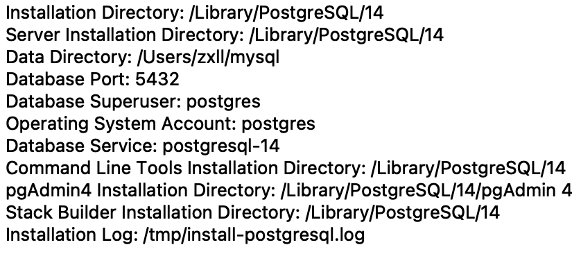
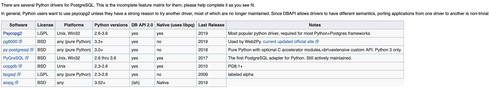
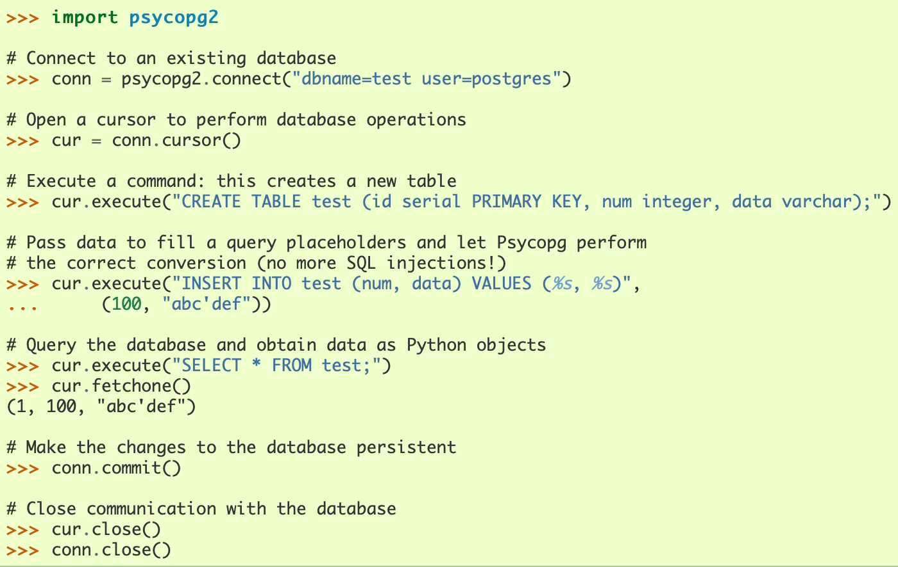
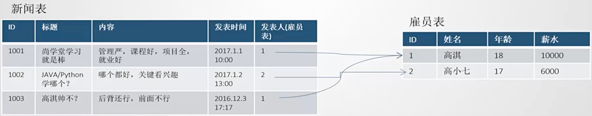
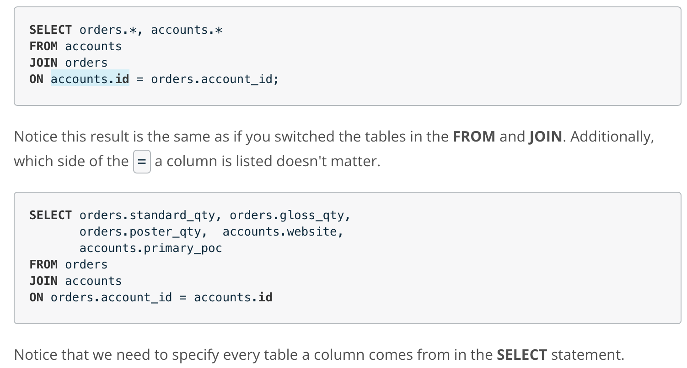

# learn SQL

### 参考
* [一个公开课](https://classroom.udacity.com/courses/ud198)
* 

### mac安装环境

* 可视化（[该网站下载](https://www.runoob.com/postgresql/mac-install-postgresql.html)）


* 通过Homebrew

```shell
# 安装
brew install postgresql

# 等待安装完成后，初始化：
initdb /usr/local/var/postgres

# 启动服务：（注意这个文件夹是可以指定任意路径的，也就是以后数据库所在的地方）
pg_ctl -D /usr/local/var/postgres -l /usr/local/var/postgres/server.log start

# 设置开机启动
ln -sfv /usr/local/opt/postgresql/*.plist ~/Library/LaunchAgents
launchctl load ~/Library/LaunchAgents/homebrew.mxcl.postgresql.plist

# 创建用户？与数据库？mac安装PostgreSQL后不会创建用户名数据库，执行命令：
createdb
psql #这是创建一个与Username同名的数据库，若只是进入默认数据库，则输入：psql postgres，或者输入psql -l来查看所有数据库

# psql连接数据库默认选用的是当前的系统用户使用\l命令列出所有的数据库，看到已存在用户同名数据库、postgres数据库，但是postgres数据库的所有者是当前用户，没有postgres用户。按:q退出
```

* 一个问题：（报错）

```c
$ psql postgres
// error: could not connect to server: No such file or directory Is the server running locally and accepting connections on Unix domain socket "\var/run postgresql/.s.PGSQL.5432"?

//解决方案：（原因是没有开启这个服务程序呢！相当于没开微信就想打微信电话）
sudo service postgresql start //这是linux版的（或者sudo /etc/init.d/postgresql start）
pg_ctl start // 这是mac版的(需要先export PGDATA="/usr/local/var/postgres"或者其他路径)
```


### PostgreSQL修改数据库目录/数据库目录迁移


1、在数据库软件安装之后，初始化数据库时候，可以指定初始化时创建的数据库的默认文件路径

/usr/local/pgsql/bin/initdb -D /usr/local/pgsql/data
这样初始化之后，再修改配置文件postgresql.conf为修改之后的数据文件路径，就能保证以后的数据文件也在这个路径下。

备注：可以通过find查找该文件的所在位置。

2、如果是已经初始化好了，再修改数据文件路径的，如下过程：

找到配置文件查看原来的数据存储路径在哪

```c
find / -name postgresql.conf
一般是在/etc/postgresql/9.6/main/postgresql.conf

停掉PostgreSQL

service postgresql stop
拷贝原来的数据路径到新的路径下

cp -rf /var/lib/postgresql/9.6/main/ /data/postgresql/
设置用户和权限

chown -R postgres:postgres /data/postgresql/
chmod 700 /data/postgresql/
将配置文件的数据存储路径改成新的

vi /etc/postgresql/9.6/main/postgresql.conf
data_directory='/data/postgresql/datafile'
再启动即可

service postgresql start
修改完毕后，可以用psql命令“show data_directory”查看当前数据目录


通过上面的修改的方法，使用ps -ef输出的进程还是会显示原来的旧目录，这个相当于做了URL跳转的操作，但对于运维人员不是那么的友好，那么可以通过修改源头来进行修改。修改方法如下：

注意：修改目录时先停止服务！

0. 在数据库界面使用指令“show data_directory;”，查看当前数据库所在目录

1、命令行方式启动时指定目录

pg_ctl stop -D /data/pgsql/data2
pg_ctl start -D /data/pgsql/data2
2、以init脚本启动的，修改脚本（10+）：

vi /etc/init.d/postgresql-10
# 修改为如下内容
PGDATA=/data/pgsql/data2
2、以systemd启动的，修改脚本（10+）：

vi /usr/lib/systemd/system/postgresql-10.service
# 修改为如下内容
Environment=PGDATA=/data/pgsql/data2
```

### windows 初始化常见问题

1. postgres用户，没有文件权限。

```shell
chmod 700 -R /你的数据库文件夹路径/data(或其他)/
```
2. 启动posgresql service


### 命令行常用指令

1. pg_ctl
```c
// pg_ctl is a utility to initialize, start, stop, or control a PostgreSQL server

pg_ctl init[db]   [-D DATADIR] [-s] [-o OPTIONS]

// 在zshrc中设置环境变量PGDATA=/usr/local/var/postgres，（可以用其他路径）就可以用下面指令启动PostgreSQL server了
pg_ctl start      [-D DATADIR] [-l FILENAME] [-W] [-t SECS] [-s]
                    [-o OPTIONS] [-p PATH] [-c]
                
```

### postgresql 与 python/c++的connect

* [python与postgresql](https://wiki.postgresql.org/wiki/Python)

推荐psycopy2



* [psycopg2文档](https://www.psycopg.org/docs/)

### 理论需要

1. 数据库和表格什么区别与联系？

数据库就是一个可以有多个相关联的表的数据集。



### SQL语句学习


#### IN


#### JOIN

