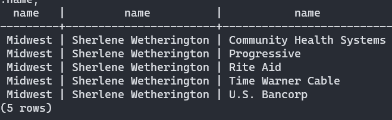
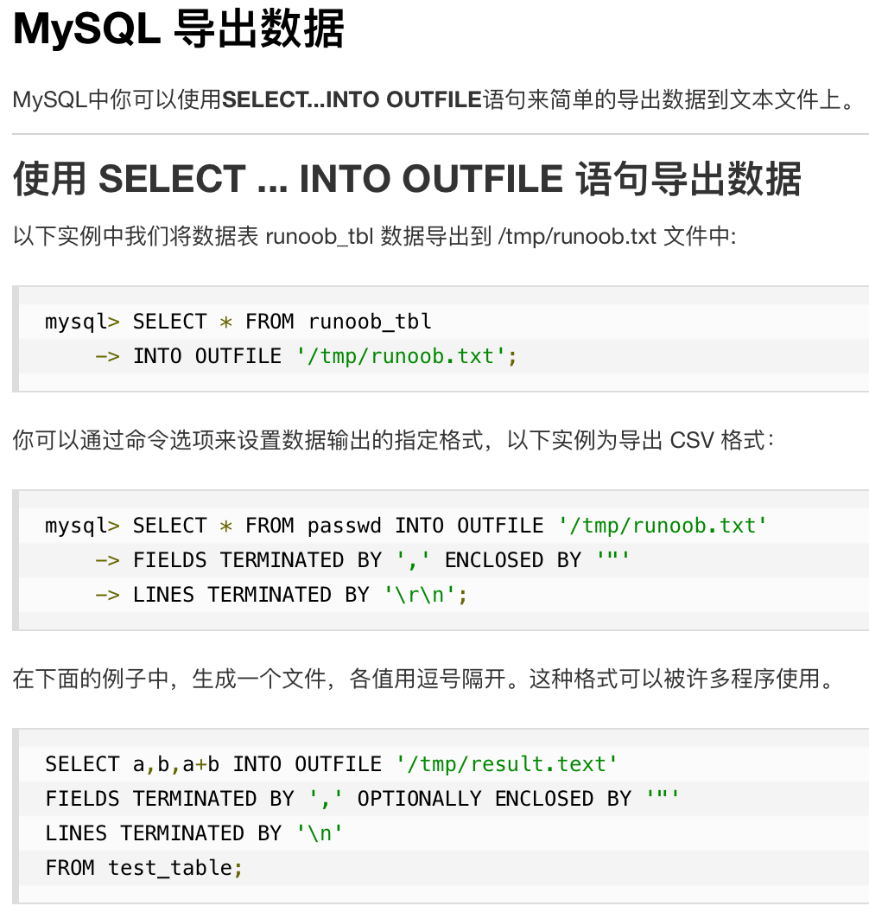
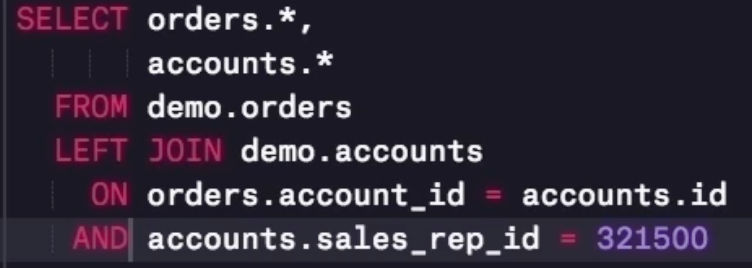
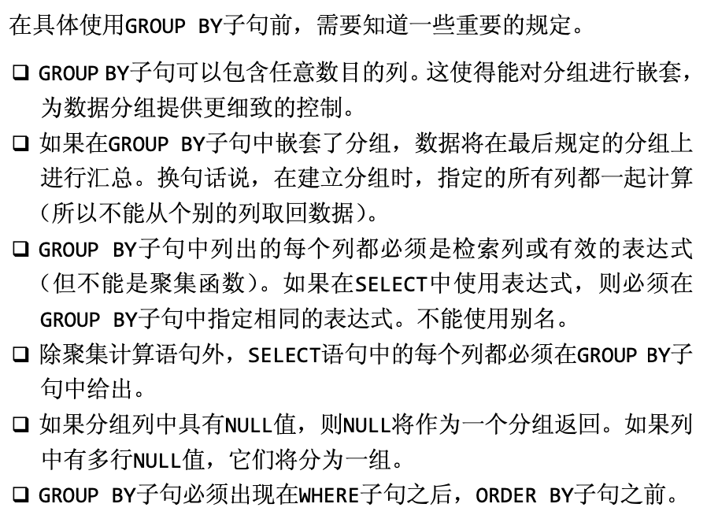
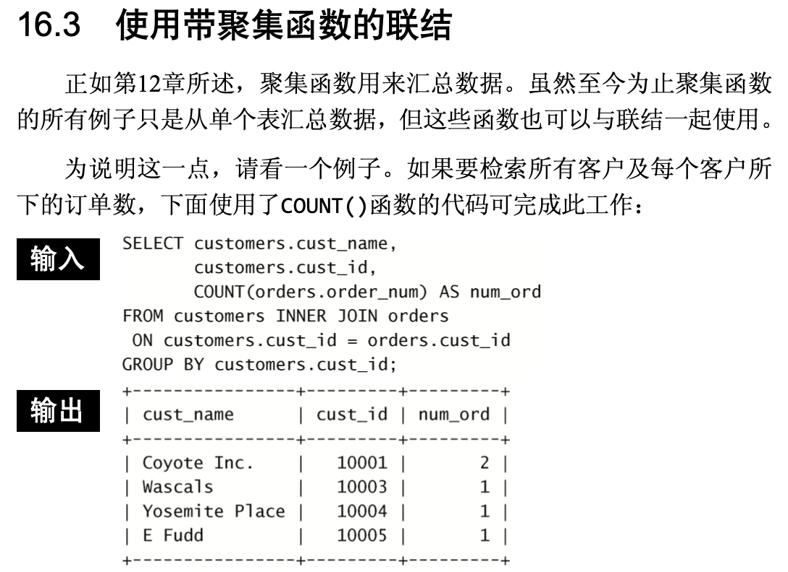
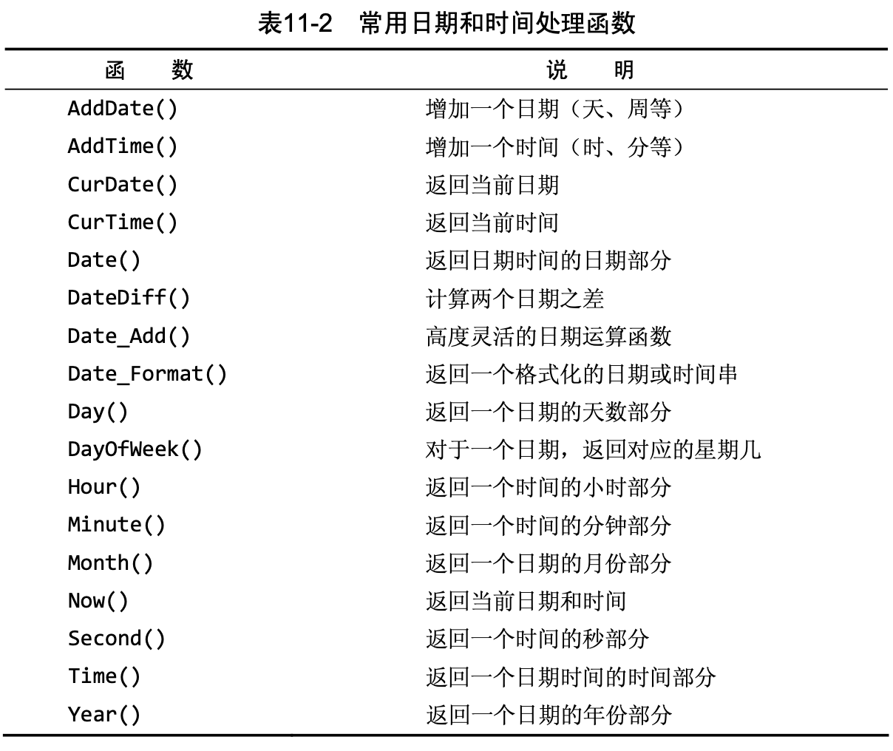

# learn SQL

### 参考

* [公开课1](https://www.bilibili.com/video/BV1ta411C7xq)
* [公开课2](https://classroom.udacity.com/courses/ud198)
* [一个不错的网站](https://www.postgresqltutorial.com/postgresql-string-functions/)

### mac安装环境

* 可视化（[该网站下载](https://www.runoob.com/postgresql/mac-install-postgresql.html)）


* 通过Homebrew

```shell
# 安装
brew install postgresql

# 等待安装完成后，初始化：
initdb /usr/local/var/postgres

# 启动服务：（注意这个文件夹是可以指定任意路径的，也就是以后数据库所在的地方）
pg_ctl -D /usr/local/var/postgres -l /usr/local/var/postgres/server.log start

# 设置开机启动
ln -sfv /usr/local/opt/postgresql/*.plist ~/Library/LaunchAgents
launchctl load ~/Library/LaunchAgents/homebrew.mxcl.postgresql.plist

# 创建用户？与数据库？mac安装PostgreSQL后不会创建用户名数据库，执行命令：
createdb
psql #这是创建一个与Username同名的数据库，若只是进入默认数据库，则输入：psql postgres，或者输入psql -l来查看所有数据库

# psql连接数据库默认选用的是当前的系统用户使用\l命令列出所有的数据库，看到已存在用户同名数据库、postgres数据库，但是postgres数据库的所有者是当前用户，没有postgres用户。按:q退出
```

* 一个问题：（报错）

```c
$ psql postgres
// error: could not connect to server: No such file or directory Is the server running locally and accepting connections on Unix domain socket "\var/run postgresql/.s.PGSQL.5432"?

//解决方案：（原因是没有开启这个服务程序呢！相当于没开微信就想打微信电话）
sudo service postgresql start //这是linux版的（或者sudo /etc/init.d/postgresql start）
pg_ctl start // 这是mac版的(需要先export PGDATA="/usr/local/var/postgres"或者其他路径)
```


### PostgreSQL修改数据库目录/数据库目录迁移


1、在数据库软件安装之后，初始化数据库时候，可以指定初始化时创建的数据库的默认文件路径

/usr/local/pgsql/bin/initdb -D /usr/local/pgsql/data
这样初始化之后，再修改配置文件postgresql.conf为修改之后的数据文件路径，就能保证以后的数据文件也在这个路径下。

备注：可以通过find查找该文件的所在位置。

2、如果是已经初始化好了，再修改数据文件路径的，如下过程：

找到配置文件查看原来的数据存储路径在哪

```c
find / -name postgresql.conf
一般是在/etc/postgresql/9.6/main/postgresql.conf

停掉PostgreSQL

service postgresql stop
拷贝原来的数据路径到新的路径下

cp -rf /var/lib/postgresql/9.6/main/ /data/postgresql/
设置用户和权限

chown -R postgres:postgres /data/postgresql/
chmod 700 /data/postgresql/
将配置文件的数据存储路径改成新的

vi /etc/postgresql/9.6/main/postgresql.conf
data_directory='/data/postgresql/datafile'
再启动即可

service postgresql start
修改完毕后，可以用psql命令“show data_directory”查看当前数据目录


通过上面的修改的方法，使用ps -ef输出的进程还是会显示原来的旧目录，这个相当于做了URL跳转的操作，但对于运维人员不是那么的友好，那么可以通过修改源头来进行修改。修改方法如下：

注意：修改目录时先停止服务！

0. 在数据库界面使用指令“show data_directory;”，查看当前数据库所在目录

1、命令行方式启动时指定目录

pg_ctl stop -D /data/pgsql/data2
pg_ctl start -D /data/pgsql/data2
2、以init脚本启动的，修改脚本（10+）：

vi /etc/init.d/postgresql-10
# 修改为如下内容
PGDATA=/data/pgsql/data2
2、以systemd启动的，修改脚本（10+）：

vi /usr/lib/systemd/system/postgresql-10.service
# 修改为如下内容
Environment=PGDATA=/data/pgsql/data2
```

### windows 初始化常见问题

1. postgres用户，没有文件权限。

```shell
chmod 700 -R /你的数据库文件夹路径/data(或其他)/
```
2. 启动posgresql service


### 命令行常用指令

1. pg_ctl
```shell
// pg_ctl is a utility to initialize, start, stop, or control a PostgreSQL server

pg_ctl init[db]   [-D DATADIR] [-s] [-o OPTIONS]

// 在zshrc中设置环境变量PGDATA=/usr/local/var/postgres，（可以用其他路径）就可以用下面指令启动PostgreSQL server了
pg_ctl start      [-D DATADIR] [-l FILENAME] [-W] [-t SECS] [-s]
                    [-o OPTIONS] [-p PATH] [-c]
                
```

### postgresql 与 python/c++的connect

* [python与postgresql](https://wiki.postgresql.org/wiki/Python)

推荐psycopy2


* [psycopg2文档](https://www.psycopg.org/docs/)

### 理论需要

1. 数据库和表格什么区别与联系？

数据库就是一个可以有多个相关联的表的数据集。


* 一个数据库中 各个表的关系图：


### SQL语句学习

#### SELECT

本质是查询，所以不会保存，相当于把数据掉入内存做修改与整理，然后显示出来（不保存）。


> If you have two or more columns in your SELECT that have the same name after the table name such as accounts.name and sales_reps.name you will need to alias them. Otherwise it will only show one of the columns. You can alias them like accounts.name AS AcountName, sales_rep.name AS SalesRepName.

也就意味着，即使表明了`SELECT accounts.name, sales_reps.name`，理论上没有歧义了吧？原因是，生成的新表的列名，不能重复？好吧，上述英文描述有问题，下面实践证否它：

```sql
SELECT r.name, s.name, a.name
FROM accounts a
JOIN sales_reps s
ON a.sales_rep_id = s.id
JOIN region r
on r.id = s.region_id WHERE r.name = 'Midwest' AND s.name LIKE 'S%' ORDER BY a.name;
```

上述代码的结果为下图：

but,anyway,这样也是不应该做的，毕竟两个相同的列名，会有歧义。


* 如何保存SELECT的结果？
1. **插入（INSERT）**

2. **导出**


#### ORDER BY

* 一个显示中位数的例题：


#### IN


#### JOIN


1. JOIN ON 与 AND

JOIN是负责把几个表的几列建立联系，那ON后边应该制定哪些是被联系起来的，所以此时，上图的`orders.account_id = accounts.id`不应该是被看作“随便”的条件，所以后边的AND就非常奇怪了。why？

此时AND替换为WHERE，逻辑上就很合理了，而事实上，这两个写法是同样的结果，令人费解。

2. JOIN 与 WHERE

> 下文节选自在《MYSQL Crash Course》
> 
> 
> 注：JOIN 默认 = INNER JOIN，另外，还有LEFT JOIN、RIGHT JOIN、OUTER JOIN，下文会讲。

所以，WHERE与JOIN ON在使用上无本质区别，这也解释了上文中“AND出现”的合理性。但是在实现机制上，有何区别？目前不知道。

3. LEFT JOIN、RIGHT JOIN、OUTER JOIN


#### "aggregation" FUCTION

* COUNT(*); e//对id列(其实就是包括了该表的非空行)记数
* COUNT(col_name); //该列的非空行记数
* SUM(col_name);
* MIN(col_name);
* MAX(col_name);
* AVG(col_name);
* AVG(DISTINCT col_name); //使用DISTINCT参数，平均值只考虑各个不同的数据
它们都是对某列的数据进行操作，得到一个数。（即使这样，“aggregation/聚集/汇总”这个词起的不太好）

#### GROUP BY 

GROUP BY 和 JOIN ON 的“顺序” : 

* 一个例题：Find the total sales in usd for each account. You should include two columns - the total sales for each company's orders in usd and the company name.
```sql
# 方法1: 
SELECT a.name account_name, SUM(o.total_amt_usd) usd
FROM orders o
JOIN accounts a
ON o.account_id = a.id
GROUP BY a.name    # GROUP BY 1 也是同理，'1'是SELECT的第一个，即a.name
ORDER BY a.name;

# 方法2: 
SELECT a.name account_name, usd
FROM (SELECT o.account_id, SUM(o.total_amt_usd) usd
    FROM orders o
    GROUP BY o.account_id) AS table1
JOIN accounts a
ON table1.account_id = a.id
ORDER BY a.name;

# 报错的方法1：（不能先GROUP再JOIN）
SELECT o.account_id, SUM(o.total_amt_usd) usd
FROM orders o
GROUP BY o.account_id) AS table1
JOIN accounts a
ON table1.account_id = a.id
ORDER BY a.name;

# 报错的方法2：（即使JOIN后再GROUP表“1”，但是关联/JOIN的表“2”，依然不能直接select）
SELECT o.account_id,a.name account_name, SUM(o.total_amt_usd) usd
FROM orders o
JOIN accounts a
ON o.account_id = a.id
GROUP BY o.account_id;
```

* another 例题:
Find the total number of times each type of channel from the web_events was used. Your final table should have two columns - the channel and the number of times the channel was used.
```sql
SELECT w.channel, COUNT(*)
FROM web_events w
GROUP BY w.channel
```
所以综合上述两个例题：`GROUP BY`是分组，还是需要自己“汇总/aggregation”，这时候，aggregation FUNCTION 如上述代码的COUNT(*)，则是对每个分组计算的结果。

> 下图节选自《MYSQL Crash Course》
> 
> 但恐怖的是，对于上述“报错的方法2”，《MYSQL Crash Course》书中的例题确是对的，见下图：
> 
> 这下我也不知道咋回事了。maybe MYSQL和postgreSQL不一样？


#### DISTINCT

DISTINCT col_name，就是把这列中不同的数据筛选出来（是所有列相同才不显示）。


#### HAVING
HAVING 与 WHERE 类似，只是HAVING 是对每组数据做筛选(作用对象是“汇合”)，而WHERE是对每行。

```sql
# 下面这段指令表示订单超过20的账号(公司)名字，与他们的订单数量(订单降序排列)
SELECT a.name, COUNT(*) AS order_num
FROM orders AS o 
JOIN accounts a ON a.id = o.account_id 
GROUP BY a.name
HAVING COUNT(*) >= 20
ORDER BY COUNT(*) DESC;
```

* 一个例题：
How many of the sales reps have more than 5 accounts that they manage?

```sql
# 下面是标准答案
SELECT s.id, s.name, COUNT(*) num_accounts
FROM accounts a
JOIN sales_reps s
ON s.id = a.sales_rep_id
GROUP BY s.id, s.name
HAVING COUNT(*) > 5
ORDER BY num_accounts;

# 下面是我的解答
SELECT COUNT(*) FROM
(SELECT COUNT(*) AS accounts_num
FROM accounts AS a
GROUP BY a.sales_rep_id
HAVING COUNT(*) > 5
ORDER BY COUNT(*) DESC) AS t;
```
很明显，标准答案答非所问。


#### DATE functions


还有：
* DATE_TRUNC('时间级别',时间列/组);只看选中这个及 上级的时间信息。
* DATE_PART('时间级别',时间列/组) ;只看选中的这个。

其中，时间级别有：
* century;
* decade;
* year;
* quarter;
* month;
* week;
* dow; (day of week)
* day;
* hour;
* minute;
* second;
* millisecond;


```sql
DATE_PART('dow',时间列/组)
```

#### CASE

1. The CASE statement always goes in the SELECT clause.

2. CASE must include the following components: WHEN, THEN, and END. ELSE is an optional component to catch cases that didn’t meet any of the other previous CASE conditions.

3. You can make any conditional statement using any conditional operator (like WHERE) between WHEN and THEN. This includes stringing together multiple conditional statements using AND and OR.

4. You can include multiple WHEN statements, as well as an ELSE statement again, to deal with any unaddressed conditions.

Example:
```sql
SELECT account_id, CASE WHEN standard_qty = 0 OR standard_qty IS NULL 
                        THEN 0
                        ELSE standard_amt_usd/standard_qty END 
                        AS unit_price
FROM orders
LIMIT 10;
```
so, CASE is to catching cases that may cause the error, 但也可以看作对原有列做分类，形成一列新数据。（比如下面STRING functions一节中的例题2）

#### 几个例题
1. For the region with the largest sales total_amt_usd, how many total orders were placed? 
```sql
# 下面是我的解答：
SELECT r.name AS region_name,COUNT(*) AS order_num,
        SUM(o.total_amt_usd) AS total_region_usd
FROM orders AS o
JOIN accounts AS a
ON a.id = o.account_id
JOIN sales_reps AS s
ON a.sales_rep_id = s.id
JOIN region as r
ON r.id = s.region_id
GROUP BY 1
ORDER BY 2 DESC
LIMIT 1;

# 下面是上述代码执行后的显示内容：
 region_name | order_num | total_region_usd 
-------------+-----------+------------------
 Northeast   |      2357 |       7744405.36
(1 row)

# 而参考答案绕了两个大圈子，离谱。。。
```

2. Provide the name of the sales_rep in each region with the largest amount of total_amt_usd sales

“with the largest amount of total_amt_usd sales”是形容sales_rep的，但是一个地区可能多个sales_rep，一个sales_rep可能有多个订单。所以需要GROUP两个，然后SUM订单的total_amt_usd。


3. How many accounts had more total purchases than the account name which has bought the most standard_qty paper throughout their lifetime as a customer? 
```sql
#我的解答
===================
# 首先获取这个"most standard_qty"的account的total purchases
SELECT a.name AS account_name,
        SUM(o.standard_qty) AS total_standard_qty,
        SUM(o.total) AS The_total
FROM orders AS o
JOIN accounts AS a
ON a.id = o.account_id
GROUP BY 1
ORDER BY 2 DESC
LIMIT 1;

# 然后筛选出total purchases大于刚才结果的所有account，然后嵌套一个SELECT COUNT(*)来数数多少个
SELECT COUNT(*) AS accounts_num
FROM(
    SELECT a.name, SUM(o.total)
    FROM orders AS o
    JOIN accounts AS a
    ON a.id = o.account_id
    GROUP BY 1
    HAVING SUM(o.total) > 44750
) AS t;
====================

#另一种宝宝的简便方法：
（核心思路就是如果SELECT只有一列，且那一列只有一个数的时候，这整个SELECT被作为子查询时，可以被当作一个数！）
====================
SELECT COUNT(*)
FROM(
    SELECT a.name, SUM(o.total)
    FROM orders AS o
    JOIN accounts AS a
    ON a.id = o.account_id
    GROUP BY 1
    HAVING SUM(o.total) >
        (SELECT SUM(o.total)
            FROM orders o
            JOIN accounts a
            ON a.id = o.account_id
            GROUP BY a.name
            ORDER BY SUM(o.standard_qty) DESC
            LIMIT 1)
) AS t;
```
上题就意味着，
**①：COUNT(*)在拥有GROUP的SELECT语句中，会COUNT每组的行数，而目前没有一个函数可以直接告诉我们，GROUP后有多少个组，所以只能用一个嵌套的SELECT COUNT(*)**。
**②：如果SELECT只有一列，且那一列只有一个数的时候，这整个SELECT被作为子查询时，可以被当作一个数！**

（but，why？像是只有一个数的数组，肯定不能和一个数做运算啊。这个程序定义的，数和列的数据结构肯定不是一个吧？难道可以自由的根据当前数据个数建立数据类型？费解）


4. For the customer（这里指account？） that spent the most (in total over their lifetime as a customer) total_amt_usd, how many web_events did they have for each channel?

```sql
-- 下面是我的解答
SELECT w.channel, COUNT(*)
FROM(
    SELECT a.id AS The_account_id, 
            SUM(total_amt_usd) AS total_usd
    FROM accounts a
    JOIN orders o
    ON a.id = o.account_id
    GROUP BY 1
    ORDER BY 2 DESC
    LIMIT 1
)AS t
JOIN web_events w
ON t.The_account_id = w.account_id
GROUP BY 1
ORDER BY 2 DESC; --此时 ORDER 不是必须的

-- 改进版：（由于SELECT结果一个数的时候，作为子查询时可以被当作一个数，所以上述“外层”的SELECT就不需要JOIN了）
SELECT w.channel, COUNT(*)
FROM web_events w
WHERE w.account_id = (
        SELECT a.id
        FROM accounts a
        JOIN orders o
        ON a.id = o.account_id
        GROUP BY 1
        ORDER BY SUM(total_amt_usd) DESC
        LIMIT 1)
GROUP BY 1
ORDER BY 2 DESC;
```

#### WITH
上述的所有子查询，都可以先用WITH来表述，设置一个“别名”，只不过:`WITH alias_name AS (SELECT ...)`。**WITH主要是用于需要重复使用一个子查询时**。（类似函数，只有重复调用多次，设置函数才有意义）


#### STRING functions

注意：LEFT()等选择字符串是区分大小写的（也就是sql指令不区分大小写，sql数据区分）
* `POSITION('c' IN col_name)`: 返回一列数字，该列数字中每个对应着每行的c(字符)所在位置
* `REVERSE(col_name)` : 返回一列字符串，是原列的倒叙。
* `CONCAT(first_name, ' ', last_name)` :几列字符串合并为一列（中间的字符串指的是一列是同为该字符串）。`CONCAT()` 同`||`,即`col_name（必须是string类型的列） || 'some字符串' || 。。。`具体例子见下面例题。
* `CAST(expression AS target_type)`:把字符串转换成各种类型。target_type如DATE、INTEGER等，[具体参考](https://www.postgresqltutorial.com/postgresql-cast/)
* `SUBSTR(string, start_position, length)`: start_position是从1开始的。

SUBSTR/SUBSTRING例子：
```sql
SELECT SUBSTRING('PostgreSQL' FROM 1 FOR 8);

SELECT SUBSTR('PostgreSQL', 1, 8);
	
SELECT SUBSTR(name, 1, 3) AS account_name
FROM accounts; //该函数传递一列时，返回一列
```


* 几个例题：

1. In the accounts table, there is a column holding the website for each company. The last three digits specify what type of web address they are using.Pull these extensions and provide how many (这里应该是指的how many websites) of each website type exist in the accounts table.

```sql
# 答案(不是我的)
SELECT RIGHT(website,3) AS domain, COUNT(*)
FROM accounts
GROUP BY 1;
```
所以，问题来了：
RIGHT 对一列进行操作，依然返回一列，GROUP 可以作用于列名，所以可以GROUP，但此时RIGHT()返回的这一列，依然与原表绑定？这是很奇怪的，除非这种类似函数返回的都是操作后的一整个表(还有一个被操作的列名)，而SELECT作用于他们时，又可以通过它们返回的列名，只显示返回表的该列。

2. There is much debate about how much the name (or even the first letter of a company name) matters. Use the accounts table to pull the first letter of each company name to see the distribution of company names that begin with each letter (or number)
所以这个问题就是看下account name 是字母开头的，还是数字开头的，分别有多少？

```sql
# 这题我没想到用CASE WHEN (尤其是可以用IN) THEN END AS，看下面官方答案吧：
SELECT SUM(num) nums, SUM(letter) letters
FROM (
    SELECT name, CASE WHEN LEFT(UPPER(name), 1) IN
                    ('0','1','2','3','4','5','6','7','8','9') 
                    THEN 1 ELSE 0 END AS num, 
            CASE WHEN LEFT(UPPER(name), 1) IN
                ('0','1','2','3','4','5','6','7','8','9') 
                THEN 0 ELSE 1 END AS letter
    FROM accounts) t1;
    
# 显示结果如下：
 nums | letters 
------+---------
    1 |     350
(1 row)

# 宝宝想到更好的方法：
SELECT CASE WHEN LEFT(UPPER(name), 1) IN
            ('0','1','2','3','4','5','6','7','8','9') 
            THEN 'number' ELSE 'letter' END AS la, COUNT(*)
FROM accounts
GROUP BY la;
```
3. 


#### Window function
* [一个关于Window-function的网站](https://ericfu.me/sql-window-function/)


#### SELECT子句顺序

| 子句     | 说明                 | 是否必须使用       |
|----------|----------------------|--------------------|
| SELECT   | 要返回的列或表达式   | 是                 |
| FROM     | 从中检索数据的表     | 仅在从表选择数据时 |
| JOIN ON  | JOIN 联结表 ON 条件  | 否                 |
| WHERE    | 行级过滤             | 否                 |
| GROUP BY | 分组说明             | 仅在按组计算聚集时 |
| HAVING   | 组级过滤             | 否                 |
| ORDER BY | 输出排序顺序         | 否                 |
| LIMIT    | 要检索的行数         | 否                 |

* SQL 各部分的逻辑执行顺序：


# [clickhouse](https://clickhouse.com/docs/zh/install/macOS)

安装：不要用curl脚本安装，ubuntu就用apt，mac就用brew！


## 通信方式
- http
- tcp
- 

## client 和 server
`clickhouse-client` 和 `clickhouse-server` 是 ClickHouse 的核心组件，两者分工明确但又紧密协作。以下是它们的详细关系和对比：

---

### **1. 核心职责**

|组件|角色|类比说明|
|---|---|---|
|**`clickhouse-server`**|**服务端**（数据存储与计算引擎）|如同数据库的「大脑」和「仓库」，负责存储数据、执行查询、管理集群等。|
|**`clickhouse-client`**|**客户端**（交互工具）|如同数据库的「遥控器」，用于连接服务端并发送 SQL 命令或接收结果。|

---

### **2. 协同工作原理**

- **服务端** (`clickhouse-server`)：
    - 常驻后台进程，监听端口（默认 `9000` 用于客户端通信，`8123` 用于 HTTP 接口）。
    - 直接操作数据文件（存储在 `/var/lib/clickhouse/`）。
- **客户端** (`clickhouse-client`)：
    - 轻量级命令行工具，通过 TCP/IP 协议与服务端通信。
    - 支持交互式输入或批量执行 SQL 文件。

---

### **3. 关键区别**

|特性|`clickhouse-server`|`clickhouse-client`|
|---|---|---|
|**运行模式**|长期运行的后台服务（守护进程）|按需启动的临时进程|
|**数据存储**|直接管理数据文件|不存储数据，仅转发请求|
|**多实例**|同一机器只能运行一个服务端实例|可同时启动多个客户端连接同一服务端|
|**配置依赖**|需要 `/etc/clickhouse-server/config.xml`|可选配置 `~/.clickhouse-client/config.xml`|

---

### **4. 实际使用场景**

#### **服务端 (`clickhouse-server`)**

- 必须启动后才能接受查询：
    
```bash
sudo systemctl start clickhouse-server
```
    
- 关键操作：
```bash
# 查看状态 
sudo systemctl status clickhouse-server 
# 修改配置后重启 
sudo systemctl restart clickhouse-server
```

#### **客户端 (`clickhouse-client`)**

- 基本连接（默认无密码）：
```bash
clickhouse-client
```
    
- 高级用法示例：

```bash
# 指定用户名密码 
clickhouse-client --user=admin --password=123456 
# 执行远程查询 
clickhouse-client --host=192.168.1.100 --query="SELECT * FROM table"
# 批量导入数据 
clickhouse-client -q "INSERT INTO db.table FORMAT CSV" < data.csv
```


## 初始化配置
```bash
sudo systemctl stop clickhouse-server

# 1. 配置clickhouse-server config
sudo vim /etc/clickhouse-server/config.xml

# 这几行是vim中的内容，取消掉注释： <!-- -->
<path>/var/lib/clickhouse/</path
<tmp_path>/var/lib/clickhouse/tmp/</tmp_path>

<listen_host>0.0.0.0</listen_host>
<listen_host>::1</listen_host> <!-- IPv6 only -->
<listen_host>127.0.0.1</listen_host> <!-- IPv4 only -->

# 2. 配置默认用户名密码
sudo rm /etc/clickhouse-server/users.d/default-password.xml
sudo vim /etc/clickhouse-server/users.xml

# /etc/clickhouse-server/users.xml文件中: 密码默认为空
<password></password>
```


## 错误


### 启动错误

错误信息：
```bash
sudo service clickhouse-server start  


Job for clickhouse-server.service failed because the service did not take the steps required by its unit configuration.  
See "systemctl status clickhouse-server.service" and "journalctl -xeu clickhouse-server.service" for details.


journalctl -xeu clickhouse-server.service


Subject: A start job for unit clickhouse-server.service has begun execution  
░░ Defined-By: systemd  
░░ Support: [http://www.ubuntu.com/support](http://www.ubuntu.com/support)  
░░  
░░ A start job for unit clickhouse-server.service has begun execution.  
░░  
░░ The job identifier is 5106.  
Jul 29 16:11:39 zhengxu-work clickhouse-server[25638]: Processing configuration file '/etc/clickhouse-server/config.xml'.  
Jul 29 16:11:39 zhengxu-work clickhouse-server[25638]: Logging trace to /var/log/clickhouse-server/clickhouse-server.log  
Jul 29 16:11:39 zhengxu-work clickhouse-server[25638]: Logging errors to /var/log/clickhouse-server/clickhouse-server.err.log  
Jul 29 16:11:39 zhengxu-work systemd[1]: clickhouse-server.service: Supervising process 25640 which is not our child. We will most likely not notice
Jul 29 16:11:39 zhengxu-work systemd[1]: clickhouse-server.service: Killing process 25640 (n/a) with signal SIGKILL.  
Jul 29 16:11:39 zhengxu-work systemd[1]: clickhouse-server.service: Failed with result 'protocol'.  
░░ Subject: Unit failed  
░░ Defined-By: systemd  
░░ Support: [http://www.ubuntu.com/support](http://www.ubuntu.com/support)  
░░  
░░ The unit clickhouse-server.service has entered the 'failed' state with result 'protocol'.  
Jul 29 16:11:39 zhengxu-work systemd[1]: Failed to start clickhouse-server.service - ClickHouse Server (analytic DBMS for big data).  
░░ Subject: A start job for unit clickhouse-server.service has failed  
░░ Defined-By: systemd  
░░ Support: [http://www.ubuntu.com/support](http://www.ubuntu.com/support)  
░░  
░░ A start job for unit clickhouse-server.service has finished with a failure.  
░░  
░░ The job identifier is 5106 and the job result is failed.
```


#### 解决方案
三个步骤。

1. 权限
```bash
# 停止服务后修改配置
sudo systemctl stop clickhouse-server

# 先看有没有/var/lib/clickhouse，没有就创建
# sudo mkdir -p /var/lib/clickhouse

sudo chown -R clickhouse:clickhouse /var/lib/clickhouse
```

2. 修改clickhouse-server的config
```bash
sudo vim /etc/clickhouse-server/config.xml

# 用/搜索<path>，看看是否有注释，没有的话不用管，有的话删除注释
```

修改 `<path>` 和 `<tmp_path>` 为：
```bash
<path>/var/lib/clickhouse/</path> <tmp_path>/var/lib/clickhouse/tmp/</tmp_path>

<listen_host>0.0.0.0</listen_host>
```

3. 修改systemd的config

```bash
# 备份原有服务文件 
sudo cp /usr/lib/systemd/system/clickhouse-server.service /etc/systemd/system/ 
# 编辑服务文件（关键修改） 
sudo vim /etc/systemd/system/clickhouse-server.service
```

```bash
Type=simple
Restart=on-failure
```


#### 简单讲一下systemd配置文件
以下是这些 `systemd` 服务参数的 **详细解释**，包括它们的作用、适用场景，以及为什么在 ClickHouse 这类数据库服务中需要这样配置：

---

 **1. `Type=simple`**

- **作用**：  
    告诉 systemd 该服务的主进程是一个 **立即在前台运行的命令**（不会派生/fork子进程后退出）。
- **为什么适用于 ClickHouse**：  
    ClickHouse 的二进制文件 (`clickhouse-server`) 默认以 **前台模式** 直接运行，不需要复杂的进程派生。使用 `simple` 是最直接的方式。
- **对比其他类型**：
    - `forking`：适用于传统守护进程（如 MySQL），需要服务自己 fork 子进程后父进程退出。
    - `notify`：服务启动后会主动通知 systemd（需要程序支持 systemd 的 sd_notify 协议）。

---

**2. `RemainAfterExit=yes`**

- **作用**：  
    当服务的主进程退出后，systemd 仍认为该服务处于 **“active”** 状态（尽管进程已结束）。
- **为什么适用于 ClickHouse**：
    - 如果 ClickHouse 因配置错误快速崩溃，此参数允许 systemd 保留服务状态，方便通过 `systemctl status` 查看日志。
    - 对于需要依赖关系的服务（如监控），即使进程退出，其他服务仍可能依赖其“active”状态。
- **注意**：  
    通常不建议长期使用此参数，除非明确知道进程退出后仍需保持状态。

---

 **3. `Restart=on-failure`**

- **作用**：  
    当服务 **非正常退出**（退出码非 `0`）或 **被信号杀死** 时，systemd 会自动重启服务。
- **为什么适用于 ClickHouse**：
    - 数据库服务需要高可用性，意外崩溃时应自动恢复。
    - 避免因短暂错误（如内存不足）导致服务永久停止。
- **可选项**：
    - `no`：不重启（默认值）。
    - `always`：无论退出码如何都重启（慎用，可能循环重启）。
    - `on-abnormal`：仅被信号杀死或超时时重启。

---

 **4. `User=clickhouse` 和 `Group=clickhouse`**

- **作用**：  
    指定服务运行的 **用户和组**，限制权限以提高安全性。
- **为什么适用于 ClickHouse**：
    - ClickHouse 默认会创建专用用户 `clickhouse`，避免以 `root` 身份运行，防止权限滥用。
    - 数据目录（如 `/var/lib/clickhouse`）通常属于此用户，确保服务有读写权限。
- **注意**：  
    如果权限配置错误，可能导致服务无法启动（日志中会出现 `Permission denied`）。

---

 **5. `PIDFile=/var/run/clickhouse-server/clickhouse-server.pid`**

- **作用**：  
    指定一个文件记录服务主进程的 **PID（进程ID）**，供 systemd 跟踪和管理。
- **为什么适用于 ClickHouse**：
    - 明确告知 systemd 哪个进程是服务的主进程（避免误杀其他子进程）。
    - 如果 ClickHouse 自己生成 PID 文件（默认行为），此路径需与配置文件中的 `pid_path` 一致。
- **常见问题**：
    - PID 文件路径错误或权限不足会导致 systemd 无法监管进程（报 `Supervising process which is not our child`）。

---

 **参数间的协同作用**

这些参数共同解决您遇到的 **“protocol” 错误**：

1. `Type=simple` + `PIDFile`：
    - 明确告知 systemd 如何管理 ClickHouse 的主进程，避免因进程树混乱导致监管失败。
2. `User`/`Group` + `Restart`：
    - 确保服务以最小权限运行，并在崩溃后自动恢复。
3. `RemainAfterExit`：
    - 辅助调试，保留服务状态以便排查问题。

---

 **完整配置示例**

`[Unit] Description=ClickHouse Server (analytic DBMS for big data) After=network.target [Service] Type=simple ExecStart=/usr/bin/clickhouse-server --config-file=/etc/clickhouse-server/config.xml User=clickhouse Group=clickhouse PIDFile=/var/run/clickhouse-server/clickhouse-server.pid Restart=on-failure LimitNOFILE=262144 TimeoutSec=30 [Install] WantedBy=multi-user.target`

---
#### systemctl 和 service的区别

| **对比项**   | `systemctl start`             | `service` 命令                  |
| --------- | ----------------------------- | ----------------------------- |
| **所属体系**  | systemd 原生工具                  | SysVinit 的兼容性脚本               |
| **系统要求**  | 仅适用于 systemd 系统（现代发行版默认）      | 兼容新旧系统（包括 systemd 和 SysVinit） |
| **底层行为**  | 直接调用 systemd 的 D-Bus API      | 通过脚本判断当前系统是 systemd/SysVinit  |
| **功能完整性** | 支持全部 systemd 功能（如单元依赖、cgroup） | 仅提供基础功能（启动/停止/状态查询）           |

#### **调试技巧**

如果修改后仍失败，检查以下命令：

```bash
# 查看进程实际用户
ps aux | grep clickhouse 
# 检查 PID 文件是否存在且归属正确 
sudo ls -l /var/run/clickhouse-server/clickhouse-server.pid 
# 验证配置文件路径 
sudo cat /etc/clickhouse-server/config.xml | grep pid_path
```

### 监听端口失败
端口连接不上，可能是没有配置。
```bash
sudo vim /etc/clickhouse-server/config.xml

# 这几个都取消注释
<listen_host>0.0.0.0</listen_host>
<listen_host>::1</listen_host> <!-- IPv6 only -->
<listen_host>127.0.0.1</listen_host> <!-- IPv4 only -->
```


### 用户名密码错误
```bash
# 配置默认用户名密码
sudo rm /etc/clickhouse-server/users.d/default-password.xml
sudo vim /etc/clickhouse-server/users.xml

# /etc/clickhouse-server/users.xml文件中: 密码默认为空
<password></password>
```