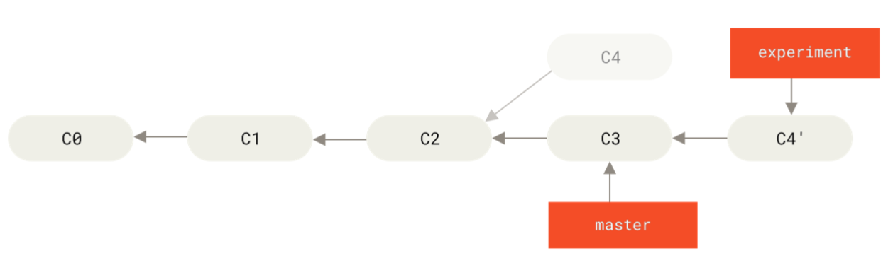
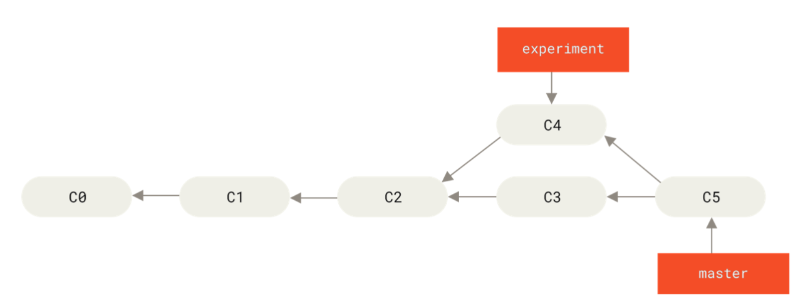

# learn [git](https://git-scm.com/book/zh/v2)

[toc]

- - - -
## 版本控制系统

什么是“版本控制”？我为什么要关心它呢？ 版本控制是一种记录一个或若干文件内容变化，以便将来查阅特定版本修订情况的系统。 在本书所展示的例子中，对保存着软件源代码的文件作版本控制，但实际上，可以对任何类型的文件进行版本控制。

如果你是位图形或网页设计师，可能会需要保存某一幅图片或页面布局文件的所有修订版本（这或许是你非常渴望拥有的功能），采用版本控制系统（VCS）是个明智的选择。 有了它你就可以将选定的文件回溯到之前的状态，甚至将整个项目都回退到过去某个时间点的状态，可以比较文件的变化细节，查出最后是谁修改了哪个地方，从而找出导致怪异问题出现的原因，又是谁在何时报告了某个功能缺陷等等。 使用版本控制系统通常还意味着，就算你乱来一气把整个项目中的文件改的改删的删，你也照样可以轻松恢复到原先的样子。 但额外增加的工作量却微乎其微。

### 本地版本控制系统

许多人习惯用复制整个项目目录的方式来保存不同的版本，或许还会改名加上备份时间以示区别。 这么做唯一的好处就是简单，但是特别容易犯错。 有时候会混淆所在的工作目录，一不小心会写错文件或者覆盖意想外的文件。

为了解决这个问题，人们很久以前就开发了许多种本地版本控制系统，大多都是采用某种简单的数据库来记录文件的历次更新差异。


Figure 1. 本地版本控制.

其中最流行的一种叫做 RCS，现今许多计算机系统上都还看得到它的踪影。 [RCS](https://www.gnu.org/software/rcs/) 的工作原理是在硬盘上保存补丁集（补丁是指文件修订前后的变化）；通过应用所有的补丁，可以重新计算出各个版本的文件内容。

### 集中化的版本控制系统

接下来人们又遇到一个问题，如何让在不同系统上的开发者协同工作？ 于是，集中化的版本控制系统（Centralized Version Control Systems，简称 CVCS）应运而生。 这类系统，诸如 CVS、Subversion 以及 Perforce 等，都有一个单一的集中管理的服务器，保存所有文件的修订版本，而协同工作的人们都通过客户端连到这台服务器，取出最新的文件或者提交更新。 多年以来，这已成为版本控制系统的标准做法。


Figure 2. 集中化的版本控制.

这种做法带来了许多好处，特别是相较于老式的本地 VCS 来说。 现在，每个人都可以在一定程度上看到项目中的其他人正在做些什么。 而管理员也可以轻松掌控每个开发者的权限，并且管理一个 CVCS 要远比在各个客户端上维护本地数据库来得轻松容易。

事分两面，有好有坏。 这么做最显而易见的缺点是中央服务器的单点故障。 如果宕机一小时，那么在这一小时内，谁都无法提交更新，也就无法协同工作。 如果中心数据库所在的磁盘发生损坏，又没有做恰当备份，毫无疑问你将丢失所有数据——包括项目的整个变更历史，只剩下人们在各自机器上保留的单独快照。 本地版本控制系统也存在类似问题，只要整个项目的历史记录被保存在单一位置，就有丢失所有历史更新记录的风险。

### 分布式版本控制系统

于是分布式版本控制系统（Distributed Version Control System，简称 DVCS）面世了。 在这类系统中，像 Git、Mercurial、Bazaar 以及 Darcs 等，客户端并不只提取最新版本的文件快照， 而是把代码仓库完整地镜像下来，包括完整的历史记录。 这么一来，任何一处协同工作用的服务器发生故障，事后都可以用任何一个镜像出来的本地仓库恢复。 因为每一次的克隆操作，实际上都是一次对代码仓库的完整备份。


Figure 3. 分布式版本控制.

更进一步，许多这类系统都可以指定和若干不同的远端代码仓库进行交互。籍此，你就可以在同一个项目中，分别和不同工作小组的人相互协作。 可以根据需要设定不同的协作流程，比如层次模型式的工作流，而这在以前的集中式系统中是无法实现的。

### 查看版本历史

```bash
git log --graph --decorate --all
```

## git 分支

远程引用是对远程仓库的引用（指针），包括分支、标签等等。 可以通过 `git ls-remote <remote>` 来显式地获得远程引用的完整列表， 或者通过 `git remote show <remote>` 获得远程分支的更多信息。 然而，一个更常见的做法是利用远程跟踪分支。

远程跟踪分支是远程分支状态的引用。它们是你无法移动的本地引用。一旦你进行了网络通信， Git 就会为你移动它们以精确反映远程仓库的状态。请将它们看做书签， 这样可以提醒你该分支在远程仓库中的位置就是你最后一次连接到它们的位置。

它们以 `<remote>/<branch>` 的形式命名。 例如，如果你想要看你最后一次与远程仓库 `origin` 通信时 `master` 分支的状态，可以查看 `origin/master` 分支。 你与同事合作解决一个问题并且他们推送了一个 `iss53` 分支，你可能有自己的本地 `iss53` 分支， 然而在服务器上的分支会以 `origin/iss53` 来表示。

这可能有一点儿难以理解，让来看一个例子。 假设网络里有一个在 `git.ourcompany.com` 的 Git 服务器。 如果你从这里克隆，Git 的 `clone` 命令会为你自动将其命名为 `origin`，拉取它的所有数据， 创建一个指向它的 `master` 分支的指针，并且在本地将其命名为 `origin/master`。 Git 也会给你一个与 origin 的 `master` 分支在指向同一个地方的本地 `master` 分支，这样你就有工作的基础。

| Note | “origin” 并无特殊含义远程仓库名字 “origin” 与分支名字 “master” 一样，在 Git 中并没有任何特别的含义一样。 同时 “master” 是当你运行 `git init` 时默认的起始分支名字，原因仅仅是它的广泛使用， “origin” 是当你运行 `git clone` 时默认的远程仓库名字。 如果你运行 `git clone -o booyah`，那么你默认的远程分支名字将会是 `booyah/master`。 |
| ---- | ------------------------------------------------------------ |
|      |                                                              |


Figure 30. 克隆之后的服务器与本地仓库

如果你在本地的 `master` 分支做了一些工作，在同一段时间内有其他人推送提交到`git.ourcompany.com` 并且更新了它的 `master` 分支，这就是说你们的提交历史已走向不同的方向。 即便这样，只要你保持不与 `origin` 服务器连接（并拉取数据）， `origin/master` 指针就不会移动。


Figure 31. 本地与远程的工作可以分叉

如果要与给定的远程仓库同步数据，运行 `git fetch <remote>` 命令（在本例中为 `git fetch origin`）。 这个命令查找 “origin” 是哪一个服务器（在本例中，它是 `git.ourcompany.com`）， 从中抓取本地没有的数据，并且更新本地数据库，移动 `origin/master` 指针到更新之后的位置。


Figure 32. `git fetch` 更新远程跟踪分支

为了演示有多个远程仓库与远程分支的情况，假定你有另一个内部 Git 服务器，仅服务于某个敏捷开发团队。 这个服务器位于 `git.team1.ourcompany.com`。 可以运行 `git remote add` 命令添加一个新的远程仓库引用到当前的项目，这个命令会在 [Git 基础](https://git-scm.com/book/zh/v2/ch00/ch02-git-basics-chapter) 中详细说明。 将这个远程仓库命名为 `teamone`，将其作为完整 URL 的缩写。


Figure 33. 添加另一个远程仓库

现在，可以运行 `git fetch teamone` 来抓取远程仓库 `teamone` 有而本地没有的数据。 因为那台服务器上现有的数据是 `origin` 服务器上的一个子集， 所以 Git 并不会抓取数据而是会设置远程跟踪分支 `teamone/master` 指向 `teamone` 的 `master` 分支。


Figure 34. 远程跟踪分支 `teamone/master`

### 推送（Push）

当你想要公开分享一个分支时，需要将其推送到有写入权限的远程仓库上。 本地的分支并不会自动与远程仓库同步——你必须显式地推送想要分享的分支。 这样，你就可以把不愿意分享的内容放到私人分支上，而将需要和别人协作的内容推送到公开分支。

如果希望和别人一起在名为 `serverfix` 的分支上工作，可以像推送第一个分支那样推送它。 运行 `git push <remote> <branch>`:

```shell
$ git push origin serverfix
Counting objects: 24, done.
Delta compression using up to 8 threads.
Compressing objects: 100% (15/15), done.
Writing objects: 100% (24/24), 1.91 KiB | 0 bytes/s, done.
Total 24 (delta 2), reused 0 (delta 0)
To https://github.com/schacon/simplegit
 * [new branch]      serverfix -> serverfix
```

这里有些工作被简化了。 Git 自动将 `serverfix` 分支名字展开为 `refs/heads/serverfix:refs/heads/serverfix`， 那意味着，“推送本地的 `serverfix` 分支来更新远程仓库上的 `serverfix` 分支。” 将会详细学习 [Git 内部原理](https://git-scm.com/book/zh/v2/ch00/ch10-git-internals) 的 `refs/heads/` 部分， 但是现在可以先把它放在儿。你也可以运行 `git push origin serverfix:serverfix`， 它会做同样的事——也就是说“推送本地的 `serverfix` 分支，将其作为远程仓库的 `serverfix` 分支” 可以通过这种格式来推送本地分支到一个命名不相同的远程分支。 如果并不想让远程仓库上的分支叫做 `serverfix`，可以运行 `git push origin serverfix:awesomebranch` 来将本地的 `serverfix` 分支推送到远程仓库上的 `awesomebranch` 分支。

| Note | 如何避免每次输入密码如果你正在使用 HTTPS URL 来推送，Git 服务器会询问用户名与密码。 默认情况下它会在终端中提示服务器是否允许你进行推送。如果不想在每一次推送时都输入用户名与密码，可以设置一个 “credential cache”。 最简单的方式就是将其保存在内存中几分钟，可以简单地运行 `git config --global credential.helper cache` 来设置它。想要了解更多关于不同验证缓存的可用选项，查看 [凭证存储](https://git-scm.com/book/zh/v2/ch00/_credential_caching)。 |
| ---- | ------------------------------------------------------------ |
|      |                                                              |

下一次其他协作者从服务器上抓取数据时，他们会在本地生成一个远程分支 `origin/serverfix`，指向服务器的 `serverfix` 分支的引用：

```shell
$ git fetch origin
remote: Counting objects: 7, done.
remote: Compressing objects: 100% (2/2), done.
remote: Total 3 (delta 0), reused 3 (delta 0)
Unpacking objects: 100% (3/3), done.
From https://github.com/schacon/simplegit
 * [new branch]      serverfix    -> origin/serverfix
```

要特别注意的一点是当抓取到新的远程跟踪分支时，本地不会自动生成一份可编辑的副本（拷贝）。 换一句话说，这种情况下，不会有一个新的 `serverfix` 分支——只有一个不可以修改的 `origin/serverfix` 指针。

可以运行 `git merge origin/serverfix` 将这些工作合并到当前所在的分支。 如果想要在自己的 `serverfix` 分支上工作，可以将其建立在远程跟踪分支之上：

```shell
$ git checkout -b serverfix origin/serverfix
Branch serverfix set up to track remote branch serverfix from origin.
Switched to a new branch 'serverfix'
```

这会给你一个用于工作的本地分支，并且起点位于 `origin/serverfix`。

### 跟踪分支

从一个远程跟踪分支检出一个本地分支会自动创建所谓的“跟踪分支”（它跟踪的分支叫做“上游分支”）。 跟踪分支是与远程分支有直接关系的本地分支。 如果在一个跟踪分支上输入 `git pull`，Git 能自动地识别去哪个服务器上抓取、合并到哪个分支。

当克隆一个仓库时，它通常会自动地创建一个跟踪 `origin/master` 的 `master` 分支。 然而，如果你愿意的话可以设置其他的跟踪分支，或是一个在其他远程仓库上的跟踪分支，又或者不跟踪 `master` 分支。 最简单的实例就是像之前看到的那样，运行 `git checkout -b <branch> <remote>/<branch>`。 这是一个十分常用的操作所以 Git 提供了 `--track` 快捷方式：

```shell
$ git checkout --track origin/serverfix
Branch serverfix set up to track remote branch serverfix from origin.
Switched to a new branch 'serverfix'
```

由于这个操作太常用了，该捷径本身还有一个捷径。 如果你尝试检出的分支 (a) 不存在且 (b) 刚好只有一个名字与之匹配的远程分支，那么 Git 就会为你创建一个跟踪分支：

```shell
$ git checkout serverfix
Branch serverfix set up to track remote branch serverfix from origin.
Switched to a new branch 'serverfix'
```

如果想要将本地分支与远程分支设置为不同的名字，可以轻松地使用上一个命令增加一个不同名字的本地分支：

```shell
$ git checkout -b sf origin/serverfix
Branch sf set up to track remote branch serverfix from origin.
Switched to a new branch 'sf'
```

现在，本地分支 `sf` 会自动从 `origin/serverfix` 拉取。

设置已有的本地分支跟踪一个刚刚拉取下来的远程分支，或者想要修改正在跟踪的上游分支， 可以在任意时间使用 `-u` 或 `--set-upstream-to` 选项运行 `git branch` 来显式地设置。

```shell
$ git branch -u origin/serverfix
Branch serverfix set up to track remote branch serverfix from origin.
```

| Note | 上游快捷方式当设置好跟踪分支后，可以通过简写 `@{upstream}` 或 `@{u}` 来引用它的上游分支。 所以在 `master` 分支时并且它正在跟踪 `origin/master` 时，如果愿意的话可以使用 `git merge @{u}` 来取代 `git merge origin/master`。 |
| ---- | ------------------------------------------------------------ |
|      |                                                              |

如果想要查看设置的所有跟踪分支，可以使用 `git branch` 的 `-vv` 选项。 这会将所有的本地分支列出来并且包含更多的信息，如每一个分支正在跟踪哪个远程分支与本地分支是否是领先、落后或是都有。

```shell
$ git branch -vv
  iss53     7e424c3 [origin/iss53: ahead 2] forgot the brackets
  master    1ae2a45 [origin/master] deploying index fix
* serverfix f8674d9 [teamone/server-fix-good: ahead 3, behind 1] this should do it
  testing   5ea463a trying something new
```

这里可以看到 `iss53` 分支正在跟踪 `origin/iss53` 并且 “ahead” 是 2，意味着本地有两个提交还没有推送到服务器上。 也能看到 `master` 分支正在跟踪 `origin/master` 分支并且是最新的。 接下来可以看到 `serverfix` 分支正在跟踪 `teamone` 服务器上的 `server-fix-good` 分支并且领先 3 落后 1， 意味着服务器上有一次提交还没有合并入同时本地有三次提交还没有推送。 最后看到 `testing` 分支并没有跟踪任何远程分支。

需要重点注意的一点是这些数字的值来自于你从每个服务器上最后一次抓取的数据。 这个命令并没有连接服务器，它只会告诉你关于本地缓存的服务器数据。 如果想要统计最新的领先与落后数字，需要在运行此命令前抓取所有的远程仓库。 可以像这样做：

```shell
$ git fetch --all; git branch -vv
```

### 拉取（pull）

当 `git fetch` 命令从服务器上抓取本地没有的数据时，它并不会修改工作目录中的内容。 它只会获取数据然后让你自己合并。 然而，有一个命令叫作 `git pull` 在大多数情况下它的含义是一个 `git fetch`紧接着一个 `git merge` 命令。 如果有一个像之前章节中演示的设置好的跟踪分支，不管它是显式地设置还是通过 `clone` 或 `checkout` 命令为你创建的，`git pull` 都会查找当前分支所跟踪的服务器与分支， 从服务器上抓取数据然后尝试合并入那个远程分支。

由于 `git pull` 的魔法经常令人困惑所以通常单独显式地使用 `fetch` 与 `merge` 命令会更好一些。

###  merge 与 rebase 的区别

>[merge 与 rebase 的区别](https://www.zhihu.com/question/36509119/answer/131513261)
>
>这个回答写的也不如官方文档准确清晰，其中下图中的C4'表示，这个commit并不是移动过来，而是一个新的commit id。但这改变了experiment这个分支的

* 下图rebase：



* 下图merge：



### 本地分支和远程分支的关系zx
```bash
# 查看分支关系
git branch -vv
```

#### 本地分支绑定远程分支
```bash
# 切换本地分支
git checkout 本地分支名

# 切换本地分支，如果本地没有，则新创建一个
git checkout -b 本地分支名

# 将本地分支与远程分支关联起来
git branch --set-upstream-to=origin/远程分支名 本地分支名
```

#### 删除远程分支

假设你已经通过远程分支做完所有的工作了——也就是说你和协作者已经完成了一个特性， 并且将其合并到了远程仓库的 `master` 分支（或任何其他稳定代码分支）。 可以运行带有 `--delete` 选项的 `git push` 命令来删除一个远程分支。 如果想要从服务器上删除 `serverfix` 分支，运行下面的命令：

```shell
$ git push origin --delete serverfix
To https://github.com/schacon/simplegit
 - [deleted]         serverfix
```

基本上这个命令做的只是从服务器上移除这个指针。 Git 服务器通常会保留数据一段时间直到垃圾回收运行，所以如果不小心删除掉了，通常是很容易恢复的。

#### 已经删除的远程分支本地依旧存在
```bash
git remote show origin

git remote prune origin
```

## git 框架---重置（reset）

### 重置揭密

在继续了解更专业的工具前，先探讨一下 Git 的 `reset` 和 `checkout` 命令。 在初遇的 Git 命令中，这两个是最让人困惑的。 它们能做很多事情，所以看起来很难真正地理解并恰当地运用它们。 针对这一点，先来做一个简单的比喻。

#### 三棵树

理解 `reset` 和 `checkout` 的最简方法，就是以 Git 的思维框架（将其作为内容管理器）来管理三棵不同的树。 “树” 在这里的实际意思是 “文件的集合”，而不是指特定的数据结构。 （在某些情况下索引看起来并不像一棵树，不过现在的目的是用简单的方式思考它。）

Git 作为一个系统，是以它的一般操作来管理并操纵这三棵树的：

| 树                | 用途                                 |
| :---------------- | :----------------------------------- |
| HEAD              | 上一次提交的快照，下一次提交的父结点 |
| Index             | 预期的下一次提交的快照               |
| Working Directory | 沙盒                                 |

#### HEAD

HEAD 是当前分支引用的指针，它总是指向该分支上的最后一次提交。 这表示 HEAD 将是下一次提交的父结点。 通常，理解 HEAD 的最简方式，就是将它看做 该分支上的最后一次提交 的快照。

其实，查看快照的样子很容易。 下例就显示了 HEAD 快照实际的目录列表，以及其中每个文件的 SHA-1 校验和：

```shell
$ git cat-file -p HEAD
tree cfda3bf379e4f8dba8717dee55aab78aef7f4daf
author Scott Chacon  1301511835 -0700
committer Scott Chacon  1301511835 -0700

initial commit

$ git ls-tree -r HEAD
100644 blob a906cb2a4a904a152...   README
100644 blob 8f94139338f9404f2...   Rakefile
040000 tree 99f1a6d12cb4b6f19...   lib
```

Git 的 `cat-file` 和 `ls-tree` 是底层命令，它们一般用于底层工作，在日常工作中并不使用。 不过它们能帮助了解到底发生了什么。

#### 索引

索引是 预期的下一次提交。 也会将这个概念引用为 Git 的“暂存区”，这就是当你运行 `git commit` 时 Git 看起来的样子。

Git 将上一次检出到工作目录中的所有文件填充到索引区，它们看起来就像最初被检出时的样子。 之后你会将其中一些文件替换为新版本，接着通过 `git commit` 将它们转换为树来用作新的提交。

```shell
$ git ls-files -s
100644 a906cb2a4a904a152e80877d4088654daad0c859 0	README
100644 8f94139338f9404f26296befa88755fc2598c289 0	Rakefile
100644 47c6340d6459e05787f644c2447d2595f5d3a54b 0	lib/simplegit.rb
```

再说一次，在这里又用到了 `git ls-files` 这个幕后的命令，它会显示出索引当前的样子。

确切来说，索引在技术上并非树结构，它其实是以扁平的清单实现的。不过对而言，把它当做树就够了。

#### 工作目录

最后，你就有了自己的 工作目录（通常也叫 工作区）。 另外两棵树以一种高效但并不直观的方式，将它们的内容存储在 `.git` 文件夹中。 工作目录会将它们解包为实际的文件以便编辑。 可以把工作目录当做 沙盒。在你将修改提交到暂存区并记录到历史之前，可以随意更改。

```shell
$ tree
.
├── README
├── Rakefile
└── lib
    └── simplegit.rb

1 directory, 3 files
```

#### 工作流程

经典的 Git 工作流程是通过操纵这三个区域来以更加连续的状态记录项目快照的。


让来可视化这个过程：假设进入到一个新目录，其中有一个文件。 称其为该文件的 v1 版本，将它标记为蓝色。 现在运行 `git init`，这会创建一个 Git 仓库，其中的 HEAD 引用指向未创建的 `master` 分支。


此时，只有工作目录有内容。

现在想要提交这个文件，所以用 `git add` 来获取工作目录中的内容，并将其复制到索引中。


接着运行 `git commit`，它会取得索引中的内容并将它保存为一个永久的快照， 然后创建一个指向该快照的提交对象，最后更新 `master` 来指向本次提交。


此时如果运行 `git status`，会发现没有任何改动，因为现在三棵树完全相同。

现在想要对文件进行修改然后提交它。 将会经历同样的过程；首先在工作目录中修改文件。 称其为该文件的 v2 版本，并将它标记为红色。


如果现在运行 `git status`，会看到文件显示在 “Changes not staged for commit” 下面并被标记为红色，因为该条目在索引与工作目录之间存在不同。 接着运行 `git add` 来将它暂存到索引中。


此时，由于索引和 HEAD 不同，若运行 `git status` 的话就会看到 “Changes to be committed” 下的该文件变为绿色 ——也就是说，现在预期的下一次提交与上一次提交不同。 最后，运行 `git commit` 来完成提交。


现在运行 `git status` 会没有输出，因为三棵树又变得相同了。

切换分支或克隆的过程也类似。 当检出一个分支时，它会修改 HEAD 指向新的分支引用，将 索引 填充为该次提交的快照， 然后将 索引 的内容复制到 工作目录 中。

### 重置的作用（reset）

在以下情景中观察 `reset` 命令会更有意义。

为了演示这些例子，假设再次修改了 `file.txt` 文件并第三次提交它。 现在的历史看起来是这样的：


让跟着 `reset` 看看它都做了什么。 它以一种简单可预见的方式直接操纵这三棵树。 它做了三个基本操作。

#### 第 1 步：移动 HEAD

`reset` 做的第一件事是移动 HEAD 的指向。 这与改变 HEAD 自身不同（`checkout` 所做的）；`reset`移动 HEAD 指向的分支。 这意味着如果 HEAD 设置为 `master` 分支（例如，你正在 `master` 分支上）， 运行 `git reset 9e5e6a4` 将会使 `master` 指向 `9e5e6a4`。


无论你调用了何种形式的带有一个提交的 `reset`，它首先都会尝试这样做。 使用 `reset --soft`，它将仅仅停在那儿。

现在看一眼上图，理解一下发生的事情：它本质上是撤销了上一次 `git commit` 命令。 当你在运行 `git commit` 时，Git 会创建一个新的提交，并移动 HEAD 所指向的分支来使其指向该提交。 当你将它 `reset`回 `HEAD~`（HEAD 的父结点）时，其实就是把该分支移动回原来的位置，而不会改变索引和工作目录。 现在可以更新索引并再次运行 `git commit` 来完成 `git commit --amend` 所要做的事情了（见 [修改最后一次提交](https://git-scm.com/book/zh/v2/ch00/_git_amend)）。

#### 第 2 步：更新索引（--mixed）

注意，如果你现在运行 `git status` 的话，就会看到新的 HEAD 和以绿色标出的它和索引之间的区别。

接下来，`reset` 会用 HEAD 指向的当前快照的内容来更新索引。


如果指定 `--mixed` 选项，`reset` 将会在这时停止。 这也是默认行为，所以如果没有指定任何选项（在本例中只是 `git reset HEAD~`），这就是命令将会停止的地方。

现在再看一眼上图，理解一下发生的事情：它依然会撤销一上次 `提交`，但还会 *取消暂存* 所有的东西。 于是，回滚到了所有 `git add` 和 `git commit` 的命令执行之前。

#### 第 3 步：更新工作目录（--hard）

`reset` 要做的的第三件事情就是让工作目录看起来像索引。 如果使用 `--hard` 选项，它将会继续这一步。


现在让回想一下刚才发生的事情。 你撤销了最后的提交、`git add` 和 `git commit` 命令 以及 工作目录中的所有工作。

必须注意，`--hard` 标记是 `reset` 命令唯一的危险用法，它也是 Git 会真正地销毁数据的仅有的几个操作之一。 其他任何形式的 `reset` 调用都可以轻松撤消，但是 `--hard` 选项不能，因为它强制覆盖了工作目录中的文件。 在这种特殊情况下，的 Git 数据库中的一个提交内还留有该文件的 v3 版本， 可以通过 `reflog` 来找回它。但是若该文件还未提交，Git 仍会覆盖它从而导致无法恢复。

#### 回顾（reset）

`reset` 命令会以特定的顺序重写这三棵树，在你指定以下选项时停止：

1. 移动 HEAD 分支的指向 *（若指定了 `--soft`，则到此停止）*
2. 使索引看起来像 HEAD *（若未指定 `--hard`，则到此停止）*
3. 使工作目录看起来像索引

### 通过路径来重置（reset）

前面讲述了 `reset` 基本形式的行为，不过你还可以给它提供一个作用路径。 若指定了一个路径，`reset`将会跳过第 1 步，并且将它的作用范围限定为指定的文件或文件集合。 这样做自然有它的道理，因为 HEAD 只是一个指针，你无法让它同时指向两个提交中各自的一部分。 不过索引和工作目录 *可以部分更新*，所以重置会继续进行第 2、3 步。

现在，假如运行 `git reset file.txt` （这其实是 `git reset --mixed HEAD file.txt` 的简写形式，因为你既没有指定一个提交的 SHA-1 或分支，也没有指定 `--soft` 或 `--hard`），它会：

1. 移动 HEAD 分支的指向 *（已跳过）*
2. 让索引看起来像 HEAD *（到此处停止）*

所以它本质上只是将 `file.txt` 从 HEAD 复制到索引中。


它还有 *取消暂存文件* 的实际效果。 如果查看该命令的示意图，然后再想想 `git add` 所做的事，就会发现它们正好相反。


这就是为什么 `git status` 命令的输出会建议运行此命令来取消暂存一个文件。 （查看 [取消暂存的文件](https://git-scm.com/book/zh/v2/ch00/_unstaging)来了解更多。）

可以不让 Git 从 HEAD 拉取数据，而是通过具体指定一个提交来拉取该文件的对应版本。 只需运行类似于 `git reset eb43bf file.txt` 的命令即可。


它其实做了同样的事情，也就是把工作目录中的文件恢复到 v1 版本，运行 `git add` 添加它， 然后再将它恢复到 v3 版本（只是不用真的过一遍这些步骤）。 如果现在运行 `git commit`，它就会记录一条“将该文件恢复到 v1 版本”的更改， 尽管并未在工作目录中真正地再次拥有它。

还有一点同 `git add` 一样，就是 `reset` 命令也可以接受一个 `--patch` 选项来一块一块地取消暂存的内容。 这样你就可以根据选择来取消暂存或恢复内容了。

#### 压缩

来看看如何利用这种新的功能来做一些有趣的事情——压缩提交。

假设一系列提交信息中有 “oops.”“WIP” 和 “forgot this file”， 聪明的你就能使用 `reset` 来轻松快速地将它们压缩成单个提交，也显出聪明。 （[压缩提交](https://git-scm.com/book/zh/v2/ch00/_squashing) 展示了另一种方式，不过在本例中用 `reset` 更简单。）

假设你有一个项目，第一次提交中有一个文件，第二次提交增加了一个新的文件并修改了第一个文件，第三次提交再次修改了第一个文件。 由于第二次提交是一个未完成的工作，因此你想要压缩它。


那么可以运行 `git reset --soft HEAD~2` 来将 HEAD 分支移动到一个旧一点的提交上（即你想要保留的最近的提交）：


然后只需再次运行 `git commit`：


现在可以查看可到达的历史，即将会推送的历史，现在看起来有个 v1 版 `file-a.txt` 的提交， 接着第二个提交将 `file-a.txt` 修改成了 v3 版并增加了 `file-b.txt`。 包含 v2 版本的文件已经不在历史中了。

#### 检出（check out）

最后，你大概还想知道 `checkout` 和 `reset` 之间的区别。 和 `reset` 一样，`checkout` 也操纵三棵树，不过它有一点不同，这取决于你是否传给该命令一个文件路径。

##### 不带路径

运行 `git checkout [branch]` 与运行 `git reset --hard [branch]` 非常相似，它会更新所有三棵树使其看起来像 `[branch]`，不过有两点重要的区别。

首先不同于 `reset --hard`，`checkout` 对工作目录是安全的，它会通过检查来确保不会将已更改的文件弄丢。 其实它还更聪明一些。它会在工作目录中先试着简单合并一下，这样所有_还未修改过的_文件都会被更新。 而 `reset --hard` 则会不做检查就全面地替换所有东西。

第二个重要的区别是 `checkout` 如何更新 HEAD。 `reset` 会移动 HEAD 分支的指向，而 `checkout` 只会移动 HEAD 自身来指向另一个分支。

例如，假设有 `master` 和 `develop` 分支，它们分别指向不同的提交；现在在 `develop` 上（所以 HEAD 指向它）。 如果运行 `git reset master`，那么 `develop` 自身现在会和 `master` 指向同一个提交。 而如果运行 `git checkout master` 的话，`develop` 不会移动，HEAD 自身会移动。 现在 HEAD 将会指向 `master`。

所以，虽然在这两种情况下都移动 HEAD 使其指向了提交 A，但_做法_是非常不同的。 `reset` 会移动 HEAD 分支的指向，而 `checkout` 则移动 HEAD 自身。


##### 带路径

运行 `checkout` 的另一种方式就是指定一个文件路径，这会像 `reset` 一样不会移动 HEAD。 它就像 `git reset [branch] file` 那样用该次提交中的那个文件来更新索引，但是它也会覆盖工作目录中对应的文件。 它就像是 `git reset --hard [branch] file`（如果 `reset` 允许你这样运行的话）， 这样对工作目录并不安全，它也不会移动 HEAD。

此外，同 `git reset` 和 `git add` 一样，`checkout` 也接受一个 `--patch` 选项，允许你根据选择一块一块地恢复文件内容。

### 总结

希望你现在熟悉并理解了 `reset` 命令，不过关于它和 `checkout` 之间的区别，你可能还是会有点困惑，毕竟不太可能记住不同调用的所有规则。

下面的速查表列出了命令对树的影响。 “HEAD” 一列中的 “REF” 表示该命令移动了 HEAD 指向的分支引用，而 “HEAD” 则表示只移动了 HEAD 自身。 特别注意 *WD Safe?* 一列——如果它标记为 NO，那么运行该命令之前请考虑一下。

|                             | HEAD | Index | Workdir | WD Safe? |
| :-------------------------- | :--- | :---- | :------ | :------- |
| Commit Level            |      |       |         |          |
| `reset --soft [commit]`     | REF  | NO    | NO      | YES      |
| `reset [commit]`            | REF  | YES   | NO      | YES      |
| `reset --hard [commit]`     | REF  | YES   | YES     | NO   |
| `checkout <commit>`         | HEAD | YES   | YES     | YES      |
| File Level              |      |       |         |          |
| `reset [commit] <paths>`    | NO   | YES   | NO      | YES      |
| `checkout [commit] <paths>` | NO   | YES   | YES     | NO   |

## 常用指令


git往往被误解为"github"，但其实这是有问题的，其实git repository就是在本地，甚至可以把github上的远程仓库就理解为另一台电脑上的"本地"仓库，这时就会理解为什么本地做了commit，可是github的远程仓库没有更新，而git push之后，github却显示有一个commit，因为push这个动作就是commit"另一台电脑"的repository，这台电脑就是GitHub服务器。

所有git的强大不仅是它可以同步远程仓库，更是因为仅仅在本地，它的repository、staging area、working directory组成了强大的文件版本管理系统。这一切的奥秘，都在.git文件夹中。

[git 讲解](https://www.jianshu.com/p/e57a4a2cf077)

### 配置（conf）

global配置文件一般在$HOME/.gitconfig文件中保存，甚至可以不需要使用指令，仅创建并修改这个文件，就可以达成同样的效果，因为一切皆文件。

#### 代理（proxy）

```bash
# 指令
git config --global http.proxy socks5://127.0.0.1:1086 #设置代理
git config --global --unset http.proxy	#取消代理
```
#### 配置（config）

```bash
#windows选择sublime为默认编辑器
git config --global core.editor "C:/Program Files/Sublime Text 3/sublime_text.exe' -n -w"

#配置账号
git config --global user.name "waaall"
git config --global user.email "@gmail.com"

#设置git status显示中文
git config --global core.quotepath false

git config --system --list  #看git系统信息
git config --global  --list #看当前用户信息
git config --local  --list  #看当前仓库信息
```

#### [免密登录](https://docs.github.com/en/free-pro-team@latest/github/using-git/caching-your-github-credentials-in-git)

```bash
git config --global credential.helper osxkeychain #Mac

git config --global credential.helper cache #Linux，暂存密码
git config --global credential.helper store #Linux，密码放在 ~/.git-credentials
```

2021年不再适用GitHub，其使用Personal access Token来部分替代密码，具体见[官方文档](https://docs.github.com/en/github/authenticating-to-github/keeping-your-account-and-data-secure/creating-a-personal-access-token)。

But！ Github只是用Token码来代替密码，所以只需要将~/.git-credentials中的密码改成token码就ok，就像下图这样：


然后Mac是用的osxkeychain来管理嘛，所以打开“钥匙串”，搜索git，就会有下图这个：


就是这个kind为internet password的这个，然后在show password这里修改为token码即可。

#### git[忽略文件](https://git-scm.com/book/en/v2/Git-Basics-Recording-Changes-to-the-Repository#_ignoring)

1. 全局忽略

忽略mac中的`.DS_Store`文件方法见下：

```shell
touch ~/.gitignore_global
```

然后对这个文件进行修改。

```
# Mac OS
/.DS_Store
```

然后对git进行全局设置，让git忽略.gitignore_global中的所有文件：

```shell
git config --global core.excludesfile ~/.gitignore_global
```

这样就不用每个git目录都设置忽略.DS_Store文件了！

2. 局部忽略

```shell
git rm --cached yourfile	#实际文件没有删，只是不再使用git管理
vim .gitignore
```

然后对这个文件进行修改。

```shell
# 忽略 .a 文件
*.a
# 但否定忽略 lib.a, 尽管已经在前面忽略了 .a 文件
!lib.a
# 仅在当前目录下忽略 TODO 文件， 但不包括子目录下的 subdir/TODO
/TODO
# 忽略 build/ 文件夹下的所有文件
build/
# 忽略 doc/notes.txt, 不包括 doc/server/arch.txt
doc/*.txt
# 忽略所有的 .pdf 文件 在 doc/ directory 下的
doc//*.pdf
```

#### 初始化（init）/ 克隆（clone）

```shell
git init  #将所在文件夹初始化为一个git repository，也就是创建了.git文件夹

#将该git远程仓库克隆到本地
git clone https://github.com/waaall/computer-tips.git
git clone -o mygit https://github.com/waaall/computer-tips.git #指定远程主机名叫mygit，默认为origin
```

### 提交（commit）/ 推送（[push](http://www.ruanyifeng.com/blog/2014/06/git_remote.html)）

```shell
git add FILENAME
git add .	#添加所有更改

git commit
git commit -m "some info"
git commit -a	#-a或--amend 提交修改，也就是修改过的文件不需要add，但是新创建的文件，还是要add再commit
git commit -a -m "some info"

git push <远程主机名> <本地分支名>:<远程分支名>
#如果省略远程分支名，则表示将本地分支推送与之存在"追踪关系"的远程分支（通常两者同名），如果该远程分支不存在，则会被新建。
git push	#（这其实 = git push origin master）也就是push到远程主机->默认分支中，并合并，省略了远程分支名

#删除远程仓库：基本上这个命令做的只是从服务器上移除这个指针。 Git 服务器通常会保留数据一段时间直到垃圾回收运行，所以如果不小心删除掉了，通常是很容易恢复的
git push origin --delete master
git push origin :master		#与上面指令一个意思
```

### 状态（status）/历史（log）/差异（diff）

```shell
git status 	#查看当前git仓库状态

git log -p -1	#-p或--patch：会显示每次提交所引入的差异（按补丁的格式输出），使用 -1 选项来只显示最近的一次提交

git diff <filename>             #查看working Direct 和 staging area的区别
git diff --cached <filename>    #查看staging area 和 repository的区别
git diff <commit> <filename>    #查看working Direct 和 repository的区别
```

### 分支（branch）/ 合并（merge）

```shell
git branch	#查看当前本地分支

git branch branchname #创建一个新的分支名为branchname
git checkout branchname #切换到分支
git checkout -b branchname	#（这其实 = 上两条指令）

git branch -r
git branch -a
git branch -d branchname #删除分支
git branch -vv	#将所有的本地分支列出来，并且显示每一个分支正在跟踪哪个远程分支与本地分支是否是领先、落后或是都有

git merge branchname #将branchname分支与当前所在分支合并
```

### 撤销（reset）/ 检出（checkout）

```shell
git reset --soft file.txt	#（这其实 = git reset --soft HEAD file.txt)仅改变了HEAD指针，也就是本地repository
git reset file.txt  		#（这其实 = git reset --mixed HEAD file.txt)同时改变了Index，也就是stage

git reset --hard file.txt 	# 这把Working Directory改变了，很难重置，慎用！！！

```

### 远程（remote）

```shell
git remote		#列出所有远程主机
git remote -v	#列出远程主机的网址
git remote add <主机名> <网址>	#添加远程主机
git remote rm <主机名>			 #删除远程主机
git remote rename <原主机名> <新主机名>	#重命名
```

### 抓取（fetch）/ 拉取（[pull](http://www.ruanyifeng.com/blog/2014/06/git_remote.html)）

```shell
git fetch <远程主机名> <分支名>
git fetch <远程主机名>	#取回此远程主机所有branch的更新
git fetch #（这其实 = git fetch origin master）一般情况下

git pull  #（这其实 = git fetch + git merge）查找当前分支所跟踪的服务器与分支， 从服务器上抓取数据然后尝试合并入那个远程分支
```

#### zsh 常用alias

```bash
# Zsh Alias	Command
g	    git
ga	    git add
gaa	git add --all
gapa	git add --patch
gb	    git branch
gba	git branch -a
gbl	git blame -b -w
gbnm	git branch --no-merged
gbr	git branch --remote
gbs	git bisect
gbsb	git bisect bad
gbsg	git bisect good
gbsr	git bisect reset
gbss	git bisect start
gc	    git commit -v
gc!	git commit -v --amend
gca	git commit -v -a
gcam	git commit -a -m #-a表示all，等同于把所有文件先add再commit
gca!	git commit -v -a --amend
gcan!	git commit -v -a -s --no-edit --amend
gcb	git checkout -b
gcf	git config --list
gcl	git clone --recursive
gclean	git clean -df
gcm	git checkout master
gcd	git checkout develop
gcmsg	git commit -m
gco	git checkout
gcount	git shortlog -sn
gcp	git cherry-pick
gcpa	git cherry-pick --abort
gcpc	git cherry-pick --continue
gcs	git commit -S
gd	git diff
gdca	git diff --cached
gdt	git diff-tree --no-commit-id --name-only -r
gdw	git diff --word-diff
gf	git fetch
gfa	git fetch --all --prune
gfo	git fetch origin
gg	git gui citool
gga	git gui citool --amend
ghh	git help
ggpull	ggl
ggpur	ggu
ggpush	ggp
ggsup	git branch --set-upstream-to = origin/$(current_branch)
gpsup	git push --set-upstream origin $(current_branch)
gignore	git update-index --assume-unchanged
git-svn-dcommit-push	git svn dcommit && git push github master:svntrunk
gk	\gitk --all --branches
```

#### git命令的区别
1.[git clone/git pull/git fetch/git merge/get init 的区别](https://www.cnblogs.com/lalalagq/p/9968949.html)

### git commit message 的规范

* [Commit message 和 Change log 编写指南](https://www.ruanyifeng.com/blog/2016/01/commit_message_change_log.html)


## 常用流程

### remote

```bash
git remote -v

git remote remove origin # origin也有可能是别的，注意区分

git remote add origin https://github.com/waaall/gd32-template.git

git push -u origin main
```

### branch
```bash
git branch -a

git branch -d 要删除的分支

# 切换到已有分支
git switch BareMetal
```

### checkout

#### 1. 切换分支
```bash
git checkout main           # 切换到main分支
git checkout BareMetal      # 切换到BareMetal分支
git checkout -b new-branch  # 创建并切换到新分支
```

#### 2. 检出特定提交
```bash
git checkout 962e657        # 切换到特定提交（detached HEAD状态）
git checkout HEAD~1         # 切换到上一个提交
git checkout tags/v1.0      # 切换到特定标签
```

#### 3. diff
```bash
# 查看main和feature分支的不同
git diff main..feature

# 查看main和feature分支的不同（只看文件名）
git diff --name-only main..feature
```

#### 4. 从其他分支获取文件
```bash
git checkout main -- scripts/file_encoding_fixer.py    # 从main分支获取特定文件
git checkout HEAD~1 -- file.txt                        # 从上一个提交获取文件
git checkout other-branch -- folder/                   # 从其他分支获取整个文件夹
```

#### 5. 恢复工作区文件
```bash
git checkout -- file.txt       # 丢弃工作区中file.txt的修改
git checkout .                  # 丢弃所有工作区修改
git checkout HEAD -- file.txt  # 从最新提交恢复文件
```

### commit & push


```bash
git commit -m "更新信息简要写"

git push <远程主机名> <本地分支名>:<远程分支名>

git push --force-with-lease origin BareMetal
```

### fetch & merge (pull)
```bash

```

### pull request
执行 `git push -u origin BareMetal` 时，GitHub检测到：

1. 新分支创建：您推送了一个远程仓库中不存在的新分支（BareMetal）
2. GitHub的自动提示：GitHub会自动提示您是否要创建Pull Request，这是GitHub的标准行为

让我查看一下当前的分支情况：

```bash
➜  gd32-f470-vi-template git:(BareMetal) git log --oneline --graph --all -10

* 50b6c2c (HEAD -> BareMetal, origin/BareMetal) merge main encoding python scripts
| * aa17d41 (origin/main, main) add a advanced encoding tool！
| * 9289d19 move to backup dir
| * 49239e1 backup vscode config file
| * 0a2ac19 add rtos tips to README
| * 586e30a remove cmsis_os & fix all bugs & move SysTick_Handler from systick.c to gd32f4xx_it.c
| * 898efff fix Core codes and makefile
| * c0276fb add FreeRTOS sources
|/  
* 962e657 add a bash script to convert to utf8
```
#### 什么是Pull Request？
Pull Request（PR）是一个合并请求，用于：
- 将一个分支的更改合并到另一个分支
- 进行代码审查
- 讨论更改内容
- 确保代码质量

#### 为什么会出现PR提示？
从提交图可以看出：
1. BareMetal分支：当前在 `50b6c2c` 提交（包含了从main合并的encoding脚本）
2. main分支：在 `aa17d41` 提交
3. 分支分歧：两个分支从 `962e657` 开始分叉

GitHub检测到：
- BareMetal分支有main分支没有的提交（`50b6c2c`）
- 这些更改可能需要合并回main分支

#### 为什么说"分支很乱"？
当您创建PR并合并时，可能发生：

1. 合并提交：创建额外的merge commit
2. 历史复杂化：线性历史变成分叉历史
3. 重复提交：相同的更改在不同分支中出现

#### 如何避免"分支混乱"？

#### 方案1：不创建PR（如果不需要合并）
如果BareMetal是独立分支，不需要合并到main：
```bash
# 什么都不做，忽略GitHub的PR提示
```

#### 方案2：线性历史（如果需要同步）
使用rebase而不是merge：
```bash
git checkout main
git rebase BareMetal  # 将BareMetal的更改应用到main
```

#### 方案3：选择性合并特定文件
```bash
git checkout main
git checkout BareMetal -- scripts/  # 只合并scripts文件夹
git commit -m "Update scripts from BareMetal"
```

BareMetal只有一个额外的提交 `50b6c2c`，是合并main分支encoding脚本的提交。

1. 不要创建PR - 因为这只是您从main合并文件到BareMetal，不需要反向合并
2. 保持分支独立 - BareMetal作为独立的开发分支
3. 忽略GitHub的PR提示 - 这只是GitHub的自动建议，您可以忽略

这样可以保持分支历史清晰，避免不必要的复杂性。
```bash

```

### rm / reset
```bash
# 删除当前目录下的 该文件
git rm --cached 文件名

# 慎用！ 强制回到之前这个commit状态。
git reset --hard 962e657-commitid

# 删除远程的 test 分支
git push origin --delete test

# 清理本地的远程分支引用
git remote prune origin
```


## Git Submodule


### 1. Submodule 原因

当一个仓库需要依赖另一个仓库的代码时，常见做法有三种：

1. 直接复制代码进来（缺点：难同步、难追踪来源）
    
2. 单体仓库（monorepo）（缺点：治理成本、权限和发布粒度）
    
3. Submodule：父仓库把依赖仓库作为“子仓库引用”挂载进来，并且固定到某个提交（优点：依赖可追溯、可锁定版本、父子仓库保持独立）
    
Submodule 的核心思想是：

父仓库并不真正“包含”子仓库的历史，它只记录子仓库的 URL、路径，以及子仓库当前指向的提交 SHA。

---

### 2. Submodule 信息

Submodule 在父仓库侧主要涉及三类信息：


它存放在父仓库根目录，记录子模块的路径与远程 URL，例：

```
[submodule "libs/foo"]
  path = libs/foo
  url = git@github.com:org/foo.git
```

要点：

- .gitmodules 会提交到父仓库，因此它是团队一致性的来源
    
- path 是子模块在父仓库工作区里的挂载目录
    
- url 是子模块远程地址（可 https、ssh、相对路径）
    
#### 2.1 父仓库的索引(index)里有一个"gitlink"

父仓库并不把子仓库文件归档进自己对象库，而是在父仓库的 tree/index 里存一个特殊条目：

- 模式（mode）：160000
- 内容：子模块仓库的提交 SHA

可以用下面命令看到这种条目：
```bash
git ls-tree HEAD libs/foo
```

典型输出会类似：
```
160000 commit a1b2c3d4e5f6...    libs/foo
```

这表示：父仓库当前提交指向的子模块 libs/foo 应该处在 a1b2c3... 这个提交上。


当你在本地初始化 submodule 后，Git 会把子模块信息写入父仓库的 .git/config，用于本地操作（例如 URL 覆盖、分支跟踪等）。

---

### 3. 子模块的 Git 数据在哪

很多人以为子模块目录里会有一个 .git 目录，实际上从较新的 Git 版本开始，子模块工作区里的 .git 通常是一个文件，内容指向真正的 git 数据目录，例如：

libs/foo/.git 可能是：

```
gitdir: ../../.git/modules/libs/foo
```

而真正的 git metadata 在父仓库这里：

```
.git/modules/libs/foo/
```

理解这一点很重要：

- 子模块并不是一个“独立的顶层仓库目录结构”，它的 git 数据被集中管理在父仓库 .git/modules/... 下
    
- 因此复制子模块工作区目录并不能完整复制其 git 元数据，正确做法仍然是通过 git 获取
    
---

### 4. Submodule 设置

#### 4.1 添加子模块

```bash
git submodule add git@github.com:org/foo.git libs/foo
```

这一步会做三件事：

1. 在工作区创建目录 libs/foo 并拉取子仓库
    
2. 生成或更新 .gitmodules
    
3. 在父仓库 index 里增加一个 gitlink（160000 + 子模块当前 HEAD SHA）
    
然后你需要提交父仓库的变更：

```bash
git add .gitmodules libs/foo
git commit -m "Add submodule foo at libs/foo"
```

注意：提交后父仓库只锁定了 foo 的某个提交 SHA，并不锁定“分支名”。

---

### 5. Submodule 安装

Submodule 常见的“安装”指：克隆父仓库后，把子模块也初始化并拉取到正确版本。

#### 5.1 一条命令递归拉取

```bash
git clone --recurse-submodules <parent-repo-url>
```

它相当于：克隆父仓库后，自动对所有子模块执行 init + update，并递归处理嵌套子模块。

#### 5.2 已经克隆了父仓库，补拉子模块

```bash
git submodule update --init --recursive
```

说明：

- --init：根据 .gitmodules 初始化本地配置
    
- --recursive：如果子模块里还有子模块，继续拉取
    
#### 5.3 只更新到父仓库指定的提交

Submodule 默认是“按父仓库锁定的 SHA”检出，因此子模块会处在 detached HEAD 状态，这是正常的。

---

### 6. 日常使用指令

#### 6.1 父仓库如何升级子模块版本

假设你想把子模块升级到它仓库的最新提交：

```bash
cd libs/foo
git fetch
git checkout main
git pull
```

然后回到父仓库，父仓库会检测到子模块指针变化：

```bash
cd ../..
git status
# 会显示 libs/foo 有 “new commits”
git add libs/foo
git commit -m "Bump foo submodule"
```

关键点：

父仓库真正提交的是“子模块指针 SHA 的变化”。

#### 6.2 在子模块里开发并把改动推到子模块远程

子模块是独立仓库，可以在其内正常 commit/push：

```bash
cd libs/foo
git checkout -b feature/x
# 修改代码
git add .
git commit -m "Implement X"
git push -u origin feature/x
```

然后回父仓库更新指针并提交父仓库：

```bash
cd ../..
git add libs/foo
git commit -m "Update foo submodule to include feature/x"
```

#### 6.3 detached HEAD 的正确处理方式

当你 git submodule update 后，子模块通常 detached HEAD。如果你要在子模块上开发，请显式切到分支：

```bash
cd libs/foo
git checkout main   # 或新建分支
```

---

#### 6.4 进阶： 跟踪子模块分支与一键更新

可以写入 .gitmodules 的 branch 字段（需要团队共识）：

```bash
[submodule "libs/foo"]
  path = libs/foo
  url = git@github.com:org/foo.git
  branch = main
```

然后在父仓库执行：

```bash
git submodule sync --recursive
```

更新到该分支的最新提交（而不是父仓库锁定的 SHA）：

```bash
git submodule update --remote --recursive
```

注意：这会把子模块推进到远程分支最新提交，随后仍需要在父仓库提交新的指针 SHA 才能对团队生效。

---
### 7. 如何正确移除 Submodule

假设要移除 libs/foo：

```bash
git submodule deinit -f -- libs/foo
git rm -f libs/foo
rm -rf .git/modules/libs/foo
```

然后提交：

```bash
git commit -m "Remove submodule foo"
```

同时检查 .gitmodules 中对应条目是否已移除（git rm 通常会处理，但仍建议确认）。

### 8. 常见坑与排错指南

#### 8.1 忘记提交 


症状：别人拉仓库后子模块信息不全。

修复：确保 .gitmodules 与子模块路径一起被 git add 并提交。

#### 8.2 子模块目录不为空导致 add/checkout 失败

处理：清理目录或用正确命令初始化，不要手动拷贝文件混入子模块目录。

#### 8.3 URL 改了但别人拉不到

改 .gitmodules 后需要：

```bash
git submodule sync --recursive
git submodule update --init --recursive
```

#### 8.4 CI 环境忘了拉子模块

在 CI 脚本里加：

```bash
git submodule update --init --recursive
```

或 clone 时用 --recurse-submodules。

#### 8.5 子模块提交丢失（远端做了 force push、GC 或权限问题）

父仓库锁定的 SHA 在远端找不到会导致 update 失败。

这是 Submodule 最大的治理风险之一：被引用的提交必须长期可用。建议：

- 子模块仓库禁止强推主分支
    
- 重要版本打 tag
    
- 做好权限与镜像策略
    
#### 8.6 安全提示：不信任的 submodule URL

如果父仓库来自不可信来源，submodule URL 可能指向恶意仓库，递归拉取会下载其内容。实践上应：

- 审核 .gitmodules 的 URL
    
- 在自动化环境中限制网络访问或使用 allowlist
    
---


---

## 问题

### crlf 和 lf

Windows 和 Linux/Mac 的换行符不一样。Windows 使用 CRLF(\r\n),而 Linux/Mac 使用 LF(\n)。

Git 在 Windows 版本中提供了 autoCRLF 功能。Git 仓库默认使用 LF,当在 Windows 系统上时,文件使用 CRLF,提交时 Git 会自动转换为 LF。

在windows版就出了一个功能叫autoCRLF。意思就是你的get仓库默认都是LF的，然后每次你windows系统上的你那些文件都是CRLF的，你提交的get它有换成LF

但是不知道怎么登掉我的windows之前设置过设置了一个什么东西，反正就是瞎了，导致他提交CRLF。

这时候就非常麻烦了，就是之前的文件都是CRF的，然后我的Mac上文件是L F的，就乱七八糟他那边改了之后又重新生成又是C的，然后就乱七八糟。

1. 设置好global autocrlf

mac/Linux用input或者不设置；Windows用auto
```bash
# windows
git ignore
```

2. 添加.gitattributes
```text
# 默认使用 LF
* text eol=lf

# 对于 Windows 批处理或脚本允许 CRLF
*.bat text eol=crlf
*.cmd text eol=crlf
```

3. 重置git仓库
```bash
git add —- renormalize .
git add .
```

4. 提交修改
```bash
git commit -m "change crlf to lf"
```

5. 本地文件修改

就是当你及时给他都提交了的时候，他本地的文件有的没有更改，这时候你就得：

```bash
git rm —cached .
git reset --hard HEAD
```
