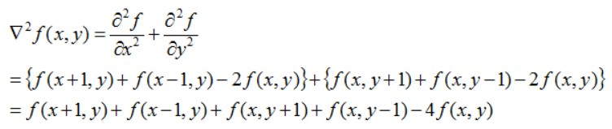

## 图像处理

[opencv学习](http://codec.wang/#/opencv/)、

### 图像的卷积

为什么图像做卷积运算物理意义和卷积本身有分歧，因为用卷积核矩阵对其运算本身是对一个二元函数做拉普拉斯算子的结果，也就是其表征了二元函数的导数/二阶导数！这当然也就表征了像素值的变化强度，而这自然就是图像边缘了。

但这只是卷积的一种一方面应用，我们可以调整卷积核，这样就可以是其有不同的意义，实现不同的功能，比如可以反其道行之：让图像变模糊，也就是去边缘化（大致就是卷积核数值分布反过来，就可以弱化“梯度”大的位置的像素值，从而达到模糊的效果）

